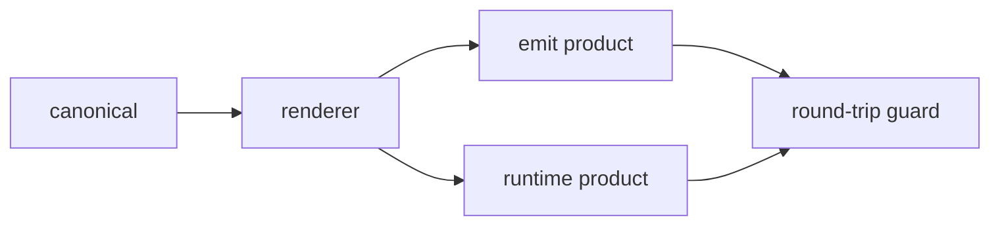

# Data-driven Templates

> **Scope:** every template-shaped content — text that is data-izable, referenced by multiple consumers, and drift-prone. Large to small: `packages/cdd-engine/templates/template-contract.json`, `packages/cdd-engine/src/infra/harness-registry.json`, `packages/osuperpowers/skills/report-issues/templates/finding-meta.json` and `.github/ISSUE_TEMPLATE/*.yml`, down to emit-derived marketplace manifests (`.claude-plugin/`, `.cursor-plugin/`, `marketplace/source.json`). This is the methodological contract (AC12); the objects it governs are not limited to the Exemplars table below.

Cross-cutting reference: the single-source-of-truth convention for template body text. Cited when a new skill introduces template body text, when an existing template-shaped content is consolidated, and when emit-derived products need drift guarding.

## 1. Digraph

### 1.1 Convention: Canonical → Renderer → Products → Round-trip Guard

The template lifecycle collapses into a five-node chain — a single source of truth forks through one renderer into two product channels (emit-committed products + runtime-composed products), closed by a round-trip guard:

## 2. Node Definitions

### 2.1 `canonical`

- **Do**: the single source of truth for template body text (structured data, e.g. JSON). Every body shape — prose sections, enumerations, labels, form field definitions, paragraph render order — converges here; nothing is scattered across consumers.
- **Read**: the per-consumer field requirements (the render contract established during review/spec).
- **Exit**: consumed by `renderer`; enters the render channel.
- **Fail**: a body shape missing from the canonical → the render truncates or uses a fallback; the maintainer must edit the canonical, never patch the consumer (Rules R1 / Failure Modes "dual-source divergence").

### 2.2 `renderer`

- **Do**: a single pure function renders the canonical into derived products; body paragraph structure (headings, paragraph order, escaping, EOF) is assembled by the renderer — agents/humans do not hand-assemble it.
- **Read**: `canonical` only (never an md copy, never hardcoded literals).
- **Exit**: called at emit time → `emit product`; at runtime → `runtime product`.
- **Fail**: the renderer hardcodes body text or consumes a non-canonical source → violates R1/R2; review must correct it.

### 2.3 `emit product`

- **Do**: derived products committed to the repo (harness marketplace manifests, `.github/ISSUE_TEMPLATE/*.yml`), produced only by `pnpm run emit`; every path is registered in `generatedPaths`.
- **Read**: `renderer` output.
- **Exit**: `pnpm run emit:check` drift=0 → committable; drift>0 → re-run `pnpm run emit` then commit.
- **Fail**: hand-editing the derived product without touching the canonical → overwritten at next emit + emit:check drift → CI failure (Failure Modes "hand-edited product").

### 2.4 `runtime product`

- **Do**: products combined by the renderer at runtime and not committed (e.g. finding comment, session master body).
- **Read**: `renderer` output (external harnesses via a CLI contract: stdin JSON → stdout).
- **Exit**: consumed directly by the consumer side.
- **Fail**: runtime bypasses the renderer and hand-assembles sections → paragraph structure drifts from the canonical (Failure Modes "consumer-unusable").

### 2.5 `round-trip guard`

- **Do**: the anti-drift closure, run in two stages: ① first render diffs empty against the existing product (transitional assertion — verifies a new renderer faithfully reproduces the status quo; removed from the test set once stage ② lands); ② content migration (e.g. privacy rework / copy adjustments) is one independent step that re-renders and commits.
- **Exit**: ① and ② pass and `pnpm run emit:check` drift=0 → terminal state; any failure → fix canonical/renderer, then regress.
- **Fail**: the transitional stage-① diff-empty assertion lingers in the terminal test set → test burden, must be removed; `emit:check` drift>0 → blocks merge.

## 3. Rules

- **R1 Single source of truth** — template body text has exactly one canonical; consumers hold zero hardcoded copies. Enumerations, labels, paragraph order, and form-name sets are all canonical-driven (name sets use `Object.keys(canonical)`, no second literal list).
- **R2 Renderer determinism** — the renderer is a pure function: same canonical in, constant output out. Body paragraph structure (headings, punctuation, escaping, EOF) is decided by the renderer, not by copy-paste.
- **R3 Derived products are emit-generated** — derived products are produced and committed only by `pnpm run emit`; every product path is registered in `generatedPaths`, with `pnpm run emit:check` as the CI-slung drift guard (drift=0).
- **R4 Two-stage round-trip** — migration-type changes run a two-stage verification: ① first render diffs empty (transitional; removed after stage ②); ② content migration re-renders and commits in one independent step; the terminal state is guarded by the standing `emit:check` drift=0.
- **R5 Consumer-side usable** — derived products are consumable in the consumer environment (GitHub form yml, plugin manifests); no monorepo layout or this-repo toolchain dependency.

## 4. Invariants

| # | Invariant |
|---|---|
| I1 | canonical locatable — canonical path is fixed and greppable; the same template body has no md copy in the repo (`grep` hits only the canonical and the renderer) |
| I2 | renderer single point — each derived-product class has exactly one renderer function; no second assembly path |
| I3 | `pnpm run emit:check` drift=0 — standing guard; must pass in CI and before local commit |
| I4 | derived products never hand-edited — editing a product = overwritten at next emit + CI drift; any change goes through canonical → emit |

## 5. Failure Modes

| failure | behavior | reason |
|---|---|---|
| Hand-edited derived product | emit:check drift → CI failure; re-running `pnpm run emit` overwrites it | derived product is derived output, not the source of truth (I4) |
| Dual-source divergence (canonical + consumer hardcode coexist) | review finds the same literal in two places → converge to the canonical single source | R1; dual sources inevitably drift |
| Render untestable (assertions parrot the render logic) | tests degenerate into self-consistency → change assertions to content invariants / an independent oracle | R2; a render that cannot be verified |
| Consumer-unusable | emit/runtime product missing fields or depending on this-repo layout → consumer environment errors | R5; products must be self-consistent |

## 6. Exemplars

| Template form | canonical (single source) | renderer / runtime consumer | derived products | guard |
|---|---|---|---|---|
| harness routing (runtime foundation) | `packages/cdd-engine/src/infra/harness-registry.json` | cdd engine runtime (`src/bin.ts` · `src/dispatch/{task.ts,docs.ts,review-loop.ts}` · `src/infra/registry.ts`) | runtime harness routing (no emit product) | single-source JSON + engine validation |
| review contract (orchestrator-era) | `packages/cdd-engine/templates/template-contract.json#reviews` | `src/render/templates.ts` runtime (per-type config from `reviews` driving the shared review shell) + the URC (Review Convergence + Handoff Output) prose contract in each orchestrator skill's `## Invariants` | cdd review / fix template rendering (runtime) | engine colocated tests (`src/render/__tests__/templates.*.test.ts`) + in-program single-source config |
| finding/report body (first runtime render) | `packages/osuperpowers/skills/report-issues/templates/finding-meta.json` | `packages/osuperpowers/scripts/report-templates.mjs` (renderMeta / renderBody — bare-call single entry, Task 14 / §2.5) · `packages/osuperpowers/scripts/render-yaml.mjs` (renderYml — emit-only, `yaml`) | `.github/ISSUE_TEMPLATE/*.yml` (emit) + report-issues aggregate body (runtime, bare call) | `packages/osuperpowers/tests/report-templates.test.mjs` node:test + `scripts/emit/__tests__/issue-templates.test.ts` two-stage round-trip + `emit:check` |
| issue form yml (emit product) | same `formFieldDefs` | `renderYml` in `scripts/render-yaml.mjs` (emit-only module — consumed via `scripts/emit/issue-templates.ts` wired into emitAll) | `.github/ISSUE_TEMPLATE/bug_report.yml` / `enhancement.yml` | `emit:check` drift + single-source `Object.keys` form-name assertion |

> **First "one canonical, two-channel render" dogfood**: finding-meta.json drives both the emit product (issue form yml) and the runtime product (report-issues aggregate body) — the finding/report body is the on-the-ground validation of this convention. The emit render is isolated (`yaml` stays in the repo-root devDependencies; the runtime entry imports zero third-party packages).

---

## 7. Change history

- 2026-09-08 · v1.0 — initial (methodology task 5): five-node digraph + Rules R1–R5 + Invariants I1–I4 + Failure Modes + four Exemplars.
- 2026-09-08 · v1.1 — translated to English (repo Language Architecture English-primary unification; maintainers docs follow the English-primary rule).
