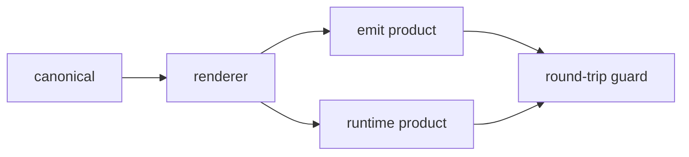

# Template Doctrine

> **Scope:** every template-shaped content — text that is data-izable, referenced by multiple consumers, and drift-prone. Large to small: `template-contract.json`, `harness-contract.json`, `issue-body.json` and `.github/ISSUE_TEMPLATE/*.yml`, down to emit-derived marketplace manifests (`.claude-plugin/`, `.cursor-plugin/`, `marketplace/source.json`). This is the methodological contract (AC12).

The single-source-of-truth convention for template body text — cited whenever a new skill introduces template body text or an emit-derived product needs drift guarding.

## 1. The two template planes

| Plane | Files | Product |
|---|---|---|
| Engine prompt templates | `packages/cdd-engine/templates/` — `engine-config.json` + `template-contract.json` + `schema/` (`task-handoff-schema.json` · `docs-handoff-schema.json` · `cache-profile-schema.json`) | prompts injected into dispatches |
| Skill document templates | `packages/kairos/skills/*/docs/` — `base-branch.md` (methodology only; doc-structure content is canonical JSON Schemas — see §9) | artifact scaffolds + methodology the skills ship |

## 2. The five-node digraph

The template lifecycle collapses into a five-node chain — a single source of truth forks through one renderer into two product channels, closed by a round-trip guard:

| Node | Role | Exit | Failure |
|---|---|---|---|
| `canonical` | single source of truth for template body text (structured data, e.g. JSON) — every body shape converges here | consumed by `renderer`; enters the render channel | a body shape missing from canonical → the render truncates or falls back; edit the canonical, never patch the consumer |
| `renderer` | single pure function rendering canonical → derived products; paragraph structure (headings, order, escaping, EOF) is renderer-assembled | called at emit time → `emit product`; at runtime → `runtime product` | hardcodes body text or consumes a non-canonical source → violates R1/R2; review corrects it |
| `emit product` | derived products committed to the repo (harness marketplace manifests, `.github/ISSUE_TEMPLATE/*.yml`), produced only by `pnpm run emit`; every path registered in `generatedPaths` | `pnpm run emit:check` drift=0 → committable; drift>0 → re-run `pnpm run emit` then commit | hand-editing the derived product without touching the canonical → overwritten at next emit + drift → CI failure |
| `runtime product` | products combined at runtime and not committed (e.g. finding comment, session master body) | consumed directly by the consumer side | bypasses the renderer and hand-assembles sections → paragraph structure drifts from canonical |
| `round-trip guard` | anti-drift closure in two stages: ① first render diffs empty against the existing product (transitional); ② content migration re-renders and commits in one independent step | ① and ② pass + `emit:check` drift=0 → terminal; any failure → fix canonical/renderer, then regress | stage-① diff-empty assertion lingers in the terminal test set → test burden; drift>0 → blocks merge |

## 3. Five-layer convergence

The prompt templates converge in five layers — JSON structure, document structure, naming, description, then the structural-skeleton + clause-library + injection-contract layer:

1. **JSON structure** — agent-facing JSON structures are the JSON Schema, verbatim (`JSON.stringify(schema)` injection, zero hand-written "simplified" renders)
2. **Document structure** — one fixed skeleton (`## Instructions` / `## Handoff` / `## Return` / `## Round context`, `skeleton.sections`)
3. **Naming** — scoped prefixes (`task-*` / `docs-*`), family-aligned directories
4. **Description** — schemas carry descriptions; writing-protocol rules live in the schema, not duplicated prose
5. **Structural skeleton + clause library + injection contract** —
   - **Skeleton registry** (`template-contract.json#skeleton`): one declarative section list + zone segment map `segments: {shell, return, round-context}` + render `order: [shell, return, round-context]` — the cache-zone split is a skeleton attribute, not a one-off reorder
   - **Clause library** (`template-contract.json#clauses`): every discipline clause lives once as byte-single-source text, referenced via `{{> cl:…}}` partial refs — changing a rule updates every template on one line
   - **Token registry** (`template-contract.json#tokens`): the 19 distinct injection tokens (17 `round-context` + 2 `return` — verified mechanically) become data (name / zone); the renderer drives off the registry; template text carries no loose tokens

## 4. Single-plane-single-file (data consolidation)

Group data by consumer plane — one file per plane, one load point, one version unit. Guards against the reverse debt (one mega-file): group by consumer plane · never merge dual-use surfaces · an injection byte-unit is a cache version-unit.

## 5. Rules

- **R1 Single source of truth** — template body text has exactly one canonical; consumers hold zero hardcoded copies. Enumerations, labels, paragraph order, and form-name sets are all canonical-driven (name sets use `Object.keys(canonical)`, no second literal list).
- **R2 Renderer determinism** — the renderer is a pure function: same canonical in, constant output out. Body paragraph structure (headings, punctuation, escaping, EOF) is decided by the renderer, not by copy-paste.
- **R3 Derived products are emit-generated** — derived products are produced and committed only by `pnpm run emit`; every product path is registered in `generatedPaths`, with `pnpm run emit:check` as the CI-slung drift guard (drift=0).
- **R4 Two-stage round-trip** — migration-type changes run a two-stage verification: ① first render diffs empty; ② content migration re-renders and commits in one independent step.
- **R5 Consumer-side usable** — derived products are consumable in the consumer environment (GitHub form yml, plugin manifests); no monorepo layout or this-repo toolchain dependency.

## 6. Invariants

| # | Invariant |
|---|---|
| I1 | canonical locatable — canonical path is fixed and greppable; the same template body has no md copy in the repo (`grep` hits only the canonical and the renderer) |
| I2 | renderer single point — each derived-product class has exactly one renderer function; no second assembly path |
| I3 | `pnpm run emit:check` drift=0 — standing guard; must pass in CI and before local commit |
| I4 | derived products never hand-edited — editing a product = overwritten at next emit + CI drift; any change goes through canonical → emit |

## 7. Failure modes

| failure | behavior | reason |
|---|---|---|
| Hand-edited derived product | emit:check drift → CI failure; re-running `pnpm run emit` overwrites it | derived product is derived output, not the source of truth (I4) |
| Dual-source divergence (canonical + consumer hardcode coexist) | review finds the same literal in two places → converge to the canonical single source | R1; dual sources inevitably drift |
| Render untestable (assertions parrot the render logic) | tests degenerate into self-consistency → change assertions to content invariants / an independent oracle | R2; a render that cannot be verified |
| Consumer-unusable | emit/runtime product missing fields or depending on this-repo layout → consumer environment errors | R5; products must be self-consistent |

## 8. Cache integration

The segment attribute (C1) is the cache contract's landing spot: the shell (`## Instructions` + `## Handoff`, slot-free) plus the frozen per-format `## Return` constant are the cached prefix fuel; `## Round context` is the single dynamic zone — token moustaches render nowhere else (`validateTemplateStructure` asserts zone ownership). See `03-context-caching-doctrine.md`.

## 9. Experience baking

Skill document templates additionally bake in the program's experience asset (see `04-program-experience.md`): four-table sync mechanics, clean-tree prerequisite, session-call semantics, backfill-as-version, no-claim-without-enforcement, anti-residue guards, capability claims.

> **Doc-structure templates are canonical JSON Schemas** in `packages/cdd-engine/config/schema/` (surface: `cdd schema get <type>` reads them straight to stdout); skills consume them via `read-schema`, and the engine's `docContractValidate` asserts the same tokens. `base-branch.md` is methodology only.

## 10. Exemplars

| Template form | canonical (single source) | renderer / runtime consumer | derived products | guard |
|---|---|---|---|---|
| Harness routing | `harness-contract.json` | cdd engine runtime (`src/dispatch/{task.ts,docs.ts,review-loop.ts}` · `src/infra/registry.ts`) | runtime harness routing (no emit product) | single-source JSON + engine validation · row keys = `{claude, cursor, pi}` (the G1 identity set); the external harness binary name surfaces only as a `cli` data value |
| Review contract | `template-contract.json#reviews` | `src/render/templates.ts` runtime + the URC prose in each orchestrator skill's `## Invariants` | cdd review / fix template rendering (runtime) | engine colocated tests + single-source config |
| Finding/report body | `templates/report/issue-body.json` | `IssueReportRenderer` (`cdd issue render`: stdin JSON → aggregate body → stdout) · `renderYml` (`scripts/emit/render-yaml.mjs`, emit-only) | `.github/ISSUE_TEMPLATE/*.yml` (emit) + cdd-report aggregate body (runtime) | engine colocated tests + `issue-templates.test.ts` two-stage round-trip + `emit:check` |
| Issue form yml | same `formFieldDefs` | `renderYml` in `scripts/emit/render-yaml.mjs` (emit-only — wired into emitAll) | `.github/ISSUE_TEMPLATE/bug_report.yml` / `enhancement.yml` | `emit:check` drift + single-source `Object.keys` form-name assertion |

> **First "one canonical, two-channel render" dogfood**: issue-body.json drives both the emit product (issue form yml) and the runtime product (cdd-report aggregate body).

## Change history

- 2026-09-26 · merged the retired data-driven-templates + template-doctrine pair into this single template-face document.
