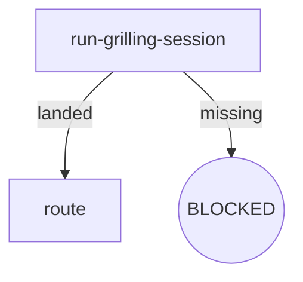

# Skill Authoring Specification

- **Version**: v1.7 · 2026-09-23
- **Scope**: Sole format authority for osuperpowers skill SKILL.md authoring (node-anchored form, after the skills-rewrite phase)
- **Audience**: This repository's maintainers + AI agents authoring skills
- **Language**: English primary (authoritative source; the repo's only zh-CN mirrors are the README family — root + the two packages, three files total)

> **Reader notice**: This document is maintainer-only and is not shipped to the consumer environment with the plugin (the package's `contentRoot` is `"."`, so only `packages/*/` publishes). Consumers see content under `packages/*/` only.

---

## 1. Overview

Node-anchored SKILL.md core idea: **the digraph is the sole source of truth for control flow**, and prose sections map one-to-one to graph nodes.

Eliminate triple representation:

| Old pattern | Problem | New pattern |
|---|---|---|
| HARD-GATE ten-step checklist | Ambiguous boundaries between steps and rules | Node Exit/Fail fields |
| Loose Rules prose | Rules unattributed, cross-references hard to track | Attributed to nodes or Invariants |
| Red Flags rule soup | Anti-patterns mixed with positive rules | Split into node Fail fields or Invariants |

## 2. Flow Digraph Conventions

- Graphs are embedded in SKILL.md prose using **mermaid** (broadest consumer rendering support)
- Node types:

| Type | Mermaid syntax | Semantics |
|---|---|---|
| Normal operation | `A[do-thing]` | Execute action, has defined exit |
| Decision | `B{condition?}` | Conditional branch (diamond) |
| Terminal | `C((APPROVED))` / `D((BLOCKED))` | Flow terminates (rounded) |

- Edge types:

| Type | Syntax | Semantics |
|---|---|---|
| Unconditional | `A --> B` | Mandatory transition |
| Conditional | `A -->|label| B` | Label describes branch condition |
| Back-edge | `A -->|retry| B` | Explicitly annotated loop (review loop, fix loop) |

- Terminal nodes have three possible terminal states:
  - **BLOCKED** — flow terminates, requires user intervention
  - **APPROVED** — flow completes normally
  - **HANDOFF** — hand off to the next skill/tool

## 3. Node Four-Element Template

Every node's prose must include four elements: **Do / Read / Exit / Fail**:

| Element | Content | Length |
|---|---|---|
| **Do** | What the node does | 1–3 sentences |
| **Read** | Input files / environment variables / context | Path list |
| **Exit** | Exit routing (success → next node; decision branch criteria) | Aligned with graph edges |
| **Fail** | Failure mode → behavior (error / BLOCKED / retry / fail-open) | Complements the Failure Modes table |

### 3.1 Example: `run-grilling-session` node (delegated form)

- **Do**: Import /mattpocock-skills:grilling — its flow is consumed inline as this session's baseline (loading an upstream skill imports its flow once; no second spawn). The grilling outcome lands as the artifact this node routes on. Upstream flow steps are not restated here.
- **Read**: nothing before the import — the imported flow resolves its own context; the node derives what it routes on from the landed grilling outcome
- **Exit**: Import landed → `route`; load failed (plugin/skill missing) → BLOCKED
- **Fail**: Import exits with no usable outcome → report to user and ask for next step (skip or abort)

## 4. Invariants

- Cross-node invariants, declared centrally in the `## Invariants` section
- **Hard limit of 5** — if a skill's invariants approach the limit, the overflow must be demoted into node Fail fields, not accumulated. There is no project-specific exception to this limit: an invariant expressible inside a node belongs in that node's Do/Exit/Fail (the cross-node / node-local split decides placement), and exceeding the limit after demotion is a defect signal
- Typical invariants:
  - Emit products are derived — never hand-edit `.claude-plugin/` / `.cursor-plugin/` / `marketplace/`
  - Commit discipline (commit when spec is approved)
  - Language policy (English primary — repo zh-CN mirrors limited to the README family: root + the two packages, three files total)
  - Session-call policy (delegated nodes consume other plugins' flows only via `/plugin:skill` imports — one import per upstream type per session, no upstream document reads)
  - Review Convergence (re-runs driven only by blockers; fixes always dispatch via `cdd fix`)

## 5. Failure Modes Table

Cross-node failure-to-behavior mappings, located in the `## Failure Modes` section:

| failure | behavior | reason |
|---|---|---|
| Delegated skill not installed | BLOCKED (with install instructions) | Block policy: no silent fallback |
| Delegate load failure | Report + ask user | Delegate Load Failure protocol |
| Harness not installed | BLOCKED (with registration prompt) | Cannot execute without a working harness |
| Nested CLI timeout | Fail-open (log stderr) | Must not block the main flow |

- Complements node Fail fields: Fail fields handle node-local failures; this table handles cross-node failures
- Every failure maps to at least one graph edge or terminal node

## 6. BLOCKED Terminal State Convention

BLOCKED node prose must include:

1. **Blocking reason**: One sentence explaining why execution is stuck
2. **Recovery action**: Concrete install instructions or manual user steps
3. **No silent fallback**: Explicit statement that degradation and skipping are prohibited

**Block policy** (program-level constraint): delegated skills (brainstorming / writing-plans / finishing) must treat a failed upstream import (`A -->|missing| Z1((BLOCKED: install <plugin>))` terminal) as an explicit BLOCKED node with install instructions — no degradation, no silent fallback.

## 7. Session-call Primitive and Skill Forms

All cross-skill invocation of another plugin's flow goes through the **session-call** primitive:

> `/plugin:skill` — load an upstream skill = import its flow once

Loading an upstream skill **imports its flow once** and consumes it **inline** as the current session's baseline — there is no second session: a single session / single process can never spawn the same upstream flow a second time, and each session consumes each upstream skill type **at most once**. Re-entering a delegated node (the same flow node reached again) routes on the **already-landed artifact** the first import produced — the mode marker / design context / registration marker — never by loading the upstream flow again; the invoking node routes on the import's outcome. Skills refer to upstream flows **only** in this slash form — never by upstream document path (zero upstream SKILL.md file paths, zero `Read-Upstream` wording), and a delegated flow's internal steps are never restated inside the node (the imported flow owns them). The wording "run a /xxx session" is rejected — the slash reference names the flow import, not a separate session spawn. The `run-*-session` entry-node IDs still carried by the delegated examples are legacy handles for that same import-and-consume operation — the ID names the flow-entry import, not a session spawn.

Two SKILL.md forms follow from the primitive:

**Delegated** — the skill is a thin orchestrator of upstream or sibling flows: its nodes import `/<plugin>:<skill>` and route on the import's landed artifact. Node **Do** = the import line (the flow consumed inline as this session's baseline) plus the artifact the import lands and the routing the node performs; node **Read** derives from the import outcome, not from upstream files. Examples: `brainstorming` (run-brainstorming-session → /superpowers:brainstorming, landing the mode marker + design context; run-grilling-session → /mattpocock-skills:grilling, landing the grilling outcome), `writing-plans` (run-writing-plans-session → /superpowers:writing-plans, landing the planned implementation), `finishing` (run-finishing-session → /superpowers:finishing-a-development-branch, landing the merge/PR/keep/discard decision), and the spec-writers (→ /superpowers:brainstorming writing-spec design imports, landing the design decisions). A delegated grilling import in `phase-within-program` mode enumerates before it grills: the parent overall's requirements registered for the phase are read item by item (each requirement's status — `[Pending]` / `Done` / dropped — cross-referenced from the phase's Phase inventory `[Pending]`/Done cells and the change-history dropped claims), the full list is restated to the user, and the grilling frontier opens only after explicit coverage-complete confirmation (brainstorming `run-grilling-session` — enumerate-then-grill).

**Native** — the skill executes its own flow via the engine CLI / local processing; there is no upstream flow to import, so control flow lives entirely in the skill's digraph and node **Do** fields state the engine invocation explicitly (command + args). Examples: `cli-driven-development` (the `cdd` implement → review → fix chain), `report-issues` (local session analysis + renderer/`gh` CLI).

A delegated skill may still contain native engine-CLI nodes (the spec-writers, for example, run the `cdd` review-fix loop natively after their delegated design import) — the form class names the skill's primary upstream-flow delegation, not an exclusive node inventory.

## 8. Graph–Prose Consistency (single enforcement point)

The digraph integrity checks over every SKILL.md under `packages/osuperpowers/skills/` are enforced by a single machine check: `packages/osuperpowers/tests/digraph-consistency.test.mjs` (no exemptions). The check runs the three flow-atomicity assertions (spec E1):

- **Assertion 1 — bidirectional completeness**: the digraph's operator-node set and the per-node definitions (the `###` node headings) are mutually covering — every flow node has a node definition (no dangling nodes) and every node definition names a flow node (no orphan sections). Decision diamonds are flow-routing and stay exempt from the required-definition side, but a diamond that *does* define a node must still map to a digraph node.
- **Skeleton discipline**: no standalone `## Rules` and no standalone `## Red Flags` sections.
- **Assertion 2 — skeleton isomorphism**: the writing-* spec-writer trio (single / overall / phase-spec) share an identical review-loop / commit / handoff skeleton. Family deltas are registered via each skill's `## Skeleton deltas` table — the table is the validation input: a skill's handoff node must match the value its table declares, and any divergence between siblings that the tables do not register fails.
- **Assertion 3 — growth signal + consumer purity**: every skill's digraph node/edge counts are reported on every run; a digraph crossing the growth boundary records its design rationale in the §9.1 registry (see §9). The consumer SKILL.md carries **zero trace of the crossing** — no note, no rationale heading of any form (`## Flow size note` fails as hard as `## Full Flow Refactor Rationale`) — consumer-surface purity (CLAUDE.md).

Non-mechanical authoring judgment (naming, phrasing, rule placement) is manual.

**Test naming & placement (repo-wide colocation):** within `packages/cdd-engine/`, tests are colocated with the tested source — every test node is a TypeScript `*.test.ts` living at `src/<module>/__tests__/` (new engine tests land there first, never in a top-level `tests/` dir — retired when engine tests were colocated). The repo `scripts/` suite follows the same convention since the repo orchestration tools were colocated: tests live at `scripts/<dir>/__tests__/<file>.test.ts`, with the top-level tools under `scripts/__tests__/`. The two vitest includes are the same single-glob shape — engine `['src/**/__tests__/**/*.test.ts']`, repo root `['scripts/**/__tests__/**/*.test.ts']` — and validate 5c asserts the engine's `.mjs` plane stays at zero.

## 9. Flow Change Discipline

A skill's flow is its digraph, and the digraph is the sole control-flow source of truth — so a flow change is never a single-node edit. Any change to a skill's flow (a new node, a re-wired edge, a new failure surface, a renamed node, an Exit re-route) runs the whole-flow review **before** it lands:

1. **Re-read the entire flow first** — the digraph, every node's Do/Read/Exit/Fail, the Failure Modes table, and the Invariants. Read the node being touched *last*; understand the graph the change lands in first.
2. **Shape-fit judgment** — classify the change before editing:
   - **Instance of an existing pattern** — the change reuses a shape the skill (or its siblings) already carries, e.g. a second review-loop arm or another handoff branch. Land it by cloning the pattern uniformly; do not hand-roll a variant.
   - **New shape** — the skill needs a structural shape no sibling uses. Scope it to this single skill and keep it as small as the flow allows.
   - **Bloat signal** — the digraph's node/edge count is at or past the growth boundary (below). Significant growth is a defect signal, not permission: the change MUST come with a rationale recorded in the §9.1 registry explaining why the whole flow needs the added weight — what the flow gained, and why subdivision, a rewrite, or the sibling-uniform option was rejected. The consumer SKILL.md carries **zero trace** of the crossing — no note, no rationale heading (consumer-surface purity, CLAUDE.md).
3. **Adjust siblings uniformly** — when a shared skeleton is touched (the spec-writer trio's review-loop / commit / handoff shape, or any pattern instance cloned across siblings), every sibling carrying the shape is adjusted in the same change. Family deltas are registered in each skill's `## Skeleton deltas` table (the validation input for the skeleton-isomorphism assertion, §8); an unregistered divergence between siblings fails validation.
4. **Land the change last** — only after 1–3. A change that lands and gets justified afterwards is an unregistered delta on the next validate run.

### 9.1 Growth boundary

A skill whose digraph carries more than **15 nodes** or more than **17 edges** (all node types and edges counted, re-declarations deduplicated) has crossed the growth boundary. Crossing is permitted for a documented reason, recorded in the registry below — **never inside the consumer-shipped SKILL.md, in any form** (consumer-surface purity, CLAUDE.md): the growth-signal assertion (§8) reports every skill's node/edge counts on every validate run and fails a crossed skill whose rationale is not registered here.

**Registered rationale instances** — each crossing records below what the flow gained, and why subdivision, a rewrite, and the sibling-uniform option were each rejected:

- **`cli-driven-development`** (15 nodes · 19 edges — limits 15 / 17): crossed for whole-group dispatch semantics (2026-09 consumer-parity, P4.3): the loop's dispatch unit is now the dispatch group (`--tasks <n|n,n,…>` — one surface for a singleton and a merged group), and an `adjudicate-task-groups` gate lands between `set-base-branch` and the loop.
  - **What the flow gained** — `adjudicate-task-groups` settles the group list from the plan's `## Task Groups` section (declared groups verbatim; an absent section → per-task singleton groups — exactly the pre-group dispatch) and gates the loop entry on the user's confirmation; a refusal terminates before any dispatch touches the tree. `{more-groups?}` replaces `{more-tasks?}` to name the group iterate; the gate's shape mirrors `determine-base`'s AskUserQuestion template.
  - **Subdivision rejected** — the gate is one narrow decision on the `C → D` seam; splitting it into finer nodes would add ceremony to a flow whose loop body is unchanged. One decision node plus its refusal terminal is the smallest shape that carries the confirmation gate.
  - **Rewrite rejected** — the loop skeleton (review lane → `{blocker=0?}` → fix lane → convergence exit) is shared with the writing-* orchestrators (the skeleton-isomorphism family); a rewrite would break the family shape for no behavioral gain.
  - **Sibling-uniform rejected** — no sibling orchestrator dispatches task groups: the writing-* loops review documents, not `--tasks` units, so there is no sibling shape to clone — the adjudication is this skill's own entry surface.

## 10. Anti-patterns (Node-anchored SKILL.md)

Anti-patterns organized by the anatomy element where they manifest.
When auditing a node, check only the patterns relevant to that element.

### 10.1 Do field
| Anti-pattern | Symptom | Fix |
|---|---|---|
| Bare compliance | Do says "follow X" without expanding critical constraints | Extract key constraints as numbered self-checks in Do |
| Review substitution | Self-review or manual check replaces CLI dispatch | Do must state CLI invocation explicitly (tool + args) |
| Mode-unaware branching | One Do behavior covers multiple modes | Add mode-aware branching in Do |

### 10.2 Exit field
| Anti-pattern | Symptom | Fix |
|---|---|---|
| Exit drift | Graph edges don't match Exit paths | Graph and Exit must enumerate identical edge labels |
| Implicit scope creep | New exit path added without Invariant update | New exit path with behavioral significance → new or updated Invariant |

### 10.3 Fail field
| Anti-pattern | Symptom | Fix |
|---|---|---|
| Failure mode gap | Fail = "—" but real failure exists | Every node must have Fail for each possible error state |

### 10.4 Invariants
| Anti-pattern | Symptom | Fix |
|---|---|---|
| Rule duplication | Same rule in Invariant + node Do + Fail | Single source: Invariant for cross-node, node Fail for node-local |

### 10.5 Node decomposition
| Anti-pattern | Symptom | Fix |
|---|---|---|
| Insufficient granularity | One node handles multiple distinct responsibilities | Split into separate nodes with clear Exit handoff |

**Anti-pattern: Issue-Number as Behavioral Baseline**

Behavioral logic in SKILL.md, templates, and docs must not reference GitHub issue numbers as authoritative sources. Issues are the forum for design discussion; once conclusions are committed to documentation, issue numbers should be removed from behavioral logic. Issue references in change history are exempt.

**Anti-pattern: Design-History / Mechanism Narration in a Consumer Skill**

A SKILL.md (and skill `docs/*.md`) is a **consumer-operating surface**: it specifies the executable flow (digraph, node Do/Read/Exit/Fail, Invariants, Failure Modes) and stops there. It must not carry:

- **Design-history narration** — "this used to…", "changed in vX.Y…", "user decided…", "previously backfill was a finishing step…". The flow IS the record; annotating a change re-curates the past into consumer prose.
- **Mechanism explanation** — why the engine gates behave as they do (hard-gate vs fail-open rationale, timing/ordering derivations). The behavior belongs in the flow or the engine; the why belongs in specs/plans (Strategy B) or maintainer docs.
- **Internal-program references** — program/spec titles or versions (e.g. "consumer-parity P2 v1.12"), repo-internal phase ids, backfill/claim-ledger jargon that a consumer (pure packages, no monorepo layout, no repo toolchain) cannot resolve.
- **Rationale/commentary on design decisions** — the decision record lives in `docs/osuperpowers/specs+plans` and `docs/maintainers/`; a shipped skill that explains its own genealogy is unreadable to a fresh consumer and diverges as the program evolves.

When a change removes a flow step (e.g. deleting a node), edit the digraph and node definitions — do **not** annotate the removal. Positive test: a sentence whose referents a consumer who has never seen the program cannot resolve (internal doc titles, version history, provisional reasoning) violates this rule — delete it, or move it to the Strategy B / maintainer surface. (2026-09-21 dogfood: a backfill-timing note referencing an internal spec was removed from the finishing skill the same day it was added.)

## 11. Data-driven Template Convention

When a new skill introduces template body text that is data-izable — text-shaped, referenced by multiple consumers, drift-prone (form field definitions, enumeration lists, section-label tables, issue-template bodies) — route it through the data-driven-templates convention: **canonical JSON single source → one pure renderer → emitted/derived products guarded by `pnpm run emit:check`**. Nodes defined here apply to prose control flow; template body text follows [01-data-driven-templates.md](01-data-driven-templates.md) (digraph `canonical → renderer → {emit product · runtime product} → round-trip guard`).

---

## 12. Change history

- v1.7 · 2026-09-23 — Mirror-policy sync (consumer-parity P4.1): the repo's zh-CN mirror set is the README family (root `README.zh-CN.md` + `packages/osuperpowers/README.zh-CN.md` + `packages/cdd-engine/README.zh-CN.md` — three files total); the "no zh-CN mirrors" claim in the Language line and the §4 typical-invariants list now states this set.
- v1.6 · 2026-09-21 — Add §10 anti-pattern "Design-History / Mechanism Narration in a Consumer Skill" — skills are consumer-operating surfaces: design history, mechanism explanation, rationale commentary, and internal-program references are forbidden (2026-09-21 dogfood: a backfill-timing note referencing an internal spec entered the finishing skill and was removed the same day).
- v1.5 · 2026-09-20 — Grilling coverage honesty (G2): delegated grilling in `phase-within-program` mode enumerates the parent overall's registered requirements (each requirement's status — `[Pending]` / `Done` / dropped — cross-referenced from the phase's Phase inventory `[Pending]`/Done cells and the change-history dropped claims) and opens the grilling frontier only after the user confirms the enumerated coverage is complete — recorded as a delegated-flow convention (§7) and in the brainstorming / writing-phase-spec flows.
- v1.4 · 2026-09-19 — Session-call semantic honesty (G1): the primitive is redefined as `load an upstream skill = import its flow once` — inline consumption as this session's baseline, at most one import per upstream type per session, re-entry routes on already-landed artifacts (mode marker / design context / registration marker); the "run a /xxx session" spawn wording is rejected across §7, the delegated-form example, and the session-call policy invariant.
- v1.3 · 2026-09-18 — Add §9 flow change discipline (whole-flow re-read · shape-fit judgment · sibling-uniform adjustment · growth boundary) and rework §8 into the three digraph integrity assertions (bidirectional completeness / skeleton isomorphism / growth signal), moved §9–10 to §10–11.
- v1.2 · 2026-09-16 — after the skills-rewrite phase: session-call primitive + delegated/native forms (§7); §8 collapsed to the single machine enforcement point (`digraph-consistency.test.mjs`); deleted §7 init legacy exemption (init removed) and §9 path-string boundary (elapsed); §4 closes the spec-authorized exception escape hatch (limit remains a hard 5); language updated to English primary (zh-CN mirrors retired).
- v1.1 · 2026-09-08 — Add §11 Data-driven template convention (data-izable template body text → canonical + renderer + emit guard).
- v1.0 · 2026-08-26 — Initial version (docs-infrastructure phase): 9-section skeleton + read-grilling illustrative example + init legacy exemption rule.
