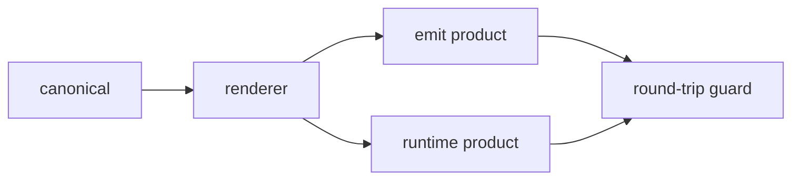

# Data-driven Templates（数据驱动模板规范）

> **Scope:** 所有「文本形态可数据化、被多消费端引用、须防漂移」的模板性内容——大到
> `packages/cdd-engine/templates/review/reviews.json`、`packages/cdd-engine/bin/harness-registry.json`、
> `packages/osuperpowers/skills/report-issue/templates/finding-meta.json` 与 `.github/ISSUE_TEMPLATE/*.yml`，
> 小到 `.agents/` 等 emit 派生产物。本规范是方法论契约（AC12），适用对象不限于下表 Exemplars。

Cross-cutting reference: 模板正文生命周期的单一事实源规范。被新 skill 的模板正文引入、既有模板性内容的
重构收敛、以及 emit 派生产物的漂移守卫所引用。

## Digraph

### Convention: Canonical → Renderer → Products → Round-trip Guard

模板生命周期收敛为一条五节点链——单一事实源经单一渲染器分叉为两条产物通道（emit 落仓产物 + 运行时
即时产物），再由 round-trip 守卫闭环：

## Node Definitions

### `canonical`

- **Do**: 模板正文的唯一事实源（结构化数据，如 JSON）。文本段落、枚举、标签、表单字段定义、段落渲染序等一切正文形态全部收敛于此，不散落于消费端。
- **Read**: 各消费端的字段需求清单（review / spec 阶段确立的渲染契约）。
- **Exit**: 被 `renderer` 读取，进入渲染通道。
- **Fail**: 正文缺失 canonical 字段 → 渲染截断或缺省值；维护者必须改 canonical，禁止在消费端直接打补丁（见 Rules R1 / Failure Modes「双源分歧」）。

### `renderer`

- **Do**: 单一纯函数把 canonical 渲染为派生产物；正文段落结构（含标题、段落序、转义、EOF）由渲染器拼装，agent / 手工不参与拼装。
- **Read**: `canonical`（只读 canonical，不读 md 副本、不读硬编码字面量）。
- **Exit**: 被 emit 阶段调用 → `emit product`；被运行时调用 → `runtime product`。
- **Fail**: 渲染器硬编码正文或消费 canonical 之外的源 → 违反 R1 / R2，review 必须纠正。

### `emit product`

- **Do**: 提交进仓的派生产物（`.agents/`、harness manifests、`.github/ISSUE_TEMPLATE/*.yml`），只由 `pnpm run emit` 生成；路径登记进 `generatedPaths`。
- **Read**: `renderer` 输出。
- **Exit**: `pnpm run emit:check` drift=0 → 可提交；drift>0 → 重跑 `pnpm run emit` 后再提交。
- **Fail**: 手改派生产物而不动 canonical → 下次 emit 覆盖 + emit:check drift → CI 失败（Failure Modes「手改派生产物」）。

### `runtime product`

- **Do**: 运行时由 renderer 即时组合、不落仓的产物（如 finding comment、session master body）。
- **Read**: `renderer` 输出（外部 harness 经 CLI 契约：stdin JSON → stdout）。
- **Exit**: 消费者端直接使用。
- **Fail**: 运行时绕过 renderer 手工拼段 → 段落结构与 canonical 漂移（Failure Modes「消费者端不可用」）。

### `round-trip guard`

- **Do**: 防漂移闭环，两阶段执行：① 首渲染与既有产物 diff 空（过渡性断言，验证新渲染器忠实复刻现状；阶段②完成后从测试删除）；② 内容迁移（如隐私改造 / 文案调整）独立一步，重渲染后提交。
- **Exit**: ①② 通过且 `pnpm run emit:check` drift=0 → 终结态；任一失败 → 修 canonical / renderer 后回归。
- **Fail**: 过渡断言（阶段① diff 空）残留到终结态测试 → 测试负担，必须删除；`emit:check` drift>0 → 阻塞合并。

## Rules

- **R1 单一事实源** — 模板正文只有一个 canonical；消费端零硬编码。枚举、标签、段落序、表单名单一律以 canonical 驱动（名单源用 `Object.keys(canonical)`，无第二处字面量列表）。
- **R2 渲染确定性** — renderer 是纯函数：同一 canonical 输入恒定输出。正文段落结构（标题、标点、转义、EOF）由 renderer 决定，不靠人肉复制。
- **R3 派生产物 emit 生成** — 派生产物只由 `pnpm run emit` 生成并提交；每一产物路径登记 `generatedPaths`，`pnpm run emit:check` 作为 CI 常驻 drift 守卫（drift=0）。
- **R4 round-trip 两阶段** — 迁移类改动走两阶段验证：① 首渲染 diff 空（过渡断言，阶段②完成后删除）；② 内容迁移独立一步重渲染提交；终结态以常驻 `emit:check` drift=0 承接守卫。
- **R5 消费者端可用** — 派生产物在消费者环境可直接消费（GitHub 表单 yml、插件 manifests）；无 monorepo 布局 / 本仓 toolchain 依赖。

## Invariants

| # | Invariant |
|---|---|
| I1 | canonical 可定位 — canonical 路径固定可 grep；同一模板正文在仓库无 md 副本（`grep` 只命中 canonical 与 renderer） |
| I2 | 渲染器单点 — 每类派生产物恰好一个渲染器函数，无第二处拼装逻辑 |
| I3 | `pnpm run emit:check` drift=0 — 常驻守卫；CI 与本地提交前都必须通过 |
| I4 | 派生产物不手改 — 手改产物 = 下次 emit 覆盖 + CI drift；任何改动走 canonical → emit |

## Failure Modes

| failure | behavior | reason |
|---|---|---|
| 手改派生产物 | emit:check drift → CI 失败；重跑 `pnpm run emit` 覆盖 | 派生产物是衍生输出，不是事实源（I4） |
| 双源分歧（canonical 与消费端硬编码并存） | review 发现同义字面量两处存在 → 收敛为 canonical 单源 | R1；双源必然漂移 |
| 渲染不可测（断言照抄渲染逻辑） | 测试退化为自证 → 断言改为内容不变量 / 独立 oracle | R2；渲染无法被验证 |
| 消费者端不可用 | emit 产物 / 运行时产物缺字段或依赖本仓布局 → 消费者环境报错 | R5；产物必须自洽 |

## Exemplars

| 模板形态 | canonical（单一事实源） | 渲染器 / 运行时消费 | 派生产物 | 守卫 |
|---|---|---|---|---|
| harness 路由（P1） | `packages/cdd-engine/bin/harness-registry.json` | cdd 引擎运行时读取（`bin/cdd.mjs` · `lib/runner.mjs` · `lib/registry.mjs` · `lib/docs-runner.mjs`） | 运行时 harness 路由（无 emit 产物） | 单源 JSON + 引擎校验 |
| review 契约（P3） | `packages/cdd-engine/templates/review/reviews.json` | `bin/lib/templates.mjs` 运行时读取（per-type 配置驱动共享壳 review.md）+ `_docs/review.md` URC 为 prose 契约 | cdd review / fix 模板渲染（运行时） | engine 测试 + 程序内单源配置 |
| finding/report 正文（P4，首个运行时渲染） | `packages/osuperpowers/skills/report-issue/templates/finding-meta.json` | `packages/osuperpowers/scripts/report-templates.mjs`（renderYml / renderTitle / renderMeta / renderSummaryTable / renderComment / renderMasterBody 纯函数） | `.github/ISSUE_TEMPLATE/*.yml`（emit）+ finding comment / session master body（runtime） | `scripts/emit/issue-templates.test.mjs` 两阶段 round-trip + `emit:check` |
| issue 表单 yml（P4） | 同上 `formFieldDefs` | `renderYml`（emit 阶段经 `scripts/emit/issue-templates.mjs` 挂入 emitAll） | `.github/ISSUE_TEMPLATE/bug_report.yml` / `enhancement.yml` / `session_report.yml` | `emit:check` drift + 表单名单 `Object.keys` 单源断言 |

> **首个「同一 canonical 双通道渲染」dogfood**：finding-meta.json 同时驱动 emit 产物（issue 表单 yml）与
> 运行时产物（report-issue finding comment / session master body）——P4 自身即本规范的落地验证（AC12）。

---

## Change history

- 2026-09-08 · v1.0 — 初版（P4 方法论规范 task 5）：五节点 digraph + Rules R1–R5 + Invariants I1–I4 + Failure Modes + 四 Exemplars。
