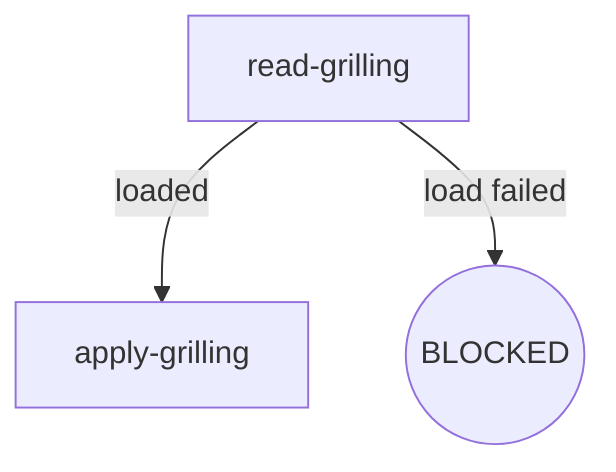

# Skill Authoring Specification

- **Version**: v1.0 · 2026-08-26
- **Scope**: Sole format authority for all P4–P9 osuperpowers skill SKILL.md rewrites
- **Audience**: This repository's maintainers + AI agents executing refactors
- **Language**: English primary + zh-CN mirror (Strategy A — maintainer doc)

> **Reader notice**: This document is maintainer-only and is not shipped to the consumer environment with the plugin. Consumers see only content under `packages/*/`.

---

## 1. Overview

Node-anchored SKILL.md core idea: **the digraph is the sole source of truth for control flow**, and prose sections map one-to-one to graph nodes.

Eliminate triple representation:

| Old pattern | Problem | New pattern |
|---|---|---|
| HARD-GATE ten-step checklist | Ambiguous boundaries between steps and rules | Node Exit/Fail fields |
| Loose Rules prose | Rules unattributed, cross-references hard to track | Attributed to nodes or Invariants |
| Red Flags rule soup | Anti-patterns mixed with positive rules | Split into node Fail fields or Invariants |

## 2. Flow Digraph Conventions

- Graphs are embedded in SKILL.md prose using **mermaid** (broadest consumer rendering support)
- Node types:

| Type | Mermaid syntax | Semantics |
|---|---|---|
| Normal operation | `A[do-thing]` | Execute action, has defined exit |
| Decision | `B{condition?}` | Conditional branch (diamond) |
| Terminal | `C((APPROVED))` / `D((BLOCKED))` | Flow terminates (rounded) |

- Edge types:

| Type | Syntax | Semantics |
|---|---|---|
| Unconditional | `A --> B` | Mandatory transition |
| Conditional | `A -->|label| B` | Label describes branch condition |
| Back-edge | `A -->|retry| B` | Explicitly annotated loop (review loop, fix loop) |

- Terminal nodes have three possible terminal states:
  - **BLOCKED** — flow terminates, requires user intervention
  - **APPROVED** — flow completes normally
  - **HANDOFF** — hand off to the next skill/tool

## 3. Node Four-Element Template

Every node's prose must include four elements: **Do / Read / Exit / Fail**:

| Element | Content | Length |
|---|---|---|
| **Do** | What the node does | 1–3 sentences |
| **Read** | Input files / environment variables / context | Path list |
| **Exit** | Exit routing (success → next node; decision branch criteria) | Aligned with graph edges |
| **Fail** | Failure mode → behavior (error / BLOCKED / retry / fail-open) | Complements the Failure Modes table |

### Example: `read-grilling` node

- **Do**: Read the grilling SKILL.md from mattpocock-skills and load its framework
- **Read**: `vendors/mattpocock-skills/skills/productivity/grilling/SKILL.md`
- **Exit**: File exists → `apply-grilling`; file missing → BLOCKED
- **Fail**: Read error → report to user and ask for next step (skip or abort)

## 4. Invariants

- Cross-node invariants, declared centrally in the `## Invariants` section
- **Hard limit of 5** — if exceeded, check whether an item can be demoted to a node's Fail field (exception: `osuperpowers:brainstorming` holds 7 invariants due to P14's I6/I7 serialization/discipline rules; this exception was explicitly authorized in that skill's design spec v1.0 §2.4/§2.5 and is not a violation)
- Typical invariants:
  - Vendored submodules must not be modified
  - Commit discipline (commit when spec is approved)
  - Language policy (English primary + zh-CN mirror)
  - Block policy (missing Read-Upstream always → BLOCKED)
  - Review Stopping (re-runs driven only by blockers)

## 5. Failure Modes Table

Cross-node failure-to-behavior mappings, located in the `## Failure Modes` section:

| failure | behavior | reason |
|---|---|---|
| Upstream SKILL.md missing | BLOCKED (with install instructions) | Block policy: no silent fallback |
| Sub-skill load failure | Report + ask user | Delegate Load Failure protocol |
| Harness not installed | BLOCKED (with registration prompt) | Cannot execute without a working harness |
| Nested CLI timeout | Fail-open (log stderr) | Must not block the main flow |

- Complements node Fail fields: Fail fields handle node-local failures; this table handles cross-node failures
- Every failure maps to at least one graph edge or terminal node

## 6. BLOCKED Terminal State Convention

BLOCKED node prose must include:

1. **Blocking reason**: One sentence explaining why execution is stuck
2. **Recovery action**: Concrete install instructions or manual user steps
3. **No silent fallback**: Explicit statement that degradation and skipping are prohibited

**Block policy** (program-level constraint): All skills with Read-Upstream rules (brainstorming / writing-plans / finishing) must treat missing upstream baselines as an explicit BLOCKED node (with install instructions) — no degradation, no silent fallback.

## 7. init Legacy Content Exemption

- `skills/init/` harness-branch inline prose remains as-is (`router.md` was deleted in P9)
- **Exemption scope**: Prose content inside harness branches (payload template text)
- **Not exempted**: Branch structure, outer dispatch logic
- **Exemption rationale**: init's payload is template text embedded in `harness.md`, not control flow — forcing node-anchoring would break payload readability

## 8. Graph–Prose Consistency Checklist

After P4–P9 rewrites, acceptance must pass these 4 checks:

1. **Node coverage**: Every node ID in the graph has a corresponding prose section
2. **Section alignment**: Every prose section heading aligns to a node ID (no orphaned sections)
3. **No standalone Rules prose**: Rules must be attributed to a node (Do/Read/Exit/Fail) or to Invariants
4. **No standalone Red Flags section**: Anti-patterns must be split into node Fail fields or Invariants

## 9. Path String Edit Boundary (P3 Specific)

P3 permits edits to engine, template, and consumer SKILL.md limited to "documentation links / path strings only"; behavioral prose is deferred to P4–P9. Specific boundaries:

- ✅ Inter-document cross-reference links (`[text](path)`) — path portion only
- ✅ Path strings in code comments
- ✅ Path strings in test fixtures
- ❌ Engine behavioral prose (control flow, exit codes, output contracts)
- ❌ Skill Rules / Red Flags / Checklist prose structure

## 10. Anti-patterns (Node-anchored SKILL.md)

Anti-patterns organized by the anatomy element where they manifest.
When auditing a node, check only the patterns relevant to that element.

### Do field
| Anti-pattern | Symptom | Fix |
|---|---|---|
| Bare compliance | Do says "follow X" without expanding critical constraints | Extract key constraints as numbered self-checks in Do |
| Review substitution | Self-review or manual check replaces CLI dispatch | Do must state CLI invocation explicitly (tool + args) |
| Mode-unaware branching | One Do behavior covers multiple modes | Add mode-aware branching in Do |

### Exit field
| Anti-pattern | Symptom | Fix |
|---|---|---|
| Exit drift | Graph edges don't match Exit paths | Graph and Exit must enumerate identical edge labels |
| Implicit scope creep | New exit path added without Invariant update | New exit path with behavioral significance → new or updated Invariant |

### Fail field
| Anti-pattern | Symptom | Fix |
|---|---|---|
| Failure mode gap | Fail = "—" but real failure exists | Every node must have Fail for each possible error state |

### Invariants
| Anti-pattern | Symptom | Fix |
|---|---|---|
| Rule duplication | Same rule in Invariant + node Do + Fail | Single source: Invariant for cross-node, node Fail for node-local |

### Node decomposition
| Anti-pattern | Symptom | Fix |
|---|---|---|
| Insufficient granularity | One node handles multiple distinct responsibilities | Split into separate nodes with clear Exit handoff |

---

## Change history

- v1.0 · 2026-08-26 — Initial version (P3 docs-infra): 9-section skeleton + read-grilling illustrative example + init legacy exemption rule.
