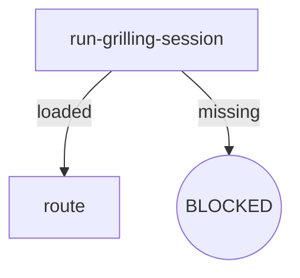

# Skill Authoring Specification

- **Version**: v1.2 · 2026-09-16
- **Scope**: Sole format authority for osuperpowers skill SKILL.md authoring (node-anchored form, post-P4)
- **Audience**: This repository's maintainers + AI agents authoring skills
- **Language**: English primary (authoritative source; no zh-CN mirrors)

> **Reader notice**: This document is maintainer-only and is not shipped to the consumer environment with the plugin (the package's `contentRoot` is `"."`, so only `packages/*/` publishes). Consumers see content under `packages/*/` only.

---

## 1. Overview

Node-anchored SKILL.md core idea: **the digraph is the sole source of truth for control flow**, and prose sections map one-to-one to graph nodes.

Eliminate triple representation:

| Old pattern | Problem | New pattern |
|---|---|---|
| HARD-GATE ten-step checklist | Ambiguous boundaries between steps and rules | Node Exit/Fail fields |
| Loose Rules prose | Rules unattributed, cross-references hard to track | Attributed to nodes or Invariants |
| Red Flags rule soup | Anti-patterns mixed with positive rules | Split into node Fail fields or Invariants |

## 2. Flow Digraph Conventions

- Graphs are embedded in SKILL.md prose using **mermaid** (broadest consumer rendering support)
- Node types:

| Type | Mermaid syntax | Semantics |
|---|---|---|
| Normal operation | `A[do-thing]` | Execute action, has defined exit |
| Decision | `B{condition?}` | Conditional branch (diamond) |
| Terminal | `C((APPROVED))` / `D((BLOCKED))` | Flow terminates (rounded) |

- Edge types:

| Type | Syntax | Semantics |
|---|---|---|
| Unconditional | `A --> B` | Mandatory transition |
| Conditional | `A -->|label| B` | Label describes branch condition |
| Back-edge | `A -->|retry| B` | Explicitly annotated loop (review loop, fix loop) |

- Terminal nodes have three possible terminal states:
  - **BLOCKED** — flow terminates, requires user intervention
  - **APPROVED** — flow completes normally
  - **HANDOFF** — hand off to the next skill/tool

## 3. Node Four-Element Template

Every node's prose must include four elements: **Do / Read / Exit / Fail**:

| Element | Content | Length |
|---|---|---|
| **Do** | What the node does | 1–3 sentences |
| **Read** | Input files / environment variables / context | Path list |
| **Exit** | Exit routing (success → next node; decision branch criteria) | Aligned with graph edges |
| **Fail** | Failure mode → behavior (error / BLOCKED / retry / fail-open) | Complements the Failure Modes table |

### Example: `run-grilling-session` node (delegated form)

- **Do**: Run a /mattpocock-skills:grilling session — the harness loads the upstream skill and runs its flow. Upstream flow steps are not restated here.
- **Read**: nothing before the session — the delegated session resolves its own context; the node derives what it routes on from the session outcome
- **Exit**: Session loaded → `route`; load failed (plugin/skill missing) → BLOCKED
- **Fail**: Session exits with no usable outcome → report to user and ask for next step (skip or abort)

## 4. Invariants

- Cross-node invariants, declared centrally in the `## Invariants` section
- **Hard limit of 5** — if a skill's invariants approach the limit, the overflow must be demoted into node Fail fields, not accumulated. There is no project-specific exception to this limit: an invariant expressible inside a node belongs in that node's Do/Exit/Fail (the cross-node / node-local split decides placement), and exceeding the limit after demotion is a defect signal
- Typical invariants:
  - Vendored submodules must not be modified
  - Commit discipline (commit when spec is approved)
  - Language policy (English primary — no zh-CN mirrors)
  - Session-call policy (delegated nodes invoke other plugins' flows only via `/plugin:skill` sessions — no upstream document reads)
  - Review Stopping (re-runs driven only by blockers; fixes always dispatch via `cdd fix`)

## 5. Failure Modes Table

Cross-node failure-to-behavior mappings, located in the `## Failure Modes` section:

| failure | behavior | reason |
|---|---|---|
| Delegated session not installed | BLOCKED (with install instructions) | Block policy: no silent fallback |
| Delegate load failure | Report + ask user | Delegate Load Failure protocol |
| Harness not installed | BLOCKED (with registration prompt) | Cannot execute without a working harness |
| Nested CLI timeout | Fail-open (log stderr) | Must not block the main flow |

- Complements node Fail fields: Fail fields handle node-local failures; this table handles cross-node failures
- Every failure maps to at least one graph edge or terminal node

## 6. BLOCKED Terminal State Convention

BLOCKED node prose must include:

1. **Blocking reason**: One sentence explaining why execution is stuck
2. **Recovery action**: Concrete install instructions or manual user steps
3. **No silent fallback**: Explicit statement that degradation and skipping are prohibited

**Block policy** (program-level constraint): delegated skills (brainstorming / writing-plans / finishing) must treat a failed upstream session load (`A -->|missing| Z1((BLOCKED: install <plugin>))` terminal) as an explicit BLOCKED node with install instructions — no degradation, no silent fallback.

## 7. Session-call Primitive and Skill Forms

All cross-skill invocation of another plugin's flow goes through the **session-call** primitive:

> `Run a /<plugin>:<skill> session`

The harness loads the target skill and runs its flow as the session; the invoking node routes on the session outcome. Skills refer to upstream flows **only** in this slash form — never by upstream document path (zero upstream `vendors/` paths, zero upstream SKILL.md file paths, zero `Read-Upstream` wording), and a delegated flow's internal steps are never restated inside the node (the upstream session owns them).

Two SKILL.md forms follow from the primitive:

**Delegated** — the skill is a thin orchestrator of upstream or sibling sessions: its nodes run `/<plugin>:<skill>` sessions and route on the outcome. Node **Do** = the session-call line plus the routing the node performs; node **Read** derives from the session outcome, not from upstream files. Examples: `brainstorming` (run-brainstorming-session → /superpowers:brainstorming; run-grilling-session → /mattpocock-skills:grilling), `writing-plans` (run-writing-plans-session → /superpowers:writing-plans), `finishing` (run-finishing-session → /superpowers:finishing-a-development-branch), and the spec-writers (→ /superpowers:brainstorming writing-spec design sessions).

**Native** — the skill executes its own flow via the engine CLI / local processing; there is no upstream session to delegate to, so control flow lives entirely in the skill's digraph and node **Do** fields state the engine invocation explicitly (command + args). Examples: `cli-driven-development` (the `cdd` implement → review → fix chain), `report-issues` (local session analysis + renderer/`gh` CLI).

A delegated skill may still contain native engine-CLI nodes (the spec-writers, for example, run the `cdd` review-fix loop natively after their delegated design session) — the form class names the skill's primary upstream-session delegation, not an exclusive node inventory.

## 8. Graph–Prose Consistency (single enforcement point)

The four acceptance checks over every SKILL.md under `packages/osuperpowers/skills/` — node coverage, section alignment, no standalone `## Rules`, no standalone `## Red Flags` — are enforced by a single machine check: `packages/osuperpowers/tests/digraph-consistency.test.mjs` (no exemptions). Non-mechanical authoring judgment (naming, phrasing, rule placement) is manual.

**Engine test naming & placement:** within `packages/cdd-engine/`, tests are colocated with the tested source — every test node is a TypeScript `*.test.ts` living at `src/<module>/__tests__/` (new engine tests land there first, never in a top-level `tests/` dir — retired since P6 Task 3). The engine's vitest include is the single glob `['src/**/__tests__/**/*.test.ts']`, and validate 5c asserts the engine's `.mjs` plane stays at zero.

## 9. Anti-patterns (Node-anchored SKILL.md)

Anti-patterns organized by the anatomy element where they manifest.
When auditing a node, check only the patterns relevant to that element.

### Do field
| Anti-pattern | Symptom | Fix |
|---|---|---|
| Bare compliance | Do says "follow X" without expanding critical constraints | Extract key constraints as numbered self-checks in Do |
| Review substitution | Self-review or manual check replaces CLI dispatch | Do must state CLI invocation explicitly (tool + args) |
| Mode-unaware branching | One Do behavior covers multiple modes | Add mode-aware branching in Do |

### Exit field
| Anti-pattern | Symptom | Fix |
|---|---|---|
| Exit drift | Graph edges don't match Exit paths | Graph and Exit must enumerate identical edge labels |
| Implicit scope creep | New exit path added without Invariant update | New exit path with behavioral significance → new or updated Invariant |

### Fail field
| Anti-pattern | Symptom | Fix |
|---|---|---|
| Failure mode gap | Fail = "—" but real failure exists | Every node must have Fail for each possible error state |

### Invariants
| Anti-pattern | Symptom | Fix |
|---|---|---|
| Rule duplication | Same rule in Invariant + node Do + Fail | Single source: Invariant for cross-node, node Fail for node-local |

### Node decomposition
| Anti-pattern | Symptom | Fix |
|---|---|---|
| Insufficient granularity | One node handles multiple distinct responsibilities | Split into separate nodes with clear Exit handoff |

**Anti-pattern: Issue-Number as Behavioral Baseline**

Behavioral logic in SKILL.md, templates, and docs must not reference GitHub issue numbers as authoritative sources. Issues are the forum for design discussion; once conclusions are committed to documentation, issue numbers should be removed from behavioral logic. Issue references in change history are exempt.

## 10. Data-driven Template Convention

When a new skill introduces template body text that is data-izable — text-shaped, referenced by multiple consumers, drift-prone (form field definitions, enumeration lists, section-label tables, issue-template bodies) — route it through the data-driven-templates convention: **canonical JSON single source → one pure renderer → emitted/derived products guarded by `pnpm run emit:check`**. Nodes defined here apply to prose control flow; template body text follows [data-driven-templates.md](data-driven-templates.md) (digraph `canonical → renderer → {emit product · runtime product} → round-trip guard`).

---

## Change history

- v1.2 · 2026-09-16 — Post-P4 rewrite: session-call primitive + delegated/native forms (§7); §8 collapsed to the single machine enforcement point (`digraph-consistency.test.mjs`); deleted §7 init legacy exemption (init removed) and §9 P3 path-string boundary (elapsed); §4 closes the spec-authorized exception escape hatch (limit remains a hard 5); language updated to English primary (zh-CN mirrors retired).
- v1.1 · 2026-09-08 — Add §11 Data-driven template convention (data-izable template body text → canonical + renderer + emit guard).
- v1.0 · 2026-08-26 — Initial version (P3 docs-infra): 9-section skeleton + read-grilling illustrative example + init legacy exemption rule.
