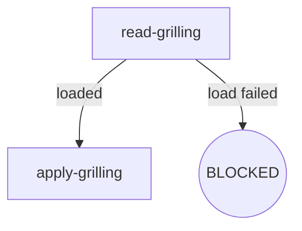

# Skill Authoring 规范

- **Version**: v1.0 · 2026-08-26
- **Scope**: P4–P9 所有 osuperpowers 技能 SKILL.md 重写的唯一格式权威
- **读者**: 本仓库维护者 + 执行重构的 AI agent
- **语言**: 中文 Strategy B（maintainer doc，无 zh-CN 镜像）

> **读者须知**: 本文档为 maintainer-only 文档，不随插件发布到消费者环境。消费者看到的只有 `packages/*/` 下的内容。

---

## 1. 概述

节点锚定式 SKILL.md 的核心思想：**digraph 为唯一控制流真相源**，正文小节与图节点一一对应。

消灭三重表示：

| 旧模式 | 问题 | 新模式 |
|---|---|---|
| HARD-GATE 十步清单 | 步骤与规则边界模糊 | 节点 Exit/Fail 字段 |
| Rules 散文堆 | 规则不归属、交叉引用难追踪 | 归属于节点或 Invariants |
| Red Flags 规则汤 | 反例与正面规则混排 | 拆入节点 Fail 字段或 Invariants |

## 2. Flow Digraph 语义约定

- 图用 **mermaid** 嵌入 SKILL.md 正文（消费者渲染支持最广）
- 节点类型：

| 类型 | mermaid 语法 | 语义 |
|---|---|---|
| 普通操作 | `A[do-thing]` | 执行动作，有明确出口 |
| 决策 | `B{condition?}` | 条件分支（diamond） |
| 终态 | `C((APPROVED))` / `D((BLOCKED))` | 流程终止（rounded） |

- 边类型：

| 类型 | 语法 | 语义 |
|---|---|---|
| 无条件 | `A --> B` | 必然转移 |
| 条件 | `A -->\|label\| B` | 标签说明分支条件 |
| 回边 | `A -->\|retry\| B` | 显式标注循环（review 循环、fix 循环） |

- 终止节点三种终态：
  - **BLOCKED** — 流程终止，需用户介入
  - **APPROVED** — 流程正常完成
  - **HANDOFF** — 交接给下一个技能/工具

## 3. Node 四要素模板

每个节点正文必须包含 **Do / Read / Exit / Fail** 四要素：

| 要素 | 内容 | 长度 |
|---|---|---|
| **Do** | 节点做什么 | 1-3 句话 |
| **Read** | 输入的文件 / 环境变量 / 上下文 | 路径列表 |
| **Exit** | 出口路由（成功 → 下一节点；条件分支的判定条件） | 与图边对齐 |
| **Fail** | 失败模式 → 行为（报错 / BLOCKED / 重试 / fail-open） | 与 Failure Modes 表互补 |

### 示例：`read-grilling` 节点

- **Do**: 读取 mattpocock-skills 的 grilling SKILL.md 并加载其框架
- **Read**: `vendors/mattpocock-skills/skills/productivity/grilling/SKILL.md`
- **Exit**: 文件存在 → `apply-grilling`；文件缺失 → BLOCKED
- **Fail**: 读取错误 → 向用户报告错误并询问下一步（skip 或 abort）

## 4. Invariants

- 跨节点的不变量，集中声明在 `## Invariants` 小节
- **上限 5 条**——超限时检查是否可降级为某节点的 Fail 字段
- 典型 invariant：
  - vendored 子模块不可改
  - commit 纪律（spec 获批即 commit）
  - 语言政策（English-primary + zh-CN 镜像）
  - block 政策（Read-Upstream 缺失一律 BLOCKED）
  - Review Stopping（重跑仅由 blocker 驱动）

## 5. Failure Modes 表

集中列出跨节点的失败行为映射，位于 `## Failure Modes` 小节：

| failure | behavior | reason |
|---|---|---|
| 上游 SKILL.md 缺失 | BLOCKED（含安装指引） | block 政策：不静默 fallback |
| 子技能加载失败 | report + ask user | Delegate Load Failure 协议 |
| harness 未安装 | BLOCKED（含注册提示） | 无可用 harness 则无法执行 |
| 嵌套 CLI 超时 | fail-open（记录 stderr） | 不阻塞主流程 |

- 与 Node Fail 字段互补：Fail 字段处理节点局部失败；本表处理跨节点失败
- 每个 failure 对应图中至少一条边或一个终态节点

## 6. BLOCKED 终态约定

BLOCKED 节点正文必须包含：

1. **阻塞原因**：一句话说明为什么卡住
2. **恢复操作**：具体的安装指引或用户手动步骤
3. **不静默 fallback**：明确声明不降级、不跳过

**Block 政策**（程序级约束）：所有带 Read-Upstream 规则的技能（brainstorming / writing-plans / finishing），上游基线缺失一律为显式 BLOCKED 节点（含安装指引）——不降级、不静默 fallback。

## 7. init legacy 内容豁免

- `skills/init/` 的 harness/spor 两分支内嵌正文保持原样
- **豁免范围**：分支内的 prose 内容（payload 模板文本）
- **不豁免**：分支结构、外层分派逻辑
- **豁免理由**：init 的 payload 是嵌入在 SKILL.md 中的模板文本，非控制流——强制节点化会破坏 payload 的可读性

## 8. 图正文一致性校验清单

P4–P9 重写后，验收必须通过以下 4 条：

1. **节点覆盖**：图中每个节点 ID 在正文有对应小节
2. **小节对齐**：正文每个小节标题与某节点 ID 对齐（无孤立小节）
3. **无独立 Rules 散文堆**：规则必须归属于节点（Do/Read/Exit/Fail）或 Invariants
4. **无独立 Red Flags 小节**：反例拆入节点 Fail 字段或 Invariants

## 9. 路径字符串编辑边界（P3 专项说明）

P3 允许对引擎、模板及消费者 SKILL.md 做「仅文档链接/路径字符串」的编辑；行为正文留待 P4–P9。具体边界：

- ✅ 文档内部互引用链接（`[text](path)`）的 path 部分
- ✅ 代码注释中的路径字符串
- ✅ 测试 fixture 中的路径字符串
- ❌ 引擎行为正文（控制流、退出码、输出契约）
- ❌ 技能 Rules/Red Flags/Checklist 散文体结构

---

## Change history

- v1.0 · 2026-08-26 — 初版（P3 docs-infra）：9 节骨架 + read-grilling 虚构示例 + init legacy 豁免规则。
