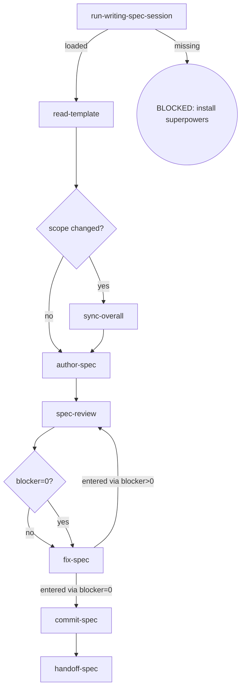
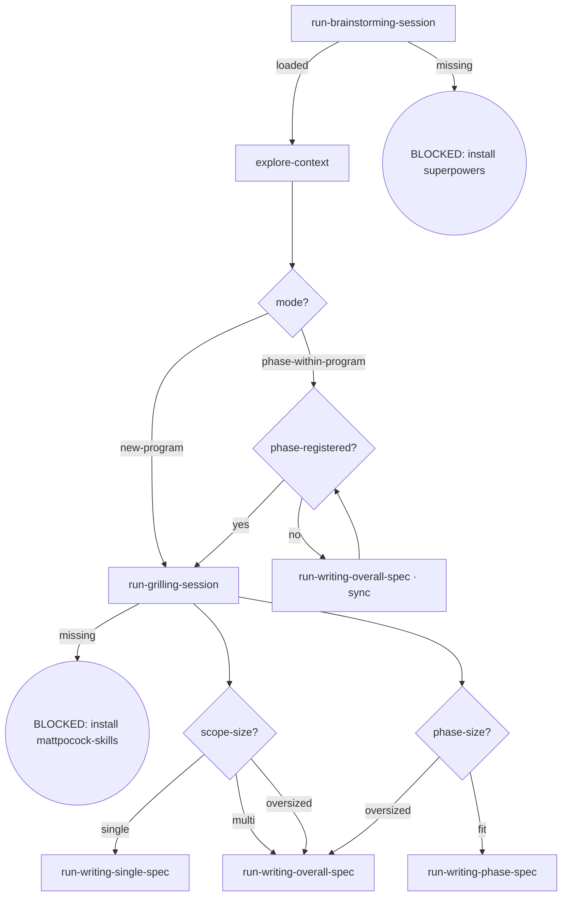
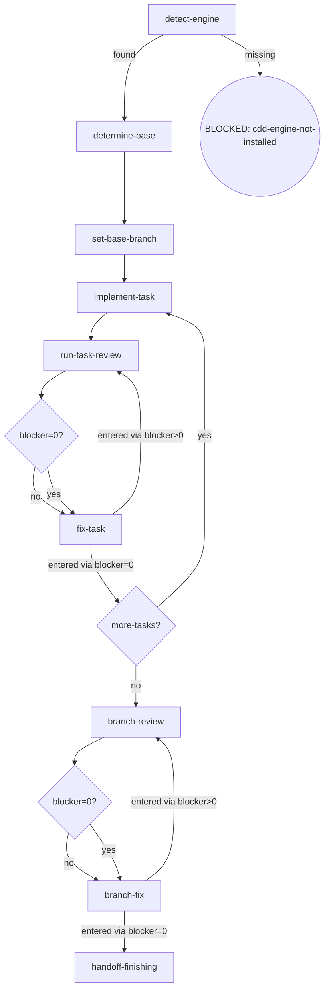

# osuperpowers 架构重构 P4 — engine 契约面收敛 + skills 全面重写实施计划

**Spec:** [2026-09-13-osuperpowers-overhaul-p4-design.md](docs/osuperpowers/specs/2026-09-13-osuperpowers-overhaul-p4-design.md)

**Goal:** 把 cdd-engine 的**跨边界契约面**收敛为单源（输入闭包三信道 + `cdd context` + 输出契约单源 + 失败六类化 + 超时自持判定），并据此把 osuperpowers 的 skills 树从 6 个 legacy skill 全量重写为 8 个节点锚定式 skill（委托型 6 / 原生型 2），删除 `init` / 版本戳机制 / `handoff-schema.md` / `_docs/review.md` 四处遗留。

**Architecture:** 三段式，**engine 先行**——①**信道收口**（`lib/root.mjs` 唯一 `process.cwd()` + `resolveDocArg` 单一坐标系 + 9 项派生值去 env 化 + `context-contract.json` canonical）；②**输出契约单源**（提示词由 JSON Schema **原样注入**（T18 终态）+ engine 写侧同源 + 失败六类化 + 配额隔离 + 超时自持）；③**单源收敛与删除**（finding-meta 枚举单源 / init / 版本戳 / handoff-schema.md）；④**skills 重写**（8 skill + 模板迁移 + 文档重写 + 治理测试同步）。段的顺序即依赖顺序：段 ①② 冻结 CLI 与输出契约，段 ④ 才有唯一可依据的最终形态。

**Tech Stack:** Node ESM（cdd-engine lib/bin/tests）· Vitest（engine suite, pool=forks）· Commander v15 · execa · ajv（handoff schema 校验）· tinyglobby · Mermaid（SKILL.md digraph）· git rm / `pnpm run emit`

## Global Constraints

从 overall v1.14 + P4 design v1.0 copy：

- **单根权威**：engine `bin`+`lib` 内 `process.cwd()` **出现次数 = 1**，且必须位于 `lib/root.mjs#initRoot()`。其余一律 `getRoot()`。全仓零 `rootFromDocPath`、零 `gitToplevel(process.cwd())` **副本**（**「副本」的落实口径 = engine `bin`+`lib` 内除该 canonical 点外零命中**，由 T8 ① 承担；`tests` 面不设常驻守卫——canonical 点自身必然是一条命中，把该 clause 写成「全仓零」会与 T8 Step 3 的 `toEqual([])` 冲突。`tests` 内的两处同名 token 由 T2 **一次性**清零，详见 T8 ⑤ 条目）。
- **单一坐标系**：`--plan` / `--spec` / `--findings` 一律**仓根相对**（绝对路径直用）；**不保留 cwd 相对回落**。未找到 → **exit 1** + BLOCKED **三行**诊断，**两种形态同为三行**（行数即断言锚点，不得增删）：
  - **仓根相对形**：① `CDD_BLOCKED: --<flag> not found: <arg>` ② `  Tried (against repo root <root>): <abs>` ③ `  Hint: cdd resolves paths against the repo root. Verify the path is correct relative to the repo root.`
  - **绝对路径形**：① 同首行（`<arg>` 即该绝对路径）② `  Absolute path does not exist.` ③ `  Hint: pass a repo-root-relative path instead.`
  - 两形态的 ① 逐字同形（首行前缀是 skills 侧唯一的路由读点）；③ 分化是**有意的**——绝对路径形的下一步动作是「改写成仓根相对」，与相对形的「核对相对位置」不是同一指导。两种形态各有一条可区分断言（T2 Step 1）。
- **退出码唯一口径 = design §2.4.2 表**：**0** = OK（正常完成 / `--dry-run` / `--help`）· **1** = 运行期不可继续（路径不存在 · 宿主缺失 · engine 自写 BLOCKED · 计数器终态耗尽）· **2** = 用法 / 环境错（commander 用法错误 · `CDD_CLI_MISSING`）· **3** = Review Stopping。**路径不存在取 1、不取 2**——与既有 `RunBlocked: plan file not found`（exit 1）同义：路径写错属「本次调用不可继续」，不属「命令行用错」。本计划内任何 `process.exit(2)` 凡为路径类 BLOCKED 一律为缺陷。
- **输入闭包五规则**：① 单源 ② 坐标系一 ③ 派生单向（引擎自算值不得回流为输入）④ 无形状推断 ⑤ 隔离经边界（测试用 `mkdtemp` 真 git 仓，**禁止** env 旁路缝）。
- **运行期 context 零落盘**：engine 内零「写 context 到任意路径」的调用。
- **输出契约单源**：提示词注入的 handoff 结构由 `templates/schema/*.json` **原样注入**（`JSON.stringify`，T18 终态；`type` / `enum` / 嵌套形状 / `allOf` 条件随行可见）；**engine 写侧经同一 schema 构造**；校验失败**保留 findings** 且报错含**违规键名**；handoff 序列化统一 `JSON.stringify` 全转义。
- **失败六类**：`TIMEOUT` / `CONTRACT_VIOLATION` / `ENGINE_SELF_WRITTEN` / `EXECUTION_FAILURE` / `UNVERIFIABLE` / `PLAN_CONFLICT`；**仅 `EXECUTION_FAILURE` 消耗 `engineRecoveryCount`**；`CONTRACT_VIOLATION` / `ENGINE_SELF_WRITTEN` 各持独立计数器与终态；**六类均不计入 Review Stopping**（Stopping 只读 review handoff 的 `findings[].severity === "blocker"` 计数）。
- **超时**：`DEFAULT_TIMEOUTS = { task: 5_400_000, review: 3_600_000 }`（90 / 60 分钟）；判定**引擎自持**——**零 `res.timedOut` 单点依赖**。
- **skills 面**：session-call 原语 = `Run a /<plugin>:<skill> session`；**零上游文档 read**（零 `vendors/` 路径、零上游 `SKILL.md` 路径、零 `Read-Upstream` 措辞）；**零 `fix-inline`**（修复一律 `cdd fix`）；**零引擎内部结构依赖**（零 `CDD_*` env 名、零 `progress.json`、零 handoff 文件名模式）——**scope 逐字取自 design AC5 = 7 个编排型 skill**（AC5 全枚举：`brainstorming` / `writing-single-spec` / `writing-overall-spec` / `writing-phase-spec` / `writing-plans` / `cli-driven-development` / `finishing`）；**`report-issue` 按 AC5 的显式例外排除**（其 `progress.json#plan` 读取是 program 通道首跳、非「引擎内部结构依赖」；去留归 P5 目标流程）——T16 守卫 2 的 scope 按此落地，见 T16 Step 4；Review Stopping 入各 skill 的 `## Invariants` 一行。
- **不改变引擎评审语义本体**：Review Stopping 的**判据**、commit-contract、`doc_hash` 双签名不动；P4 只动契约面。
- **测试断言禁假绿**：断言必须用**完整可区分形态**；凡是「删前删后同结果」的断言（如 bare 命令在 Commander required-option 下亦 exit 2）一律不用。
- 所有改动须过 `pnpm run validate`（13 块）+ `pnpm run emit:check` 无 drift；**emit 唯一入口 = 仓库根 `pnpm run emit`**（`packages/osuperpowers/package.json` 无 scripts 字段）。
- **破坏性重构已授权**（用户 2026-09-13 / 2026-09-15：允许破坏性变更、确保最佳实践、不留技术债务、遗留即删）。
- vendored 子模块不可改（`superpowers` / `mattpocock-skills` / `impeccable`）。
- **cdd 命令一律在仓根执行、路径写仓根相对**（本计划所有 `cdd …` 调用均以仓库根为 cwd）。
- changeset：`@oscaner-skills/cdd-engine` minor + `@oscaner-skills/osuperpowers` minor（一条双包）；P1/P2/P3 的 per-phase changeset 保留。

> **§2.9 overall 回填已完成（非本计划任务）**：design §2.9 的四表回填已于 `commit-spec` 前置门落地并提交（overall v1.13 → **v1.14**，commit `50e7c0d`，块 12 `3/4 canonical` 全绿）。实现者无需再改 overall。

> **实现前置（豁免面）**：历史 plan（含本文件）与 `docs/osuperpowers/{specs,plans}/*.md` **不在**任何守卫或 AC 的零残留作用域内；实现者若在历史文档中读到 `cdd brief` / `task-review` / `handoff-schema.md` 等字样，属正常，**勿"顺手清理"**。

> **P4 自伤风险（本计划排序的直接理由）**：段 ② 未落地前，本 phase 自身的 CDD task dispatch 仍可能踩 `additionalProperties` 拒绝（#260[1]）与 `blocker: null` 被拒（#260[5]）——两者都是**确定性**的。故 T1–T8（engine 段）**必须排在 T12 之后的所有 skill/文档工作之前**。

---

### Task 1: 单根权威 — `lib/root.mjs` + `process.cwd()` 收口 + lifecycle 路径纯派生

**Files:**
- Create: `packages/cdd-engine/lib/root.mjs`
- Modify: `packages/cdd-engine/bin/cdd.mjs:20-26`（顶层 `process.cwd()` → `initRoot()`，**移入 `program` 的 `preAction` 钩子**；lifecycle 路径纯派生）
- Modify: `packages/cdd-engine/lib/cli/review.mjs:120,141`（`gitToplevel(process.cwd())` → `getRoot()`）
- Modify: `packages/cdd-engine/lib/cli/fix.mjs:65`（同上）
- Modify: `packages/cdd-engine/lib/cli/branch-review.mjs:46`（同上）
- Modify: `packages/cdd-engine/lib/runner/run-docs.mjs:4,44,51-52`（`:52` 改为使用注入的 repoRoot；`:4` / `:44` / `:51` 三处注释同步去 `gitToplevel(process.cwd())` 旧措辞——注释也是计数断言的命中面）
- Modify: `packages/cdd-engine/lib/runner/run-task.mjs:282`（`opts.cwd ?? process.cwd()` 收口）
- Modify: `packages/cdd-engine/tests/docs-runner.test.mjs`（**11 处非 dry-run 的 `runDocsTask` 调用点补 `repoRoot: "/repo/root"`**——本步改 `run-docs.mjs` 的 root 来源后它们全部转红，缺此则 Step 6 的「engine 套件全绿」不可达；逐点见 Step 5 末段）
- Test: `packages/cdd-engine/tests/root.test.mjs`（新建）

**Interfaces:**
- Consumes: design §2.4.1；`lib/contract/commit.mjs#gitToplevel`
- Produces: `lib/root.mjs` 导出 `initRoot(): string`（engine 内唯一 `process.cwd()` 调用点，非 git 仓 → `CDD_BLOCKED: not in a git repository` + exit 1）与 `getRoot(): string`（未初始化即 throw）；`bin/cdd.mjs` **在 commander 的 `preAction` 钩子内**调用 `initRoot()`（root 首次被需要时），`initProcLifecycle` / `reapStale` 同置于该钩子内（仍在任何 action / dispatch 之前）。T2 的 `resolveDocArg(arg, root)` 消费 `getRoot()` 的返回值
- **退出码约束（§2.4.2 表）**：`initRoot()` **不得**无条件前置于 `parseAsync`——`--help` 在**非 git 目录**下必须仍 **exit 0**（表中 0 = OK 含 `--help`）。`preAction` 在 commander 处理完 `--help` 之后才触发，故该定序同时满足「root 唯一构造点」与退出码表。T1 有一条「非 git 目录 + `cdd --help` → exit 0」用例钉住该行为。**`--version` 不在本定序内（本 phase 不引入版本子面）**：磁盘实测 `lib/cli/parse.mjs` **无 `.version()` 声明**（全文件仅 `:36` 的 `program.helpOption("-h, --help", …)`），故 `cdd --version` 是 unknown option → 走 `bin/cdd.mjs` 的 `commander.*` 分支 → usage + **exit 2**——它既不是 exit 0 路径（退出码表的 code 0 行只列「正常完成 / `--dry-run` / `--help`」），也不在 T4 Step 3 的 canonical argv 判据内（判据不含 `version` 键）。**实现者不得据注释反推去补 `.version()`**：补了会让 T8 ⑨ 的「usage flag ⊆ canonical argv」因多出的 `--version` 立即红，而该修法与责任都不在本任务内
- **前置**：无（首个任务）

- [ ] **Step 1: 写失败测试（红）— 非 git 目录下 `initRoot()` BLOCKED + `cdd --help` 退出码钉住**

创建 `packages/cdd-engine/tests/root.test.mjs`：

```js
import { describe, it, expect } from "vitest";
import { execaSync } from "execa";
import { existsSync, mkdirSync, mkdtempSync, writeFileSync } from "node:fs";
import { tmpdir } from "node:os";
import path from "node:path";

import { gitInit } from "./helpers.mjs";

const CDD_MJS = path.resolve(import.meta.dirname, "../bin/cdd.mjs");
const REPO_ROOT = path.resolve(import.meta.dirname, "../../..");

describe("lib/root.mjs — 单根权威", () => {
  it("非 git 目录 → CDD_BLOCKED + exit 1", () => {
    const bare = mkdtempSync(path.join(tmpdir(), "cdd-nogit-"));
    const r = execaSync(process.execPath, [CDD_MJS, "review", "--type", "spec", "--spec", "x.md"], {
      cwd: bare, env: { PATH: process.env.PATH, CLAUDE_CODE_SESSION_ID: "1" }, reject: false, encoding: "utf8",
    });
    expect(r.exitCode).toBe(1);
    expect(r.stderr).toMatch(/CDD_BLOCKED: not in a git repository/);
  });

  it("非 git 目录 + cdd --help → exit 0（§2.4.2 退出码表：0 = OK 含 --help）", () => {
    const bare = mkdtempSync(path.join(tmpdir(), "cdd-nogit-help-"));
    const r = execaSync(process.execPath, [CDD_MJS, "--help"], {
      cwd: bare, env: { PATH: process.env.PATH, CLAUDE_CODE_SESSION_ID: "1" }, reject: false, encoding: "utf8",
    });
    expect(r.exitCode).toBe(0);
    expect(r.stdout).toMatch(/Usage: cdd/);
    expect(r.stderr).not.toMatch(/not in a git repository/);
  });
});
```

- [ ] **Step 2: 跑测试确认红**

Run: `pnpm --filter @oscaner-skills/cdd-engine test -- root.test.mjs`
Expected: FAIL（`lib/root.mjs` 不存在 → 命令以现有路径解析，stderr 不匹配 `not in a git repository`）。**`--help` 用例当前即绿**——它是**钉住测试**（用于区分「`initRoot()` 前置于 `parseAsync`」与「`preAction` 延后」两种实现），不是红测试，**不得删**（删后 Step 4 的定序回归无守卫）。

- [ ] **Step 3: 创建 `lib/root.mjs`**

```js
// packages/cdd-engine/lib/root.mjs — engine bin+lib 内唯一的 cwd → repoRoot 转换点。
// P4 design §2.4.1：validator 断言本转换点在 engine bin+lib 内恰好 1 处，且在此文件。
import { gitToplevel } from "./contract/commit.mjs";

let _root = null;

export function initRoot() {
  // ↓ 全 engine 唯一的 cwd 读取点（token 只在此行出现，注释一律写成散文，见 Step 6）
  _root = gitToplevel(process.cwd());
  if (!_root) {
    process.stderr.write("CDD_BLOCKED: not in a git repository\n  Run cdd from within a git repository.\n");
    process.exit(1);
  }
  return _root;
}

export function getRoot() {
  if (!_root) throw new Error("initRoot() not called — call from bin/cdd.mjs entry first");
  return _root;
}
```

> **注释形态是计数断言的一部分**（Step 6）：本文件与 `bin`+`lib` 其余文件内**不得**在注释里写出 `process.cwd()` 这一 token——否则计数断言在裸 `grep` 下多算 1 行，成为假红源（假红会误导实现者去增删真实调用点）。故：① 上方文件头注释与行尾注释均改写为不含该 token 的散文；② Step 5 同步清除 `run-docs.mjs` 现存三处注释中的旧措辞。

- [ ] **Step 4: 改 `bin/cdd.mjs` — 唯一调用点在 `preAction` 钩子内 + lifecycle 纯派生**

```js
// root 首次被需要时初始化：--help 由 commander 在 preAction 之前处理并 exit 0
//（§2.4.2 退出码表：0 = OK 含 --help，**不含 --version**——`parse.mjs` 无 `.version()` 声明，
//  `cdd --version` 是 unknown option → exit 2）——initRoot() 不得无条件前置于 parseAsync。
program.hook("preAction", async () => {
  const repoRoot = initRoot();
  // 原：const cwd = process.cwd();
  //     const lifecyclePath = process.env.CDD_LIFECYCLE_PATH ?? path.join(cwd, ".osuperpowers", "cdd", "lifecycle.json");
  initProcLifecycle({ diskPath: path.join(repoRoot, ".osuperpowers", "cdd", "lifecycle.json") });
  await reapStale({ graceMs: 2000 });   // 启动兜底：跨 run 孤儿组连根回收（仍在任何 action / dispatch 之前）
});
```

同时**删除** `bin/cdd.mjs:22-23` 两行 `CDD_LIFECYCLE_PATH` 注释；原顶层的 `initProcLifecycle(...)` / `await reapStale(...)` 两行**由钩子承接**（不得留两份）。追加 import：`import { initRoot } from "../lib/root.mjs";`。

- [ ] **Step 5: 替换 4 处 `gitToplevel(process.cwd())` → `getRoot()`**

`cli/review.mjs:120,141` · `cli/fix.mjs:65` · `cli/branch-review.mjs:46`：改为 `getRoot()`（加 import；若该文件的 `gitToplevel` 已无其它用途则删其 import）。
`runner/run-docs.mjs:52`：改为使用调用方传入的 `repoRoot`（其签名已收 `repoRoot`，现为「accepted but ignored」——改为真用；`opts.repoRoot ?? getRoot()`）。**同文件 `:4` / `:44` / `:51` 三处注释**仍写着 `gitToplevel(process.cwd())` 旧措辞——同步改为 `getRoot()` /「经注入的 repoRoot」，否则 Step 6 的计数断言被注释多算 3 行（注释也是 `grep -rn` 的命中面）。
`runner/run-task.mjs:282`：`const cwd = opts.cwd ?? process.cwd();` → `const cwd = getRoot();`（若 `opts.cwd` 无消费方则整行收敛）。

**`tests/docs-runner.test.mjs` 的 11 处调用点须同步补 `repoRoot`**（Step 6 的「engine 套件全绿」的必要面——**该文件的调用点不随 `run-docs.mjs` 的改动自动适配**）：本文件以 `vi.mock("../lib/contract/commit.mjs")` 把 `gitToplevel` 打桩为 `"/repo/root"`，而全文件**只有 `:148` 一处显式传 `repoRoot`**；其余**非 dry-run** 的 `runDocsTask(opts)` 调用（`:174,186,203,217,251,281,303,319,344,364,393`）都靠该桩取 cwd。本步把 `run-docs.mjs:52` 改为**真用注入**后，这 11 处会走 `opts.repoRoot ?? getRoot()` 的**右支**——`getRoot()` 未初始化即 throw（模块级单例、无 reset 缝，测试不得调 `initRoot()`），于是它们全部转红，且**报错面是 `initRoot() not called` 而不是各自的断言**（`:203` 那条 `rejects.toThrow(/handoffPath required/)` 会被该 throw 抢先，正则不匹配；其余各处则在断言前就抛出）。故逐个补 `repoRoot: "/repo/root"`（与该文件既有的假路径字面量同值，**所有断言不变**）。
  - **`dryRun: true` 的调用点（`:128`）不改**——`repoRoot` 在 `run-docs.mjs` 的 `if (dryRun) return` **之后**才求值，dry-run 路径根本不经过它（这也是 T2 的两条 in-process 用例不受影响的原因）。
  - **`gitToplevel` 桩本步不动**：删桩属独立改动（须先确认 `run-docs` 的模块图内已无第二消费方），本步只补 `repoRoot` 参数。

- [ ] **Step 6: 跑 engine 套件 + 计数断言（临时 shell 断言，守卫在 T8 落 validate）**

Run:
```bash
grep -rn "process\.cwd()" packages/cdd-engine/bin packages/cdd-engine/lib   # 期望：恰好 1 行，且唯一命中文件为 lib/root.mjs
pnpm --filter @oscaner-skills/cdd-engine test
```
Expected: 命中行数 = **1**，该行所在文件恰为 `packages/cdd-engine/lib/root.mjs`；engine 套件全绿。

> 断言形态即「命中行数 = 1 **且**唯一命中文件 = `lib/root.mjs`」——两项都要写，只写计数不足以区分「收口到 root.mjs」与「收口到别处」。T1 前实测该命令为 **10 行** = **7 处真实调用**（`bin/cdd.mjs:24` · `cli/review.mjs:120,141` · `cli/fix.mjs:65` · `cli/branch-review.mjs:46` · `runner/run-docs.mjs:52` · `runner/run-task.mjs:282`）+ **3 行 `run-docs.mjs` 注释**（`:4` / `:44` / `:51`），与 design §2.1「7 处 `process.cwd()` 直读」一致。故「= 1」是有区分度的红→绿过渡；实现者按上列 7 点逐点核对（**不是 6**）——T1 Step 5 的 Files 清单已逐点覆盖这 7 处。
> **T8 ① 同一口径**：T8 的守卫按「剔除整行注释」形实现（`grep -v ':[0-9]*:\s*//'`）作为兜底；但经 Step 3/Step 5 清理后，裸 grep 与剔除注释形**同值**，两形均可作断言锚点。若后续新增文件在注释里写入该 token 而守卫转红，正确处置是改注释、不是改守卫。

- [ ] **Step 7: Commit**

```bash
git add packages/cdd-engine/lib/root.mjs packages/cdd-engine/bin/cdd.mjs packages/cdd-engine/lib/cli packages/cdd-engine/lib/runner packages/cdd-engine/tests/root.test.mjs packages/cdd-engine/tests/docs-runner.test.mjs
git commit -m "refactor(cdd-engine): 单根权威 lib/root.mjs — process.cwd() 收口为 1 处 + lifecycle 路径纯派生"
```

---

### Task 2: 单一坐标系 — `resolveDocArg` + `resolveWorkspace(doc, root)` + 删 `rootFromDocPath`

**Files:**
- Modify: `packages/cdd-engine/lib/root.mjs`（追加 `resolveDocArg`）
- Modify: `packages/cdd-engine/lib/handoff/naming.mjs:118-140`（`resolveWorkspace` 收注入 root；**整段删除** `rootFromDocPath`）
- Modify: `packages/cdd-engine/lib/cli/shared.mjs#resolveTargetDoc`（出口改经 `resolveDocArg(doc, opts.root ?? getRoot(), …)`）
- Modify: `packages/cdd-engine/lib/cli/review.mjs:75,141`（`:141` task workspace 用已归一化的 plan；`:75` 补第二参；**顶部 `const root = opts.root ?? getRoot()`**——本文件所有 root 消费点统一用它，见下方「in-process 用例的合规通道」）
- Modify: `packages/cdd-engine/lib/cli/fix.mjs`（`--findings` 过 `resolveDocArg`；`:61` 的 `resolveWorkspace(doc)` 补第二参；顶部同形 root 注入）
- Modify: `packages/cdd-engine/lib/cli/branch-review.mjs:51`（`resolveWorkspace(plan)` 补第二参）
- Modify: `packages/cdd-engine/lib/cli/base-branch.mjs:19`（`resolveBaseBranchWorkspace` **单点接线**：`opts.plan` **先**过 `resolveDocArg(opts.plan, root, "plan")`、**再** `resolveWorkspace(normalizedPlan, root)`——**易漏点**：`cdd base-branch set/get` 是 `--plan` 目标的另一条派生路径，与 review / fix / branch-review 三处并列；只补第二参会让该命令**保留第二套坐标系**（仓根相对归一根本不发生），T8 ④ 的「`--plan` 每个读取点都有 `resolveDocArg`」即不可满足。缺 `--plan` 的 `exit 2`（用法错）**不变**——归一只作用于「已提供但不存在」的路径 → `exit 1`）
- Modify: `packages/cdd-engine/tests/docs-runner.test.mjs:141,155,162`（**三处均为 token 命中面或 T1 后的陈旧措辞，本任务一次性清零**——三处都在 `tests/` 内，**不随 Step 4 的 `naming.mjs` 删除自动消失**：`:162` 的注释含 `rootFromDocPath`，是**守卫 ⑤「全仓零 `rootFromDocPath`（含 tests）」的命中面**，漏改则 T8 Step 3 的 `expect(collectChannelAuditHits()).toEqual([])` 恒红且 T9–T17 无承接者；`:141` 的用例名逐字含 `gitToplevel(process.cwd())`、`:155` 的行尾注释述「`repoRoot` accepted but ignored」——二者**不是 ⑤ 的命中面**（`gitToplevel(process.cwd())` 的唯一性由 T8 ① 在 `bin`+`lib` 内承担，见 T8 ⑤ 条目），但 T1 Step 5 后 `run-docs.mjs` 不再调用 `gitToplevel`（改为使用注入的 `repoRoot`），该用例名与其 mock 说明即成为**与实现相反的陈述**，须同步为真。逐点改法见 Step 4）
- Modify: `scripts/lib/doc-root.mjs:7-9`（**同属 ⑤ 的命中面**：删「⚠️ 引擎内独立副本：`…naming.mjs` 的 `rootFromDocPath` …该处须随本常量同步变更」整段——本任务落地后引擎侧已无第二份实现，该治理文本成为**指向已删函数的悬空指针**（其交叉引用对象 `naming.mjs:118-140` 的注释块同步删除）；改为不含该 token 的既成事实陈述或整段删除。**`DOC_ROOT_SEGMENTS` 等常量本体保留**——仓工具链侧（`overall-consistency.mjs` / `grep-sweep-regression.test.mjs`）仍消费它们）
- Test: `packages/cdd-engine/tests/root.test.mjs`（追加）
- Test: `packages/cdd-engine/tests/handoff-naming.test.mjs`（**4 处单参调用迁移**：`:63,64,70,72`——文件真实名为 `handoff-naming.test.mjs`，不存在 `naming.test.mjs`）
- Test: `packages/cdd-engine/tests/cdd.test.mjs`（**两族共 4 处**：① `:329-333` 的 2 处 `resolveWorkspace` 单参调用迁移；② `:312-356` 的两条 `vi.mock("../lib/runner/run-docs.mjs")` **in-process 用例**改合规通道——本任务只落「真仓 + 真 doc + `root` 注入」，**dry-run 通道保留 env 过渡态**，`setDryRun(true)` 替换归 T3 Step 3/5，见下方「in-process 用例的合规通道」）

**Interfaces:**
- Consumes: T1 的 `getRoot()`
- Produces: `resolveDocArg(arg, root, flag): string`（绝对路径直用；否则 `path.join(root, arg)`；不存在 → **exit 1** + **三行**诊断，见 Global Constraints / design §2.4.2）。`resolveWorkspace(doc, root): string`（**签名变更**——新增第二参 root；无 root 即 throw）。`runReview(opts)` / `runFix(opts)` 增 `opts.root` 注入位（`opts.root ?? getRoot()`——与 T3 根注入契约同形；见下方「in-process 用例的合规通道」）。T3 的部分调用点、T4 的 slug 派生均消费之
- **路径类实参归一入口闭包（**call site 5 处 = `lib/cli/**` 内 4 处 + `lib/runner/run-task.mjs` 1 处；对应 design §2.4.2 拦截面 read point 7 处**，T8 ④ 的正向核对面）**：两套计数**都要**报（只报一个数会让实现者按错数去凑清单）——
  - **call site ①** `cli/shared.mjs#resolveTargetDoc`（review / fix 的 `--plan` / `--spec` **公共入口**——一个 call site 覆盖 read point ②③⑤⑥ 四处）
  - **call site ②** `cli/fix.mjs` 的 `--findings`（read point ⑦）
  - **call site ③** `cli/review.mjs:141` 的 task workspace 分支（review 侧 `--plan` 的二次消费点，read point ②）
  - **call site ④** **`cli/base-branch.mjs#resolveBaseBranchWorkspace` 的 `--plan`（本条最易漏——base-branch 不经 `resolveTargetDoc`，是独立入口；design §2.4.2 的拦截面明列 `--plan`（implement / review / fix / **base-branch**））**
  - **call site ⑤（不在 `lib/cli/**` 内）** `lib/runner/run-task.mjs` 的 **`implement --plan`**（read point ①）——由 T3 Step 3 落 `resolveDocArg(planFile, root, "plan")` 承接。**故 T8 ④ 的 scope 必须扩为 `lib/cli/**` ∪ `lib/runner/run-task.mjs` 的 path 入参点**；否则 7 个已声明 read point 中有 1 个无守卫覆盖（④ 若只查 `lib/cli/**`，需以守卫 ⑤ 的「零 `resolveRepoRoot`」+ T3 Step 3 的该行调用作为替代证据，二者必居其一，不得两处都空）
  - **read point 7 处（design §2.4.2 拦截面全枚举，逐一落在上述 call site 上）**：① `--plan`（implement，call site ⑤）· ② `--plan`（review，call site ① + ③）· ③ `--plan`（fix，call site ①）· ④ `--plan`（base-branch，call site ④）· ⑤ `--spec`（review，call site ①）· ⑥ `--spec`（fix，call site ①）· ⑦ `--findings`（fix，call site ②）。缺参（`!opts.plan`）仍是 `exit 2`；「提供了但路径不存在」由 `resolveDocArg` → `exit 1`
- **调用点闭包（本任务的全部改造面，逐点核对）**：生产侧 `lib/cli/{review.mjs:75,fix.mjs:61,branch-review.mjs:51,base-branch.mjs:19}` 四处单参调用补 `getRoot()`（`lib/runner/run-task.mjs:95,307` 的**同名函数是另一个实现**，由 T3 整段删除，本任务不动）；测试侧 `tests/handoff-naming.test.mjs:63,64,70,72` 与 `tests/cdd.test.mjs:331,333` 共 6 处单参调用迁移；`tests/runner.test.mjs` 的两族**均由 T3 随 `run-task.mjs` 的两个函数删除处理**（本任务不动）——**行号逐族分开，不得合并引用**：① `run-task#resolveWorkspace` 用例 `:247-253`；② `resolveRepoRoot` 的具名 import `:16` 与用例 `:331-336`（`:247-251` 只对应 ①，按它去找 `resolveRepoRoot` 会落到无关代码上）
- **测试侧迁移形态（不得调 `initRoot()`）**：`resolveWorkspace` 的 root 一律**显式注入**（T3 的根注入契约：`getRoot()` 是模块级单例且无 reset 缝，测试既不得调 `initRoot()`、也不得 `process.chdir()`）——
  - **正例**：`resolveWorkspace(doc, "/repo")` 传仓根字面量，断言返回 `<root>/.osuperpowers/cdd/<slug>`；
  - **旧派生行为已删的可区分断言**：`resolveWorkspace(doc)` 单参（等价于 `root === undefined`）→ `toThrow(/root required/)`——`handoff-naming.test.mjs:70,72` 的两条原 `toThrow(/not in a git repo/)` 断言按此改写。该改写在红/绿两侧可区分：改造前单参调用按**路径形状**派生 root（`:70,72` 两条因形状非 canonical 而抛 `not in a git repo`），改造后一律抛 `root required`，正则不匹配即红；
  - `workspaceSlug` 的「仅文件名派生」语义不变（`resolveWorkspace` 的 slug 仍由文件名派生）——`:74` 起的既有用例不受影响
- **in-process 用例的合规通道（`tests/cdd.test.mjs:312-356` 的两条 `vi.mock("../lib/runner/run-docs.mjs")` 用例，必须承接，否则「engine 套件全绿」不可达）**：这两条**不是** env 旁路缝（它们断言的是 `runReview` / `runFix` 传给 `runDocsTask` 的**派生参数**——`handoffPath` / `workspace` / `findingsPath`，正是 P6 T3 契约的本体，删掉即丢守卫），但 T1/T2 后**必然红**：① `resolveTargetDoc` 经 `resolveDocArg` 会命中假路径 `/repo/root/docs/...`（磁盘不存在）→ `process.exit(1)` **打死 vitest worker**；② `getRoot()` 未初始化即 throw（测试不得调 `initRoot()`，而 `runReview` / `runFix` 无 root 注入口）。**合规通道（本计划采用，二选一中的「保留 in-process + 给合规通道」）**：
  - **root 注入位**：`runReview(opts)` / `runFix(opts)` 顶部 `const root = opts.root ?? getRoot();`，`root` 供本文件所有 root 消费点使用（T1 的 `gitToplevel(process.cwd())` 两处、T2 的 `resolveDocArg` / `resolveWorkspace` 第二参）。该注入位与 T3 的**「根注入契约（进程内外同形）」同一形**——无 reset、无 env、无 `__*ForTest`，**不是**为测试新开的后门缝（§2.3.1 规则⑤）。
  - **dry-run 通道＝过渡态（本任务保留 env；`setDryRun` 的替换动作归 T3）**：本任务这两条用例**保留** `process.env.CDD_DRY_RUN = "1"`（T2 时点 `DRY_RUN()` 仍读 env，磁盘形态如此）。理由：in-process 调用**不解析 argv**，`preAction` 不触发，故「argv 前置 `--dry-run`」对这两条用例**物理不适用**——T3 给黑盒用例的 argv 迁移指令对它们无效，不能照搬。**替换为 `setDryRun(true)` 的动作显式归 T3 Step 3（写入侧落地处）+ T3 Step 5-3（迁移面登记处）**，与 `root.test.mjs` 子目录用例同批；T3 落地后这两条与本项的 env 项一并消失（`CDD_DRY_RUN` 键名零命中的前提）。**不得**在 T2 Interfaces 与 T3 Step 5-3 两处给出互相矛盾的处置——把该替换写成「经 T3 产出」却排在 T2 内执行的写法，会让 `setDryRun` 在 T2 时点尚不存在（按字面实施即 `import` 未导出符号），T2 Step 6 的「全绿」不可达。
  - **真仓 + 真 doc**：两条用例改 `mkdtempSync` 真仓（`gitInit()`）+ 真 doc 文件（`docs/osuperpowers/specs/foo-design.md`），传 `root: repo`；期望值由 `repo` 计算，如 `expect(call.handoffPath).toBe(path.join(repo, ".osuperpowers/cdd/foo/spec-review-1.json"))`（原 `/repo/root/...` 字面量全部作废）。`finally` 内删除 `process.env.CDD_DRY_RUN`（T2 过渡态）；**T3 换成 `setDryRun(true)` 后，`finally` 改为 `setDryRun(false)` 复位**，防模块态泄漏到同文件其它用例。
  - **保留** `CLAUDE_CODE_SESSION_ID: "1"`（host 检测读 `process.env`，与 root / dry-run 两通道无关）。
- **退出码语义（本任务不得引入 exit 2）**：design §2.4.2 表——**1 = 运行期不可继续**（本函数的「路径不存在」即此类）· 2 = 用法 / 环境错 · 3 = Review Stopping；skills 只按 code 粗分流，具体路由读 stderr **首行前缀**
- **前置**：T1

- [ ] **Step 1: 写失败测试（红）— 子目录 + 仓根相对路径不再产生幽灵根；负例给三行诊断**

追加到 `packages/cdd-engine/tests/root.test.mjs`：

```js
it("子目录 + 仓根相对 --spec → 无幽灵根（自给自足真仓；不依赖本机残留）", () => {
  // 自给自足：mkdtemp 真 git 仓 + 真 doc 文件。**不得**断言 `REPO_ROOT/.osuperpowers/...`——
  // `.osuperpowers` 被 `.gitignore` 忽略，fresh clone / CI 上不存在；且 dry-run 路径下
  // runDocsTask 在 `if (dryRun) return` 处早退、resolveNextRound 只读不建（ENOENT 归 round 1），
  // **没有任何代码会创建该 workspace**——该断言在 CI 必然红（AC13 不可达）。
  const repo = mkdtempSync(path.join(tmpdir(), "cdd-subdir-"));
  gitInit(repo);
  const rel = "docs/osuperpowers/specs/2026-09-13-foo-design.md";
  mkdirSync(path.join(repo, "docs/osuperpowers/specs"), { recursive: true });
  writeFileSync(path.join(repo, rel), "# foo design\n");
  const sub = path.join(repo, "packages/cdd-engine");
  mkdirSync(sub, { recursive: true });
  const r = execaSync(process.execPath, [CDD_MJS, "review", "--type", "spec", "--spec", rel],
    // ⚠ 过渡态：`CDD_DRY_RUN` env 在此保留（program 级 `--dry-run` argv 由 T3 声明）；
    //   **T3 Step 5 必须把本项改为 argv 前置 `--dry-run` 并删该 env 项**——否则 T3 删净 env 读取后
    //   该用例会真实派发 agent CLI。
    { cwd: sub, env: { PATH: process.env.PATH, CLAUDE_CODE_SESSION_ID: "1", CDD_DRY_RUN: "1" }, reject: false, encoding: "utf8" });
  expect(r.exitCode).toBe(0);
  expect(existsSync(path.join(sub, ".osuperpowers"))).toBe(false);      // 无幽灵根（子目录下不得出现）
});

it("不存在的仓根相对路径 → exit 1 + BLOCKED 三行诊断（含仓根相对指导）", () => {
  const r = execaSync(process.execPath, [CDD_MJS, "review", "--type", "spec", "--spec", "docs/nope.md"],
    { cwd: REPO_ROOT, env: { PATH: process.env.PATH, CLAUDE_CODE_SESSION_ID: "1" }, reject: false, encoding: "utf8" });
  expect(r.exitCode).toBe(1);                                     // §2.4.2：1 = 运行期不可继续（**不是** 2）
  expect(r.stderr.trimEnd().split("\n").length).toBe(3);          // 三行诊断（行数是可区分形态，非恒真断言）
  expect(r.stderr).toMatch(/CDD_BLOCKED: --spec not found: docs\/nope\.md/);
  expect(r.stderr).toMatch(/Tried \(against repo root .+\): /);
  expect(r.stderr).toMatch(/Hint: cdd resolves paths against the repo root\. Verify the path is correct relative to the repo root\./);
});

it("不存在的绝对路径 → exit 1 + BLOCKED 三行诊断（绝对路径形措辞；与相对形可区分）", () => {
  const abs = path.join(REPO_ROOT, "docs/nope-abs.md");          // 绝对路径直用分支的负例（Global Constraints 的第二种形态）
  const r = execaSync(process.execPath, [CDD_MJS, "review", "--type", "spec", "--spec", abs],
    { cwd: REPO_ROOT, env: { PATH: process.env.PATH, CLAUDE_CODE_SESSION_ID: "1" }, reject: false, encoding: "utf8" });
  expect(r.exitCode).toBe(1);                                     // 与相对形同码（§2.4.2：1，**不是** 2）
  expect(r.stderr.trimEnd().split("\n").length).toBe(3);          // 两形态同为三行（行数锚点）
  expect(r.stderr).toMatch(/CDD_BLOCKED: --spec not found: .*nope-abs\.md/);   // ① 与相对形逐字同形
  expect(r.stderr).toMatch(/Absolute path does not exist\./);                   // ② 绝对路径形
  expect(r.stderr).toMatch(/Hint: pass a repo-root-relative path instead\./);   // ③ 绝对路径形
  expect(r.stderr).not.toMatch(/Tried \(against repo root/);                    // 绝对形不得出现仓根尝试行（可区分形态）
});
```

> `REPO_ROOT` 由测试文件顶部 `path.resolve(import.meta.dirname, "../../..")` 求取（既有 engine 测试同形；T1 Step 1 已写入）。
> **本用例的断言边界（dry-run 不写盘 → 落点只能经 seed 或非 dry-run 观察）**：`runDocsTask` 在 `if (dryRun) return` 处早退（`lib/runner/run-docs.mjs:41-43`），故 dry-run 下**零落盘**——「artifact 落仓根 workspace」这一**正向落点**在本用例内不可观测，故**不设该断言**（设了就是恒真或恒假的假绿源）。本用例只钉两件事：① 子目录 cwd 下 `--spec` 仍解析成功（exit 0）② 子目录下**不得**出现幽灵根 `.osuperpowers/`。正向落点的观测由两条既有路径承担：T7 的 `progress-owner.test.mjs`（注入 `root` + 真仓，断言 `<repo>/.osuperpowers/...` 产物）与 `cdd.test.mjs` 的非 dry-run 黑盒用例（PATH-shim stub harness，见 `lifecycle.wiring.test.mjs` 既有技术）。

- [ ] **Step 2: 跑测试确认红**

Run: `pnpm --filter @oscaner-skills/cdd-engine test -- root.test.mjs`
Expected: FAIL（现行为：子目录用例产生幽灵根；负例 stderr 为 `RunBlocked: plan file not found`——首行前缀、行数、`Hint` 文案三项均不匹配）

- [ ] **Step 3: 追加 `resolveDocArg` 到 `lib/root.mjs`**

```js
import { existsSync } from "node:fs";
import path from "node:path";

// 内容路径入参的唯一归一函数：仓根相对（绝对路径直用）。不保留 cwd 相对回落。
// 退出码 = 1（§2.4.2 表：路径不存在属「运行期不可继续」——**不是** 2「用法 / 环境错」）。
// 诊断恒为三行（行数即断言锚点，不得增删）。
export function resolveDocArg(arg, root, flag = "path") {
  if (path.isAbsolute(arg)) {
    if (existsSync(arg)) return arg;
    process.stderr.write(
      `CDD_BLOCKED: --${flag} not found: ${arg}\n` +
      `  Absolute path does not exist.\n` +
      `  Hint: pass a repo-root-relative path instead.\n`);
    process.exit(1);
  }
  const resolved = path.join(root, arg);
  if (existsSync(resolved)) return resolved;
  process.stderr.write(
    `CDD_BLOCKED: --${flag} not found: ${arg}\n` +
    `  Tried (against repo root ${root}): ${resolved}\n` +
    `  Hint: cdd resolves paths against the repo root. Verify the path is correct relative to the repo root.\n`);
  process.exit(1);
}
```

- [ ] **Step 4: 改 `handoff/naming.mjs#resolveWorkspace` — 收注入 root，删 `rootFromDocPath`**

```js
// resolveWorkspace(doc, root) → <root>/<workspaceRoot>/<slug>。root 由调用方注入（getRoot()）。
export function resolveWorkspace(doc, root) {
  if (!root) throw new Error("resolveWorkspace: root required (injected from lib/root.mjs)");
  return path.join(root, NAMESPACE.workspaceRoot, workspaceSlug(doc));
}
```
**整段删除** `rootFromDocPath`（含其注释块与「与 `scripts/lib/doc-root.mjs` 同步」的交叉引用注）。
同步删 `gitToplevel` / `path.dirname(path.resolve(...))` 相关 import（若已无其它用途）。

**同一步清零 ⑤ 的其余命中点**（`naming.mjs` 内的两处随上段删除消失；下列四处**不随它消失**，须逐点动手）：
1. `packages/cdd-engine/tests/docs-runner.test.mjs:141` — 用例名 `"subprocess cwd = gitToplevel(process.cwd()) not doc directory"` 逐字含 `gitToplevel(process.cwd())` → 改为 `"subprocess cwd = injected repoRoot, not doc directory"`。
2. `packages/cdd-engine/tests/docs-runner.test.mjs:155` — 行尾注释 `// accepted in opts but gitToplevel() is used (Bug L fix)` → 改为「`repoRoot` 由调用方注入并真被使用（T1 Step 5）」。该断言（`expect(callOpts.cwd).toBe("/repo/root")`）本体不动：T1 后 cwd 仍为仓根，只是来源由 `gitToplevel(process.cwd())` 换成注入的 `repoRoot`（用例已传 `repoRoot: "/repo/root"`）。第 1、2 两点**不是 ⑤ 的命中面**（见 T8 ⑤ 条目），此处同步的理由是「用例名/注释与实现相反」。
3. `packages/cdd-engine/tests/docs-runner.test.mjs:162` — 注释含 `rootFromDocPath`（「…`rootFromDocPath` 回落）…已删，见 P2 plan T3 follow-up」）→ 改写为不含该 token 的散文（保留「原反向断言不可失败故已删」的信息即可）。**这一处是 ⑤「全仓零 `rootFromDocPath`」的命中面**（⑤ 的 scope 含 tests），不清则该守卫在 T8 时点恒红。
4. `scripts/lib/doc-root.mjs:7-9` — 删「⚠️ 引擎内独立副本：…`rootFromDocPath`…该处须随本常量同步变更」整段（引擎侧已无第二份实现，留着即指向已删函数的悬空治理文本）。**同属 ⑤ 的命中面**（⑤ 的 scope 是全仓，`scripts/` 在内——T8 ③ 对六键零命中的 `bin`+`lib` scope 限定**不适用于本条**）。

- [ ] **Step 5: 归一入口接线**

`cli/shared.mjs#resolveTargetDoc(opts, verb)`：返回前过 `resolveDocArg(doc, opts.root ?? getRoot(), opts.type === "spec" ? "spec" : "plan")`。
`cli/fix.mjs` 的 `--findings`：过 `resolveDocArg(opts.findings, opts.root ?? getRoot(), "findings")`（仅当提供时）。
`cli/review.mjs:141` 与 `cli/fix.mjs` 的 `--plan` 分支：确保送入 `resolveWorkspace` 的 doc 已是**绝对**路径。
`cli/base-branch.mjs#resolveBaseBranchWorkspace`：`opts.plan` **先**过 `resolveDocArg(opts.plan, root, "plan")`、**再**入 `resolveWorkspace(normalizedPlan, root)`——**这是 `lib/cli/**` 内的第 4 条归一 call site（全闭包 call site ⑤ 的 `implement --plan` 落在 `lib/runner/run-task.mjs`、由 T3 承接，见 Interfaces 的双计数），最易漏**（base-branch 不经 `resolveTargetDoc`；只补第二参等于让该命令保留第二套坐标系）。
**`runReview` / `runFix` 顶部加 root 注入位**：`const root = opts.root ?? getRoot();`，供上述各点与 T1 落地的 `getRoot()` 消费点共用（理由见 Interfaces「in-process 用例的合规通道」——`getRoot()` 是模块级单例、无 reset 缝，进程内测试只能靠注入）。
**`resolveWorkspace` 全部调用点补第二参 `getRoot()`**——生产侧逐点核（四处，与本任务 Files 一一对应）：`cli/review.mjs:75` · `cli/fix.mjs:61` · `cli/branch-review.mjs:51` · `cli/base-branch.mjs:19`。改后 `grep -rn "resolveWorkspace(" packages/cdd-engine/lib` 内**每一条都由本任务处理**（`lib/runner/run-task.mjs:95` 是自有实现，T3 整段删除，此处不动）。
**测试侧逐点核（6 处）**：`tests/handoff-naming.test.mjs:63,64` 传仓根字面量（正例）；`:70,72` 改为单参 → `toThrow(/root required/)`（旧派生行为已删的可区分断言）；`tests/cdd.test.mjs:331,333` 传仓根字面量。测试**不得**调 `initRoot()`、不得 `process.chdir()`。

- [ ] **Step 6: 跑测试 + 全仓零残留**

Run:
```bash
pnpm --filter @oscaner-skills/cdd-engine test
grep -rn "rootFromDocPath" packages/cdd-engine scripts || echo "OK — zero"
grep -rnF "gitToplevel(process.cwd())" packages/cdd-engine/tests || echo "OK — zero (tests)"
grep -rnE "resolveWorkspace\(|resolveDocArg\(" packages/cdd-engine/lib | grep -vE ':[0-9]+:[[:space:]]*//'   # 剔除整行注释（T8 ① 的「剔除整行注释」形的 shell 可移植写法）；期望：每条命中都在下方「命中台账」内（两个函数同口径）
```
Expected: 全绿（含迁移后的 6 处测试用例与两条 in-process 用例——**两条用例的 dry-run 通道在本任务是过渡态 `process.env.CDD_DRY_RUN`，其 argv 不适用、`setDryRun` 替换归 T3，见 Interfaces「in-process 用例的合规通道」**）；零 `rootFromDocPath`（`packages/cdd-engine` **+ `scripts`** 两面——⑤ 的 scope 是全仓，历史文档面按文首「实现前置（豁免面）」）；**tests 面**零 `gitToplevel(process.cwd())`（Step 4 第 1 点改掉的 `docs-runner.test.mjs:141` 即该 token 在 tests 内的唯一命中；`bin`+`lib` 面的「恰 1 处且唯一命中文件 = `lib/root.mjs`」由 T1 Step 6 / T8 ① 承担，本步不重复计数）；两条 grep 的**命中台账见下**——「调用点 ⊆ 清单」按字面核对时，**定义行 / 帮助文本子串 / 第二实现同样是命中面**，漏列即产出不可满足的断言（实现者会看到「清单外命中」而误判为自己漏改，或反过来去动不该动的帮助文本）：

> **`resolveWorkspace(` / `resolveDocArg(` 命中台账（本步 grep 的逐类归属，一条不漏）**
>
> | 命中 | 类别 | 本任务处置 |
> |---|---|---|
> | `handoff/naming.mjs:122` | `resolveWorkspace` **定义行**（本任务改造为 `resolveWorkspace(doc, root)`） | 改签名（Step 4） |
> | `cli/review.mjs:75` · `cli/fix.mjs:61` · `cli/branch-review.mjs:51` · `cli/base-branch.mjs:19` | `resolveWorkspace` **生产调用点恰四点**（= 上方「调用点闭包」的生产侧四点） | 补第二参（Step 5） |
> | `lib/runner/run-task.mjs:95`（定义）· `:307`（调用） | **同名函数的另一个实现** | 本任务**不动**，由 T3 整段删除 |
> | `cli/parse.mjs:94` · `:100` | `.option("--plan <path>", "plan file → resolveWorkspace(plan)")` 的**帮助文本子串**——非调用点（描述文本含 `→`） | 本任务**不动**（`parse.mjs` 不在 T2 Files 内，无改造动作） |
> | `handoff/naming.mjs` 定义上方注释（本任务删除）· `cli/review.mjs:20` / `cli/fix.mjs:59` / `cli/branch-review.mjs:50` / `cli/base-branch.mjs:2` 的注释 | 注释行（含 `resolveWorkspace(...)` 措辞） | `naming.mjs` 侧随 Step 4 删除；其余不属本步改造面。**已由命令的 `grep -vE` 剔除**，故不进入台账的判定集 |
> | `lib/root.mjs`（`resolveDocArg` **定义行**） | 定义行 | 随 Step 3 落地 |
> | `cli/shared.mjs#resolveTargetDoc` · `cli/fix.mjs` 的 `--findings` · `cli/review.mjs:141` · `cli/base-branch.mjs#resolveBaseBranchWorkspace` | `resolveDocArg` **归一 call site 恰四点**（`lib/cli/**` 内全闭包） | 接线（Step 5） |
> | `lib/runner/run-task.mjs` 的 `implement --plan`（call site ⑤） | `resolveDocArg` 的第 5 点 | 由 T3 Step 3 落，本任务时点**可以尚未出现**，故本任务结论以「已落点 ⊆ 清单」为准 |
>
> 即本步的结论形是「**上表每一类命中都有归属**」，**不是**「命中行数 = 清单长度」——`resolveWorkspace(` 侧的**调用点**恰为四点，但同名的定义行、第二实现与帮助文本也在同一 grep 内；写成「命中点 ⊆ 四点清单」按字面不可达。

两条 grep 合一对「调用点 ⊆ 清单」同时成立（只查 `resolveWorkspace(` 会漏掉 base-branch 的归一入口）。

- [ ] **Step 7: Commit**

```bash
git add packages/cdd-engine/lib packages/cdd-engine/tests scripts/lib/doc-root.mjs
git commit -m "refactor(cdd-engine): 单一坐标系 resolveDocArg + resolveWorkspace 收注入 root + 删 rootFromDocPath"
```

> `scripts/lib/doc-root.mjs` 的注释整段删除属本任务（Step 4 第 4 点），须一并 `git add`——它是 ⑤「全仓零 `rootFromDocPath`」的命中面之一，只 add `packages/cdd-engine` 会让它留在工作区，T8 的 live-repo 断言便对着一个未提交的改动面判定。

---

### Task 3: 环境面收口（γ）— 9 项去 env 化 + `PLAN_FILE` 改参数 + `CDD_DRY_RUN` 升 argv + 缝删净 + 测试脚手架改真仓

**Files:**
- Modify: `packages/cdd-engine/lib/runner/run-task.mjs`（`buildTaskEnv` 拆 `ctx` / `promptParams` / `childEnv`；删 `CDD_WORKSPACE` 直设分支与 `backfillPlanFromLedger`；`planFile` / `root` 显式参数；**注释同步**：`:4` 与 `:359` 的 `PLAN_FILE` 字样、`:260` 的 `CDD_DRY_RUN=1` 字样）
- Modify: `packages/cdd-engine/lib/cli/parse.mjs:46-50`、`packages/cdd-engine/lib/cli/fix.mjs:29-33`、`packages/cdd-engine/lib/cli/review.mjs:156-162`（`env: { …PLAN_FILE }` spread 整段 → `planFile: opts.plan`）
- Modify: `packages/cdd-engine/lib/cli/shared.mjs:10`（`DRY_RUN()` **改读已解析的 program 级 flag**，删 `process.env.CDD_DRY_RUN` 读取；**导出 `setDryRun(enabled)`** 作为写入侧——`bin/cdd.mjs` 的 `preAction` 与进程内用例各经它注入，见 Step 3）
- Modify: `packages/cdd-engine/lib/cli/parse.mjs`（**program 级** `--dry-run` option 的**声明点**：追加在 `:36` `program.helpOption(...)` 的同一 `program` 链上——`cdd --dry-run <subcommand> …`，位于子命令**之前**，四个子命令共用同一解析点，子命令内不重复声明。**声明点必须在本文件**：`bin/cdd.mjs:2-4` 自陈「Zero command definitions here — this file only boots the registered program」，且 `cli-shape.test.mjs` 与 T4 Step 3 / T8 ⑨ 的 canonical 判据都以本文件为声明面——分裂声明点会让「usage flag ⊆ canonical argv」的可推导面与实现面脱节）
- Modify: `packages/cdd-engine/bin/cdd.mjs`（**只**在 T1 的 `preAction` 钩子内读解析结果：`setDryRun(program.opts().dryRun === true)`；**不在此声明 option**）
- Modify: `packages/cdd-engine/lib/templates.mjs:131`（`env.PLAN_FILE` → 显式参数 `planFile`，`PLAN_LINE` 由它派生；**不引入名为 `PLAN_FILE` 的插值键**）
- Modify: `packages/cdd-engine/lib/contract/commit.mjs:62,67`（`:67` 删 `?? process.env.CDD_HANDOFF_PATH`；`:62` 注释句「handoff 路径取 opts.handoffPath 或 env CDD_HANDOFF_PATH」同步改为单一来源）
- Modify: `packages/cdd-engine/lib/registry.mjs:41`（删 `CDD_REGISTRY_PATH` 死注释）、`:69`（删 `CDD_DRY_RUN=1` 死注释）
- Modify: `packages/cdd-engine/lib/lifecycle/proc.mjs:6-7,27-33`（删 `TEST_SEAM` 缝**整块**：`:6-7` 与 `:27-33` 两处注释块 + `TEST_SEAM` 常量（`:29`，含唯一的 `process.env.NODE_ENV` 读取）+ `__registryForTest` / `__resetForTest` 两导出（`:30-33`））
- Modify: `packages/cdd-engine/tests/helpers.mjs`（删 `:44-48` 的 `LIFECYCLE_PATH` 常量与 `forkLifecyclePath`）
- Modify: `scripts/validate/smoke-cdd.mjs`（**仓工具链侧的唯一 `CDD_DRY_RUN` 消费方**：`:60` 的 `env: { … CDD_DRY_RUN: "1" … }` → 四条命令改 argv **前置** `--dry-run`，env 只留 `CLAUDE_CODE_SESSION_ID`；`:3-5` 文件头注释同步为 argv 口径。**漏改即真实派发 harness CLI**——`node scripts/run.mjs smoke-cdd` 由 CI 跑（`.github/workflows/pr-validate.yml:18`），T3 删净 env 读取后该处 env 变成空转，本地产生副作用、CI 产生非确定性红）
- Modify: 8 个 `*.test.mjs` 的 `CDD_LIFECYCLE_PATH` 注入点（`base-branch` / `branch-review` / `cdd` / `cli-shape` / `docs-task` / `host-detection` / `lifecycle.wiring` / `task`）
- Modify: `CDD_DRY_RUN` 注入点改 argv 前置 `--dry-run`（`cdd` / `cli-shape` / `docs-task` / `host-detection` / `branch-review` / `task` + `root.test.mjs` 子目录用例 + `fixtures/smoke-spec.md:3` 注释；**例外**：`cdd.test.mjs` 的两条 in-process 用例改 `setDryRun(true)`，argv 对它们不适用）
- Modify: `CDD_WORKSPACE` 注入点（`task` / `docs-task`）随直设分支删除而改真仓 + `--plan`
- Modify: `packages/cdd-engine/tests/lifecycle.proc.test.mjs`（去 `__resetForTest?.()` / `__registryForTest()` 消费，见 Step 5-2）
- Modify: `packages/cdd-engine/tests/runner.test.mjs` / `packages/cdd-engine/tests/progress-owner.test.mjs`（`baseEnv` / `filteredEnv` 删除；`setupWorkspace()` 改真仓 + root 注入；**`buildTaskEnv` 的具名 import（`runner.test.mjs:17`）与 5 个调用点（`:377,385,847,853,865`）+ 四条用例名（`:375,383,845,857`）与两条分节标题（`:373,843`）的 `buildCtx` / `buildPromptParams` 迁移**——逐点改法见 Step 5-5；**`opts.cwd` 的三个消费点 `:287,298,347` 改以 `root` 表达**——见 Interfaces 的 options 集去留）
- Modify: `packages/cdd-engine/tests/task.test.mjs:107`（注释内的 `buildTaskEnv` 字样→`buildCtx` 口径；该文件已在 `CDD_DRY_RUN` 注入点行内）
- Test: `packages/cdd-engine/tests/env-surface.test.mjs`（新建）

**Interfaces:**
- Consumes: T1 `getRoot()`、T2 `resolveDocArg`
- Produces: `buildTaskEnv()` 不复存在（拆为 `buildCtx(root, taskNum, opts)` 返回 `{workspace, handoffPath, briefPath, ledgerPath, constraintsPath, findingsPath, mode, harness, fixedPoint}`、`buildPromptParams(ctx, taskNum)`、子进程 env = 宿主 env）；`runTask(harness, task, opts)` 的 options 集 = `{ mode, planFile, root, dryRun, env, noExit, registryPath, findingsPath, pluginRoot }`；`validateCommitContract(mode, repoRoot, { handoffPath })` 只收 opts；`DRY_RUN()` 读 program 级解析结果（写入侧导出 `setDryRun(enabled)`，供 T2 的 in-process 合规通道注入；见 T2 Interfaces）
- **options 集内既有键的去留（逐键写死——清单缺键会让「签名外键一律不用」变成对既有用例的禁令）**：
  - **保留**：`registryPath`（今日真实签名键——`lib/runner/run-task.mjs:284` 消费；`tests/runner.test.mjs` 15 处 + `tests/progress-owner.test.mjs:58` 的 fake-harness 用例依赖它，本任务不动这些调用点）、`findingsPath`（`:356` 消费）、`pluginRoot`（`:281` 消费，**签名不变**；本仓 tests 面现无消费点，保留只为签名稳定）。
  - **删除**：`cwd`——T1 Step 5 已把 `const cwd = opts.cwd ?? process.cwd()`（`:282`）收敛为 `getRoot()`；本任务同句写明其**测试侧消费点的改写目标**：`tests/runner.test.mjs:287` / `:298` / `:347` 三处 cross-repo 用例的 `cwd: <repo>` 改以 `root: <repo>` 表达（与本任务新增的根注入位同形）——漏改则这三处落到 `getRoot()` 未初始化即 throw。
- **根注入契约（进程内外同形；不得用 env、测试不得调 `initRoot()`）**：`runTask` 与 `buildCtx` 的 root **一律经参数注入**（`opts.root`，缺省 `getRoot()`）。`getRoot()` 的 `_root` 是模块级单例、`lib/root.mjs` 无 reset 缝（§2.3.1 规则⑤ 禁生产接口开后门缝），故：① 进程内测试若不注入即 `throw`（**该 throw 即正确失败面，不得兜底**）；② 同一测试文件内多个 `mkdtemp` 仓只能靠 `opts.root` 切换；③ engine 内 `process.cwd()` 仍恒为 1 处（`lib/root.mjs`），测试**不调 `initRoot()`、不 `process.chdir()`**，直接传 `mkdtemp` 真仓根
- **`noExit` 归位**：`noExit` 并入本任务产出的 options 集（同上），**T7 新增的用例**只使用该集合内的键（签名外键一律不用）。**该约束的 scope 是「T7 新增用例」，不是全文件禁令**——既有用例对 `registryPath` / `findingsPath` 的合法使用不受本条约束（逐键去留见上条）；把读法放宽成全局约束会与 `progress-owner.test.mjs` / `runner.test.mjs` 的既有 fake-harness 用例直接冲突。
- **前置**：T1、T2

- [ ] **Step 1: 写失败测试（红）— 引擎 env 面闭集**

创建 `packages/cdd-engine/tests/env-surface.test.mjs`：

```js
import { describe, it, expect } from "vitest";
import { execaSync } from "execa";
import { readFileSync } from "node:fs";
import path from "node:path";

const REPO_ROOT = path.resolve(import.meta.dirname, "../../..");

// spec §2.4.4 ① 的闭集（7 键：3 宿主识别 + PATH + 3 timeouts）。
// T4 落地后改由 loadContract().channels.env 派生（见 T4 Files）——本任务先写字面，不得留陈旧第二份。
const ALLOWED = ["CURSOR_TRACE_ID", "CLAUDE_CODE_SESSION_ID", "AI_AGENT",
                 "PATH", "CDD_CLI_TIMEOUT", "CDD_TASK_TIMEOUT", "CDD_REVIEW_TIMEOUT"];
// AC3 的六键零命中（键名，含注释与 spread 形）
const DELETED = ["CDD_LIFECYCLE_PATH", "CDD_REGISTRY_PATH", "NODE_ENV", "CDD_DRY_RUN", "PLAN_FILE", "CDD_HANDOFF_PATH"];

const sh = (cmd) => execaSync("bash", ["-lc", cmd], { cwd: REPO_ROOT, encoding: "utf8" }).stdout.trim();

describe("engine env 面收口", () => {
  it("取值直读键 ⊆ 白名单（覆盖 process.env.X / process.env[\"X\"] / env.X 三形）", () => {
    const files = sh(`find packages/cdd-engine/bin packages/cdd-engine/lib -name '*.mjs'`).split("\n").filter(Boolean);
    const hits = new Set();
    for (const f of files) {
      const src = readFileSync(path.join(REPO_ROOT, f), "utf8");
      // 第三支 `(?:^|[^.\w])env\.X` 覆盖 run-task.mjs 收口前的 env.CDD_* 形；前缀约束排除 process.env.X 与 childEnv.X 误伤
      for (const m of src.matchAll(/process\.env\.([A-Z_][A-Z0-9_]*)|process\.env\[["']([A-Z_][A-Z0-9_]*)["']\]|(?:^|[^.\w])env\.([A-Z_][A-Z0-9_]*)/g)) {
        hits.add(m[1] ?? m[2] ?? m[3]);
      }
    }
    expect([...hits].filter(k => !ALLOWED.includes(k))).toEqual([]);
  });
  it("零 spread 注入（{ ...process.env, … }）", () => {
    expect(sh(`grep -rnE '\\.\\.\\.process\\.env' packages/cdd-engine/bin packages/cdd-engine/lib | wc -l`)).toBe("0");
  });
  it("六个已删键名零命中（PLAN_FILE 含在内——故 PLAN_LINE 由显式 planFile 参数派生）", () => {
    expect(sh(`grep -rnE '${DELETED.join("|")}' packages/cdd-engine/bin packages/cdd-engine/lib | wc -l`)).toBe("0");
  });
});
```

- [ ] **Step 2: 跑测试确认红**

Run: `pnpm --filter @oscaner-skills/cdd-engine test -- env-surface.test.mjs`
Expected: FAIL（`CDD_DRY_RUN` / `CDD_LIFECYCLE_PATH` / `NODE_ENV` / `PLAN_FILE` / `CDD_HANDOFF_PATH` / `CDD_WORKSPACE` 等命中；`...process.env` 三处命中）

- [ ] **Step 3: `--plan` 改显式参数；`CDD_DRY_RUN` 升 program 级 argv；`buildTaskEnv` 拆三产物**

`parse.mjs` / `fix.mjs` / `review.mjs` 的 action：`env: { ...process.env, ...(opts.plan ? { PLAN_FILE: opts.plan } : {}) }` → `planFile: opts.plan`（spread 整段消失）。
`lib/cli/parse.mjs`：program 级声明 `program.option("--dry-run", "simulate without writing handoff artifacts")`（追加在 `:36` 的 `helpOption` 链上，绑定**同一个被 `export { program }` 导出的实例**）；flag 位于子命令**之前**（`cdd --dry-run review …`），子命令内不重复声明。**声明点在本文件而非 `bin/cdd.mjs`**——`bin/cdd.mjs` 自陈「Zero command definitions here」（`:2-4`），且 T4 Step 3 与 T8 ⑨ 的 canonical 判据都以 `parse.mjs` 的声明面为基准。
`bin/cdd.mjs`：**只**在 T1 的 `preAction` 钩子内读解析结果——`setDryRun(program.opts().dryRun === true)`，写入 `lib/cli/shared.mjs` 的模块态；`DRY_RUN()` 改为返回该模块态（**不再读 env**），并**导出 `setDryRun(enabled)`** 供进程内用例注入（`opts` 是编程式调用、argv 不被解析，`preAction` 不触发，故这是 in-process 的唯一合规通道）。
**同一步承接 in-process 用例的 dry-run 迁移（T2 登记的过渡态在此收口）**：把 `tests/cdd.test.mjs:312-356` 两条 in-process 用例的 `process.env.CDD_DRY_RUN = "1"` 替换为 `setDryRun(true)`，`finally` 内 `setDryRun(false)` 复位（防模块态泄漏到同文件其它用例）。**该替换动作的唯一落点即本步**——T2 落该改造时 `setDryRun` 尚不存在（T3 排其后），故 T2 只落「真仓 + 真 doc + `root` 注入」并把 dry-run 保留为 env 过渡态；两条用例**不适用** argv 前置 `--dry-run`（不解析 argv），见 Step 5-3。
`templates.mjs:131`：`renderTemplate` 收显式 `planFile` 实参，`PLAN_LINE: planFile ? \`**Plan:** ${planFile}\` : ''`——**不引入名为 `PLAN_FILE` 的插值键**（否则 §2.8 的 `PLAN_FILE` 键名零命中在 bin+lib 内不可满足）。
`run-task.mjs#resolveRepoRoot` 删除（其职责由 T1 的 `getRoot()` + 本步的 `resolveDocArg(planFile, getRoot(), "plan")` 承担）；`backfillPlanFromLedger` 整段删除。
**注释清理（六键零命中的必要面——`grep -rnE` 是全行匹配，注释行同样命中，不清理则 Step 1 的红测试不可能转绿）**：
- `run-task.mjs:4`（文件头注释「`resolveRepoRoot` 内部完成三源 plan 收口：--plan ‖ env.PLAN_FILE ‖ ledger backfill」）→ 改为「plan 由 `--plan` 显式参数唯一提供」；
- `run-task.mjs:359`（「(old step 4 ledger PLAN_FILE backfill removed — …)」）→ 去 `PLAN_FILE` 字样（不得假定它随函数删除自动消失——该行在函数之外），**并一并去掉同行的 `resolveRepoRoot` token**（该行在函数之外，守卫 ⑤ 的「全仓零 `resolveRepoRoot`」按整行匹配）→ 落为「(old step 4 ledger plan backfill removed — plan is finalized at the entry)」；
- `run-task.mjs:260`：去 `CDD_DRY_RUN=1` 字样（改 `opts.dryRun` 口径）；
- **`resolveRepoRoot` 的其余命中面随两个函数的整段删除消失**（逐点核，供 ⑤ 对照）：`:62-70` 与 `:87-94` 两段注释块（即原注文中的 `:62` / `:90` 两处，块内含 `:63` / `:87` / `:89` / `:93`）+ `:71` 函数体 + `:95` 起的 `resolveWorkspace` 函数体 + `:304` 调用点——**这四处无需单独动手，但须确认它们确实整段删除**（`resolveWorkspace` 的删除在 T2 已登记为「`lib/runner/run-task.mjs:95,307` 的同名函数是另一个实现，由 T3 整段删除」）。
`buildTaskEnv` 拆为：

```js
// ctx —— 引擎内部状态（不得借道 env）
{ workspace, handoffPath, briefPath, ledgerPath, constraintsPath, findingsPath, mode, harness, fixedPoint }
// promptParams —— 模板插值（经 {{…}} 送入 agent）；PLAN_LINE 由显式 planFile 参数派生
{ WORKSPACE, BRIEF, HANDOFF, FINDINGS, CONSTRAINTS, FIXED_POINT, TASK, PLAN_LINE }
// childEnv —— 传给 spawn 的环境 = 宿主 env（spawnManaged 已做凭证剥离），零 CDD_* 注入
```

`run-task.mjs` 内 ~25 处 `env.CDD_*` 读取改读 `ctx.*`；`requireEnv` 改为校验 `ctx` 字段非空。
**`runTask` 增加 root 注入位**：`const root = opts.root ?? getRoot();`，并把它透传给 `buildCtx(root, …)` 与所有 `resolveDocArg` 调用点。

- [ ] **Step 4: 删 `CDD_WORKSPACE` 直设分支与 `commit.mjs` 回流**

`resolveRepoRoot` / `resolveWorkspace` 的 `env.CDD_WORKSPACE` 分支整段删除（root 由注入的 `root` 提供，workspace 纯由 `--plan` 派生）。
`contract/commit.mjs:67`：`const handoffPath = opts.handoffPath ?? process.env.CDD_HANDOFF_PATH ?? "";` → `const handoffPath = opts.handoffPath ?? "";`
**`contract/commit.mjs:62` 注释同步**：现文「…handoff 路径取 opts.handoffPath 或 env CDD_HANDOFF_PATH。」→ 改为「handoff 路径唯一取 `opts.handoffPath`」（`CDD_HANDOFF_PATH` 的零命中含注释，漏改即红）。
`registry.mjs:41` 删 `CDD_REGISTRY_PATH` 注释句；`:69` 删 `CDD_DRY_RUN=1` 注释句（两处均为**死注释**，正是该守卫的命中面——保留即红）。

- [ ] **Step 5: `CDD_LIFECYCLE_PATH` 删净 + `TEST_SEAM` 删净 + 测试脚手架改真仓**

1. 删 `tests/helpers.mjs:44-48` 的 `LIFECYCLE_PATH` 常量与 `forkLifecyclePath` 导出；删 8 个 `*.test.mjs` 的 `CDD_LIFECYCLE_PATH` 注入。
2. **`TEST_SEAM` 删净**：`lib/lifecycle/proc.mjs` 的缝**整块**删除，范围为**两处注释块 + 常量 + 两导出**——`:6-7`（文件头「`__registryForTest` / `__resetForTest` 为测试内省导出（vitest seam）…」）+ `:27-33`（`:27-28` 注释块 · `:29` `const TEST_SEAM = process.env.NODE_ENV === "test";` · `:30` `__registryForTest` 导出 · `:31-33` `__resetForTest` 导出）。**`NODE_ENV` 键名零命中由此满足**——`:29` 是 bin+lib 内该键的**唯一**读取点，且该导出块含续行（`:32-33`），按旧范围 `:27-31` 断删会留下悬空续行形成语法错误。唯一消费方 `tests/lifecycle.proc.test.mjs:29,49,71,74` 同步改造——`__resetForTest?.()` 的去处是「registry 由 run 边界自持」：每用例改经**真实边界**重建（`beforeEach` 内 `initProcLifecycle({ diskPath })` + 真实 spawn/teardown 一轮），`__registryForTest().length` 的两处断言改为断言**可观测边界结果**（如 `pgrepCount(marker)` = 0、`readFileSync(diskPath)` 无该组记录）。**不得**为测试重开任何 `__*ForTest` 后门缝（§2.3.1 规则⑤）——spec §2.4.4「规则⑤ 裁决：删」的落点即本步。
3. `CDD_DRY_RUN` → argv、`CDD_WORKSPACE` → 真仓：`runner.test.mjs` / `progress-owner.test.mjs` 的 `baseEnv(ws, extra)` 与 `filteredEnv()` 删除；`setupWorkspace()` 改为 `mkdtempSync` + `gitInit()` + 写入 `<repo>/<docs 路径>/plan.md`，用例改传 `planFile`（仓根相对）与 `root`（`mkdtemp` 仓根）；`task.test.mjs` / `docs-task.test.mjs` 的 `CDD_WORKSPACE` 注入同改真仓 + `--plan`；`cdd.test.mjs` / `cli-shape.test.mjs` / `host-detection.test.mjs` / `branch-review.test.mjs` / `task.test.mjs` 的 `CDD_DRY_RUN: "1"` 改 argv **前置** `--dry-run`；**例外（argv 物理不适用，非「不迁移」）**：`cdd.test.mjs:312-356` 的两条 **in-process** 用例（`vi.mock` docs-runner、不 spawn CLI）不解析 argv，故其 dry-run 通道**不经本条**、改经 `setDryRun(true)` 注入——**该迁移由 Step 3 承接**（T2 落「真仓 + `root` 注入」并把 dry-run 留作 env 过渡态，`setDryRun` 的替换动作在 Step 3 落地，`finally` 内 `setDryRun(false)` 复位）；两条**不在**本条的 argv 迁移面内，**勿按本项照搬**（照搬即 `import` 未导出符号或改写无效）；`root.test.mjs` 子目录用例的 `CDD_DRY_RUN` 同改 argv 前置（该项为 T2 登记的过渡态，**与本条同批**）；`fixtures/smoke-spec.md:3` 注释改写。
4. **仓工具链消费方（不在 `packages/cdd-engine/tests` 面，最易漏——漏改即 CI 红）**：`scripts/validate/smoke-cdd.mjs:49-60` 的四条 `cmds` 改为 argv **前置** `--dry-run`，形如 `[...cdd, "--dry-run", "implement", "--task", "1", "--plan", plan]`（**program 级 flag 必须在子命令之前**，写在子命令后不被接受——commander 只解析 program 级的 `--dry-run`）；`:60` 的 env 收敛为 `{ ...process.env, CLAUDE_CODE_SESSION_ID: "1" }`（`CDD_DRY_RUN` 项删除）；`:3-5` 的文件头注释（现述「runs … with CDD_DRY_RUN=1」）同步改为 argv 口径。**四条 H1 正则断言（`:65-68`）不动**——它们是 presence 断言（无行数断言），与 T7 的 H1 行数变化无关；**T7 Step 4-⑤ 在其后追加第 5 条 counters presence 断言**（该步是追加，非改写；本任务不碰这四条，两任务口径一致）。注：`scripts/` 其余位置无任何 `CDD_*` 读取点，故 T8 ③ 的六键零命中 scope 仍以 `bin+lib` 为充分（见 T8 ③ 脚注）。
5. **`buildTaskEnv` 的测试面迁移（「不复存在」的可执行面——Files 与 Step 5-3 逐点登记，缺则「engine 套件全绿」不可达）**：`tests/runner.test.mjs` 内 `buildTaskEnv` 的消费面全部落在本任务 Files 已列为 Modify 的同一文件内，但**不在**上列 1–4 的改造面（它们只写 `baseEnv` / `filteredEnv` 删除、`setupWorkspace` 改真仓、env 通道迁移，**不触及该符号**）。逐点改法（同一步落）：
   - 具名 import：`tests/runner.test.mjs:17` 的 `buildTaskEnv` 从 `../lib/runner/run-task.mjs` 的 import 列表中移除，换为 `buildCtx` / `buildPromptParams`（`:16` 的 `resolveRepoRoot` 随 T3 Step 3 的删除同步移除，见 Interfaces 的 `resolveRepoRoot` 归属）。
   - **5 个调用点**（逐点改，`assertion 面由 env.CDD_*` → `ctx.*`）：`:377`（fix 模式：原断言 `env.CDD_FINDINGS` / `env.CDD_FINDINGS_SCOPE` → `ctx.findingsPath` 与「无 scope 键」）· `:385`（implement 模式：`env.CDD_FINDINGS` → `ctx.findingsPath`）· `:847` · `:853` · `:865`（per-round 族：`buildTaskEnv(baseEnv(ws), ws, 1, mode, "claude", { round })` → `buildCtx(ws, 1, { mode, round })` + `buildPromptParams(ctx, 1)`，断言面同改 `ctx.*` / `promptParams.*`）。
   - **口径载体**（非调用点，但陈述与实现相反，同判据）：`:375` / `:383` / `:845` / `:857` 四条用例名内的 `buildTaskEnv` 字样，与 `:373` / `:843` 两条分节标题 `// ---- buildTaskEnv ----` / `// ---- per-round buildTaskEnv ----` → 改为 `buildCtx` / `per-round buildCtx`；`tests/task.test.mjs:107` 的注释「buildTaskEnv `CDD_TASK_BRIEF ||= <派生>` 同一解析」→ 改 `buildCtx` 口径（该注释是口径载体，留着即指向已删符号）；`lib/cli/fix.mjs:19` 的注释「precedence inside buildTaskEnv」→ 同改（同文件已在 Files 内，本项为 `:29-33` 之外追加的锚点）。
   - **红→绿两侧可区分**：改造前 `buildTaskEnv` 具名 import 直接 **SyntaxError 级失败**（`import` 未导出符号 → 整个 `runner.test.mjs` 加载失败），故本项不是「断言红」而是「文件不可运行」——实现者不得据此误判为环境问题。

- [ ] **Step 6: 跑全量 + 闭集断言**

Run:
```bash
pnpm --filter @oscaner-skills/cdd-engine test
pnpm run validate
```
Expected: engine 套件全绿（**若 `host-detection` / `cli-shape` 出现并发 flake，按 design §2.4.4 的 owner-liveness 论证排查真因，不得降级为跳过**）；validate 13 块全绿。

- [ ] **Step 7: Commit**

```bash
git add packages/cdd-engine scripts/validate/smoke-cdd.mjs
git commit -m "refactor(cdd-engine): 环境面收口 γ — 9 项派生值去 env 化 + PLAN_FILE 改参数 + 测试缝删净"
```

> `scripts/validate/smoke-cdd.mjs` 的 argv 迁移（Step 5-4）属本任务，须一并 `git add`——只 add `packages/cdd-engine` 会让该文件留在工作区成为后续任务的未提交杂讯，且在下一个 commit 前**无人跑过改动后的 smoke**（`pnpm run validate` 的 smoke-cdd 步在 T3 Step 6 已跑，但那次跑的是未 add 的工作区状态，提交面与验证面必须同一次）。

---

### Task 4: `context-contract.json` canonical + `lib/context.mjs` 运行期组合

**Files:**
- Create: `packages/cdd-engine/templates/context-contract.json`
- Create: `packages/cdd-engine/lib/context.mjs`
- Modify: `packages/cdd-engine/lib/lifecycle/cli.mjs`（timeout 默认值、per-mode env 名与全局覆写 env 名取自 canonical；`:6` 的 `// Default timeouts by mode (30 minutes).` 注释同步改写为 90 / 60 分钟口径）
- Modify: `packages/cdd-engine/tests/env-surface.test.mjs`（`ALLOWED` 字面量改为由 `loadContract().channels.env` 派生）
- Modify: `packages/cdd-engine/tests/cli-shared.test.mjs`（**`:20-22` 的 `it('default task timeout is 30min')` 硬断言 `toBe(1_800_000)` 与 canonical 的 90 分钟互斥**——本任务**必须**与 Step 4 同 commit 同步（用例名 + 期望值 + **新增一条 `review` 默认值断言**），使「30 分钟」这一陈旧口径的两侧都被钉住。若本行与 Step 4 有一处漏做，该用例在 T4 落地瞬间即红，而它的两个执行面（T5 Step 7 / T6 Step 7 的「全绿」）都不承接它）
- Test: `packages/cdd-engine/tests/context.test.mjs`（新建）

**Interfaces:**
- Consumes: T3 的 `ctx` 形态
- Produces: `context-contract.json` = `{ channels: { argv, git, env }, derived: {...}, transport: {...}, timeouts: { defaults: { task: 5400000, review: 3600000 }, perModeOverride: { unit: "seconds", env: { task: "CDD_TASK_TIMEOUT", review: "CDD_REVIEW_TIMEOUT" } }, globalOverride: { unit: "seconds", env: "CDD_CLI_TIMEOUT", stepSeconds: 1800 } } }`；`lib/context.mjs` 导出 **`loadContract()`（唯一导出）**。T8 的守卫读同一 canonical
- **白名单同源**：`channels.env` 的 7 个键名即 §2.8 / AC3 的白名单本体（3 宿主识别 `markers` + `path.var` + 3 timeouts `var`）——本任务后 `channels.env` 是白名单的**唯一**声明点，`env-surface.test.mjs` 的 `ALLOWED` 必须由它派生（不得留第二份字面）
- **前置**：T3

- [ ] **Step 1: 写失败测试（红）— canonical 承重（改 canonical 即改行为）**

创建 `packages/cdd-engine/tests/context.test.mjs`：

```js
import { describe, it, expect } from "vitest";
import { loadContract } from "../lib/context.mjs";
import { resolveTimeoutMs } from "../lib/lifecycle/cli.mjs";

describe("context-contract canonical 承重", () => {
  it("timeout 默认值取自 canonical", () => {
    const c = loadContract();
    expect(c.timeouts.defaults.task).toBe(5_400_000);
    expect(c.timeouts.defaults.review).toBe(3_600_000);
    expect(resolveTimeoutMs({}, "task")).toBe(c.timeouts.defaults.task);
    expect(resolveTimeoutMs({}, "review")).toBe(c.timeouts.defaults.review);
  });
  it("per-mode env 优先于全局覆写、全局覆写取整到 stepSeconds（canonical 有声明落点）", () => {
    const c = loadContract();
    expect(c.timeouts.perModeOverride).toEqual({ unit: "seconds", env: { task: "CDD_TASK_TIMEOUT", review: "CDD_REVIEW_TIMEOUT" } });
    expect(resolveTimeoutMs({ CDD_TASK_TIMEOUT: "60", CDD_CLI_TIMEOUT: "3600" }, "task")).toBe(60_000);   // per-mode 胜
    expect(resolveTimeoutMs({ CDD_CLI_TIMEOUT: "3600" }, "task")).toBe(3_600_000);                        // 全局覆写
    expect(resolveTimeoutMs({ CDD_CLI_TIMEOUT: "100" }, "task")).toBe(1_800_000);                         // ceil(100/1800)*1800 s
  });
  it("env 白名单取自 canonical 且恰为 7 键（AC3 唯一声明点）", () => {
    const c = loadContract();
    const keys = Object.values(c.channels.env).flatMap(v => (v.var ? [v.var] : v.markers));
    expect(keys.sort()).toEqual(["AI_AGENT", "CDD_CLI_TIMEOUT", "CDD_REVIEW_TIMEOUT", "CDD_TASK_TIMEOUT",
                                 "CLAUDE_CODE_SESSION_ID", "CURSOR_TRACE_ID", "PATH"]);
  });
  // 「运行期 context 零落盘」断言**不在本文件**——由 T8 的 `collectChannelAuditHits()` 承担（见 T8 Produces 表 ⑧ 行）；
  // 此处不设占位断言（恒真断言违反 Global Constraints 的「测试断言禁假绿」）。
});
```

- [ ] **Step 2: 跑测试确认红** — `loadContract` 不存在

- [ ] **Step 3: 写 canonical**

`packages/cdd-engine/templates/context-contract.json`（节选）。**完整键集的判据是可执行的、不引用 design §2.3.3**（§2.3.3 只给 timeouts 的精确载荷，不含 argv 全枚举——按它写会漏键）：**`channels.argv` 的键集 = `lib/cli/parse.mjs` 内全部 `.option()` / `.requiredOption()` 声明 ∪ program 级 `--dry-run`（T3 Step 3 落于同一文件）∪ `program.helpOption("-h, --help", …)`（`parse.mjs:36`）**，逐条比对 **`cdd <sub> --help` 的 Options 段**后落盘。按此判据，落盘时必须含 `--source` 与 `--force`（`parse.mjs:93,95` 的 `base-branch set` 声明）与 **`help`**——**缺任一即 T8 「usage flag ⊆ canonical argv」不可满足**（Commander 经 `copyInheritedSettings` 把 `-h, --help` 复制进每个子命令的 Options 段，它必然出现在扫面内；**不设豁免**，声明即对齐）：

```jsonc
{
  "channels": {
    "argv": {
      "plan":     { "flag": "--plan",     "type": "path" },
      "spec":     { "flag": "--spec",     "type": "path" },
      "findings": { "flag": "--findings", "type": "path" },
      "task":     { "flag": "--task",     "type": "int" },
      "type":     { "flag": "--type",     "type": "enum", "values": ["task","branch","spec","plan"] },
      "base":     { "flag": "--base",     "type": "sha" },
      "head":     { "flag": "--head",     "type": "sha" },
      "round":    { "flag": "--round",    "type": "int" },
      "source":   { "flag": "--source",   "type": "enum", "values": ["plan-field","branch-upstream","conversation-context","user-confirmed"] },
      "force":    { "flag": "--force",    "type": "bool" },
      "dryRun":   { "flag": "--dry-run",  "type": "bool", "scope": "program" },
      "help":     { "flag": "--help",     "alias": "-h", "type": "bool", "scope": "program" }
    },
    "git": { "root": { "derivation": "gitToplevel(cwd)" } },
    "env": {
      "hostHarness": { "markers": ["CURSOR_TRACE_ID", "CLAUDE_CODE_SESSION_ID", "AI_AGENT"] },
      "path":        { "var": "PATH" },
      "cliTimeout":  { "var": "CDD_CLI_TIMEOUT", "unit": "seconds", "stepSeconds": 1800 },
      "taskTimeout": { "var": "CDD_TASK_TIMEOUT", "unit": "seconds" },
      "reviewTimeout": { "var": "CDD_REVIEW_TIMEOUT", "unit": "seconds" }
    }
  },
  "derived": {
    "root":            { "from": ["git.root"] },
    "slug":            { "from": ["plan"] },
    "workspace":       { "from": ["root", "slug"] },
    "handoffPath":     { "from": ["workspace", "mode", "task", "round"] },
    "briefPath":       { "from": ["workspace", "task"] },
    "ledgerPath":      { "from": ["workspace"] },
    "constraintsPath": { "from": ["workspace"] },
    "findingsPath":    { "from": ["workspace", "task"] },
    "fixedPoint":      { "from": ["prevHandoff", "commits.base"] }
  },
  "transport": { "childEnv": { "policy": "host-env-minus-credentials", "cddVarsInjected": [] } },
  "timeouts": {
    "defaults":        { "task": 5400000, "review": 3600000 },
    "perModeOverride": { "unit": "seconds", "env": { "task": "CDD_TASK_TIMEOUT", "review": "CDD_REVIEW_TIMEOUT" } },
    "globalOverride":  { "unit": "seconds", "env": "CDD_CLI_TIMEOUT", "stepSeconds": 1800 }
  }
}
```

> `derived.root` / `derived.slug` 是 §2.3.3 三层表 derived 列的成员（canonical 的完整性面）——**不得缺项**；T8 ⑩ 的「canonical 全量键名集合」即从本文件读出（**不是**写在守卫里的字面量）。

- [ ] **Step 4: 写 `lib/context.mjs`（运行期组合）**

```js
// packages/cdd-engine/lib/context.mjs — 读 canonical 构造内存 context。零落盘。
import { readFileSync } from "node:fs";
const CONTRACT = JSON.parse(readFileSync(new URL("../templates/context-contract.json", import.meta.url), "utf8"));
export function loadContract() { return CONTRACT; }
```

> **`buildContext(argv, root)` 已从 Produces 删除（有意，非漏写）**：该符号在上一版计划里被声明，却**无实现步骤、无断言、无消费方**——Step 5 只跑 `context.test.mjs` 与 `cli-shared.test.mjs`，两者都只用 `loadContract()`；声明一个不交付的导出即「规格有符号、计划无落点」。删除还有第二个理由：**派生层的构造点已经存在且唯一**——T3 的 `buildCtx(root, taskNum, opts)`（`lib/runner/run-task.mjs`）就是 ctx 的构造者，再立一个 `buildContext` 会成为同一事实的第二实现。故本任务 `lib/context.mjs` **只导出 `loadContract()`**；§2.3.3「运行期组合」的落点是**取值的两个消费方**——`lib/lifecycle/cli.mjs`（timeout 默认值 / per-mode env 名，本步下段）与 `tests/env-surface.test.mjs`（白名单由 `channels.env` 派生），T8 ⑩ 的证据面按此记（见 T8 ⑩ 条目）。

`lib/lifecycle/cli.mjs`：`DEFAULT_TIMEOUTS` 与 `modeEnv` 的 env 名改从 `loadContract()` 读取（删除硬编码）；`:6` 的 `// Default timeouts by mode (30 minutes).` 注释同步改写（**注释也是口径载体**——留着 30 分钟会与 canonical 的 90 / 60 分钟并存两读）。
**同步 `tests/cli-shared.test.mjs:20-22`（缺此步则本任务落地瞬间该文件即红，且红在 T5/T6 的「全绿」处炸出、无任务承接）**：

```js
it('default task timeout is 90min (canonical timeouts.defaults.task)', () => {
  expect(resolveTimeoutMs({}, 'task')).toBe(5_400_000);
});
it('default review timeout is 60min (canonical timeouts.defaults.review)', () => {
  expect(resolveTimeoutMs({}, 'review')).toBe(3_600_000);
});
```
**两条都要**（只改 task 侧则 review 的默认值零断言，`§2.3.3` 的「2 个默认值」有一半无机械证据）；断言值须与 T4 Step 1 `context.test.mjs` 的 `resolveTimeoutMs({}, mode) === c.timeouts.defaults[mode]` **同源同值**，不得一处写 canonical 引用、一处写陈旧字面量。

- [ ] **Step 5: 跑测试**

Run: `pnpm --filter @oscaner-skills/cdd-engine test -- context.test.mjs cli-shared.test.mjs`
Expected: PASS（**两个文件都要跑**——`cli-shared.test.mjs` 的 `:20-22` 是本任务唯一会红的既有用例（Step 4 已同步），只跑 `context.test.mjs` 会让该红延迟到 T5/T6 的「全绿」处暴露且无承接）

- [ ] **Step 6: Commit**

```bash
git add packages/cdd-engine/templates/context-contract.json packages/cdd-engine/lib/context.mjs packages/cdd-engine/lib/lifecycle/cli.mjs packages/cdd-engine/tests/context.test.mjs packages/cdd-engine/tests/cli-shared.test.mjs packages/cdd-engine/tests/env-surface.test.mjs
git commit -m "feat(cdd-engine): context-contract canonical + 运行期组合（timeout/env 名单源）"
```

---

### Task 5: 输出契约单源 — schema 注入 + 写侧同源 + 校验失败保留 findings + 序列化

> **2026-09-16 更正**：本任务标题原为「schema **全形派生**」，该措辞已被用户裁定废弃——dev 期 task-review 实证 T5 的「全形派生」实为 **schema 的手写解释器**（越权第二校验器 `satisfiesProp` / 形状受限 `patternSample` / 漏 `items` / 产出违反自身 schema 的占位值）。本任务交付的**四面存续**（归一化后重校验 · 保留 findings · 报错含违规键名 · 序列化全转义）；其 `renderHandoffStub` 手写 render **由 T18 取代**（有计划的替换，非遗留债务）。本任务 Steps 中凡涉及 stub 骨架渲染者，**以 T18 为终态**。

**Files:**
- Modify: `packages/cdd-engine/lib/templates.mjs:49-66`（`renderHandoffStub` → schema 原样注入，**T18 终态**）
- Modify: `packages/cdd-engine/templates/task/fix.md`、`packages/cdd-engine/templates/review/review.md`、`packages/cdd-engine/templates/review/doc-fix.md`（删除与 schema 重复的散文规则）
- Modify: `packages/cdd-engine/lib/handoff/schema.mjs`（校验报错携带违规键名 + JSON 指针；**新增归一化单点 `normalizeHandoff`**）
- Modify: `packages/cdd-engine/lib/handoff/finalize.mjs`（写侧经 schema 构造，消灭手写对象字面量）
- Modify: `packages/cdd-engine/lib/runner/run-task.mjs:411-508`（校验失败 → **归一化重校验**，findings 全额保留）
- Modify: `packages/cdd-engine/lib/runner/run-docs.mjs:21-32,103-107`（`writeBlocked` 的 `findings: []` 硬编码 → 归一化重校验 + 保留原 findings）
- Modify: `packages/cdd-engine/lib/cli/branch-review.mjs:19-25,124-128`（`writeBranchBlocked` 同上）
- Modify: `packages/cdd-engine/lib/handoff/write.mjs`（序列化单点：`JSON.stringify` 全转义）
- Test: `packages/cdd-engine/tests/handoff-stub.test.mjs`（新建）

**Interfaces:**
- Consumes: T4 canonical
- Produces: `renderHandoffStub(schema, mode, taskNum, opts)` 注入内容携带**允许键集 / `type` / `enum` / 嵌套形状 / `allOf` 条件**；`validateHandoffSchema` 失败返回 **`{ valid:false, reason, property? }`**（`property` = 违规键名，取自 `params.additionalProperty`）——**键名与磁盘契约逐字一致**：`lib/handoff/schema.mjs:41-47` 的既有形态即 `{ valid: true }` / `{ valid: false, reason }`，三个 lib 消费方（`lib/runner/run-docs.mjs:102` · `lib/cli/branch-review.mjs:124` · `lib/runner/run-task.mjs:454`）与四个测试（`tests/runner.test.mjs:895,897` · `tests/contract.test.mjs:262` · `tests/schema-utils.test.mjs:21,26` · `tests/docs-runner.test.mjs:68` 的 mock `() => ({ valid: true })`）全部按 `.valid` 判定——**本任务只新增 `property`，`valid` / `reason` 键名与全部消费方不变**（改名会破坏上述七处，故不列改名路径）；T6 的失败类目消费该 `reason`
- **归一化重校验的自持范围（AC7 全类目覆盖，非仅 task 派发）**：`CONTRACT_VIOLATION` 的恢复策略在 spec §2.5.2 是**类目级**（「归一化后重校验，findings **全额保留**」），不区分 dispatch 类型；三条同形路径（task / docs / branch）此前都在校验失败时硬编码 `findings: []`（正是 A4 缺陷）。故本任务把归一化提为**单点** `normalizeHandoff(obj, schemaName)`（落在 `lib/handoff/schema.mjs`，与校验器同文件，使「归一化 → 重校验」成为一个可单测单元），**三个 runner 同源消费**：
  - `lib/runner/run-task.mjs:411-508`（原已在本任务范围内）
  - `lib/runner/run-docs.mjs:21-32` 的 `writeBlocked`——被 handoff 未写分支（`:82-87`）· 不可解析分支（`:96-100`）· schema 无效分支（`:103-107`）三处调用，后两者即 **spec/plan 评审**路径（R6 引用的 `additionalProperties` 拒绝面）
  - `lib/cli/branch-review.mjs:19-25` 的 `writeBranchBlocked`——被 schema 无效分支（`:124-128`）调用（另两处调用点 `:107` / `:115` 是「CLI 未写 handoff / exit 0 后无 handoff」，无已解析 findings 可留，保持 `[]`）
  三者失败时的 BLOCKED 写盘一律**保留已解析出的原 `findings`**（解析失败时无 findings 可留 → 仍是 `[]`，与「保留」不冲突）
- **前置**：T4

- [ ] **Step 1: 写失败测试（红）— stub 携带 schema 全形**

创建 `packages/cdd-engine/tests/handoff-stub.test.mjs`：

```js
import { describe, it, expect } from "vitest";
import { loadHandoffSchema, validateHandoffSchema } from "../lib/handoff/schema.mjs";
import { renderHandoffStub } from "../lib/templates.mjs";

describe("renderHandoffStub — schema 全形派生", () => {
  it("携带 commits 嵌套形状与 status 枚举（非仅 required 空键）", () => {
    const schema = loadHandoffSchema("cdd");
    const stub = renderHandoffStub(schema, "review", 1);
    expect(stub).toMatch(/^\s*commits:/m);   // 嵌套键可见（properties 全形派生，非仅 required）
    expect(stub).toMatch(/^\s+base:/m);      // 嵌套形状可见：base 缩进在 commits 之下
    expect(stub).not.toMatch(/^\s*head:/m);  // 反向断言：commits.head 不是本 schema 的契约键
    expect(stub).toMatch(/APPROVED|CHANGES_REQUESTED/);  // 枚举可见
  });
  it("allOf 条件约束可见（cdd 形：phase ∈ review 时 status 可省）", () => {
    const stub = renderHandoffStub(loadHandoffSchema("cdd"), "review", 1);
    // 可区分形态：断言 allOf 分支所表达的**可省语义措辞行**（由 allOf[0].if.properties.phase.enum + else.required 求值生成），
    // 非仅「键名出现过」——后者在「未实现 allOf 派生」时同样通过（删前删后同结果）。
    expect(stub).toMatch(/when phase ∈ \[review, branch-review\].*status may be omitted.*otherwise status is required/);
  });
  it("allOf 条件约束可见（docs 形：`const` 同样求值——spec/plan 评审注入的就是这一份）", () => {
    // docs-handoff-schema.json 的 allOf[0].if.properties.phase 是 { "const": "review" } 而非 enum；
    // 覆盖它是必需的：lib/runner/run-docs.mjs:64 正是 loadHandoffSchema("docs") + renderHandoffStub(...)，
    // 即 spec/plan 评审提示词。只测 cdd 形则「全形派生」在 docs 面上零守卫。
    const stub = renderHandoffStub(loadHandoffSchema("docs"), "review", undefined, { docPath: "docs/x.md" });
    expect(stub).toMatch(/when phase = review.*status may be omitted.*otherwise status is required/);   // const 形的措辞
    expect(stub).toMatch(/doc_path/);                                                                   // docs 面的必需键可见
    expect(stub).not.toMatch(/commits|complexity|review_scope/);  // 反向断言：docs schema 未声明的 cdd 专属键不得出现
  });
  it("stub 不含 schema 未声明的键（反向断言，防「全键罗列」蒙对）", () => {
    const stub = renderHandoffStub(loadHandoffSchema("cdd"), "review", 1);
    expect(stub).not.toMatch(/review_notes/);
  });
  it("注释行的载体 = jsonc fence 之内（位置可区分，非仅「措辞出现过」）", () => {
    // 载体断言：注释行必须落在 ```jsonc 的开口行之后、闭口行之前。四要素缺一即红——
    // ① 载体是 jsonc（不是 json：带 // 的 json 块被字面复制即非法 JSON，正是 R6 / #250[1] 的 CONTRACT_VIOLATION 形态）
    // ②③ 注释行在代码块**之内**（渲染到 fence 之外会使 Step 1 的两条措辞断言与「不复制注释」的指令脱节）
    const stub = renderHandoffStub(loadHandoffSchema("cdd"), "review", 1);
    const open = stub.indexOf("```jsonc");
    const close = stub.lastIndexOf("```");
    const at = stub.indexOf("// when phase");
    expect(open).toBe(0);
    expect(at).toBeGreaterThan(open);
    expect(at).toBeLessThan(close);
  });
});

describe("validateHandoffSchema — 失败形态与磁盘契约一致（不改名）", () => {
  it("失败返回 `valid`（非 `ok`），且 `reason` 含违规键名", () => {
    // cdd required = task / phase / artifacts / findings；`review_notes` 触发 additionalProperties:false
    const r = validateHandoffSchema({ task: 1, phase: "review", artifacts: {}, findings: [], review_notes: "x" }, "cdd");
    expect(r.valid).toBe(false);              // 既有键名不变（三个 lib 消费方 + 四个测试按 .valid 判定）
    expect(r.property).toBe("review_notes");  // 本任务新增键
    expect(r.reason).toMatch(/review_notes/); // 报错文案含违规键名
  });
  it("通过时返回 `{ valid: true }`（形态不变）", () => {
    // docs required = phase / findings / artifacts / doc_path
    expect(validateHandoffSchema({ phase: "review", doc_path: "x.md", findings: [], artifacts: {} }, "docs").valid).toBe(true);
  });
});
```

> **为什么第一条用例钉 `commits` 的嵌套形状而不钉 `commits.head`（防实现侧反向妥协）**：磁盘实读 `templates/schema/cdd-handoff-schema.json` 的 `commits` 只有 `required: ["base"]` + `properties: { base }`，**全文件零 `head`**；而 Step 3 裁定 stub 一律由 `schema.properties`（含 `type` / `enum` / 嵌套形状）派生并删除原硬编码 `switch`——实现侧唯一可能的来源就是这个 schema，**无从产出 `head`**。`commits.head` 是 **H1 行的引擎回读量**（`lib/runner/run-task.mjs:245` 的 `h1FromHandoff` 由 handoff 的 `commits` 对象渲染 `commits: base=… head=…`，其值在 commit-contract 步填入，属 H1 面），**不是本 schema 的契约键**，两者不得混为一谈。故：① 断言取 `commits:` 键行 + 缩进的 `base:` 行（真实存在的嵌套形状，可区分）；② 加一条**反向断言** `not.toMatch(/^\s*head:/m)` 把这层语义钉死；③ **不得**为让某条断言转绿而给 schema 补 `commits.head` 或让 stub 手写 `head`——那属**改契约**（超出本 phase 的 non-goal「不改评审语义本体」），且直接违反 AC6 与 T8 ⑦ 的「engine 内零手写 schema 字段清单」。

- [ ] **Step 2: 跑测试确认红**

Run: `pnpm --filter @oscaner-skills/cdd-engine test -- handoff-stub.test.mjs`
Expected: FAIL（现 stub 只含 `required` 空键）

- [ ] **Step 3: 重写 `renderHandoffStub` — 从 schema 派生**

遍历 `schema.properties`（不只 `required`），按 `type` / `enum` / `properties` / `items` 递归生成**带类型注释的骨架**。`allOf` 的**每条条件分支**渲染为固定措辞的注释行（由 `allOf[i].if.properties` 与 `else.required` **求值生成**，不得逐字抄 schema）。**求值器须同时处理两种 `if.properties.phase` 形态**——磁盘实测两份 schema 的写法不同：

| schema | `allOf[0].if.properties.phase` | 渲染出的措辞行 |
|---|---|---|
| `templates/schema/cdd-handoff-schema.json` | `{ "enum": ["review","branch-review"] }` | `// when phase ∈ [review, branch-review] → status may be omitted; otherwise status is required` |
| `templates/schema/docs-handoff-schema.json` | `{ "const": "review" }` | `// when phase = review → status may be omitted; otherwise status is required` |

即：命中 `enum` 分支时用 `∈ [v1, v2]` 形，命中 `const` 分支时用 `= v` 形；**只认 `enum` 会让 docs 形得到 `undefined`**（要么抛错、要么渲染出错误措辞），而 docs 形恰是 `lib/runner/run-docs.mjs:64` 注入给每个 spec/plan 评审 agent 的那一份（§2.5.1 的 `docs-handoff-schema.json`「8 properties + 1 allOf」约束须**全部可见**）。两形措辞即 Step 1 两条断言的锚点，故**措辞不得漂移**。删除原硬编码 `switch`。

**注释行的载体（与「全形派生」同一次落地，缺一即把缺陷从 schema 面搬到提示词面）**：输出 fence 由 ```` ```json ```` 改为 ```` ```jsonc ````（字面量在 `lib/templates.mjs:65` 的 `return '```json\n' + …`），注释行渲染在 **fence 之内**（开口行之后、闭口行之前）——位置即 Step 1 第 5 条 `it` 的断言面。**同时**在三份模板的 `{{HANDOFF_STUB}}` 段落补一句固定措辞（`templates/review/review.md:26` · `templates/review/doc-fix.md:14` · `templates/task/fix.md:49`）：

> The stub above is JSONC — the `//` lines are illustrative; write **valid JSON without comments** to `{{HANDOFF}}`.

理由：注释行在 fence 内才能被 Step 1 的正则锚定，而**「按字面复制即非合法 JSON」正是 T5 要根治的 CONTRACT_VIOLATION（R6 / #250[1]）形态**——载体换成 `jsonc` 只解决了「看着合法」，「不要复制注释」必须同时由模板指令显式给出；两者缺一，`jq .` 自校验就会把 agent 引向违规 handoff。

- [ ] **Step 4: 校验报错携带违规键名**

`lib/handoff/schema.mjs`：ajv 错误的 `params.additionalProperty` 与 `instancePath` 拼入 `reason`，并把违规键名同时落到新增的 `property` 键上（**返回形态仍是 `{ valid, reason }` + 新增 `property`，不改名**）：

```js
const err = validator.errors?.find(e => e.keyword === "additionalProperties");
return {
  valid: false,
  property: err?.params?.additionalProperty,
  reason: (validator.errors ?? []).map(e =>
    `${e.instancePath || "/"}${e.params?.additionalProperty ? ` (unexpected key: ${e.params.additionalProperty})` : ""} ${e.message}`
  ).join("; ").trim(),
};
```

- [ ] **Step 5: 校验失败 → 归一化重校验（保留 findings）— 三个 runner 同一单点**

**单点**：在 `lib/handoff/schema.mjs` 新增 `normalizeHandoff(obj, schemaName)`——剥除未定义键（`additionalProperties` 违规键）、`blocker: null` → 省略、按 `mode` 补 `status`（复用 `finalize.mjs#rollupStatus` 的既有派生），返回归一化对象；调用方 `validateHandoffSchema(normalizeHandoff(obj, name), name)` 重校验一次（最多一轮，不循环）。

**三个 runner 同源消费**，失败分支**一律不再**整份改写为 `status: BLOCKED, findings: []`：

| 落点 | 改造 |
|---|---|
| `lib/runner/run-task.mjs:411-508` | ① 归一化后重校验；② 通过 → 正常继续；③ 仍失败 → 写 `status: BLOCKED` 但**保留原 `findings`**，blocker 文案含违规键名 |
| `lib/runner/run-docs.mjs:21-32`（`writeBlocked`，被 `:96-100` 与 `:103-107` 两处调用；另有 `:82-87` 的「handoff 未写」分支） | 同上；`:96-100` 的「handoff JSON 不可解析」分支无 findings 可留 → 仍是 `[]`（不冲突）；`:103-107` 的 schema 无效分支**必须先归一化重校验**，仍失败才写 BLOCKED 且**保留已解析出的 findings** |
| `lib/cli/branch-review.mjs:19-25`（`writeBranchBlocked`，被 `:124-128` 调用） | 同上——`writeBranchBlocked` 增 `findings` 入参（默认 `[]`），schema 无效分支传入归一化后仍失败的 handoff 的 `findings` |

> `CONTRACT_VIOLATION` 的「findings 全额保留」是 **AC7 的类目级要求**（spec §2.5.2 的恢复策略列），不区分 dispatch 类型——只在 task 派发落地会让 spec/plan 与 branch 派发在一份格式违规的 handoff 前**静默清空 findings**，即 A4 缺陷在另两条路径上原样存活。

- [ ] **Step 6: 序列化单点 + 模板散文去重**

`lib/handoff/write.mjs` 统一以 `JSON.stringify(obj, null, 2)` 落盘（全转义）。
`templates/task/fix.md` / `review/review.md` / `review/doc-fix.md`：删除与 schema 重复的规则句（如 `Write findings, not status — the engine derives status from findings` 若已由 stub 注释与 schema `allOf` 承载）。
**注意区分**：Step 3 新增的 `The stub above is JSONC — … write valid JSON without comments` 一句是**载体指令**（注释行的必要性配套），**不是**与 schema 重复的规则句——**不得**在本次去重中删掉它，否则 Step 1 第 5 条 `it` 转绿的同时把「不得复制注释」的依据撤掉。

- [ ] **Step 7: 跑测试 + engine 套件**

Run: `pnpm --filter @oscaner-skills/cdd-engine test`
Expected: 全绿

- [ ] **Step 8: Commit**

```bash
git add packages/cdd-engine
git commit -m "feat(cdd-engine): 输出契约单源 — stub 由 schema 全形派生 + 校验失败保留 findings + 报错含违规键名"
```

---

### Task 6: 失败类目 canonical + 六类化 + 配额隔离 + 超时判定自持

**Files:**
- Create: `packages/cdd-engine/templates/failure-categories.json`
- Create: `packages/cdd-engine/lib/failure.mjs`（**类目承重读取点**，与 `lib/context.mjs` 同形）
- Modify: `packages/cdd-engine/templates/schema/cdd-handoff-schema.json`、`packages/cdd-engine/templates/schema/docs-handoff-schema.json`（`failure_category` 入 `properties`）
- Modify: `packages/cdd-engine/lib/cli/shared.mjs`（`reviewStoppingGuard` 增未完成-dispatch 排除）
- Modify: `packages/cdd-engine/lib/lifecycle/proc.mjs:97`、`packages/cdd-engine/lib/lifecycle/cli.mjs`（超时判定自持）
- Modify: `packages/cdd-engine/lib/runner/run-task.mjs:393-508`（六类分派 + 各自计数器；类目常量 **import 自 `lib/failure.mjs`**）
- Modify: `packages/cdd-engine/lib/state/progress.mjs`（新增 `contractViolationCount` / `engineSelfWrittenCount` 字段；`migrateIfNeeded` 对存量文件补齐两键并回写；**整块删除死常量 `PROGRESS_SCHEMA`（`:9-12`，全仓零消费方）**——见 Step 5-2）
- Modify: `packages/cdd-engine/tests/progress.test.mjs`（**`:32-35` 是一条精确键集断言**——`expect(Object.keys(createEmptyProgress("/p")).sort()).toEqual(["engineRecoveryCount","plan","tasks","timeoutCount"])`（注释明写「期望字面量用词法序」）。本任务给 `createEmptyProgress` 增两键后该用例**必红**，而它不在任何其它任务的 Files 内（T6 Step 7 要求「全量…全绿」）——故：期望键集同步为六键词法序，并补一条 `migrateIfNeeded` 补齐断言）
- Test: `packages/cdd-engine/tests/failure-categories.test.mjs`（新建；**两组**：① canonical 承重（Step 1 内容）② `reviewStoppingGuard` 未完成-dispatch 排除（Step 6 的 AC7 机械证据，落点即本文件））

**Interfaces:**
- Consumes: T5 的 `validateHandoffSchema` 失败形态（`{ valid: false, reason, property }`——键名与磁盘契约同源，见 T5 Interfaces）
- Produces: `failure-categories.json` = `{ categories: [{ id, countsTowardStopping: false, counter, terminal }] }`（六条）；**`lib/failure.mjs` 导出**：`FAILURE_CATEGORIES`（六 id 常量，读 canonical 构造）、`counterFor(category)`（→ `progress.json` 字段名 / `null`）、`terminalFor(category)`（→ 终态文案 / `null`）、`isIncompleteDispatch(category)`（→ `ENGINE_SELF_WRITTEN` / `CONTRACT_VIOLATION` 为 true，供 `reviewStoppingGuard` 消费）——`run-task.mjs` 与 `cli/shared.mjs` **一律经该模块取值，engine 内零手写类目字符串**（AC14「承重，非装饰」的机械落点）。T14 的 skill 短 Failure Modes 表类目名 ⊆ 该 canonical
- **前置**：T5

- [ ] **Step 1: 写失败测试（红）— 超时不再消耗 recovery；六类计数器独立**

创建 `packages/cdd-engine/tests/failure-categories.test.mjs`：

```js
import { describe, it, expect } from "vitest";
import { readFileSync } from "node:fs";
import path from "node:path";

const CAT = JSON.parse(readFileSync(path.resolve(import.meta.dirname, "../templates/failure-categories.json"), "utf8"));

describe("failure-categories canonical", () => {
  it("六类齐备且仅 EXECUTION_FAILURE 消耗 engineRecoveryCount", () => {
    const ids = CAT.categories.map(c => c.id).sort();
    expect(ids).toEqual(["CONTRACT_VIOLATION","ENGINE_SELF_WRITTEN","EXECUTION_FAILURE","PLAN_CONFLICT","TIMEOUT","UNVERIFIABLE"]);
    const recovery = CAT.categories.filter(c => c.counter === "engineRecoveryCount");
    expect(recovery.map(c => c.id)).toEqual(["EXECUTION_FAILURE"]);
  });
  it("六类均不计入 Review Stopping", () => {
    expect(CAT.categories.every(c => c.countsTowardStopping === false)).toBe(true);
  });
});
```

- [ ] **Step 2: 跑测试确认红**

- [ ] **Step 3: 写 canonical + `lib/failure.mjs` 承重读取**

`templates/failure-categories.json` 按 design §2.5.2 的目标类目表逐行落盘（六条，含 `counter` / `terminal` / `countsTowardStopping: false`），并给 `ENGINE_SELF_WRITTEN` / `CONTRACT_VIOLATION` 两条补 `dispatchIncomplete: true`（B3 的判定源）。
**`counter` 非空的四条另带 `h1Label`**（H1 `counters` 行的标签，逐字取 design §2.5.2 的行格式：`timeout` / `contract-violation` / `engine-self-written` / `recovery`）——这是 T7 的 `h1CountersLine` 能做到「零手写标签」的前提：行格式的四段标签与四个字段名**同时**由 canonical 承重（标签不由字段名机械派生：`engineRecoveryCount` → `recovery` 即不可推导）。

`lib/failure.mjs`（读 canonical 构造，**engine 内零手写类目字符串**——AC14 的承重形态）：

```js
// packages/cdd-engine/lib/failure.mjs — 失败类目 canonical 的运行期读取点（与 lib/context.mjs 同形）。
import { readFileSync } from "node:fs";
const CAT = JSON.parse(readFileSync(new URL("../templates/failure-categories.json", import.meta.url), "utf8"));
export const FAILURE_CATEGORIES = Object.fromEntries(CAT.categories.map(c => [c.id, c]));
export const counterFor  = (id) => FAILURE_CATEGORIES[id]?.counter ?? null;
export const terminalFor = (id) => FAILURE_CATEGORIES[id]?.terminal ?? null;
export const isIncompleteDispatch = (id) => FAILURE_CATEGORIES[id]?.dispatchIncomplete === true;   // B3 的判定源在 canonical
// counters() — H1 `counters` 行的唯一取值面：canonical 中 counter 非空的类目，按表内序返回 { field, label }。
// 供 T7 的 h1CountersLine 消费：四个字段名与标签一律出自 canonical，调用侧零手写字面量。
export const counters = () => CAT.categories.filter(c => c.counter).map(c => ({ field: c.counter, label: c.h1Label }));
```

`run-task.mjs` 的六类分派与 `cli/shared.mjs#reviewStoppingGuard` 的未完成-dispatch 判定**一律 import 自本模块**。
**「零字面量」的 scope 逐点写死（与 T8 ⑫ 逐字同源，留此句只为消歧，不得按更宽的读法实施）**：
- **在** scope 内：`lib/failure.mjs#counters()` 与 T7 的 `lib/state/progress.mjs#h1CountersLine`（counters 行的唯一构造点）——四个字段名与 H1 标签零字面量，一律经 canonical 取。
- **不在** scope 内（否则本分句在 T8 时点恒红）：① **存储层落库形**——`lib/state/progress.mjs` 的 `createEmptyProgress`（初值形）与 `migrateIfNeeded` 的补齐分支（存量迁移形）共同构成 `progress.json` 键集的落库形，其四个计数器名与 canonical 计数器列逐字一致；该一致性**分两侧**由本步 Step 5-1 的六键同源断言（`createEmptyProgress` 键集 = 六键词法序）与 Step 5-3 的 `migrateIfNeeded` 补齐断言（存量四键 → 六键 + 回写）保障。**`PROGRESS_SCHEMA` 由 Step 5-2 整块删除**：磁盘实测该常量**零消费方**（`grep -rn "PROGRESS_SCHEMA" packages/ scripts/` 仅命中定义行 `lib/state/progress.mjs:9`），故它既不是「声明点」的承重面，也不可能与 `createEmptyProgress` 构成「唯一」；留着它只会把「同步加两键」变成一条**无可观察差异的指令**（漏改或写错键名都不红）。删除即 Global Constraints「遗留即删」的落点；② **计数器 increment 落点**——`lib/runner/run-task.mjs:441` 的 `timeoutCount++` 与本步 Step 5 新增的同类落点（increment 必须指名该分支的类目，而六类名的唯一声明点在 canonical）。
- **六类名零命中的 scope 同样取「以类目身份出现」面**：`failure_category` 的**赋值点**与 `isIncompleteDispatch` 的**判定点**——`status: "TIMEOUT"` 等 handoff **状态枚举**值不属「类目字符串」（其声明点是 `templates/schema/*.json` 的 `status.enum`，与 `failure_category` 的 `enum` 是两处独立声明）。

> `isIncompleteDispatch` **由 canonical 的 `dispatchIncomplete` 字段派生**（canonical 的 `ENGINE_SELF_WRITTEN` / `CONTRACT_VIOLATION` 两条记 `dispatchIncomplete: true`）——本模块内零类目名字面量，六类名在 `packages/cdd-engine/{bin,lib}` 内**零命中**（唯一声明点 = `templates/failure-categories.json`）。

- [ ] **Step 4: 超时判定自持**

`lib/lifecycle/proc.mjs#spawnManaged`：除 `res.timedOut` 外，**自持计时**——spawn 时记录起点，返回时若 `Date.now() - start >= timeoutMs - ε` **或** `res.code === 143` / `res.signal === "SIGTERM"`，一律置 `timedOut: true`。删除 `res.timedOut` 作为唯一来源。

- [ ] **Step 5: 六类分派 + 计数器隔离**

`run-task.mjs` 失败分支按类目写入 `progress.json` 对应计数器；`state/progress.mjs` 增 `contractViolationCount` / `engineSelfWrittenCount` 两字段（初值 0）。各持终态（`>=2` → 对应 `BLOCKED: <category>-exhausted`）；`incrementRecovery` **只**在 `EXECUTION_FAILURE` 调用。

**`createEmptyProgress` 增两键后必须同步的三处**（缺任一处即红或假绿）：
1. **`tests/progress.test.mjs:32-35` 的精确键集断言**——改为六键**词法序**：
   ```js
   expect(Object.keys(createEmptyProgress("/p")).sort())
     .toEqual(["contractViolationCount", "engineRecoveryCount", "engineSelfWrittenCount", "plan", "tasks", "timeoutCount"]);
   ```
   （`sort()` 为词法序：`contractViolationCount` < `engineRecoveryCount` < `engineSelfWrittenCount` < `plan` < `tasks` < `timeoutCount`——与既有注释「期望字面量用词法序」同口径。）
2. **`migrateIfNeeded` 的「补齐」要有实现落点**——现形态在「文件已存在」分支直接 `return JSON.parse(...)`，**不做任何字段补齐**，故「补齐」按字面实施会落空（§2.8 行 13 要求四个计数器名成为 stdout `counters` 行的唯一取值来源，即存量 workspace 读出的对象必须已带这两键）。落法：解析成功后对缺失的两键补 `0`，**仅在确有补齐时**回写（无变化不产生 no-op 覆盖，与 `persistFinalized` 同口径）。
   - **`PROGRESS_SCHEMA` 整块删除（本步落，取代原写的「`PROGRESS_SCHEMA.required` 同步加两键」）**：该常量（`lib/state/progress.mjs:9-12`，含 `required` 与 `tasksItem`）**全仓零消费方**（磁盘实测 `grep -rn "PROGRESS_SCHEMA" packages/ scripts/` 仅命中定义行），改它**没有任何可观察差异**——既不会让任何断言红，也不会让 `counters` 行多出一个字段。故本计划取**删除形**（与 Global Constraints「遗留即删」一致）：`progress.json` 的键集落库形此后由 `createEmptyProgress`（初值形）+ `migrateIfNeeded` 补齐分支（存量迁移形）二者共同承载，机械保障为 Step 5-1 与 Step 5-3 两条断言（本项与 T8 ⑫ 的 scope 括注逐字同源）。**不得**在计划内保留「`PROGRESS_SCHEMA.required` 与 canonical 同源」这类陈述——那是把一条零消费方常量当成声明点，其一致性既不可观察也无断言承载。若实现者改取备选形（保留常量并**由 `createEmptyProgress` 派生**其 `required`），须同时给出该派生值的可观察断言面，否则等同保留死常量。
3. **补齐的可区分断言（固定落 `tests/progress.test.mjs`——`migrateIfNeeded` 的既有测试就在该文件，落点不再二选一）**：写一份**不含**两键的存量 `progress.json`（四键旧形）→ 调 `migrateIfNeeded` / `readProgressJSON` → 断言返回对象已含两键且值为 `0`，**且**磁盘文件已被回写为六键形。**只断言内存对象、不断言回写**会让「补齐未落盘」蒙对（下次读又缺键）；只断言键存在、不断言值为 0 则「补成 undefined」也通过——两形都要。

- [ ] **Step 6: `failure_category` 入 schema + Stopping 排除（B3 的机制修法）**

两份 schema（`templates/schema/cdd-handoff-schema.json` / `docs-handoff-schema.json`）的 `properties` 各增：

```jsonc
"failure_category": { "enum": ["TIMEOUT","CONTRACT_VIOLATION","ENGINE_SELF_WRITTEN","EXECUTION_FAILURE","UNVERIFIABLE","PLAN_CONFLICT"] }
```

**必须入 schema**——`additionalProperties: false`，否则引擎自写的 handoff 会被自身校验拒绝。
`lib/cli/shared.mjs#reviewStoppingGuard`：`prev` 判定增排除（**判定经 `lib/failure.mjs#isIncompleteDispatch`，不手写类目名**）——

```js
// ENGINE_SELF_WRITTEN / CONTRACT_VIOLATION = 本轮 dispatch 未完成 → 不构成 Stopping 依据（B3）
const incomplete = isIncompleteDispatch(prev?.failure_category);
if (!incomplete && prev && prev.status === "APPROVED" && blockerCount(prev) === 0) stoppedExit3(...);
```

**补一条 engine 测试（AC7 的唯一控制流修法，必须有落点）**：引擎自写 BLOCKED（`failure_category: "ENGINE_SELF_WRITTEN"`）后重派**不**得 exit 3。**落点 = `packages/cdd-engine/tests/failure-categories.test.mjs` 的追加组 `describe("reviewStoppingGuard — 未完成 dispatch 排除")`**（本任务 Files 已指名的同一文件；**不得**只写「补一条 engine 测试」而不指名文件——`cli/shared.mjs` / `run-task.mjs` 的改动没有第二个测试承载者）。断言形态（**三例必须可区分**，缺第三例则「恒不 exit 3」与「按类目排除」不可区分）：
1. `failure_category: "ENGINE_SELF_WRITTEN"` + `status: "APPROVED"` + `blocker: 0` 的 prev handoff → `reviewStoppingGuard` **不** exit 3（`isIncompleteDispatch` 为 true，排除生效）；
2. `failure_category: "CONTRACT_VIOLATION"` 同形 → **不** exit 3（第二条排除类目——只测一条会让 canonical 里另一条的 `dispatchIncomplete` 无守卫）；
3. **对照组**：`failure_category: "EXECUTION_FAILURE"` 同形 → **仍** exit 3（非排除类目；无此例则「排除」退化为「凡带 `failure_category` 即不 exit 3」，是恒真断言的反面——删前删后同结果）。

断言面取 `stoppedExit3` 的调用/退出码（与既有 `cli-shared.test.mjs` 同面），**不**取 `isIncompleteDispatch` 的返回值（那是判定源的单元测试，与「Stopping 控制流被修正」不是同一断言）。

**§2.8 的 properties 计数口径（消除两读，本步与 T8 逐字同源）**：§2.8 该行写「两份 handoff schema 的 properties 计数不变（13 / 8）」，其**本意只约束 `counters`**（§2.5.2：计数是引擎自持的运行状态，**不得混入 handoff 契约**），而 `failure_category` 按 §2.5.2 的 plan 期回填**必须**进 schema。故落地的守卫断言改写为**两条可机检式**，取代无差别的「计数不变」：

1. **counters 不进 handoff 契约**——`counters` 的四个取值名（`timeoutCount` / `contractViolationCount` / `engineSelfWrittenCount` / `engineRecoveryCount`）在两份 schema 的 `properties` 内**零命中**；
2. **除 `failure_category` 外 properties 计数不变**——`cdd-handoff-schema.json` = **14**、`docs-handoff-schema.json` = **9**（13 + 1 / 8 + 1）。

T8 落守卫时按此两条实现（**不得**按 §2.8 字面写「13 / 8」——那与 §2.5.2 的 `failure_category` 入 schema 互斥，AC13 将不可达）。

- [ ] **Step 7: 跑测试 + 全量**

Run: `pnpm --filter @oscaner-skills/cdd-engine test && pnpm run validate`
Expected: 全绿

- [ ] **Step 8: Commit**

```bash
git add packages/cdd-engine
git commit -m "feat(cdd-engine): 失败六类化 + 配额隔离 + 超时判定自持 + failure_category 入 schema（timeout 90/60 分钟）"
```

---

### Task 7: `progress.json#plan` 透传 + `counters` 输出行

**Files:**
- Modify: `packages/cdd-engine/lib/state/progress.mjs:140`（`migrateIfNeeded(progressDir, plan)`；`createEmptyProgress(plan || "")`）；同文件 `readProgressJSON(progressDir, plan)` 签名随迁（**plan 是它的第二参、透传给 `migrateIfNeeded`**——`run-task.mjs` 的三处调用点走的是 `readProgressJSON`，不是 `migrateIfNeeded`，见 Step 3）
- Modify: `packages/cdd-engine/lib/runner/run-task.mjs` 的三处 `readProgressJSON` 调用点**逐点列出**（**不得只列一处**）：`:352`（workspace 解析后的初始化点，**加 plan 第二参**）· `:440`（timeout 分支，**保持单参** + 注释说明）· `:582`（review 成功路径，**保持单参** + 注释说明）——见 Step 3
- Modify: `packages/cdd-engine/lib/runner/run-task.mjs`（透传 plan；**本文件内的两个 H1 生产者** `h1FourLines(raw, workspace)` / `h1FromHandoff(handoffPath, workspace)` 各增 `workspace` 入参并追加第 5 行——`finish` 只负责打印，不是追加点；逐调用点补第二参见 Step 4。**生产者共 3 个**——`lib/cli/branch-review.mjs:76` 的 dry-run 块是第三个，见下）
- Modify: `packages/cdd-engine/lib/state/progress.mjs`（**新增 `h1CountersLine(workspace)`——counters 行的唯一构造点**：读 `<workspace>/progress.json` 四字段、缺文件/缺键按零值兜底、不抛；四个字段名与标签经 `lib/failure.mjs#counters()` 取自 canonical）
- Modify: `packages/cdd-engine/lib/failure.mjs`（**新增 `counters()`**：canonical 中 `counter` 非空的类目，按表内序返回 `{ field, label }`——H1 标签由 T6 落进 canonical）
- Modify: `packages/cdd-engine/lib/cli/branch-review.mjs:76`（**第三个 H1 生产者**：`cdd review --type branch --dry-run` 的 `DRY_RUN()` 块现**硬编码四行**直接 `process.stdout.write`，不经上列两个函数——改由数组拼接并追加 `h1CountersLine(workspace)`，见 Step 4）
- Test: `packages/cdd-engine/tests/progress-owner.test.mjs`（追加 plan 断言）
- Modify: `packages/cdd-engine/tests/runner.test.mjs:115,130,1036`（**「恰四行」断言必红处**：`res.h1.length === 4` ×2 与 `lines.length === 4` ×1——`h1FourLines` / `h1FromHandoff` 现返回**定长四元素数组**，随 H1 五键形态同步）
- Modify: `packages/cdd-engine/tests/runner.test.mjs:805`（**`res.h1` 末行位置断言必红处，最易漏**：`expect(res.h1.at(-1)).toMatch(/^blocker: none$/)` 在 counters 追加后恒为 counters 行——其上注释「blocker 是 h1 最后一行（artifacts 存在时为 h1[3]，absent 时为 h1[2]）」同步改口径，见 Step 4-3）
- Modify: `packages/cdd-engine/tests/runner.test.mjs:2,111,123`（**口径载体**：文件头注释「H1 4-line」与两条用例名 `… H1 4-line APPROVED …` / `… dry-run outputs H1 4 lines to stdout …`——与 T3 处理 `run-docs.mjs` 注释同判据：用例名与注释是口径载体，不同步即与实现相反的陈述）
- Modify: `packages/cdd-engine/tests/task.test.mjs:85`（`lines.length === 4` 同上）
- Modify: `scripts/validate/smoke-cdd.mjs:5,62-64`（**注释 + 新增第 5 条 presence 断言**：`:5` 现述「the 4-line H1 contract (status/commits/artifacts/blocker)」→ 补 `counters`；`:62-64` 的「Authoritative emitters」注释含**两个已不存在的路径**（`packages/cdd-engine/bin/lib/runner.mjs` / `bin/cdd.mjs runBranchReview`）→ 改为真实三个落点；既有四条正则断言**不动**，新增一条 counters presence 断言，见 Step 4-⑤）

**Interfaces:**
- Consumes: T6 的计数器字段
- Produces: `progress.json#plan` 恒等于 `--plan` 入参（绝对路径）；H1 块新增 `counters: timeout=<n> contract-violation=<n> engine-self-written=<n> recovery=<n>`——**三个 H1 生产者同源于 `lib/state/progress.mjs#h1CountersLine(workspace)`（唯一构造点）**：`h1FourLines(raw, workspace)`（stdout 面 + `res.h1` 面）· `h1FromHandoff(handoffPath, workspace)`（回读重发面）· **`lib/cli/branch-review.mjs:76` 的 dry-run 块**（`cdd review --type branch --dry-run`，不经前两者）；**stdout（`noExit:false`）与 `res.h1`（`noExit:true`）两侧同为 5 行**。T14 的 skills 只读该行
- **AC5「每次派发」的落实 scope（显式裁定，不留实现者直觉）**：AC5 的 `counters` 分句在 design §2.5.2 的原文是「**既有 H1 块的扩展行**」，故本 phase 的落实面 = **每个已存在的 H1 块**——task 族（`implement` / `review` / `fix`，含各自 dry-run）与 `cdd review --type branch --dry-run` 三处**全部**覆盖。真实（非 dry-run）`cdd review --type branch` **今日零 H1 输出**（`lib/cli/branch-review.mjs:136` 的 `exitOk()` 出口，全程不写 stdout H1 块），P4 **不改变**该既有语义——为它新增一个 H1 块属**新输出面**，不在本 phase 的契约面收敛范围内。**该 scope 由 smoke 的第 5 条 presence 断言机械覆盖**（Step 4-⑤；第 4 条命令即 branch dry-run），不留「规格说每次派发、实现只覆盖两条通路、守卫不覆盖」的组合
- **前置**：T6

- [ ] **Step 1: 写失败测试（红）**

追加到 `packages/cdd-engine/tests/progress-owner.test.mjs`：

```js
// ⚠ 导入不得重复声明 —— 本文件顶部**已存在**：
//   `import { mkdtempSync, writeFileSync, chmodSync, readFileSync } from "node:fs";`
//   `import { tmpdir } from "node:os";`
// 故按下列片段逐字追加会产生重复绑定 → **模块级 SyntaxError**（整个测试文件加载失败，不是单例失败，
// 报错面与「断言红」不同，容易误诊为无法运行）。本步只做两件事：
//   ① 把 `mkdirSync` 并入既有的 `node:fs` 具名导入（`mkdtempSync` / `writeFileSync` / `readFileSync` / `tmpdir` 一律复用既有绑定）；
//   ② 新增 `import { gitInit } from "./helpers.mjs";`。
// 若 `gitInit` 已在顶部存在（T3 改造后可能已加），则本步零 import 改动。
it("progress.json#plan 与 --plan 入参一致（program 通道首跳可解析）", async () => {
  const repo = mkdtempSync(path.join(tmpdir(), "cdd-plan-pass-"));
  gitInit(repo);
  const planRel = "docs/osuperpowers/plans/x.md";
  mkdirSync(path.join(repo, "docs/osuperpowers/plans"), { recursive: true });
  writeFileSync(path.join(repo, planRel), "# P\n\n### Task 1: t\n");
  // 根经 opts.root 注入（T3 的根注入契约）——不调 initRoot()、不 process.chdir()
  const res = await runTask("claude", 1, { mode: "implement", dryRun: true, planFile: planRel, root: repo, noExit: true });
  const p = JSON.parse(readFileSync(path.join(repo, ".osuperpowers/cdd/x/progress.json"), "utf8"));
  expect(p.plan).toBe(path.join(repo, planRel));
});
```

> `noExit` 属 T3 产出的 options 集成员（**逐键清单见 T3 Interfaces**：`{ mode, planFile, root, dryRun, env, noExit, registryPath, findingsPath, pluginRoot }`），非签名外键；本条只使用其中 `mode` / `dryRun` / `planFile` / `root` / `noExit` 五键。

- [ ] **Step 2: 跑测试确认红** — 现 `plan` 恒为 `""`

- [ ] **Step 3: 透传 plan**

`migrateIfNeeded(progressDir, plan)` → `createEmptyProgress(plan || "")`（去掉 `:140` 的硬编码空串）。
**plan 抵达初始化点的具体改法（按字面写「`run-task.mjs` 调用 `migrateIfNeeded(progressDir, plan)`」会落空——`run-task.mjs` 未直接调用它）**：`run-task.mjs` 的三处调用点走的是 `readProgressJSON(progressDir)`（`migrateIfNeeded` 只是它内部的迁移分支，`progress.mjs:17-30`）。故：
1. `progress.mjs`：`readProgressJSON(progressDir, plan)` → 在迁移分支把 `plan` 透传 `migrateIfNeeded(progressDir, plan)`；`plan` 为**可选第二参**（既有单参消费方语义不变——`progress.mjs:64,80` 的 `incrementRound` / `incrementRecovery` 内部调用保持单参，其调用时点 progress.json 已存在、plan 不参与派生）。
2. `run-task.mjs:352`（**workspace 解析后的初始化点**，即 Step 1 用例断言的落点）改为 `readProgressJSON(progressDir, plan)`——此处传**已解析的绝对 plan**（T3 的 `resolveDocArg(planFile, root, "plan")` 的出口值）。
3. `run-task.mjs:440`（timeout 分支）与 `:582`（review 成功路径）**保持单参**：两处执行时 workspace 与 progress.json 均已建立，plan 不再参与 `createEmptyProgress` 的派生；**但须在代码注释中写明这一判断**（否则后续读者会把「两处单参」当作漏改，重演 Step 1 的 `plan` 断言失效）。**两处都要在 Files 的改法清单内显式列出**（只列一处的写法已让评审两轮按行号核对失败）。

- [ ] **Step 4: `counters` 输出行（三个 H1 生产者 + 「恰四行」断言同步）**

**唯一构造点**：`lib/state/progress.mjs` 新增 `h1CountersLine(workspace)`——读 `<workspace>/progress.json` 的四个计数器字段（文件缺失 / 损坏 / 键缺失一律按 `0` 兜底，**不抛**；dry-run 首轮即走该兜底），按 canonical 的序渲染整行 `counters: timeout=<n> contract-violation=<n> engine-self-written=<n> recovery=<n>`。四个字段名与 H1 标签**一律经 `lib/failure.mjs#counters()` 取自 `failure-categories.json`**（T6 Step 3 已给四个计数器类目补 `h1Label`），本函数内**零手写计数器名 / 零手写标签**（T8 ⑫ 的 scope 逐字见该条）。

**三个 H1 生产者**各在末尾追加该行（都要改——漏掉第 3 个即 AC5 在 branch 派发上落空）：
1. `run-task.mjs#h1FourLines(raw, workspace)`——覆盖 dry-run 与 agent stdout 两族（`dryRunH1Block` 的产物经 `:512` 进本函数）；**逐调用点**补第二参：`:512`；另 `h1FromHandoff` 体内有两处兜底调用（`:239` / `:243`）也进本函数，其第二参直接复用 `h1FromHandoff` 自己的 `workspace` 形参。
2. `run-task.mjs#h1FromHandoff(handoffPath, workspace)`——回读重发族；**八个调用点**逐点补第二参：`:426` · `:443` · `:467` · `:489` · `:508` · `:543` · `:565` · `:579`（**不得只列一处**，同 T7 Step 3 对 `readProgressJSON` 的判据）。
3. **`lib/cli/branch-review.mjs:76` 的 `DRY_RUN()` 块**——现**硬编码四行**直接 `process.stdout.write`（`status` / `commits` / `artifacts` / `blocker: dry-run`），是 `cdd review --type branch --dry-run`（`scripts/validate/smoke-cdd.mjs` 第 4 条命令）H1 块的**唯一来源**，**不经**上列两个函数；不同步则 task 族 5 行、branch 族 4 行。改法：该块改由数组拼接并追加 `h1CountersLine(workspace)`（`workspace` 在该作用域已存在——`:72-75` 的 `writeHandoff(handoffPath, …)` 即写在其中）。
`finish(exitCode, h1, …)` **只是打印**（`for (const line of h1) process.stdout.write(...)`），不是追加点，勿改错文件位置。**三条通路统一下发**（而不是只改 stdout）的理由：`res.h1` 是 `noExit:true` 的返回面、stdout 是 `noExit:false` 的输出面，二者同源于这些生产者；只改一侧会让 `res.h1` 与 stdout 形状分叉，后续用例两边各写一套。

> **agent 侧的 `REVIEW_H1_BLOCK`（`lib/templates.mjs:95-104`）刻意保持「Return exactly 4 lines」不改**：那是给 agent 的 stdout 指令，`h1FourLines` 从中**扫描**四个键；counters 行由引擎在生产者内追加、**agent 不产出**（canonical 已裁定计数是引擎自持状态）。改它反而会让 agent 与引擎各写一次同形行。

**「恰四行」与位置断言的改法（缺一即红；**不得**退化成恒真断言）**：
1. **stdout 侧**（`tests/task.test.mjs:85` · `tests/runner.test.mjs:130`）：`expect(lines.length).toBe(4)` → `toBe(5)`，**并**补可区分形态——`expect(lines.filter(l => /^(status|commits|artifacts|blocker|counters):/.test(l)).length).toBe(5)` 且对第 5 行逐键断言 `/^counters: timeout=\d+ contract-violation=\d+ engine-self-written=\d+ recovery=\d+$/`。**禁止**写成 `toBeGreaterThanOrEqual(4)`——那是恒真断言（Global Constraints「测试断言禁假绿」），删前删后同结果。
2. **`res.h1` 侧**（`tests/runner.test.mjs:115` · `:1036`）：`expect(res.h1.length).toBe(4)` → `toBe(5)`，并对 `res.h1[4]` 做与上同形的逐键断言。**若**实现改为「counters 行不经 `h1FromHandoff` 下发」（即 `res.h1` 保持 4、仅 stdout 为 5），则这两处**保持 4** 并改为显式断言该差异——两种落法二选一，但**必须**有一处断言 `counters` 行的实际内容，不得只改计数（只改计数则「计数变了」与「行内容对了」不可区分）。
3. **`res.h1` 末行位置断言**（`tests/runner.test.mjs:805`——**本步必红处，Files 已登记**）：现为 `expect(res.h1.at(-1)).toMatch(/^blocker: none$/)`，其上注释写「blocker 是 h1 最后一行（artifacts 存在时为 h1[3]，absent 时为 h1[2]）」；counters 追加到尾部后 `.at(-1)` 恒为 counters 行 → 该断言必红，而 Step 5 要求 engine 套件全绿。改为：`expect(res.h1.at(-2)).toMatch(/^blocker: none$/)` **且** `expect(res.h1.at(-1)).toMatch(/^counters: /)`；同处注释同步为「blocker 之后仍有一行 counters（`h1[3]` 或 `h1[2]` 视 artifacts 而定，**末行恒为 counters**）」。**与第 2 条的口径绑定**：本项按**主支**（`res.h1` 同为 5 行）落；若实现采用第 2 条的备选支（counters 行不经 `h1FromHandoff` 下发、`res.h1` 保持 4 行），则 `:805` 的 `.at(-1)` **保持不动**，只同步其上注释并补一条 `res.h1` 无 counters 行的显式差异断言——**两条口径不得各落一半**（主支改 `:805` 而备选支未改，或反之，都会使 engine 套件在 Step 5 红）。
4. **口径载体同步**（用例名与文件头注释是口径载体，与 T3 处理 `run-docs.mjs` 注释同判据）：`tests/runner.test.mjs:2` 文件头「runTask dry-run: H1 4-line」→ 5 行口径；`:111` 用例名 `runTask: dry-run implement → H1 4-line APPROVED …` → `H1 5-line`；`:123` 用例名 `runTask: dry-run outputs H1 4 lines to stdout + exit 0` → `… outputs H1 5 lines …`。
5. **`scripts/validate/smoke-cdd.mjs`**（三处，**注释 + 新增一条 presence 断言**）：
   - ① `:5` 文件头注释「the 4-line H1 contract (status/commits/artifacts/blocker)」→ 补 `counters`；
   - ② `:62-64` 的「Authoritative emitters」注释——其两个路径**均已不存在**（`packages/cdd-engine/bin/lib/runner.mjs` 的 `dryRunH1Block` / `bin/cdd.mjs` 的 `runBranchReview`），而该段正是实现者定位 H1 生产者的索引 → 改为真实三个落点（`lib/runner/run-task.mjs` 的 `h1FourLines` / `h1FromHandoff` · `lib/cli/branch-review.mjs:76` 的 dry-run 块），并注明 counters 行由 `lib/state/progress.mjs#h1CountersLine` 派生；`:69` 的报错文案「is not the 4-line H1 contract」同步为 5 行口径；
   - ③ **在既有四条 presence 断言之后追加第 5 条**：`&& /^counters: timeout=\d+ contract-violation=\d+ engine-self-written=\d+ recovery=\d+$/m.test(lastBlock)`——**仍是 presence 断言，仍不加任何行数断言**（与既有四条同形）。第 4 条命令即 `cdd review --type branch --dry-run`，也就是上列**第 3 个生产者的唯一自动化覆盖点**：缺此断言则 branch 干路的 counters 行没有任何守卫会抓到（T8 ⑫ 只管 counters 行由 canonical 派生、不管覆盖面）。**不得**顺手改既有四条断言，也不得给 smoke 加行数断言。

- [ ] **Step 5: 跑测试 + Commit**

```bash
pnpm --filter @oscaner-skills/cdd-engine test
git add packages/cdd-engine scripts/validate/smoke-cdd.mjs
git commit -m "fix(cdd-engine): progress.json#plan 透传 + 派发输出 counters 行"
```

> `scripts/validate/smoke-cdd.mjs` 的 `:5` 注释同步属本任务（见 Files），须一并 `git add`——否则注释改动落在工作区、下个任务的 `pnpm run validate` 才以「未提交杂讯」暴露。

---

### Task 8: 守卫块（单一 validate 块）— design §2.8 全 21 行落点（本任务落 12 条 engine 侧，其余 9 行显式指派他任务）

**Files:**
- Modify: `scripts/validate/residue.mjs`（新增断言组 `collectChannelAuditHits`：engine 侧 12 条）
- Modify: `scripts/validate/residue.test.mjs`（对应单测：正例 + 反射例）
- Modify: `scripts/validate/index.mjs`（若需新 step 序号）
- Modify: `packages/osuperpowers/tests/ci-validate.test.mjs`（`grepTargets` wiring）

**Interfaces:**
- Consumes: T1–T7 的全部形态
- Produces: `collectChannelAuditHits()` 的 **12 条 engine 侧断言**——编号与 design §2.8 行号一一对应（**§2.8 共 21 行 = 本任务 12 条 + 其余 9 行的落点见下表末行**，不得留「规格有行、计划无落点」）：

| # | 断言 | §2.8 行 |
|---|---|---|
| ① | engine `bin`+`lib` 内 `process.cwd()` 计数 = 1 且位于 `lib/root.mjs`——**两项都要写**（命中行数 = 1 **且**唯一命中文件 = `lib/root.mjs`；只写计数不足以区分「收口到 root.mjs」与「收口到别处」）。口径见 T1 Step 6：注释内不得出现该 token，故裸 grep 与「剔除整行注释」形同值 | 1 |
| ② | `process.env` **取值直读** ⊆ canonical 白名单（**三形**：`process.env.X` / `process.env["X"]` / `env.X`；白名单由 `loadContract().channels.env` 派生，**不写字面第二份**） | 2 |
| ③ | **整表透传点 ⊆ §2.4.4 ② 清单（8 处）** + **零 spread 注入**（`{ ...process.env, … }`）+ 六键名零命中（`CDD_LIFECYCLE_PATH` / `CDD_REGISTRY_PATH` / `NODE_ENV` / `CDD_DRY_RUN` / `PLAN_FILE` / `CDD_HANDOFF_PATH`）——**匹配面含注释行**（`grep -rnE` 全行匹配），故 T3 的注释清理（`run-task.mjs:4,359` · `commit.mjs:62` · `registry.mjs:41,69` · `proc.mjs:6-7,27-33`）是本条转绿的前提。**scope 说明（六键零命中的断言面 = engine `bin`+`lib`，不含 `scripts/`）**：仓工具链侧唯一的该通道消费方是 `scripts/validate/smoke-cdd.mjs:60`，**已由 T3 Step 5-4 改为 argv 前置 `--dry-run`**，故 `scripts/` 侧零读取点——本条不以 `bin+lib` 为限之外的 scope 即为充分；若后续有人在 `scripts/` 复活该 env 通道，属**新守卫**，不是本条扩容 | 3 |
| ④ | 路径类实参**全部经唯一 resolver**：`--plan` / `--spec` / `--findings` 的每个读取点（design §2.4.2 拦截面 **read point 7 处**，逐点核，AC2）均有对应 `resolveDocArg` 调用。**call site 5 处 = `lib/cli/**` 内 4 处 + `lib/runner/run-task.mjs` 1 处**（T2「归一入口闭包」的双计数；**scope 因此是 `lib/cli/**` ∪ `lib/runner/run-task.mjs` 的 path 入参点**）：`cli/shared.mjs#resolveTargetDoc`（`--plan` / `--spec` 公共入口，覆盖 read point ②③⑤⑥）· `cli/fix.mjs` 的 `--findings`（⑦）· `cli/review.mjs:141` 的 task workspace 分支（②）· **`cli/base-branch.mjs#resolveBaseBranchWorkspace` 的 `--plan`**（④；易漏：不经 `resolveTargetDoc`）· **`lib/runner/run-task.mjs` 的 `implement --plan`**（①；由 T3 Step 3 落）。**若把 scope 收窄回 `lib/cli/**`**，则 read point ① 无守卫覆盖——此时**必须**以守卫 ⑤ 的「零 `resolveRepoRoot`」+ T3 Step 3 的 `resolveDocArg(planFile, root, "plan")` 调用行作为该 read point 的替代证据（两种落法二选一，不得两处都空）。base-branch 未接线则本条**不可满足**——只补 `resolveWorkspace` 第二参不构成归一 | 4 |
| ⑤ | 全仓零 `rootFromDocPath` / 零 `resolveRepoRoot`（**含 tests**）。**target 集逐字给出**（「全仓」的落实形 = 复用既有常量 ∪ tests ∪ scripts，`[...ALL_MECH_POSITIONS, "packages/cdd-engine/tests", "scripts"]`）：该集**按构造排除** `docs/osuperpowers/{specs,plans}/*.md`、`.changeset/**`、`vendors/**` 与 node_modules（与文首「实现前置（豁免面）」及 T15「『全仓』的落实口径」表同口径）。T2 与 T3 已把该集内的全部命中点清零，**归属逐 clause 分开**：`rootFromDocPath` 的命中点由 **T2** 清零（`naming.mjs:123,133` · `tests/docs-runner.test.mjs:162` 注释 · `scripts/lib/doc-root.mjs:7-9` 段）；`resolveRepoRoot` 的命中点由 **T3** 清零（`lib/runner/run-task.mjs:71` 函数体 + 同文件 `:4,63,87,89,93,304,359` 的注释与调用 · `tests/runner.test.mjs:16,331-336`）——两批都在本条的 target 集内，故本条的 `toEqual([])` 在 T8 时点可达（**本条不设「承接者待定」的命中面**）。**`gitToplevel(process.cwd())` 不在本条**——`design §2.8` 行 5 与 **AC1** 这两处的分句范围不一致，此处**按 AC1 取**：AC1 把「零 `gitToplevel(process.cwd())` 副本」写在 `bin`+`lib` 那句之后、「（含 tests）」只系在 `resolveRepoRoot` 上；且 canonical 点自身即一条命中（`lib/root.mjs` 的 `initRoot()`，T1 Step 3），本条若收它就会与 Step 3 的 `expect(collectChannelAuditHits()).toEqual([])` 直接冲突（`collectChannelAuditHits()` 经 `scanTargets` 收集，命中粒度是**文件路径**）。故该 clause 的唯一性由 **①** 承担（`bin`+`lib` 内命中行数 = 1 **且**唯一命中文件 = `lib/root.mjs`；两项都写）。tests 面的同名 token（`tests/docs-runner.test.mjs:141` 的用例名 · `:155` 的注释）是 T1 之后的**陈旧措辞**（与「副本」无关），由 T2 Step 4 一并同步——**不在本条 scope 内**，故不设常驻守卫 | 5 |
| ⑥ | 测试零旁路缝——`filteredEnv` / `baseEnv` / `__\w*ForTest` 三类补丁模式零命中。**scope 逐类声明，不得留白**：`packages/cdd-engine/tests`（三类共同面）+ **`packages/cdd-engine/{bin,lib}`**（`__\w*ForTest` 的 lib 侧）——T3 Step 5-2 已删净 `lib/lifecycle/proc.mjs` 的 `TEST_SEAM` 缝（含两处注释块），故 lib 面零命中成立；只写 tests 面则 lib 侧回渗无守卫 | 6 |
| ⑦ | engine 内零手写 handoff 对象字面量 / 零手写 schema 字段清单（`renderHandoffStub` 的原 `switch` 与 `finalize` 的对象字面量零命中）；零 `res.timedOut` 单点依赖（AC6/AC7） | 7 |
| ⑧ | engine 内零「写 context 到任意路径」调用（`lib/context.mjs` 及任何 context 文件的写侧零命中——**运行期 context 零落盘**） | 8 |
| ⑨ | **`cdd <sub> --help`（= commander help 输出的 Options 段；非 `parse.mjs` 的 `SUBCOMMAND_USAGE` 字面量——两种读法结论相反，此处显式取前者）**内出现的 `--xxx` 形 flag ⊆ canonical `argv` 的 flag 集（§2.3.3「不生成 `SUBCOMMAND_USAGE` 文本」的机械落点）。**`-h, --help` 在扫面内，不设豁免、不特判**：Commander 的 `program.helpOption("-h, --help", …)`（`parse.mjs:36`）经 `copyInheritedSettings` 复制到每个子命令，`cdd review --help` / `cdd base-branch set --help` 的 Options 段必然含它——故 canonical 必须**显式声明** `"help": { "flag": "--help", "alias": "-h", "scope": "program" }`（T4 Step 3），声明面与输出面逐字对齐才使 ⊆ 可推导。canonical 的 argv 键集须按 **T4 Step 3 的可执行判据**（`lib/cli/parse.mjs` 全部 `.option()` / `.requiredOption()` ∪ program 级 `--dry-run`（同一文件声明）∪ `program.helpOption` 的 `-h/--help`）落盘——`--source` / `--force`（`parse.mjs:93,95`）在内，否则本条必然红 | 9 |
| ⑩ | `lib/context.mjs` 内 canonical 键名零硬编码——flag / env / git 事实名与 canonical 全量键名集合逐项比对，零字面（canonical「承重而非装饰」的机械证据，AC4）。**证据面说明（本条按 design §2.8 行 10 的原文实现、不改 scope，但不得当作 AC4 的机械证据）**：T4 落地后 `lib/context.mjs` **只导出 `loadContract()`**（`buildContext` 已删，理由见 T4 Step 4），故本条在该模块内是**恒真**的；AC4 的实际承重面是 `loadContract()` 的**调用方**——`lib/lifecycle/cli.mjs`（timeout 默认值 / per-mode env 名取自 canonical，T4 Step 4）与 `tests/env-surface.test.mjs`（`ALLOWED` 由 `channels.env` 派生，T4 Files）。写 AC4 的收口说明时按调用方记 | 10 |
| ⑪ | engine `bin`+`lib` 内零「派生值经残留文件回读为输入」的调用点——读侧**全枚举白名单**（`state/progress.mjs` 计数器 · `review-loop` 的 prev-round handoff，均以**显式路径参数**为输入，零「最近一次」扫描） | 11 |
| ⑫ | stdout `counters` 行由 canonical 类目表派生——取值 ⊆ `failure-categories.json` 的「计数器」列（四个计数器名为唯一取值来源，`UNVERIFIABLE` / `PLAN_CONFLICT` 无计数器）；**counters 行的构造点零手写计数器名 / 零手写标签**（**scope 逐点写死，与 T6 Step 3 同句**：`lib/state/progress.mjs#h1CountersLine` 与 `lib/failure.mjs#counters()` 内，四个字段名与 H1 标签一律经 canonical 取；`lib/state/progress.mjs` 的 `createEmptyProgress`（初值形）与 `migrateIfNeeded` 的补齐分支（存量迁移形）是**存储层的落库形**、`run-task.mjs:441` 一类的 increment 落点是**第二写入面**——二者均**不在**本分句 scope 内，其与 canonical 计数器列的一致由 T6 Step 5-1（`createEmptyProgress` 键集 = 六键词法序，`tests/progress.test.mjs:32-35`）与 Step 5-3（`migrateIfNeeded` 补齐 + 回写）两条断言保障；**`PROGRESS_SCHEMA` 死常量已随 T6 Step 5-2 整块删除**（零消费方，不构成任何分句的承重面））；**engine 内零手写类目字符串**（六类名在 `packages/cdd-engine/{bin,lib}` 内零命中，唯一声明点 = `templates/failure-categories.json`；scope 同取「**以类目身份出现**」面 = `failure_category` 的赋值点与 `isIncompleteDispatch` 的判定点，`status: "TIMEOUT"` 等 handoff **状态枚举**值不属类目字符串——其声明点是 handoff schema 的 `status.enum`）；**counters 不进 handoff 契约**（四个计数器名在两份 schema 的 `properties` 零命中）+ **除 `failure_category` 外 properties 计数不变（14 / 9）**（口径见 T6 Step 6） | 13 |

> **§2.8 行 13 的「engine 内零手写计数器字面量」口径（消除两读，与 T6 Step 3 逐字同源）**：该分句**不得**按「engine `bin`+`lib` 全面零命中」实现——四个计数器名必然以字面量存在于 `packages/cdd-engine/lib` 内（`lib/state/progress.mjs` 的 `createEmptyProgress` 初值与增量、`run-task.mjs:441` 的 `timeoutCount++`；`PROGRESS_SCHEMA` 已随 T6 Step 5-2 删除，不再是本项的例证），且那是 T6 自己强制的形态。故落地的 scope 见上表 ⑫ 的括注（counters 行的构造点 + 六类名「以类目身份出现」面），T6 Step 3 写同一句。按「bin+lib 全面零命中」实施会让本任务 Step 3 的 `expect(collectChannelAuditHits()).toEqual([])` 恒红且 T9–T17 无承接者（AC13 不可达）；实现者不得自行收窄或放宽 scope。

> **行 14（`(?<!-)handoff-schema` 零命中）不在此表**——归 T11 Step 3，理由见下方「行 14 归 T11 的双向注明」。

- **§2.8 其余 9 行的落点（本计划内显式指派，不在 T8）**：行 **12**（skills 失败类目名 ⊆ canonical + 类目语义零复述）· 行 **15**（skills 零 `CDD_*` / `progress.json` / handoff 文件名——**scope 逐字取自 AC5 = 7 个编排型 skill**（AC5 全枚举：`brainstorming` / `writing-single-spec` / `writing-overall-spec` / `writing-phase-spec` / `writing-plans` / `cli-driven-development` / `finishing`），`report-issue` 按 AC5 的显式例外排除）· 行 **16**（skills 零 `fix-inline`）· 行 **17**（skills 零上游 read）· 行 **18**（skills 面零 `_docs/` 引用）→ **T16 的 skills 面守卫组**；行 **19**（shipped 面 + 协作者面零 `/init` 引用）· 行 **20**（shipped 非 emit 面零版本字面量）→ **T10 反向守卫**；行 **14**（`(?<!-)handoff-schema` 零命中）→ **T11 Step 3**；行 **21**（`old mode task-review` scope 扩容 + 正则收敛）→ **T15 Step 4b**（**不是 T11**——T11 时点 `packages/osuperpowers/skills` 内仍有 20 处裸 `task-review`：`cli-driven-development/SKILL.md` 16 处（T14 才整文件重写）· `cli-driven-development/docs/handoff-schema.md` 3 处（T11 删）+ `_docs/review.md` 1 处（T15 才删）；scope 扩至 `ALL_MECH_POSITIONS` 后守卫必然红且在本任务内不可转绿——T11/T14 都不足以转绿，故与**最后一个命中面的删除动作**同 commit，见 T15 Step 4b）。**T16 的守卫组按 5 条实现**（行 12/15/16/17/18），行 19/20/21 各自单列。
- **行 14 归 T11 的双向注明**（本任务「不含」该条——13 条改 12 条）：`(?<!-)handoff-schema` 守卫的**删除动作与守卫须同 commit**——T8 排在 T11 之前，而该守卫的 live-repo 断言（Step 3 的 `expect(collectChannelAuditHits()).toEqual([])`）在 T8 时点会命中**仍存在**的对象（`packages/osuperpowers/skills/cli-driven-development/docs/handoff-schema.md`、`packages/osuperpowers/.agents/…` 副本、`lib/handoff/finalize.mjs:53` 的裸名 cite），**必然红且在本任务内不可转绿**（删除动作在 T11）。故行 14 归 T11；T11 侧对应注明见其 Interfaces（同一句「该条目由 T11 落、T8 不重复写」）。
- **前置**：T1–T7

- [ ] **Step 1: 写失败单测（红）** — 注入临时目录构造各违规形态，逐条断言命中：**③** 的 spread 形与六个键名（含注释行形）、**④** 的未过 resolver 读取点、**⑥** 的三类补丁模式（含 lib 侧 `__\w*ForTest`）、**⑦** 的裸对象字面量与 `res.timedOut`、**⑩** 的硬编码键名、**⑪** 的残留回读。同时给**反射例**：合法形不得命中（`cdd-handoff-schema.json` / `docs-handoff-schema.json` 文件名、`docs/osuperpowers/{specs,plans}` 历史文档面）
- [ ] **Step 2: 实现 `collectChannelAuditHits()`** — 与既有 `collectStaleLexiconHits` 同构（`scanTargets` 复用）；**12 条各一独立收集函数** + 一条 live-repo 零残留断言（行 14 的 `(?<!-)handoff-schema` **不在本组**——归 T11，见 Interfaces）
- [ ] **Step 3: 跑 live-repo 断言** — `expect(collectChannelAuditHits()).toEqual([])`
- [ ] **Step 4: 跑 `pnpm run validate`** — 13 块全绿
- [ ] **Step 5: Commit** — `chore(validate): 守卫块 §2.8 全行落点（单根权威 / env 白名单 / 零形状推断 / 零落盘 / 输出契约）`

---

### Task 9: `finding-meta.json` 枚举单源 + 渲染器注入 + 取值同步

**Files:**
- Modify: `packages/osuperpowers/skills/report-issue/templates/finding-meta.json`（枚举只留顶层；删 `osuperpowers:init`；加 3 个新 spec-writer）
- Modify: `packages/osuperpowers/scripts/report-templates.mjs`（`renderYml(formDef, enums)` 注入）
- Modify: `scripts/emit/issue-templates.mjs:34`（消费方签名随迁）
- Modify: `scripts/emit/issue-templates.test.mjs:19,25`（round-trip 断言随迁）
- Modify: `.github/ISSUE_TEMPLATE/*.yml`（`pnpm run emit` 重渲染）
- Test: `packages/osuperpowers/tests/report-templates.test.mjs`（**新建**——承载「同一 canonical 枚举输入 → 同字节」；**落点必须在本仓已有的测试收集面内**，见下方「测试落点」）

**Interfaces:**
- Consumes: 无（可与段 ① 并行，但排在段 ① 后以保持 engine-first 序）
- Produces: `renderYml(formDef, enums)`；`finding-meta.json` 的 form 定义内零 `options` 数组；新测试的「同一枚举输入 → 同字节」（§2.6.1 的渲染器侧 round-trip）——emit 侧 `issue-templates.test.mjs` 只保留**消费方签名**的 round-trip，两者**不得重复承载同一断言**
- **测试落点（新测试必须可被执行，否则 AC10 无机械证据）**：本仓有**两个**测试收集面——① 根 `vitest.config.mjs` 的 `test.include = ["scripts/**/*.test.mjs"]`（validate 块 7 `scripts/validate/lib-tests.mjs` 跑；全仓 `pnpm test` 亦然）；② validate 5b 的 node:test 面 `packages/osuperpowers/tests/*.test.mjs`（`scripts/validate/osuperpowers.mjs` 的 5b 步，且已由 `ci-validate.test.mjs` 的 wiring 守卫钉住 glob）。**`packages/osuperpowers/scripts/**` 不在任一面内**——新测试若放该目录（原 plan 的写法）既不被 vitest 收、也不被 5b 收，**永不执行**，「写失败测试（红）」也拿不到红/绿信号。故落点为 **`packages/osuperpowers/tests/`**（node:test，与同目录既有治理测试同面），**不新增任何 vitest include glob**（避免为一条测试扩 emit/validate 基础设施——§2.5.2 已裁定 P4 不再扩写 emit 基础设施）。该目录由 `ci-validate.test.mjs:76` 的 glob 断言常驻保护
- **前置**：无

- [ ] **Step 1: 写失败测试（红）** — 新建 `packages/osuperpowers/tests/report-templates.test.mjs`（node:test，落 5b 面）：`renderYml` 收 `enums` 注入；同一枚举输入 → 同字节。跑 `node --test packages/osuperpowers/tests/report-templates.test.mjs` 确认**红**（当前 `renderYml` 不收 `enums`，注入未发生）
- [ ] **Step 2: 收敛 canonical** — 顶层 `components` 为唯一来源；`report-issue` 保留旧名（P5 改）
- [ ] **Step 3: 渲染器注入** — `renderYml` 对 `type === "dropdown" && (id === "component" || id === "session-type")` 用 canonical 枚举填充
- [ ] **Step 4: `pnpm run emit` + `emit:check` + 步骤 1 转绿** — 确认 yml 重渲染且 drift 干净；并跑 `node --test packages/osuperpowers/tests/report-templates.test.mjs` 确认**绿**（红→绿两侧都有信号，AC10 的「同一 canonical 枚举输入 → 同字节」才有机械证据）
- [ ] **Step 5: Commit** — `refactor(osuperpowers): finding-meta 枚举单源（三写→一写）+ 渲染器注入 + 取值同步`

---

### Task 10: `init` 删除 + 版本戳机制删除 + 反向守卫

**Files:**
- Delete: `packages/osuperpowers/skills/init/`
- Modify: `scripts/release/version-packages.mjs:122-139`（删 stamp 循环）
- Modify: `scripts/validate/version-sync.mjs:67-79`（删 init stamp 块）
- Modify: `scripts/validate/osuperpowers.mjs:46`（**`EXPECTED` 6 → 5**——init 删除后 skill 目录数即时变化，**须与本任务的 skills 目录变更同 commit**；见下方「计数耦合」）
- Modify: `.changeset/README.md:24`
- Modify: `README.md:63`、`packages/osuperpowers/README.md:20,34`（`/init` 引用改为 marketplace 安装指引 + engine 检查）
- Modify: `scripts/validate/residue.mjs`（**反向守卫两条**：① shipped 非 emit 面零版本字面量 ② shipped 面（`README.md` / `packages/osuperpowers/README.md`）+ 协作者面（`.changeset/README.md`）零 `/init` 引用——design §2.8 行 19 / 行 20 的落点）

**Interfaces:**
- Produces: `skills/init/` 不存在；`osuperpowers-version` 戳机制不存在；shipped 面 + 协作者面零 `/init` 引用；shipped 非 emit 面零版本字面量；`validate` 5b skills-count 预期值 = **5**（T12 再改 8）
- **计数耦合（Global Constraints「validate 全绿」的机械面）**：`scripts/validate/osuperpowers.mjs` 的 `EXPECTED` 与 skill 目录数**逐字耦合**（`checkOsuperpowersSkillsCount()` 直接 assert 计数）。设计 §2.6.4 行 1 把该改动排在 T16，但 T10 删 init 后计数即 5、T12 建三 skill 后即 8——若留到 T16，则 **T10–T15 每个 commit 都带红块**（5b skills-count），与 Global Constraints 冲突。故**前移拆分**：本任务 `EXPECTED 6 → 5`（与删目录同 commit），T12 `5 → 8`（与建目录同 commit）；T16 只做 `EMITTERS_LABEL` 去枚举（纯标签，无计数耦合）。
- **前置**：无

- [ ] **Step 1: 写失败测试（红）** — `version-sync` 不再读 init；`residue` 断言 shipped 面零版本字面量 + shipped/协作者面零 `/init` 引用（§2.8 行 19/20）
- [ ] **Step 2: 删 init 目录 + stamp 写读两处**
- [ ] **Step 3: README / `.changeset/README.md` 同步**
- [ ] **Step 4: `pnpm run emit`**（`.agents/skills/osuperpowers/init/` 自动 prune）
- [ ] **Step 5: `scripts/validate/osuperpowers.mjs:46` `EXPECTED = 5`**（与 Step 2 同 commit；否则 5b 块红）
- [ ] **Step 6: 跑 `pnpm run validate` + `pnpm run version --dry-run`**
- [ ] **Step 7: Commit** — `refactor(osuperpowers): init 删除 + 版本戳机制删除 + 反向守卫`

---

### Task 11: `handoff-schema.md` 删除 + 连带引用（行 14 守卫同 commit；行 21 守卫归 T15）

**Files:**
- Delete: `packages/osuperpowers/skills/cli-driven-development/docs/handoff-schema.md`
- Modify: `packages/cdd-engine/lib/handoff/write.mjs:2,22`、`packages/cdd-engine/lib/handoff/finalize.mjs:53`、`packages/cdd-engine/tests/contract.test.mjs:10`（引用注释改指 engine canonical）
- Modify: `docs/maintainers/osuperpowers-plugin.md:173`（死路径 → `packages/cdd-engine/templates/schema/docs-handoff-schema.json`）
- Modify: `scripts/validate/residue.mjs`（**新增 `(?<!-)handoff-schema` 零命中条目**——design §2.8 行 14 的落点，删除动作与守卫同 commit）
- Modify: `scripts/validate/residue.test.mjs`（该条守卫的正例 / 反射例单测）
- **不在本任务**：design §2.8 **行 21**（`old mode task-review` 的 scope 扩容 + 正则收敛）→ **T15 Step 4b**。本任务**不得**顺手改它：T11 时点 `packages/osuperpowers/skills` 内仍有 20 处裸 `task-review`（`cli-driven-development/SKILL.md` 16 处——T14 才整文件重写；`cli-driven-development/docs/handoff-schema.md` 3 处——本任务删；`_docs/review.md` 1 处——T15 才删），`scanTargets` 按**文件命中即计入**，scope 一扩至 `ALL_MECH_POSITIONS` 该守卫即红，且**在本任务内不可转绿**（T14 也不够——`_docs/review.md` 仍在）。故本任务 Step 4 只跑 `pnpm run emit` + 定向 grep，**不跑 `pnpm run validate`**（见 Step 4 的 Expected）。

**Interfaces:**
- Produces: 零 `handoff-schema.md`；**`(?<!-)handoff-schema` 零命中**（覆盖**裸名形**——§2.6.3 ③ 的 `// 对齐 handoff-schema …表` cite——与**路径形** `docs/handoff-schema.md` / `skills/cli-driven-development/docs/handoff-schema.md`；**负向后顾豁免** `cdd-handoff-schema.json` / `docs-handoff-schema.json`，其 `handoff-schema` 均前接 `-`）。scope 含 `packages/cdd-engine/{bin,lib,tests}` 与 `packages/osuperpowers`。**本任务不产出 `task-review` 守卫的新形态**（行 21 归 T15 Step 4b，见 Files 与下方归属注明）
- **行 14 的归属（与 T8 的边界，双向注明「不重复写」）**：`(?<!-)handoff-schema` 零命中即 design §2.8 **行 14** 的落点，**由本任务唯一承接**——T8 的 `collectChannelAuditHits()` 断言表**已删去**原 ⑬、按 **12 条**实现，其「§2.8 其余 9 行的落点」段把行 14 指派给本任务 Step 3。理由：**守卫与删除动作同 commit**——T8 排在本任务之前，该守卫的 live-repo 零残留断言在 T8 时点必然命中现存对象（`skills/cli-driven-development/docs/handoff-schema.md` 及其 `.agents/` 副本、`lib/handoff/finalize.mjs:53` 的裸名 cite），T8 内不可转绿。T8 侧对应注明见 T8 Interfaces。
- **行 21 的归属（与 T15 的边界，双向注明「不重复写」）**：`old mode task-review` 的 scope 扩容 + 正则收敛即 design §2.8 **行 21** 的落点，**由 T15 Step 4b 唯一承接**（T15 侧对应注明见其 Interfaces）。本任务**不落**该守卫。理由：**守卫与「最后一个命中面消失」同 commit**——行 21 的 scope 一扩至 `ALL_MECH_POSITIONS`（`OSKILLS` + `CDD_ENGINE`）即扫 `packages/osuperpowers/skills`，而该面内的裸 `task-review` 分三批消失：`cli-driven-development/docs/handoff-schema.md`（3 处，**本任务**）→ `cli-driven-development/SKILL.md`（16 处，**T14**）→ `_docs/review.md`（1 处，**T15**）。故 T11 落它必红且 T11/T14 均不可转绿。
- **前置**：无

- [ ] **Step 1: 写失败测试（红）** — `(?<!-)handoff-schema` 命中裸名形与路径形、**不**命中 `cdd-handoff-schema.json` / `docs-handoff-schema.json`（`residue.test.mjs` 的正例 / 反射例单测）。**不写** `task-review` 守卫的单测——该守卫的新形态归 T15 Step 4b，本任务写会与 T15 重复且在本任务内不可转绿。
- [ ] **Step 2: 删文件 + 四处引用改指**（`packages/osuperpowers/.agents/…` 的副本由 Step 4 的 emit prune——守卫的 `packages/osuperpowers` scope 含它，故 emit 必须在 Step 1 的红测试转绿之前完成）
- [ ] **Step 3: `(?<!-)handoff-schema` 新条目（design §2.8 行 14）**（**该条目由本任务唯一承接**：T8 的断言表已删去原 ⑬、按 12 条实现，本任务不与其重复——删除动作与守卫同 commit，见 T8 Interfaces 的双向注明）。**行 21 的 `task-review` 守卫改动不在本步**——见 Files 的「不在本任务」段与 Step 4 的 Expected。
- [ ] **Step 4: `pnpm run emit` + 定向校验（**不跑 `pnpm run validate`**）**

Run:
```bash
pnpm run emit
grep -rnP '(?<!-)handoff-schema' packages/cdd-engine/bin packages/cdd-engine/lib packages/cdd-engine/tests packages/osuperpowers --include='*.mjs' --include='*.md' --include='*.json'   # 期望 0（豁免 -handoff-schema.json 两文件）
pnpm --filter @oscaner-skills/cdd-engine test -- contract.test.mjs   # 四处引用改指后的 engine 侧用例
```
Expected: 定向 grep = 0；`contract.test.mjs` 全绿。**此处刻意不跑全量 `pnpm run validate`**——本任务时点 `pnpm run validate` 的红与绿**与本任务无关**：§2.8 行 21 的守卫尚未扩容（归 T15），行 12/15/16/17/18 的 skills 面守卫尚未上线（归 T16），行 19/20 归 T10。把 `validate` 写成本步的 Expected 绿会给出一个**本任务内不可达**的判据（T11 排在 T14/T15 之前，skills 面仍有旧形态）。全量 `validate` 的绿由 T14 Step 5 / T15 Step 5 / T16 Step 6 各自承接。
> 命令名仍为 `cdd review` 等（不因守卫而改名）；本步的定向 grep 与 `pnpm run emit` 是行 14 的**充分验证面**——`(?<!-)handoff-schema` 的扫描 scope 只覆盖 `packages/cdd-engine/{bin,lib,tests}` 与 `packages/osuperpowers`，与本步 grep 的路径集同集。
- [ ] **Step 5: Commit** — `refactor(osuperpowers): handoff-schema.md 删除 + 引用改指 engine canonical（行 14 守卫同 commit）`

---

### Task 12: 新树骨架 — 3 个 spec-writer 新建 + 模板迁移

**Files:**
- Create: `packages/osuperpowers/skills/writing-single-spec/SKILL.md`
- Create: `packages/osuperpowers/skills/writing-overall-spec/SKILL.md` + `docs/overall-spec-template.md`（git mv 自 `brainstorming/docs/`）+ `docs/add-phase-protocol.md`（git mv）
- Create: `packages/osuperpowers/skills/writing-phase-spec/SKILL.md` + `docs/phase-spec-template.md`（git mv）
- Modify: `packages/osuperpowers/skills/brainstorming/SKILL.md`（去模板引用）
- Modify: `scripts/validate/osuperpowers.mjs:46`（**`EXPECTED` 5 → 8**——三个新 skill 目录落盘后计数即时变化，**须与本任务的 skills 目录变更同 commit**；T10 已先改为 5，口径见 T10「计数耦合」）

**Interfaces:**
- Consumes: design §2.7.1 / §2.7.2 的骨架与四项差异表
- Produces: 三 skill 的共享骨架 digraph（`run-writing-spec-session` → `read-template` → `B2{scope changed?}` →（phase 变体：`sync-overall`）→ `author-spec` → `spec-review` / `fix-spec` 循环 → `commit-spec` → `handoff-spec`）+ 各 `## Invariants` 含 Review Stopping 一行；T13/T14 复用同一骨架形
- **Review Stopping 的落行归属（与 T15 的边界，两侧交叉注明「不重复写」）**：本任务已逐 skill 撰写 SKILL.md 正文（含 `## Invariants` 节），故三个 spec-writer 的 Review Stopping **行本体在本任务落**；**T15 Step 1 只补 `writing-plans` 与 `cli-driven-development` 两处**（共 5 个承载者中余下的两个，design §2.7.4）。T15 **不得**对三个 spec-writer 重复追加（重复追加即两次陈述，且易写成两行）。
- **前置**：无（文档面）

**共享骨架（三 skill 逐字同形；差异仅 `read-template` / `B2{scope changed?}` / `sync-overall` / `handoff-spec` 四处，见下表）**



> `A -->|missing| Z1` 是压缩形骨架之外**必须显式落图**的 Fail 面（§2.7.1：缺上游 → BLOCKED，不降级、不跳过、不内联复述）；`B2` 的图位是 design §2.7.2 的 round-2 修正形——**`B2` 必须位于 `read-template` 与 `author-spec` 之间**，使 phase scope 变更的 sync 严格发生在 phase spec 落笔**之前**（overall v1.4 定序）；**不得**把 `scope changed?` 排在 `fix-spec` 之后。

**节点定义**（每节点 Do / Read / Exit / Fail 四要素，正文英文）：

| 节点 | Do（正文英文，命令形） |
|---|---|
| `run-writing-spec-session` | `Run a /superpowers:brainstorming session`（writing-spec session） |
| `read-template` | 读本 skill `docs/<template>`；**single 变体无模板**（Do 记 free-form authoring） |
| `scope changed?` | 决策节点（**仅 phase 变体**有实际分支；另两变体无此节点） |
| `sync-overall` | `Run a /osuperpowers:writing-overall-spec session`（**仅 phase 变体**，scope 变更时） |
| `author-spec` | 依 session 输出书写 spec 文档至 `docs/osuperpowers/specs/` |
| `spec-review` | `cdd review --type spec --spec <path>` |
| `fix-spec` | `cdd fix --type spec --spec <path> --findings <workspace>/spec-review-{R}.json` |
| `commit-spec` | `git add` + conventional commit（spec 批准即 commit，不等 dev merge） |
| `handoff-spec` | 终态出口，物化名见下表末行 |

> **载体（Step 1–3 的写法定式；T13 / T14 同此口径）**：`### \`<mermaid label>\`` 小节是**节点定义的唯一载体**——每个**非决策、非终态**的 mermaid 节点（`X[name]` 形，即 `digraph-consistency.test.mjs` 的 node-coverage 所枚举者）**一个 `###` 小节**，节内含 Do / Read / Exit / Fail 四要素。**上表只是内容来源，不替代小节**：node-coverage 断言是**逐字相等**（`sections.includes(node.label)`，`sections` 由 `/^### \`([^\`]+)\`/` 提取、`label` 取 mermaid 文本 `.trim()`），表格与要点列表不产生小节——按「只写一张表」落盘，Step 6 的守卫会对每个节点报**小节缺失**（消息形如 `Node "author-spec" (id=C) has no ### \`author-spec\` section`）。
> 三条边界的精确形（本项即其机械来源）：
> - **决策菱形**（`X{label}`）被 node-coverage **跳过**，故 `### \`scope changed?\`` 之类**可有可无**；但一旦立了就必须与菱形 label 逐字相等（section-alignment 允许菱形 label）。
> - **终态**（`X((label))`）被跳过，且其 label **不在** section-alignment 的合法集内 → **不得**为 `BLOCKED: …` 立 `###` 小节（立了即 orphan）。
> - **物化名节点**：`I[handoff-spec]` 在每个 skill 内物化为具体出口（`handoff-writing-plans` / `handoff-compact-or-brainstorming`，见差异表末行）——**图 label 与小节名都写物化名**，不写骨架占位名 `handoff-spec`（否则两者虽自洽，但与差异表的物化要求脱节）。

**四项差异**（逐 skill，键到上述骨架；**不适用处一律显式记「无此节点」**——AC11 的零未定义指涉）：

| 骨架项 | writing-single-spec | writing-overall-spec | writing-phase-spec |
|---|---|---|---|
| **`read-template`** | 无此节点（直连 `A → C`） | `docs/overall-spec-template.md` | `docs/phase-spec-template.md` |
| **`scope changed?`（`B2`）** | **无此节点**（无模板亦无上级 overall 可 sync） | **无此节点**（本 skill 即 overall 书写者，无上级可 sync） | **有**（首个判据节点，位于 `read-template` 与 `author-spec` 之间） |
| **`sync-overall`（`G`）** | **无此节点** | **无此节点**（本 skill 即 overall 书写者） | **有且仅当 phase scope 变更时**——`B2 --yes--> G --> C`：**先** sync 到上级 overall、**再**写 phase spec（overall v1.4 定序） |
| **`D/E/F` 评审循环** | 三 skill **同形无差异**（仅 `--spec <path>` 指向的本 skill 产物不同） | 同左 | 同左 |
| **`handoff-spec`（`I`，物化出口名）** | `handoff-writing-plans`（`Run a /osuperpowers:writing-plans session`） | `handoff-compact-or-brainstorming`（`/compact` 或 `Run a /osuperpowers:brainstorming [Px program] session`） | `handoff-writing-plans` |

> **AC11「不适用处显式记『无此节点』」的载体（本表即落点，不得另立节点小节）**：N/A 说明落在**非 `###` 小节**——即 `## Skeleton deltas` 下的这张差异表（或 `## Invariants` 之前的同一张表），逐项记 `read-template: N/A (no template)` / `scope changed?: N/A` / `sync-overall: N/A`，与上表措辞同源。**本条只约束 N/A 的载体，不约束节点定义**（节点定义按上一条「载体」注走 `###` 小节；两者不冲突——记 N/A 的节点在**该 skill 的图里本就不存在**，故既无小节、也不参与节点定义）。**不得**用 `### \`<骨架节点名>\`` 承载 N/A：`digraph-consistency.test.mjs` 的 section-alignment 断言要求每条 `### \`x\`` 都有对应 mermaid 节点/菱形，无图节点的小节会被 §8 checklist 2 判为 **orphan**——即 T12 Step 6 自己要跑的那条治理测试会把三种写法中的一种判死，故载体必须在此裁定，不留实现者直觉。

**Invariants**（各 skill ≤5 行，必含）：**Review Stopping** 一行——`blocker=0 → 经 cdd fix 修完全部 findings 即停，不重跑（task/branch 的 ref 会随 fix commit 移动，engine 拦不住，只能靠此纪律）；修复一律经 cdd fix 派发，orchestrator 不得就地编辑代替`。**该三行由本任务落**（T15 不重复写，见 Interfaces）。

- [ ] **Step 1:** 写 `writing-single-spec/SKILL.md`（骨架 + single 差异列；**每个非决策、非终态节点立一个 `### \`<mermaid label>\`` 小节（Do / Read / Exit / Fail 四要素）**——见上「载体」注；N/A 记在 `## Skeleton deltas` 差异表内，**不为 N/A 立 `###` 小节**——见差异表后注）
- [ ] **Step 2:** 写 `writing-overall-spec/SKILL.md`（同载体口径：节点小节 + N/A 入差异表）+ `git mv packages/osuperpowers/skills/brainstorming/docs/{overall-spec-template.md,add-phase-protocol.md}` → 该 skill 的 `docs/`
- [ ] **Step 3:** 写 `writing-phase-spec/SKILL.md`（同载体口径）+ `git mv …/brainstorming/docs/phase-spec-template.md` → 该 skill 的 `docs/`
- [ ] **Step 4:** `brainstorming/SKILL.md` 去模板引用（模板已迁走）
- [ ] **Step 5:** `scripts/validate/osuperpowers.mjs:46` `EXPECTED = 8`（与 Step 1–3 同 commit；否则 5b skills-count 块红）
- [ ] **Step 6:** `pnpm run emit` + `node --test packages/osuperpowers/tests/digraph-consistency.test.mjs`（三新 skill 须过 §8 四清单）
- [ ] **Step 7: Commit** — `feat(osuperpowers): 新树骨架 — writing-{single,overall,phase}-spec + 模板就近迁移`

---

### Task 13: 委托型重写 — brainstorming / writing-plans / finishing

**Files:**
- Modify: `packages/osuperpowers/skills/brainstorming/SKILL.md`（233 行 → **实落 126 行**；「约 80」为未含载体重量的乐观估计，review-1 nit 重基线——同款预算 T14「176 → 约 100」宜据实校准）
- Modify: `packages/osuperpowers/skills/writing-plans/SKILL.md`
- Modify: `packages/osuperpowers/skills/finishing/SKILL.md`（130 行 → **实落 58 行**；「约 45」同上，review-1 nit 重基线）
- Modify: `packages/osuperpowers/tests/writing-plans-spec.test.mjs`（措辞同步）

**Interfaces:**
- Consumes: T12 骨架形
- Produces: 三 skill 零上游文档 read；`brainstorming` 含**模式感知**门禁（`new-program` 直连 grilling，`phase-within-program` 才过 `phase-registered?`）与 I7 硬依赖 Fail 判据；`finishing` 保留 personal-rule 层（I1 No Worktrees / I2 Conventional Commits）
- **前置**：T12

**`brainstorming` 的目标 digraph（**模式感知门禁**——`new-program` 跳过 inventory 检查，legacy I6 语义）**



> **节点定义载体（与 T12 同一口径，Step 1 的写法定式）**：每个**非决策、非终态** mermaid 节点一个 `### \`<mermaid label>\`` 小节（Do / Read / Exit / Fail 四要素）；下方「节点定义要点」是**补充说明，不替代小节**（`digraph-consistency` 的 node-coverage 按 label 逐字相等，Step 4 会跑）。本图须立小节者共 7 个：`run-brainstorming-session` · `explore-context` · `run-writing-overall-spec · sync` · `run-grilling-session` · `run-writing-single-spec` · `run-writing-overall-spec` · `run-writing-phase-spec`。决策节点（`mode?` / `phase-registered?` / `scope-size?` / `phase-size?`）**可有可无**，终态（`Z1` / `Z2` 的 `((…))`）**不得**立小节（立了即 section-alignment 的 orphan）。
> **两个 `run-writing-overall-spec` 系 label 逐字不同、故须两个小节**：`### \`run-writing-overall-spec · sync\``（`S`，**中点 `·` 与两侧空格逐字照抄**）与 `### \`run-writing-overall-spec\``（`I`）。design §2.7.2 已裁定 `S` / `I` 分列两节点（角色不同：注册回流 vs 终态书写）；简写（`run-writing-overall-spec-sync` / 省中点 / 省空格）或合并为一个小节，都会在 Step 4 的 `digraph-consistency` 上红。

节点定义要点：
- **两条 size 判据**分开成两节点，**各写各的 Do/Exit**（design §2.7.2：两条判据问的不是同一件事）。**「仅某路径可达」在本计划中不作为断言**——两节点共享入边 `G`（`G --> D` / `G --> F`），mode 分流由 `C{mode?}` 在 `G` 的**入边处**判定，故边集不表达「`D` 只在 `new-program` 可达」。适用性写在各自 **Do 的语义限定**里（下方逐条），**不写成图论断言、也不设守卫**（`digraph-consistency` 的 node-coverage 跳过决策菱形，本图无任何检查可达性的守卫）：
  - `scope-size?`（`D`）— Do = **本节点只在 `new-program` 路径有意义**（该 phase 是新程序的第一段规划）：判新程序该写成 single spec 还是 overall spec；出边 `single` / `multi` / `oversized`（后两支同归 `I`）
  - `phase-size?`（`F`）— Do = **本节点只在 `phase-within-program` 路径有意义**：判本 phase 是否装得进一个 phase spec；出边 `fit` / `oversized`。**其 `fit` 支不含「phase scope 变更」分支**——该步骤移入 `writing-phase-spec` 内部的 `B2{scope changed?}`（T12 骨架），偏差已在 design Section 3 登记
  > 拆分的依据是 design §2.7.2 的裁定（「两条判据问的不是同一件事」），**不是**某条守卫：合并成单一 `E{scope-size?}` 四出边在现行守卫集下**不会变红**（node-coverage 跳过菱形、section-alignment 只查 `###` 小节）。故此处以设计裁定为准，实现者按图逐字落两个菱形即可；本计划不为此写「可达性是断言面」这类无落点的主张。
  > `D` 的 `oversized` 支是 design §2.7.2 压缩骨架（只列 `single` / `multi`）之外保留的**原合并节点语义**（新程序超出单 spec 规模 → overall spec）；`F` 的 `oversized` 支为 spec 原列。
- `mode?`（`C`）— 模式判定（产自 `A` 的 `/superpowers:brainstorming` session）；**先于门禁**：`new-program` **直连 `G`、不查 inventory**（legacy I6 的逐字保留，design §2.7.2）
- `phase-registered?`（`P`）— 读上级 overall 的 Phase inventory；**`new-program` 不经此节点**。Fail：硬依赖前序 `Design spec = Done` 不满足 → BLOCKED（legacy I7 的 Fail 形态）
- `run-grilling-session` — `Run a /mattpocock-skills:grilling session`；缺 → `BLOCKED: install mattpocock-skills`
- 删除的 legacy 节点（**不复述上游流程**）：`read-upstream` / `read-sub-skills` / `read-program` / `propose-approaches` / `propose-phase-approaches` / `present-design` / `user-approves?` / `charter-approves?` / `write-spec` / `spec-review?` / `cli-fix-all-findings` / `user-confirm-commit?` / `commit-spec` / `overall-spec?`

- [ ] **Step 1:** 重写 `brainstorming`（上列 digraph + 节点定义小节（见上「载体」注）+ `## Invariants` ≤5）——**行集逐条落**，与 §2.7.4 legacy 规则去向表同措辞：
  - `I3` Design first（零实施派发——不 commit 代码、不派发 `cdd implement`；跨节点，去向表行 3）
  - `I4` Spec commit discipline（spec 批准即 commit，不等 dev merge；跨节点，去向表行 4）
  - **Review Stopping 不在此 skill 的 Invariants 表内**：其 `spec-review?` 职责已整体迁入三个 spec-writer，规则随承载者走（§2.7.4 去向表行 5；那三行由 T12 落），故本步**不得**追加该行。
- [ ] **Step 2:** 重写 `writing-plans`（`run-writing-plans-session` → `backfill-design` → plan review-fix 循环 → `commit-plan` → handoff；**节点定义小节同上载体注**；**`## Invariants` 行集** = `I2` Plan commit discipline（plan 批准即 commit，不等 dev merge；跨节点，去向表行 4）——**Review Stopping 一行由 T15 Step 1 追加，本步不写**（见 T15 Interfaces「承载者归属」））
- [ ] **Step 3:** 重写 `finishing`（**节点定义小节同上「载体」注**——本 skill 的 digraph 按同一规则逐节点立 `###` 小节；`run-finishing-session` 收敛 `verify-tests`/`read-base`/`present-menu`/`merge-locally`/`push-and-pr`/`typed-discard?`/`force-delete` + `backfill-overall` + `close-issues`；Invariants 保留 **I1 No Worktrees** / **I2 Conventional Commits + No Attribution**）
- [ ] **Step 4:** `pnpm run emit` + `digraph-consistency` + `rule-reference.test`（此时仍应能跑；T16 删除）
- [ ] **Step 5: Commit** — `refactor(osuperpowers): 委托型 skill 重写 — brainstorming / writing-plans / finishing`

---

### Task 14: 原生型重写 — cli-driven-development + report-issue 形态精简

**Files:**
- Modify: `packages/osuperpowers/skills/cli-driven-development/SKILL.md`（176 行 → 约 100 行；**旧 mode 名 `task-review` 的 16 处裸命中随整文件重写清零**——见 Interfaces「零裸 mode 名」）
- Modify: `packages/osuperpowers/skills/report-issue/SKILL.md`（形态精简；**流程不动**）
- Modify: `packages/osuperpowers/skills/cli-driven-development/docs/base-branch.md`（措辞同步）

**Interfaces:**
- Consumes: T7 的 `counters` 输出行、T6 的 `failure-categories.json` 类目集
- Produces: `cli-driven-development` digraph 与 overall 主干同形（`fix-task` / `branch-fix` 两条路径均经 `cdd fix`，**零 `fix-inline`**）；Read 字段零 `CDD_*` / `progress.json` / handoff 文件名；短 Failure Modes 表类目名 ⊆ canonical；`report-issue` Invariants 收敛至 ≤5
- **零裸 mode 名（§2.8 行 21 转绿的前置，与 T15 Step 4b 的守卫扩容配对）**：重写后 `packages/osuperpowers/skills/cli-driven-development/SKILL.md` 内**零裸 `task-review`**——四个 mode 一律写 `implement` / `review` / `fix`（命令形 `cdd review --type task`），**唯一允许含该子串的形态是新图节点名 `run-task-review`**（`/(?<!run-)task-review/` 的豁免面）。现存的 16 处裸命中（`:3` description 的「three-mode chain (implement / task-review / fix)」· `:19` 的 `D -->|task-review| E` · `:63,64,65,68,80,81,91,92,117,118,119,120,123,153`）**全部**须消失；**`description:` 行也是命中面**（`scanTargets` 全文件匹配，frontmatter 不豁免）。**这不是可选项**——T15 Step 4b 把该守卫 scope 扩至 `ALL_MECH_POSITIONS` 后，本文件残留任何裸 `task-review` 都会让 T15 的 `pnpm run validate` 红。
- **前置**：T13

**`cli-driven-development` 的目标 digraph（与 overall 主干同形；fix 一律经 `cdd fix`）**



> **节点定义载体（与 T12 / T13 同一口径，Step 1 的写法定式）**：每个**非决策、非终态** mermaid 节点一个 `### \`<mermaid label>\`` 小节（Do / Read / Exit / Fail 四要素）；下方「节点定义要点」是**补充说明，不替代小节**。本图须立小节者共 9 个：`detect-engine` · `determine-base` · `set-base-branch` · `implement-task` · `run-task-review` · `fix-task` · `branch-fix` · `branch-review` · `handoff-finishing`。决策节点（`blocker=0?` / `more-tasks?`）可有可无；终态 `Z0`（`((BLOCKED: cdd-engine-not-installed))`）**不得**立小节（立了即 section-alignment 的 orphan）。Step 5 的 `digraph-consistency` 即此规则的执行面。

节点定义要点：
- `detect-engine` — `command -v cdd`；缺 → `BLOCKED: cdd-engine-not-installed` + 安装指引
- `determine-base` — 按 plan `base` 字段 → branch upstream → 对话上下文；无法抉择 → AskUserQuestion
- `set-base-branch` — `cdd base-branch set --plan <path> --base <branch> --source <enum>`
- `implement-task` — `cdd implement --task <n> --plan <path>`
- `run-task-review` — `cdd review --type task --task <n> --plan <path>`
- `fix-task` / `branch-fix` — `cdd fix --type task|branch … --findings <handoff>`（**零 `fix-inline`**）
- `branch-review` — `cdd review --type branch --plan <path> --base <sha> --head <sha>`
- `handoff-finishing` — 确保 `base-branch.json` 就位；handoff `Run a /osuperpowers:finishing session`
- **Read 字段**（零引擎内部结构）：从输出契约取 `status` / `artifacts`（绝对路径）/ `blocker` / `counters`；base branch 经 `cdd base-branch get`
- **短 Failure Modes 表**：**表形 = 六行手写短表，首列即六个类目名**（逐行取 `failure-categories.json` 的 `categories[].id`）；状态枚举值与终态名（`BLOCKED: …` 一类）**不进首列**——落节点 Fail 字段或次列。**T16 守卫 4 ① 的扫面恰为该表首列**（§2.5.2 派生通道 ② 的唯一消费方），故首列形态即该守卫的抽取面（守卫侧的状态枚举白名单是**防御性**的、不是首列的允许面）。类目名集合 ⊆ `failure-categories.json`（六类）；**不复述**类目语义（是否计入 Stopping / 计数器 / 恢复策略）
- **Invariants ≤5**：含「三模式链完整性」（fix 派发前须有该 task 的 APPROVED review handoff——**写 `review` 不写旧 mode 名 `task-review`**，见 Interfaces「零裸 mode 名」）。**Review Stopping 一行由 T15 Step 1 追加**（T15 Files 与本 skill 的 `## Invariants` 变更同属该步；§2.7.4 的 5 个承载者中三个 spec-writer 归 T12、`writing-plans` 与 `cli-driven-development` 归 T15）——**本步不写该行**，否则 T15 追加时成为第二行（见 T15 Interfaces「承载者归属」）。

- [ ] **Step 1:** 重写 `cli-driven-development` digraph + 节点定义（上列形态；**每个非决策、非终态节点立 `###` 小节**——见上「节点定义载体」注）
- [ ] **Step 2:** Read 字段改写（`artifacts` / `counters` / `cdd base-branch get`；零 `CDD_*` / `progress.json` / handoff 文件名）
- [ ] **Step 3:** 短 Failure Modes 表（类目名 ⊆ canonical）+ Invariants ≤5（**不含 Review Stopping 行——该行归 T15 Step 1**，见上条末句）
- [ ] **Step 4:** `report-issue` 形态精简（Invariants 6 → 5）——**降级 `I4` Never Reopen 为 `dedup` 节点的 Do/Exit 字段**，保留 `I1` / `I3` / `I5` / `I6` / `I7` 五条。与 spec §2.7.3 / AC11 **逐字同向**：其规则本体（`--state all` 全量查询 · 关闭态匹配**绝不重开** · `related` = `Regression / follow-up of #NNN (closed)`）**已经逐字写在 `dedup` 的 Do 内**，Invariants 行是同规则的第二次陈述，降级即消除重复陈述、规则本体零丢失（Section 0 例外边界：载体换、规则不丢）。**`I5` Renderer Determinism 必须保留在 Invariants 表内**——它按 `skill-authoring.md` §4 的二分属**跨节点**规则（「every finding body and the master body is produced by `scripts/report-templates.mjs`」，横跨 `ensure-session` / `append-comment`），降级它反而会丢一条跨节点约束，并使 AC11 的逐字裁定不被满足。T16 的 skills 面守卫若含「Invariants ≤5」断言，按**保留集**核对（`I4` 不在、`I5` 在）
  **本步不动 report-issue 的 program-chain 读取**（`:70` / `:74` 的 `progress.json#plan`）：该读取是 **program 通道的首跳**，design **AC5 已把它登记为「设计内例外，非缺口」**，其去留归 **P5 目标流程**（届时可改指命令输出契约）。故 T16 守卫 2（零 `progress.json`）的 scope 按 AC5 取 7 个编排型 skill（AC5 全枚举）、**显式排除 `report-issue`**——本步是「不动」而非「漏动」，守卫侧对应口径见 T16 守卫 2。
- [ ] **Step 5:** `pnpm run emit` + `digraph-consistency` + 零裸 mode 名 grep + `pnpm run validate`
  ```bash
  pnpm run emit
  node --test packages/osuperpowers/tests/digraph-consistency.test.mjs
  grep -rnP '(?<!run-)task-review' packages/osuperpowers/skills/cli-driven-development   # 期望 0
  pnpm run validate   # 13 块全绿（行 21 的守卫尚未扩容、skills 面守卫尚未上线，故本步的绿可达）
  ```
- [ ] **Step 6: Commit** — `refactor(osuperpowers): 原生型 skill 重写 — cli-driven-development + report-issue 精简`

---

### Task 15: `_docs/review.md` 删除 + Review Stopping 入 Invariants（+ 行 21 守卫同 commit）

**Files:**
- Delete: `packages/osuperpowers/skills/_docs/review.md`
- Modify: `## Invariants`（追加 Review Stopping 一行）——**仅 2 个 skill**：`writing-plans` / `cli-driven-development`
- Modify: **`_docs/review.md` 引用清零**（T13/T14 重写后按 **grep 判定**，见 Step 2）
- Modify: `packages/cdd-engine/lib/harness-registry.json:12-13,29-30`（**两个 harness 条目（`claude` / `cursor-agent`）的 `prefix.review.spec` / `prefix.review.plan` 共四串携带 `Follow URC (_docs/review.md): …`** ——该文件是 `lib/registry.mjs#REG_PATH` 导出的**随包发布**文件（非 emit 产物），删 `_docs/review.md` 后这四串即成为**注入给每个 spec/plan 评审 agent 的死指针**）
- Modify: `CLAUDE.md:56`（`Unified rule in packages/osuperpowers/skills/_docs/review.md § Rule: Review Stopping.` ——`CLAUDE.md` 是 `scripts/validate/residue.mjs#DOC_SURFACE_TARGETS` 已登记的治理入口面，指向已删文件的引用同样是活引用）
- Modify: `docs/maintainers/osuperpowers-plugin.md`（承接 Handoff Output / round / `doc_hash` 技术契约；并承接 URC 契约本体的散文承接面）
- Modify: `scripts/validate/residue.mjs`（**design §2.8 行 21 的落点**：`:59` 的 `old mode task-review` 正则由裸子串收敛为 **`/(?<!run-)task-review/`**，scope 由 `CDD_ENGINE` **扩至 `ALL_MECH_POSITIONS`**——与「最后一个命中面」的删除同 commit，见 Step 4b 与 Interfaces 的行 21 归属）
- Modify: `scripts/validate/residue.test.mjs`（该条守卫的正例 / 反射例单测：命中裸 `task-review` 与 `CDD_MODE = "task-review"`；**不**命中新图节点名 `run-task-review`）

**Interfaces:**
- Produces: 零 `_docs/review.md` 引用（含 `#rule-review-stopping` 锚点形与裸提及）——**scope 见下方「『全仓』的落实口径」**；`### Rule:` 标题数 = 0（T16 据此删 `rule-reference.test`）；Review Stopping 5 个承载者全部落行且**各只一行**；**`old mode task-review` 守卫为旧 mode 名形（`/(?<!run-)task-review/`）且 scope = `ALL_MECH_POSITIONS`**（design §2.8 **行 21** 的落点）
- **「全仓」的落实口径（§2.7.4 的「全仓」 vs §2.8 行 18 的 skills 面——两者的差集必须有承接者）**：§2.7.4 的表述是「全仓」，而 §2.8 **行 18** 的守卫 scope 只有 skills 面。两者之间的差集**不能留空**，否则删完 `_docs/review.md` 后仍存**活引用**且守卫查不到。本任务的机械 scope 定为：
  | 面 | 落地方式 |
  |---|---|
  | `packages/osuperpowers/skills/**` | Step 2 清零；**§2.8 行 18 由 T16 常驻守卫**（防回归） |
  | `packages/osuperpowers/.agents/skills/osuperpowers/**`（emit 派生副本，**git 跟踪**，非 `skills/` 子目录） | Step 5 的 grep **显式覆盖该目录**——`:2` 的 `_docs/review.md` 与 `_docs/` 下的副本在此是**独立实体**（实测 `.agents/skills/osuperpowers/_docs/review.md` 存在）；Step 4 的 `pnpm run emit` 做同向 prune（派生面不自持），grep 是防「emit 未跑却以为已清」的机械兜底 |
  | `packages/cdd-engine/{bin,lib}/**` | 本任务清零——`lib/harness-registry.json` 是唯一命中点（Step 2b）；engine 注入面，任何守卫都覆盖不到它在 build 时的消费者语义 |
  | `CLAUDE.md`（治理入口面） | 本任务清零（Step 2b）——`DOC_SURFACE_TARGETS` 已登记该面，漏改即留死链 |
  | `docs/osuperpowers/{specs,plans}/*.md` · `.changeset/backlog-*.md` | **显式豁免**（历史文档与已发布记录的叙事面；与文首「**实现前置（豁免面）**」同口径）。`.changeset/backlog-osuperpowers-minor.md` 描述的是 P3 时点的既成事实，其中的路径是**历史陈述**而非活指针 |
  | `vendors/**` | 不可改（Global Constraints） |

  该口径与 T11 的 `(?<!-)handoff-schema` 守卫（scope 含 `packages/cdd-engine/{bin,lib,tests}` 与 `packages/osuperpowers`）**不同源是刻意的**：那条守护的是「目标文件已删」的**回归面**（常驻守卫、防回渗），本任务守护的是「引用已清」的**一次性动作面**（scoped grep = 0），两者覆盖面不同故不合并。
- **承载者归属（与 T12 的边界，两侧交叉注明「不重复写」）**：design §2.7.4 的 5 个承载者中，三个 spec-writer（`writing-single-spec` / `writing-overall-spec` / `writing-phase-spec`）的行**已由 T12 落**（T12 撰写这三个 SKILL.md 时写入）；本任务**只补 `writing-plans` 与 `cli-driven-development` 两处**。**不得**对三个 spec-writer 重复追加。
- **行号锚点作废（重要）**：下表 legacy 行号仅指 **T13/T14 重写前**的磁盘现状，执行到本任务时这些行号**已无对应内容**（三个文件分别被 T13/T14 整文件重写）。故 Step 2 **一律以 grep 为准**，不按行号按图索骥。
- **行 21 的归属（与 T11 的边界，双向注明「不重复写」）**：`old mode task-review` 的 scope 扩容 + 正则收敛即 design §2.8 **行 21** 的落点，**由本任务 Step 4b 唯一承接**（T11 侧对应注明见其 Interfaces「行 21 的归属」）。**为何不在 T11**：该守卫 scope 一扩至 `ALL_MECH_POSITIONS` 即扫 `packages/osuperpowers/skills`，该面内的裸 `task-review` 分三批消失——`cli-driven-development/docs/handoff-schema.md`（3 处，T11 删）→ `cli-driven-development/SKILL.md`（16 处，T14 重写）→ `_docs/review.md`（1 处，**本任务 Step 4 删**）。本任务是**最后一个命中面**消失的位置，故守卫与本步同 commit 才能让 `pnpm run validate` 在该 commit 即绿；落在 T11 或 T14 都会产生一个**本任务链内不可转绿**的红窗口。
- **前置**：T14

- [ ] **Step 1:** 补 Review Stopping Invariant 行——**仅 `writing-plans` / `cli-driven-development` 两处**（三个 spec-writer 已由 T12 落；不重复写）
- [ ] **Step 2:** 删 skills 面链接与裸提及——**以字符串/正则断言驱动，不用行号清单**：`grep -rnE '_docs/review\.md|rule-review-stopping' packages/osuperpowers/skills` 计数 = **0**（含锚点形与裸提及）。legacy 现状（供对照，**不作执行依据**）：5 处锚点链接（`brainstorming/SKILL.md:165,213` · `writing-plans/SKILL.md:40,66` · `cli-driven-development/SKILL.md:129`，均在 T13/T14 重写前）+ 3 处裸提及（`brainstorming:166`、`writing-plans:41`、`cli-driven-development:136`）——重写可能已自然消除部分，也可能带出**新**引用，故一律以 grep 实测为准
- [ ] **Step 2b:** engine 注入面 + 治理入口面清零（**与 Step 2 同属一次动作，缺则「全仓」口径落空**）：
  1. `packages/cdd-engine/lib/harness-registry.json:12-13,29-30`——**去掉 cite，不改为指向 `docs/maintainers/osuperpowers-plugin.md`**：该 maintainer 文档**不随包发布**（`contentRoot: "."` → 发布的是 `packages/*/`），而本文件**随包发布**（`lib/registry.mjs` 的 `REG_PATH` 导出、被 run-task / `lib/cli/*` 消费），把一个 shipped 文件指向 non-shipped 路径只会把死链换成**另一种死链**。落地形：`"spec": "Follow URC: single-cycle, lens-tagged findings (completeness/consistency/clarity)"` / `"plan": "Follow URC: single-cycle, lens-tagged findings (completeness/decomposition/buildability)"`（**保留 lens 措辞本体**，仅去掉文件 cite——lens 名是注入文本的承重内容，且已自描述）。四个字符串（`:12-13` 与 `:29-30`，claude / cursor-agent 两条目各两份）**全部**处理，不得只改一个 harness
  2. `CLAUDE.md:56`——`Unified rule in …/_docs/review.md § Rule: Review Stopping.` 改为指向**各 skill 的 `## Invariants` 行**（Review Stopping 的新载体，design §2.7.4「非 `### Rule:` 标题」）
- [ ] **Step 3:** maintainer doc 承接技术契约（Handoff Output / round / `doc_hash`；URC 契约本体的散文承接面——engine 侧 cite 去掉后，其语义仍有单一散文落点）
- [ ] **Step 4:** `git rm packages/osuperpowers/skills/_docs/review.md` + `pnpm run emit`
- [ ] **Step 4b: `old mode task-review` 守卫扩容（design §2.8 行 21；与 Step 4 同 commit）**
  1. `scripts/validate/residue.mjs:59`：把 `{ label: "old mode task-review", re: /task-review/, scope: CDD_ENGINE }` 改为 `re: /(?<!run-)task-review/`、`scope: ALL_MECH_POSITIONS`；**同步改该条上方注释**（现注仅述「scope 用 CDD_ENGINE 而非仅 CDD_ENGINE_BIN」——扩至 `ALL_MECH_POSITIONS` 后须补一句「skills 面已由 T11/T14/T15 三批清零，本 scope 为常驻防回归面」）。**不得**把七条 check 共用的 `ALL_MECH_POSITIONS` 常量就地改写（它被另外 6 条 check 共享，就地改即改变它们的 scope）。
  2. `scripts/validate/residue.test.mjs`：补正例（裸 `task-review`、`CDD_MODE = "task-review"` → 命中）与反射例（`run-task-review` → **不**命中），与既有 check 的单测同形。
  3. **该守卫的 wiring 面只钉 scope、不钉正则**（design §2.8 行 21 括注）——`ci-validate.test.mjs` 无需随迁，**不要**为它加正则断言。
- [ ] **Step 5:** 机械检查（与 Step 2/2b/4b 合并为同一断言组）：
  ```bash
  grep -rnE '_docs/review\.md|rule-review-stopping' packages/osuperpowers/skills packages/osuperpowers/.agents packages/cdd-engine/lib CLAUDE.md | wc -l   # 期望 0
  grep -rn "### Rule:" packages/osuperpowers/skills | wc -l                                                                   # 期望 0
  grep -rnP '(?<!run-)task-review' packages/osuperpowers/skills packages/cdd-engine/bin packages/cdd-engine/lib packages/cdd-engine/templates | wc -l   # 期望 0 —— 行 21 新 scope 的裸 grep 等价形
  pnpm run validate   # 13 块全绿（行 21 守卫在这一 commit 转绿的前提是 Step 4 已删最后一个命中面）
  ```
  `.agents` 覆盖的成立前提是 **Step 4 的 `pnpm run emit` 已 prune**（派生副本不自持）；三条 grep 与 Step 2 / 4b 的一次性动作**同属一组断言**，四个目标面（skills / `.agents` / engine 注入面 / 治理入口面）缺一即「全仓」口径落空。第三条 grep 是行 21 的**可区分验证面**：若某文件残留裸 `task-review`，`pnpm run validate` 与它**同时**红（两者互为佐证，不得只留其一）。
- [ ] **Step 6: Commit** — `refactor(osuperpowers): _docs/review.md 删除 + Review Stopping 入各 skill Invariants + task-review 守卫取旧 mode 名形（行 21）`

---

### Task 16: `skill-authoring.md` 重写 + 治理测试同步 + skills 面守卫

**Files:**
- Modify: `docs/maintainers/skill-authoring.md`（唯一执法点判据；§6 session-call 语义；删 §7/§9；§4 例外口子收敛；新增两类形态）
- Delete: `packages/osuperpowers/tests/rule-reference.test.mjs`
- Modify: `scripts/validate/osuperpowers.mjs:70-73`（删 rule-reference 接线）、`:47`（`EMITTERS_LABEL` **去枚举**，改纯计数标签；**`EXPECTED` 不在此处改**——T10 已改 5、T12 已改 8，见 T10「计数耦合」）
- Modify: `packages/osuperpowers/tests/digraph-consistency.test.mjs:13-17`（删 init 豁免）
- Modify: `packages/osuperpowers/tests/ci-validate.test.mjs:85-92`（**rule-reference 的第三处接线**——§2.7.7「三处同步」中最易漏的一处：删「rule-reference.test.mjs invoked via node --test」用例，其首条断言 `assert.ok(rr, "rule-reference.test.mjs not invoked")` 在 validate 接线一删即红，直接卡 AC13；原位替换为**反向断言**「steps 中不存在任何 rule-reference 步骤」。该文件同时是 Step 4 的 glob 覆盖断言落点）
- Modify: `packages/osuperpowers/tests/grep-sweep-regression.test.mjs`（删陈旧 `cdd-reference` 排除项）
- Modify: `scripts/validate/residue.mjs`（**skills 面守卫组 5 条**——design §2.8 行 12 / 15 / 16 / 17 / 18 的落点）
- Modify: `scripts/validate/residue.test.mjs`（5 条守卫的正例 / 反射例单测）

**Interfaces:**
- Produces: 8 skill 全受 §8 四清单约束；`rule-reference.test.mjs` 与接线不存在；**skills 面守卫组 5 条上线**（下述 1–5，与 design §2.8 行 12/15/16/17/18 一一对应）——**守卫 2 的 scope = design AC5 的 7 个编排型 skill**（逐名列出），**`report-issue` 按 AC5 的显式例外排除**（其 `progress.json#plan` 读取是 program 通道首跳、去留归 P5），见下方守卫 2 的完整口径
- **前置**：T15（零 `### Rule:` 前提）

**五条 skills 面守卫（断言形态）**

1. **零上游文档 read**（§2.8 行 17）— skills 面（`packages/osuperpowers/skills/**`）零命中：`/vendors\//`、`/\bsuperpowers\/.*SKILL\.md/`、`/Read[- ]Upstream/i`、`/\bread upstream\b/i`；且**上游引用一律** `/[/a-z-]+:[a-z-]+/` 斜杠形（`Run a /<plugin>:<skill> session`）。
2. **零引擎内部结构依赖**（§2.8 行 15）— **scope 逐字取自 design AC5 = 7 个编排型 skill**（AC5 全枚举：`brainstorming` / `writing-single-spec` / `writing-overall-spec` / `writing-phase-spec` / `writing-plans` / `cli-driven-development` / `finishing`；**逐名列出，不用 `skills/**` 通配**——通配会让守卫在本条上不可达，见下）。该 7 个文件内零命中：`/\bCDD_[A-Z_]+\b/`、`/\bprogress\.json\b/`、`/task-\d+-(review|fix|implement)-\d*\.?json/`（handoff 文件名模式）。
   - **计数与枚举的逐字同源**：本条的 7 名枚举与 Global Constraints 的 skills 面条目（文首「**skills 面**」bullet）、T8 Interfaces 的「§2.8 其余 9 行的落点」段（行 15 括注）、T14 Interfaces 的 ac5 口径**四处逐字同形**——**7 个**（含 `finishing`），不是 6 个。design AC5（`design:600`）的枚举本体即 7 名，任一处的「6」都是漏 `finishing` 的过时计数。
   - **`finishing` 必须在数组内（本条的承重点）**：T13 Step 3 正把 `packages/osuperpowers/skills/finishing/SKILL.md`（现 130 行）**整文件重写**——那恰是该文件最可能引入 `cdd base-branch get` / handoff 文件名 / `progress.json` 措辞的时刻。落成 6 名数组则 `finishing` 永不被扫，AC5 的三条零命中只在 6 个 skill 上成立而回归无守卫。
   - **`report-issue` 显式排除（不是缺口：AC5 的例外逐字登记）**——AC5 原文：「**例外（设计内，非缺口）**：`report-issue` 的 `progress.json#plan` 读取是 **program 通道的首跳**（§2.5.4 的目的正是使其可用），不属「引擎内部结构依赖」——该处的去留归 P5 的目标流程（届时可改指命令输出契约）」。实测 `packages/osuperpowers/skills/report-issue/SKILL.md:70`（`resolve the program chain — progress.json#plan → …`）与 `:74`（`- **Read**: … progress.json#plan; …`）两处命中，且 **T14 对 report-issue 的处置是「只做形态精简、流程不动」**（Step 4 只把 `I4` 降级进 `dedup` 节点，不动这两处 Read/Dedup 正文）、**T16 亦无改写 Step**——故若按 `skills/**` 通配实现，本条在本计划内**不可转绿**（Step 6 的「13 块全绿」不可达）。
   - **排除的写法**：守卫的目标集是上列 **7 个文件路径**的**显式数组**，排除理由（AC5 引文 + 「归 P5」）写进 `collectSkillSurfaceHits()` 该条目的注释。**不得**用「扫描全部 skills 再对命中做减法」形——那种写法在 `report-issue` 之外新增命中时同样静默放行。**`report-issue` 仍在本组其余 4 条守卫的 scope 内**（行 12/16/17/18 的扫描面是 `packages/osuperpowers/skills/**`，report-issue 实测对 `CDD_*` / `fix-inline` / `vendors/` / `_docs/` 均零命中），本条的排除**只作用于本条**。
   - **过渡说明**：`report-issue` 的 program-chain 读取归 P5 目标流程（design §2.9 的 P5 行已登记 E 族 finding）；P4 不改其流程，故此处不是「先放着」而是「已裁定」。T14 Interfaces 与 Global Constraints 的 skills 面条目同口径。
3. **零 `fix-inline`**（§2.8 行 16）— skills 面零命中 `/fix-inline/`；且每个评审循环节点须出现 `cdd fix` 命令形。
4. **失败类目名与语义**（§2.8 行 12，AC14 的 skills 侧唯一机械落点）— ① **以类目身份出现**的失败类目名**集合 ⊆ `packages/cdd-engine/templates/failure-categories.json` 的类目集**（零新增、零拼写漂移）。**抽取面裁定（与 T8 ⑫ 的「以类目身份出现」面同源；实现者不得自行发明扫面）**：
   - **扫面 = `packages/osuperpowers/skills/cli-driven-development/SKILL.md` 的 `## Failure Modes` 短表数据行首列**——§2.5.2 派生通道 ② 明载该表**只有一个消费方**（`cli-driven-development`），故「类目身份」的出现面即该表首列；T14 Step 3 落该表（首列 = 六个类目名，逐行取 canonical `id`）。
   - **抽取形**：每行首列单元格文本 `.trim()` → 候选集；断言「候选集 ⊆ canonical 的 `categories[].id` ∪ 状态枚举白名单」。**候选集台账（正向）** = canonical 六类（`TIMEOUT` / `CONTRACT_VIOLATION` / `ENGINE_SELF_WRITTEN` / `EXECUTION_FAILURE` / `UNVERIFIABLE` / `PLAN_CONFLICT`）**∪** handoff 状态枚举白名单 `APPROVED` / `BLOCKED` / `CHANGES_REQUESTED` / `TIMEOUT`（白名单的声明点是 handoff schema 的 `status.enum`，与 `failure_category` 的 `enum` 是两处独立声明——`TIMEOUT` 的重名不构成类目身份）。白名单是**防御性的**：首列出现状态枚举值时放行、出现任何**第三类**令牌时红。
   - **为什么必须写死扫面**：skills 面内 handoff 状态枚举值与类目名同族且密集（实测 5 个既有 `SKILL.md` 内 `APPROVED|BLOCKED|CHANGES_REQUESTED|TIMEOUT` 共 137 处：`cli-driven-development` 75 · `finishing` 29 · `brainstorming` 21 · `report-issue` 9 · `writing-plans` 3；其中 `APPROVED` / `BLOCKED` / `CHANGES_REQUESTED` **不在** canonical 六类内）。若按最自然读法实现为「skills 面扫全大写标识符逐个比对 canonical」，本条**在本任务内立即误红**（除状态枚举外，`PATH` / `SIGKILL` 一类非类目大写令牌同样入网），且收窄扫面的动作**不在本任务内**——T8 ⑫ 已为 engine 侧写好同源豁免（「`status: "TIMEOUT"` 等 handoff 状态枚举值不属类目字符串」），本条即其 skills 侧对偶，两边不得一有一无。
   - **不在扫面内**：`cli-driven-development/SKILL.md` 的节点 Fail 字段 / Invariants / digraph label，以及**其余 7 个 skill 的任何位置**（类目名的消费点只有该短表；其余位置的 `BLOCKED:` / `TIMEOUT` 措辞是状态与终态名，不是类目引用）。
   ② **类目语义零复述**——`countsTowardStopping` / `counter` / `terminal` 三类语义的关键词（如 `engineRecoveryCount` / `countsTowardStopping` / `timeout-exhausted` / 「计入 Stopping」措辞）在 skills 面零命中。skills 只可**引用类目名**。
5. **零 `_docs/` 引用**（§2.8 行 18）— skills 面零命中 `/_docs\//`、`/_docs\/review\.md/`、`/rule-review-stopping/`（含锚点形与裸提及）。该条为 T15 Step 2 的**常驻化**——T15 做一次性删除，本条防回归。**scope 恰为 skills 面（`packages/osuperpowers/skills/**`）**，与 T15 的机械 scope 口径对齐但**不等同**：T15 Step 2b 清零的 engine 注入面（`packages/cdd-engine/lib/harness-registry.json`）与治理入口面（`CLAUDE.md`）**不在本条内**——§2.8 行 18 只裁 skills 面，本条不扩 scope（若后续需把 engine/治理面常驻化，属**新守卫**，不是本条扩容；照 T15「『全仓』的落实口径」表执行）

五条均并入 `collectSkillSurfaceHits()`（与 T8 的 `collectChannelAuditHits()` 同构），并配 `residue.test.mjs` 正例/反射例单测 + live-repo 零残留。

- [ ] **Step 1:** 重写 `skill-authoring.md`（唯一执法点判据：机检部分只留一句 + 指向 `digraph-consistency.test.mjs`；文档承载 session-call 原语 + 委托型/原生型两类形态 + §6 BLOCKED 语义 + §10 反模式；**删 §7/§9**；§4 删「上限 5 + 依 spec 授权例外」的例外口子）
- [ ] **Step 2:** rule-reference 的**三处接线同 commit 删除**（§2.7.7 的「三处同步」——漏一处即 AC13 不可达）：① `git rm packages/osuperpowers/tests/rule-reference.test.mjs`；② 删 `scripts/validate/osuperpowers.mjs:70-73` 的 `subprocessStep("5b. rule-reference.test.mjs (semantic)", …)` 接线；③ **删 `packages/osuperpowers/tests/ci-validate.test.mjs:85-92` 的 rule-reference 用例**并**原位替换为反向断言**——`assert.ok(!steps.some((s) => s.name.includes("rule-reference")), "rule-reference step must be removed with the suite")`（原用例断言步骤**存在**，validate 侧一删即红）。同步更新 `scripts/validate/osuperpowers.mjs:6-7` 头注释的 suite 枚举（去掉 rule-reference）——**锚点为 `:6-7`**（磁盘实读：`:6` 为 `//   marker / skills-count / rule-reference (semantic) / node:test trees /`、`:7` 为 `//   wiring guard (ci-validate.test.mjs).`，`:8` 是空行、`:9` 起为 `import`；与 §2.7.7 / T8 Interfaces 引的 `:6` 同源。按 `:8` 定位会落到空行，使实现者以为该行已处理）。**wiring 断言由此改口径**：`ci-validate.test.mjs` 对 rule-reference 的核对从「断言 steps 含该步骤」（`assert.ok(rr, …)`）改为「断言 steps 中不存在任何 rule-reference 步骤」。
- [ ] **Step 3:** `scripts/validate/osuperpowers.mjs:47`：`EMITTERS_LABEL` 去枚举（改纯计数标签）；`digraph-consistency.test.mjs:13-17` 删 `ent.name !== "init"` 豁免（**`EXPECTED` 的 6→5→8 已分别随 T10 / T12 落地**，本步不重复改）
- [ ] **Step 4:** 五条 skills 面守卫 + 单测（上列断言形态）。**该组新增的测试文件一律落 `packages/osuperpowers/tests/`（5b node:test 面）**——与本任务新增的接线断言同面；T9 新建的 `report-templates.test.mjs` 亦落该面（见 T9「测试落点」），本步一并确认其被 `ci-validate.test.mjs:76` 的 glob 覆盖
- [ ] **Step 5:** `grep-sweep-regression.test.mjs`：删陈旧的 `cli-driven-development/docs/cdd-reference` 排除项（该文件已不存在）
- [ ] **Step 6:** `pnpm run emit` + `pnpm run validate` 13 块全绿 + `emit:check`
- [ ] **Step 7: Commit** — `docs(osuperpowers): skill-authoring 按唯一执法点重写 + 治理测试同步 + skills 面守卫`

---

### Task 17: changeset — 本 phase 双包声明

**Files:**
- Create: `.changeset/p4-engine-contract-and-skills-overhaul.md`

**Interfaces:**
- Produces: `@oscaner-skills/cdd-engine: minor` + `@oscaner-skills/osuperpowers: minor`；正文记录「engine 契约面重构（行为兼容性：CLI 路径语义由 cwd 相对改为仓根相对，**实为 breaking**）+ 8 skill 重写 + init 删除」；**不含本仓内部路径 / 工单号**（changeset 会被渲染进发布包的 `CHANGELOG.md`）
- **前置**：T16

- [ ] **Step 1:** 写 changeset（面向发布者、消费者中立）
- [ ] **Step 2:** `pnpm run version --dry-run` 复核 next 版本
- [ ] **Step 3: Commit** — `chore(changeset): P4 双包声明（cdd-engine minor + osuperpowers minor）`

---

### Task 18: templates 结构与命名单源 — schema 原样注入 + 共享 Handoff/Return 壳 + schema description

> **用户 2026-09-16 裁定新增（dev 期发现；Boundary rules 回填 overall v1.15 / design §2.5.1 + §2.5.5 + AC15）**。**本任务取代 T5 的 renderer**——T5 交付的「归一化后重校验 / 保留 findings / 报错含违规键名 / 序列化全转义」四面**存续**，仅 `renderHandoffStub` 的手写 render 被取代（有计划的替换，非遗留债务）。

**Files:**
- Modify: `packages/cdd-engine/lib/templates.mjs`（**删除** `stubAnnotation` · `satisfiesProp`（越权第二校验器）· `patternSample` · `requiredKeys` · `stubScalar` · `stubSkeletonLines` · `renderAllOfConditions`；`renderHandoffStub(schema)` → **原样注入**）
- Modify: `packages/cdd-engine/templates/task/implement.md` · `task/fix.md` · `review/review.md` · `review/doc-fix.md`（收敛为同一骨架）
- Rename: `packages/cdd-engine/templates/schema/cdd-handoff-schema.json` → `task-handoff-schema.json`
- Modify: `packages/cdd-engine/lib/handoff/schema.mjs`（`HANDOFF_SCHEMA_PATH` 映射随改名）
- Rename: `packages/cdd-engine/templates/review/doc-fix.md` → `packages/cdd-engine/templates/fix/docs.md`（迁出 `review/`，与 (op,type) 派发面对齐）
- Modify: `packages/cdd-engine/templates/review/reviews.json`（`fixTemplate` / 模板名映射随迁）
- Modify: **两份 schema**（补 `description`：顶层 + 逐 property；写协议规则迁入）
- Modify: `packages/cdd-engine/tests/templates.test.mjs` · `tests/handoff-stub.test.mjs` · `tests/schema-utils.test.mjs` · `tests/docs-runner.test.mjs`（随改名与形态同步）

**Interfaces:**
- Consumes: T5 的 `normalizeHandoff` / `recoverHandoff`（**存续**）
- Produces: `renderHandoffStub(schema)` 返回 ```` ```json\n<JSON.stringify(schema, null, 2)>\n``` ````——**零 render、零解释器、零第二校验器**；4 模板同骨架；共享 `## Handoff` / `## Return` 壳；schema 前缀统一（`task-` / `docs-`）
- **前置**：T5（其 renderer 被本任务取代）

**目标骨架（所有模板同构；功能差异只允许出现在 `## Instructions`）**

```markdown
# <Title>
## Instructions      ← 唯一功能差异段
## Handoff           ← 共享壳：schema 原样注入 + HARD GATE（写盘先于 return）
## Return            ← 共享壳：H1 四行（task 族）或 JSON return（docs 族）
```

- [ ] **Step 1: 写失败测试（红）— 模板同骨架 + 零手写 render + schema 有 description**

追加到 `packages/cdd-engine/tests/templates.test.mjs`：

```js
it("4 模板同一骨架：每份含且仅含 Instructions / Handoff / Return 三个二级段", () => {
  for (const f of ["task/implement.md", "task/fix.md", "review/review.md", "fix/docs.md"]) {
    const src = readFileSync(path.join(TEMPLATES, f), "utf8");
    const secs = [...src.matchAll(/^## (.+)$/gm)].map(m => m[1]);
    expect(secs).toEqual(["Instructions", "Handoff", "Return"]);
  }
});

it("Handoff 段为 schema 原样注入（含 description，零手写 render）", () => {
  const schema = loadHandoffSchema("task");
  const stub = renderHandoffStub(schema);
  expect(JSON.parse(stub.replace(/^```json\n|\n```$/g, ""))).toEqual(schema);
});

it("零手写 render 符号", () => {
  const src = readFileSync(path.join(ENGINE, "lib/templates.mjs"), "utf8");
  for (const gone of ["stubAnnotation", "satisfiesProp", "patternSample", "requiredKeys", "stubScalar", "renderAllOfConditions"]) {
    expect(src).not.toMatch(new RegExp(`\\b${gone}\\b`));
  }
});
```

- [ ] **Step 2: 跑测试确认红** — Run: `pnpm --filter @oscaner-skills/cdd-engine test -- templates.test.mjs`；Expected: FAIL（段名/段序不一、stub ≠ schema、六个符号仍在）

- [ ] **Step 3: `renderHandoffStub` 改为原样注入**

```js
// Handoff 契约的注入 = schema 本体。零 render：不解释、不简化、不预填。
// 契约唯一（schema）→ 注入唯一（它的字符串形式）→ 规则由 schema 的 description 承载。
export function renderHandoffStub(schema) {
  return '```json\n' + JSON.stringify(schema, null, 2) + '\n```';
}
```
**删除** `stubAnnotation` / `satisfiesProp` / `patternSample` / `requiredKeys` / `stubScalar` / `stubSkeletonLines` / `renderAllOfConditions` 全部函数与其调用面。`ctx.values` 真值注入面随之删除（不再有骨架可填）。

- [ ] **Step 4: schema 补 `description`（写协议规则迁入）**

两份 schema 顶层加 `"description"`，逐 property 加 `"description"`。**迁移清单**（源 = 模板散文中被删的规则句）：
- `status` ← `Write findings, not status — the engine derives status from findings`（语义：engine 由 `findings[]` 派生 `status`；review 族可省略）
- `findings` ← `[{lens, severity, section|file, line?, summary, fix}]`；severity 枚举语义（含 blocker → CHANGES_REQUESTED）
- `artifacts` ← `point at files, do not embed report bodies`
- `commits.head` ← `full 40-char SHA；never --short / %h / any truncated form`
- `blocker` ← 无阻塞时**省略**（非 `null`）
- `doc_path` / `doc_hash` ← docs 族的 review 目标与内容状态 token

- [ ] **Step 5: 4 模板收敛为同一骨架**

每份模板改为 `# <Title>` / `## Instructions`（**原功能内容全量保留**，唯一差异段）/ `## Handoff`（**共享壳**，内容一致：`{{HARD_GATE}}` + `{{HANDOFF_STUB}}` + 一句 "Write/update `{{HANDOFF}}` per the schema above"）/ `## Return`（**共享壳**，task 族 = `{{H1_BLOCK}}`；docs 族 = JSON return 说明）。
- `task/implement.md` 的 `## Evidence gate` 并入 `## Instructions`（属功能面）
- `review/review.md` 的 `## Review focus` / `## Return contract` 分别并入 `## Instructions` / `## Return`；`## Self-validate` 并入 `## Handoff`
- `review/doc-fix.md` **补齐 `## Return`**（现状缺失）并迁至 `templates/fix/docs.md`

- [ ] **Step 6: 改名与映射随迁**

`git mv templates/schema/cdd-handoff-schema.json templates/schema/task-handoff-schema.json`；`lib/handoff/schema.mjs` 的路径映射改 `cdd:` → `task:`；`reviews.json` 的模板名与 `fixTemplate` 随 `doc-fix.md` → `fix/docs.md` 同步；全仓零 `cdd-handoff-schema` 残留。

- [ ] **Step 7: 跑 engine 套件 + validate**

Run: `pnpm --filter @oscaner-skills/cdd-engine test && pnpm run validate`
Expected: 全绿；`grep -rn "cdd-handoff-schema\|stubScalar\|satisfiesProp" packages/cdd-engine | wc -l` = 0

- [ ] **Step 8: Commit**

```bash
git add packages/cdd-engine
git commit -m "refactor(cdd-engine): templates 结构与命名单源 — schema 原样注入（删手写 render）+ 共享 Handoff/Return 壳 + description 补全"
```

---

## Execution handoff

本计划的执行方式由 `osuperpowers:cli-driven-development` 接管：逐 Task 串行闭环（`cdd implement T1` → `cdd review --type task` → `cdd fix` → … → review 输出 blocker=0 且 findings 全修 → 才进 T2），全部完成后 `cdd review --type branch`，再 handoff `osuperpowers:finishing`。

**关键执行前提**：T1–T8（engine 段）必须整体先行——段 ② 落地前，本 phase 自身的 dispatch 仍会在 `additionalProperties` 拒绝与超时误分类上确定性受阻。
