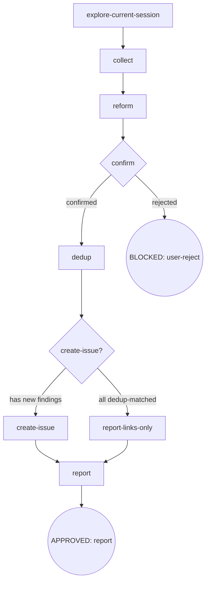

# osuperpowers 架构重构 P5 — report-issues 改名与流程精炼 设计

- **Version**: v1.0 · 2026-09-17（起草；brainstorm 期七次 overall 回填 v1.18–v1.27 已并入，见 Deviations）
- **Status**: Draft
- **Author**: [human] · Claude Opus 5 (1M context) (osuperpowers:brainstorming)
- **Parent program**: [2026-09-13-osuperpowers-overhaul-overall.md v1.27](./2026-09-13-osuperpowers-overhaul-overall.md)（P5 行 scope/acceptance 已含全部 brainstorm 收敛；v1.18–v1.27 十条 Boundary rules 回填行）
- **Depends on**: P4 shipped（skill 树 + engine 输出契约，PR #262 已 merge 至 develop，2026-09-16）

---

## Section 0: Incremental warning

> P5 increment only（report-issue → report-issues 改名与流程精炼）。Cross-phase conventions 见 [overall](./2026-09-13-osuperpowers-overhaul-overall.md)；冲突时 overall 赢。
> `P4 ->(soft) P5` 已满足（P4 定 skill 树与 engine 输出契约，P5 落实 report-issues 改名与流程）。

**口径（用户 2026-09-13 拍板，overall §目标 skills 架构参考）**：目标流程 = `explore-current-session → collect → reform → confirm → gh dedup（open+closed）→ 单新 issue 聚合 + dedup links + friendly 标题`。P5 的**删除面**（旧双通道评论模型 / master 复用 / per-finding 评论 / report-meta 冗余字段）与**收敛面**（单新 issue 聚合 / 单模式 renderer / labels SOT 单点）一并执行——破坏性变更授权下遗留即删。

**例外边界（精确，v1.27 更新）**：P5 将 cdd-engine **全面重建**（全量 TS + unbuild · CLI 换 citty · 生命周期域抽象基类 + hookable 注册面 · 目录按功能重组 · v1.26 第三方收敛全项），**engine 黑盒契约零变化**（4 子命令 `cdd implement/review/fix/base-branch` 面 · handoff 输出 / 失败类目 / Stopping / commit-contract 判定语义 · session-call 输出）——**skills 与消费者面零感知**（engine 是发布产物，重建仅内部形态）。engine 重构详 §2.13。issue form（ISSUE_TEMPLATE）是 emit 派生面，改动落点 = `finding-meta.json` canonical（formFieldDefs / labels SOT），不在 `.github/` 手改。

---

## Section 1: Constraints pointer

- 仓库语言政策：SKILL.md / docs 英文主源；本 spec 中文（Strategy B internal docs）
- 不 commit 除非用户明确要求；changeset 逐 phase 建
- vendored 子模块不可改（本 phase 不触达任何 vendor）
- **破坏性重构已授权**（用户 2026-09-13 / 2026-09-16 重复确认：允许破坏性变更、确保最佳实践、不留技术债务、遗留即删）
- 所有改动须过 `pnpm run validate`（14 块）+ `pnpm run emit:check` 无 drift；skills / emit 源改动后必跑 `pnpm run emit`
- **不改变引擎评审语义本体**（overall non-goal）：E-8 仅改注入序列化（`JSON.stringify(schema)` 紧凑），不碰 schema 内容 / 校验 / commit-contract / doc_hash
- **principle 定案（用户 2026-09-17）**：「任何信息保留都必须是面向运维人员的高价值信息」——本 phase 的报删判据：无消费者即删、与平台原生重复即删、兜底概念即删、标注性而非决策性即删；「自动 vs 手动来源可辨性由结构信号天然承载（Report meta + dedup + 聚合形态），零字段成本」

---

## Section 2: Design body

### §2.1 问题与根因

P5 处理的是**一类结构性根因 + 六条实证缺陷（E 族）+ 两条优化**，不是七组独立修补。结构根因是主线，E 族与优化是它的展开。

| # | 根因 | 实证 |
|---|---|---|
| **R1** | **report-issue 是「路由 + 评论」双模型，而目标流程是「单管线 + 单工件」** | 现行 SKILL.md（P4 精简后）digraph：`analyze → classify → confirm → resolve-destination → {program · session} → dedup → append-comment → report`——双通道（program=评论到 phase-owning issue / session=find-or-create master）+ **per-finding 评论**；目标流程（用户 2026-09-13 箭头流程）= explore → collect → reform → confirm → dedup → **单新 issue 聚合** + dedup links + friendly 标题。模型错位是 E 族全部缺陷的宿主 |
| **R2** | **gh 交互是无校验的裸命令链，失败到运行期才暴露且多趟往返** | renderer CLI 仅 `JSON.parse(stdin)` 零结构校验（E-3：手拼 stdin JSON 易 malformed）；dedup 对**每 finding** 全量拉取 issue 列表（E-5：重复网络往返）；master 创建用**不存在**的 `session` label（E-4：`gh issue create` 确定失败） |
| **R3** | **report-meta 携带无消费方的派生/冗余字段** | `kind`（program/consumer-cdd/standalone）消费方仅展示行 + 自约束不变式 + 已删缓存 schema；`date` 与 GitHub created_at 重复；`Source: standalone` 系「非 CDD」兜底桶（sdd 会话归属未定义） |
| **R4** | **issue form 承载低价值配置 + 陈旧 labels SOT** | `sessionTypes` 枚举唯一消费方 = form dropdown（SKILL.md 主路零消费）；`session_report.yml` 的 `labels: ["session", …]` 与仓库实际集合漂移（E-4/E-6）；`resolveDropdownOptions` 双分支注入 |
| **R5（优化，用户 2026-09-16 指示）** | **brainstorming #explore-context 把参考性探索面写成固定 4 渠道** | P4 重写时 Do/Read 写「(code / issues / docs / git log)」——参考性示例被固化为枚举（E-7） |
| **R6（优化，用户 2026-09-16 量化）** | **提示词注入的 handoff schema 带 2-缩进，占 token** | `renderHandoffStub` = `JSON.stringify(schema, null, 2)`；实测 task 1111→846 tok（省 ~265）、docs 702→545（省 ~157）每次注入（E-8） |

### §2.2 高维度统一骨架

P5 不是「改名 + 八条修补」，而是 report 面从「路由+评论模型」收敛为「单管线+单工件」：

```
collect → filter(scope 谓词) → reform(privacy) → confirm(人闸) → dedup(单趟 open+closed, 90 天窗口) → create(恰好一个新 issue)
```

**统一原则**（贯穿全 design）：
1. **单工件**——一次 report 运行产出恰好一个自包含新 issue；程序归属经 Related 链接呈现（`progress.json#plan` 首跳保留，P4 修的通道不浪费），不引回评论模型
2. **单源**——`finding-meta.json` 是唯一 SOT：components（改名一处）· labels（`reportDef.labels` 单点）· sectionLabels · metaFields（2 字段）· masterDef——renderer / form（emit）/ SKILL.md 语句全部同派生
3. **单写点**——renderer（`report-templates.mjs`）裸调用单入口是唯一正文产出点；无模式分派、无泛化注入、无回退分支
4. **删除面**——旧双通道（resolve-destination / ensure-session / report-target 缓存 / per-finding 评论）全删；report-meta 冗余字段（kind/date/Source）全删；sessionTypes / session_report 表单 / resolveDropdownOptions 全删
5. **每字符有消费方**（用户 principle）——遗留的每个字段/分支/枚举都有真实消费方或运维决策价值

### §2.3 改名面（report-issue → report-issues）

**改名一处 + 全派生**：`finding-meta.json#components` 枚举 `"osuperpowers:report-issue"` → `"osuperpowers:report-issues"` 是唯一改名源；form 下拉经 emit 派生、`.agents/` 经 emit 派生，均零手改。

| 面 | 改法 |
|---|---|
| skill 目录 | `skills/report-issue/` → `skills/report-issues/`（git mv） |
| SKILL.md | frontmatter `name: report-issue` → `report-issues`；正文自描述同步 |
| finding-meta.json | components 枚举改（**唯一改名源**） |
| `.github/ISSUE_TEMPLATE/*.yml` | `pnpm run emit` 重渲（component 下拉随 canonical 自动同步） |
| README | `packages/osuperpowers/README.md:20` 技能表 |
| skill 正文提及 | `cli-driven-development/SKILL.md` ×3（61/115/116 三处 `osuperpowers:report-issue`）· `writing-plans/SKILL.md` ×1（line 44 **裸 `report-issue`**，非 `osuperpowers:` 前缀）→ 新名 |
| writing-plans:44 存活句 | `writing-plans/SKILL.md` 留在线上，line 44 的「report-issue `resolve-destination` resolves its program chain…」**指向已删的 resolve-destination 节点**，必须整体重写为新流程表述：`report-issues` resolves program attribution through this field as its first hop（`progress.json#plan` → **Spec:** → overall → Related 链接）；配套 `writing-plans-spec.test.mjs:34` 的 `assert.match(body, /resolve-destination/)` 断言同步换锚（如 `/progress\.json#plan.*first hop/` 或新节点名）——不得保留旧节点名匹配 |
| tests | `report-templates.test.mjs` components 断言更新（P4 注释「改名归 P5」处落地）· `writing-plans-spec.test.mjs` resolve-destination 提及更新（见上行锚点换锚）· **四文件同步**：`scripts/emit/issue-templates.test.mjs` 三处「3 个 yml」断言（:23 / :140-148 / :165，含 session_report.yml）→ 2 个；`scripts/emit/compare.mjs:39` productFiles 删 `session_report.yml` 项（否则 emit:check 陈旧 walk 报警）；`docs/maintainers/data-driven-templates.md:91` 三表单表（bug_report/enhancement/session_report）→ 两表单；`scripts/validate/residue.mjs`（:703-708 注释）与 `residue.test.mjs:820`/`:878`（ORCHESTRATOR_SKILLS 注释 + 测试描述）的 `report-issue` → `report-issues` |
| residue 守卫 | stale-lexicon 增 `report-issue`（单数）——**词边界模式** `\breport-issue\b`（见 §2.8 词形守卫细则），复数 `report-issues` 放行；**机制面作用域**（skills 目录 / finding-meta / renderer / emit / README / tests），历史 plan/spec + CHANGELOG 豁免（P1–P3 同范式） |

### §2.4 新聚合流程 digraph（report-issues SKILL.md）



节点要点：

- **`explore-current-session`**（原 analyze 的会话捕获部分）：捕获 Session Context 快照——root（git top-level，一次取定，永不实时重派生）/ workspace（CDD run 的 `.osuperpowers/cdd/<slug>/`，present only when CDD run）。**`#explore-context` 措辞去枚举化已并入本 nodes 复核**（E-7：探索面为参考性描述，非固定渠道）
- **`collect`**：三源收集（session context 工具记录 / ledger `{repo}/.osuperpowers/cdd/*/progress.md` / git log）+ **工具链 scope 过滤（E-2 处置）**——组件槽位 ∈ `components` 枚举 且 行为谓词涉工具链产物（cdd 命令输出 / handoff / progress / issue form / skill 流程节点）；消费者项目领域规则（ruff 配置缺口等）= 明确拒绝样例（component-free）不入清单；secret 脱敏（`API_KEY=`/`TOKEN=`/`SECRET=`/`PASSWORD=` → `[REDACTED]`）沿用。**删除声明：ledger 源收敛为 cdd 单一前缀**——`.superpowers/sdd/*/progress.md` **不再扫描**（SDD 属 superpowers 域，report-issues 的组件/行为谓词仅面向本工具链 cdd 产物；见删除面表）
- **`reform`**：privacy 剥离（Evidence Contract I6 双判：无消费者可识别数据 + 维护者可复现机制）+ maintainer-friendly 格式化；**中性 topic 提炼**——从首条 finding 提炼（含 type/component 标签剥离，≤60 chars），作为标题基件（E-1 处置）
- **`confirm`**：人闸——findings N 条 + 推荐 topic 呈现，人工增删改；**不预建/预评论任何 gh issue**（I1）
- **`dedup`**：**单趟** `gh issue list --state all --limit 100 --search "updated:>=<now-90d ISO 日期>"`（Q10；E-5 处置——一次网络往返，批量内存匹配）。**窗口常量 = updated within last 90 days**（I8）；GitHub search 语法不接受 `90d` 相对写法，查询句用运行期物化的 ISO 绝对日期：`date -v-90d +%F` 计算 `now-90d` → `"updated:>=2026-06-19"` 形；`--state all` + `--search` 天然覆盖 open+closed（search 端点默认返回双态，dev 期验证句见 §2.4 dev 验证）。匹配按 affected component + 核心行为词（`timeout` / `CHANGES_REQUESTED` / `exit 137` 等）+ title/body 关键词；**open 命中** → 仅记录于新 issue 正文的 Dedup 区（**不向 matched issue 追加任何评论、不修改其正文**，I1 不预建/预评论）；**closed 命中** → 标注 `Regression / follow-up of #N (closed)`（永不 reopen）
- **`create-issue?`**（R1 门）：全部 findings open-dedup 命中 → **不建空 issue** → `report-links-only`；否则建
- **`create-issue`**：`gh issue create --repo Oscaner/skills --title <topic> --labels <reportDef.labels>` · body = renderer 裸调用产出聚合 body（Session 一行 + findings 分型分段（每 finding 后跟其 2 行 report-meta）+ 尾收 Dedup 区 + 尾收 Related 区）
- **`report`**：汇总——created issue URL / links-only 清单 / Regression 注

**删除面**（旧模型归零）：`resolve-destination` 节点（程序归属降为 Related 链接，不入 digraph）· `ensure-session`（无 master 复用）· `append-comment`（无 per-finding 评论）· report-target 缓存 schema（含 kind）· 「master」概念改名 → 「aggregate issue / report issue」· **`.superpowers/sdd/*/progress.md` ledger 源（归 superpowers 域，collect 不再扫描）**

**dev 验证（dedup 查询句）**：实现后以 `gh issue list --state all --limit 100 --search "updated:>=<date -v-90d +%F 产出>"` 实测——(a) 不报 search 语法错误；(b) 结果集含 open+closed 双态（search 端点默认返回双态，验证 `--state all` 与 `--search` 无状态丢失）；(c) 与仓库已知久未更新的 issue 号对照确认窗口生效。此验证并入 dev 计划 T 项（与 label rename 同批）

### §2.5 renderer 改造（report-templates.mjs）

**目标**：单写点延续（I5 语义），裸调用单入口，入参校验早报。

| 面 | 内容 |
|---|---|
| **CLI 裸调用** | `node "${pluginRoot}/scripts/report-templates.mjs" < stdin JSON` → 聚合 body 直出 stdout；**无 `--mode` 标志**（单模式 = 无模式参数，用户 principle） |
| **删** | `--mode comment` 分支 · `renderComment` · `renderTitle`（标题直出 topic，模板串无消费方）· `resolveDropdownOptions` 函数（唯一 dropdown component 内联 `enums.components` 直引，`attributes.options` 回退分支删） |
| **改** | `renderMasterBody` → 聚合 body 渲染（Session 一行 `- Harness:` + findings 分型分段（每 finding 四段后紧跟其 2 行 report-meta）+ 尾收 Dedup/Related 区），名称收敛为聚合渲染函数 |
| **入参校验（E-3 处置 + R2）** | CLI 入口先校验后渲染：`findings[]` 非空（R1 skip-create 的 renderer 侧守卫）· 每 finding 的 `type ∈ {bug, enhancement}` · `lang ∈ {en, zh}` · `meta.skill/step` 必填 · `related` 结构；失败 → `exit 1` + 违规字段路径早报（~40 行手写结构断言，零依赖——输入面 ~8 字段，全量覆盖含枚举校验，不引第二个 schema 体系） |
| **renderMeta 对齐** | finding-meta `metaFields` 6→2（`skill`/`step`），renderMeta 由 canonical 驱动不变 |

**renderer stdin 契约**（唯一入参形状，~8 字段，hand-write asserter 按此校验）：

```json
{
  "harness": "claude-code",
  "findings": [
    {
      "type": "bug",
      "lang": "en",
      "context": "<上下文>",
      "problem": "<问题>",
      "impact": "<影响>",
      "suggestedFix": "<建议>",
      "meta": { "skill": "cli-driven-development", "step": "3-2" }
    }
  ],
  "related": {
    "open": [{ "issue": 231, "component": "cdd-engine", "reason": "<匹配理由>" }],
    "closed": [{ "issue": 230 }],
    "program": { "issue": 262 }
  }
}
```

- 顶层 ~8 字段：`harness`（Session 行取值）· `findings[]`（非空）· `related?`（可选——`open[]` `{issue, component, reason}` / `closed[]` `{issue}` / `program?` `{issue}`），结构即 §2.5「related 结构」校验的判定依据
- per-finding 6 字段 + `meta{skill, step}`：`type ∈ {bug, enhancement}` · `lang ∈ {en, zh}` · `context/problem/impact/suggestedFix` 非空 · `meta.skill/step` 必填
- **masterDef 终态形状**（finding-meta canonical，§2.6）：`masterDef` 仅两键 `{ "sessionTitle": "## Session", "harnessRow": "- Harness: <harness>" }`——Session 段 label 与 Harness 行模板；`renderMasterBody` 以此为 Session 段渲染依据

**聚合 body 结构**（renderer 产出；布局已钉死——**meta 跟随其 finding，Dedup/Related 单段尾收**）：
```
## Session
- Harness: <harness>            ← masterDef Session 段一行（report-meta 终态 2+1）
[每 finding 重复，共 N 块]
## Context          ← sectionLabels[finding.type][lang] 分段序（四段逐一渲染，段间为原始文本）
## Problem
## Impact
## Suggested fix
- Skill: <skill>               ← 紧跟该 finding 四段之后的 2 行 report-meta（位置邻接 = 归属声明，N>1 跨 skill 不歧义）
- Step: <step>
[以上块 × N]
## Dedup                         ← 单段尾收：全部 open 命中链接行
- Dedup → #N (open)：<component> · <理由>
## Related                       ← 单段尾收：全部 closed 命中 + 程序归属
- Regression / follow-up of #N (closed)
- Program: <overall/phase-owning issue>    ← 程序归属链接（resolve-destination 收敛）
```
- report-meta **不入独立尾部 heading**：per-finding `Skill:`/`Step:` 紧随该 finding 的 sectionLabels 段；§2.10 聚合测试按此断言 N-finding meta 关联
- `## Dedup` / `## Related` **恒为单段尾收**（N 条 finding 的全部 open/closed/程序命中汇总一处），不做 per-finding 分段

### §2.6 finding-meta.json 重构

| 面 | 现状 | 终态 |
|---|---|---|
| `components` | 含 `"osuperpowers:report-issue"` | 改名 `"osuperpowers:report-issues"`（唯一改名源） |
| `metaFields` | 6 字段（skill/harness/kind/step/cdd/date） | **2 字段**（skill/step）——harness 上移 masterDef Session 段；kind/date/cdd 删（v1.22/v1.23: cdd 值=CLI 命令串已由 step 表达；date=GitHub created_at 原生） |
| `kinds` | 3 值（program/consumer-cdd/standalone） | **删**（无消费方） |
| `sessionTypes` | 2 值 | **删**（唯一消费方 form dropdown 已删） |
| `sectionLabels` | bug/enhancement × en/zh | 保留（渲染分段 oracle） |
| `formFieldDefs` | 3 键（bug_report/enhancement/session_report） | **2 键**（删 session_report）；bug_report/enhancement 的 **session-type 下拉字段删除**（保留 component 下拉 + 文本段） |
| `masterDef.title` | `[Session report] <subject> <YYYY-MM-DD>` | **删**（标题 = 中性 topic 直出）；masterDef 收敛为**两键** `{ sessionTitle: "## Session", harnessRow: "- Harness: <harness>" }`（Session 段 label + Harness 行模板，§2.5 契约） |
| `reportDef.labels` | — | **新增**（labels SOT 单点 = `["osuperpowers","cdd-engine"]`） |

### §2.7 labels SOT + GitHub label rename

- **labels SOT 单点**：`reportDef.labels` = `["osuperpowers","cdd-engine"]`（finding-meta 顶层新增），renderer create-issue 消费、其唯一定义点
- **GitHub label rename**：`gh label edit cdd --name cdd-engine`——**一次性 repo 数据迁移**（dev 计划 T 项执行，非 spec 评审期；历史 issue 标签随迁）；执行后 `gh label list` 有 `cdd-engine` 无 `cdd`
- **保留面**：harness keyword `cdd`（package.json / .claude-plugin / .cursor-plugin 的发布发现面——非 label，P6 keywords 决策另议）；meta 字段 `cdd` 概念（v1.22 已删字段，此处不复活）

### §2.8 关联面

- **不变式面**（report-issues SKILL.md）：I1 Confirm Gate 保留 · I3 Manual Trigger Only 保留 · I5 Renderer Determinism 保留 · I6 Evidence Contract 保留 · **I7 Kind Enumerated 删**（v1.21）· **新增 I8 Dedup Window**（窗口常量 = **updated within last 90 days** + **单趟拉取**不变式；查询注入用运行期物化的 ISO 绝对日期 `updated:>=<now-90d>`，dev 计划含物化查询句实测，Q10）· **新增 I9 Program Link**（程序归属只在 Related 链接呈现，不引回评论模型）
- **residue 守卫**：stale-lexicon `report-issue`（单数）——**词边界模式 `\breport-issue\b`（或 `report-issue(?!s)` 负前瞻）**：新复数名 `report-issues` 含前缀 `report-issue`，裸 substring 词形会在机制面内每个 `osuperpowers:report-issues` 引用处自命中、守卫永远无法转绿；同引入轮即放行复数形式（report-issues 乘数注释「复数新名，机制面预期命中排除」）· `--mode comment` / `renderTitle` / `resolveDropdownOptions` / `sessionTypes` 词形守卫（防 renderer 旧模式回渗机制面）· E-8 紧凑注入：engine `templates.test.mjs` 断言 `stub` 无 2-缩进模式（`\n  "` 模式）——格式 drift 守卫
- **changeset**：`osuperpowers` minor（`p5-report-issues-aggregation`；含 ISSUE_TEMPLATE 瘦身 + renderer 重构 + label 变更说明）；`cdd-engine`（E-8 紧凑注入，patch/minor 随版本策略）——逐 phase changeset 纪律（P6 acceptance 复核粒度）

### §2.9 E 族 6 条 → 机制映射（验收锚点）

| E | finding | 处置落点 | 验收锚点 |
|---|---|---|---|
| E-1 | subject 泄漏 run slug | §2.4 topic 直出（无壳前缀） | `masterDef.title` 模板删除；title = topic 直接传入 `gh issue create --title` |
| E-2 | analyze scope 漂移 | §2.4 collect 组件槽位+行为谓词 filter | SKILL.md collect 节点含过滤器描述 + 拒绝样例 |
| E-3 | stdin JSON 手拼 malformed | §2.5 入参校验（CLI 早报） | renderer 校验函数；malformed 用例 exit 1 + 字段路径 |
| E-4 | labels `session` 不存在 | §2.6 刀 1（session_report 表单删）+ §2.7 reportDef.labels | repo 无 `session` label 引用；`reportDef.labels` = `["osuperpowers","cdd-engine"]` |
| E-5 | dedup 每 finding 全量拉取 | §2.4 单趟拉取 + 90d 窗口（`updated:>=<now-90d ISO>` 物化查询句） | SKILL.md dedup 节点声明单趟拉取；窗口常量 + 物化查询形式 |
| E-6 | labels SOT 漂移 | §2.7 labels 单源 reportDef.labels | finding-meta 唯一 labels 定义点；emit:check drift=0 |

### §2.10 测试面

`report-templates.test.mjs`（现有 4 block + 新用例）：

- 存量：`renderYml` 表单渲染测试改——`formFieldDefs` 2 键断言（删 session_report）、component 下拉直引 components、零 session-type 字段
- **新增：入参校验**——`findings` 空 → exit 1；`type` 非法 → 字段路径报错；`lang` 非法 → exit 1；`meta.skill/step` 缺失 → exit 1
- **新增：聚合渲染**——多 finding × mixed type → 分段序 = canonical sectionLabels oracle；**N-finding meta 关联**：逐 finding 断言其 sectionLabels 四段紧跟的 `- Skill:`/`- Step:` 两行归属正确（meta 与 finding 的关联由位置邻接承载，N>1 跨 skill 场景不得歧义）；Session 段 = `- Harness:` 一行
- **新增：dedup/related 渲染**——open 命中 → Dedup 链接行；closed → `Regression / follow-up of #N`；程序归属 → Related 链接
- **移除**：comment 模式用例（含 renderComment/renderTitle 引用）

engine 侧：`templates.test.mjs` 增 E-8 紧凑断言；`templates.content.test.mjs` 若断言格式需同步（复核定位）。

**第三方依赖面测试**：
- simple-git：`contract/commit.mjs` 重写后——validateCommitContract 既有用例全绿（dirty→BLOCKED / head mismatch / review skip / fail-open 语义不变，仅底层换 API）；新增 pre-flight 干净树校验用例
- handlebars：`renderTemplate` 既有用例全绿（含 missing param throw）；新增 triple-stash 防转义断言（schema 注入含引号/花括号不被 HTML 转义破坏）
- yaml：`renderYml` 既有 issue-templates 用例全绿（form YAML 直出，emit:check 作为输出新鲜度守卫）
- tinyglobby：`naming.mjs` glob 用例全绿（扫描结果集不变）

### §2.11 Acceptance criteria（本 phase 验收）

1. `grep -E '\breport-issue\b'`（单数，**词边界**——不带 \b 的裸词形会 substring 命中新复数名 `report-issues`）机制面零命中（历史 plan/spec + CHANGELOG 豁免；作用域 = skills 目录 / finding-meta / renderer / emit / README / tests；复数 `report-issues` 不在此守卫命中面）
2. `.github/ISSUE_TEMPLATE` = **bug_report/enhancement 两份表单** + `emit:check` drift=0（`formFieldDefs` 2 键、零 `sessionTypes`/session_report 产物）
3. **E 族 6 条各有锚点**（§2.9 表逐行对照）
4. **report-meta 终态 2+1**：metaFields = `skill`·`step` 两字段 + masterDef Session 段 `Harness` 一行；renderer 零 `- Kind:`/`- Date:`/`- Source:` 行；I7 不变式删除
5. **renderer 零残留**：无 `--mode` 标志 · 零 `renderComment`/`renderTitle`/`resolveDropdownOptions`/`sessionTypes` · 裸调用单入口
6. **brainstorming #explore-context 零「固定 4 渠道」表述**（E-7）
7. **handoff schema 紧凑注入**（E-8）：`renderHandoffStub` = `JSON.stringify(schema)`；`templates.test.mjs` 格式 drift 断言绿；task 注入省 ~265 tok 断言（可选）
8. **repo label rename 已执行**：`gh label list` 有 `cdd-engine` 无 `cdd`；历史 issue 标签随迁
9. `pnpm run validate` 全绿（14 块）+ `pnpm run emit:check` 无 drift
10. **commit 边界管控落地**（AC 10）：`lifecycle/task.ts`/`docs.ts` 继承 DispatchLifecycle：入口门（pre-commit 干净树）+ 出口门（post-commit validateCommitContract）挂 hook 基类· `fix/docs.md` 含提交指令（agent 完成时 commit 被修文档，conventional + 无 attribution + 无改动 skip）· 6 个 review-fix skill 的 review 前「工作树干净」措辞
11. **第三方依赖收敛落地**（AC 11）：`packages/cdd-engine` src 零 `execFileSync("git")` 手写 git（经 simple-git）· 零 `emitScalar`/`isPlainUnsafe`（osuperpowers 经 `yaml`）· 零 `PLACEHOLDERS` 手写替换循环（经 handlebars）· cdd-engine glob 经 tinyglobby · husky 零 cdd-engine 依赖声明（仅 root devDependencies 存续）· `docs/maintainers/third-party-dependencies.md` 存在且登记全部 pkg（含不引清单与理由）；engine suite 全绿（simple-git/handlebars/yaml 换算后原语义不变）

### §2.12 生命周期 dispatch 阶段 + commit 边界管控（pre-commit / post-commit 双门）

**第一部分：dispatch 生命周期阶段总览（术语化）**

每个 cdd 命令（implement / fix / review / docs）都是一次 **dispatch**——engine 把 agent 会话作为子进程执行，生命周期 = 该次 dispatch 从准备到收尾的完整序列。三个阶段，每阶段含若干 engine 步骤：

```
dispatch lifecycle（engine 单点实现, run-task.mjs / run-docs.mjs）
╔═ pre-flight（派发前 · engine 侧准备）═══════════════════════════╗
║ 入口门 commit 管控【P5 新增】 工作树干净校验（git status）       ║
║   1.  CLI 参数解析 + registry 装载（log ship gate）             ║
║   2.  --plan → workspace → ctx（单根权威）                      ║
║   2.5 模板存在性检查（缺失 → BLOCKED exit 1）                    ║
║   4.  ctx → progressDir（ledger）                               ║
║   5.  fixed-point 派生（task-review/fix 的前序 handoff）         ║
║   6.  mode 校验（implement/review/fix 三态合法）                 ║
╚═══════════════════════════════════════════════════════════════╝
╔═ dispatch（agent 会话执行 · 黑盒）═════════════════════════════╗
║   7.  渲染 prompt（模板 + schema 原样注入 + brief/H1 block）    ║
║   8.  spawn agent CLI（execa，后台执行 + 超时）                 ║
╚═══════════════════════════════════════════════════════════════╝
╔═ post-flight（agent 返回后 · engine 侧收尾）═══════════════════╗
║   8.5 超时路径（写 partial handoff，timeoutCount 自增）         ║
║   8.8 handoff schema 校验（CONTRACT_VIOLATION 保留 findings）   ║
║   10./10.5 失败无 handoff → BLOCKED（stderr 入 blocker）         ║
║   11. H1 四行解析（status/commits/artifacts/blocker）           ║
║   12./13. exit 归一（agent_rc / dry-run）                       ║
║ 出口门 commit 管控【T8 既有】 validateCommitContract            ║
║   （dirty → BLOCKED；implement/fix 另验 commits.head == HEAD）  ║
╚═══════════════════════════════════════════════════════════════╝
```

| 阶段 | 阶段责任 | 步骤（run-task.mjs 现状） | commit 边界 |
|---|---|---|---|
| **pre-flight** | 入口干净 + 上下文就绪 | 1 · 2 · 2.5 · 4 · 5 · 6 | **入口门【P5 新增】**——工作树干净校验，dirty → BLOCKED |
| **dispatch** | agent 会话执行（黑盒） | 7 · 8 | 无（agent 期间零写树纪律，skill 侧义务） |
| **post-flight** | 结果归一 + 契约校验 | 8.5 · 8.8 · 10 · 10.5 · 11 · 12 · 13 · 13.5 | **出口门【T8 既有】**——validateCommitContract（dirty → BLOCKED；implement/fix 另验 head） |

**阶段责任划分原则**：pre-flight 与 post-flight 的 engine 步骤负责**机械性收尾**（上下文装载 / 校验 / 归一）——均无 agent 语义；dispatch 阶段是唯一的 agent 语义黑盒。commit 管控（本文第二部分）正是落在两端的引擎门。

**第二部分：commit 边界管控（pre-commit / post-commit 双门）**

**第一性原理**：commit-contract 已确立「dispatch 出口干净树」不变量（task 族强制）。P4 两次 dirty-tree BLOCKED（dispatch 期间改树 → 返回时 commit-contract 判 dirty → handoff 改写 BLOCKED）证明**仅凭出口后验不足**——需要**入口门**使出口必然干净。P5 把「谁产物谁提交」的归属直觉收敛为**一个统一机制**：dispatch 生命周期的**两端各一扇门**，engine 机械强制，**不区分产物归属**（主 agent 或 cdd 产物 — 生命周期不关心，只保证边界干净）。

```
dispatch lifecycle（engine 单点实现, run-task/run-docs）:
  ┌ 入口门 pre-commit ──────────────────────────────
  │ 进入 dispatch 前工作树必须干净；dirty → BLOCKED（指引提交/丢弃后重试）
  │ ⇒ review 基准 = 已提交状态 · dispatch 期间零写树 ⇒ 出口必然干净
  ├ dispatch ───────────────────────────────────────
  │ agent 执行（既有流程不变）
  └ 出口门 post-commit ─────────────────────────────
     dispatch 结束后 engine 校验：① 修改已提交（HEAD 前移）② 工作树干净
     未提交 → BLOCKED（rewriteHandoffBlocked，沿用既有 commit-contract 语义）
```

**关键简化**：
1. **提交动作 = 产生内容的执行方在 dispatch 边界内完成**（task/docs agent 完成时提交，subject 语义在产生方；engine 不代写 message）——不再用「主 agent vs cdd」排比两条规则，统一由两端门机械强制
2. **skills 义务收敛**：6 处 review-fix 循环从「罗列归属」简化为一句「**进入 review 前确保工作树干净**」
3. **engine 变更单点**：`run-task.mjs` 增入口门干净树校验 + 既有出口门保留；`run-docs.mjs` 接出口门（docs fix 补齐）
4. **机制可迁移**：这一机制**不绑定 cdd-engine 内部实现**——任何 future dispatch 边界（新 subcommand / hooks）天然继承

**现状审计**（2026-09-17 实证）：

| 面 | 出口门（post-commit） | 入口门（pre-commit） |
|---|---|---|
| task implement / task fix | **已有**——`task/implement.md`/`task/fix.md` step 5 强制 agent 完成时 commit（conventional + 无 attribution + 无改动 skip + out-of-scope 不碰）；engine commit-contract 后验 | 天然满足（implement 已提交） |
| **docs fix（spec/plan 的 fix）** | **缺口**——`fix/docs.md` 零 commit 指令；`run-docs.mjs` 注释 "No commit-contract" | — |
| review / branch-review | 无（不产生修改） | **必须**——工作树不干净则 BLOCKED（评审基准错位风险） |

**P5 落点**：
1. `templates/fix/docs.md` 补提交指令——与 task 族同构：fix agent 修完文档后 commit（`fix:` conventional + 无 attribution；无文档 diff 则 skip；out-of-scope 不碰）
2. `lib/runner/run-docs.mjs` 接 `validateCommitContract("fix", …)` 出口门——docs fix dispatch 出口校验工作树干净（复用 contract/commit.mjs，零新机制）
3. `lib/runner/run-task.mjs` 增入口门——review dispatch 起点校验 `git status --porcelain` 干净，dirty → BLOCKED（pre-commit 强制；review 亦消费入口门）
4. skills 流程描记 6 处（writing-phase-spec / writing-single-spec / writing-overall-spec / writing-plans / brainstorming / cli-driven-development）：review-fix 循环改为「**进入 review 前确保工作树干净**」（主 agent dispatch 期间零写树，mechanism 由 engine 入口门强制，skill 只陈述义务）
5. tests：`run-task` 入口门用例（review 起点 dirty → BLOCKED）+ `run-docs` 出口门用例（docs fix 后 dirty → BLOCKED）+ `templates.content.test.mjs` 断言 fix/docs.md 含提交指令
6. changeset：`cdd-engine`（原 E-8 行扩为「E-8 + commit 边界管控」，仍 patch/minor 随版本策略）

**边界**：本机制**不引入** engine 自动提交的一切形式——engine 不代写 commit、不需要知道 message（subject 语义在产生方）；engine 只做**两扇门**（入口干净树校验 + 出口干净树校验，契约面，符合「engine 服务」原则）。不重建 EventEmitter/事件总线（dispatch 是固定序列非可插拔事件，见 §2.13 不引清单）。

### §2.13 第三方依赖收敛（不保持任何手写）

**原则（用户 2026-09-17 定）**：能用第三方 pkg 就不自己维护，只维护 cdd-engine 功能逻辑；不保持任何手写；允许重组代码/文件/目录便于扩展；第三方 pkg 记入运维文档。

**全量自写轮子调查 → 替换清单**（代码级验证，2026-09-17）：

| 面 | 手写实现（现状） | 替换 pkg | 替换理由（检索确认） | 落点 |
|---|---|---|---|---|
| **git 操作** | `contract/commit.mjs` 手写 `execFileSync("git")` helper ×5（toplevel / rev-parse HEAD / cat-file / status --porcelain）+ `brief.mjs`/`finalize.mjs`/`root.mjs` 零星 git | **`simple-git`** | Node CLI 侧事实标准、活跃维护；status/add/commit/log API 完备；isomorphic-git 纯 JS 偏浏览器、维护放缓弃 | `contract/commit.ts`（双门判定）+ `git/index.ts`（simple-git 封装）；brief/finalize/root 收 git 调用 |
| **YAML 序列化** | `osuperpowers/scripts/report-templates.mjs` 手写 `emitScalar`/`isPlainUnsafe`（~50 行 YAML builder） | **`yaml`**（eemeli） | 2026 现代标准：YAML 1.2 全 test-suite、零依赖、活跃维护；js-yaml 新有 CVE-2026-84375 弃；本场景只序列化（form YAML 直出） | renderer 重写时改 `yaml.stringify` |
| **glob 遍历** | `handoff/naming.ts` 手写 `readdirSync` 递归（TS 化收 glob） | **`tinyglobby`** | 仓库 `scripts/` 已在用（residue/orchestrate/osuperpowers），同一工具链收敛一致 | naming.ts 等收 glob 调用 |
| **模板占位替换** | `templates.mjs` 手写 `PLACEHOLDERS` 数组 + `replace()` 循环（~15 行） | **`handlebars`** | 语法 `{{X}}` 与现有模板恰好兼容（零模板改动）；strict 编译顶替 missing-param 语义；schema/H1/brief 注入走 triple-stash `{{{X}}}` 防 HTML 转义破坏 | `lifecycle/render.ts`（handlebars）；`PLACEHOLDERS` 删除 |
| **git hooks** | —（仓库 root 已有 husky） | **husky 不进包** | registry 依赖的 `prepare` 不运行（npm 仅 git deps/root 跑 prepare；pnpm 默认拦依赖 lifecycle 脚本）；即使跑也是 mutate 消费方 `.git/hooks`（安全反模式）；引擎生命周期 = 运行时 JS 非 git hooks | root devDependency 保留（本仓 pre-commit 门禁），cdd-engine 零依赖声明；消费方 hooks 经 simple-git commit 由 git 自然触发（不装不拦） |
| **进程 spawn** | execa ✓（非轮子） | — | 已有 | — |
| **CLI 解析** | commander ✓（有） | **`citty`**（unjs） | TS-first、`node:util.parseArgs` 零 args 依赖、与 hookable 同源同维护（检索 2026-09-17：oclif 重/plugin 约定过载、commander TS 弱） | `bin.ts` 用 defineCommand/defineMainCommand；parse.mjs/subcommand 声明重写 |
| **生命周期注册面** | 无（P4 未建） | **`hookable`**（unjs） | 与 clitty 同源；命名 hook + async 优先；做 `dispatch:before`/`dispatch:after` 固定 hook 点（真注册面——用户裁定：做真注册面，故引） | `lifecycle/hooks.ts`；外部插件注册、内部变体走继承 |
| **日志** | console 散用 | **`consola`**（unjs） | 同源生态、结构化日志、debug 分级 | core/ 统一日志出口 |
| **构建/类型** | JS ESM 手写发布链 | **`unbuild` + TypeScript** | TS 化使抽象基类虚方法成为编译期约束（用户裁定全量 TS）；unbuild 构建/stub（dev 与发布同走 dist 入口） | `src/` 全量 TS + `build.config.ts`；`dist/` 产物 |
| **schema** | ajv ✓（非轮子） | — | 已有 | — |
| **版本** | semver ✓（非轮子） | — | 已有 | — |

**不引清单**（运维文档明示，防未来误引）：**XState**（engine 已有收敛状态机语义——Review Stopping / 失败类目 / 配额隔离——400+ tests 锚定，引即推翻 P3/P4 收敛成果，破坏性风险零收益）· **tapable / emittery**（tapable webpack 生态过重；emittery 语义为发布-订阅非生命周期编排——hookable 已选且同源）· **模板引擎替代品**（handlebars 已选；ejs/nunjucks 语法不兼容需改模板）· **isomorphic-git / js-yaml**（各有 CVE 或维护放缓，见上表）· **oclif**（TS 强但 plugin manifest/自动更新约定对单 bin+内嵌引擎过载）。

**组权重构**（用户授权重组，v1.27 升维为全量重建；目录按**依赖单向轴**：cli → dispatch → {rules, artifacts, render} → infra）：
```
packages/cdd-engine/
  src/                          # TS 源码（全量 TS + unbuild 构建）
    bin.ts                      # 薄入口：citty 装配 → 派发
    cli/                        # 命令面（入站）：command 定义 + 子命令 action
      index.ts  implement.ts  review.ts  fix.ts  base-branch.ts  branch-review.ts  shared.ts
    dispatch/                   # 编排核心（生命周期域）：抽象基类 + 两实现 + 注册面 + 阶段表
      base.ts                   # DispatchLifecycle 抽象基类（模板方法：pre-flight/dispatch/post-flight + hook 默认实现）
      task.ts                   # TaskLifecycle（task 功能全覆盖写：brief/fixed-point/H1）
      docs.ts                   # DocsLifecycle（docs 功能：spec/plan review/fix）
      hooks.ts                  # hookable 注册面（dispatch:before/after 固定 hook 点，外部插件）
      phases.ts                 # PHASES 阶段表（数据化声明：每阶段 hook 挂载）
    rules/                      # CDD 判定规则（不变量层：改这里须重想评审语义）
      commit.ts                 # commit 双门（入口 clean-tree + 出口 validateCommitContract，simple-git 判定）
      stopping.ts               # Review Stopping 守卫簇
      failure.ts                # 失败类目（六类 + 配额隔离；原 failure.mjs）
      schema.ts                 # handoff JSON schema 校验（validate/recover/handoff-namespace）
    artifacts/                  # 引擎产物（磁盘工件）：读写 + 定稿 + 命名
      handoff/                  # write.ts · finalize.ts · naming.ts
      progress.ts               # progress.json read/write/migrate
      base-branch.ts            # base-branch.json artifact
    render/                     # 提示词渲染（独立产出面）
      templates.ts              # handlebars 渲染（原 templates.mjs：renderTemplate/renderHandoffStub/review 壳）
      brief.ts                  # brief 生成（原 brief.mjs）
    infra/                      # 基础设施（能力供给，零 CDD 语义）
      git.ts                    # simple-git 单点封装（status/add/commit/head/log）
      proc.ts                   # 进程生命周期（spawnManaged/teardown/reap + execa）
      invoke.ts                 # CLI 调用契约（resolveTimeout/invokeCli）
      root.ts                   # repoRoot 解析（唯一 cwd 点）
      context.ts                # context-contract 读取
      registry.ts               # harness registry
      exit.ts                   # exit codes
      log.ts                    # consola
  templates/                    # 提示词模板资源（md 壳 + schema JSON + canonical JSON）
  dist/                         # unbuild 产物（dev 亦经此——stub 模式即时加载 src）
  build.config.ts               # unbuild 配置
```
迁移动机：**多层责任单向依赖**——`infra/`（git/进程/根解析，零业务语义，随便换），`rules/`（CDD 判定，改须重想语义），`artifacts/`（磁盘产物同层同责），`dispatch/`（lifecycle 的家：抽象基类 + 子类 + phases + hooks 一目录看全），`render/`（提示词注入独立面），`cli/`（薄命令面）——运维按「改哪层」定位：改阶段顺序 → `dispatch/base.ts+phases.ts`；改 commit 判定 → `rules/commit.ts`；改 handoff 格式 → `artifacts/handoff/`；换 git/进程 → `infra/`。生命周期用 `dispatch/` 领域词而非 `lifecycles/` 抽象复数（仅一族且是核心）；hooks 注册面放 `dispatch/hooks.ts`（真实存在代码），不设空 `plugins/` 目录（无真实消费面，防空转）。

**开发调用链**（CLAUDE.md dev 段随 bin 产品化同步更新）：全量 TS 后 `node packages/cdd-engine/bin/cdd.mjs` 失效 → **`unbuild --stub` 生成 `dist/` 入口（jiti 即时加载 TS 源码）→ `node packages/cdd-engine/dist/cli.mjs <subcommand>`**。dev 与发布同走 `dist` 入口路径（stub 模式源码即生效）；**仍不 npm link 全局**（本仓规约：global link 会陈旧，直接工作树直调）。

**运维文档**：新增 `docs/maintainers/third-party-dependencies.md`（English-primary，maintainer-only 豁免 emit 规则）——登记**全部**第三方 pkg：包 · 用途 · 版本约束 · 替换的手写面 · 维护状态锚点 · 不引清单及理由。覆盖：citty / hookable / consola（新引入，替换 commander/console）· execa / ajv / semver（存量）· tinyglobby（仓库已有）· simple-git / yaml / handlebars（P5 引入）· husky（root dev-only 边界说明）· unbuild（TS 构建）。

**只维护功能逻辑的验证**：替换掉的都是通用基础设施（git 协议 / YAML 语法 / glob / 模板替换 / CLI 解析 / hook 编排 / 日志 / 构建），留下的全是 CDD 语义（dispatch 生命周期骨架 / commit 双门判定 / 失败类目 / Stopping / handoff schema 注入规则）——边界清晰。

---

## Section 3: Deviations from overall

| Overall assumption | Phase decision | Overall updated? |
|---|---|---|
| P5 scope「friendly 标题」 | 标题 = **中性 topic 直出**（无 `[Session report] <slug> <date>` 壳前缀），masterDef.title 模板删 | Yes — v1.20 · 2026-09-16 |
| P5 scope「gh dedup（open+closed）」 | dedup **单趟拉取 + 90 天窗口**（E-5 处置升级，含 find 上限新语义）；窗口常量 = `updated within last 90 days`，查询句用运行期物化 ISO 绝对日期（`updated:>=<now-90d>`，GitHub search 语法不支持相对写法） | Yes — v1.20 · 2026-09-16 |
| P5 scope「master labels 与仓库实际集合一致（SOT 派生）」 | labels SOT = **`reportDef.labels` 单点** `["osuperpowers","cdd-engine"]` + **repo label rename `cdd`→`cdd-engine`**（一次性迁移，历史标签随迁） | Yes — v1.21 · 2026-09-16 |
| P5 scope「report-meta 精简（kind 删）」 | 终态 **2+1**：per-finding `Skill`·`Step` + issue 级 `Harness` 一行；date/Source/standalone 概念全删 | Yes — v1.22 · 2026-09-16 |
| P5 scope「renderer 入参有 schema 校验」 | renderer **裸调用单模式**（`--mode` 删）+ 入参结构校验（手写断言零依赖） | Yes — v1.23 · 2026-09-16 |
| P5 scope「ISSUE_TEMPLATE re-render（emit）」 | **瘦身三刀**：session_report 表单删 · session-type 下拉删（sessionTypes 枚举删）· labels SOT 迁 reportDef；resolveDropdownOptions 内联删 | Yes — v1.24 · 2026-09-17 |
| overall 无此项（新增） | **principle 定案**：「任何信息保留都必须是面向运维人员的高价值信息」；「自动 vs 手动来源可辨性由结构信号天然承载」 | Yes — v1.24 · 2026-09-17 |
| overall 无此项（新增） | **E-7**：brainstorming #explore-context 措辞去枚举化 | Yes — v1.18 · 2026-09-16 |
| overall 无此项（新增） | **E-8**：handoff schema 注入去缩进（`JSON.stringify(schema)` 紧凑，engine 1 行，随 P5） | Yes — v1.19 · 2026-09-16 |
| overall 无此项（新增） | **commit 边界纪律**（双向不变量 + 归属原则；审计确认 task 族已有/docs fix 缺口） | Yes — v1.25 · 2026-09-17 |
| overall 无此项（新增） | **第三方依赖收敛**（simple-git/yaml/tinyglobby/handlebars 引入 + husky 不进包 + 运维文档） | Yes — v1.26 · 2026-09-17 |

---

## Section 4: Notes for downstream

- **P6（统一收口）**：harness keyword `cdd` 是否随 label rename 统一（发布发现面 vs label 面的命名一致性审查）· `.agents/` emit 面移除 · vendors 撤离 · 其余 engine flake 项。本 phase 不改动这些。
- **Dedup window 常量**：窗口常量 = **updated within last 90 days**（SKILL.md / report-issues 节点文档化，I8），不建环境变量配置面（沿 P4 环境面收口原则）——若口径调整，改 SKILL.md 一处。**查询句恒用运行期物化的 ISO 绝对日期**（`date -v-90d +%F` → `updated:>=<ISO>`，GitHub search 语法不支持 `90d` 相对写法），物化句实测并入 dev 计划 T 项
- **GitHub label rename 的执行顺序**：必须在 changeset 前的 dev 段择机执行（一次性 `gh label edit`），spec 评审期不执行任何 repo 外部变更。
- **writing-plans 提示**：计划需含「label rename 的 gh 命令 + 验证」独立任务（外向操作，不可并入普通重命名任务）。

---

## Section 5: Review

Rule: Fresh-Subagent Review Passes must all pass before reaching user review and writing-plans。