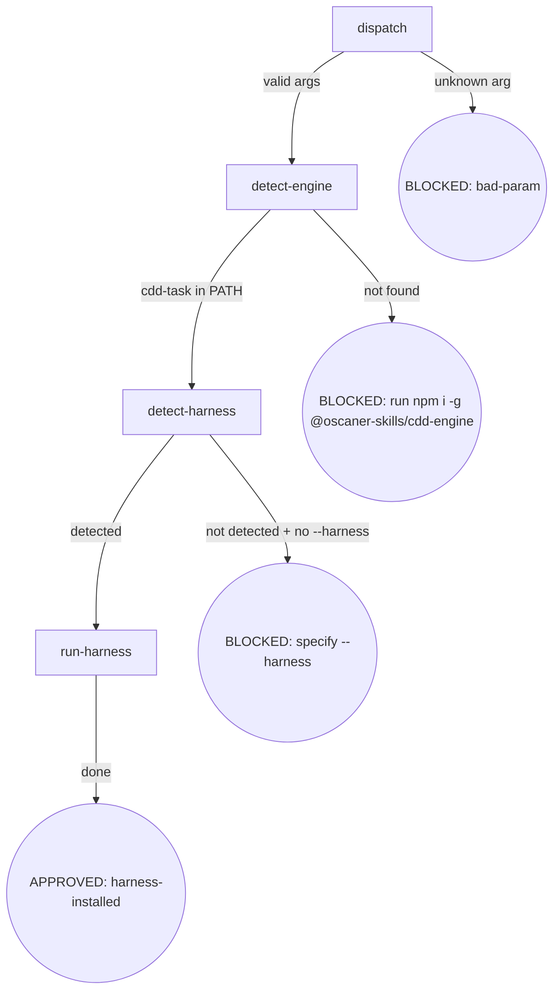

# CDD Engine 全面重构 P1 实现计划

> **For agentic workers:** REQUIRED SUB-SKILL: Use superpowers:subagent-driven-development (recommended) or superpowers:executing-plans to implement this plan task-by-task. Steps use checkbox (`- [ ]`) syntax for tracking.

**Goal:** 将 CDD engine 从 osuperpowers 中拆分为独立 npm package `@oscaner-skills/cdd-engine`，修复所有 P1 Bug，完成 Commander.js/execa/ajv/Vitest 框架迁移。

**Architecture:** 新建 `packages/cdd-engine/` monorepo 包，迁移全部 6 个 CLI + lib/* + engine runtime templates；osuperpowers 改为 `workspace:*` 依赖 cdd-engine，删除 `bin/engine/` 目录。所有 CLI 采用 Commander.js v15 重写 arg parse；subprocess 改为 execa v9；schema 校验改为 ajv v8；测试框架迁移到 Vitest v3。

**Tech Stack:** Node.js 22+，纯 ESM (`.mjs`)，Commander.js v15，execa v9，ajv v8，semver v7，Vitest v3，pnpm workspace

## Global Constraints

- 所有源文件必须是 `.mjs` 扩展名，`"type": "module"` 在 package.json 中声明
- Node.js engine: `>=22.12.0`（Commander v15 + execa v9 要求）
- Task heading 格式必须为 `### Task N:`（冒号，无其他分隔符）—— brief.mjs 提取依赖此格式
- 所有 CLI 使用 Commander.js v15 `program.parseAsync()`；不保留手写 for-loop arg parse
- `invokeCliOverride` DI 参数从 `runTask` 签名中删除；测试用 `vi.mock('execa')` 替代
- `registryPath` DI 参数保留（非纯测试用途）；`scriptsDir` DI 参数保留
- `noExit` DI 参数保留（测试 seam，返回 exitCode 不 process.exit）
- Conventional commits；无 attribution / co-author trailer
- 每个 Task 完成后立即 commit（`git add <files> && git commit -m "..."`)
- 编辑任何 SKILL.md 或 docs/*.md 后必须运行 `pnpm run emit`

---

## 文件变更总览

### 新建文件（cdd-engine 包）

| 文件 | 说明 |
|------|------|
| `packages/cdd-engine/package.json` | 新包定义（bin 6 CLIs + deps） |
| `packages/cdd-engine/vitest.config.mjs` | Vitest 配置 |
| `packages/cdd-engine/bin/cdd-task.mjs` | 从 osuperpowers 迁移 + Commander |
| `packages/cdd-engine/bin/docs-task.mjs` | 迁移 + Commander + Bug K fix |
| `packages/cdd-engine/bin/branch-review.mjs` | 全新 CLI（Enh D） |
| `packages/cdd-engine/bin/cdd-select.mjs` | 迁移 + Commander |
| `packages/cdd-engine/bin/cdd-session-activate.mjs` | 迁移 + Commander |
| `packages/cdd-engine/bin/cdd-research.mjs` | 迁移 + Commander |
| `packages/cdd-engine/bin/review-loop.mjs` | 迁移（无改动） |
| `packages/cdd-engine/bin/harness-registry.json` | 迁移（无改动） |
| `packages/cdd-engine/bin/lib/cli-shared.mjs` | 迁移 + execa + NDJSON + retry |
| `packages/cdd-engine/bin/lib/runner.mjs` | 迁移 + invokeCliWithRetry + DI 清理 |
| `packages/cdd-engine/bin/lib/docs-runner.mjs` | 迁移 + Bug L fix |
| `packages/cdd-engine/bin/lib/schema-utils.mjs` | 迁移 + ajv |
| `packages/cdd-engine/bin/lib/templates.mjs` | 迁移 + PKG_ROOT 修复 |
| `packages/cdd-engine/bin/lib/contract.mjs` | 迁移（无改动） |
| `packages/cdd-engine/bin/lib/ledger.mjs` | 迁移（无改动） |
| `packages/cdd-engine/bin/lib/progress.mjs` | 迁移（无改动） |
| `packages/cdd-engine/bin/lib/registry.mjs` | 迁移（无改动） |
| `packages/cdd-engine/bin/lib/research.mjs` | 迁移（无改动） |
| `packages/cdd-engine/bin/lib/brief.mjs` | 迁移（无改动） |
| `packages/cdd-engine/bin/tests/*.test.mjs` | 所有测试从 node:test 迁移到 Vitest |
| `packages/cdd-engine/templates/implement.md` | 迁移（原 templates/） |
| `packages/cdd-engine/templates/task-review.md` | 迁移 + Bug C fix（原 templates/） |
| `packages/cdd-engine/templates/fix.md` | 迁移（原 templates/） |
| `packages/cdd-engine/templates/spec-review.md` | 迁移（原 templates/） |
| `packages/cdd-engine/templates/plan-review.md` | 迁移（原 templates/） |
| `packages/cdd-engine/templates/branch-review.md` | 迁移 + 语义修正（原 templates/） |
| `packages/cdd-engine/templates/handoff-schema.json` | 迁移（原 templates/） |
| `packages/cdd-engine/templates/docs-handoff-schema.json` | 迁移（原 templates/） |

### 修改文件（osuperpowers 包）

| 文件 | 说明 |
|------|------|
| `packages/osuperpowers/package.json` | 删除 bin 条目，新增 cdd-engine 依赖 |
| `packages/osuperpowers/skills/init/SKILL.md` | Enh G：移除 harness 子命令 |
| `packages/osuperpowers/skills/init/harness.md` | 新增 detect-engine 节点 |
| `packages/osuperpowers/skills/cli-driven-development/SKILL.md` | Enh F：detect-engine 步骤 + Bug M：删除 deferred/ledger 节点 |

### 删除目录

| 路径 | 说明 |
|------|------|
| `packages/osuperpowers/bin/engine/` | 全部迁移到 cdd-engine 后删除 |
| `packages/osuperpowers/templates/` | 迁移到 cdd-engine 后删除 |
| `packages/osuperpowers/templates/` | 迁移到 cdd-engine 后删除 |
| `packages/cdd-engine/skills/` | Task 1 脚手架遗留，Task 7 删除（替换为 templates/） |

---

### Task 1: cdd-engine 包脚手架 + Vitest 配置

**Files:**
- Create: `packages/cdd-engine/package.json`
- Create: `packages/cdd-engine/vitest.config.mjs`
- Create: `packages/cdd-engine/bin/.gitkeep`（占位，确保 bin/ 存在）
- Create: `packages/cdd-engine/bin/lib/.gitkeep`
- Create: `packages/cdd-engine/bin/tests/.gitkeep`
- Create: `packages/cdd-engine/templates/.gitkeep`（平铺目录，取代 skills/ 层级）

**Interfaces:**
- Produces: `@oscaner-skills/cdd-engine` package 可被 pnpm workspace 链接；Vitest 可运行

- [ ] **Step 1: 创建 package.json**

```json
{
  "name": "@oscaner-skills/cdd-engine",
  "version": "1.0.0",
  "type": "module",
  "description": "CDD engine CLIs: task runner, docs reviewer, branch reviewer, harness selector.",
  "engines": { "node": ">=22.12.0" },
  "bin": {
    "cdd-task":             "./bin/cdd-task.mjs",
    "docs-task":            "./bin/docs-task.mjs",
    "branch-review":        "./bin/branch-review.mjs",
    "cdd-select":           "./bin/cdd-select.mjs",
    "cdd-session-activate": "./bin/cdd-session-activate.mjs",
    "cdd-research":         "./bin/cdd-research.mjs"
  },
  "scripts": {
    "test": "vitest run",
    "test:watch": "vitest"
  },
  "dependencies": {
    "commander": "^15",
    "execa":     "^9",
    "ajv":       "^8",
    "semver":    "^7"
  },
  "devDependencies": {
    "vitest": "^3"
  },
  "repository": {
    "type": "git",
    "url": "https://github.com/Oscaner/skills",
    "directory": "packages/cdd-engine"
  },
  "license": "MIT"
}
```

- [ ] **Step 2: 创建 vitest.config.mjs**

```js
// packages/cdd-engine/vitest.config.mjs
import { defineConfig } from 'vitest/config';
export default defineConfig({
  test: {
    pool: 'forks',            // node:test 兼容模式（避免 worker_threads 干扰 execa mock）
    coverage: { provider: 'v8' },
  },
});
```

- [ ] **Step 3: 创建目录占位文件**

```bash
mkdir -p packages/cdd-engine/bin/lib packages/cdd-engine/bin/tests \
         packages/cdd-engine/templates packages/cdd-engine/bin/utils
touch packages/cdd-engine/bin/.gitkeep \
      packages/cdd-engine/bin/lib/.gitkeep \
      packages/cdd-engine/bin/tests/.gitkeep \
      packages/cdd-engine/templates/.gitkeep
```

- [ ] **Step 4: 在 monorepo 根 pnpm-workspace.yaml 确认 packages/cdd-engine 已纳入**

```bash
grep -q "packages/cdd-engine" pnpm-workspace.yaml || \
  echo "  - 'packages/cdd-engine'" >> pnpm-workspace.yaml
```

如不存在 `pnpm-workspace.yaml` 中的 `packages/*` glob，则手动添加 `- 'packages/cdd-engine'`。

- [ ] **Step 5: 安装依赖**

```bash
fnm use && pnpm install
```

预期：`packages/cdd-engine/node_modules/commander`、`execa`、`ajv`、`semver`、`vitest` 均存在。

- [ ] **Step 6: 验证 Vitest 可运行**

```bash
cd packages/cdd-engine && node_modules/.bin/vitest run --passWithNoTests
```

预期：exit 0，无报错（尚无测试文件）。

- [ ] **Step 7: Commit**

```bash
git add packages/cdd-engine/
git commit -m "feat: scaffold @oscaner-skills/cdd-engine package with Vitest"
```

---

### Task 2: cli-shared.mjs — execa 替换 + NDJSON 解析 + invokeCliWithRetry

**Files:**
- Create: `packages/cdd-engine/bin/lib/cli-shared.mjs`
- Create: `packages/cdd-engine/bin/tests/cli-shared.test.mjs`

**Interfaces:**
- Produces: `spawnCapture(command, args, opts)` → `{ok, code, stdout, stderr, timedOut}`（接口不变）
- Produces: `invokeCli(entry, prompt, mode, env, cwd, timeoutMs)` → same shape
- Produces: `invokeCliWithRetry(entry, prompt, mode, env, cwd, timeoutMs)` → same shape（retry wrapper）
- Produces: `resolveTimeoutMs(env, mode)` → `number|undefined`（迁移，无改动）
- Consumes: `execa` from npm

- [ ] **Step 1: 写 cli-shared.mjs（execa 版）**

```js
// packages/cdd-engine/bin/lib/cli-shared.mjs
import { execa } from 'execa';

// Default timeouts by mode (30 minutes).
const DEFAULT_TIMEOUTS = { task: 1_800_000, review: 1_800_000, research: 1_800_000 };
const STEP_SECONDS = 1800;
const LEGACY_MODE_ENV = { research: 'RESEARCH_TIMEOUT' };

export function resolveTimeoutMs(env, mode) {
  const modeEnv = { task: 'CDD_TASK_TIMEOUT', review: 'CDD_REVIEW_TIMEOUT', research: 'CDD_RESEARCH_TIMEOUT' };
  const modeKey = modeEnv[mode];
  const perMode = modeKey ? env[modeKey] : undefined;
  if (perMode !== undefined) return Math.max(1, Number(perMode)) * 1000;
  const globalRaw = env.CDD_CLI_TIMEOUT;
  if (globalRaw !== undefined) {
    const seconds = Math.max(1, Math.ceil(Number(globalRaw) / STEP_SECONDS) * STEP_SECONDS);
    return seconds * 1000;
  }
  const legacyKey = LEGACY_MODE_ENV[mode];
  const legacy = legacyKey ? env[legacyKey] : undefined;
  if (legacy !== undefined) return Math.max(1, Number(legacy)) * 1000;
  if (DEFAULT_TIMEOUTS[mode] != null) return DEFAULT_TIMEOUTS[mode];
  return undefined;
}

// Strip credentials from subprocess env (#137 security fix).
function cleanEnv(env) {
  const e = { ...env };
  delete e.CLAUDE_CODE_SUBAGENT_MODEL;
  delete e.ANTHROPIC_API_KEY;
  return e;
}

// Raw subprocess capture via execa (reject:false = never throws).
// Returns {ok, code, stdout, stderr, timedOut}.
export async function spawnCapture(command, args, opts = {}) {
  const { cwd, env, timeoutMs } = opts;
  const res = await execa(command, args, {
    cwd,
    env: cleanEnv(env ?? process.env),
    timeout: timeoutMs,             // execa 内置 watchdog
    forceKillAfterDelay: 5000,      // SIGKILL fallback (#137)
    reject: false,                  // 不 throw
    all: false,
  });
  const timedOut = res.timedOut ?? false;
  return {
    ok:      res.exitCode === 0 && !timedOut,
    code:    res.exitCode ?? 1,
    stdout:  res.stdout ?? '',
    stderr:  res.stderr ?? '',
    timedOut,
  };
}

// Invoke CLI: build args from entry, handle stream-json output mode.
export async function invokeCli(entry, prompt, mode, env, cwd, timeoutMs) {
  const { cli, invoke, output, task_review_prefix } = entry;
  const promptArg = mode === 'task-review' && task_review_prefix
    ? `${task_review_prefix} ${prompt}` : prompt;
  const args = [...invoke.split(/\s+/).filter(Boolean), promptArg];
  const res = await spawnCapture(cli, args, { cwd, env, timeoutMs });
  if (res.ok && output === 'stream-json') {
    const finalText = extractStreamJsonFinal(res.stdout);
    if (!finalText) {
      return { ok: false, code: 1, stdout: res.stdout,
               stderr: 'stream-json produced no completion finalText', timedOut: false };
    }
    return { ok: true, code: 0, stdout: finalText, stderr: res.stderr, timedOut: false };
  }
  return res;
}

// NDJSON line-by-line parser — replaces hand-written scanner (#139 fix).
// Claude stream-json output: one JSON object per line.
function extractStreamJsonFinal(raw) {
  let last = null;
  for (const line of String(raw).split('\n')) {
    const trimmed = line.trim();
    if (!trimmed) continue;
    try {
      const ev = JSON.parse(trimmed);
      if (ev.type === 'completion' && ev.finalText != null) last = ev.finalText;
    } catch { /* skip non-JSON lines */ }
  }
  return last;
}

// Transient retry wrapper for invokeCli (#109 fix).
// Retries only on overloaded/rate_limit/529 stderr, never on timeout.
const RETRY_DELAYS_MS = [5_000, 15_000];

export async function invokeCliWithRetry(entry, prompt, mode, env, cwd, timeoutMs) {
  const MAX_RETRIES = RETRY_DELAYS_MS.length;
  for (let attempt = 0; attempt <= MAX_RETRIES; attempt++) {
    const result = await invokeCli(entry, prompt, mode, env, cwd, timeoutMs);
    if (result.ok || result.timedOut) return result;
    const isTransient = /overloaded|rate_limit|529/.test(result.stderr ?? '');
    if (isTransient && attempt < MAX_RETRIES) {
      await new Promise(r => setTimeout(r, RETRY_DELAYS_MS[attempt]));
      continue;
    }
    return result;
  }
}
```

- [ ] **Step 2: 写失败测试（resolveTimeoutMs）**

```js
// packages/cdd-engine/bin/tests/cli-shared.test.mjs
import { describe, it, expect } from 'vitest';
import { resolveTimeoutMs } from '../lib/cli-shared.mjs';

describe('resolveTimeoutMs', () => {
  it('per-mode env takes priority', () => {
    expect(resolveTimeoutMs({ CDD_TASK_TIMEOUT: '60' }, 'task')).toBe(60_000);
  });
  it('CDD_CLI_TIMEOUT is stepped to 30-min boundary', () => {
    // 1801s → ceil to 3600s
    expect(resolveTimeoutMs({ CDD_CLI_TIMEOUT: '1801' }, 'task')).toBe(3_600_000);
  });
  it('default task timeout is 30min', () => {
    expect(resolveTimeoutMs({}, 'task')).toBe(1_800_000);
  });
  it('unknown mode returns undefined', () => {
    expect(resolveTimeoutMs({}, 'unknown')).toBeUndefined();
  });
});
```

- [ ] **Step 3: 运行测试，确认通过**

```bash
cd packages/cdd-engine && node_modules/.bin/vitest run bin/tests/cli-shared.test.mjs
```

预期：4 tests pass。

- [ ] **Step 4: 写失败测试（NDJSON + invokeCliWithRetry，需 mock execa）**

```js
// 在 cli-shared.test.mjs 追加：
import { vi, beforeEach } from 'vitest';

vi.mock('execa', () => ({
  execa: vi.fn(),
}));

import { execa } from 'execa';

describe('extractStreamJsonFinal via invokeCli', () => {
  beforeEach(() => vi.clearAllMocks());

  it('picks last completion.finalText from NDJSON stream', async () => {
    execa.mockResolvedValue({
      exitCode: 0,
      stdout: '{"type":"text","text":"hello"}\n{"type":"completion","finalText":"done"}\n',
      stderr: '', timedOut: false,
    });
    const { invokeCli } = await import('../lib/cli-shared.mjs');
    const entry = { cli: 'claude', invoke: '-p --output-format stream-json', output: 'stream-json' };
    const res = await invokeCli(entry, 'prompt', 'implement', {}, '/tmp', undefined);
    expect(res.ok).toBe(true);
    expect(res.stdout).toBe('done');
  });
});

describe('invokeCliWithRetry', () => {
  beforeEach(() => vi.clearAllMocks());

  it('retries on overloaded stderr, succeeds on 2nd attempt', async () => {
    execa
      .mockResolvedValueOnce({ exitCode: 1, stdout: '', stderr: 'overloaded', timedOut: false })
      .mockResolvedValueOnce({ exitCode: 0, stdout: 'status: APPROVED\ncommits: base=abc head=def\nartifacts: \nblocker: none', stderr: '', timedOut: false });
    const { invokeCliWithRetry } = await import('../lib/cli-shared.mjs');
    const entry = { cli: 'claude', invoke: '-p', output: 'text' };
    const res = await invokeCliWithRetry(entry, 'prompt', 'implement', {}, '/tmp', undefined);
    expect(res.ok).toBe(true);
    expect(execa).toHaveBeenCalledTimes(2);
  });

  it('does not retry on timeout', async () => {
    execa.mockResolvedValue({ exitCode: -1, stdout: '', stderr: '', timedOut: true });
    const { invokeCliWithRetry } = await import('../lib/cli-shared.mjs');
    const entry = { cli: 'claude', invoke: '-p', output: 'text' };
    const res = await invokeCliWithRetry(entry, 'prompt', 'implement', {}, '/tmp', undefined);
    expect(res.timedOut).toBe(true);
    expect(execa).toHaveBeenCalledTimes(1);
  });
});
```

- [ ] **Step 5: 运行测试，确认全通过**

```bash
cd packages/cdd-engine && node_modules/.bin/vitest run bin/tests/cli-shared.test.mjs
```

预期：全部 pass。

- [ ] **Step 6: Commit**

```bash
git add packages/cdd-engine/bin/lib/cli-shared.mjs packages/cdd-engine/bin/tests/cli-shared.test.mjs
git commit -m "feat(cdd-engine): cli-shared — execa + NDJSON parser + invokeCliWithRetry"
```

---

### Task 3: schema-utils.mjs — ajv 集成 + templates.mjs PKG_ROOT 修复

**Files:**
- Create: `packages/cdd-engine/bin/lib/schema-utils.mjs`
- Create: `packages/cdd-engine/bin/lib/templates.mjs`
- Create: `packages/cdd-engine/bin/tests/schema-utils.test.mjs`
- Create: `packages/cdd-engine/bin/tests/templates.test.mjs`

**Interfaces:**
- Produces: `validateHandoffSchema(obj)` → `{valid: boolean, reason?: string}` （接口不变，ajv 实现）
- Produces: `loadHandoffSchema()` → JSON Schema object（接口不变）
- Produces: `PKG_ROOT` — cdd-engine 包根路径（从 `__dirname` 上溯两级）
- Produces: `renderModePrompt(mode, env)` → string
- Produces: `renderTemplate(name, params, programName)` → string
- Produces: `renderHandoffStub(schema, mode, taskNum, opts)` → string
- Produces: `pluginRoot()` — **删除**（由 `PKG_ROOT` 常量替代）

- [ ] **Step 1: 写 schema-utils.mjs（ajv 版）**

```js
// packages/cdd-engine/bin/lib/schema-utils.mjs
import { readFileSync } from 'node:fs';
import path from 'node:path';
import { fileURLToPath } from 'node:url';
import Ajv from 'ajv';

const __dirname = path.dirname(fileURLToPath(import.meta.url));
// From bin/lib/ → packages/cdd-engine/
const PKG_ROOT = path.resolve(__dirname, '..', '..');

const HANDOFF_SCHEMA_PATH = path.join(PKG_ROOT, 'templates', 'handoff-schema.json');

// Lazy-initialized ajv instance + compiled validator.
let _validator = null;
let _schema = null;

function getValidator() {
  if (_validator) return _validator;
  _schema = JSON.parse(readFileSync(HANDOFF_SCHEMA_PATH, 'utf8'));
  const ajv = new Ajv({ allErrors: true });
  _validator = ajv.compile(_schema);
  return _validator;
}

// Returns the raw JSON Schema object (for renderHandoffStub).
export function loadHandoffSchema() {
  getValidator(); // ensure _schema is loaded
  return _schema;
}

// Validates a handoff object against handoff-schema.json.
// Returns {valid: true} or {valid: false, reason: string}.
export function validateHandoffSchema(obj) {
  const validate = getValidator();
  const valid = validate(obj);
  if (valid) return { valid: true };
  const reason = validate.errors?.map(e => `${e.instancePath} ${e.message}`).join('; ') ?? 'unknown';
  return { valid: false, reason };
}
```

> **注意**：`handoff-schema.json` 在 Task 7 中才迁移到 `packages/cdd-engine/templates/`。Task 3 执行时，`PKG_ROOT` 指向 `packages/cdd-engine/`，该路径下 `handoff-schema.json` 尚不存在。因此 schema-utils.mjs 在 Task 7 之前无法通过文件路径测试，Unit test 使用 mock 绕过文件读取。

- [ ] **Step 2: 写 schema-utils 测试（mock 文件读取）**

```js
// packages/cdd-engine/bin/tests/schema-utils.test.mjs
import { describe, it, expect, vi, beforeEach } from 'vitest';

// Mock fs to provide schema without actual file
vi.mock('node:fs', async (importOriginal) => {
  const actual = await importOriginal();
  return {
    ...actual,
    readFileSync: vi.fn((p, enc) => {
      if (String(p).endsWith('handoff-schema.json')) {
        return JSON.stringify({
          type: 'object',
          required: ['task', 'phase', 'status', 'findings', 'artifacts', 'blocker'],
          properties: {
            task:      { type: 'integer' },
            phase:     { type: 'string' },
            status:    { type: 'string' },
            findings:  { type: 'array' },
            artifacts: { type: 'object' },
            blocker:   { type: 'string' },
          },
        });
      }
      return actual.readFileSync(p, enc);
    }),
  };
});

describe('validateHandoffSchema', () => {
  beforeEach(() => vi.resetModules());

  it('valid handoff passes', async () => {
    const { validateHandoffSchema } = await import('../lib/schema-utils.mjs');
    const obj = { task: 1, phase: 'implement', status: 'APPROVED',
                  findings: [], artifacts: {}, blocker: 'none' };
    expect(validateHandoffSchema(obj)).toEqual({ valid: true });
  });

  it('missing required field fails', async () => {
    const { validateHandoffSchema } = await import('../lib/schema-utils.mjs');
    const obj = { task: 1, phase: 'implement', status: 'APPROVED', findings: [], artifacts: {} };
    const res = validateHandoffSchema(obj);
    expect(res.valid).toBe(false);
    expect(res.reason).toContain('blocker');
  });

  it('task as string fails (must be integer)', async () => {
    const { validateHandoffSchema } = await import('../lib/schema-utils.mjs');
    const obj = { task: '1', phase: 'implement', status: 'APPROVED',
                  findings: [], artifacts: {}, blocker: 'none' };
    const res = validateHandoffSchema(obj);
    expect(res.valid).toBe(false);
  });
});
```

- [ ] **Step 3: 运行 schema-utils 测试**

```bash
cd packages/cdd-engine && node_modules/.bin/vitest run bin/tests/schema-utils.test.mjs
```

预期：3 tests pass。

- [ ] **Step 4: 写 templates.mjs（PKG_ROOT 修复版）**

将 `packages/osuperpowers/bin/engine/lib/templates.mjs` 复制并修改：

```js
// packages/cdd-engine/bin/lib/templates.mjs
import { existsSync, readFileSync } from 'node:fs';
import path from 'node:path';
import { fileURLToPath } from 'node:url';
import { loadHandoffSchema } from './schema-utils.mjs';

const __filename = fileURLToPath(import.meta.url);
const __dirname = path.dirname(__filename);

// From bin/lib/ → packages/cdd-engine/ (2 levels up).
// Replaces pluginRoot() walk — cdd-engine is self-contained.
export const PKG_ROOT = path.resolve(__dirname, '..', '..');

export const LINE_BUDGETS = Object.freeze({
  sdd: 210, ctrl: 50, tier1: 260, tier2: 331,
});

const PLACEHOLDERS = ['WORKSPACE', 'BRIEF', 'HANDOFF', 'FINDINGS', 'CONSTRAINTS',
                      'FIXED_POINT', 'TASK', 'FINDINGS_SCOPE'];

export function lineBudget(tier) {
  if (!(tier in LINE_BUDGETS)) throw new Error(`unknown line budget tier: ${tier}`);
  return LINE_BUDGETS[tier];
}

// pluginRoot() removed — callers use PKG_ROOT constant instead.
// Backward-compat: export an alias for callers that passed pluginRoot as DI.
export function pluginRoot() { return PKG_ROOT; }

export function renderHandoffStub(schema, mode, taskNum, { docPath } = {}) {
  const stub = {};
  for (const field of schema.required ?? []) {
    switch (field) {
      case 'task':     stub.task = typeof taskNum === 'number' ? taskNum : 0; break;
      case 'phase':    stub.phase = mode; break;
      case 'status':   stub.status = 'APPROVED'; break;
      case 'findings': stub.findings = []; break;
      case 'artifacts':stub.artifacts = {}; break;
      case 'doc_path': stub.doc_path = docPath ?? ''; break;
    }
  }
  return '```json\n' + JSON.stringify(stub, null, 2) + '\n```';
}

export function renderModePrompt(mode, env = {}) {
  const modePath = path.join(PKG_ROOT, 'templates', `${mode}.md`);
  if (!existsSync(modePath)) throw new Error(`missing template: ${modePath}`);
  let content = readFileSync(modePath, 'utf8');
  for (const key of PLACEHOLDERS) {
    content = content.split(`{{${key}}}`).join(env[key] ?? '');
  }
  const schema = loadHandoffSchema();
  const taskNumInt = parseInt(env.TASK) || 0;
  const stub = renderHandoffStub(schema, mode, taskNumInt);
  content = content.replace(/\{\{HANDOFF_STUB\}\}/g, stub);
  return content;
}

export function renderTemplate(name, params, programName) {
  const templatePath = path.join(PKG_ROOT, 'templates', `${name}.md`);
  if (!existsSync(templatePath)) {
    throw new Error(`${programName}: template not found: templates/${name}.md`);
  }
  let content = readFileSync(templatePath, 'utf8');
  for (const [key, value] of Object.entries(params)) {
    content = content.split(`{{${key}}}`).join(value);
  }
  const missing = [...content.matchAll(/\{\{(\w+)\}\}/g)].find(m => m[1] !== 'HANDOFF_STUB');
  if (missing) {
    throw new Error(`${programName}: template ${name}: missing param ${missing[0]}`);
  }
  return content;
}
```

- [ ] **Step 5: 写 templates 测试（mock 文件系统）**

```js
// packages/cdd-engine/bin/tests/templates.test.mjs
import { describe, it, expect, vi } from 'vitest';
import path from 'node:path';

vi.mock('node:fs', async (importOriginal) => {
  const actual = await importOriginal();
  return {
    ...actual,
    existsSync: vi.fn((p) => String(p).endsWith('.md') || String(p).endsWith('.json')),
    readFileSync: vi.fn((p) => {
      if (String(p).includes('handoff-schema.json')) {
        return JSON.stringify({ type: 'object', required: ['task', 'phase', 'status', 'findings', 'artifacts', 'blocker'], properties: { task: { type: 'integer' }, phase: { type: 'string' }, status: { type: 'string' }, findings: { type: 'array' }, artifacts: { type: 'object' }, blocker: { type: 'string' } } });
      }
      if (String(p).endsWith('implement.md')) return 'brief: {{BRIEF}}\nhandoff: {{HANDOFF}}\n{{HANDOFF_STUB}}';
      if (String(p).includes('spec-review.md')) return 'doc: {{DOC}}\npass: {{PASS}}';
      return '';
    }),
  };
});

describe('PKG_ROOT', () => {
  it('resolves to packages/cdd-engine root', async () => {
    const { PKG_ROOT } = await import('../lib/templates.mjs');
    expect(PKG_ROOT).toMatch(/packages\/cdd-engine$/);
  });
});

describe('renderTemplate', () => {
  it('replaces all params', async () => {
    vi.resetModules();
    const { renderTemplate } = await import('../lib/templates.mjs');
    const out = renderTemplate('spec-review', { DOC: '/tmp/a.md', PASS: 'completeness' }, 'test');
    expect(out).toContain('/tmp/a.md');
    expect(out).toContain('completeness');
  });

  it('throws on missing param', async () => {
    vi.resetModules();
    const { renderTemplate } = await import('../lib/templates.mjs');
    expect(() => renderTemplate('spec-review', { DOC: '/tmp/a.md' }, 'test')).toThrow('missing param');
  });
});
```

- [ ] **Step 6: 运行 templates 测试**

```bash
cd packages/cdd-engine && node_modules/.bin/vitest run bin/tests/templates.test.mjs
```

预期：全部 pass。

- [ ] **Step 7: Commit**

```bash
git add packages/cdd-engine/bin/lib/schema-utils.mjs packages/cdd-engine/bin/lib/templates.mjs \
        packages/cdd-engine/bin/tests/schema-utils.test.mjs packages/cdd-engine/bin/tests/templates.test.mjs
git commit -m "feat(cdd-engine): schema-utils (ajv) + templates (PKG_ROOT fix)"
```

---

### Task 4: 迁移剩余 lib/ 文件（contract、ledger、progress、registry、research、brief、review-loop）

**Files:**
- Create: `packages/cdd-engine/bin/lib/contract.mjs`
- Create: `packages/cdd-engine/bin/lib/ledger.mjs`
- Create: `packages/cdd-engine/bin/lib/progress.mjs`
- Create: `packages/cdd-engine/bin/lib/registry.mjs`
- Create: `packages/cdd-engine/bin/lib/research.mjs`
- Create: `packages/cdd-engine/bin/lib/brief.mjs`
- Create: `packages/cdd-engine/bin/review-loop.mjs`
- Create: `packages/cdd-engine/bin/harness-registry.json`
- Create: `packages/cdd-engine/bin/tests/contract.test.mjs`
- Create: `packages/cdd-engine/bin/tests/ledger.test.mjs`
- Create: `packages/cdd-engine/bin/tests/registry.test.mjs`（从 osuperpowers 迁移）
- Create: `packages/cdd-engine/bin/tests/progress.test.mjs`（从 osuperpowers 迁移）
- Create: `packages/cdd-engine/bin/tests/brief.test.mjs`（从 osuperpowers 迁移）

**Interfaces:**
- Consumes: `packages/osuperpowers/bin/engine/lib/{contract,ledger,progress,registry,research,brief}.mjs`（源文件，直接复制）
- Produces: 同名 exports，接口与原文件完全一致

- [ ] **Step 1: 复制 lib 文件（无逻辑改动）**

```bash
cp packages/osuperpowers/bin/engine/lib/contract.mjs  packages/cdd-engine/bin/lib/
cp packages/osuperpowers/bin/engine/lib/ledger.mjs    packages/cdd-engine/bin/lib/
cp packages/osuperpowers/bin/engine/lib/progress.mjs  packages/cdd-engine/bin/lib/
cp packages/osuperpowers/bin/engine/lib/registry.mjs  packages/cdd-engine/bin/lib/
cp packages/osuperpowers/bin/engine/lib/research.mjs  packages/cdd-engine/bin/lib/
cp packages/osuperpowers/bin/engine/lib/brief.mjs     packages/cdd-engine/bin/lib/
cp packages/osuperpowers/bin/engine/review-loop.mjs   packages/cdd-engine/bin/
cp packages/osuperpowers/bin/engine/harness-registry.json packages/cdd-engine/bin/
```

- [ ] **Step 2: 更新 import 路径（若有相对路径引用到 osuperpowers 层）**

检查每个文件的 import 路径是否含有 `../../utils/` 等 osuperpowers 特有路径：

```bash
grep -l "utils/exit\|utils/skills" packages/cdd-engine/bin/lib/*.mjs
```

若有，将 `../../utils/exit.mjs` 等路径替换为从 `packages/osuperpowers` 的相对路径，或（推荐）将 `exit.mjs` 也复制到 cdd-engine：

```bash
# 检查哪些 lib 文件引用了 osuperpowers/bin/utils/
grep -rn "from.*utils/" packages/cdd-engine/bin/lib/
```

对于 `exit.mjs`：

```bash
# 若 lib 文件引用 exit.mjs，将其也复制
cp packages/osuperpowers/bin/utils/exit.mjs packages/cdd-engine/bin/utils/exit.mjs
# 创建目录
mkdir -p packages/cdd-engine/bin/utils
```

更新引用路径从 `../../utils/exit.mjs` 改为 `../utils/exit.mjs`（cdd-engine 内部路径）。

- [ ] **Step 3: 复制并迁移测试文件**

```bash
cp packages/osuperpowers/bin/engine/tests/contract.test.mjs packages/cdd-engine/bin/tests/
cp packages/osuperpowers/bin/engine/tests/ledger.test.mjs   packages/cdd-engine/bin/tests/
cp packages/osuperpowers/bin/engine/tests/progress.test.mjs packages/cdd-engine/bin/tests/
cp packages/osuperpowers/bin/engine/tests/registry.test.mjs packages/cdd-engine/bin/tests/
cp packages/osuperpowers/bin/engine/tests/brief.test.mjs    packages/cdd-engine/bin/tests/
cp packages/osuperpowers/bin/engine/tests/research.test.mjs packages/cdd-engine/bin/tests/
cp packages/osuperpowers/bin/engine/tests/helpers.mjs       packages/cdd-engine/bin/tests/
```

- [ ] **Step 4: 将测试文件从 node:test 迁移到 Vitest**

对每个复制过来的测试文件，替换 import：

```js
// 旧（node:test）
import { test, describe } from 'node:test';
import assert from 'node:assert/strict';

// 新（Vitest）
import { it, describe, expect } from 'vitest';
```

替换 assert 断言：

```js
// 旧
assert.strictEqual(a, b)      → expect(a).toBe(b)
assert.deepStrictEqual(a, b)  → expect(a).toEqual(b)
assert.throws(() => fn())     → expect(() => fn()).toThrow()
assert.ok(x)                  → expect(x).toBeTruthy()
assert.equal(a, b)            → expect(a).toBe(b)
```

批量替换命令（以 contract.test.mjs 为例）：

```bash
sed -i '' \
  "s/import { test, describe } from 'node:test'/import { it, describe, expect } from 'vitest'/g" \
  "s/import { test } from 'node:test'/import { it, expect } from 'vitest'/g" \
  "s/import assert from 'node:assert\/strict';//g" \
  "s/assert\.strictEqual(\(.*\), \(.*\))/expect(\1).toBe(\2)/g" \
  packages/cdd-engine/bin/tests/contract.test.mjs
```

> 注意：sed 批量替换仅作参考，复杂断言（`assert.deepStrictEqual`、`assert.throws`）需手动转换。

- [ ] **Step 5: 运行迁移后的测试**

```bash
cd packages/cdd-engine && node_modules/.bin/vitest run \
  bin/tests/contract.test.mjs \
  bin/tests/ledger.test.mjs \
  bin/tests/progress.test.mjs \
  bin/tests/registry.test.mjs \
  bin/tests/brief.test.mjs \
  bin/tests/research.test.mjs
```

预期：全部 pass（与 osuperpowers 原测试等价）。

- [ ] **Step 6: Commit**

```bash
git add packages/cdd-engine/bin/lib/ packages/cdd-engine/bin/review-loop.mjs \
        packages/cdd-engine/bin/harness-registry.json packages/cdd-engine/bin/tests/ \
        packages/cdd-engine/bin/utils/
git commit -m "feat(cdd-engine): migrate lib/ files + Vitest test port (contract/ledger/progress/registry/brief)"
```

---

### Task 5: runner.mjs — 迁移 + invokeCliWithRetry + DI 清理

**Files:**
- Create: `packages/cdd-engine/bin/lib/runner.mjs`
- Create: `packages/cdd-engine/bin/tests/runner.test.mjs`

**Interfaces:**
- Consumes: `invokeCliWithRetry` from `./cli-shared.mjs`（Task 2）
- Consumes: `PKG_ROOT` from `./templates.mjs`（Task 3）
- Produces: `runTask(harness, taskNum, opts)` — **Breaking**: `opts.invokeCliOverride` 参数删除
- `opts` 保留: `mode, planFile, dryRun, noExit, registryPath, probeSkills, channelMap, scriptsDir, pluginRoot, cwd, env`

- [ ] **Step 1: 复制 runner.mjs 并修改**

```bash
cp packages/osuperpowers/bin/engine/lib/runner.mjs packages/cdd-engine/bin/lib/runner.mjs
```

修改 `packages/cdd-engine/bin/lib/runner.mjs`：

1. 更新 import，将 `./cli-shared.mjs` 的 `invokeCli` 改为 `invokeCliWithRetry`：

```js
// 旧
import { spawnCapture, invokeCli, resolveTimeoutMs } from './cli-shared.mjs';
// 新
import { spawnCapture, invokeCli, invokeCliWithRetry, resolveTimeoutMs } from './cli-shared.mjs';
```

2. 删除 `invokeCliOverride` 参数（搜索 `invokeCliOverride` 并删除所有引用）：

```js
// 旧 runTask 签名内
const { mode, planFile, dryRun = false, noExit = false, invokeCliOverride = null } = opts;
// 新（删除 invokeCliOverride）
const { mode, planFile, dryRun = false, noExit = false } = opts;
```

3. 将 step 8 的 CLI invoke 从 `invokeCli` 改为 `invokeCliWithRetry`（删除原 `invokeCliOverride` 分支）：

```js
// 旧：有 invokeCliOverride 分支
} else if (invokeCliOverride) {
  const { rc, stdout, stderr } = await invokeCliOverride(...);
  ...
} else {
  const res = await invokeCli(entry, prompt, mode, env, cwd, timeoutMs);
  ...
}

// 新：只有一条路径
} else {
  const timeoutMs = resolveTimeoutMs(env, 'task');
  const res = await invokeCliWithRetry(entry, prompt, mode, env, cwd, timeoutMs);
  agentOut = res.ok ? res.stdout : '';
  cliStderr = res.stderr;
  timedOut = res.timedOut === true;
  if (!res.ok && !timedOut) agentRc = res.code;
}
```

4. 更新 `pluginRootFn` 默认值（`pluginRoot` DI 参数指向 `PKG_ROOT`）：

```js
// 旧
import { renderModePrompt, pluginRoot } from './templates.mjs';
...
const pluginRootFn = opts.pluginRoot ?? pluginRoot;
// 新（pluginRoot() 现在返回 PKG_ROOT，行为不变）
import { renderModePrompt, pluginRoot, PKG_ROOT } from './templates.mjs';
...
const pluginRootFn = opts.pluginRoot ?? pluginRoot;  // 不变，pluginRoot() 返回 PKG_ROOT
```

5. 更新 `utils/exit.mjs` import 路径（若需要）：

```js
// 旧（osuperpowers 内部路径）
import { exitOk, exitBlocked, exitCliMissing, exitWithCode } from '../../utils/exit.mjs';
// 新（cdd-engine 内部路径）
import { exitOk, exitBlocked, exitCliMissing, exitWithCode } from '../utils/exit.mjs';
```

6. 将 `byVersion` 手写版本排序替换为 `semver`（§2.3 第三方工具替换）：

在 runner.mjs 中找到 `findSuperpowersScriptsDir` 函数内的 `byVersion` 调用，替换如下：

```js
// 新增 import（文件顶部）
import semver from 'semver';

// 旧（手写）
const versions = readdirSync(cache).sort(byVersion);

// 新（semver.compare 升序）
const versions = readdirSync(cache)
  .filter(v => semver.valid(v))   // 过滤非合法版本目录名
  .sort(semver.compare);           // semver.compare(a,b) 返回 -1|0|1（升序）
```

删除 `byVersion` 函数定义及其 export（在 runner.mjs 和任何 re-export 中）。

- [ ] **Step 2: 复制并迁移 runner.test.mjs**

```bash
cp packages/osuperpowers/bin/engine/tests/runner.test.mjs packages/cdd-engine/bin/tests/
```

修改 `packages/cdd-engine/bin/tests/runner.test.mjs`：

1. 替换 `node:test` → Vitest（同 Task 4 Step 4 模式）

2. 删除所有 `invokeCliOverride` 用法，改用 `vi.mock('execa')`：

```js
// 旧（node:test 时代）
import { runTask } from '../lib/runner.mjs';
const { exitCode } = await runTask('claude', '1', {
  mode: 'implement', noExit: true, dryRun: false,
  invokeCliOverride: async () => ({ rc: 0, stdout: 'status: APPROVED\n...', stderr: '' }),
});

// 新（Vitest mock）
import { vi, it, expect, beforeEach } from 'vitest';

// Mock execa for subprocess calls
vi.mock('execa', () => ({ execa: vi.fn() }));
// Mock node:fs to stub implement.md reads (templates not yet at PKG_ROOT until Task 7)
vi.mock('node:fs', async (importOriginal) => {
  const actual = await importOriginal();
  return {
    ...actual,
    existsSync: vi.fn((p) => true),  // pretend all template files exist
    readFileSync: vi.fn((p, enc) => {
      // Stub handoff-schema.json for schema-utils
      if (String(p).endsWith('handoff-schema.json')) {
        return JSON.stringify({ type: 'object', required: ['task','phase','status','findings','artifacts','blocker'], properties: { task:{type:'integer'}, phase:{type:'string'}, status:{type:'string'}, findings:{type:'array'}, artifacts:{type:'object'}, blocker:{type:'string'} } });
      }
      // Stub implement.md template
      if (String(p).endsWith('implement.md')) {
        return 'brief: {{BRIEF}}\nhandoff: {{HANDOFF}}\n{{HANDOFF_STUB}}';
      }
      return actual.readFileSync(p, enc);
    }),
    mkdirSync: vi.fn(),
    writeFileSync: vi.fn(),
  };
});

import { execa } from 'execa';

beforeEach(() => {
  vi.clearAllMocks();
  execa.mockResolvedValue({
    exitCode: 0, timedOut: false,
    stdout: 'status: APPROVED\ncommits: base=abc head=def\nartifacts: \nblocker: none',
    stderr: '',
  });
});

it('runTask dry-run exits 0', async () => {
  const { runTask } = await import('../lib/runner.mjs');
  const { exitCode } = await runTask('claude', 1, {
    mode: 'implement', noExit: true, dryRun: true,
    env: { CDD_WORKSPACE: '/tmp/ws', CDD_LEDGER: '/tmp/ws/progress.json',
           CDD_TASK_BRIEF: '/tmp/ws/task-1-brief.md',
           CDD_PLAN_CONSTRAINTS: '/tmp/ws/plan-constraints.md' },
  });
  expect(exitCode).toBe(0);
});
```

3. 保留 `noExit: true` 模式（DI seam 保留），移除 `invokeCliOverride` seam。

- [ ] **Step 3: 运行测试**

```bash
cd packages/cdd-engine && node_modules/.bin/vitest run bin/tests/runner.test.mjs
```

预期：全部 pass（核心场景：dry-run, ship gate, invalid mode, BLOCKED handoff）。

- [ ] **Step 4: Commit**

```bash
git add packages/cdd-engine/bin/lib/runner.mjs packages/cdd-engine/bin/tests/runner.test.mjs
git commit -m "feat(cdd-engine): runner — invokeCliWithRetry + remove invokeCliOverride DI"
```

---

### Task 6: docs-runner.mjs — Bug L 修复（subprocess cwd = repoRoot）

**Files:**
- Create: `packages/cdd-engine/bin/lib/docs-runner.mjs`
- Create: `packages/cdd-engine/bin/tests/docs-runner.test.mjs`

**Interfaces:**
- Consumes: `gitToplevel` from `./contract.mjs`
- Consumes: `invokeCli` from `./cli-shared.mjs`（docs-runner 不需要 retry）
- Produces: `runDocsTask(opts)` — **Bug L 修复**：subprocess cwd = `gitToplevel(process.cwd())`

- [ ] **Step 1: 复制并修改 docs-runner.mjs**

```bash
cp packages/osuperpowers/bin/engine/lib/docs-runner.mjs packages/cdd-engine/bin/lib/
```

修改 `packages/cdd-engine/bin/lib/docs-runner.mjs`，找到 `invokeCli` 调用处：

```js
// 旧（Bug L：workspace 为 doc 目录，subprocess 从错误 cwd 启动）
const workspace = path.dirname(handoffPath);
// ...
const res = await invokeCli(entry, prompt, mode, {}, workspace, undefined);

// 新（Bug L 修复：使用 repoRoot 作为 subprocess cwd）
import { gitToplevel } from './contract.mjs';
// ...
const repoRoot = gitToplevel(process.cwd());
if (!repoRoot) throw new Error('docs-runner: not in a git repo');
const timeoutMs = resolveTimeoutMs(process.env, 'review');
const res = await invokeCli(entry, prompt, 'review', env, repoRoot, timeoutMs);
```

- [ ] **Step 2: 复制并迁移 docs-runner 测试**

```bash
cp packages/osuperpowers/bin/engine/tests/docs-runner.test.mjs packages/cdd-engine/bin/tests/
```

修改测试：node:test → Vitest，验证 Bug L 修复（subprocess cwd 为 repoRoot 而非 doc 目录）：

```js
import { vi, it, expect, describe } from 'vitest';
vi.mock('execa', () => ({ execa: vi.fn() }));
vi.mock('../lib/contract.mjs', () => ({ gitToplevel: vi.fn(() => '/repo/root') }));

import { execa } from 'execa';
import { gitToplevel } from '../lib/contract.mjs';

it('subprocess cwd = gitToplevel(process.cwd()) not doc directory', async () => {
  execa.mockResolvedValue({ exitCode: 0, stdout: '', stderr: '', timedOut: false });
  const { runDocsTask } = await import('../lib/docs-runner.mjs');
  await runDocsTask({
    harness:   'claude',
    mode:      'review',
    template:  'spec-review',
    doc:       '/repo/root/docs/superpowers/specs/my-spec.md',
    params:    { PASS: 'completeness' },
    workspace: '/repo/root/.superpowers/docs-review',
    repoRoot:  '/repo/root',
    dryRun:    false,
  });
  // execa called with cwd = '/repo/root', NOT the doc directory
  const callOpts = execa.mock.calls[0][2]; // spawn opts {cwd, env, timeout, ...}
  expect(callOpts.cwd).toBe('/repo/root');
  expect(callOpts.cwd).not.toContain('docs/superpowers');
});
```

- [ ] **Step 3: 运行测试**

```bash
cd packages/cdd-engine && node_modules/.bin/vitest run bin/tests/docs-runner.test.mjs
```

预期：全部 pass，包含 Bug L 回归测试。

- [ ] **Step 4: Commit**

```bash
git add packages/cdd-engine/bin/lib/docs-runner.mjs packages/cdd-engine/bin/tests/docs-runner.test.mjs
git commit -m "fix(cdd-engine): docs-runner Bug L — subprocess cwd = gitToplevel not doc dir"
```

---

### Task 7: 迁移 templates/ 和 templates/（包含 Bug C 修复）

**Files:**
- Create: `packages/cdd-engine/templates/implement.md`
- Create: `packages/cdd-engine/templates/task-review.md`（Bug C 修复）
- Create: `packages/cdd-engine/templates/fix.md`
- Create: `packages/cdd-engine/templates/spec-review.md`
- Create: `packages/cdd-engine/templates/plan-review.md`
- Create: `packages/cdd-engine/templates/branch-review.md`（语义修正）
- Create: `packages/cdd-engine/templates/handoff-schema.json`
- Create: `packages/cdd-engine/templates/docs-handoff-schema.json`
- Create: `packages/cdd-engine/bin/tests/templates.content.test.mjs`

**Interfaces:**
- Produces: 模板文件可被 `renderModePrompt` / `renderTemplate` 读取（PKG_ROOT 路径）

- [ ] **Step 1: 复制 cli-driven-development templates**

```bash
cp packages/osuperpowers/templates/implement.md \
   packages/cdd-engine/templates/
cp packages/osuperpowers/templates/fix.md \
   packages/cdd-engine/templates/
```

- [ ] **Step 2: 复制并修复 task-review.md（Bug C）**

```bash
cp packages/osuperpowers/templates/task-review.md \
   packages/cdd-engine/templates/
```

编辑 `packages/cdd-engine/templates/task-review.md`：

**Bug C 修复**：将 `## Handoff Output` 节移至 `## Return (H1 — stdout only)` 节之前，并在 `## Instructions` 列表之后插入 HARD GATE：

```markdown
## Instructions

1. Use the archived review-package diff ...
...（原有 1-7 步骤不变）

> ⚠️ HARD GATE — Write `{{HANDOFF}}` BEFORE outputting H1.
> H1 output without a written handoff file = BLOCKED (runner exit 1).

## Handoff Output

（原 Handoff Output 节内容，完整移至此处）
...

## Return (H1 — stdout only)

（原 Return 节内容不变）
...
```

验证：确保 `## Handoff Output` 在文件中出现的行号 < `## Return (H1` 的行号。

- [ ] **Step 3: 复制 _templates 文件**

```bash
cp packages/osuperpowers/templates/spec-review.md      packages/cdd-engine/templates/
cp packages/osuperpowers/templates/plan-review.md      packages/cdd-engine/templates/
cp packages/osuperpowers/templates/handoff-schema.json packages/cdd-engine/templates/
cp packages/osuperpowers/templates/docs-handoff-schema.json packages/cdd-engine/templates/
```

- [ ] **Step 4: 复制并修正 branch-review.md（语义修正）**

```bash
cp packages/osuperpowers/templates/branch-review.md packages/cdd-engine/templates/
```

编辑 `packages/cdd-engine/templates/branch-review.md`：

删除 `doc_path` 字段相关指令（该字段属于 docs handoff schema，branch-review 使用 CDD schema）：

```markdown
# 原文（删除）：
- `doc_path`: set to `{{DOC}}`

# 替换为（CDD handoff 对齐）：
- `commits`: `base={{BASE}} head={{HEAD}}`（branch-review 固定写入 commits 字段）
- `status`: `APPROVED` if no blockers; `CHANGES_REQUESTED` if blockers exist
```

同时在 Handoff Output 节的 JSON stub 中，使用 CDD handoff schema（含 `commits` 字段，无 `doc_path`）：

```markdown
{{HANDOFF_STUB}}
```

（`renderHandoffStub` 会根据 `handoff-schema.json` 生成正确 stub。）

- [ ] **Step 5: 验证 task-review.md 节顺序（Bug C 回归测试）**

```js
// packages/cdd-engine/bin/tests/templates.content.test.mjs
import { describe, it, expect } from 'vitest';
import { readFileSync } from 'node:fs';
import path from 'node:path';
import { fileURLToPath } from 'node:url';

const __dirname = path.dirname(fileURLToPath(import.meta.url));
const PKG_ROOT = path.resolve(__dirname, '..', '..');

describe('task-review.md Bug C regression', () => {
  it('## Handoff Output appears before ## Return (H1)', () => {
    const content = readFileSync(
      path.join(PKG_ROOT, 'templates', 'task-review.md'),
      'utf8'
    );
    const handoffIdx = content.indexOf('## Handoff Output');
    const returnIdx  = content.indexOf('## Return (H1');
    expect(handoffIdx).toBeGreaterThan(-1);
    expect(returnIdx).toBeGreaterThan(-1);
    expect(handoffIdx).toBeLessThan(returnIdx);
  });

  it('contains HARD GATE instruction', () => {
    const content = readFileSync(
      path.join(PKG_ROOT, 'templates', 'task-review.md'),
      'utf8'
    );
    expect(content).toContain('HARD GATE');
    expect(content).toContain('Write `{{HANDOFF}}` BEFORE');
  });
});

describe('branch-review.md semantic fix', () => {
  it('does not contain doc_path field instruction', () => {
    const content = readFileSync(
      path.join(PKG_ROOT, 'templates', 'branch-review.md'), 'utf8'
    );
    expect(content).not.toContain('`doc_path`');
  });
});
```

- [ ] **Step 6: 运行测试**

```bash
cd packages/cdd-engine && node_modules/.bin/vitest run bin/tests/templates.content.test.mjs
```

预期：3 tests pass（Bug C 节顺序验证 + HARD GATE 存在 + branch-review 无 doc_path）。

- [ ] **Step 7: Commit**

```bash
git add packages/cdd-engine/templates/ packages/cdd-engine/bin/tests/templates.content.test.mjs
# Also remove old skills/ placeholder if it still exists:
git rm -rf packages/cdd-engine/skills/ 2>/dev/null || true
git commit -m "feat(cdd-engine): migrate templates + fix Bug C (task-review node order) + branch-review semantic"
```

---

### Task 8: 迁移 5 个现有 CLI（Commander.js，Bug A + Bug K 修复）

**Files:**
- Create: `packages/cdd-engine/bin/cdd-task.mjs`（Commander + Bug A parseInt coercion）
- Create: `packages/cdd-engine/bin/docs-task.mjs`（Commander + Bug K workspace）
- Create: `packages/cdd-engine/bin/cdd-select.mjs`（Commander）
- Create: `packages/cdd-engine/bin/cdd-session-activate.mjs`（Commander）
- Create: `packages/cdd-engine/bin/cdd-research.mjs`（Commander）
- Create: `packages/cdd-engine/bin/tests/task.test.mjs`
- Create: `packages/cdd-engine/bin/tests/docs-task.test.mjs`
- Create: `packages/cdd-engine/bin/tests/select.test.mjs`
- Create: `packages/cdd-engine/bin/tests/session-activate.test.mjs`

**Interfaces:**
- Consumes: `runTask` from `./lib/runner.mjs`（Task 5，注意：`invokeCliOverride` 已删除）
- Consumes: `gitToplevel` from `./lib/contract.mjs`（docs-task Bug K）
- Produces: 6 个 npm bin 入口（`cdd-task`, `docs-task`, `cdd-select`, `cdd-session-activate`, `cdd-research`）

- [ ] **Step 1: 写 cdd-task.mjs（Commander + Bug A）**

```js
#!/usr/bin/env node
// cdd-task.mjs — CDD per-task runner. Commander.js v15.
import { Command } from 'commander';
import { runTask } from './lib/runner.mjs';
import { exitCliMissing } from './utils/exit.mjs';

const program = new Command();
program
  .name('cdd-task')
  .description('CDD per-task runner: implement | task-review | fix')
  .requiredOption('--harness <name>', 'harness name (e.g. claude, cursor-agent)')
  // Bug A fix: parseInt coercion converts string to number
  .requiredOption('--task <n>', 'task number', (v) => {
    const n = parseInt(v, 10);
    if (isNaN(n)) throw new Error(`--task must be an integer, got: ${v}`);
    return n;
  })
  .requiredOption('--mode <mode>', 'implement|task-review|fix')
  .option('--plan <path>', 'plan file path (sets PLAN_FILE for workspace resolution)')
  .option('--scope <scope>', 'fix mode scope: blocker-only (default) | deferred-sweep')
  .action(async (opts) => {
    const env = { ...process.env };
    if (opts.plan) env.PLAN_FILE = opts.plan;
    await runTask(opts.harness, opts.task, {
      mode: opts.mode, dryRun: process.env.CDD_DRY_RUN === '1',
      env, scope: opts.scope,
    });
  });

program.parseAsync().catch((e) => {
  process.stderr.write(`${e.message}\n`);
  exitCliMissing();
});
```

- [ ] **Step 2: 验证 Bug A 修复 — parseInt coercion**

```bash
# dry-run with numeric --task (valid)
CDD_DRY_RUN=1 node packages/cdd-engine/bin/cdd-task.mjs \
  --harness claude --task 2 --mode implement --plan /tmp/dummy.md 2>&1 | head -5
# 预期：H1 四行输出（status: APPROVED, ...）或 plan file not found

# --task abc (invalid, Commander 报错 exit 2)
node packages/cdd-engine/bin/cdd-task.mjs --harness claude --task abc --mode implement 2>&1
# 预期：exit 2, stderr 含 "must be an integer"
echo "exit: $?"
```

- [ ] **Step 3: 写 docs-task.mjs（Commander + Bug K workspace 修复）**

```js
#!/usr/bin/env node
// docs-task.mjs — docs review/fix runner. Commander.js v15.
// Bug K fix: workspace = <repoRoot>/.superpowers/docs-review/ (not dirname(doc))
import { Command } from 'commander';
import { runDocsTask } from './lib/docs-runner.mjs';
import { gitToplevel } from './lib/contract.mjs';
import path from 'node:path';
import { exitCliMissing } from './utils/exit.mjs';

const program = new Command();
program
  .name('docs-task')
  .description('Docs review/fix runner for spec and plan documents')
  .requiredOption('--harness <name>', 'harness name')
  .requiredOption('--mode <mode>', 'review|fix')
  .requiredOption('--template <name>', 'template name (e.g. spec-review, plan-review)')
  .requiredOption('--doc <path>', 'path to document being reviewed')
  .option('--param <kv>', 'template parameter KEY=VALUE (repeatable)', (v, prev) => {
    const [k, ...rest] = v.split('=');
    return { ...(prev || {}), [k]: rest.join('=') };
  }, {})
  .action(async (opts) => {
    const repoRoot = gitToplevel(process.cwd());
    if (!repoRoot) {
      process.stderr.write('docs-task: not in a git repo\n');
      exitCliMissing();
    }
    // Bug K fix: workspace = <repoRoot>/.superpowers/docs-review/
    const workspace = path.join(repoRoot, '.superpowers', 'docs-review');
    await runDocsTask({
      harness:   opts.harness,
      mode:      opts.mode,
      template:  opts.template,
      doc:       opts.doc,
      params:    opts.param,
      workspace,
      repoRoot,
      dryRun:    process.env.CDD_DRY_RUN === '1',
    });
  });

program.parseAsync().catch((e) => {
  process.stderr.write(`${e.message}\n`);
  exitCliMissing();
});
```

- [ ] **Step 4: 写 cdd-select.mjs（Commander 版）**

将 `packages/osuperpowers/bin/engine/cdd-select.mjs` 复制并用 Commander 重构 arg parse（注：cdd-select 无显式参数，Commander 主要提供 `--help`）：

```js
#!/usr/bin/env node
// cdd-select.mjs — detect installed harness CLIs + recommended default.
import { Command } from 'commander';
import { detectInstalledHarnesses } from './utils/harness-detect.mjs';
import { config } from './utils/skills-probe.config.mjs';
import { exitBlocked } from './utils/exit.mjs';

// Note: cdd-select forwards harness-detect from osuperpowers utils.
// After osuperpowers cleanup (Task 11), import path may need adjustment.

const program = new Command();
program
  .name('cdd-select')
  .description('Detect installed harness CLIs and recommend default')
  .action(() => { /* no-op: action defined by program.parse() side effect below */ });

program.parse();

// Detect current harness from environment (mirrors original cdd-select.mjs logic).
function detectCurrentHarness(env) {
  if (env.CURSOR_TRACE_ID) return 'cursor-agent';
  if (env.CLAUDE_CODE_SESSION_ID) return 'claude';
  if ((env.AI_AGENT ?? '').startsWith('claude-code')) return 'claude';
  return '';
}

const detected = detectInstalledHarnesses(config, { env: process.env });
const available  = detected.filter(h => h.installed && h.channel === 'install-and-use').map(h => h.name);
const unsupported = detected.filter(h => h.installed && h.channel !== 'install-and-use').map(h => h.name);

if (available.length === 0) {
  process.stdout.write('available:\n');
  process.stdout.write(`unsupported_installed:${unsupported.join(',')}\n`);
  process.stdout.write('recommended:\n');
  process.stderr.write(`BLOCKED: no full harness installed (registry: ${detected.map(h => h.name).join(' ')} )\n`);
  exitBlocked();
}

// Priority: droid > pi > current harness > first alphabetically.
let recommended = '';
if (available.includes('droid'))     recommended = 'droid';
else if (available.includes('pi'))   recommended = 'pi';
else {
  const current = detectCurrentHarness(process.env);
  recommended = (current && available.includes(current)) ? current : available[0];
}

process.stdout.write(`available:${available.join(',')}\n`);
process.stdout.write(`unsupported_installed:${unsupported.join(',')}\n`);
process.stdout.write(`recommended:${recommended}\n`);
```

> **注意**：`detectInstalledHarnesses` 在 `packages/osuperpowers/bin/utils/harness-detect.mjs`。cdd-engine 不包含此文件（它属于 osuperpowers 层）。两种处理方案：
> - 方案 A（推荐）：cdd-select.mjs 通过 `@oscaner-skills/osuperpowers/bin/utils/harness-detect.mjs` 引用（osuperpowers 是 cdd-engine 的反向依赖，不可用）
> - 方案 B：将 `harness-detect.mjs` 和 `skills-probe.config.mjs` 也迁移到 cdd-engine（更独立）
>
> 使用**方案 B**：将 `harness-detect.mjs`、`skills-probe.config.mjs`、`skills-probe.mjs` 复制到 `packages/cdd-engine/bin/utils/`，修改 import 路径。

```bash
cp packages/osuperpowers/bin/utils/harness-detect.mjs     packages/cdd-engine/bin/utils/
cp packages/osuperpowers/bin/utils/skills-probe.config.mjs packages/cdd-engine/bin/utils/
cp packages/osuperpowers/bin/utils/skills-probe.mjs       packages/cdd-engine/bin/utils/
```

- [ ] **Step 5: 写 cdd-session-activate.mjs 和 cdd-research.mjs（Commander 版）**

类似方式将原文件复制到 `packages/cdd-engine/bin/`，替换 import 路径（`exit.mjs` 等）；Commander 主要提供 `--help`，原有 positional args 逻辑保持不变（Commander `.argument()` 或继续手解析）。

> cdd-session-activate.mjs 使用 positional args（`minimal <session_key> <repo_root>`），用 Commander `.argument()` 重构。

- [ ] **Step 6: 迁移并运行 CLI 测试**

```bash
# 复制现有测试
cp packages/osuperpowers/bin/engine/tests/task.test.mjs        packages/cdd-engine/bin/tests/
cp packages/osuperpowers/bin/engine/tests/docs-task.test.mjs   packages/cdd-engine/bin/tests/
cp packages/osuperpowers/bin/engine/tests/select.test.mjs      packages/cdd-engine/bin/tests/
cp packages/osuperpowers/bin/engine/tests/session-activate.test.mjs packages/cdd-engine/bin/tests/
```

迁移测试（node:test → Vitest），删除 `invokeCliOverride` 用法，改用 `vi.mock('execa')`。

新增 Bug A 回归测试（cdd-task --task string → Commander exit 2）：

```js
// packages/cdd-engine/bin/tests/task.test.mjs
it('--task with non-integer string exits with error', async () => {
  const { execFileSync } = await import('node:child_process');
  expect(() => execFileSync('node', [
    'packages/cdd-engine/bin/cdd-task.mjs',
    '--harness', 'claude', '--task', 'abc', '--mode', 'implement'
  ], { encoding: 'utf8', stdio: 'pipe' })).toThrow();
});
```

新增 Bug K 回归测试（docs-task workspace 路径）：

> **前提**：`docs-task.mjs` 必须将 Commander action 逻辑导出为 `export async function docsTaskAction(opts)`，供测试直接调用（无需 subprocess）。在 Task 8 Step 3 写 docs-task.mjs 时添加此导出：
> ```js
> // docs-task.mjs 末尾添加
> export async function docsTaskAction(opts) {
>   const repoRoot = gitToplevel(process.cwd());
>   if (!repoRoot) { process.stderr.write('docs-task: not in a git repo\n'); exitCliMissing(); }
>   const workspace = path.join(repoRoot, '.superpowers', 'docs-review');
>   await runDocsTask({ harness: opts.harness, mode: opts.mode, template: opts.template,
>                       doc: opts.doc, params: opts.param, workspace, repoRoot,
>                       dryRun: process.env.CDD_DRY_RUN === '1' });
> }
> ```

```js
// packages/cdd-engine/bin/tests/docs-task.test.mjs
import { vi, it, describe, expect, beforeEach } from 'vitest';
import { existsSync, unlinkSync } from 'node:fs';

vi.mock('../lib/docs-runner.mjs', () => ({
  runDocsTask: vi.fn().mockResolvedValue(undefined),
}));
vi.mock('../lib/contract.mjs', async (importOriginal) => {
  const actual = await importOriginal();
  return { ...actual, gitToplevel: vi.fn(() => '/repo/root') };
});

import { runDocsTask } from '../lib/docs-runner.mjs';
import { docsTaskAction } from '../docs-task.mjs';  // correct path: bin/tests/ → bin/

beforeEach(() => vi.clearAllMocks());

describe('Bug K: docs-task workspace', () => {
  it('passes .superpowers/docs-review as workspace, not dirname(doc)', async () => {
    await docsTaskAction({
      harness:  'claude',
      mode:     'review',
      template: 'spec-review',
      doc:      '/repo/root/docs/superpowers/specs/my-spec.md',
      param:    { PASS: 'completeness' },
    });

    expect(runDocsTask).toHaveBeenCalledWith(
      expect.objectContaining({
        workspace: '/repo/root/.superpowers/docs-review',
        repoRoot:  '/repo/root',
      })
    );
    expect(runDocsTask).not.toHaveBeenCalledWith(
      expect.objectContaining({
        workspace: expect.stringContaining('docs/superpowers'),
      })
    );
  });
});
```

```bash
cd packages/cdd-engine && node_modules/.bin/vitest run \
  bin/tests/task.test.mjs bin/tests/docs-task.test.mjs \
  bin/tests/select.test.mjs bin/tests/session-activate.test.mjs
```

预期：全部 pass。

- [ ] **Step 7: Commit**

```bash
git add packages/cdd-engine/bin/*.mjs packages/cdd-engine/bin/utils/ packages/cdd-engine/bin/tests/
git commit -m "feat(cdd-engine): migrate 5 CLIs to Commander.js + Bug A parseInt + Bug K workspace"
```

---

### Task 9: branch-review.mjs — 全新独立 CLI（Enh D）

**Files:**
- Create: `packages/cdd-engine/bin/branch-review.mjs`
- Create: `packages/cdd-engine/bin/tests/branch-review.test.mjs`

**Interfaces:**
- CLI 接口: `branch-review --harness <name> --plan <path> --base <sha> --head <sha> [--round <n>]`
- Produces: CDD handoff JSON at `<repoRoot>/.superpowers/cdd/<plan-slug>/branch-review-<base7>..<head7>.json`
- Handoff schema: CDD（`task / phase / status / commits / findings / artifacts / blocker`）

- [ ] **Step 1: 写 branch-review.mjs**

```js
#!/usr/bin/env node
// branch-review.mjs — Whole-branch code review. Commander.js v15.
// Enh D: independent CLI for git-diff-level review (not docs-task pipeline).
// Uses CDD handoff schema (status/commits/findings/artifacts/blocker, no doc_path).
import { Command } from 'commander';
import path from 'node:path';
import { mkdirSync, writeFileSync } from 'node:fs';
import { loadRegistry, checkHarness, CddBlockedError } from './lib/registry.mjs';
import { renderTemplate } from './lib/templates.mjs';
import { loadHandoffSchema } from './lib/schema-utils.mjs';
import { renderHandoffStub, PKG_ROOT } from './lib/templates.mjs';
import { invokeCliWithRetry, resolveTimeoutMs } from './lib/cli-shared.mjs';
import { gitToplevel, writeHandoff } from './lib/contract.mjs';
import { exitOk, exitBlocked, exitCliMissing, exitWithCode } from './utils/exit.mjs';
import { existsSync } from 'node:fs';
import { fileURLToPath } from 'node:url';

const REG_PATH = fileURLToPath(new URL('./harness-registry.json', import.meta.url));
const DRY_RUN = process.env.CDD_DRY_RUN === '1';

const program = new Command();
program
  .name('branch-review')
  .description('Whole-branch code review against a plan (CDD handoff schema)')
  .requiredOption('--harness <name>', 'harness name')
  .requiredOption('--plan <path>',   'path to plan file (used for workspace slug + context)')
  .requiredOption('--base <sha>',    'base commit SHA')
  .requiredOption('--head <sha>',    'head commit SHA')
  .option('--round <n>', 'review round number', (v) => parseInt(v, 10), 1)
  .action(async (opts) => {
    const { harness, plan, base, head, round } = opts;

    // Harness registry gate
    let entry;
    try {
      entry = checkHarness(loadRegistry(REG_PATH), harness, { dryRun: DRY_RUN });
    } catch (e) {
      if (e instanceof CddBlockedError) {
        process.stderr.write(`${e.message}\n`);
        e.kind === 'cli-missing' ? exitCliMissing() : exitBlocked();
      }
      throw e;
    }

    // Derive workspace + handoff path
    const repoRoot = gitToplevel(process.cwd());
    if (!repoRoot) { process.stderr.write('branch-review: not in a git repo\n'); exitBlocked(); }
    const slug   = path.basename(plan, '.md');
    const base7  = String(base).slice(0, 7);
    const head7  = String(head).slice(0, 7);
    const workspace  = path.join(repoRoot, '.superpowers', 'cdd', slug);
    const handoffFile = `branch-review-${base7}..${head7}.json`;
    const handoffPath = path.join(workspace, handoffFile);
    mkdirSync(workspace, { recursive: true });

    if (DRY_RUN) {
      writeHandoff(handoffPath, {
        task: 0, phase: 'branch-review', status: 'APPROVED',
        commits: { base, head }, findings: [], artifacts: {}, blocker: 'dry-run',
      });
      process.stdout.write(`status: APPROVED\ncommits: base=${base} head=${head}\nartifacts: \nblocker: dry-run\n`);
      exitOk();
      return;
    }

    // Render branch-review template
    const schema = loadHandoffSchema();
    const handoffStub = renderHandoffStub(schema, 'branch-review', 0);
    const prompt = renderTemplate('branch-review', {
      BASE: base, HEAD: head, PLAN: plan,
      HANDOFF: handoffPath, HANDOFF_STUB: handoffStub,
    }, 'branch-review');

    // Invoke harness CLI
    const timeoutMs = resolveTimeoutMs(process.env, 'review');
    const res = await invokeCliWithRetry(entry, prompt, 'branch-review', process.env, repoRoot, timeoutMs);

    if (!res.ok) {
      if (!existsSync(handoffPath)) {
        writeHandoff(handoffPath, {
          task: 0, phase: 'branch-review', status: 'BLOCKED',
          commits: { base, head }, findings: [], artifacts: {},
          blocker: `cli exited ${res.code} without writing handoff`,
        });
      }
      process.stderr.write(`CDD_BLOCKED: branch-review failed (exit ${res.code})\n`);
      exitWithCode(1);
    }

    exitOk();
  });

program.parseAsync().catch((e) => {
  process.stderr.write(`${e.message}\n`);
  exitCliMissing();
});
```

- [ ] **Step 2: 写 branch-review 测试**

```js
// packages/cdd-engine/bin/tests/branch-review.test.mjs
import { describe, it, expect } from 'vitest';
import { execFileSync } from 'node:child_process';
import { existsSync, readFileSync, unlinkSync } from 'node:fs';
import path from 'node:path';
import { fileURLToPath } from 'node:url';

const __dirname = path.dirname(fileURLToPath(import.meta.url));
const REPO_ROOT = path.resolve(__dirname, '..', '..', '..', '..'); // bin/tests → packages/cdd-engine → packages → repo

describe('branch-review dry-run', () => {
  it('writes CDD handoff to .superpowers/cdd/<slug>/ with CDD schema fields', () => {
    const planPath = path.join(REPO_ROOT, 'docs', 'superpowers', 'plans', 'test-plan-br.md');
    const slug = 'test-plan-br';
    const handoffPath = path.join(REPO_ROOT, '.superpowers', 'cdd', slug,
                                  'branch-review-abc1234..def5678.json');

    if (existsSync(handoffPath)) unlinkSync(handoffPath);

    const out = execFileSync('node', [
      path.join(REPO_ROOT, 'packages', 'cdd-engine', 'bin', 'branch-review.mjs'),
      '--harness', 'claude',
      '--plan', planPath,
      '--base', 'abc1234',
      '--head', 'def5678',
    ], { env: { ...process.env, CDD_DRY_RUN: '1' }, encoding: 'utf8' });

    expect(out).toContain('status: APPROVED');
    expect(out).toContain('commits: base=abc1234 head=def5678');
    expect(existsSync(handoffPath)).toBe(true);

    const handoff = JSON.parse(readFileSync(handoffPath, 'utf8'));
    expect(handoff).toHaveProperty('status');
    expect(handoff).toHaveProperty('commits');
    expect(handoff.commits).toHaveProperty('base', 'abc1234');
    expect(handoff.commits).toHaveProperty('head', 'def5678');
    expect(handoff).toHaveProperty('findings');
    expect(handoff).toHaveProperty('blocker');
    expect(handoff).not.toHaveProperty('doc_path');
  });
});
```

- [ ] **Step 3: 运行测试**

```bash
cd packages/cdd-engine && node_modules/.bin/vitest run bin/tests/branch-review.test.mjs
```

预期：pass（dry-run 路径验证）。

- [ ] **Step 4: Commit**

```bash
git add packages/cdd-engine/bin/branch-review.mjs packages/cdd-engine/bin/tests/branch-review.test.mjs
git commit -m "feat(cdd-engine): branch-review.mjs — new standalone CLI (Enh D, CDD schema)"
```

---

### Task 10: 迁移剩余测试到 Vitest（全量测试 pass）

**Files:**
- Modify: `packages/cdd-engine/bin/tests/*.test.mjs`（所有尚未完成 Vitest 迁移的测试）

**Interfaces:**
- Consumes: 所有已迁移的 lib/ 文件
- Produces: `pnpm -F @oscaner-skills/cdd-engine test` 全部 pass

- [ ] **Step 1: 复制剩余测试文件**

```bash
# 尚未复制的测试文件
for f in exit review-loop schema-utils skills-gate cdd-research; do
  [ -f "packages/osuperpowers/bin/engine/tests/${f}.test.mjs" ] && \
    cp "packages/osuperpowers/bin/engine/tests/${f}.test.mjs" \
       packages/cdd-engine/bin/tests/
done
```

- [ ] **Step 2: 批量迁移 node:test → Vitest**

对每个文件执行以下替换：

```bash
# 对每个 .test.mjs 文件
for f in packages/cdd-engine/bin/tests/*.test.mjs; do
  # 替换 import 语句
  sed -i '' \
    "s/from 'node:test'/from 'vitest'/g" \
    "s/from \"node:test\"/from 'vitest'/g" \
    "$f"
  # 替换 test( → it(
  sed -i '' "s/\btest(/it(/g" "$f"
  # 替换 assert.strictEqual → expect(..).toBe
  # 复杂情况手动处理
done
```

- [ ] **Step 3: 手动处理复杂断言**

检查各文件中的 `assert.deepStrictEqual`、`assert.throws`、`assert.rejects`：

```bash
grep -rn "assert\." packages/cdd-engine/bin/tests/ | grep -v "^packages/cdd-engine/bin/tests/cli-shared\|schema-utils\|templates"
```

对每条输出，手动转换为 Vitest 等价：
- `assert.deepStrictEqual(a, b)` → `expect(a).toEqual(b)`
- `assert.throws(() => fn(), /pattern/)` → `expect(() => fn()).toThrow(/pattern/)`
- `assert.rejects(fn(), /pattern/)` → `await expect(fn()).rejects.toThrow(/pattern/)`

- [ ] **Step 4: 处理 invokeCliOverride 残留**

检索所有测试中的 `invokeCliOverride` 用法：

```bash
grep -rn "invokeCliOverride" packages/cdd-engine/bin/tests/
```

对每处，替换为 `vi.mock('execa')` 模式（见 Task 5 Step 2 示例）。

- [ ] **Step 5: 运行全量测试**

```bash
fnm use && pnpm -F @oscaner-skills/cdd-engine test
```

预期：全部测试 pass，0 failures。若有失败，逐一修复。

- [ ] **Step 6: Commit**

```bash
git add packages/cdd-engine/bin/tests/
git commit -m "test(cdd-engine): complete Vitest migration — all tests pass"
```

---

### Task 11: osuperpowers 包清理（移除 engine、新增 cdd-engine 依赖）

**Files:**
- Modify: `packages/osuperpowers/package.json`
- Delete: `packages/osuperpowers/bin/engine/`（整个目录）
- Delete: `packages/osuperpowers/templates/`（迁移到 cdd-engine）
- Delete: `packages/osuperpowers/templates/`（迁移到 cdd-engine）

**Interfaces:**
- Produces: `packages/osuperpowers` 依赖 `@oscaner-skills/cdd-engine: "workspace:*"`
- Produces: osuperpowers 中无 engine 代码残留

- [ ] **Step 1: 更新 osuperpowers/package.json**

编辑 `packages/osuperpowers/package.json`：

```json
{
  "bin": {},
  "dependencies": {
    "@oscaner-skills/cdd-engine": "workspace:*"
  }
}
```

删除所有 `bin` 条目（`docs-task`, `cdd-task`, `cdd-select`, `cdd-session-activate`, `cdd-research`）。

- [ ] **Step 2: 安装并验证 workspace 链接**

```bash
fnm use && pnpm install
# 验证 cdd-engine 已链接
ls packages/osuperpowers/node_modules/@oscaner-skills/cdd-engine
# 验证 bin 可用
ls packages/osuperpowers/node_modules/.bin/cdd-task
```

预期：`cdd-task` 等 bin 通过 cdd-engine 依赖可用。

- [ ] **Step 3: 删除 bin/engine/ 目录**

```bash
rm -rf packages/osuperpowers/bin/engine/
```

- [ ] **Step 4: 删除迁移后的 templates 目录**

```bash
rm -rf packages/osuperpowers/templates/
rm -rf packages/osuperpowers/templates/
```

- [ ] **Step 5: 验证 osuperpowers 测试仍通过**

```bash
pnpm -F @oscaner-skills/osuperpowers test
```

预期：所有 gate、init、utils 测试 pass（engine 测试已迁移到 cdd-engine）。

- [ ] **Step 6: 运行 emit 检查**

```bash
fnm use && pnpm run emit
pnpm run emit:check
```

预期：exit 0，无 drift。

- [ ] **Step 7: Commit**

```bash
git add packages/osuperpowers/package.json
git rm -r packages/osuperpowers/bin/engine/ \
          packages/osuperpowers/templates/ \
          packages/osuperpowers/templates/
git commit -m "feat(osuperpowers): remove bin/engine/, add @oscaner-skills/cdd-engine dep"
```

---

### Task 12: SKILL.md 更新（Enh F detect-engine + Enh G init 单命令 + Bug M deferred/ledger 清理）+ emit

**Files:**
- Modify: `packages/osuperpowers/skills/cli-driven-development/SKILL.md`（Enh F + Bug M）
- Modify: `packages/osuperpowers/skills/init/SKILL.md`（Enh G）
- Modify: `packages/osuperpowers/skills/init/harness.md`（Enh G + detect-engine 节点）

**Interfaces:**
- Produces: `init` 无需 `harness` 子命令；`init --harness claude` 直接安装
- Produces: `cli-driven-development` SKILL.md 在调用 cdd-select 前检测 cdd-engine

- [ ] **Step 1: 更新 cli-driven-development/SKILL.md（Enh F + Bug M）**

**Bug M 清理**（在 Enh F detect-engine 步骤之前先执行）：

从 `cli-driven-development/SKILL.md` 中删除以下内容：

1. **删除 flowchart 中的 deferred 分支**：
```
# 删除以下行：
E -->|all complete| G{any-deferred?}
G -->|no| K[branch-review]
G -->|yes| H[deferred-disposition]
H -->|fix-now| I[deferred-sweep-loop]
H -->|carry-skip| K
H -->|3x unrecognized| Z5((BLOCKED: menu-exhausted))
I -->|per-task sweep + re-review| K

# 替换为：
E -->|all complete| K[branch-review]
```

2. **删除节点定义**：删除 `any-deferred?`、`deferred-disposition`、`deferred-sweep-loop` 的完整节点定义块

3. **更新 `task-complete?` 节点**：删除 ledger 概念，改为：
```markdown
### `task-complete?` (decision node)

- **Do**: Check `progress.json` + all task handoffs: task N is complete when
  `rounds["task-review"] >= 1` AND latest task-review handoff `status: APPROVED`.
  **task-review is unskippable**: every task must go through implement → task-review →
  (fix if CHANGES_REQUESTED) chain; skipping task-review is forbidden.
- **Read**: `progress.json` + `task-N-task-review-R.json`
- **Exit**: more tasks remain → `dispatch-mode` (next task's implement);
  all tasks APPROVED → `branch-review`.
- **Fail**: task-review handoff missing or status non-APPROVED → BLOCKED: engine-error.
```

4. **删除 `dispatch-mode` 中的 `--scope` 参数描述**：移除 `[--scope blocker-only|deferred-sweep]` 部分

5. **删除 Invariant I4**（Fix Dual-Channel Contract）

6. **删除 Failure Modes 中的 deferred-disposition 相关条目**

验证：
```bash
grep -c "deferred\|ledger\|sweep\|any-deferred" packages/osuperpowers/skills/cli-driven-development/SKILL.md
# 预期：0（无残留）
```

**Enh F detect-engine 步骤**（Bug M 清理后追加）：

在 `cli-driven-development/SKILL.md` 的 `select-harness` 节点之前，添加 `detect-engine` 步骤：

```markdown
### detect-engine

- **Do**: Verify `cdd-task` is in PATH (`command -v cdd-task`).
  - Found → proceed
  - Not found → BLOCKED: `@oscaner-skills/cdd-engine` not installed.
    Run: `npm i -g @oscaner-skills/cdd-engine`, then retry.
- **Read**: PATH environment variable
- **Exit**: Found → next node; not found → BLOCKED (soft exit with install guidance)
- **Fail**: Fail-open if PATH check errors; proceed with warning
```

- [ ] **Step 2: 更新 init/SKILL.md（Enh G）**

将 `dispatch` 节点重写：

```markdown
### dispatch

- **Do**: Parse invocation arguments. `init` accepts `[--harness <name>] [--dry-run]`.
  No subcommand is required — `harness` subcommand is removed.
  `init` alone → auto-detect current harness.
  `init --harness claude` → install for claude specifically.
  Any positional argument → BLOCKED (bad-param, suggest correct usage).
- **Read**: Invocation arguments
- **Exit**: Valid args → `detect-engine`; unknown positional arg → BLOCKED (bad-param)
- **Fail**: Unknown arg → BLOCKED (bad-param, suggest `init [--harness <name>]`)
```

更新 flowchart：



- [ ] **Step 3: 更新 init/harness.md（detect-engine 节点）**

在 `harness.md` flowchart 最前面添加 `detect-engine` 节点，并添加节点定义：

```markdown
### detect-engine

- **Do**: Check if `cdd-task` is in PATH (`command -v cdd-task` or equivalent).
  - In PATH → proceed to `detect-harness`
  - Not in PATH → BLOCKED (soft): output install guidance:
    `@oscaner-skills/cdd-engine not installed. Run: npm i -g @oscaner-skills/cdd-engine`
  - `--dry-run` → skip install check (preview only)
- **Read**: PATH environment
- **Exit**: Found → `detect-harness`; not found → BLOCKED (soft, not process.exit)
- **Fail**: PATH check error → fail-open (log warning, continue)
```

更新 `detect-harness` 节点（替代原 `detect` 节点，增加当前 harness 探测逻辑）：

```markdown
### detect-harness

- **Do**: Determine target harness from `--harness <name>` or auto-detect from environment
  (`CLAUDE_CODE_SESSION_ID` → `claude`; `CURSOR_TRACE_ID` → `cursor-agent`; etc.).
  `--harness` flag takes precedence over auto-detection.
  Auto-detected + not in `config.harnesses` → BLOCKED (unknown harness).
  No `--harness` + cannot auto-detect → BLOCKED (specify `--harness`).
- **Read**: `--harness` flag; `process.env` (`CLAUDE_CODE_SESSION_ID`, `CURSOR_TRACE_ID`, `AI_AGENT`)
- **Exit**: Detected → `config` (existing flow continues); not detected → BLOCKED
- **Fail**: Unknown `--harness` value → BLOCKED (bad-param)
```

- [ ] **Step 4: 运行 emit**

```bash
fnm use && pnpm run emit
pnpm run emit:check
```

预期：exit 0，`.agents/` 已更新。

- [ ] **Step 5: 验证 SKILL.md 节点结构正确**

```bash
# 验证 init/SKILL.md 不含 "harness" 子命令文字
grep -c "init harness" packages/osuperpowers/skills/init/SKILL.md
# 预期：0（已删除）

# 验证 harness.md 含 detect-engine 节点
grep -c "detect-engine" packages/osuperpowers/skills/init/harness.md
# 预期：≥ 2（flowchart + 节点定义）
```

- [ ] **Step 6: Commit**

```bash
git add packages/osuperpowers/skills/cli-driven-development/SKILL.md \
        packages/osuperpowers/skills/init/SKILL.md \
        packages/osuperpowers/skills/init/harness.md \
        .agents/
git commit -m "feat(osuperpowers): Enh F detect-engine gate + Enh G init single-command + emit"
```

---

### Task 13: 集成验证（pnpm run validate 全绿）

**Files:**
- No new files — validation only

**Interfaces:**
- Consumes: all previous tasks
- Produces: `pnpm run validate` exit 0，12 个验证块全部 pass

- [ ] **Step 1: 运行全量测试（两个包）**

```bash
fnm use
pnpm -F @oscaner-skills/cdd-engine test
pnpm -F @oscaner-skills/osuperpowers test
```

预期：两个包均 0 failures。

- [ ] **Step 2: 运行 validate**

```bash
pnpm run validate
```

若有失败，查看失败的 validation block 并修复。常见失败点：
- `emit freshness`：未运行 emit 的 SKILL.md 改动 → `pnpm run emit`
- `plugin resolution`：package.json 字段错误 → 检查 `oscaner-plugin` 字段
- `engine tests`：测试失败 → 查看 Vitest 输出
- `version sync`：版本不一致 → 检查 changeset

- [ ] **Step 3: 创建 changeset**

```bash
pnpm run changeset
```

选择：
- `@oscaner-skills/cdd-engine` → **major**（新包 1.0.0）
- `@oscaner-skills/osuperpowers` → **major**（breaking: bin 条目迁移，依赖 cdd-engine）

填写 changeset 摘要：

```
feat: extract @oscaner-skills/cdd-engine as independent package

- Migrate all 6 CLIs (cdd-task, docs-task, branch-review, cdd-select,
  cdd-session-activate, cdd-research) to @oscaner-skills/cdd-engine
- Commander.js v15 for all CLIs; execa v9 replaces spawnCapture; ajv v8
  for schema validation; Vitest v3 replaces node:test
- Bug A fix: --task parseInt coercion; Bug B/D: branch-review.mjs new
  standalone CLI; Bug C: task-review.md node order; Bug K/L: docs-task
  workspace + subprocess cwd; #137/#139/#109: subprocess security + retry
- Enh F: detect-engine gate in cli-driven-development SKILL.md
- Enh G: init single command (no harness subcommand, auto-detects harness)
```

- [ ] **Step 4: Commit changeset + validate**

```bash
git add .changeset/
git commit -m "chore: changeset for cdd-engine 1.0.0 + osuperpowers 1.0.0"
```

```bash
pnpm run validate
```

预期：exit 0，所有 12 blocks pass。

- [ ] **Step 5: 关闭关联 issues（AC #12）**

P1 验证通过后，关闭所有关联 issues：

```bash
REPO="Oscaner/skills"
COMMIT=$(git rev-parse --short HEAD)

# Bug A
gh issue close 231 --repo $REPO \
  --comment "Fixed in cdd-engine P1 ($COMMIT): Commander --task coercion parseInt."

# #137 subprocess security
gh issue close 137 --repo $REPO \
  --comment "Fixed in cdd-engine P1 ($COMMIT): execa replaces spawnCapture; ANTHROPIC_API_KEY stripped."

# #139 JSON parsing
gh issue close 139 --repo $REPO \
  --comment "Fixed in cdd-engine P1 ($COMMIT): NDJSON line-by-line parse replaces hand-written scanner."

# #109 transient retry
gh issue close 109 --repo $REPO \
  --comment "Fixed in cdd-engine P1 ($COMMIT): invokeCliWithRetry with exponential backoff."

# #133, #134, #132 (closed by Enh F + G)
gh issue close 133 --repo $REPO \
  --comment "Closed by Enh G (init single command + detect-harness) in cdd-engine P1 ($COMMIT)."
gh issue close 134 --repo $REPO \
  --comment "Closed by Enh F+G in cdd-engine P1 ($COMMIT)."
gh issue close 132 --repo $REPO \
  --comment "Closed by Enh G detect-harness multi-harness awareness in cdd-engine P1 ($COMMIT)."
```

#232 的各 Bug comment（B/C/D/K/L）在 issue body 中以 comment 形式追踪，无需单独 close（issue #232 保持 open 供 P2/P3 使用）。

- [ ] **Step 6: 最终 commit（若有 validate 产生的修复）**

若 validate 期间有任何修复：

```bash
git add -A
git commit -m "fix: validation fixes for cdd-engine overhaul P1"
```
