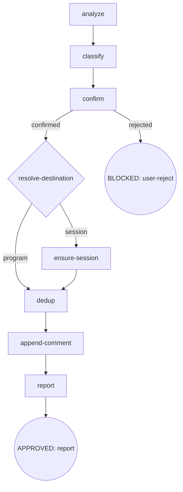

# CDD Engine 重构 — P4 Skills + 模板重构 实施计划

**Spec:** [2026-09-08-cdd-engine-overhaul-p4-design.md](docs/superpowers/specs/2026-09-08-cdd-engine-overhaul-p4-design.md)

> **For agentic workers:** REQUIRED SUB-SKILL: Use superpowers:subagent-driven-development (recommended) or superpowers:executing-plans to implement this plan task-by-task. Steps use checkbox (`- [ ]`) syntax for tracking.

**Goal:** 完成 report-issue 双通道重构（program/session + session master + 永不 reopen + 派生 report-meta + 隐私守则）、模板单一事实源 + 统一渲染器（finding-meta.json + report-templates.mjs + issue-templates emitter）、方法论规范（data-driven-templates.md + CLAUDE.md 指针）、Enh K 全量回顾、Enh R pre-consumed 核验记账、旧语汇清零守卫。

**Architecture:** `finding-meta.json` 唯一 canonical（formFieldDefs 完整编码 3 个 ISSUE_TEMPLATE yml + sectionLabels en/zh×bug/enhancement + masterDef）；`report-templates.mjs` 确定性渲染器（renderYml / renderTitle / renderComment / renderMasterBody / renderSummaryTable，纯函数 + `--mode` stdin CLI）；`scripts/emit/issue-templates.mjs` per-product emitter（import 渲染器 → 3 yml，进 generatedPaths → emit:check）。report-issue skill 变为薄编排（agent 决策 + 渲染器产出正文 + gh comment），无 resolve-hit / reopen / labels 体系。方法论以 `docs/maintainers/data-driven-templates.md` 节点锚定成文。

**Tech Stack:** Node.js 24 · vitest（repo root：`include: ["scripts/**/*.test.mjs"]`）· node:test（osuperpowers 侧）· gh CLI · GitHub ISSUE_TEMPLATE yml · `pnpm run emit/emit:check/validate`。

## Global Constraints

- **单一真相**：`packages/osuperpowers/skills/report-issue/templates/finding-meta.json` 是唯一 canonical；`report-issue/templates/*.md` 4 文件删除（AC7/AC13）；SKILL.md 引用 JSON + 渲染器，不再引用 md（AC7）。
- **渲染器单点**：`packages/osuperpowers/scripts/report-templates.mjs` 导出 renderYml / renderTitle / renderComment / renderMasterBody / renderSummaryTable（纯函数）；agent 不手工拼装正文段落结构（AC6）。测试放 `scripts/emit/issue-templates.test.mjs`（vitest；repo root vitest 只 `scripts/**`）。
- **round-trip 两阶段**：① formFieldDefs 完整编码现 3 个 yml（含 EOF）→ 首渲染 `git diff` 空（过渡性断言，阶段②完成后从测试删）② 隐私迁移独立一步：3 个 form 的 context description+placeholder 移除 `Branch` → Date/Harness/Skills 提示 → 重渲染提交。终结态 `pnpm run emit:check` drift=0（常驻守卫）（AC8）。
- **report-issue 新 digraph**：`analyze → classify → confirm → resolve-destination → {program→dedup · session→ensure-session→dedup} → append-comment → report`；无 `resolve-hit`、无 `gh issue reopen`、无独立 `gh issue create`（session master 创建除外）、无 `dogfood,<type>[,cdd]` labels（仅 master 带 `['session','osuperpowers']`）（AC1/AC4/AC14）。
- **双通道**：`resolve-destination` 先读 `.superpowers/cdd/<slug>/report-target.json` 缓存（命中 program → 复用 #NNN；session → 复用 master）；cache miss 才从 `progress.json#plan` → plan 头部 spec 链 → overall → phase owning issue（本 program=#232）；解析失败 / standalone → session（AC2）。`report-target.json` 仅 CDD scope；standalone 每次新建不复用（AC3）。
- **session master**：title 由 `renderTitle(masterDef, {slugOrStandalone, date})` 生成（`[Session report] <slug|standalone> <YYYY-MM-DD>`）；labels `['session','osuperpowers']`；body = `renderMasterBody()`（Session 元数据 + Findings Summary 表）；date = 创建日（复用不改期）；身份/标题/正文无 branch（AC3/AC5/AC14）。
- **report-meta（派生元数据）**：每条 finding comment + master body 附 `## Report meta (auto)` 六字段（skill/harness/kind/step/cdd/date）；kind 枚举 = `program | consumer-cdd | standalone`；正文无自动 branch/项目路径（隐私守则 Invariant）（AC5）。
- **永不 reopen**：closed dedup hit → comment `## Related` 写 `Regression / follow-up of #NNN (closed)`（AC4）。
- **master Summary PATCH 仅 session 通道**：program 通道无 master 无 PATCH；session 通道每次 append 后 PATCH master body，findings 累积 = 本 run 进程内已 append（勿重读 comments，避读改写竞态）。
- **gh 目标仓库显式化**：全部 gh 操作 `--repo Oscaner/skills`；fail-open（gh 不可用/网络 → 记录 stderr，保留 finding 手工重试）（AC5）。
- **Enh K 全量回顾**：brainstorming `explore-context` 枚举 inventory（含 Side-effect closures）全部唯一 `#NNN` → 每父 issue `gh issue view NNN --json body,comments` 读完整 body + 全部 comments；锚点仅检索入口、禁止挑读；fail-open（AC10）。
- **Enh R pre-consumed**：writing-plans 现状满足，不允许再改 writing-plans（AC9；overall R 行已标 pre-consumed）。
- **方法论规范**：`docs/maintainers/data-driven-templates.md`（digraph + Rules + Invariants + Failure Modes + Exemplars）+ CLAUDE.md「Data-driven template convention」指针 + `skill-authoring.md` 引用（AC12）。
- **旧语汇清零（AC14）**：grep scope `packages/osuperpowers/skills packages/cdd-engine/templates .github/ISSUE_TEMPLATE`——`PASS=<|docs-review\.md|D1|D2|D3` = 0；`resolve-hit|gh issue reopen|dogfood` = 0（`dogfood` 平文覆盖 `dogfood,<type>` 与反引号包裹残留，如 Task 3 将删的「appended automatically … via the report-issue skill」句；精确守卫与豁免清单见 Task 7 Step 1）；豁免：旧 bin 名历史注释（cdd.mjs / docs-runner.mjs / docs-task.test.mjs / cdd-gate-core.mjs / osuperpowers-plugin.md「former docs-task bin」）；yml 表单领域语汇、caller-skill failure-mode 行 labels 描述、brainstorming「dogfood session」阶段语汇（详见 Task 7 Step 1）。
- **SKILL.md 节点锚定合规**：report-issue / brainstorming 改 digraph 后每个 mermaid 节点须有 `###` section（`packages/osuperpowers/tests/digraph-consistency.test.mjs` node:test 断言）。
- **emit 纪律**：改 SKILL.md / templates / CLAUDE.md / skill-authoring 后必须 `pnpm run emit`（派生 manifests 提交）；`pnpm run validate` 每 task 结尾全绿。
- 每 task 结束 `pnpm run validate` 绿。

---

### Task 1: finding-meta.json canonical + report-templates.mjs 渲染器（TDD）

**Files:**
- Create: `packages/osuperpowers/skills/report-issue/templates/finding-meta.json`
- Create: `packages/osuperpowers/scripts/report-templates.mjs`
- Create: `scripts/emit/issue-templates.test.mjs`（本 phase 渲染器测试唯一宿主）

**Interfaces:**
- Consumes: 现状 `.github/ISSUE_TEMPLATE/{bug_report,enhancement,session_report}.yml`（round-trip ① golden：逐字节含 EOF）。
- Produces: `finding-meta.json#formFieldDefs`（3 form 全量字段数据模型）；`report-templates.mjs` 导出 `renderYml(formDef, name)`、`renderTitle(masterDef, {slugOrStandalone, date})`、`renderComment({finding, lang, related, meta})`、`renderMasterBody({kind, meta, findings})`、`renderSummaryTable(findings)`、`renderMeta(meta)`（report-meta 六字段 bullet 格式化：`- Skill / - Harness / - Kind / - Step / - CDD / - Date`，finding comment 与 master body 复用）；`finding` 形状固定 = `{type, component, title, context, problem, impact, suggestedFix}`（type ∈ `bug`|`enhancement`）；`meta` 形状 = `{session?, skill, harness, kind, step, cdd, date}`（`session` 仅 master body 用）；并经 `--mode comment|master` + stdin JSON 可 CLI 调用（Task 4 SKILL.md 引用）。

- [ ] **Step 1: 写 finding-meta.json 骨架 + renderYml 失败测试**

`finding-meta.json` 顶层键（对齐 P3-design §2.3 + 本 spec §2.3）：`components` / `sessionTypes` / `severities` / `metaFields` / `kinds` / `sectionLabels` / `formFieldDefs` / `masterDef`。

`formFieldDefs` 编码 3 个 yml 的 frontmatter（name/description/labels）与 body 逐项（type: `markdown`|`dropdown`|`textarea`，id，attributes{label/description/value|placeholder|options}，validations{required}）。先只写结构 + `bug_report` 的字面条目（实现 renderYml 后再补全另两个），并写测试：

```js
// scripts/emit/issue-templates.test.mjs
import { describe, it, expect } from "vitest";
import { readFileSync } from "node:fs";
import { fileURLToPath, pathToFileURL } from "node:url";
import path from "node:path";
import { renderYml } from "../../packages/osuperpowers/scripts/report-templates.mjs";

const HERE = path.dirname(fileURLToPath(import.meta.url));
const TEMPLATES = path.resolve(HERE, "../../.github/ISSUE_TEMPLATE");
const findingMeta = JSON.parse(readFileSync(path.resolve(
  HERE, "../../packages/osuperpowers/skills/report-issue/templates/finding-meta.json"
), "utf8"));

describe("report-templates", () => {
  it("renderYml 复现现任 bug_report.yml （round-trip ①，过渡性断言）", () => {
    const form = findingMeta.formFieldDefs.bug_report;
    expect(renderYml(form, "bug_report")).toBe(
      readFileSync(path.join(TEMPLATES, "bug_report.yml"), "utf8")
    ); // 逐字节相等：EOF 换行亦在断言范围（spec §2.3 round-trip ①）
  });
});
```

（renderYml 输出须逐段对齐现 yml：markdown value 多行块保留缩进、options 列表、validations、EOF 换行。测试先 `bug_report` 一处通过即可，另两个 form 的 renderYml 断言并入 Step 3。）

- [ ] **Step 2: 实现 finding-meta.json + report-templates.mjs（renderYml 先通）**

`finding-meta.json#formFieldDefs` 完整编码 3 个 yml。`report-templates.mjs`：

```js
export function renderYml(formDef, name) { /* yml 序列化: frontmatter + body 项 */ }
export function renderTitle(masterDef, { slugOrStandalone, date }) {
  return masterDef.title
    .replace("<slug|standalone>", slugOrStandalone)
    .replace("<YYYY-MM-DD>", date);
}
export function renderMeta(meta) {                          // report-meta 六字段 bullet（finding comment / master body 复用）
  return ["Skill", "Harness", "Kind", "Step", "CDD", "Date"]
    .map((label) => `- ${label}: ${meta[label.toLowerCase()] ?? ""}`)
    .join("\n");
}
export function renderSummaryTable(findings) {
  const { cols, placeholder } = masterDef.summaryTable;    // 表头/占位取自 canonical，不硬编码（R1）
  const header = `| ${cols.join(" | ")} |`;
  const sep = `| ${cols.map(() => "---").join(" | ")} |`;
  const rows = findings.map((f, i) => `| ${i + 1} | ${f.type} | ${f.component} | ${f.title} |`);
  return `${header}\n${sep}\n${rows.join("\n")}\n\n${placeholder}`;
}
export function renderComment({ finding, lang, related, meta }) {
  const labels = sectionLabels[finding.type][lang];       // context/problem/impact/suggestedFix 段落序（oracle = canonical）
  const body = [
    `${labels.context}\n\n${finding.context}`,
    `${labels.problem}\n\n${finding.problem}`,
    `${labels.impact}\n\n${finding.impact}`,
    `${labels.suggestedFix}\n\n${finding.suggestedFix}`
  ];
  if (related) body.push(`## Related\n\n${related}`);
  body.push(`## Report meta (auto)\n${renderMeta(meta)}`);
  return body.join("\n\n");
}
export function renderMasterBody({ kind, meta, findings }) {
  // Session 元数据块 + Findings Summary 表 + 末端 `## Report meta (auto)`（与 finding comment 同规，Global §report-meta）
  return [
    `## Session\n\n- Session: ${meta.session ?? "standalone"}\n- Kind: ${kind}\n- Date: ${meta.date}`,
    `## Findings Summary\n\n${renderSummaryTable(findings)}`,
    `## Report meta (auto)\n${renderMeta(meta)}`
  ].join("\n\n");
}
```

JSON import 用 ESM assert 或 `readFileSync + JSON.parse`（Node 24 可用 `with { type: "json" }`，否则 readFile）。渲染函数读同一 finding-meta（模块顶层 load）。CLI 分支（`import.meta.url` isMain）：`--mode comment|master` 读 stdin JSON → 打印 body。

- [ ] **Step 3: 补全另两个 form 的 renderYml 断言 + renderTitle/renderMasterBody/renderSummaryTable/renderComment 断言**

追加断言：`renderYml(formDef, "enhancement")` / `renderYml(formDef, "session_report")` 与现状 diff 空；`renderTitle({title: "[Session report] <slug|standalone> <YYYY-MM-DD>"}, {slugOrStandalone: "cdd-engine-overhaul-p4", date: "2026-09-08"})` = `[Session report] cdd-engine-overhaul-p4 2026-09-08`；`renderSummaryTable` 表头 = `#/Type/Component/Title`（取 `masterDef.summaryTable.cols` 渲染序）；`renderMasterBody` 结构常驻断言（含 Session 元数据、Findings Summary 表、`## Report meta (auto)` 六字段 skill/harness/kind/step/cdd/date）；`renderComment` 段落序 oracle = `finding-meta.json#sectionLabels.bug[lang]` 依次渲染（**不读** Task 4 将删除的 `bug-en.md`，避免跨 task 测试耦合——既定 oracle 有序值时 `## Context` → `## Problem` → `## Impact` → `## Suggested fix`（en）随之成立）。

- [ ] **Step 4: 跑测试 + 全部通过**

Run: `npx vitest run scripts/emit/issue-templates.test.mjs`
Expected: PASS（renderYml 三 form diff 空 + 其余断言全绿）

- [ ] **Step 5: Commit**

```bash
git add packages/osuperpowers/skills/report-issue/templates/finding-meta.json packages/osuperpowers/scripts/report-templates.mjs scripts/emit/issue-templates.test.mjs
git commit -m "feat(osuperpowers): finding-meta.json canonical + report-templates.mjs 渲染器（renderYml 三 form round-trip ① diff 空）"
```

---

### Task 2: issue-templates emitter + 首渲染落盘（round-trip ① 完成）

**Files:**
- Create: `scripts/emit/issue-templates.mjs`
- Modify: `scripts/emit/all.mjs`（挂入 emitAll）

**Interfaces:**
- Consumes: Task 1 的 `finding-meta.json` + `renderYml`。
- Produces: emitter 签名 `emitIssueTemplates(outRoot, source?, { generatedPaths })`；写 `outRoot/.github/ISSUE_TEMPLATE/{bug_report,enhancement,session_report}.yml`；`generatedPaths.push(...)` 3 条。

- [ ] **Step 1: 写 emitter**

```js
// scripts/emit/issue-templates.mjs
import { dirname, join } from "node:path";
import { fileURLToPath } from "node:url";
import { readFileSync, mkdirSync, writeFileSync } from "node:fs";
import { renderYml } from "../../packages/osuperpowers/scripts/report-templates.mjs"; // 插件内渲染器
const META_PATH = fileURLToPath(new URL("../../packages/osuperpowers/skills/report-issue/templates/finding-meta.json", import.meta.url));

export function emitIssueTemplates(outRoot, { generatedPaths }) {
  const meta = JSON.parse(readFileSync(META_PATH, "utf8"));
  for (const name of ["bug_report", "enhancement", "session_report"]) {
    const file = join(outRoot, ".github/ISSUE_TEMPLATE", `${name}.yml`);
    mkdirSync(dirname(file), { recursive: true });
    writeFileSync(file, renderYml(meta.formFieldDefs[name], name));
    generatedPaths.push(`.github/ISSUE_TEMPLATE/${name}.yml`);
  }
}
```

- [ ] **Step 2: 挂入 all.mjs**

`scripts/emit/all.mjs`：`import { emitIssueTemplates } from "./issue-templates.mjs";` 并在 `emitAll` 内调用（outRoot 统一，`generatedPaths` 传入），返回的 wrapperRoots 原样透传。

- [ ] **Step 3: 首渲染验证 diff 空**

Run: `pnpm run emit && git status --short .github/ISSUE_TEMPLATE/`
Expected: 3 个 yml 无 diff（首渲染 = 现状，round-trip ①的落盘验证）；`pnpm run emit:check` OK。

- [ ] **Step 4: 全量 validate**

Run: `pnpm run validate` → ALL PASS

- [ ] **Step 5: Commit**

```bash
git add scripts/emit/all.mjs scripts/emit/issue-templates.mjs packages/osuperpowers/.agents/  # .agents 为 emit 派生产物（Task 1 canonical 的 finding-meta.json 已镜像至此），与后续 task 的 <emit 产物> 占位同语义；不纳入则派生产物跨 task 游离未提交
git commit -m "feat(scripts): issue-templates emitter 挂入 emitAll（3 yml 首渲染 diff 空，round-trip ①完成）"
```

---

### Task 3: 隐私迁移（round-trip ②）— 3 个 form 移除 Branch

**Files:**
- Modify: `packages/osuperpowers/skills/report-issue/templates/finding-meta.json`（formFieldDefs 文案）
- Modify: `scripts/emit/issue-templates.test.mjs`（① 过渡断言删、② 新增无 Branch 断言）
- Generated（emit）：`.github/ISSUE_TEMPLATE/*.yml`

**Interfaces:**
- Consumes: Task 1/2 的 canonical + emitter。
- Produces: 隐私迁移后的 3 个 yml（context description + placeholder 无 `Branch`，含 Date/Harness/Skills 提示）。

- [ ] **Step 1: 改 formFieldDefs 文案**

3 个 form 的 `context` 字段：`description` 与 `placeholder` 移除 `branch, <branch>` / `Branch: feat/my-feature` 组件 → 替换为 `Date / Harness / Skills` 提示。如 bug_report context placeholder：`"Date: YYYY-MM-DD, Harness: claude-code, Skills: cli-driven-development, writing-plans"`；description 相应去 branch 措辞。**同时**开展另一处文案迁移：bug_report / enhancement 两个 form 顶部 markdown `value` 块中**删除**「Additional labels (`dogfood` and `cdd` for CDD-related findings) will be appended automatically when the issue is filed via the report-issue skill.」一句——P4 后 report-issue 走 session/program 双通道、无独立 issue create、不再自动 append 任何 label（AC1/AC14），此句若保留将冻结进派生产物、发货后失实；改写为不声称自动 labeling 的措辞（如改述为 session master 自带 label 集 `['session', 'osuperpowers']`，或直接删去 label 说明）。**此句删除为「保持其余字段、缩进、EOF 不变」的唯一例外**。

- [ ] **Step 2: 更新测试 — 删 ① 过渡断言、加 ② 断言**

`issue-templates.test.mjs`（Task 1 的 diff 空断言 prong ①：按 spec §2.3 标记为过渡——本 task 完成后从测试集删除常量 "与现状 yml diff 空" 断言）；新增：

```js
it("隐私迁移后 3 个 yml 渲染产物无 Branch", () => {
  for (const n of ["bug_report", "enhancement", "session_report"]) {
    expect(renderYml(findingMeta.formFieldDefs[n], n)).not.toMatch(/Branch/);
  }
});
```

- [ ] **Step 3: 重渲染 + diff 审查**

Run: `pnpm run emit` → `git diff .github/ISSUE_TEMPLATE/` 审查：仅 context 字段 branch→Date/Harness 措辞变化，无字段增删、无缩进漂移。`pnpm run emit:check` OK。
Expected: 终结态 `emit:check` drift=0 为常驻守卫（AC8）。

- [ ] **Step 4: 跑测试 + validate**

Run: `npx vitest run scripts/emit/issue-templates.test.mjs && pnpm run validate` → 全绿

- [ ] **Step 5: Commit**

```bash
git add packages/osuperpowers/skills/report-issue/templates/finding-meta.json scripts/emit/issue-templates.test.mjs .github/ISSUE_TEMPLATE/
git commit -m "feat(issue-templates): 隐私迁移 — 3 form context 移除 Branch placeholder（round-trip ②）"
```

---

### Task 4: report-issue SKILL.md 重构（新 digraph + 双通道 + 渲染器引用）+ 删 4 md + emit

**Files:**
- Rewrite: `packages/osuperpowers/skills/report-issue/SKILL.md`
- Delete: `packages/osuperpowers/skills/report-issue/templates/{bug-en,bug-zh,enhancement-en,enhancement-zh}.md`
- Derived: `pnpm run emit` 产物

**Interfaces:**
- Consumes: Task 1 渲染器（`report-templates.mjs` CLI `--mode comment|master`）、finding-meta.json、Task 2/3 yml。
- Produces: report-issue 新 digraph + 节点定义（AC1-5）；SKILL.md 引用渲染器而非 md；4 md 删除（AC7）。

- [ ] **Step 1: 重写 SKILL.md 新 digraph**



节点定义（每个 digraph 节点必须有 `###` section）：`analyze`（ledger 扫描词 fix round/BLOCKED/parked/CHANGES_REQUESTED；redact secrets）· `classify`（bug/enhancement；无 label 指令）· `confirm`（I1 Confirm Gate）· `resolve-destination`（缓存首查 + 程序联动 + 守卫 + fail-open，§AC2）· `ensure-session`（find-or-create master，§AC3）· `dedup`（`gh issue list --repo Oscaner/skills --state all`；匹配键 component+行为词+标题/正文关键词；closed → `Regression / follow-up of #NNN (closed)`，永不 reopen）· `append-comment`（`renderComment` 取 body → `gh issue comment --repo Oscaner/skills`；master Summary PATCH 仅 session 通道；findings 累积 = 进程内已 append）· `report`（URL 列表）。

- [ ] **Step 2: Invariants / Failure Modes / frontmatter 更新**

- Invariants：移除 `I2 Label Format`（labels 废弃，AC14）、`I4 Closed Issue Awareness`→改 `I4 永不 Reopen`；新增 `I5 渲染器确定性`（正文由 report-templates.mjs 产出）、`I6 隐私守则`（branch/路径/文件名绝不自动入文；consumer opt-in 经 confirm）、`I7 kind 唯一枚举`（program/consumer-cdd/standalone）。保留 `I1 Confirm Gate`、`I3 Manual Trigger Only`。
- Failure Modes：删 `事件 create 失败`/`reopen 失败`行；新增 resolve-destination 双通道 fail-open、master 创建失败降级（提示手工创建 + 重试）、gh 不可用 fail-open。
- frontmatter `description`：去掉 `Labels follow dogfood,<type>[,cdd] format`；陈述双通道 + report-meta。
- **全文含精确标题措辞**：禁止出现 `resolve-hit`、`gh issue reopen` 与 `dogfood`（平文即覆盖 `dogfood,<type>` 及反引号包裹残留，AC4/AC14）。`[Session report]` 字样只出现在 title 模板引用（`renderTitle` 产出）。

- [ ] **Step 3: 渲染器引用接线**

SKILL.md 的 `append-comment` / `ensure-session` 节点写明运行时调用：`node "${pluginRoot}/scripts/report-templates.mjs" --mode comment`（stdin 传 finding+lang+related+meta JSON）→ 输出 body；`--mode master` 生成 master body / Findings Summary。`pluginRoot` = osuperpowers 插件根（`.claude-plugin/plugin.json` 定位，gate pluginRoot 同法）。

- [ ] **Step 4: 删除 4 md + 残留引用清理**

删除 `report-issue/templates/{bug-en,bug-zh,enhancement-en,enhancement-zh}.md`；`grep -rnE "bug-en|bug-zh|enhancement-en|enhancement-zh" packages/osuperpowers/skills/report-issue --include="*.md"` 无残留引用（检索模式 = 已删 4 文件 basename，**不含** `templates/`——`finding-meta.json` 位于 canonical 目录，SKILL.md 对 `templates/finding-meta.json` 的引用属 AC7 合法引用，不得误命中）。

- [ ] **Step 5: emit + node-coverage + validate**

Run: `pnpm run emit && npx vitest run scripts/emit/issue-templates.test.mjs && pnpm run validate`
Expected: node:test `digraph-consistency`（每 mermaid 节点有 ### 节）+ `rule-reference` 全绿；`pnpm run validate` ALL PASS。

- [ ] **Step 6: Commit**

```bash
git add packages/osuperpowers/skills/report-issue/ <emit 产物>
git commit -m "refactor(osuperpowers): report-issue 新 digraph 双通道 + 渲染器引用 + 删 4 md 模板"
```

---

### Task 5: 方法论规范 data-driven-templates.md + CLAUDE.md 指针 + skill-authoring 引用

**Files:**
- Create: `docs/maintainers/data-driven-templates.md`
- Modify: `CLAUDE.md`（加「Data-driven template convention」节）
- Modify: `docs/maintainers/skill-authoring.md`（引用）

**Interfaces:**
- Consumes: P3 `_docs/review.md` 结构范式（digraph + Rules + Invariants + Failure Modes）；P4 自身实现（规范首个 dogfood）。
- Produces: 节点锚定式规范（AC12）。

- [ ] **Step 1: 写规范文档**

`docs/maintainers/data-driven-templates.md`（中文，Strategy B extension；节点锚定式，仿 `_docs/review.md`）：
- Scope：所有「文本形态可数据化、被多消费端引用、须防漂移」的模板性内容（reviews.json / harness-registry / finding-meta / ISSUE_TEMPLATE / `.agents/`）。
- Digraph：`canonical → renderer → {emit product · runtime product} → round-trip guard`
- Rules：R1 单一事实源 · R2 渲染确定性 · R3 派生产物 emit 生成（generatedPaths + emit:check）· R4 round-trip 两阶段 · R5 消费者端可用。
- Invariants：canonical 可定位（grep 无 md 副本）· 渲染器单点 · `pnpm run emit:check` drift=0 · 派生产物不手改。
- Failure Modes：手改派生产物 / 双源分歧 / 渲染不可测 / 消费者端不可用。
- Exemplars：harness-registry.json (P1) · reviews.json+URC (P3) · finding-meta.json + issue-templates (P4，首个运行时渲染) · ISSUE_TEMPLATE yml (P4)。

- [ ] **Step 2: CLAUDE.md 指针**

CLAUDE.md 加节（紧邻「`.agents/ is derived, never edit`」）：

```markdown
## Data-driven template convention

模板性内容收敛为一事实源：canonical JSON → 单一渲染器 → emit 生成派生产物（含 `pnpm run emit:check` drift 守卫 + 运行时组合）。全职守见 [docs/maintainers/data-driven-templates.md](docs/maintainers/data-driven-templates.md)。
```

- [ ] **Step 3: skill-authoring 引用**

`docs/maintainers/skill-authoring.md` 加一段：新 skill 引入模板正文时走 data-driven-templates 规范（canonical + 渲染器 + emit 守卫）。

- [ ] **Step 4: 校验 + commit**

Run: `pnpm run validate`（CLAUDE.md 改动会触发 emit? CLAUDE.md 非 emit 输入——核对 `pnpm run emit:check`）。

```bash
git add CLAUDE.md docs/maintainers/data-driven-templates.md docs/maintainers/skill-authoring.md
git commit -m "docs(maintainers): data-driven-templates 方法论规范 + CLAUDE.md 指针 + skill-authoring 引用"
```

---

### Task 6: Enh K 强化 — brainstorming explore-context 全量回顾

**Files:**
- Modify: `packages/osuperpowers/skills/brainstorming/SKILL.md`（`explore-context` 节点）
- Derived: `pnpm run emit` 产物

**Interfaces:**
- Consumes: overall Issue inventory 结构（含 Side-effect closures 段）。
- Produces: `explore-context` 全量回顾指令（AC10）。本 spec §2.5.1 指引文本 verbatim。

- [ ] **Step 1: explore-context 节点追加全量回顾指令**

`packages/osuperpowers/skills/brainstorming/SKILL.md` 的 `### explore-context` Do 增加（phase-within-program 模式，英文 primary SKILL.md 要求）：

> Enumerate every unique `#NNN` in the parent overall's Issue inventory (**including the Side-effect closures block**). For each parent issue, run `gh issue view NNN --json body,comments` and read the **full body + all comments** (including parts not anchored in the inventory). Anchors are lookup entries, not the read scope — do not anchor-pick individual comments. Include the content in exploration context. Fail-open: gh unavailable / rate-limited → log warning and continue without blocking.

- [ ] **Step 2: emit + validate**

Run: `pnpm run emit && pnpm run validate` → rule-reference node-coverage 绿（仅加 text，无 digraph 变化）。

- [ ] **Step 3: Commit**

```bash
git add packages/osuperpowers/skills/brainstorming/ <emit 产物>
git commit -m "feat(osuperpowers): brainstorming explore-context 全量回顾（Enh K 强化 — 锚点仅检索入口禁止挑读）"
```

---

### Task 7: 旧语汇清零守卫 + 全量验证 + changeset

**Files:**
- Verify: AC14 grep（无修改）
- Create: `.changeset/<slug>.md`（osuperpowers bump）

**Interfaces:**
- Consumes: Task 1-6 产物。
- Produces: AC14 可机械断言 + validate 全绿 + changeset。

- [ ] **Step 1: AC14 grep 守卫**

```bash
grep -rnE "PASS=<|docs-review\.md|D1|D2|D3" packages/osuperpowers/skills packages/cdd-engine/templates .github/ISSUE_TEMPLATE; echo "exit=$?"
grep -rnE "resolve-hit|gh issue reopen|dogfood" packages/osuperpowers/skills packages/cdd-engine/templates .github/ISSUE_TEMPLATE
```
Expected: 两组各无命中（exit 非 0 = 无匹配即 PASS）。第二组以 `dogfood` 平文检索——覆盖 `dogfood,<type>` 及反引号包裹残留（Task 3 Step 1 删除的「Additional labels (`dogfood` and `cdd` …) will be appended automatically when the issue is filed via the report-issue skill.」即为此类残留）；另含 Task 4 Step 2 已禁的 report-issue SKILL.md 平文 `dogfood`。豁免不做 grep（历史注释保留）：旧 bin 名历史注释（cdd.mjs / docs-runner.mjs / docs-task.test.mjs / cdd-gate-core.mjs / osuperpowers-plugin.md「former docs-task bin」）；yml 表单领域语汇（bug_report/enhancement 顶部 value「during dogfood use of osuperpowers skills」与 description、context 调查项「dogfood (CDD session)」下拉及 options、session_report description「dogfood/CDD session report」——用户语汇，非 label 机制声明）；caller-skill failure-mode 行 labels 描述（`cli-select/SKILL.md`、`cli-driven-development/SKILL.md` 的 `labels bug, dogfood, osuperpowers[, cdd]` row——较旧 label 集遗留，属 session master labels 语义豁免，由后续 report-issue dogfood 跟进核实）；brainstorming overall-spec-template「dogfood session」阶段语汇。

- [ ] **Step 2: AC9/AC11 标注核实 + AC2 运行期验证声明**

- writing-plans：`grep -rni "fix selected" packages/osuperpowers/skills/writing-plans` 无命中（fail-selected 边不存在）；`user-ok?` 节点出口仅 `approved → commit-plan`（「Fix selected」死选项已移除）。
- finishing：`grep -rni "tasklist\|PATCH" packages/osuperpowers/skills/finishing` 无 tasklist PATCH。
- overall Issue inventory：R 行含 `pre-consumed` 标注（#232 comment 5549870456）、V/W 行含 `superseded` 标注（#232 comments 5553108929 / 5553110014）。
- **AC2 运行期验证（本 program session 追加 #232，本计划内闭环）**：resolve-destination 程序通道端到端在本计划内执行两步验证——
  1. **解析链路核对（无需 gh）**：取本 program 工作区 `progress.json#plan` 的 plan 路径 → plan 头部 spec 链接 → 对应 overall issue → Phase inventory，人工核对 resolve-destination 的解析决策产出 `{kind: program, issue: 232}`；若 `.superpowers/cdd/<slug>/report-target.json` 缓存已命中，则记录命中分支并另核对该缓存值与该程序链路结果一致。
  2. **真实程序通道 dogfood（Step 2 前置）**：在当前 CDD workspace 跑一次 `report-issue`，确认（cache miss 或命中后）解析 plan→overall→#232、findings 追加落至 `#232`（程序通道，无 master）且每条 comment 与主 issue 链接正确；gh 不可用/网络失败则 fail-open 记录 stderr，并将验证结果与待重试 finding 写入验收说明。

- [ ] **Step 3: 全量 validate**

Run: `pnpm run validate` → ALL PASS（emit fresh / engine vitest 236 / scripts vitest 新增 issue-templates.test 全绿 / node:test tree / 版本 sync）。若 `emit:check` 漂移 → `pnpm run emit` 补 + commit 派生产物。

- [ ] **Step 4: changeset**

```bash
pnpm run changeset   # type: minor；说明 P4：report-issue 双通道重构 + finding-meta 渲染器 + 方法论规范 + Enh K 全量回顾
```

- [ ] **Step 5: Commit**

```bash
git add .changeset/
git commit -m "chore(osuperpowers): changeset for P4（report-issue 双通道 + 模板单一事实源）"
```