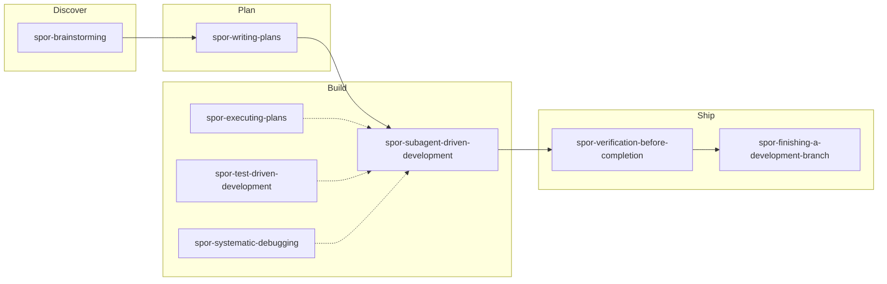

# README rewrite — bilingual marketplace docs

## Summary

Rewrite the repository README and add a dedicated `superpowers-overrides` sub-README. Four files total, English + Simplified Chinese, structurally mirrored. Main README tells the origin story and gets users started; sub-README covers skills, harness differences, and enforcement details.

## Goals

1. **Concise and clear** — one idea per sentence; tables over walls of text.
2. **Tell the story** — superpowers (comprehensive) + mattpocock-skills (focused) → superpowers-overrides (glue) → overall + phase engineering.
3. **Appropriate depth** — brief skill intros in sub-README only; no Rule-by-Rule dumps.
4. **Usage documented** — generic quick start on main README; Claude Code / Cursor specifics on sub-README.
5. **Cross-linking** — main README points to sub-README; each language links its own language variant.

## Non-goals

- Documenting `impeccable` or other marketplace plugins beyond the core triangle.
- Moving or rewriting `CLAUDE.md`, skill bodies, or marketplace JSON.
- Full maintainer handbook in README (validate, emit, changeset stay as short links).
- Committing the spec as part of implementation (spec lands uncommitted unless user asks).

## Decisions (from brainstorming)

| Decision | Choice |
|----------|--------|
| Bilingual format | Dual files: `README.md` + `README.zh-CN.md` (main and sub) |
| Audience | User-first; brief Maintainers footer (~3–5 lines + links) |
| Narrative depth | Medium — 3-paragraph origin + one workflow diagram |
| Marketplace scope | Core triangle only (superpowers, mattpocock-skills, superpowers-overrides) |
| Sub-README skills layout | Mermaid pipeline + phase-grouped table |
| Usage on main README | Generic 3-step quick start; harness details on sub-README |

## File map

| File | Action | Target length |
|------|--------|---------------|
| `README.md` | Rewrite | ~85–95 lines |
| `README.zh-CN.md` | Create | ~85–95 lines (natural Chinese, not literal translation) |
| `plugins/superpowers-overrides/README.md` | Create | ~110–130 lines |
| `plugins/superpowers-overrides/README.zh-CN.md` | Create | ~110–130 lines |

### Bilingual sync rules

- Identical heading hierarchy across language pairs.
- Language switcher at top: `[English](README.md) | [简体中文](README.zh-CN.md)`.
- Cross-references use same-language paths (Chinese main → Chinese sub).
- All four files updated in the same change set.

## Main README structure

### Header

- Keep CI badge.
- Language switcher.
- **Hero (one line)**
  - EN: *Combine superpowers' full workflow with mattpocock's precision — engineered via superpowers-overrides.*
  - ZH: *用 superpowers-overrides 把 superpowers 的全流程和 mattpocock 的精专缝成一条工程化流水线。*

### § Why this exists (~3 paragraphs)

1. **Superpowers** — end-to-end workflow: brainstorming → plans → SDD → ship.
2. **mattpocock-skills** — sharp single-purpose skills: `grilling`, `tdd`, `to-tickets`.
3. **The gap** — no opinion on ordering, delegation, or phasing large work. **superpowers-overrides** intercepts upstream skills (replace or delegate) and adds **overall + phase**: write an overall spec to decompose big features, then run full spec → plan → dev cycles per phase.

### § The pipeline

Simple ASCII flow on main README — **conceptual pipeline** (includes overall/phase):

```
Overall spec → Phase spec → Plan → SDD/TDD → Verify → Ship
```

Annotate: overrides add grilling + subagent review; mattpocock handles grilling, tdd, to-tickets via delegation.

Closing line links to sub-README for skill mapping:

- EN main → [`plugins/superpowers-overrides/README.md`](plugins/superpowers-overrides/README.md)
- ZH main → [`plugins/superpowers-overrides/README.zh-CN.md`](plugins/superpowers-overrides/README.zh-CN.md)

### § Installation

Existing marketplace commands for all three plugins:

```bash
/plugin marketplace add oscaner/skills
/plugin install mattpocock-skills@oscaner
/plugin install superpowers@oscaner
/plugin install superpowers-overrides@oscaner
```

Clone + submodule init for contributors cloning this repo:

```bash
git clone https://github.com/Oscaner/skills.git
cd skills
git submodule update --init
```

### § Quick start (harness-agnostic, 3 steps)

1. Install `superpowers`, `superpowers-overrides`, and `mattpocock-skills` from the marketplace.
2. Run the **init skill** once per project — re-run after plugin upgrades. Exact slash command depends on harness; see sub-README § Usage:
   - EN main → [Usage](plugins/superpowers-overrides/README.md#usage)
   - ZH main → [用法](plugins/superpowers-overrides/README.zh-CN.md#用法)
3. Invoke the superpowers workflow as you normally would — overrides intercept and run first automatically.

Do **not** embed Claude-only (`/superpowers:*`) or Cursor-only (`/spor-*`) commands in main README body beyond `/spor-init` as the recognizable entry point name.

### § Learn more

- EN: [superpowers-overrides README](plugins/superpowers-overrides/README.md)
- ZH: [superpowers-overrides 说明](plugins/superpowers-overrides/README.zh-CN.md)

### § Maintainers (~3–5 lines)

- After editing overrides: `pnpm run generate:overrides && pnpm run emit && pnpm run validate`
- Release: [`.changeset/README.md`](.changeset/README.md)
- Contributor pattern: [`CLAUDE.md`](CLAUDE.md)

### § License

Copy verbatim from current `README.md`:

> Personal use. No warranty. Adapt freely for your own setup.

### Content removed from current main README

Move out of body (link only from Maintainers where relevant):

- Repository layout tree
- Enforcement three-layer detail
- Full Releasing table
- Common override skills table (lives on sub-README)
- Cursor smoke / cross-harness detail (lives on sub-README)

## Sub-README structure

Path: `plugins/superpowers-overrides/README.md` (+ `.zh-CN.md`)

### § What overrides do (~2–3 paragraphs)

- Each `spor-*` runs **before** its `superpowers:*` target.
- Actions: **replace** (e.g. self-review → fresh subagent passes) or **delegate** (e.g. questions → `grilling`, implementation → `tdd`).
- **Three enforcement layers** (one sentence each): four-trigger skill description; `UserPromptExpansion` hook on `/superpowers:*`; project rules from `/spor-init`.

### § Workflow (mermaid)

**Simplified main-path diagram** — not a complete skill inventory. Overall/phase, policy, cross-cutting, and `spor-receiving-code-review` are documented in the phase table below, not in the diagram.



Separate short paragraph on **overall + phase** (not in diagram): large scope → overall spec → explicit gate → per-phase discover→ship cycle. The main README ASCII pipeline includes Phase spec; this mermaid shows the per-phase skill intercept chain starting at Discover.

### § Skills by phase

Grouped table — one line per skill, no Rule numbers:

| Phase | Skill | One-line description |
|-------|-------|----------------------|
| Setup | `spor-init` | Project wiring; run once after install |
| Discover | `spor-brainstorming` | Delegates discovery to `grilling`; subagent spec review; overall/phase for large scope |
| Plan | `spor-writing-plans` | Section-by-section plan writes + review; tickets to `docs/superpowers/tickets/` |
| Build | `spor-subagent-driven-development` | Complexity-based review rounds; implementers delegate to `tdd` |
| Build | `spor-executing-plans` | Plan execution; redirects to SDD when subagents available; per-task commits |
| Build | `spor-test-driven-development` | Confirms seams with user; delegates loop to mattpocock `tdd` |
| Build | `spor-systematic-debugging` | Evidence before fixes; delegates to `diagnosing-bugs` |
| Ship | `spor-verification-before-completion` | No completion claims without verification evidence |
| Ship | `spor-finishing-a-development-branch` | Branch finish / PR; no worktrees; conventional commits |
| Ship | `spor-receiving-code-review` | Unclear feedback → `grilling`; fixes → `tdd` (not shown in mermaid — often invoked mid-build or pre-ship) |
| Policy | `spor-using-git-worktrees` | Refuses worktree creation (user policy) |
| Cross-cutting | `spor-subagent-lifecycle` | Fresh subagent per pass; concurrency rules (referenced, no slash) |
| Cross-cutting | `spor-token-efficient-review-dispatch` | D1/D2/D3 review dispatch (referenced, no slash) |

Skill count check (verification only): 10 override targets + `spor-init` + 2 cross-cutting = 13 entries in `plugin.json`.

### § Usage

**Common**

1. Install all three plugins from marketplace.
2. `/spor-init` in each project (re-run after upgrades).
3. Invoke upstream superpowers skills — overrides intercept automatically.

**Claude Code**

- Commands: `/superpowers:brainstorming`, `/superpowers:writing-plans`, …
- Init writes self-check block to project `CLAUDE.md`.
- Init command: `/superpowers-overrides:spor-init`.

**Cursor**

- Commands: `/spor-brainstorming`, `/spor-writing-plans`, … (or rules-based intercept).
- Init writes `.cursor/rules/superpowers-overrides.mdc`.
- Links: [cross-harness-overrides.md](docs/cross-harness-overrides.md), [CURSOR-SMOKE.md](docs/CURSOR-SMOKE.md).

### § Docs for maintainers

- [cross-harness-overrides.md](docs/cross-harness-overrides.md)
- Parent [CLAUDE.md](../../CLAUDE.md)
- [CHANGELOG.md](CHANGELOG.md)

## Writing style

| Principle | Application |
|-----------|-------------|
| Concise | Short paragraphs; tables for skills |
| Story-driven | Problem → two libraries → overrides stitch → overall/phase engineering |
| Accurate | Terminology matches `CLAUDE.md` (override, delegate, overall, phase, enforcement) |
| Chinese | Natural Simplified Chinese; keep code, commands, and skill names in English |

## Verification

Manual checklist after implementation:

- [ ] All four files exist with mirrored heading structure.
- [ ] Language switchers work (relative paths correct from each file location).
- [ ] Main README links to sub-README in matching language.
- [ ] Installation commands match current marketplace (`oscaner/skills`).
- [ ] All 13 skills listed on sub-README phase table; mermaid renders on GitHub.
- [ ] No `impeccable` mention on main README.
- [ ] Maintainers section ≤ 5 lines on main README.
- [ ] `pnpm run validate` still passes (no manifest changes expected).

## Implementation note

Single implementation plan should cover all four files in one pass to keep bilingual pairs in sync.
