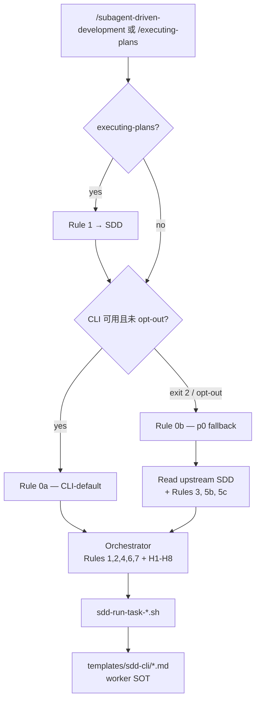

# SDD Token 效率 — Phase p1-slim：薄 Orchestrator + 模板 SOT

- **Version**: v1.0 · 2026-08-05
- **Status**: Approved (spec review 2026-08-05)
- **Author**: oscaner · Cursor Agent
- **Program**: [overall v2.1](2026-08-05-sdd-token-efficiency-overall.md)
- **Phase ID**: p1-slim
- **Depends on**: [p1 ship](2026-08-05-sdd-token-efficiency-p1-design.md)（H6–H8 + `templates/sdd-cli/` + SDD Rule 7 已存在）

## §0 Incremental warning

> Phase p1-slim increment only. Cross-phase conventions in [overall](2026-08-05-sdd-token-efficiency-overall.md); overall wins on conflict.

## §1 Constraints pointer

> Scope: **`superpowers-overrides` skill + template 文本**。**不**改 upstream superpowers SDD；**不**改 p0 handoff schema；**不**改 `bin/sdd-run-task-*.sh` 行为；**不**新建 skill / manifest 条目；**保留** p0 in-session fallback。

## Goal

p1 已将 per-task worker 执行下沉到 CLI + `templates/sdd-cli/`，但 orchestrator session 仍加载完整 upstream `subagent-driven-development`（~500 行）且 spor override 内 worker delegate 规则（Rule 3 tdd、Rule 5 implementer dispatch）与模板 **双写**。

本 phase 实现：

1. **CLI-default 路径**：orchestrator **禁止**加载 upstream SDD；worker 纪律以模板为唯一真源（SOT）。
2. **p0 fallback 路径**：CLI 不可用 / opt-out 时 **按需**加载 upstream SDD + p0-only 规则。
3. **`spor-executing-plans` router-only**：删与 SDD 重复 delegate；commit 规则下沉到 `implement.md`。
4. **维护成本**：partial-delegate + `p0-only` guard，与 writing-plans Rule 3 模式一致。

## Architecture



### 路径判定（与 p1 Rule 7 / H8 一致）

| 条件 | 路径 |
|------|------|
| cursor/claude CLI 在 PATH + harness 脚本存在 + 无 opt-out | **Rule 0a** CLI-default |
| script exit **2** / `--no-cli` / `SDD_NO_CLI=1` / config `"cli": false` | **Rule 0b** p0 fallback |
| stub harness exit **1** | **BLOCKED**（不变） |

## §2 Design body

### 2.1 与 p1 的关系

| 维度 | p1 | p1-slim |
|------|-----|---------|
| CLI 4-mode 链 | ✅ | 不变 |
| `templates/sdd-cli/` | worker prompt | **+ commit instruct；cite 为 SOT** |
| SDD Rule 7 | CLI 检测 + H6 | 不变；与 Rule 0 呼应 |
| upstream SDD 加载 | override 后仍常加载全文 | **CLI-default 禁止加载** |
| spor-SDD Rule 3 | 全路径生效 | **p0-only** |
| spor-SDD Rule 5 | 单条 | **拆 5a orchestrator + 5b p0 dispatch + 5c p0 review** |
| spor-executing-plans | Rule 3/5 重复 | **router-only** |

### 2.2 `spor-subagent-driven-development` 变更

#### Rule 0 — 路径分支（**新增，置于 Rules 最前**）

**Rule 0a — CLI-default**

1. 判定满足 Rule 7 第 1 条（CLI 可用、非 opt-out、非 stub BLOCKED）→ 本 session **禁止** Read/Skill upstream `subagent-driven-development` **skill body**（含 `implementer-prompt.md`、`task-reviewer-prompt.md` 等 prompt 文件）。
2. **允许** shell 调用 upstream **scripts only**：`plugins/superpowers/scripts/sdd-workspace`、`task-brief`、`review-package`（路径经 `{plugin_root}` 解析）。禁止 Read 上述脚本以外的 upstream SDD 目录内 Markdown prompt。
3. Per-task worker 纪律 cite `templates/sdd-cli/{implement,handoff,review,fix}.md` — **不得** paraphrase Rule 3/5b/5c 正文。
4. Orchestrator 职责（见 §2.5 内联摘要）：Setup（session 一次）、Rule 1 复杂度 + batching、Rule 4 首次 H6 前 cheap-model 确认、H6 shell 序列、Rule 2 fix 链触发（handoff `CHANGES_REQUESTED` → shell fix modes）、Rule 6 STOP、ledger append、final whole-branch review。
5. Per-task review 步骤 2–8 **不在 orchestrator 内执行** — 由 H6 CLI 子进程 + 模板实现（Rule 5a guard）。

**Rule 0b — p0 fallback**

1. 触发：Rule 7 第 2 条条件（exit 2 / opt-out）。
2. **此时** Read upstream `subagent-driven-development`；Rules 3、5b、5c 全文生效；in-session Task/subagent 流程。
3. Announce：`CLI unavailable — falling back to p0 in-session SDD.`
4. Per-task commit：implementer subagent 按 upstream + Rule 3 + **Rule 5b commit 段**（conventional commit，与 `implement.md` 语义对齐）。

#### Rule 3 — Implementer TDD delegate **(p0 fallback only)**

- 首行 guard：`When Rule 0a applies, skip this rule — see templates/sdd-cli/implement.md.`
- 其余正文不变（tdd invoke、exemption、load failure）。

#### Rule 5 — 拆分

**Rule 5a — Orchestrator gates（两路径共用）**

- Guard for worker steps：`When Rule 0a applies, steps 2–8 below are executed inside H6 CLI subprocesses per templates/sdd-cli/ — orchestrator does NOT dispatch handoff-writer or code-review in-session.`
- Orchestrator **always**：
  1. Read handoff.json only（H2）
  2. `plan_conflicts` non-empty → STOP（Rule 5 step 7 / Rule 6）
  3. `CHANGES_REQUESTED` → Rule 2 fix loop（CLI：shell fix chain；p0：Rule 5c）
  4. `NEEDS_CONTEXT` / non-empty `unverifiable` → STOP
- Cite controller-handoff **H1–H8**

**Rule 5b — In-session implementer dispatch (p0 fallback only)**

- Guard：`When Rule 0a applies, skip — templates/sdd-cli/implement.md is SOT.`
- 从现 Rule 5 移入：brief/report 路径、implementer subagent dispatch 模板引用
- **Commit 段**（p0-only）：task 完成且测试通过后 conventional commit（subject 对齐 brief；无 attribution trailer）；`base`/`head` 写入 H1 与 handoff-writer 输入

**Rule 5c — In-session per-task review dispatch (p0 fallback only)**

- Guard：`When Rule 0a applies, skip — H6 + templates/sdd-cli/{handoff,review,fix}.md is SOT.`
- **保留**现 Rule 5 步骤 2–8 全文（handoff-writer segments、review-package、code-review override、D4、degradation 到 upstream task-reviewer）

#### Rules 1, 2, 4, 6, 7

- **Rule 1, 2, 6, 7**：不变。
- **Rule 4**：CLI-default 下 cheap-model 确认在 **首次 H6 shell 前**由 orchestrator 执行（与现 Rule 4 相同确认语）；CLI implement session 使用 harness 默认 cheap tier（Cursor Composer / Claude 最低 capable tier）— **不在** `implement.md` 重复 model 选择逻辑。

#### Red Flags — 新增

- 「CLI 可用却 Read upstream SDD」
- 「Rule 0a 路径下在 override 内 paraphrase tdd/code-review 纪律而非 cite 模板」
- 「p0 fallback 未 announce 就 in-session dispatch」

### 2.3 `spor-executing-plans` → router-only

| 规则 | 变更 |
|------|------|
| Rule 1 | 不变 — redirect → SDD |
| Rule 2 | 不变 — worktree 拒绝 |
| Rule 3 | **删除** — redirect 后 SDD / 模板管 |
| Rule 4 | 改标题 **「Commit after each task (inline fallback only)」**；首行 guard：`When Rule 1 redirects to SDD, this rule does not apply — commit is SDD Rule 0a + implement.md or Rule 5b.` 保留 inline 路径 commit 正文 |
| Rule 5 | **删除** |
| frontmatter `description` | 删 tdd delegate / handoff cite；改为 router-only 描述 |

Red Flags 更新：删「executing-plans 入口 skips CLI」相关与 Rule 3 Rationalization 行。

### 2.4 `templates/sdd-cli/implement.md`

在 Instructions 追加（step 5，return 之前 renumber）：

```markdown
5. **Commit (base/head contract):**
   - `base` = SHA recorded in the task brief as `TASK_BASE` (orchestrator writes this immediately before the H6 implement shell — `git rev-parse HEAD` at chain start). For batch blocks: `FIRST_TASK_BASE`.
   - After tests pass: if TDD already created **one or more** conventional commits covering this task's changes, set `head` = `git rev-parse HEAD` (do not create duplicate commits).
   - Otherwise: create **one** conventional commit (`feat:` / `fix:` / `refactor:` / …) with subject aligned to the task brief; no attribution / co-author / AI-generation trailers; then `head` = `git rev-parse HEAD`.
   - Uncommitted changes at return → `status: BLOCKED`.
6. Do **not** write or update handoff.json — a separate `mode=handoff` CLI invocation runs `spor-handoff-writer`.
7. Do **not** write ledger (`{{WORKSPACE}}/progress.md`) — orchestrator-only.
```

（替换原 implement.md Instructions step 5–6；step 1–4 序号不变。Orchestrator 在 `--mode implement` shell 前须将 `TASK_BASE` 写入 brief。）

### 2.5 Rule 0a 内联摘要（从 upstream SDD 提取，避免加载全文）

Orchestrator 在 CLI-default 路径仍需以下 upstream 行为摘要（写入 Rule 0a，非 TBD）：

**Setup（session 一次）**

1. `scripts/sdd-workspace PLAN_FILE` → workspace 路径
2. Ledger 检查 / 创建：`# SDD ledger — plan: <plan path>` 首行
3. 读 plan 一次 → 写 `plan-constraints.md` 摘录
4. Pre-flight：plan 内矛盾 / Global Constraints 冲突 → **一批**问用户
5. Todo per task

**Per-task loop（orchestrator）**

1. Rule 1：分类 Simple/Complex；可选 batching
2. Rule 4：首次 H6 前确认 cheap model（session 一次）
3. 写 brief 含 `TASK_BASE` → Shell H6 四-mode 链（Rule 7）
4. Read handoff.json only → Rule 5a gates + Rule 6
5. `CHANGES_REQUESTED` → Rule 2 fix loop（H6 fix/review/handoff segments，cap 5）
6. APPROVED → append ledger line
7. 不 pause between tasks（continuous execution）
8. **禁止**在中途重复 Setup（§2.5 Setup 仅 session 一次）

**Final（plan 末，orchestrator in-session）**

1. Dispatch **`superpowers:requesting-code-review`**（或 `spor-*` override 若存在）— whole-branch scope；**禁止** ad-hoc review / Cursor Bugbot 替代
2. **干净** = final review 无 blocking findings + Rule 6 test evidence 满足
3. 干净 → `superpowers:finishing-a-development-branch`（`spor-*` override）
4. **禁止** CLI dispatch final review（p1 Q8）

### 2.6 `spor-token-efficient-controller-handoff`

H6 表追加 cross-ref 行：

| 项 | 说明 |
|----|------|
| Worker discipline SOT | `templates/sdd-cli/` — orchestrator 不 paraphrase implement/review/fix 委托 |

### 2.7 Degradation

| 条件 | 行为 |
|------|------|
| Rule 0a + `mattpocock-skills` 未装 | CLI review session：fallback upstream `task-reviewer-prompt.md`（H2 relaxed）；handoff-writer 不可用 → handoff `BLOCKED`；orchestrator STOP |
| Rule 0a + plugin 已装但 `code-review` load 失败 | CLI session 问用户 wait/manual/pause；orchestrator 见 handoff `BLOCKED` |
| Rule 0b + `mattpocock-skills` 未装 | Rule 5c degradation 段（upstream task-reviewer；无 handoff-writer；warn once） |
| Rule 0a 误 Read upstream SDD body | Red flag — 浪费 token，不阻断执行 |

## §3 Acceptance criteria

1. **CLI-default smoke**：Setup 完成后，首条 per-task 动作 **必须**为 H6 shell；orchestrator **不** Read upstream SDD skill body / prompt 文件；Setup **不**在 per-task 循环中重复。
2. **p0 fallback smoke**：`SDD_NO_CLI=1` → announce fallback → Read upstream SDD → in-session dispatch。
3. **Commit smoke**：CLI implement session 完成后 handoff `commits.base` / `commits.head` 对应真实 git SHAs；commit message conventional。
4. **No double-write**：`spor-SDD` / `spor-executing-plans` 内无未 guard 的 tdd delegate 正文重复（CLI 路径 cite 模板）。
5. **`pnpm run validate`** 绿。

## Smoke results

| # | Check | Pass? | Date |
|---|-------|-------|------|
| 1 | CLI-default: orchestrator does not Read upstream SDD skill body | pending | |
| 2 | p0: `SDD_NO_CLI=1` → announce + Read upstream SDD | pending | |
| 3 | implement CLI → handoff commits.base/head match git | pending | |
| 4 | No unguarded tdd delegate in spor-SDD / executing-plans | yes | 2026-08-05 |
| 5 | `pnpm run validate` green | yes | 2026-08-05 |
| 6 | Rule 5c degradation block present; Rule 0b path loads upstream SDD | yes | 2026-08-05 |

## §4 Non-goals

- 不新建 `spor-sdd-orchestrator` skill
- 不改 `overrides.manifest.json` / hook 触发表
- 不改 upstream superpowers 6.2.0
- 不删 p0 fallback
- 不自动化 token 基线测量（overall ≤15% smoke 仍人工/documented）
- `fix.md` 不强制 invoke tdd（fix 范围小；re-run verification 已足够）

## §5 Tickets sketch

| ID | 内容 | 估 |
|----|------|-----|
| T1 | spor-SDD Rule 0 + Rule 3/5a/5b/5c split + Red Flags | 1 |
| T2 | spor-executing-plans router-only + frontmatter | 0.5 |
| T3 | implement.md commit + TASK_BASE brief contract + controller-handoff cross-ref | 0.5 |
| T4 | overall inventory 行；smoke checklist 写入本 spec §3（不单独 smoke 文件） | 0.5 |

## §6 Deviations from overall

| Overall assumption | Phase decision | Overall updated? |
|---|---|---|
| p1 为 CLI 最后一 phase | p1-slim 追加为 p1.x patch | **Pending** — impl 开始时更新 inventory |
| Token 基线 ≤15% | 本 phase 减 orchestrator 加载；量化 smoke 人工 | No — documented in acceptance |

## §7 Notes for downstream

- Impl 可在 p1 release tag 后或与之同 PR series；**无** bin 变更依赖。
- writing-plans 产出 plan 时 cite 本 spec 路径。
- Rule 0a 内联摘要若 upstream SDD 6.x 升级 Setup 段变化，sync 责任在 spor-SDD maintainer（不 auto-sync upstream）。

## Grilling record

| # | 决策 | 选择 |
|---|------|------|
| 1 | 首要目标 | token + 维护成本 |
| 2 | p0 fallback upstream 加载 | A — lazy load on fallback only |
| 3 | 结构 | A — 原地 refactor spor-SDD |
| 4 | executing-plans | A — router-only |
| 5 | commit 职责 | A — implement.md 显式 instruct |

User design approval: 2026-08-05.
