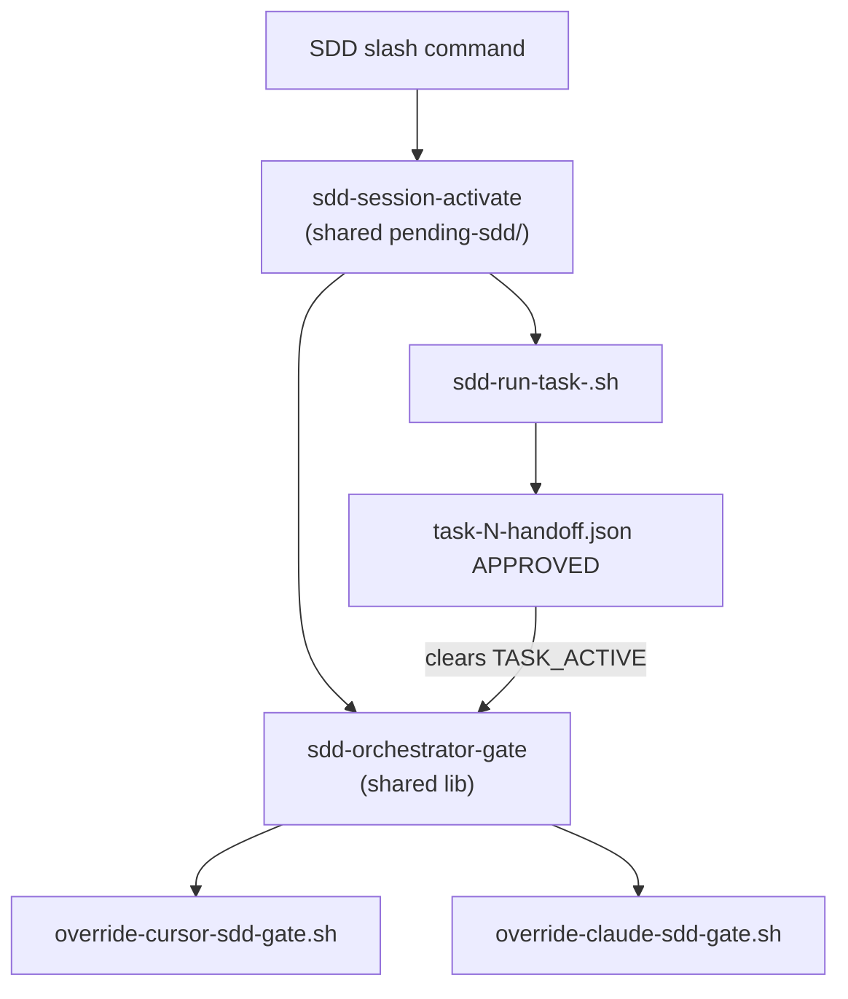

# SDD Token 效率 — Phase p1-slim.2：SDD orchestrator 通用 gate

- **Version**: v1.0 · 2026-08-05
- **Status**: Draft
- **Author**: oscaner · Cursor Agent
- **Program**: [overall v2.2](2026-08-05-sdd-token-efficiency-overall.md) (inventory row at impl — see §3)
- **Phase ID**: p1-slim.2
- **Depends on**: [p1-slim.1](2026-08-05-sdd-slim-orchestrator-v2-design.md) @ `1e07bb8`

## §0 Incremental warning

> Phase p1-slim.2 increment only. Fixes dogfood failure where orchestrators skip H6 and edit repo inline. Does not change H6 four-mode semantics or template SOT.

## §1 Problem

p1-slim / p1-slim.1 assume **H6 CLI actually runs** on CLI-default path. Dogfood of p1-slim.1 violated every orchestrator invariant:

| Expected | Observed |
|----------|----------|
| H6 four-mode chain per task | Orchestrator direct `StrReplace` on repo |
| `task-N-handoff.json` APPROVED | No handoff files |
| per-task review + test-evidence | Ledger: `inline review` |
| Rule 0a pointer-only + templates SOT | Same session skipped templates entirely |

Pointer-only Rule 0a (p1-slim.1) **removed** the nested orchestrator checklist without adding machine enforcement → **discipline vacuum** when the model skips H6.

## Goal

**Cross-harness (Cursor + Claude Code) PreToolUse gate** + compact skill checklist fallback, so active SDD tasks **cannot** mutate repo deliverables from the orchestrator session; repo changes flow **only** through `sdd-run-task-*.sh` H6 subprocesses.

## Constraints

- Plugin-bundled only — **no** consumer-project hook files
- **Same allowlist semantics** on Cursor and Claude Code
- spor-SDD remains **≤160 lines** after checklist restore (net trim elsewhere)
- **No** changes to upstream superpowers SDD
- **No** new slash-command skills (shared `lib/` + thin adapters OK)
- **No** `CURSOR-SMOKE.md` edits — smoke lives in phase spec §Smoke + CI scripts
- p0 in-session Task-tool path: hook **cannot** intercept — document as known gap (both harnesses)

## Design

### Architecture



### Shared core — `bin/lib/sdd-orchestrator-gate.sh`

**State file:** `$TMPDIR/oscaner-superpowers-overrides/pending-sdd/<session_key>.json`

**Schema:**

```json
{
  "trigger": "sdd-orchestrator",
  "detected_at": 1730000000,
  "repo_root": "/abs/repo",
  "workspace": "/abs/repo/.superpowers/sdd/<plan-basename>",
  "plan_path": "docs/superpowers/plans/....md",
  "active_task": 1
}
```

**State machine:**

| State | Condition | Gate |
|-------|-----------|------|
| INACTIVE | no pending-sdd / no ledger | allow all |
| ORCHESTRATING | pending exists, no TASK_BASE yet | allow workspace writes only |
| TASK_ACTIVE(N) | `task-N-brief.md` contains `TASK_BASE:` and no APPROVED handoff | **deny** non-workspace Write/Edit + non-allowlist Bash |
| TASK_COMPLETE(N) | `task-N-handoff.json` `status: APPROVED` | allow until next TASK_BASE |

**Frontier task detection:** scan workspace for lowest N where handoff missing or `status != APPROVED`.

**Allowlist (both harnesses):**

| Tool | Allow | Deny |
|------|-------|------|
| Write / Edit | `.superpowers/sdd/<plan-basename>/**` | all other repo paths |
| Bash / Shell | `*sdd-run-task-*`, `*sdd-workspace*`, `*task-brief*`, `*review-package*` | other commands during TASK_ACTIVE |
| Read | all | — |

**Deny message (identical prose; JSON envelope differs by harness):**

```
SDD orchestrator gate — direct repo edits forbidden during active task.
Run: {plugin_root}/bin/sdd-run-task-<harness>.sh --task N --mode implement
Allowed writes: .superpowers/sdd/<plan-basename>/ only.
See spor-SDD Rule 0a item 4.
```

**Fail-open:** no jq, no pending, cannot resolve workspace → allow (skill checklist fallback).

### Session activation — `bin/sdd-session-activate.sh`

**Session key:** same as penf — `conversation_id` ?? `session_id` ?? first 16 hex of `sha256(prompt)` (see `cross-harness-overrides.md`).

**Two-phase pending (lazy plan binding):**

| Phase | When | pending-sdd fields |
|-------|------|-------------------|
| **Minimal** | SDD slash detected | `trigger`, `detected_at`, `session_key`, `repo_root` |
| **Bound** | First successful `sdd-workspace PLAN` or ledger line `# SDD ledger — plan: …` | + `plan_path`, `workspace`, `active_task: null` |

Gate reads ledger header for `plan_path` / workspace when pending lacks them (reuse `_sdd_plan_from_ledger` pattern from `sdd-run-task-*.sh`).

**`/executing-plans`:** pending written on slash; plan binding deferred until redirect loads plan and orchestrator runs `sdd-workspace` — gate stays ORCHESTRATING (workspace-only writes) until bound.

Called when SDD orchestrator session starts:

| Harness | Trigger | Action |
|---------|---------|--------|
| **Claude Code** | `override-prompt-expansion.sh` SDD branch | `sdd-session-activate.sh minimal` + keep existing `additionalContext` |
| **Cursor** | `override-cursor-detect.sh` SDD slash branch | `sdd-session-activate.sh minimal` |

**SDD slash patterns:** `/subagent-driven-development`, `/spor-subagent-driven-development`, `/superpowers:subagent-driven-development`, `/executing-plans`.

**ORCHESTRATING gate (bound or unbound):** deny Write/Edit outside workspace once minimal pending exists; allow `git rev-parse`, `sdd-workspace`, `task-brief`, ledger/plan-constraints writes under workspace.

**Clear pending:** all plan tasks ledger-complete + final review marked done; or TTL 24h.

### Harness adapters

| File | Harness | Output |
|------|---------|--------|
| `bin/override-cursor-sdd-gate.sh` | Cursor `preToolUse` | `{permission:"deny"\|"allow", agent_message?: "..."}` |
| `bin/override-claude-sdd-gate.sh` | CC `PreToolUse` | `{hookSpecificOutput:{hookEventName:"PreToolUse", permissionDecision:"deny"\|"allow", permissionDecisionReason:"..."}}` |

Both source `bin/lib/sdd-orchestrator-gate.sh` — **no duplicated allowlist logic**.

### Hook registration

**Generator sources of truth (do not hand-edit emitted files):**

| Emitted | Generator |
|---------|-----------|
| `hooks/hooks-cursor.json` | `build/render-cursor-hooks.sh` |
| `bin/override-cursor-detect.sh` | `build/render-cursor-hooks.sh` |
| `hooks/hooks.json` | `build/render-claude-hooks.sh` |

**`build/render-cursor-hooks.sh`** — append second `preToolUse` entry → `./bin/override-cursor-sdd-gate.sh`; extend generated detect script with SDD slash branch calling `sdd-session-activate.sh`.

**`build/render-claude-hooks.sh`** — append `PreToolUse` matchers (`Write|Edit`, `Bash`) → `override-claude-sdd-gate.sh`.

Run `pnpm run generate:overrides` after generator edits.

Update `docs/cross-harness-overrides.md` SDD gate section (not CURSOR-SMOKE).

Update `tests/validate-overrides-build.sh` — assert `preToolUse` has **two** entries (attach enforce + sdd gate).

### spor-SDD skill — Rule 0a item 4 (compact checklist)

Insert after item 3 (pointers). Rule 0a becomes **4 items** (supersedes p1-slim.1 AC#7 «exactly 3 numbered items»). Trim Rule 1 batching table, Rule 7 items, Red Flags to hold **≤160 lines**.

**Line budget (current 157 lines):**

| Δ | Lines |
|---|-------|
| + item 4 checklist | +~12 |
| + Rule 5a hook line + 3 Red Flags | +~4 |
| − Rule 1 batching table → prose | −~5 |
| − Rule 7 merge items | −~2 |
| − Common Rationalizations ×2 | −~2 |
| **Target** | **≤160** |

**Item 4 text:**

```markdown
4. **Orchestrator checklist (compact — mandatory when Rule 0a applies):**

   **Setup (once):** `sdd-workspace` → ledger → read plan once → `plan-constraints.md` → pre-flight → todo per task.

   **Per-task:** Rule 1 classify → Rule 4 confirm once → append `TASK_BASE: <sha>` to brief → shell H6 chain (implement → handoff/implement → review → handoff/review; fix per Rule 2) → Read handoff.json only → Rule 5a + Rule 6 → ledger on APPROVED. **Never** edit repo deliverables in this session — H6 CLI only.

   **Final:** `requesting-code-review` whole-branch in-session → clean → `finishing-a-development-branch`.
```

**Rule 5a** add: `PreToolUse gate denies non-workspace writes during TASK_ACTIVE (both harnesses).`

**New Red Flags:**

- `"Hook will block me — I'll edit repo files before TASK_BASE / outside H6."`
- `"Task is markdown-only — skip H6 and handoff.json."`
- `"I'll mark ledger complete with inline review."`

### Dogfood

**Synthetic plan:** `docs/superpowers/plans/2026-08-05-sdd-dogfood-synthetic.md` (2 tasks, workspace-only scratch deliverables).

**Manual E2E (ship gate — both harnesses):**

| Harness | Required |
|---------|----------|
| Cursor | full H6 × 2 tasks + hook deny ≥1 Write |
| Claude Code | full H6 × 2 tasks + hook deny ≥1 Write or Bash |

**Artifacts per task:** `handoff.json` APPROVED, `test-evidence.json`, `report.md`; ledger **no** `inline`.

**Optional:** re-run p1-slim.1 plan (not blocking).

**CI (regression):**

- `tests/override-cursor-sdd-gate.test.sh`
- `tests/override-claude-sdd-gate.test.sh`
- `tests/sdd-cli-dry-run-smoke.sh` → wired in `scripts/ci-validate.sh`

### Known limitations

1. CC `PreToolUse` historical bugs on some tools — primary matcher `Write|Edit`; Bash supplementary; tests lock JSON shape.
2. p0 Task-tool implementer: hook does not intercept subagent Write — skill + handoff audit only.
3. Hook fail-open without jq — same as penf.

## File map

| File | Action |
|------|--------|
| `bin/lib/sdd-orchestrator-gate.sh` | **Create** — shared allowlist + state |
| `bin/sdd-session-activate.sh` | **Create** — pending-sdd writer |
| `bin/override-cursor-sdd-gate.sh` | **Create** — Cursor adapter |
| `bin/override-claude-sdd-gate.sh` | **Create** — Claude adapter |
| `bin/override-prompt-expansion.sh` | **Modify** — SDD branch calls activate |
| `build/render-cursor-hooks.sh` | **Modify** — SDD slash detect + second preToolUse |
| `build/render-claude-hooks.sh` | **Modify** — emit PreToolUse |
| `hooks/hooks-cursor.json` | **Regenerate** (via generator) |
| `bin/override-cursor-detect.sh` | **Regenerate** (via generator) |
| `hooks/hooks.json` | **Regenerate** |
| `skills/spor-subagent-driven-development/SKILL.md` | **Modify** — Rule 0a item 4 + trims |
| `docs/cross-harness-overrides.md` | **Modify** — SDD gate section |
| `tests/*.sh` (3 new) | **Create** |
| `tests/validate-overrides-build.sh` | **Modify** — dual preToolUse assert |
| `scripts/ci-validate.sh` | **Modify** — wire smoke |
| `docs/superpowers/plans/2026-08-05-sdd-dogfood-synthetic.md` | **Create** |
| `docs/superpowers/specs/2026-08-05-sdd-token-efficiency-overall.md` | **Modify** — p1-slim.2 inventory row |

## Acceptance criteria

1. Shared gate lib single-sourced; cursor + claude adapters ≤50 lines each (excluding lib)
2. SDD slash → `pending-sdd` minimal file exists (both harnesses — test fixtures)
3. ORCHESTRATING (pending, no TASK_BASE): Write to `plugins/**` denied; `git rev-parse` / `sdd-workspace` Bash allowed
4. TASK_ACTIVE: Write to `plugins/**` denied on **both** harnesses; workspace writes allowed
5. `sdd-run-task-cursor.sh` / `sdd-run-task-claude.sh` Bash allowed during TASK_ACTIVE
6. spor-SDD `wc -l` ≤ 160; Rule 0a has **4** items (supersedes p1-slim.1 «3 items» AC)
7. `pnpm run validate` exit 0 including new tests + dual preToolUse assert
8. Manual E2E pass recorded in §Smoke results (Cursor + Claude Code rows)
9. No edits to `CURSOR-SMOKE.md`

## §3 Deviations from overall

| Overall assumption | Phase decision | Overall updated? |
|---|---|---|
| p1-slim.1 complete | dogfood exposed skip-H6 failure | **Yes** — p1-slim.2 row added |

## Non-goals

- Lazy-load p0 to separate skill
- Machine-enforce p0 Task-tool implementer path
- Change H6 template bodies or four-mode order
- CURSOR-SMOKE.md maintenance

## §Smoke results

| # | Scenario | Cursor | Claude Code | Date |
|---|----------|--------|-------------|------|
| 1 | Synthetic plan H6 E2E | Pending | Pending | |
| 2 | Hook deny on direct Write | Pending | Pending | |

## Grilling record

| # | Decision | Choice |
|---|----------|--------|
| 1 | Scope | D — enforcement + skill + dogfood |
| 2 | Enforcement depth | D — hook + skill dual fallback |
| 3 | Checklist budget | A — compact ~17 lines, stay ≤160 |
| 4 | Dogfood | C — synthetic E2E both harnesses + CI dry-run; no CURSOR-SMOKE |
| 5 | Phase ID | A — p1-slim.2 |
| 6 | Hook layout | A — separate sdd-gate script + detect extension |
| 7 | Allowlist | C — workspace only; H6 for all repo deliverables |
| 8 | Harness parity | Universal PreToolUse gate (not Cursor-only) |

User design approval: pending spec review.
