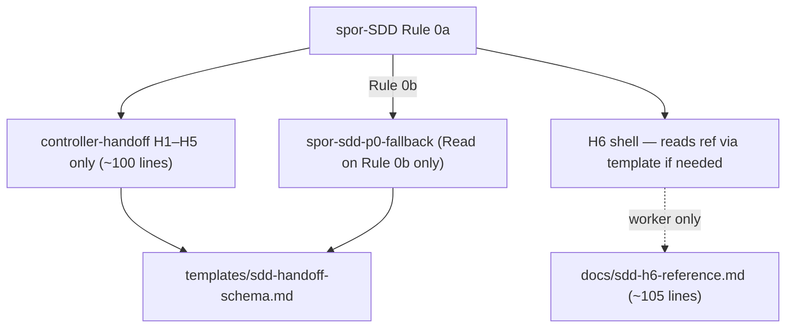

# SDD Token 效率 — Phase p1-slim.3：Orchestrator load footprint 瘦身

- **Version**: v1.0 · 2026-08-05
- **Status**: Draft
- **Author**: oscaner · Cursor Agent
- **Program**: [overall v2.3](2026-08-05-sdd-token-efficiency-overall.md) (inventory row at impl — see §3)
- **Phase ID**: p1-slim.3
- **Depends on**: [p1-slim.2](2026-08-05-sdd-slim-orchestrator-p1-slim-2-design.md) @ HEAD

## §0 Incremental warning

> Phase p1-slim.3 increment only. Reduces **orchestrator load-time footprint** for CLI-default SDD; does not change H6 four-mode semantics, PreToolUse gate behavior, or final whole-branch review placement.

## §1 Problem

p1-slim / p1-slim.1 / p1-slim.2 optimized **runtime** token (CLI workers, upstream SDD ban, machine gate). CLI-default orchestrator still loads a **~496-line effective footprint** on SDD trigger:

| File | Lines | Loaded when |
|------|-------|-------------|
| `spor-subagent-driven-development/SKILL.md` | 157 | SDD slash / redirect |
| `spor-token-efficient-controller-handoff/SKILL.md` | 205 | cited H1–H8 from spor-SDD |
| `spor-subagent-lifecycle/SKILL.md` | 49 | cited from multiple rules |
| `spor-token-efficient-review-dispatch/SKILL.md` | 85 | cited (p0 review; D4) |
| **Total cited chain** | **~496** | orchestrator session |

Additional waste on CLI-default (主路径):

1. **p0 fallback Rules 3/5b/5c** (~25 lines) — guarded `skip` but still in spor-SDD file body.
2. **H6–H8 CLI contract** (~105 lines in controller-handoff) — orchestrator shells H6; detailed env/exit/harness tables are reference material, not gate decisions.
3. **handoff.json schema duplicated** — ~50 lines in `spor-handoff-writer` + cross-refs in controller-handoff H4/H5; maintenance drift risk, not orchestrator load, but blocks further slimming.

## Goal

Reduce **CLI-default orchestrator load footprint** to **≤350 lines** (sum of spor-SDD + slim controller-handoff + cited cross-cutting skills if injected on SDD trigger) by:

1. Splitting controller-handoff into orchestrator-mandatory **H1–H5** vs CLI reference **H6–H8**.
2. Lazy-loading p0 fallback rules into **`spor-sdd-p0-fallback`** (on disk under `skills/`; body Read only on Rule 0b — not an override slash target).
3. Single-sourcing handoff.json schema for writer + references.
4. Trimming **review-dispatch Rule D4** to a one-line pointer (D4 runs in CLI review subprocess on default path; full D4 prose moves to `spor-sdd-p0-fallback` or `docs/sdd-h6-reference.md` §review).

**Success metrics (two tiers):**

| Tier | Scope | Target |
|------|-------|--------|
| **1 — mandatory** | spor-SDD + slim controller-handoff | ≤ **225** lines |
| **2 — full cited chain** | Tier 1 + lifecycle + slim review-dispatch | ≤ **350** lines |

## Constraints

- **No** new override slash target (`overrides.manifest.json` row for p0-fallback)
- p0-fallback **may** live under `skills/` (plugin.json globs `./skills/`) — lazy-load = **Read body only on Rule 0b**, not absence from disk
- **No** changes to upstream superpowers SDD
- **No** CLI final whole-branch review (program invariant)
- **No** deletion of Red Flags / Common Rationalizations in spor-SDD (p1-slim.2 lesson)
- **No** mattpocock delegate changes (tdd/code-review/grilling already SOT)
- spor-SDD stays **≤160 lines** after p0 extraction
- PreToolUse gate + Rule 0a item 4 compact checklist **unchanged** semantically

## Design

### Architecture



### 2.1 Split `spor-token-efficient-controller-handoff`

**Keep in SKILL.md (H1–H5 — orchestrator mandatory):**

| Rule | Content | Approx lines |
|------|---------|--------------|
| H1 | Four-line return contract | ~15 |
| H2 | Orchestrator Read bans + degradation note | ~20 |
| H3 | Ledger-only memory | ~10 |
| H4 | Fix loop cap + open-findings paths | ~25 |
| H5 | handoff-writer mandatory + cite schema path | ~15 |
| Header + Red Flags (trimmed) | | ~15 |
| **Target total** | | **~100** |

**Move to `plugins/superpowers-overrides/docs/sdd-h6-reference.md` (new):**

- H6 four-mode table + typical shell sequence
- Env contract table (`SDD_WORKSPACE`, `SDD_MODE`, …)
- Workspace path contract
- Batching filename conventions
- Exit codes (0/1/2)
- H7 plugin-bundled script constraint
- H8 opt-in/opt-out + harness mapping table
- Mode B `sdd-run-plan-*.sh` summary

**SKILL.md H6–H8 replacement (one block):**

```markdown
### Rule H6–H8 — CLI dispatch (reference)

Orchestrator: shell `sdd-run-task-<harness>.sh` per spor-SDD Rule 7; **do not** paraphrase env/exit/harness details — Read `{plugin_root}/docs/sdd-h6-reference.md` once per session if needed.

Worker discipline SOT remains `templates/sdd-cli/{implement,handoff,review,fix}.md`.
```

**spor-SDD Rule 7** — cite `H1–H5`; for H6–H8 shell details cite `docs/sdd-h6-reference.md` (not full controller-handoff H6 block).

**spor-SDD Rule 0a item 3** — update orchestrator pointer line: replace `controller-handoff H6–H8` with `Rule 7 + docs/sdd-h6-reference.md`; worker SOT unchanged.

**spor-executing-plans** — grep for H6–H8 cites; **no change expected** (router-only post p1-slim). Modify only if grep hits.

### 2.2 Lazy-load p0 fallback — `spor-sdd-p0-fallback`

**New file:** `plugins/superpowers-overrides/skills/spor-sdd-p0-fallback/SKILL.md`

**Registration:**

| Registry | Entry? | Notes |
|----------|--------|-------|
| `overrides.manifest.json` | **No** | Not an override slash target |
| `skills/` on disk | **Yes** | `./skills/` glob discovers dir; OK |
| Lazy-load contract | Rule 0b Read only | CLI-default never Read this body |

**Contents (move from spor-SDD):**

- Rule 3 — TDD delegate (full p0 text)
- Rule 5b — in-session implementer dispatch
- Rule 5c — in-session per-task review (include D4 full text moved from review-dispatch)
- p0-specific Red Flags (subset currently in spor-SDD)

**spor-SDD changes:**

**Rule 0b revised (replaces items 2–4):**

1. Triggers when Rule 7 item 2 applies (unchanged).
2. **Then** Read upstream `subagent-driven-development` skill body (unchanged order vs current spor-SDD).
3. Announce: `CLI unavailable — falling back to p0 in-session SDD.` (unchanged).
4. Read `{plugin_root}/skills/spor-sdd-p0-fallback/SKILL.md`; Rules 3, 5b, 5c SOT lives there — not in spor-SDD.
5. Per-task commit: Rule 5b commit paragraph in p0-fallback skill (unchanged semantics).

**Delete from spor-SDD:** Rule 3, Rule 5b, Rule 5c bodies; replace Rule 5 header with Rule 5a only (or keep `Rule 5 — Per-task review` with 5a only, renumber optional).

**Line budget spor-SDD:** 157 − ~40 (p0 rules) + ~8 (Rule 0b pointer) ≈ **125 lines** (under 160 cap).

### 2.3 Handoff schema single source

**New file:** `plugins/superpowers-overrides/templates/sdd-handoff-schema.md`

Contains:

- Single-task JSON example
- Batch JSON example
- Field semantics (`commits.base` alignment table)
- Status by segment table
- `findings[]` / `unverifiable[]` / `plan_conflicts[]` definitions

**Update:**

| File | Change |
|------|--------|
| `spor-handoff-writer/SKILL.md` | Replace inline schema (~50 lines) with cite + segment I/O tables only |
| `controller-handoff` H4/H5 | Cite schema path instead of repeating open-findings shape |
| `templates/sdd-cli/handoff.md` | One-line cite to schema if needed |

**Target handoff-writer:** ~131 → **~80 lines**.

### 2.4 Trim `spor-token-efficient-review-dispatch` D4 (CLI-default path)

Move **D4 — code-review dual-axis gate** full prose (~20 lines) to `spor-sdd-p0-fallback` Rule 5c appendix (p0 in-session review uses D4).

Replace in review-dispatch with:

```markdown
### D4 — code-review dual-axis gate (p0 only)

When SDD per-task review runs in-session (Rule 0b), see `spor-sdd-p0-fallback` Rule 5c. CLI-default path: D4 runs inside H6 `review` subprocess — orchestrator does not load D4 prose.
```

**Target review-dispatch:** ~85 → **~65 lines**.

### 2.5 Unchanged

- PreToolUse gate (`bin/lib/sdd-orchestrator-gate.sh`, hooks)
- spor-SDD Rule 0a item 4 compact checklist
- `templates/sdd-cli/*.md` worker prompts
- `bin/sdd-run-task-*.sh` behavior
- Red Flags / Rationalizations count in spor-SDD (may trim only if p0 move frees budget — do not delete rows)

### 2.6 Line budget (orchestrator load)

| Artifact | Before | After | Δ |
|----------|--------|-------|---|
| spor-SDD | 157 | ~125 | −32 |
| controller-handoff | 205 | ~100 | −105 |
| review-dispatch | 85 | ~65 | −20 |
| subagent-lifecycle | 49 | 49 | 0 |
| spor-sdd-p0-fallback | 0 | ~65 | 0 on CLI* |
| sdd-h6-reference.md | 0 | ~105 | 0 on orchestrator** |
| **Tier 1 sum** | **362** | **~225** | **−137** |
| **Tier 2 sum (cited chain)** | **496** | **~339** | **−157** |

\* p0-fallback not Read on Rule 0a.  
\*\* optional Read once per session; not part of Tier 2 sum.  
Tier 2 = spor-SDD + slim controller-handoff + lifecycle + slim review-dispatch.

## File map

| File | Action |
|------|--------|
| `docs/sdd-h6-reference.md` | **Create** — H6–H8 moved from controller-handoff |
| `skills/spor-sdd-p0-fallback/SKILL.md` | **Create** — p0 Rules 3/5b/5c |
| `templates/sdd-handoff-schema.md` | **Create** — schema SOT |
| `skills/spor-token-efficient-controller-handoff/SKILL.md` | **Modify** — H1–H5 only + H6–H8 pointer |
| `skills/spor-subagent-driven-development/SKILL.md` | **Modify** — remove p0 inline rules; Rule 0b pointer |
| `skills/spor-handoff-writer/SKILL.md` | **Modify** — schema cite |
| `skills/spor-token-efficient-review-dispatch/SKILL.md` | **Modify** — D4 pointer-only |
| `skills/spor-executing-plans/SKILL.md` | **Verify grep only** — modify if H6 cite found |
| `docs/cross-harness-overrides.md` | **Modify** — note reference doc |
| `docs/superpowers/specs/2026-08-05-sdd-token-efficiency-overall.md` | **Modify** — p1-slim.3 inventory row |
| `tests/validate-overrides-build.sh` | **Modify** — assert p0-fallback dir exists; optional line-count assert |

## Acceptance criteria

1. `wc -l` spor-SDD ≤ 160; no Rule 3/5b/5c bodies in spor-SDD (pointer + p0-fallback file only)
2. `wc -l` controller-handoff ≤ 110; H6 env/exit/harness tables live only in `docs/sdd-h6-reference.md`
3. **Tier 1:** `wc -l` spor-SDD + controller-handoff ≤ **225**
4. **Tier 2:** `wc -l` spor-SDD + controller-handoff + subagent-lifecycle + review-dispatch ≤ **350**
5. p0 smoke: `SDD_NO_CLI=1` → Read upstream SDD → announce → Read p0-fallback → in-session dispatch works (order matches Rule 0b items 2–4)
6. CLI-default smoke: H6 chain + handoff APPROVED unchanged from p1-slim.2 dogfood synthetic plan
7. `pnpm run validate` exit 0
8. Grep: handoff.json schema JSON examples appear in **one** file (`templates/sdd-handoff-schema.md`)
9. `spor-sdd-p0-fallback` **absent** from `overrides.manifest.json` targets[]
10. review-dispatch: no full D4 enumeration (pointer + p0-fallback holds full D4)

## §3 Deviations from overall

| Overall assumption | Phase decision | Overall updated? |
|---|---|---|
| p1-slim.2 complete | p1-slim.3 targets load footprint ≤350 | **Yes** — inventory row at impl |

## Non-goals

- Register p0-fallback as override slash command
- Trim brainstorming / writing-plans overrides

## §Smoke results

| # | Scenario | Pass? | Date |
|---|----------|-------|------|
| 1 | Tier 1: spor-SDD + controller-handoff ≤ 225 lines | Pass | 2026-08-06 |
| 1b | Tier 2: + lifecycle + review-dispatch ≤ 350 lines | Pass | 2026-08-06 |
| 2 | p0: SDD_NO_CLI=1 + p0-fallback Read | Pass | 2026-08-06 |
| 3 | H6 synthetic plan E2E (regression) | Pass | 2026-08-06 |
| 4 | `pnpm run validate` | Pass | 2026-08-06 |

## Grilling record

| # | Decision | Choice |
|---|----------|--------|
| 1 | Primary metric | B — total orchestrator load footprint |
| 2 | controller-handoff split | H1–H5 in skill; H6–H8 to reference doc |
| 3 | p0 lazy-load | Filesystem skill, no manifest |
| 4 | Schema | Single markdown SOT |
| 5 | Phase ID | p1-slim.3 |

User design approval: 2026-08-05 (conversation "ok").
