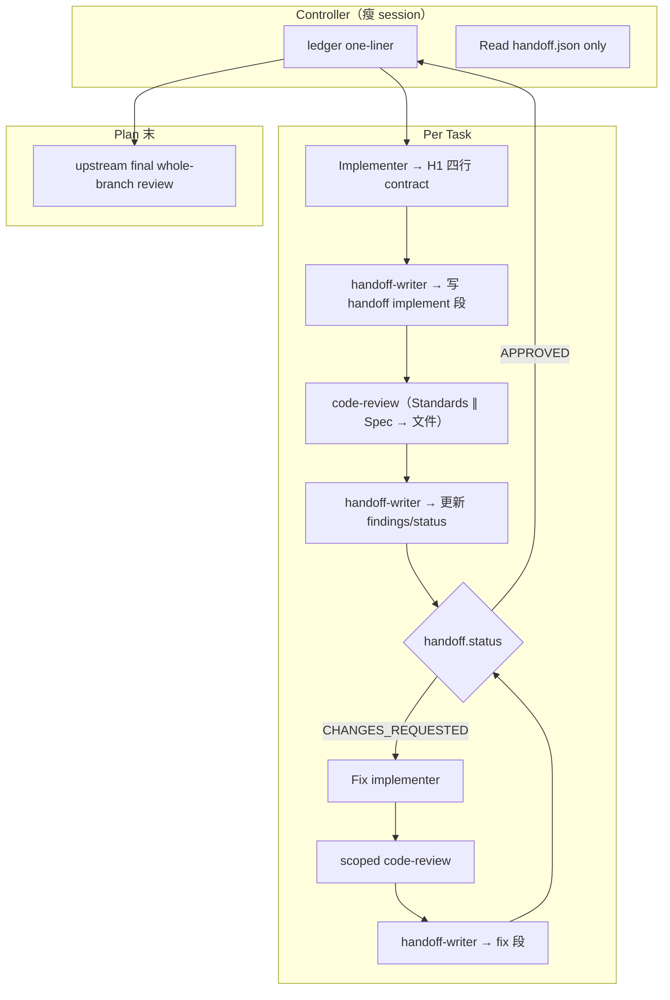

# SDD Token 效率 — Phase p0：Handoff + Lean Review

- **Version**: v1.3.1 · 2026-08-05
- **Status**: Shipped (impl @ feat/sdd, pending release)
- **Author**: kang · Cursor Agent
- **Program**: [overall v2.0](2026-08-05-sdd-token-efficiency-overall.md)
- **Phase ID**: p0
- **Depends on**: [penf ship](2026-08-05-sdd-token-efficiency-penf-design.md) @ `6.2.0-overrides.12`（**已满足**）；p0 impl 可与 pack-sp 并行，无 pack 硬依赖

## §0 Incremental warning

> Phase p0 increment only. Cross-phase conventions in [overall](2026-08-05-sdd-token-efficiency-overall.md); overall wins on conflict.

## §1 Constraints pointer

> Does not repeat overall program constraints. Overall wins on conflict. Scope: **`superpowers-overrides` only**；不改 upstream superpowers SDD 脚本；**保留** final whole-branch review。

## Goal

在**不依赖 CLI 新能力**（→ p1）的前提下，用 overrides 解决痛点 A+B：

- **A** — Orchestrator session 膨胀 → 新 cross-cutting `spor-token-efficient-controller-handoff`（H1–H5）
- **B** — Per-task review token 过高 → 全替换为 `mattpocock-skills:code-review` + 独立 `spor-handoff-writer`；orchestrator **不读** review prose

## Architecture



Plan 末仍走 upstream final whole-branch review（program invariant）。

### Per-task 序列

1. **Implementer**（`mattpocock-skills:tdd`）完成 → 写 `task-N-report.md`（含 test stdout 全文）与 **`task-N-test-evidence.json`**（结构化字段，见 §2.4）→ 返回 **H1 四行**；**不写** handoff JSON。
2. **Orchestrator** dispatch **fresh** `spor-handoff-writer` → 从 contract + artifact 路径写 `task-N-handoff.json`（`phase: implement`）→ 返回四行。
3. **Orchestrator** 跑 `review-package` **shell**（stdout 仅保留一行路径；**不 Read** diff 文件）。
4. **Orchestrator** dispatch **code-review**（自适应 diff，见 §2.3）→ 双轴 subagent 各写报告文件；orchestrator **不** aggregate prose。
5. **Orchestrator** dispatch **fresh** `spor-handoff-writer` → 读报告文件 + handoff → 更新 `findings` / `status` / `unverifiable` / `plan_conflicts` → 返回四行。
6. **Orchestrator** 只 **Read** 更新后的 `handoff.json`。
7. `plan_conflicts` 非空 → **STOP**，呈现 plan/brief vs finding，**等人裁决**后再 fix / park。
8. `CHANGES_REQUESTED` → fix loop（H4）：fix implementer → scoped code-review → fresh handoff-writer。

Workspace 路径（upstream `scripts/sdd-workspace`）：

```
<repo-root>/.superpowers/sdd/<plan-basename>/
```

## §2 Design body

### 2.1 新建 Skills

| Skill | 职责 |
|-------|------|
| **`spor-token-efficient-controller-handoff`** | H1–H5 cross-cutting；被 SDD + executing-plans **cite**；无 slash command |
| **`spor-handoff-writer`** | 独立 skill；structured 提取 → 写/更新 `handoff.json`；D3 findings-only；便宜模型 |

#### H1–H5（`spor-token-efficient-controller-handoff`）

| Rule | 名称 | 要求 |
|------|------|------|
| **H1** | 文件-only 返回契约 | Subagent 返回 orchestrator **恰好 4 行**（固定键，一行一键）：<br>`status: <DONE\|BLOCKED>`<br>`commits: base=<sha> head=<sha>`<br>`artifacts: brief=<path> report=<path> test_evidence=<path>`<br>`blocker: <none\|one-line>`<br>Report、review prose、diff 全文**只写文件**。 |
| **H2** | Orchestrator 禁读全文 | Orchestrator **禁止** Read report、review-package 正文、review 轴报告全文；**允许** Read `task-N-handoff.json` 或 `batch-<first>-<last>-handoff.json`（仅 JSON）。**允许**跑 shell 且只保留 stdout 一行路径。 |
| **H3** | Ledger-only 记忆 | Task 完成后 orchestrator 可引用 = ledger 一行 + 下一 task brief 指针。**禁止** paste 前序 task 摘要进 dispatch（upstream SDD L223 hard enforce）。 |
| **H4** | Fix loop 增量 | Re-review：code-review 只看 `FIX_BASE..HEAD`；handoff-writer 输入 += open-findings 文件（单 task：`task-N-open-findings.json`；batch：`batch-<first>-<last>-open-findings.json`）；review writer 在 `CHANGES_REQUESTED` 时从 handoff `findings` 写出（完整 D3 schema）。Orchestrator 不读 fix 叙述。**Fix round cap：每 task 最多 5 轮**（含首次 review 后的 fix 循环；超限 → STOP 请人）。 |
| **H5** | Handoff-writer subagent | Review 聚合 **必须** dispatch **fresh** [`spor-handoff-writer`](../plugins/superpowers-overrides/skills/spor-handoff-writer/SKILL.md)（[`spor-subagent-lifecycle`](../plugins/superpowers-overrides/skills/spor-subagent-lifecycle/SKILL.md) Rule 2）；输入仅为文件路径列表；**禁止** orchestrator 自行合并 Standards/Spec prose。模板：`templates/sdd-handoff-writer-prompt.md`。模型：便宜档（Composer / Claude 最低可用）— 只做结构化提取。 |

Implement 段与 review 段各 dispatch **一次** fresh handoff-writer（共两次 routine path；fix 段第三次）。

#### `spor-handoff-writer`（独立 skill）

- **输入**（路径 only）：implementer contract 和/或 `handoff.json`、`<workspace>/task-N-test-evidence.json`（implement 段）、review 报告路径、brief 路径、open-findings 路径（fix 时）
- **输出**：写/更新 `handoff.json`；**status 按 §2.4 生命周期表**（implement writer → `DONE|BLOCKED`；review/fix writer → `APPROVED|CHANGES_REQUESTED|NEEDS_CONTEXT|BLOCKED`）；填充 `findings` / `unverifiable` / `plan_conflicts`
- **禁止**：向 orchestrator 返回 review 原文；返回遵循 H1 四行契约
- **D3**：writer 向 orchestrator 的输出不含叙述性 prose（只写 JSON 文件 + 四行）

### 2.2 Review 报告文件（code-review 变体）

| 文件 | 写入者 |
|------|--------|
| `<workspace>/task-N-review-standards.md` | Standards subagent |
| `<workspace>/task-N-review-spec.md` | Spec subagent |

Dispatch code-review 时 brief 末尾追加：「全文写入上述路径，stdout 仅返回 `WRITTEN: <path>`」。Orchestrator **override upstream Step 5 aggregate** — 不合并 prose。

**review-package 与 code-review 关系：** `review-package` shell 将 diff **归档**到 `artifacts.diff` 供 handoff-writer 引用；code-review subagent **自行** `git diff <fixed-point>...HEAD`（与 review-package 范围一致）。Orchestrator **不 Read** 任一 diff 正文。

Fix loop scoped review **覆盖写**同路径（batch 时用 `batch-*-review-*.md`）。

### 2.3 自适应 diff scope（Q7）

Simple/Complex 分类**保留**（Rule 1），用于 diff scope、test gate、implementer 模型 — **不**改变 review 链（一律 code-review + handoff-writer）。

| 分类 | code-review fixed point | `review_scope` 字段 |
|------|-------------------------|---------------------|
| **Simple** | `TASK_BASE..HEAD` | `"task"` |
| **Complex** | `PLAN_BASE..HEAD` | `"plan"` |
| **Batch**（多 Simple 合并） | 首 task `BASE` → 末 task `HEAD` | `"batch"` |

`PLAN_BASE` = plan 执行起始 commit。`TASK_BASE` = 该 task 开始前 SHA。`FIX_BASE` = fix dispatch 前 `HEAD`（通常 = 上一轮 handoff `commits.head`）。`FIRST_TASK_BASE` = batch 内首 task 的 `TASK_BASE`。

**`commits.base` 与 `review_scope` 对齐：**

| review_scope | commits.base |
|--------------|--------------|
| `task` | `TASK_BASE` |
| `plan` | `PLAN_BASE` |
| `batch` | `FIRST_TASK_BASE` |

**Batching**（grilling 定论，与 v1.2 一致）：

| 项 | 约定 |
|----|------|
| Handoff 文件 | **一份** `batch-<first>-<last>-handoff.json` |
| Review | **一次** code-review + **一次** handoff-writer（review 段） |
| Ledger | 仍 **逐 task** complete 行 |
| Schema | batch 用 `tasks: [2,3,4]`、`complexity: "batch"`；单 task 用 `task: N` |
| Test gate | batch 内 **任一** task 触发硬 gate（Complex / 行为变更）→ 整批硬 gate；否则软 gate |

### 2.4 `handoff.json` schema

路径：`<sdd-workspace>/task-N-handoff.json`（batch：`<sdd-workspace>/batch-<first>-<last>-handoff.json`）— **单文件**，implement → review → fix **就地更新**（p1 CLI 复用）。

**单 task 示例：**

```json
{
  "task": 2,
  "phase": "implement|review|fix",
  "status": "DONE|APPROVED|CHANGES_REQUESTED|BLOCKED|NEEDS_CONTEXT",
  "commits": { "base": "<TASK_BASE>", "head": "<HEAD>" },
  "complexity": "simple|complex|batch",
  "review_scope": "task|plan|batch",
  "artifacts": {
    "brief": ".superpowers/sdd/.../task-2-brief.md",
    "report": ".superpowers/sdd/.../task-2-report.md",
    "diff": ".superpowers/sdd/.../task-2-review-package.diff",
    "review_standards": ".../task-2-review-standards.md",
    "review_spec": ".../task-2-review-spec.md"
  },
  "test_evidence": {
    "command": "pnpm test src/foo.test.ts",
    "passed": true,
    "exit_code": 0,
    "warnings_count": 0
  },
  "findings": [],
  "unverifiable": [],
  "plan_conflicts": []
}
```

**Batch 变体**（与单 task **互斥**：有 `tasks[]` 则无 `task`；有 `task` 则无 `tasks[]`）：

```json
{
  "tasks": [2, 3, 4],
  "phase": "review",
  "status": "APPROVED",
  "commits": { "base": "<FIRST_TASK_BASE>", "head": "<LAST_HEAD>" },
  "complexity": "batch",
  "review_scope": "batch",
  "artifacts": { "...": "batch-2-4-* 命名" },
  "test_evidence": { "...": "..." },
  "findings": [],
  "unverifiable": [],
  "plan_conflicts": []
}
```

**`task-N-test-evidence.json`**（implementer 写出；handoff-writer implement 段读取）：

```json
{
  "command": "pnpm test src/foo.test.ts",
  "passed": true,
  "exit_code": 0,
  "warnings_count": 0,
  "behavior_change": false
}
```

**`task-N-open-findings.json`**（fix loop；review writer 在 `CHANGES_REQUESTED` 时从 handoff `findings` 写出；**完整 D3 schema**，与 handoff `findings[]` 同形）：

```json
{
  "findings": [
    { "lens": "Spec", "severity": "blocker", "file": "src/foo.ts", "line": 42, "summary": "...", "fix": "..." }
  ]
}
```

**Status 生命周期：**

| phase | 合法 status | orchestrator 动作 |
|-------|-------------|-------------------|
| implement | `DONE`, `BLOCKED` | `BLOCKED` → STOP；`DONE` → 进入 review 链 |
| review | `APPROVED`, `CHANGES_REQUESTED`, `NEEDS_CONTEXT`, `BLOCKED` | `APPROVED` → ledger；`CHANGES_REQUESTED` → fix loop；`NEEDS_CONTEXT` / `BLOCKED` → STOP 请人补 context / 裁决 |
| fix | `DONE`, `BLOCKED` | `DONE` → 再次 review writer |

`findings` 使用 D3 schema：`[{lens, severity, section|file, line?, summary, fix}]`。

**Approval 条件**：`status === "APPROVED"` 且 blocker 级 findings 为空；`unverifiable` 均已 resolve；`plan_conflicts` 为空或已人工裁决。

#### 分级 test evidence（Q8）

| 分类 | 要求 |
|------|------|
| **Simple** | `test_evidence` **软** — 缺字段时 writer 写 WARN finding（非 blocker）；code-review Standards 轴可补查 |
| **Complex** 或 **行为变更** | `command` / `passed` / `exit_code` **硬必填**；`passed: false` 或 `warnings_count > 0` → blocker finding |

**「行为变更」判定**（任一即硬 gate）：Rule 1 分类为 **Complex**；brief frontmatter `behavior_change: true`；或 `task-N-test-evidence.json` 中 `behavior_change: true`；或 Rule 3 TDD 豁免 **不适用**。

完整 test **stdout 全文**只进 `task-N-report.md`；handoff 的 `test_evidence` 来自 **`task-N-test-evidence.json`**（writer 复制字段，不 Read report）。

### 2.5 Changes to `spor-subagent-driven-development`

#### Rule 1 — 替换（删除 multi-pass reviewers）

| 旧 | 新 |
|----|-----|
| Simple: 1 轮 spec + 1 轮 quality | **1 次** code-review + **2 次** handoff-writer（implement + review 段） |
| Complex: 最多 3 轮 × 2 轴 | 同上 review 链；diff scope 为 plan-scoped（§2.3） |
| `task-reviewer-prompt.md` | 不 dispatch（降级路径除外） |

**保留**：Simple/Complex 分类表、Batching 规则 — 用于 diff scope、test gate、ledger、implementer 模型。

**移除**：Complex 6-pass 轮次表；「Reviewer subagents stay on default model」改为 **code-review 双轴**用 default model。

#### Rule 2 — Fix loop

Scoped code-review → fresh handoff-writer；**每 task fix round cap 5**（H4）；超限 STOP。

#### Rule 5 — Per-task review 委托（新）

1. Implementer → 写 report + test-evidence.json → H1 四行 contract。
2. Dispatch handoff-writer → 写 implement 段 handoff（读 test-evidence.json + brief）。
3. `review-package` shell（归档 diff）→ dispatch code-review 变体（§2.3 + §2.2；override Step 5）。
4. Dispatch handoff-writer → 更新 review 段。
5. Read `handoff.json` → `plan_conflicts` 非空 → STOP 等人。
6. `CHANGES_REQUESTED` → fix loop（H4）。

**code-review 输入映射：**

| code-review 输入 | SDD 来源 |
|------------------|----------|
| fixed point | §2.3 自适应 scope（subagent 自行 `git diff`） |
| spec | `task-N-brief.md` + plan Global Constraints 路径 |
| standards | repo standards + plan Global Constraints |
| Step 5 override | 双轴写 §2.2 文件；stdout `WRITTEN: <path>` only |

#### Rule 6 — 质量 invariant（新）

1. **Test evidence gate** — §2.4 分级规则；数据来自 `task-N-test-evidence.json`
2. **Plan-mandated conflicts** — writer 在 Spec 轴报告或 brief/plan 对比中发现 **deliberate plan/brief 违反**（非一般 bug）→ `plan_conflicts[]`（含 `plan_section`, `finding_summary`）；先问人再 fix
3. **Unverifiable** — 报告含 "cannot verify" / "unverifiable" → `unverifiable[]`（字符串列表）；**p0 简化：非空即 `BLOCKED`**，用户确认或补测后 writer 重跑清空

Rules 3（tdd）、4（cheap implementer）不变。

**Cite**：[`spor-token-efficient-controller-handoff`](../plugins/superpowers-overrides/skills/spor-token-efficient-controller-handoff/SKILL.md) H1–H5。

### 2.6 Changes to `spor-token-efficient-review-dispatch`

新增 **D4 — code-review 双轴 gate（p0 专用，非 multi-pass D1）**：

- Standards 与 Spec **各跑一轮**（并行）；**无** per-axis skip-later-passes 语义（与 brainstorming 3-pass 不同）。
- 两轴均完成后，handoff-writer **必须运行一次**（即使报告无 findings），写入 `APPROVED` 并扫描 `unverifiable` 关键字。
- code-review 变体：轴报告 Markdown 正文 + **末尾附录** `## Findings (D3)` JSON block（writer 解析此块；无 findings 则 `[]`）。

### 2.7 Changes to `spor-executing-plans`

**Rule 5（新，最小对齐）**：Rule 1 redirect 到 SDD 后，cite `spor-token-efficient-controller-handoff` H1–H5。**不** restructure batch/checkpoint。Inline fallback 不在 p0 范围。

### 2.8 Degradation

| 条件 | 行为 |
|------|------|
| `mattpocock-skills` **未安装** | **H1/H3/H5 仍强制**；review 降级 upstream `task-reviewer`；**无** handoff-writer；**H2 降级放宽** — orchestrator **允许** Read task-reviewer 返回（仅此路径）；**H4 不适用**（无 scoped code-review 变体）。首次 per-task review 前 warn 一次。 |
| plugin 已装但 `code-review` load 失败 | 问用户：等待修复 / 手动降级 / 暂停 |
| 无 bash / review-package | upstream 同等 fallback |
| Cursor / Claude Code | H1–H5 harness-neutral |

## §3 Deviations from overall

| Overall assumption | Phase decision | Overall updated? |
|---|---|---|
| Per-task review 委托 code-review（charter） | Q1：**全替换** spor Rule 1 multi-pass；无保留 reviewer 轮次 | N/A — aligned |
| p0 diff scope 未细化 | Q7：**自适应** Simple=task / Complex=plan | **Yes** — overall v2.0 |
| test evidence gate（program invariant #1） | Q8：**分级** Simple 软 / Complex+行为变更硬 | **Yes** — overall v2.0 |
| handoff-writer 在 H5 内 | Q9：**独立 skill** `spor-handoff-writer` | N/A — phase detail |
| penf 阻塞 p0 impl | penf **已 ship** @ `.12`；pack-sp @ `.13` | **Yes** — overall v2.0 |

## §4 Notes for downstream

- **p1** 复用 `handoff.json` schema 与 workspace 路径；CLI 内嵌 handoff-writer 逻辑（orchestrator 仍不读 prose）。
- impl plan 需补全 **量化基线**（overall success metrics 脚注 defer 项）。

## §5 Review

Rule 1 三轮 subagent review **已完成**；user review **Approved**；[plan](../plans/2026-08-05-sdd-token-efficiency-p0.md) + [tickets](../tickets/2026-08-05-sdd-token-efficiency-p0-tickets.md) published。Impl 待「开始 p0」。

## Grilling record（p0 shared understanding）

| # | 议题 | 决策 |
|---|------|------|
| Q1 | Per-task review | **A** — 全替换 `code-review`；删除 spor multi-pass reviewers |
| Q2 | Handoff 作者 | **A** — handoff-writer 写 JSON；implementer 只返回四行 contract |
| Q3 | Handoff 路径 | **A** — `.superpowers/sdd/<plan-basename>/` |
| Q4 | Fix loop | **A** — scoped 第二轮 code-review（`FIX_BASE..HEAD`） |
| Q5 | H1–H5 放置 | **A** — cross-cutting `spor-token-efficient-controller-handoff` |
| Q6 | executing-plans | **A** — 最小 cite + 纪律；不改 batch/checkpoint |
| Q7 | Diff scope | **C** — 自适应：Simple=task / Complex=plan / Batch=首 BASE→末 HEAD |
| Q8 | Test evidence | **C** — 分级：Simple 软 / Complex+行为变更硬 |
| Q9 | handoff-writer 打包 | **A** — 独立 skill `spor-handoff-writer` |
| Q10 | 旧 Rule 1 | **A** — 删除 reviewer 轮次；保留 Simple/Complex 给 diff/test/model |
| — | mattpocock 依赖 | **B** — 软依赖；未装则降级 upstream task-reviewer |
| — | handoff-writer 模型 | **A** — 便宜档 |
| — | test stdout | **A** — 结构化 `test_evidence` 进 handoff；stdout **全文**在 report |
| — | plan_conflicts | **A** — 先问人再 fix |
| — | Batching handoff | **A** — 一份 `batch-N-M-handoff.json` |

## Files to change

| 文件 | 动作 |
|------|------|
| `plugins/superpowers-overrides/skills/spor-token-efficient-controller-handoff/SKILL.md` | 新建（H1–H5） |
| `plugins/superpowers-overrides/skills/spor-handoff-writer/SKILL.md` | 新建 |
| `plugins/superpowers-overrides/templates/sdd-handoff-writer-prompt.md` | 新建 |
| `plugins/superpowers-overrides/skills/spor-token-efficient-review-dispatch/SKILL.md` | 加 D4 |
| `plugins/superpowers-overrides/skills/spor-subagent-driven-development/SKILL.md` | 替换 Rule 1；加 Rule 5/6；改 Rule 2 |
| `plugins/superpowers-overrides/skills/spor-executing-plans/SKILL.md` | 加 Rule 5 |
| `plugins/superpowers-overrides/.claude-plugin/plugin.json` | 注册新 skill 目录（directory discovery） |
| `README.md` / `README.zh-CN.md` | cross-cutting 表 |

## Verification

- `pnpm run validate` 通过
- plugin.json 三项检查通过
- 手工走读：10-task plan 下 orchestrator 不 Read report/diff/review 报告全文；只 Read handoff.json
- Simple vs Complex：diff scope 与 test gate 行为可区分
- handoff-writer 路径：双轴有 finding 时 orchestrator context 无 review prose

## Acceptance criteria

- [ ] H1–H5 写入 `spor-token-efficient-controller-handoff` 且被 SDD + executing-plans 引用
- [ ] `spor-handoff-writer` 独立 skill 存在且 H5 cite 它
- [ ] Rule 1 不再引用 6-pass 轮次表；Rule 5 含 code-review + handoff-writer 链
- [ ] `handoff.json` schema 含 `complexity` / `review_scope`；与 p1 overall shared artifacts 一致
- [ ] Q7 自适应 diff 与 Q8 分级 test gate documented 于 Rule 5/6
- [ ] handoff-writer 模板存在；D3 findings 输出进 JSON
- [ ] 降级路径 documented

## Out of scope (p0)

- CLI 物理清空 per task（→ p1）
- Final review 删除或模型档优化
- upstream superpowers 修改
- executing-plans inline fallback 的 handoff 链
