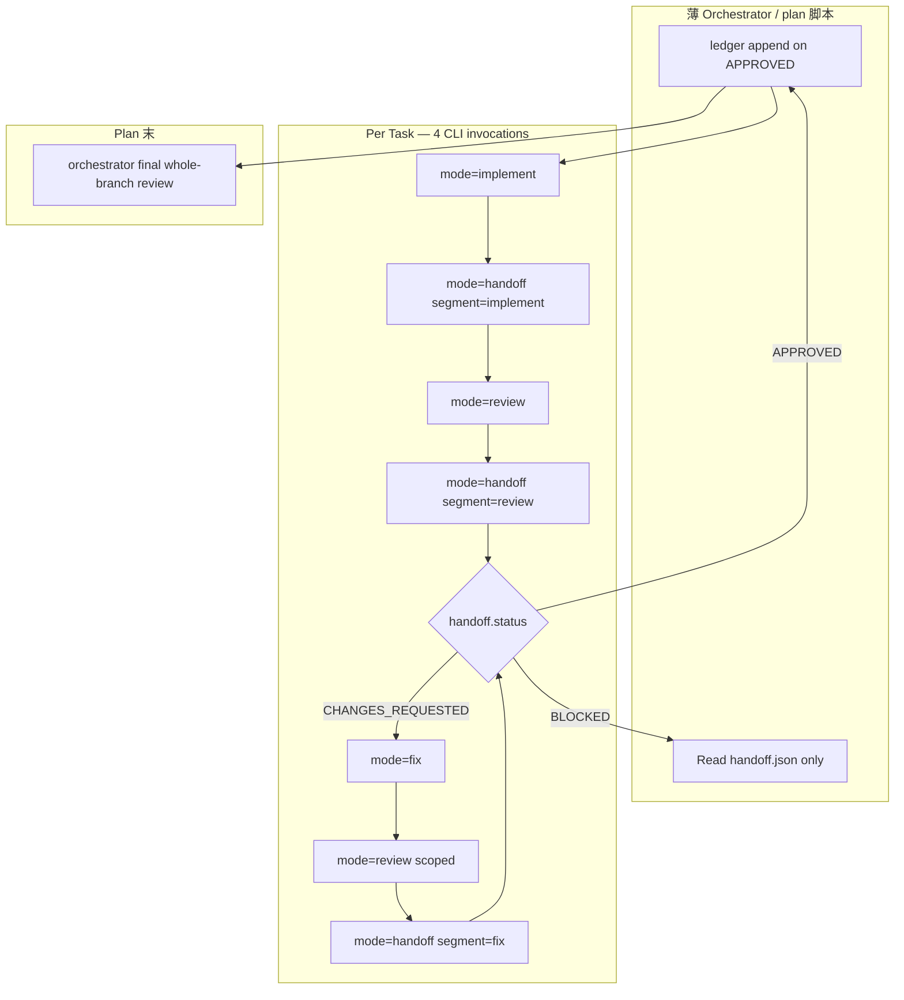

# SDD Token 效率 — Phase p1：CLI 物理清空

- **Version**: v1.2.1 · 2026-08-05
- **Status**: Shipped (impl @ feat/sdd, pending release)
- **Author**: kang · Cursor Agent
- **Program**: [overall v2.1](2026-08-05-sdd-token-efficiency-overall.md)
- **Phase ID**: p1
- **Depends on**: [p0 ship](2026-08-05-sdd-token-efficiency-p0-design.md) @ release tag（handoff schema + Rule 5/6 **冻结**后 impl）

## §0 Incremental warning

> Phase p1 increment only. Cross-phase conventions in [overall](2026-08-05-sdd-token-efficiency-overall.md); overall wins on conflict.

## §1 Constraints pointer

> Scope: **`superpowers-overrides` plugin-bundled CLI** + skill Rule 扩展。**不**改 upstream superpowers SDD 脚本；**不**改 p0 handoff schema；**保留** final whole-branch review（orchestrator in-session）。

## Goal

实现 Matt #173 **context cleared each time**：每个 task 在**独立 CLI agent invocation** 中执行 implement / handoff / review / fix，进程结束即销毁 context。Orchestrator session 只读 plan + ledger + `handoff.json`。

p0 的 H1–H5 **保留**；p1 追加 **H6–H8** 与 SDD **Rule 7**。

## Architecture



### 模式 A — 薄 Orchestrator（**默认**）

Chat session 读 plan/ledger/handoff，对每个 task shell 调用 `{plugin_root}/bin/sdd-run-task-<harness>.sh`。Orchestrator **从不**进入 CLI session 内部。

### 模式 B — plan 脚本（opt-in / AFK）

`{plugin_root}/bin/sdd-run-plan-<harness>.sh --plan <path>` 读 plan + ledger，对每个 **pending task** 调相同 4-mode 链。

**Pending 判定：** plan task N 在 ledger 无 `Task N: complete` 行，且对应 handoff 非 `APPROVED`（或 handoff 不存在）。Batch 块按 p0 §2.3 一次 dispatch 整个 batch 的 4-mode 链。

## §2 Design body

### 2.1 与 p0 的关系

| 维度 | p0 | p1 |
|------|----|----|
| 执行载体 | In-session Task/subagent | Shell → CLI agent |
| Context | Session 受 H1–H3 限制 | **每 invocation 进程销毁** |
| handoff.json | 定义 + 使用 | **同一 schema**，CLI 读写 |
| Per-task review | code-review + handoff-writer | CLI 内同样委托 |
| open-findings | handoff-writer 写 | **不变** |
| ledger | orchestrator append | **不变**（Q6） |

p1 **不**重新定义 handoff schema。

### 2.2 Plugin-bundled CLI（硬性约束）

| 必须 | 禁止 |
|------|------|
| 脚本在 `plugins/superpowers-overrides/bin/` | consumer 项目内 `Write` / `cp` CLI 脚本 |
| 模板在 `templates/sdd-cli/` | 项目 fork / render 脚本副本 |
| 版本与插件 release 同步 | 项目 pin 旧脚本 + 新 skill 混用 |
| `{plugin_root}` 解析同 `spor-init` | 硬编码用户绝对路径 |

共享逻辑仅 **`bin/lib/sdd-common.sh`**（插件内 `source`）；**不**复制 handoff-writer 判断逻辑。

**`sdd-common.sh` 职责：** `{plugin_root}` 解析；env 必填校验；workspace 路径表；模板 render（`{{WORKSPACE}}` 等）；handoff 存在性检查；可选 `jq` schema 校验；exit code 约定（0=OK，1=BLOCKED/stub，2=CLI missing→orchestrator 转 p0）；`HARNESS_STUB` stderr 前缀。

### 2.2a Workspace 路径契约

与 p0 相同，由 upstream `scripts/sdd-workspace PLAN_FILE` 解析：

```
<repo-root>/.superpowers/sdd/<plan-basename>/
```

| 路径 | 用途 |
|------|------|
| `<workspace>/progress.md` | ledger（`SDD_LEDGER`） |
| `<workspace>/task-N-brief.md` | task brief（`SDD_TASK_BRIEF`） |
| `<workspace>/task-N-handoff.json` | handoff（单 task） |
| `<workspace>/batch-F-L-handoff.json` | handoff（batch） |
| `<workspace>/plan-constraints.md` | orchestrator 从 plan Global Constraints 摘录（`SDD_PLAN_CONSTRAINTS`） |

Orchestrator / plan 脚本在每次 shell 前设置 `SDD_WORKSPACE` 及上表路径；CLI **不**读整 plan 文件。

### 2.2b Batching（继承 p0 §2.3）

Batch 块仍 **一次** 4-mode CLI 链；文件名用 batch 前缀：

| 项 | 约定 |
|----|------|
| Handoff | `batch-<first>-<last>-handoff.json` |
| open-findings | `batch-<first>-<last>-open-findings.json` |
| Review 报告 | `batch-*-review-standards.md` / `batch-*-review-spec.md` |
| Diff scope | `FIRST_TASK_BASE..LAST_HEAD` |

### 2.3 H6–H8（`spor-token-efficient-controller-handoff` 扩展）

#### H6 — CLI dispatch

1. **Detect harness** → `{plugin_root}/bin/sdd-run-task-<harness>.sh`（**禁止** runtime facade 再猜 CLI）
2. **4 modes**（一次 invocation 一个）：

| `SDD_MODE` | 职责 |
|------------|------|
| `implement` | implementer + tdd → report + test-evidence.json + H1 四行 |
| `handoff` | `spor-handoff-writer`；`SDD_HANDOFF_SEGMENT=implement\|review\|fix` |
| `review` | 前置 `review-package` shell（归档 diff）；`code-review` 变体（D4；轴文件；Step 5 override） |
| `fix` | fix implementer；读 open-findings |

3. **Env 契约**（路径 only，禁止 paste 整 plan）：

| 变量 | 用途 |
|------|------|
| `SDD_WORKSPACE` | workspace 根 |
| `SDD_TASK_BRIEF` | brief 路径 |
| `SDD_LEDGER` | progress.md |
| `SDD_MODE` | implement \| handoff \| review \| fix |
| `SDD_HANDOFF_SEGMENT` | handoff mode 时：implement \| review \| fix |
| `SDD_FINDINGS` | fix mode：open-findings.json |
| `SDD_PLAN_CONSTRAINTS` | `<workspace>/plan-constraints.md`（orchestrator 预写） |
| `SDD_HANDOFF_PATH` | 目标 handoff.json 路径 |
| `SDD_REVIEW_FIXED_POINT` | review 用：初始从 handoff `commits.base`；fix-loop review 用 `FIX_BASE` |

4. **输出**：退出前写入/更新 `SDD_HANDOFF_PATH`（默认 `task-N-handoff.json` 或 batch 变体）；stdout ≤ H1 四行；非零 exit 且无 handoff → BLOCKED
5. **禁止** `--resume` / 带 history 的 CLI 续聊

**Typical per-task shell sequence（模式 A）：**

```bash
sdd-run-task-<harness>.sh --task N --mode implement
sdd-run-task-<harness>.sh --task N --mode handoff --segment implement
sdd-run-task-<harness>.sh --task N --mode review
sdd-run-task-<harness>.sh --task N --mode handoff --segment review
```

#### H7 — 禁止项目内生成脚本

Orchestrator / skill **不得**在 consumer repo 创建 `sdd-run-*.sh` 或 `scripts/sdd-*`。

#### H8 — CLI opt-in / opt-out

**Opt-in（默认）：** cursor/claude CLI 在 PATH 且 harness 脚本存在 → Rule 7 强制 H6。

**Opt-out 优先级（高→低）：**

1. Orchestrator 显式 `--no-cli`
2. Env `SDD_NO_CLI=1`
3. （可选）项目 `.superpowers/sdd/config.json` `"cli": false`

任一命中 → **p0** in-session。

**Impl 硬门禁：** p0 release tag 发布后才开始 p1 代码（Q10）。

### 2.4 Harness 映射

**Detection 算法（orchestrator / plan 脚本）：**

1. 若 `cursor agent` 在 PATH 或 Cursor session 信号 → **cursor**
2. Else 若 `claude` 在 PATH 且非 Cursor 优先 → **claude**
3. Else 按优先级 codex → copilot → gemini（**stub** → 若选中则 BLOCKED，见 Q9）
4. 仅 invoke **一个** harness；单 task 不混 CLI

| Harness | Task 脚本 | Plan 脚本 | Ship 级别 |
|---------|-----------|-----------|-----------|
| **cursor** | `sdd-run-task-cursor.sh` | `sdd-run-plan-cursor.sh` | **Full** — `cursor agent` |
| **claude** | `sdd-run-task-claude.sh` | `sdd-run-plan-claude.sh` | **Full** — `claude` |
| **codex** | `sdd-run-task-codex.sh` | `sdd-run-plan-codex.sh` | **Stub** |
| **copilot** | `sdd-run-task-copilot.sh` | `sdd-run-plan-copilot.sh` | **Stub** |
| **gemini** | `sdd-run-task-gemini.sh` | `sdd-run-plan-gemini.sh` | **Stub** |

**Full harness CLI 契约（impl plan 补 flags；脚本文件头注释为 source of truth）：**

- **cursor：** render 模板 → `cursor agent --print`（或 impl 时对齐 `@cursor/sdk`）→ 截断 stdout 为 H1 四行
- **claude：** render 模板 → `claude -p …` → 同上
- Exit 0 + handoff 更新 = success；否则 orchestrator 读 handoff / exit code 判定 BLOCKED

**Stub 行为（Q9）：** stub harness 被选中 → **exit 1** + stderr `HARNESS_STUB: …` → orchestrator **BLOCKED**。

**cursor/claude CLI 不在 PATH：** script **exit 2** + stderr → orchestrator **静默回 p0**。

### 2.5 Prompt 模板（`templates/sdd-cli/`）

| 模板 | Instruct |
|------|----------|
| `implement.md` | `mattpocock-skills:tdd`；写 report + test-evidence.json；H1 四行 |
| `handoff.md` | `spor-handoff-writer`；读 segment 输入；写 handoff |
| `review.md` | `code-review` + D4；写轴文件 + `## Findings (D3)` |
| `fix.md` | 读 open-findings + brief；fix；更新 test-evidence |

Harness 脚本在调用 CLI 前注入 harness-specific skill 前缀：

| Harness | 前缀示例 |
|---------|----------|
| Claude Code | `Skill(superpowers-overrides:spor-handoff-writer)` |
| Cursor | rules 已加载 spor skills；模板 instruct 读 `fullPath` |

模板占位符：`{{WORKSPACE}}`, `{{BRIEF}}`, `{{HANDOFF}}`, `{{SEGMENT}}`, `{{FINDINGS}}`, `{{CONSTRAINTS}}`, `{{FIXED_POINT}}`。

### 2.6 `spor-subagent-driven-development` Rule 7（新）

1. cursor/claude：`sdd-run-task-<harness>.sh` 存在且 CLI 可用 → per-task **必须** H6 四-mode 链
2. CLI 不可用（exit 2）/ `--no-cli` / `SDD_NO_CLI` → p0 Rule 5/6 + H1–H5
3. stub harness 被选中 → exit 1 → orchestrator **BLOCKED**
4. **Orchestrator 仍遵守 p0 Rule 6：** Read handoff 后 `plan_conflicts` → STOP；`NEEDS_CONTEXT` / 非空 `unverifiable` → STOP
5. **Final whole-branch review** — orchestrator in-session
6. `{plugin_root}` 解析同 `spor-init`

### 2.7 `spor-executing-plans`

Rule 1 redirect 到 SDD 后 cite H6–H8；executing-plans 入口在 CLI 可用时同样走 p1。

### 2.8 Fix loop

1. review handoff-writer → `CHANGES_REQUESTED` + 写 open-findings
2. `--mode fix`
3. `--mode review`（`SDD_REVIEW_FIXED_POINT=FIX_BASE`）
4. `--mode handoff --segment fix`
5. Round cap 5（H4）

### 2.9 Ledger

Orchestrator（模式 A）或 plan 脚本（模式 B）在 handoff `APPROVED` 后 append ledger 行。CLI 子进程 **不写** ledger。

### 2.10 Degradation（完整）

| 条件 | 行为 |
|------|------|
| cursor/claude CLI 不在 PATH | script exit **2** → **p0** fallback |
| `--no-cli` / `SDD_NO_CLI=1` / config | **p0** |
| stub harness 被选中 | **BLOCKED**（exit 1） |
| CLI 完成无 handoff | **BLOCKED** |
| `mattpocock-skills` 未装 / code-review load 失败 | CLI session 内按 p0 §2.8 降级；orchestrator 见 handoff `BLOCKED` 或 p0 fallback |
| 项目内 Write CLI 脚本 | H7 red flag |

## §3 Deviations from overall

| Overall assumption | Phase decision | Overall updated? |
|---|---|---|
| p1：plugin bin 分立 harness 脚本 | Q1：仅 **cursor+claude full**；其余 **stub** | **Yes** — v2.1 |
| CLI 不可用 → fallback | Q9 stub：**BLOCKED** ≠ CLI 缺失 → p0 | **Yes** — v2.1 |
| p1 depends p0 ship | Q10：impl 需 **p0 release tag** | **Yes** — v2.1 |

## §4 Notes for downstream

- 量化 context 基线（overall ≤15%）在 p1 **impl plan** 补 smoke 测量方法
- stub harness **full 集成** → 未来 phase 或 p1.x（非本 phase）

## §5 Review

Rule 1 Pass 1 修订已并入 v1.2.1；user review **Approved**；[plan](../plans/2026-08-05-sdd-token-efficiency-p1.md) published。Impl 待 p0 release tag +「开始 p1」。

## Grilling record（p1 shared understanding）

| # | 议题 | 决策 |
|---|------|------|
| Q1 | Harness ship | **A** — cursor+claude full；codex/copilot/gemini stub |
| Q2 | 执行模式 | **A** — 双模式 ship；默认 A |
| Q3 | CLI 默认 | **A** — opt-in p1；`--no-cli` → p0 |
| Q4 | CLI 内 writer | **A** — 模板 instruct handoff-writer；common.sh 不复制 |
| Q5 | open-findings | **A** — handoff-writer 写（同 p0） |
| Q6 | ledger | **A** — orchestrator/plan append |
| Q7 | modes | **A** — 4 modes + `SDD_HANDOFF_SEGMENT` |
| Q8 | final review | **A** — orchestrator in-session |
| Q9 | stub 行为 | **B** — exit 1 BLOCKED（CLI 缺失仍 p0） |
| Q10 | impl 门禁 | **A** — spec 现在；impl 等 p0 release tag |

## Files to change

| 文件 | 动作 |
|------|------|
| `skills/spor-token-efficient-controller-handoff/SKILL.md` | 加 H6–H8 |
| `skills/spor-subagent-driven-development/SKILL.md` | 加 Rule 7 |
| `skills/spor-executing-plans/SKILL.md` | cite H6–H8 |
| `bin/lib/sdd-common.sh` | 新建 |
| `bin/sdd-run-task-cursor.sh` / `claude.sh` | 新建（full） |
| `bin/sdd-run-plan-cursor.sh` / `claude.sh` | 新建（full） |
| `bin/sdd-run-task-{codex,copilot,gemini}.sh` | 新建（stub） |
| `bin/sdd-run-plan-{codex,copilot,gemini}.sh` | 新建（stub） |
| `templates/sdd-cli/*.md` | 新建 4 模板 |
| `tests/validate-overrides-build.sh` | 断言脚本存在可执行 |
| `README.md` / `README.zh-CN.md` / `docs/cross-harness-overrides.md` | harness 映射 |

## Verification

- p0 验证仍 pass
- `validate-overrides-build.sh`：10 脚本 + common `-x`
- Cursor 3-task：4-mode 链；orchestrator 无 report 全文
- Claude 同 plan smoke
- Fix loop 2 轮 → APPROVED
- stub 误调 → BLOCKED
- CLI 移除 → p0 fallback
- 项目 tree 无新增 `sdd-run-*.sh`

## Acceptance criteria

- [ ] H6–H8 写入 controller-handoff；SDD Rule 7 + executing-plans cite
- [ ] cursor+claude full CLI 路径；4-mode 链 documented
- [ ] 3 stub harness exit 1 BLOCKED；cursor/claude CLI 缺失 → p0
- [ ] open-findings / ledger 语义与 p0 一致
- [ ] final review orchestrator-only
- [ ] plugin-bundled only（H7）；validate 脚本检查

## Out of scope (p1)

- Parallel CLI implementer
- stub harness full CLI 集成
- Sandcastle / Docker sandbox
- Final review CLI 化
- 替换 upstream SDD 脚本
