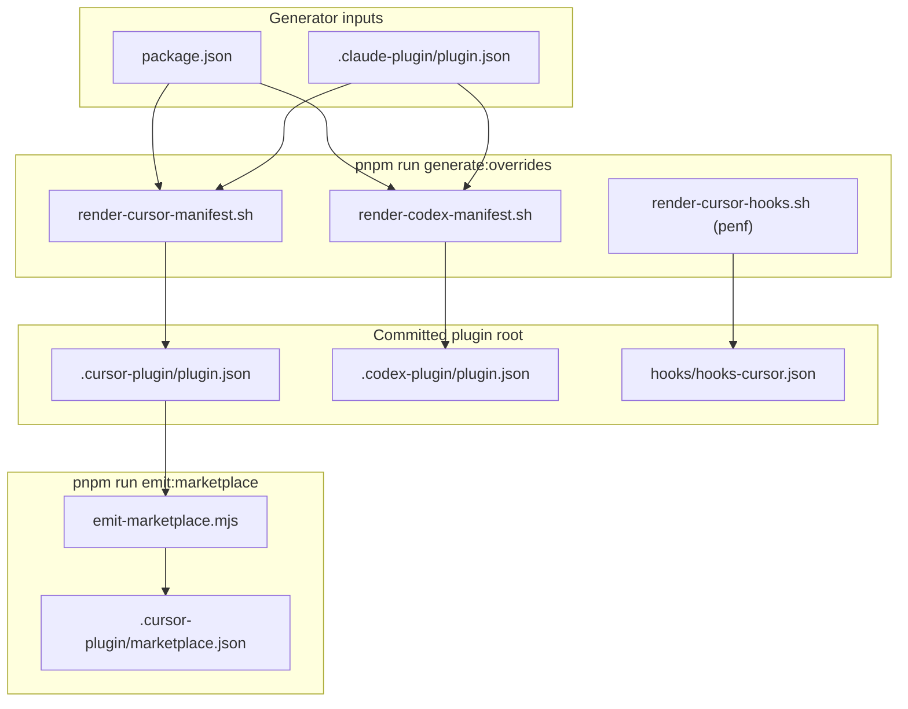

# SDD Token 效率 — Phase pack：多 Harness 同包发布

- **Version**: v1.0 · 2026-08-05
- **Status**: Draft
- **Author**: kang · Cursor Agent
- **Program**: [overall v1.7](2026-08-05-sdd-token-efficiency-overall.md)
- **Phase ID**: pack
- **Depends on**: **penf** ship（release tag + CURSOR-SMOKE blocking）；hook 脚本与逻辑由 penf 交付，pack 只改安装拓扑

> Phase increment only. Cross-phase conventions in [overall](2026-08-05-sdd-token-efficiency-overall.md); overall wins on conflict.

## Deviations from overall

| Overall assumption | Phase decision | Overall updated? |
|---|---|---|
| Generator 输入含 `overrides.manifest.json`（overall §pack 范围摘要） | **Manifest 生成不读** `overrides.manifest.json` — 该文件仅服务 hook trigger / CC matcher 生成（penf）；harness manifest 元数据来自 `package.json` + `.claude-plugin/plugin.json` | Yes — v1.7 · 2026-08-05 |

## Goal

使 `superpowers-overrides` 与 upstream **superpowers 同构**：plugin 根目录自带 committed `.cursor-plugin` + `.codex-plugin` manifest；Cursor Team Marketplace **单层** `source` 指向 `plugins/superpowers-overrides`；**删除** oscaner 专用 `cursor-plugins/superpowers-overrides/` wrapper。

**不变**：penf 交付的 hook 脚本、`hooks-cursor.json` 内容、CC `hooks.json`、self-check 分发、`spor-init` 行为。

## Non-goals

- 不迁移其它 plugin（mattpocock-skills、impeccable、superpowers）的 wrapper 模型
- 不修改 hook detect/enforce 逻辑或 `overrides.manifest.json` trigger 语义
- 不做 Codex `interface` 产品化（minimal stub only）
- 不在 consumer 项目生成 hook / manifest
- 不重跑 penf 完整 CURSOR-SMOKE blocking suite

## Grilling record（pack shared understanding）

| # | 决策 |
|---|------|
| 1 | `.cursor-plugin` + `.codex-plugin` **commit 在 plugin 根**；`generate:overrides` 生成 + CI drift |
| 2 | `source.json` 声明 `"cursor": { "emitMode": "plugin-root" }`（声明式，非 hardcode 插件名） |
| 3 | overrides 的 `cursor` 块**只留 `emitMode`**；删 displayName / skills / hooks |
| 4 | `.cursor-plugin` → `"skills": "./skills/"`（与 upstream superpowers 一致） |
| 5 | `.codex-plugin` → **minimal stub**（name/version/description/author/license、`skills`、`hooks: {}`；无 `interface`、无 repository） |
| 6 | 扩展 **`pnpm run generate:overrides`** pipeline（新 render 脚本） |
| 7 | 迁移 doc：Cursor 重装/刷新 + Claude cache 结构说明；贡献者 generate 流程放 Verification |
| 8 | CI：`emitMode: plugin-root` 分支 + **assert `cursor-plugins/superpowers-overrides/` 不存在** |
| 9 | Ship gate：`pnpm run validate` 全绿 + **轻量** Cursor hook 加载 checklist（非 penf 级 CURSOR-SMOKE） |
| 10 | 元数据真源：**`package.json`**；`name` 与 `.claude-plugin/plugin.json` CI assert 一致 |

## Architecture

### Before（penf ship 态）

```
marketplace/source.json (overrides)
  cursor.displayName / cursor.skills / cursor.hooks → ../../plugins/superpowers-overrides/...

emit-marketplace.mjs
  → cursor-plugins/superpowers-overrides/.cursor-plugin/plugin.json (wrapper)

.cursor-plugin/marketplace.json
  source: cursor-plugins/superpowers-overrides
```

### After（pack）

```
plugins/superpowers-overrides/
  ├── .claude-plugin/plugin.json     ← skills 列表真源（已有）
  ├── .cursor-plugin/plugin.json     ← generated, committed
  ├── .codex-plugin/plugin.json      ← generated, committed
  ├── hooks/hooks-cursor.json        ← penf，内容不变
  └── package.json                   ← version + metadata 真源

marketplace/source.json (overrides only)
  cursor: { "emitMode": "plugin-root" }

.cursor-plugin/marketplace.json
  source: ./plugins/superpowers-overrides

cursor-plugins/superpowers-overrides/   ← 删除（CI 禁止残留）
```



**职责分离**：`generate:overrides` **写** plugin 根 manifest；`emit:marketplace` **只读** 已 commit 文件并刷新 marketplace 索引；emit **不**生成 plugin 根 manifest。

## Deliverables

### P1 — Harness manifest generator

扩展 `plugins/superpowers-overrides/build/generate-all.sh`：

| 脚本 | 输出 |
|------|------|
| `build/render-cursor-manifest.sh` | `.cursor-plugin/plugin.json` |
| `build/render-codex-manifest.sh` | `.codex-plugin/plugin.json` |

**生成规则：**

| 字段 | 来源 / 值 |
|------|-----------|
| name | `.claude-plugin/plugin.json` → `name` |
| version, description, author, license | `package.json`（pack impl **补齐** `author`，与 `marketplace/source.json` overrides.author 一致；description 与 source.json 顶层 description **对齐**） |
| displayName (cursor) | 固定 `"Superpowers Overrides"`（与 penf wrapper 一致） |
| skills | `"./skills/"` |
| hooks (cursor) | `"./hooks/hooks-cursor.json"` |
| hooks (codex) | `{}` |

- 支持 `--check` drift gate（与现有 render 脚本同模式）
- 输出含 `"_generated": "plugins/superpowers-overrides/build/render-cursor-manifest.sh — do not edit"`（与 repo emit 惯例一致；codex 脚本同理）
- CI：`generate:overrides --check` 覆盖两个新输出

**Assert（CI / generator）：**

- `.claude-plugin/plugin.json` 的 `name` === `"superpowers-overrides"`
- `package.json.name` === `.claude-plugin/plugin.json.name`
- `package.json.version` === `marketplace/source.json` overrides version
- `package.json.description` === `marketplace/source.json` overrides description

**Explicit non-input：** `overrides.manifest.json` **不参与** harness manifest 生成（见 Deviations）。

### P2 — Marketplace emit：plugin-root 分支

**`marketplace/source.json`（overrides）：**

```json
"cursor": { "emitMode": "plugin-root" }
```

**`marketplace/source.schema.json`：**

- `cursor` 改为 **oneOf**：
  - **Wrapper 模式**（默认）：`required: [displayName, skills]`；可选 `hooks`
  - **Plugin-root 模式**：`required: [emitMode]`；`emitMode` enum `["plugin-root"]`；禁止 displayName/skills/hooks

**`scripts/emit-marketplace.mjs`：**

| `cursor.emitMode` | Cursor marketplace `source` | 生成 wrapper |
|-------------------|----------------------------|--------------|
| (absent / wrapper) | `cursor-plugins/<name>` | ✅ |
| `plugin-root` | `./<contentRoot>` | ❌ 跳过该 plugin |

**`scripts/lib/marketplace-utils.mjs`：**

- `assertCursorPathsExist`：`plugin-root` → resolve skills/hooks 相对 `contentRoot`（读 `.cursor-plugin/plugin.json`）；wrapper 模式保持 today 行为
- 新增：`plugin-root` 时 assert `cursor-plugins/<name>/` **不存在**

**`scripts/validate-marketplace.mjs`：**

- `validateSourceSchema`：`cursor.emitMode === "plugin-root"` 时 **不要求** displayName/skills；要求 `contentRoot/.cursor-plugin/plugin.json` 存在
- `validateWrapperPaths`：**跳过** `plugin-root` plugin；对其 assert `cursor-plugins/<name>/` **不存在**；其余 plugin 保持 wrapper 校验
- `validateMarketplaceSources`：不变（读 emit 后的 marketplace.json）

**`scripts/ci-validate.sh`：** 无 hardcoded wrapper 路径；pack 变更集中在 `validate-marketplace.mjs` + emit freshness（step 7 已调用 `--check`）。**无需**单独改 ci-validate 除非 step 7 失败暴露缺口。

**Emit freshness（`--check`）：**

- `plugin-root` plugin **不在** `cursor-plugins/<name>/.cursor-plugin/plugin.json` diff 列表
- marketplace 条目 `source` 为 `./plugins/superpowers-overrides`

**Release 工件（ship）：**

- `pnpm changeset` 描述 breaking（Cursor marketplace source 路径）
- `plugins/superpowers-overrides/CHANGELOG.md` 条目

### P3 — 删除 wrapper + 文档

- **删除** `cursor-plugins/superpowers-overrides/` 整个目录
- **新建** `plugins/superpowers-overrides/docs/MIGRATION-pack-single-layer.md`（含 penf-design 为 wrapper 时代拓扑的说明）
- **更新** `plugins/superpowers-overrides/docs/cross-harness-overrides.md` — wrapper 路径 → plugin 根 manifest
- **更新** `README.md` / `README.zh-CN.md` — overrides Cursor 安装链（单层 contentRoot）
- **更新** `marketplace/README.md` — plugin-root 模式与 overrides 例外

### P4 — 运行时文档 touch（路径对齐）

更新 **仍被贡献者/用户阅读** 的 overrides 文档（**不**回溯编辑 penf-design 历史 spec — wrapper 时代拓扑在 `MIGRATION-pack-single-layer.md` 注明即可）：

- `plugins/superpowers-overrides/docs/cross-harness-overrides.md`（P3）
- `plugins/superpowers-overrides/docs/CURSOR-SMOKE.md` — 安装路径说明（smoke **场景**不变）
- `CLAUDE.md` — overrides 单层 contentRoot 一句

## Files to change

| 文件 | 动作 |
|------|------|
| `plugins/superpowers-overrides/build/render-cursor-manifest.sh` | 新建 |
| `plugins/superpowers-overrides/build/render-codex-manifest.sh` | 新建 |
| `plugins/superpowers-overrides/build/generate-all.sh` | 扩展调用 |
| `plugins/superpowers-overrides/package.json` | 补齐 `author`；description 与 source 对齐 |
| `plugins/superpowers-overrides/CHANGELOG.md` | ship 条目 |
| `.changeset/` | breaking changeset（ship PR） |
| `plugins/superpowers-overrides/.cursor-plugin/plugin.json` | generated commit |
| `plugins/superpowers-overrides/.codex-plugin/plugin.json` | generated commit |
| `marketplace/source.json` | overrides `cursor` → `{ "emitMode": "plugin-root" }` |
| `marketplace/source.schema.json` | cursor oneOf |
| `scripts/emit-marketplace.mjs` | plugin-root 分支 |
| `scripts/lib/marketplace-utils.mjs` | assert 分支 + wrapper 禁止 |
| `scripts/validate-marketplace.mjs` | plugin-root 分支 + wrapper 禁止 |
| `scripts/ci-validate.sh` | 无需变更（除非 validate step 暴露缺口） |
| `cursor-plugins/superpowers-overrides/` | **删除** |
| `.cursor-plugin/marketplace.json` | emit 刷新 |
| `plugins/superpowers-overrides/docs/MIGRATION-pack-single-layer.md` | 新建 |
| `plugins/superpowers-overrides/docs/cross-harness-overrides.md` | 更新 |
| `plugins/superpowers-overrides/docs/CURSOR-SMOKE.md` | 安装路径说明 |
| `marketplace/README.md` | plugin-root 模式说明 |
| `README.md` / `README.zh-CN.md` | overrides 安装链 |
| `CLAUDE.md` | overrides 单层说明 |
| `docs/superpowers/specs/2026-08-05-sdd-token-efficiency-penf-design.md` | **不修改**（MIGRATION 注明 wrapper 时代） |

## Verification

### Automated（blocking）

- `pnpm run validate` 全绿
- `pnpm run generate:overrides --check` 无 drift（含新 manifest outputs）
- `node scripts/emit-marketplace.mjs --check` 无 drift
- CI assert：`cursor-plugins/superpowers-overrides/` **不存在**
- plugin 根 `.cursor-plugin/plugin.json` 的 skills/hooks 路径 resolve
- plugin 根 `.codex-plugin/plugin.json` 存在且 parse 合法
- `.cursor-plugin/marketplace.json` 中 overrides `source` === `./plugins/superpowers-overrides`

### Manual — lightweight checklist（blocking）

- [ ] Cursor Team Marketplace：安装/刷新 overrides 后 Settings → Hooks 仍可见 penf 的 `beforeSubmitPrompt` + `preToolUse`
- [ ] Cursor：抽样 trigger（如 `/brainstorming`）→ detect/enforce 仍工作（不要求重跑完整 CURSOR-SMOKE doc）
- [ ] Claude Code cache：plugin 树含 `.cursor-plugin/` + `.codex-plugin/` 目录

### 贡献者

改 `package.json`、`.claude-plugin/plugin.json` 或 generator 模板后：

```bash
pnpm run generate:overrides && pnpm run validate
```

## Acceptance criteria

### P1 — Generator

- [ ] `.cursor-plugin/plugin.json` committed；`skills: "./skills/"`；`hooks: "./hooks/hooks-cursor.json"`；含 `_generated` 字段
- [ ] `.codex-plugin/plugin.json` committed；minimal stub；`hooks: {}`；含 `_generated` 字段
- [ ] `generate-all.sh` 含两个新 render；`--check` drift 覆盖
- [ ] CI/generator assert：`.claude-plugin` name、`package.json.name`、version/description 与 source.json 一致
- [ ] 生成 manifest 含 author、license（字段与 penf wrapper 对齐；**不**要求 repository — wrapper 亦无此字段）

### P2 — Emit + CI

- [ ] `source.json` overrides：`"cursor": { "emitMode": "plugin-root" }` only
- [ ] `source.schema.json` oneOf 校验通过
- [ ] `validate-marketplace.mjs` plugin-root 分支（skip wrapper / assert 无 wrapper 目录）
- [ ] emit 不生成 overrides wrapper；marketplace `source` 指向 contentRoot
- [ ] `node scripts/emit-marketplace.mjs --check` 无 drift；overrides 不在 cursor-plugins diff 列表
- [ ] CI 失败若 `cursor-plugins/superpowers-overrides/` 存在

### P3 — Migration + docs

- [ ] `MIGRATION-pack-single-layer.md` 含 Cursor 刷新 + Claude cache 说明
- [ ] `cross-harness-overrides.md` 路径更新
- [ ] `README.md` + `README.zh-CN.md` overrides 安装链更新
- [ ] `marketplace/README.md` 含 plugin-root 说明

### P4 — 运行时文档 touch

- [ ] `cross-harness-overrides.md` + `CURSOR-SMOKE.md` 路径更新
- [ ] `CLAUDE.md` overrides 单层说明
- [ ] `MIGRATION-pack-single-layer.md` 注明 penf-design 描述 wrapper 时代拓扑

### DoD

- [ ] `pnpm run validate` 全绿
- [ ] Manual checklist：Cursor Hooks 可见；抽样 trigger 仍工作；Claude cache 含 `.cursor-plugin` + `.codex-plugin`
- [ ] changeset + CHANGELOG 条目（ship PR）
- [ ] **Impl merge 条件**：penf 已 ship（release tag + penf CURSOR-SMOKE blocking 通过）

## Out of scope (pack)

- 其它 plugin 的 wrapper → single-layer 迁移
- Codex marketplace / interface 产品页
- Hook 逻辑、pending state、matcher 变更
- Consumer 项目 manifest / hook 生成
- p0 / p1 功能

## Relationship to penf / p0 / p1

| 关系 | 说明 |
|------|------|
| **Serial impl** | penf ship 前不得 pack **implementation** |
| **Parallel spec** | pack spec 可与 p0 spec 审查并行（本文件） |
| **Parallel impl** | penf ship 后 pack 与 p0 impl 可并行（overall 依赖图） |
| **Hook 继承** | pack 假设 penf 的 `hooks-cursor.json` + bin 脚本已 ship；pack 只改 manifest 声明位置 |
| **Smoke** | penf CURSOR-SMOKE 仍有效；pack 仅追加 lightweight 拓扑 checklist |
