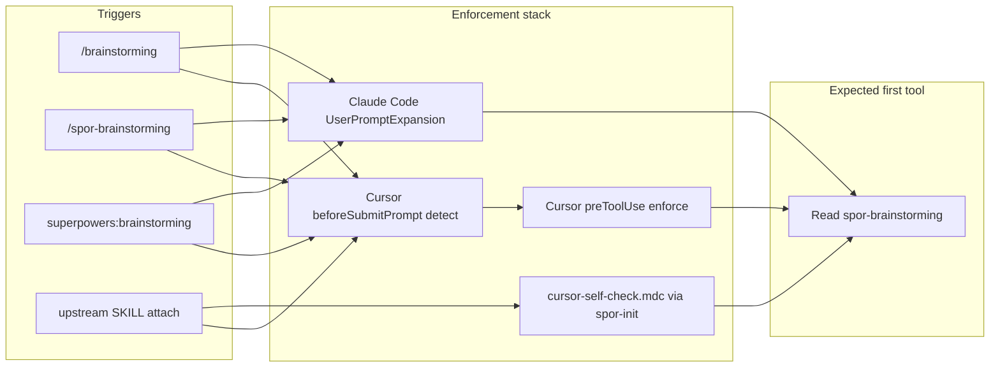

# SDD Token 效率 — Phase penf：Override-First 强制增强

- **Version**: v1.3 · 2026-08-05
- **Status**: Draft
- **Program**: [overall](2026-08-05-sdd-token-efficiency-overall.md)
- **Phase ID**: penf

## Deviations from overall

无（本 phase 为 overall 新增，补 program 元纪律）。

## Goal

确保在 Cursor / Claude Code 中调用 `/brainstorming`、`/writing-plans` 等 upstream skill 时，**`spor-*` override 在首 tool call 被加载**——避免 orchestrator 直接跑 upstream SKILL.md 正文。Rule 2（grilling）、Rule 1（subagent spec review）的**可观测执行**依赖 override 先被加载；penf **验收首 tool = Read/Skill spor-***，不单独断言 grilling / Rule 1 dispatch（属 override 正文职责，由 dogfood 人工审计）。

本 program 的 p0/p1 设计会话已发生 **override skip**；penf 修复根因，使后续 phase 的 brainstorming → writing-plans → SDD 链条可信。

## Hook 交付模式（grilling 定论）

与 superpowers / impeccable 对齐，**禁止**在 consumer 项目内生成或 copy hook（同 p1 CLI plugin-bundled 哲学）。

| 产品 | 模式 | Consumer 项目 |
|------|------|---------------|
| **superpowers** | Cursor marketplace `plugin.json` → `hooks/hooks-cursor.json`（如 `sessionStart`） | **零** hook 文件；安装插件即可 |
| **impeccable** | 产品 repo 内 commit 的 `.cursor/hooks.json`（直装 / build:release harness） | marketplace 路径仅 skills；hook 随产品包而非 spor-init |
| **superpowers-overrides（penf）** | **Plugin-bundled** — 新增 `hooks/hooks-cursor.json` + `marketplace/source.json` `cursor.hooks` | **零** hook 文件；**不**由 `spor-init` 写入 `.cursor/hooks.json` |

`spor-init` **仅**刷新 `.cursor/rules/superpowers-overrides.mdc`（与 today 一致）。

## 根因分析（本 session 实证）

### 观察到的失败

用户 `/brainstorming` + manually attach **upstream** `brainstorming/SKILL.md` 后，agent **首动**为 Read upstream SDD / web search / 写 spec，**未** Read `spor-brainstorming`；grilling 未走 Skill 工具；Rule 1 spec review 未 dispatch subagent。

### 分层原因

| 层 | 机制 | 本 case 状态 | 后果 |
|----|------|-------------|------|
| **L1 内容显著性** | upstream SKILL 以 `You MUST` / HARD-GATE 开头，作为 **inline 附件** 进入 context | upstream body **内联在 user message** | 模型把 upstream 流程当作 **可执行主路径** |
| **L2 Cursor hook 缺失** | superpowers-overrides **未**声明 `cursor.hooks`（superpowers 有，overrides 无） | Cursor **无** overrides 的 harness 级 signal | `/brainstorming` 无 injected context |
| **L3 Hook matcher 过窄** | Claude Code `hooks.json` 仅 `^superpowers:` | bare `/brainstorming` **不触发** | 仅 `/superpowers:brainstorming` 受保护 |
| **L4 项目 rules 软约束** | `.cursor/rules/superpowers-overrides.mdc` `alwaysApply` | 规则 **在** context 中 | 与 L1 冲突时，模型 **优先执行** inline skill checklist |
| **L5 附件优先级倒置** | user attach upstream skill ≠ agent_skills 中的 spor | attach **upstream** 而非 spor | spor 仅在 `<agent_skills>` 列表 |
| **L6 无失败可观测性** | 无 CI / smoke 断言首 tool | — | skip 直到用户人工审计才暴露 |

### 结论（设计原则）

1. **Override 不能只靠 model 自律** — 必须叠加 harness 级 signal（plugin hook + prompt expansion + rules）。
2. **Manual attach upstream body 是 anti-pattern** — 文档 + self-check：attach **`spor-*`** 或 bare slash，**不要** attach upstream SKILL 全文。
3. **Hook 覆盖 bare slash** — matcher 扩展到 manifest 中所有 upstream slug。
4. **Cursor hook = plugin 声明** — 同 superpowers marketplace 链路；penf 用 **`beforeSubmitPrompt`（detect）+ `preToolUse`（enforce）** 双层，**不是** spor-init 写项目 `.cursor/hooks.json`。
5. **Cursor API 约束** — 官方 `beforeSubmitPrompt` 输出仅 `{continue, user_message}`，**无** `additional_context`（不同于 Claude Code `UserPromptExpansion`）。per-prompt 注入须靠 detect→enforce 或 rules；implementation plan 不得假设 Cursor 能 inject context on submit。
6. **与 p0 同构** — penf 管 orchestrator 是否读 override；p0 管是否读 subagent 厚输出。

## 推荐方案

**D1–D4**（manifest 扩展 CC matcher + Cursor plugin hooks + self-check + smoke）；不单靠 rules 文案（L4 已证明不够）。

## Architecture

**Attach-upstream 路径**：A 走 detect hook（attachments 路径 + prompt 关键词），**不只** rules；rules 为 fallback。

## Deliverables

### D1 — Claude Code：manifest-driven `UserPromptExpansion` 扩展

- 从 `overrides.manifest.json` **生成** matcher（bare `/<slug>` + `^superpowers:<slug>` + `^/spor-<slug>`）。
- 更新 `hooks/hooks.json` + `bin/override-prompt-expansion.sh`（`pnpm run generate:overrides`）；**禁止**手改。
- `/brainstorming` 与 `/superpowers:brainstorming` 均注入 MANDATORY OVERRIDE context。

### D2 — Cursor：**plugin-bundled** hook（必 ship，grilling 定论）

对齐 superpowers marketplace 链路。**双层**（Cursor API 约束见设计原则 #5）：

1. 新增 `plugins/superpowers-overrides/hooks/hooks-cursor.json`
   - **`beforeSubmitPrompt`**（matcher: `UserPromptSubmit`）→ `bin/override-cursor-detect.sh`（manifest 生成）
     - 读 stdin `prompt` + `attachments[].file_path`
     - **Trigger 规则**（自 `overrides.manifest.json` 生成，每 upstream slug 一条）：
       - Bare slash：`prompt` 匹配 `(?i)(^|\s)/<upstream-slug>(\s|$)` 或 `(?i)(^|\s)/spor-<upstream-slug>(\s|$)`
       - Prefixed：`prompt` 含 `superpowers:<upstream-slug>` 或 `superpowers-overrides:spor-<upstream-slug>`
       - Attach upstream：`attachments[].file_path` 匹配任一（manifest 生成 per slug）：
         - `(?i)/skills/<upstream-slug>/SKILL\.md$`
         - `(?i)/plugins/superpowers/skills/<upstream-slug>/SKILL\.md$`
         - `(?i)/\.claude/plugins/cache/[^/]+/superpowers/[^/]+/skills/<upstream-slug>/SKILL\.md$`
         - `(?i)/\.cursor/skills/(superpowers/)?<upstream-slug>/SKILL\.md$`
     - 命中 → 写入 **pending state**（见下）；映射到 `spor-<upstream-slug>`
     - 输出：`{"continue": true}`（不 block；**不**假设 `additional_context` 可用）
   - **Pending state 契约**（detect 写 / enforce 读，implementation plan 不得另发明）：
     - 路径：`$TMPDIR/oscaner-superpowers-overrides/pending/<session_key>.json`
     - `session_key` = stdin `conversation_id` ?? `session_id` ?? `sha256(prompt)` 前 16 hex
     - Schema：`{"override":"spor-<slug>","detected_at":<unix>,"trigger":"<bare-slash|prefixed|attach>"}`
     - TTL：**300s**；enforce 见过期 pending → 删除并 `allow`
     - 清除：enforce `allow` 合法首 tool 后删除；或 TTL 过期
   - **`preToolUse`**（**无 matcher**；脚本开头无 pending → 立即 `{"permission":"allow"}`）→ `bin/override-cursor-enforce.sh`
     - 若 pending override 存在且未过期且本 turn **尚未** satisfy：
       - **Allow（satisfy + 清除 pending）** 若首 tool 为以下之一：
         - `Read` 且 path 匹配 `(?i)(spor-<slug>|superpowers-overrides.*spor-<slug>)/SKILL\.md$`
         - `Skill` / skill-invocation 等价且 target 为 `spor-<slug>` 或 `superpowers-overrides:spor-<slug>`
       - **Deny** 其它 tool → `agent_message`: 「MANDATORY OVERRIDE — FIRST tool call MUST Read or Skill spor-* …」
2. `marketplace/source.json` → `superpowers-overrides.cursor.hooks: "../../plugins/superpowers-overrides/hooks/hooks-cursor.json"`
3. `pnpm run emit && pnpm run validate` — wrapper `cursor-plugins/superpowers-overrides/.cursor-plugin/plugin.json` 含 `hooks` 字段
4. **`spor-init` 不安装、不合并项目 `.cursor/hooks.json`**

**禁止**：consumer 项目内 `Write` / copy hook；与 p1 CLI 同哲学。

### D3 — Self-check 模板增强

更新 `build/templates/cursor-self-check.mdc` + `claude-self-check.md`：

- Red flag：manual attach upstream body → still Read `spor-*` first
- Red flag：first tool before spor Read
- attach upstream SKILL 全文 = anti-pattern

### D4 — README + CURSOR-SMOKE 硬化

- README：「Manual skill attach」+「hooks 随 plugin 安装，无需项目 hook」
- CURSOR-SMOKE **blocking**：安装 superpowers-overrides 后，`/brainstorming` 与 attach upstream body → 首 tool = Read spor；Settings → Hooks 可见 plugin hook

### D5 — 可选 cross-cutting skill（YAGNI）

D1–D4 ship 后 smoke 仍失败再评估；**penf 默认不做**。

## Files to change

| 文件 | 动作 |
|------|------|
| `overrides.manifest.json` | hook 生成输入（若 generator 需要） |
| `build/generate-overrides*.mjs` | 生成 CC matcher + Cursor hook 脚本 case |
| `hooks/hooks.json` | Claude Code matcher 扩展 |
| `hooks/hooks-cursor.json` | **新建** — Cursor plugin hook |
| `bin/override-prompt-expansion.sh` | regenerate |
| `bin/override-cursor-detect.sh` | **新建** — Cursor beforeSubmitPrompt detect |
| `bin/override-cursor-enforce.sh` | **新建** — Cursor preToolUse enforce |
| `marketplace/source.json` | `superpowers-overrides.cursor.hooks` |
| `build/templates/cursor-self-check.mdc` | D3 |
| `build/templates/claude-self-check.md` | D3 |
| `skills/spor-init/SKILL.md` | 明确：**不**安装 hooks；仅 rules；reminder 改为「Cursor 靠 plugin hooks detect/enforce，rules 为 fallback」 |
| `docs/CURSOR-SMOKE.md` | D4 |
| `README.md` / `README.zh-CN.md` | D4 |
| `docs/cross-harness-overrides.md` | plugin hooks 模式文档 |

## Verification

- `pnpm run validate` + `validate:overrides` + generator drift pass
- Claude Code：`/brainstorming` **与** `/superpowers:brainstorming` → expansion 含 MANDATORY OVERRIDE；抽样 `/spor-brainstorming` 或 manifest 内另一 spor slug 同测
- Claude Code：generator 产出 bare `/` + `^superpowers:` + `^/spor-` matcher（drift check 覆盖）
- Cursor：marketplace 安装后 plugin.json 含 `hooks`；Settings → Hooks 可见 `beforeSubmitPrompt` + `preToolUse`；Execution Log 可见 detect/enforce
- Cursor：`/brainstorming` → 首 tool 非 Read spor 时被 preToolUse deny；Read spor 后后续 tool allow
- Cursor：attach `plugins/superpowers/skills/brainstorming/SKILL.md` **或** plugin cache 路径 → detect 命中；首 tool Read/Skill spor
- Consumer repo：`git status` **无** 新增 `.cursor/hooks.json`（dogfood）
- README / `docs/cross-harness-overrides.md` 含 plugin-bundled hooks + manual attach anti-pattern

## Acceptance criteria

### D1 — Claude Code

- [ ] bare `/brainstorming` 触发 UserPromptExpansion 且含 MANDATORY OVERRIDE
- [ ] `/superpowers:brainstorming` 触发 UserPromptExpansion（与 today 回归）
- [ ] manifest 内 spor slug 至少抽样 2 个（如 `writing-plans`、`executing-plans`）hook 生成 smoke 通过
- [ ] `^/spor-<slug>` matcher 在 `hooks/hooks.json` 生成且 drift check 通过

### D2 — Cursor plugin hooks

- [ ] `superpowers-overrides` Cursor plugin 声明 `hooks-cursor.json`（含 `beforeSubmitPrompt` + `preToolUse`）
- [ ] `spor-init` **不**写入、不合并项目 `.cursor/hooks.json`
- [ ] `/brainstorming`：首 tool = Read 或 Skill `spor-brainstorming`（deny 其它首动）
- [ ] attach upstream `brainstorming/SKILL.md`（含 plugin cache 路径）：detect 命中；首 tool = Read/Skill spor
- [ ] Settings → Hooks 可见 plugin 注册的两条 hook

### D3 — Self-check

- [ ] Red flag：manual attach upstream body → still Read `spor-*` first
- [ ] Red flag：first tool before spor Read
- [ ] Red flag：attach upstream SKILL 全文 = anti-pattern

### D4 — Docs + smoke

- [ ] README / README.zh-CN：manual attach + plugin-bundled hooks（无项目 hook）
- [ ] `docs/cross-harness-overrides.md` 更新 Cursor detect/enforce 模式
- [ ] CURSOR-SMOKE **blocking**：上述 D2 两条场景 + Claude Code regression 条目

### DoD — repo hygiene

- [ ] `pnpm run validate` 全绿（含 generator drift）
- [ ] dogfood consumer repo 无新增 `.cursor/hooks.json`

## Grilling record（penf shared understanding）

| # | 决策 |
|---|------|
| 1 | Cursor hook **必 ship** — **双层**：`beforeSubmitPrompt` detect + `preToolUse` enforce（Cursor API 无 submit-time context inject） |
| 2 | Hook **plugin-bundled**（同 superpowers）；**非** spor-init 写项目 `.cursor/hooks.json` |

## Out of scope (penf)

- 修改 upstream superpowers `brainstorming/SKILL.md`
- p0 handoff / p1 CLI 功能
- 在 consumer 项目生成 hook 文件

## Relationship to p0 / p1

| 关系 | 说明 |
|------|------|
| **Serial** | penf ship 前不得 p0 **implementation** |
| **Parallel** | p0 spec 审查可与 penf 设计并行 |
| **Dogfood** | 同类 orchestrator 纪律 failure mode |
