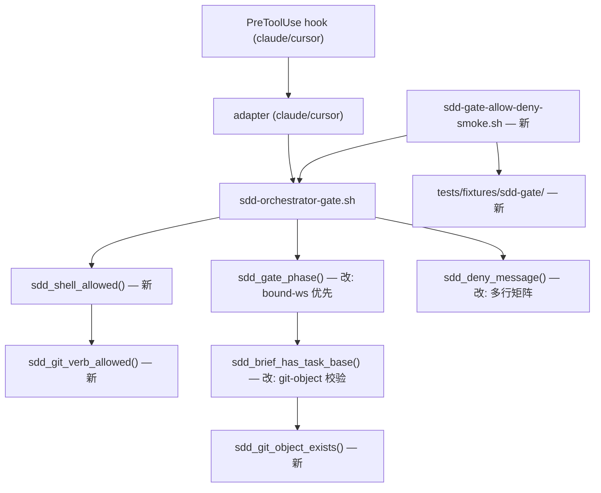

# SDD orchestrator gate — Shell/Write 一致性 + 旧 workspace 劫持防护

- **Version**: v1.0 · 2026-08-07
- **Status**: Draft
- **Author**: oscaner · Claude Code
- **Issue**: [Oscaner/skills#53](https://github.com/Oscaner/skills/issues/53)
- **Program**: SDD Token 效率 (p1-slim 系列) — 独立增量，不挂新的 phase ID
- **Depends on**: p1-slim.2 gate (`sdd-orchestrator-gate.sh`) @ HEAD

## §0 Incremental warning

> 本 spec 是 **p1-slim.2 PreToolUse gate 的一致性修复 + 防劫持加固**。不改变 H6 four-mode 语义、不改 adapter JSON 格式、不改 fail-open 语义、不改 `task_complete` 的 allow 行为。

## §1 Problem

Dogfood 期间（p1-slim.3、branch-rules、cursor-agent-cli-refactor）orchestrator 在 `TASK_ACTIVE` gate 激活时遭遇不一致的 DX（issue #53 + 三条评论）。实证复现（2026-08-07，本机运行 gate lib）：

| # | 现象 | 根因 | 实证 |
|---|------|------|------|
| P1 | Shell vs Write 不对称：workspace 变更走 `Write` 被 allow，同一变更走 shell（heredoc）被 deny；**更糟的是只读 git 诊断（`git status`）也被 deny** | `sdd_gate_decide` 对非白名单 Bash 一律 deny；白名单仅 `sdd-run-task-*`/`sdd-workspace`/`task-brief`/`review-package`/`rev-parse` | `git status --short` 在 orchestrating/task_active 下均 deny |
| P2 | deny 消息只给「跑 H6」+「允许写 workspace」，不给允许的 Bash 清单 → orchestrator 只能试错 | `sdd_deny_message` 只输出两行，不列 allowlist | 见 §设计 deny 消息 |
| P3 | 旧/测试 workspace（如 `dogfood-test` 的 `TASK_BASE: abc`）劫持新 session，**整个新计划被挡** | `sdd_find_active_workspace` 扫所有 workspace；`sdd_brief_has_task_base` 只 grep 字符串不验 git 对象；未 bind 时 gate 用扫描结果 | `dogfood-test` 现存 `TASK_BASE: abc` + 无 handoff → 新 minimal session 被挡 |
| P4 | 测试 fixture 与真实 `.superpowers/sdd/` 混在一起，测试自己制造触发 P3 的 stub | 两个 gate 测试直接往 `dogfood-test` 写 stub | `override-{claude,cursor}-sdd-gate.test.sh` 均写 `dogfood-test` |
| P5 | issue 评论 3 声称 task_complete 后 shell 仍被挡（缓存） | **误报** — phase 每次从文件系统实时重算，无缓存 | 实证：写 APPROVED handoff 后同一 session 下一调用立即 allow |

**辅助事实**（影响设计）：

- `.superpowers/` 在 `.gitignore`（第 4 行），未被 git 跟踪 → 删除 `dogfood-test` 无提交风险
- `git cat-file -e abc` 失败、`git cat-file -e <short-sha>` 成功 → git-object 校验可行
- `TASK_BASE` 由 orchestrator 手工写入真实 `git rev-parse HEAD` SHA（spor-SDD Rule 0a item 4「append `TASK_BASE: <sha>`」），上游 SDD 与 CLI 脚本均不写 → git-object 校验不误伤正常流程

## Goal

让 orchestrator 在 gate 激活时：

1. **只读 git 诊断 Bash 可用、规则透明** — 只读 git 动词放开，deny 消息列出完整 allowlist 矩阵。`ls`/`echo` 等非 git 只读命令**按设计仍 deny**（精简只读集决定，见 Non-goals）
2. **不被旧 workspace 劫持** — TASK_BASE 必须真实 git object；bound-ws 优先
3. **有回归测试钉住完整 allow/deny 矩阵** — smoke 测试 + fixture 隔离

## Constraints

- 仅改 `superpowers-overrides` 插件（`bin/`、`tests/`、`docs/`、`skills/`）
- 不改 adapter JSON 格式（`hookSpecificOutput.permissionDecision` / `.permission`）
- 不改 H6 four-mode 语义、`sdd-run-task-*.sh` 行为
- **No duplicated allowlist logic**（p1-slim.2 约束）— 判定逻辑放共享 lib
- 不改 fail-open 语义（无 jq / 无 pending → allow）
- spor-SDD 保持 ≤160 行（如动 Rule 0a，需平衡）
- 不 fork upstream superpowers；不引入 git worktree

## Design

### Architecture



### 核心判定 — `sdd_shell_allowed()`（重命名自 `sdd_bash_allowed`，共享单源）

现有 `sdd_bash_allowed` 重命名为 `sdd_shell_allowed` 并扩展：allowlist（保留）之上增加只读 git 动词判定。唯一调用点在 `sdd_gate_decide`（shell 分支），不保留两个函数（避免重复 allowlist 逻辑）。

**匹配优先级**（先 allowlist，再只读 git 动词，其余 deny）：

```bash
# 1. allowlist 脚本（现状保留）
case "$cmd" in
  *sdd-run-task-*|*sdd-workspace*|*task-brief*|*review-package*) return 0 ;;
esac
# 2. 只读 git 动词（新）
if sdd_git_verb_allowed "$cmd"; then return 0; fi
# 3. 其余 → deny
return 1
```

**`sdd_git_verb_allowed()`** 负责提取 git 子命令并查白名单（提取逻辑**归属该函数内部**，无独立 `parse_git_verb` 函数）。提取边界固定：

```
command 形如:
  git <verb> ...                    → verb = $2
  git -C <path> <verb> ...          → 跳过 -C 及其路径
  git --git-dir=<path> <verb> ...   → 跳过 --git-dir=<path>
提取到 <verb> 后查白名单；提取失败 → return 1（deny，fail-closed）。
```

**v1 明确不在提取范围**：`git -C <path> -c k=v <verb>`（带 `-c` 配置选项）——提取失败 → deny（fail-closed，接受行为）。如需支持在后续版本加（不设 AC）。

**只读白名单（精简集）**：
`status diff log show rev-parse branch remote ls-files diff-tree`

**明确排除（变更类，仍 deny）**：`add commit push pull reset checkout clean stash merge rebase cherry-pick restore switch rm mv` 及一切非白名单动词。

**实现位置**：`sdd-orchestrator-gate.sh`（共享 lib）→ 两个 harness adapter 自动继承，无重复逻辑。

**解析失败 → deny（fail-closed）**。`git` 不在 PATH → `sdd_git_object_exists` 返回 1（保守），`sdd_git_verb_allowed` 对 git 命令返回 1（deny，保守）。

### 防劫持双保险

**保险 1 — `sdd_brief_has_task_base()` 加 git-object 校验**：

```bash
# 传入 repo_root：git cat-file 必须绑定仓库根（CWD 无关）
# 实证：bare `git cat-file -e` 依赖 CWD 是 git 仓库；`git -C <repo>` 从任意 CWD 可用
sdd_git_object_exists() {
  local repo_root="$1" sha="$2"
  git -C "$repo_root" cat-file -e "$sha" 2>/dev/null   # 真实 SHA → 0；stub 'abc' → 1
}

sdd_brief_has_task_base() {
  local brief="$1" repo_root="$2"
  [[ -f "$brief" ]] || return 1
  local sha
  sha="$(sed -nE 's/^TASK_BASE: //p' "$brief" | head -1 | tr -d ' \r')"
  [[ -n "$sha" ]] || return 1
  sdd_git_object_exists "$repo_root" "$sha"
}
```

> 已验证：`git cat-file -e abc` 失败、`git cat-file -e <short-sha>` 成功；`git -C <repo> cat-file -e <sha>` 从任意 CWD 可用（非 git 目录 bare 调用失败）。短 SHA 也通过（`git cat-file -e` 接受缩写）。正常流程写入真实 `git rev-parse HEAD` SHA，不误伤。

调用链传播：`sdd_find_active_workspace` / `sdd_gate_phase` 已有 `repo_root`，把 `$repo_root` 传给 `sdd_brief_has_task_base "$brief" "$repo_root"`。

**保险 2 — `sdd_gate_phase()` 优先 bound workspace**：

`active_ws` 的**单一解析点**在 `sdd_gate_decide`：`active_ws = sdd_resolve_workspace ?? sdd_find_active_workspace`（bound 优先，minimal 才扫描）。解析结果**线程化**传入 `sdd_gate_phase` 与 `sdd_write_allowed` 两个调用——两者使用**同一个** `active_ws`，不再各自 resolve/find（当前 `sdd_gate_phase` 内部重复 resolve/find 是分叉来源）。

```bash
# sdd_gate_decide 内（单次解析）
active_ws="$(sdd_resolve_workspace "$repo_root" "$pending" || true)"
if [[ -z "$active_ws" ]]; then
  active_ws="$(sdd_find_active_workspace "$repo_root" || true)"   # git-object 过滤后 stub 不激活
fi
phase="$(sdd_gate_phase "$repo_root" "$active_ws" "$pending")"   # 传入已解析 active_ws
# ... write 判定同样传 $active_ws
```

`sdd_gate_phase` 接收已解析的 `$workspace`，**不再内部重复 resolve/find**。`task_complete` 判定依赖「APPROVED handoff + 无 next brief」，必须基于这个单一 `active_ws`。

### deny 消息 — 多行 allowlist 矩阵

```bash
sdd_deny_message() {
  cat <<EOF
SDD orchestrator gate — direct repo edits forbidden during active task.

Allowed Bash (read-only diagnostics):
  git status / git diff / git log / git show / git rev-parse / git branch / git remote
  git ls-files / git diff-tree
  {plugin_root}/bin/sdd-run-task-<harness>.sh
  sdd-workspace / task-brief / review-package

Allowed Write:
  .superpowers/sdd/<plan-basename>/

Repo changes flow only through:
  {plugin_root}/bin/sdd-run-task-<harness>.sh --task N --mode implement

Full matrix: docs/sdd-h6-reference.md (SDD gate matrix)
See spor-SDD Rule 0a item 4.
EOF
}
```

`<plan-basename>` 由 `sdd_plan_basename()` 算出；`<harness>` 已传入。

### 测试 fixture 隔离

**约束（实证）**：
- `git cat-file -e <SHA>` 依赖 CWD 是 git 仓库；非 git 目录会失败。git-object 校验必须用 `git -C "$repo_root" cat-file -e`（绑定 repo_root）。
- **`.superpowers` 被根 `.gitignore`（第 4 行，无斜杠 → 匹配任意深度）忽略**；fixture 目录若 `git init` 会变嵌套 git 仓库（`git add` 记成 gitlink，fresh clone 为空）。**因此 fixture 模板不用 `.superpowers/sdd/` 路径、不做 `git init`**——用普通目录 `sdd/` 存放（被跟踪），测试运行时把 `SDD_GATE_FIXTURES_ROOT` 指向临时副本并 `git init` 副本（pending `repo_root` 指向副本，使 `git -C` cat-file 在副本内可解析）。

**fixture 结构**（每个场景独立的 fixture 根，避免 `sdd_find_active_workspace` 首匹配遮蔽）：

```
tests/fixtures/sdd-gate/
  orchestrating/sdd/orchestrating-ws/      # 空目录（无 brief → 不激活）
  active/sdd/active-ws/task-1-brief.md     # TASK_BASE: <真实 short-SHA>，无 handoff
  complete/sdd/complete-ws/
    task-1-brief.md                        # TASK_BASE: <真实 SHA>
    task-1-handoff.json                    # status: APPROVED
  stub/sdd/stub-ws/task-1-brief.md         # TASK_BASE: abc（stub）—— 断言不激活
```

fixture 模板是**普通目录**（不含 `.git`、不含 `.superpowers`），被 git 正常跟踪。`<真实 short-SHA>` 用占位符 `<SHA>`，测试运行时注入。

**隔离机制**：
- gate lib 增加 `SDD_GATE_FIXTURES_ROOT`（环境变量）：`sdd_find_active_workspace` / `sdd_gate_phase` 解析 sdd 根时，若该变量有值则用 `$SDD_GATE_FIXTURES_ROOT`（签名从 `repo_root` 改为 `sdd_root`，调用点含 `sdd_gate_decide` 单一解析点）
- 测试在**临时目录**复制 fixture 场景根（`mktemp -d` + `cp -R`），在副本里注入当前真实 short-SHA（`sed` 替换 `TASK_BASE: <SHA>`），`git init` 副本 + 设 pending `repo_root` 指向副本（使 `git -C` cat-file 在副本内可解析），再设 `SDD_GATE_FIXTURES_ROOT` 指向副本的 `sdd/`——**绝不修改被提交的 fixture 文件**（避免 P4 反模式重现）

**现有测试改造**：
- `override-{claude,cursor}-sdd-gate.test.sh` 改为从 fixture 场景根读取，不再往 `.superpowers/sdd/dogfood-test` 写 stub
- 每个测试用其场景根设 `SDD_GATE_FIXTURES_ROOT`，用 `sdd-session-activate.sh bind` 把 pending 指向 fixture 根
- 删除 `dogfood-test`（`.gitignore` 已忽略，无提交风险）

### 数据流与判定矩阵（改动后）

```
工具调用 → hook → adapter → sdd_gate_decide()
  1. 无 jq / 无 pending → allow（fail-open）
  2. pending 过期(>24h) → 清 pending → allow
  3. active_ws = sdd_resolve_workspace(repo_root, pending) ?? sdd_find_active_workspace(repo_root)   # 单一解析点
     phase = sdd_gate_phase(repo_root, active_ws, pending)
  4. Shell → sdd_shell_allowed(cmd)
     Write → sdd_write_allowed(abs_path, repo_root, active_ws, phase)
     else  → allow
  5. deny → sdd_deny_message()
```

| 工具 | 条件 | 判定 |
|------|------|------|
| Write/Edit | 路径在 `active_ws` 下 | **allow** |
| Write/Edit | 路径在 `.superpowers/sdd/**` 且 phase=orchestrating | **allow** |
| Write/Edit | phase=inactive/task_complete | **allow**（现状保留，`sdd_write_allowed` line 251） |
| Write/Edit | 其它仓库路径 | **deny** |
| Bash/Shell | allowlist（sdd-*/workspace/task-brief/review-package） | **allow** |
| Bash/Shell | 只读 git 动词（白名单） | **allow** |
| Bash/Shell | 其它（变更类 git、`ls`、heredoc 写文件） | **deny** |
| Bash/Shell | phase=inactive/task_complete | **allow**（现状保留） |
| 其它工具 | — | allow |

### 错误处理

| 场景 | 行为 |
|------|------|
| 无 `jq` | fail-open → allow（现状） |
| 无 pending / pending 过期 | allow（现状） |
| `git cat-file -e` 失败（stub SHA 或非 git 根） | workspace 不被视为 active → 不劫持（`git -C "$repo_root" cat-file -e` 绑定仓库根） |
| `git` 不在 PATH | 保守 deny（`git_object_exists` 返回 1，`git_verb_allowed` 对 git 命令返回 1） |
| verb token 或 branch/remote 参数含引号（如 `git "status"` / `git branch "foo"`） | `sdd_git_verb_allowed` 提取失败 → deny（fail-closed）；参数位置引号（`git status "a b"`、`git log --format="%h"`）按空格拆分，不触发提取失败 → allow |
| `git -C <path> -c k=v <verb>` | **v1 不在提取范围** → deny（fail-closed，接受行为） |
| `sdd-workspace` 创建 workspace（orchestrating） | brief 无 TASK_BASE → 不触发 active |
| 测试 | `SDD_GATE_FIXTURES_ROOT` 覆盖 `.superpowers/sdd` 解析 |

### 安全属性（fail-closed）

1. 任何解析失败 → deny（不是 allow）
2. `git` 缺失 → 保守 deny
3. 只读集以外的 git 动词、所有非 git 命令 → deny
4. `git` 白名单只放行查询类：`status/diff/log/show/rev-parse/branch/remote/ls-files/diff-tree`

## File map

| File | Action |
|------|--------|
| `bin/lib/sdd-orchestrator-gate.sh` | **Modify** — `sdd_git_verb_allowed` / `sdd_git_object_exists` 新增；`sdd_bash_allowed` **重命名为 `sdd_shell_allowed`** 并扩展（allowlist + 只读 git 动词），唯一调用点在 `sdd_gate_decide` 更新；`sdd_brief_has_task_base` / `sdd_gate_phase` / `sdd_deny_message` 修改；`SDD_GATE_FIXTURES_ROOT` 覆盖 |
| `tests/fixtures/sdd-gate/` | **Create** — 场景根（orchestrating / active / complete / stub），普通目录 `sdd/<ws>/`（不含 `.git`/`.superpowers`，被跟踪） |
| `tests/override-claude-sdd-gate.test.sh` | **Modify** — 从 fixture 读取，删 dogfood-test 依赖 |
| `tests/override-cursor-sdd-gate.test.sh` | **Modify** — 同上 |
| `tests/sdd-gate-allow-deny-smoke.sh` | **Create** — 全矩阵 smoke |
| `scripts/ci-validate.sh` / `tests/validate-overrides-build.sh` | **Modify** — 挂载 smoke |
| `docs/sdd-h6-reference.md` | **Modify** — 新增 `## SDD gate matrix` 小节 |
| `docs/cross-harness-overrides.md` | **Modify** — 同步 gate 文档（只读 git、deny 消息矩阵） |
| `skills/spor-subagent-driven-development/SKILL.md` | **Modify** — Rule 0a 补「只读 git 可用 + TASK_BASE 必须真实 SHA」（保持 ≤160 行） |
| `.superpowers/sdd/dogfood-test/` | **Delete** — gitignored，无提交风险 |

## Acceptance criteria

1. `sdd_git_verb_allowed` 对 `git status` / `git -C x status` / `git --git-dir=x status` / `git diff HEAD~1` 提取正确；`git -C x -c k=v status` **deny**（v1 超出范围）
2. 只读 git 在 `orchestrating`/`task_active` 下 **allow**；变更类 git（`git add`/`git commit`/`git push`）**deny**
3. `TASK_BASE: abc` 的 stub-ws **不**激活；真实 SHA 的 active-ws 正常激活
4. bound-ws 存在时 gate 不扫描无关 workspace（不被 `dogfood-test` 或 stub 劫持）；phase 判定与 write 判定使用**同一个** `active_ws`（单一解析点线程化）
5. deny 消息包含多行 allowlist 矩阵，只读 git 清单与白名单一致（**含 `git show`**）
6. `task_complete` 后 shell/Write allow（回归评论 3 误报）
7. 两个现有 gate 测试改造后仍通过（从 fixture 场景根读取，`SDD_GATE_FIXTURES_ROOT` + 临时副本注入 short-SHA，不修改被提交 fixture）；新 smoke 通过
8. `pnpm run validate` exit 0
9. `.superpowers/sdd/` 不再被测试写 stub；`dogfood-test` 已删除
10. adapter JSON 格式不变；H6 four-mode 语义不变；fail-open 语义不变

## §3 Deviations from overall

| Overall assumption | Phase decision | Overall updated? |
|---|---|---|
| p1-slim.2 gate 一致性 | issue #53 独立增量修复，不挂新 phase ID | **No** — 独立 issue，非 program phase |

## Non-goals

- 改 adapter JSON 格式
- 改 H6 four-mode 语义 / `sdd-run-task-*.sh` 行为
- 改 fail-open 语义
- 改 `task_complete` 的 allow 行为
- 放开 `ls`/`echo` 等非 git 只读命令（精简只读集决定）
- 解决 issue #53 评论 3 的「缓存」（实证为误报，无缓存）

## §Smoke results

| # | Scenario | Pass? | Date |
|---|----------|-------|------|
| 1 | 只读 git allow（orchestrating/task_active） | Pending | |
| 2 | 变更类 git deny | Pending | |
| 3 | stub-ws 不激活 / active-ws 激活 | Pending | |
| 4 | bound-ws 不扫描无关 workspace | Pending | |
| 5 | deny 消息含多行矩阵（git 清单与白名单一致，含 `git show`） | Pending | |
| 6 | `task_complete` 后 allow | Pending | |
| 7 | fixture 隔离：测试不碰真实 `.superpowers/sdd/`，临时副本注入 short-SHA | Pending | |
| 8 | `pnpm run validate` | Pending | |

## Grilling record

| # | Decision | Choice |
|---|----------|--------|
| 1 | 范围 | Full sweep — (a) Bash 一致性 + deny 矩阵 + 文档; (b) 防劫持; (c) smoke |
| 2 | Bash 策略 | 安全 git 动词白名单（精简只读集 ~9 个） |
| 3 | 劫持防护 | git-object 校验 + bound-ws 优先（双保险） |
| 4 | 测试 fixture | 隔离到 `tests/fixtures/sdd-gate/` + `SDD_GATE_FIXTURES_ROOT` |
| 5 | deny 消息 | 多行 allowlist 矩阵 |
| 6 | git 动词集 | 精简只读集（status/diff/log/show/rev-parse/branch/remote/ls-files/diff-tree） |

User design approval: 2026-08-07（§1–§5 逐节「OK，继续」，最终「批准，写 spec」）。
