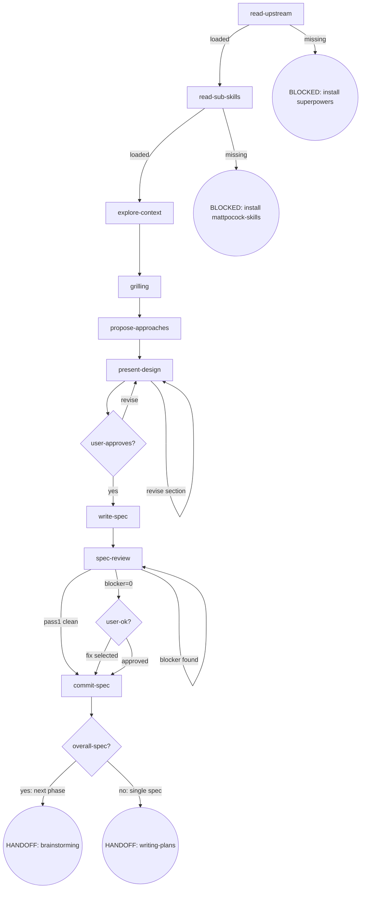

# Skill Digraph Refactor — P4: brainstorming 重构 Design Spec

- **Version**: v1.0 · 2026-08-26
- **Status**: Draft
- **Author**: [human] · Claude Opus 4.8 (osuperpowers:brainstorming dogfood session)
- **Constraints**:
  - 仓库语言政策：SKILL.md 英文主源 + zh-CN 镜像；本 spec 中文（Strategy B）
  - 路径解析 harness-agnostic：不写 `$CLAUDE_PLUGIN_ROOT` 等 harness-specific 变量
  - 行数限制：删除 per-file 守卫，保留 tier 预算（P10 re-baseline）
  - vendored 子模块不可改

---

## §1 Goals & Non-goals

### Goals

1. 将 brainstorming SKILL.md 从 HARD-GATE 十步清单 + Rules 散文 + Red Flags 三重表示重写为**节点锚定式**（digraph 唯一控制流真相源）
2. 固化 4 项程序级强化进节点/Invariants：overall→phase 路由、Review 重跑纪律、spec commit 纪律、block 政策
3. 完全符合 `docs/maintainers/skill-authoring.md` v1.0 规范
4. zh-CN 镜像同步
5. 删除 templates.test.mjs 中 per-file 行数守卫测试

### Non-goals

- 不改 brainstorming 的功能行为（除 B1/B2/B3 三项变更外）
- 不改 docs-review.md（P3 已迁移到位）
- 不改 engine / 模板代码（除 templates.test.mjs 行数守卫删除）
- 不改 overall-spec-template / phase-spec-template
- 不改 tier 预算值（P4-P9 全部完成后 P10 re-baseline）

---

## §2 Flow Digraph

### 节点清单

| ID | 类型 | 说明 |
|---|---|---|
| `read-upstream` | 操作 | 读取上游 superpowers:brainstorming SKILL.md |
| `read-sub-skills` | 操作 | 读取 mattpocock-skills grilling SKILL.md |
| `explore-context` | 操作 | 探索项目上下文 + 可选 research delegation |
| `grilling` | 操作 | 逐一追问澄清问题 |
| `propose-approaches` | 操作 | 提出 2-3 方案含 trade-off |
| `present-design` | 操作 | 逐节呈现设计 |
| `user-approves?` | 决策 | 用户是否批准设计 |
| `write-spec` | 操作 | 写入 spec 文档 |
| `spec-review` | 操作 | 3-pass spec review + Review Stopping |
| `user-ok?` | 决策 | 用户对 warn/nit 的决策 |
| `commit-spec` | 操作 | 提交 spec 文档 |
| `overall-spec?` | 决策 | overall spec 还是单 phase spec |
| HANDOFF: brainstorming | 终态 | 交接下一 phase 的 brainstorming |
| HANDOFF: writing-plans | 终态 | 交接 writing-plans |
| BLOCKED | 终态 | 上游缺失 / 子技能加载失败 |

---

## §3 Node Definitions

### `read-upstream`

- **Do**: 读取上游 `superpowers:brainstorming` SKILL.md 作为流程基线。**Read, not Skill-invoke**（Skill-invoke 触发 router 拦截）。解析策略：① 通过 harness plugin 系统定位 sibling `superpowers` plugin 内的 SKILL.md（具体路径由 harness 决定）；② 回退到同 repo 的 vendored 路径。基线仅为 SKILL.md 文件——harness 注入的 CLAUDE.md/README 不是基线
- **Read**: 上游 SKILL.md 文件
- **Exit**: 文件存在且可读 → `read-sub-skills`；缺失 → BLOCKED
- **Fail**: Skill-invoke 上游 → 违反 invariant I1

### `read-sub-skills`

- **Do**: 读取 `mattpocock-skills` 的 grilling SKILL.md，加载其框架作为 grilling 阶段执行基础。解析策略：① 通过 harness plugin 系统定位 sibling `mattpocock-skills` plugin；② 回退到同 repo 的 vendored 路径
- **Read**: grilling SKILL.md 文件
- **Exit**: 加载成功 → `explore-context`；缺失 → BLOCKED
- **Fail**: 加载失败 → BLOCKED（含安装 mattpocock-skills 指引）

### `explore-context`

- **Do**: 探索项目上下文（文件、文档、近期 commits）。如发现需要主源研究的问题 → 识别并询问用户是否触发 research → 用户确认后并行 spawn research agent（一个问题一个 agent）→ 继续探索不中断 → 进入 grilling 前等待完成 → 输出写入 `docs/research/YYYY-MM-DD-<topic>.md`
- **Read**: 项目文件、docs、git log
- **Exit**: 探索完成（research 如有则已等待完成）→ `grilling`
- **Fail**: research agent 错误/超时 → 记录 stderr，fail-open 不阻塞

### `grilling`

- **Do**: 按 grilling SKILL.md 框架逐一追问用户，每次一个问题，等待回答后继续。代码可查的事实自己查，决策留给用户
- **Read**: grilling SKILL.md 框架（从 `read-sub-skills` 加载）
- **Exit**: 达到 shared understanding → `propose-approaches`
- **Fail**: 以选项菜单/结构化列表替代 grilling 框架 → 违反 invariant（旧 Red Flag 拆入）

### `propose-approaches`

- **Do**: 提出 2-3 个方案含 trade-off 与推荐。YAGNI ruthlessly
- **Read**: grilling 收集的决策 + research findings（如有）
- **Exit**: 方案呈现完毕 → `present-design`
- **Fail**: —

### `present-design`

- **Do**: 逐节呈现设计，每节获得用户确认后再呈现下一节。节复杂度决定长度
- **Read**: 方案选择 + 全部 grilling 决策
- **Exit**: 用户全部节确认 → `user-approves?`；用户要求修改 → 修订后重新呈现该节
- **Fail**: —

### `user-approves?`

- **Do**: 判断用户对整体设计的批准状态
- **Exit**: approved → `write-spec`；revise → 回到 `present-design`
- **Fail**: —

### `write-spec`

- **Do**: 将设计写入 `docs/superpowers/specs/YYYY-MM-DD-<topic>-design.md`（overall spec 使用 overall-spec-template；phase spec 使用 phase-spec-template）
- **Read**: 全部设计决策
- **Exit**: 文件写入完成 → `spec-review`
- **Fail**: —

### `spec-review`

- **Do**: 执行 3-pass spec review（completeness / consistency&scope / clarity&YAGNI），每 pass 派发独立 `cdd-review` CLI 调用：`cdd-review --harness <name> --template spec-review --param PASS=<pass-type> --param DOC=<path>`。遵循 docs-review.md 的 D1/D2/D3 规则。Review Stopping 循环：blocker → 修复 → 仅重跑该 pass → 循环直到 blocker=0；随 blocker 复审轮出现的 warn/nit 可顺手修；单独 warn/nit 不触发重跑
- **Read**: spec 文档 + `brainstorming/docs/docs-review.md`
- **Exit**: blocker=0 → `user-ok?`（呈现 warn/nit）；Pass 1 零发现（D1 escalate-on-finding）→ 跳过后续 pass → `commit-spec`
- **Fail**: blocker=0 后重跑 review → 违反 invariant I5；为新 warn/nit 发起新 cdd-review → 违反 invariant I5

### `user-ok?`

- **Do**: 呈现 warn/nit 列表，用户选择：① Proceed to commit ② Fix selected warns/nits。Re-run is never offered after blocker=0
- **Read**: spec-review 输出的 warn/nit findings（从已有输出读取，不发新 cdd-review）
- **Exit**: proceed → `commit-spec`；fix selected → 修复后 → `commit-spec`（不重跑 review）
- **Fail**: 重跑 review → 违反 invariant I5

### `commit-spec`

- **Do**: 将 spec 文档提交到 git（design doc 获批即 commit，不等 dev 合并）
- **Read**: spec 文件路径
- **Exit**: commit 完成 → `overall-spec?`
- **Fail**: git 错误 → report + fail-open

### `overall-spec?`

- **Do**: 判断当前 spec 是 overall spec（含多 phase）还是单 phase spec
- **Exit**: overall spec → HANDOFF: brainstorming（下一 phase 的完整 brainstorm→plan→dev）；单 phase spec → HANDOFF: writing-plans
- **Fail**: overall 批准后直接进 writing-plans → 违反 overall spec boundary rule

---

## §4 Invariants

| # | Invariant | 来源 |
|---|---|---|
| I1 | **Read, not Skill-invoke** — 上游 skill 只 Read 文件，不 Skill-invoke（触发 router 拦截） | 旧 Red Flag #1 |
| I2 | **Research 需用户确认** — spawn research agent 前必须用户明确确认，不自动触发 | 旧 Red Flag #3 |
| I3 | **Design first** — 任何实施行动必须等 design 获用户批准 | HARD-GATE 核心约束 |
| I4 | **Spec commit 纪律** — spec 获批即 commit，不等 dev 合并 | Overall spec v1.4 |
| I5 | **Review Stopping** — 重跑仅由 blocker 驱动；blocker=0 后不重跑；不为获取 warn/nit 发起新 cdd-review | Overall spec v1.2-1.3 |

---

## §5 Failure Modes

| failure | behavior | reason |
|---|---|---|
| 上游 superpowers:brainstorming SKILL.md 缺失 | BLOCKED（含安装 superpowers plugin 指引） | block 政策：不静默 fallback |
| grilling SKILL.md 缺失 | BLOCKED（含安装 mattpocock-skills 指引） | block 政策：子技能缺失不降级 |
| research agent 错误/超时 | fail-open（记录 stderr，不阻塞流程） | research 是可选增强 |
| git commit 错误 | report + fail-open | 不阻塞用户审阅 spec |

---

## §6 Behavior Changes

| # | 旧行为 | 新行为 | 来源 |
|---|---|---|---|
| B1 | upstream 缺失 → graceful fallback（不报错） | upstream 缺失 → **BLOCKED**（含安装指引） | Overall spec 全局约束 |
| B2 | grilling 加载失败 → report + ask user（skip 或 abort） | grilling 加载失败 → **BLOCKED**（含安装指引） | block 政策统一 |
| B3 | `$CLAUDE_PLUGIN_ROOT` hardcode 路径解析 | harness-agnostic 解析策略描述 | 多 harness 兼容 |

---

## §7 Line Budget

- 删除 `templates.test.mjs` 中 `governance: 技能 + 模板行数上限` 测试（`skills/*/SKILL.md <= 200` + `templates/cdd/* <= 60`）
- 保留 tier 预算测试（tier1 ≤ 225 / tier2 ≤ 320）
- P4-P9 全部完成后 P10 重新实测 tier 预算值（~120% of 实测值）

---

## §8 Acceptance Criteria

1. 符合 skill-authoring.md v1.0（图节点与小节一一对应、无独立 Rules 散文堆、无独立 Red Flags 小节）
2. 上游缺失路径为显式 BLOCKED 节点含安装指引
3. grilling 加载失败 → BLOCKED（含安装指引）
4. overall→phase 路由强化在图中可见（overall 批准 → HANDOFF: brainstorming）
5. Review 重跑纪律在 spec-review 节点可见（复审回边条件 = blocker，warn/nit 不构成回边）
6. spec commit 纪律在 commit-spec 节点可见
7. zh-CN 镜像同步
8. emit + validate 绿
9. templates.test.mjs per-file 行数守卫测试删除

---

## §9 Execution Strategy

单 Task 实施（brainstorming 重写为内聚改动）：

1. 删除 templates.test.mjs `governance: 技能 + 模板行数上限` 测试
2. 重写 brainstorming SKILL.md（节点锚定式，按 §2-§6）
3. 同步 zh-CN 镜像
4. 死链检查（`subagent-lifecycle.md` 引用应已自然消除）
5. `pnpm run emit && pnpm run validate`
6. 终扫预演（P10 grep 口径对 brainstorming 目录）：
   - `grep -r 'HARD-GATE' packages/osuperpowers/skills/brainstorming/` → 预期零匹配（十步清单已删）
   - `grep -r '## Rules' packages/osuperpowers/skills/brainstorming/` → 预期零匹配（散文堆已拆）
   - `grep -r '## Red Flags' packages/osuperpowers/skills/brainstorming/` → 预期零匹配（已拆入节点 Fail + Invariants）
   - `grep -r '## Checklist' packages/osuperpowers/skills/brainstorming/` → 预期零匹配（已删）
   - `grep -r 'subagent-lifecycle' packages/osuperpowers/skills/brainstorming/` → 预期零匹配（P3 死链自然消除）

---

## Change history

- v1.0 · 2026-08-26 — 初版：12 操作/决策节点 + 3 终态 + 2 BLOCKED 的 digraph + 4 要素定义 + 5 Invariants + 4 Failure Modes + 3 行为变更 + 行数守卫删除。
