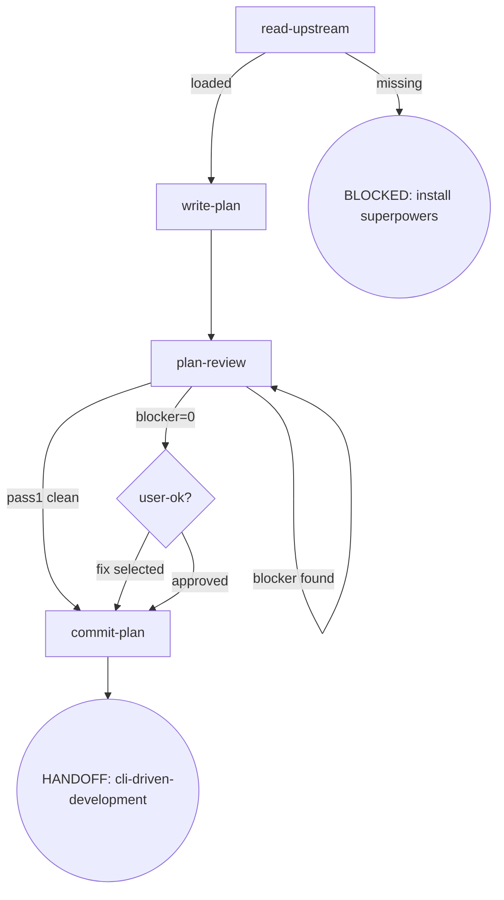

# Skill Digraph Refactor — P5: writing-plans 重构 Design Spec

- **Version**: v1.0 · 2026-08-27
- **Status**: Approved
- **Author**: [human] · Claude Opus 4.8 (osuperpowers:brainstorming dogfood session)
- **Constraints**:
  - 仓库语言政策：SKILL.md 英文主源 + zh-CN 镜像；本 spec 中文（Strategy B）
  - 路径解析 harness-agnostic：不写 `$CLAUDE_PLUGIN_ROOT` 等 harness-specific 变量
  - vendored 子模块不可改

---

## §1 Goals & Non-goals

### Goals

1. 将 writing-plans SKILL.md 从 Checklist + Rules 散文 + Red Flags 三重表示重写为**节点锚定式**（digraph 唯一控制流真相源）
2. 删除 to-tickets 子技能依赖（CDD 模式下冗余）及 Tickets Publish Redirect 规则
3. 删除 Read Sub-Skills 规则（无子技能依赖）
4. 固化 2 项程序级强化进节点/Invariants：Review 重跑纪律、plan commit 纪律
5. 路径解析 harness-agnostic（与 P4 一致）
6. 上游缺失为 BLOCKED 节点
7. 完全符合 `docs/maintainers/skill-authoring.md` v1.0 规范
8. zh-CN 镜像同步
9. 修复 `spawnCapture` 的 subagent model env 泄漏（`CLAUDE_CODE_SUBAGENT_MODEL` 从父进程继承到嵌套 CLI session，导致嵌套 CLI 使用非预期模型）

### Non-goals

- 不改 writing-plans 的功能行为（除 §6 行为变更外）
- 不改 docs-review.md（P3 已迁移到位）
- 不改 engine / 模板代码
- 不改 overall-spec-template / phase-spec-template
- 不改 tier 预算值

---

## §2 Flow Digraph

### 节点清单

| ID | 类型 | 说明 |
|---|---|---|
| `read-upstream` | 操作 | 读取上游 superpowers:writing-plans SKILL.md |
| `write-plan` | 操作 | 逐节写入 plan（含 scope-check + self-review） |
| `plan-review` | 操作 | 3-pass plan-review + Review Stopping |
| `user-ok?` | 决策 | 用户对 warn/nit 的决策 |
| `commit-plan` | 操作 | 提交 plan 文档 |
| HANDOFF: cli-driven-development | 终态 | 交接 CDD 执行 |
| BLOCKED | 终态 | 上游缺失 |

---

## §3 Node Definitions

### `read-upstream`

- **Do**: 读取上游 `superpowers:writing-plans` SKILL.md 作为流程基线。**Read, not Skill-invoke**（Skill-invoke 触发 router 拦截——I1）。解析策略：① 通过 harness plugin 系统定位 sibling `superpowers` plugin 内的 SKILL.md；② 回退到同 repo 的 vendored 路径。基线仅为 SKILL.md 文件——harness 注入的 CLAUDE.md/README 不是基线
- **Read**: 上游 SKILL.md 文件
- **Exit**: 文件存在且可读 → `write-plan`；缺失 → BLOCKED
- **Fail**: Skill-invoke 上游 → 违反 I1

### `write-plan`

- **Do**: 逐节写入 plan 到 `docs/superpowers/plans/YYYY-MM-DD-<feature>.md`。每节一次 tool call（Section-by-Section）。写入前执行 scope-check（如 spec 覆盖多子系统，建议拆分为独立 plans）。全部节写完后一次性呈现给用户。含 self-review（spec 覆盖检查 + placeholder 扫描 + 类型一致性）
- **Read**: 已批准的 spec 文档 + 上游 plan 模板结构
- **Exit**: plan 写入完成 + self-review 通过（self-review 发现的问题 inline 修复，不循环、不传递给 plan-review）→ `plan-review`
- **Fail**: 一次性批量写入 → 违反 I2

### `plan-review`

- **Do**: 执行 3-pass plan-review（completeness & spec alignment / task decomposition / buildability & type consistency），每 pass 派发独立 `cdd-review` CLI 调用：`cdd-review --harness <name> --template plan-review --param PASS=<pass-type> --param DOC=<path> --param SPEC=<spec-path>`。遵循 docs-review.md 的 D1/D2/D3 规则。Review Stopping：① run 3-pass → ② blocker → fix → re-run only that pass → loop until blocker=0 → ③ all blocker=0 → present warn/nit → proceed。Pass 1 零发现（D1）→ skip subsequent passes → `commit-plan`
- **Read**: plan 文档 + spec 文档 + [docs-review.md](../brainstorming/docs/docs-review.md)
- **Exit**: blocker=0 → `user-ok?`（呈现 warn/nit）；Pass 1 clean（D1）→ skip to `commit-plan`
- **Fail**: blocker=0 后重跑 review → 违反 I4；为新 warn/nit 发起新 cdd-review → 违反 I4

### `user-ok?`

- **Do**: 呈现 warn/nit 列表，用户选择：① Proceed to Execution Handoff ② Fix selected warns/nits。Re-run is never offered after blocker=0
- **Read**: plan-review 输出的 warn/nit findings（从已有输出读取，不发新 cdd-review）
- **Exit**: proceed → `commit-plan`；fix selected → 执行修复（中间步骤，不建模为独立节点）→ `commit-plan`（不重跑 review）
- **Fail**: 重跑 review → 违反 I4

### `commit-plan`

- **Do**: 将 plan 文档提交到 git。Plan 获批即 commit（I3），不等 dev 合并
- **Read**: plan 文件路径
- **Exit**: commit 完成 → HANDOFF: cli-driven-development
- **Fail**: git 错误 → report + fail-open

---

## §4 Invariants

| # | Invariant | 来源 |
|---|---|---|
| I1 | **Read, not Skill-invoke** — 上游 skill 只 Read 文件，不 Skill-invoke（触发 router 拦截） | 旧 Red Flag #3 |
| I2 | **Section-by-Section** — plan 逐节写入，每节一次 tool call；写入粒度与确认时机解耦 | 旧 Rule: Section-by-Section |
| I3 | **Plan commit 纪律** — plan 获批即 commit，不等 dev 合并 | Overall spec v1.4 |
| I4 | **Review Stopping** — 重跑仅由 blocker 驱动；blocker=0 后不重跑；不为获取 warn/nit 发起新 cdd-review | Overall spec v1.2-1.3 |

---

## §5 Failure Modes

| failure | behavior | reason |
|---|---|---|
| 上游 superpowers:writing-plans SKILL.md 缺失 | BLOCKED（含安装 superpowers plugin 指引） | block 政策：不静默 fallback |
| git commit 错误 | report + fail-open | 不阻塞用户审阅 plan |

---

## §6 Behavior Changes

| # | 旧行为 | 新行为 | 来源 |
|---|---|---|---|
| B1 | upstream 缺失 → graceful fallback（不报错） | upstream 缺失 → **BLOCKED**（含安装指引） | Overall spec 全局约束 |
| B2 | `Rule: Read Sub-Skills` 引用 to-tickets（按需加载） | **删除**——CDD 模式下 to-tickets 冗余（plan tasks = CDD tasks） | P5 grilling Q2 |
| B3 | `Rule: Tickets Publish Redirect`（发布 tickets 到本地文件） | **删除**——CDD 直接消费 plan tasks | P5 grilling Q2 |
| B4 | `$CLAUDE_PLUGIN_ROOT` 间接引用（via brainstorming anchor） | harness-agnostic 解析策略描述 | 多 harness 兼容 |
| B5 | `## Checklist` 六步清单 + `## Rules` 散文堆 + `## Red Flags` 规则汤 | **删除**——控制流由 digraph 承载，规则归入节点/Invariants | skill-authoring.md v1.0 |

---

## §7 Acceptance Criteria

1. 符合 skill-authoring.md v1.0（图节点与小节一一对应、无独立 Rules 散文堆、无独立 Red Flags 小节、无 Checklist）
2. 上游缺失路径为显式 BLOCKED 节点含安装指引
3. 3-pass 循环回边标注 blocker found / blocker=0 / pass1 clean
4. Review 重跑纪律在 plan-review 节点可见（复审回边条件 = blocker，warn/nit 不构成回边）
5. plan commit 纪律在 commit-plan 节点可见
6. to-tickets 依赖完全移除（Rule: Read Sub-Skills + Rule: Tickets Publish Redirect + 相关 Red Flags）
7. zh-CN 镜像同步
8. emit + validate 绿
9. CDD execution: workspace 存在 + 全 task handoff.json + ledger 全 APPROVED + Final Review 产物
10. `spawnCapture` env 泄漏修复：嵌套 CLI session 不继承 `CLAUDE_CODE_SUBAGENT_MODEL`

---

## §8 Execution Strategy

单 Task 实施（writing-plans 重写 + env 修复为内聚改动）：

1. 修复 `spawnCapture` 的 `CLAUDE_CODE_SUBAGENT_MODEL` env 泄漏（`runner.mjs`：spawn 前删除 subagent env vars）
2. 重写 writing-plans SKILL.md（节点锚定式，按 §2-§6）
2. 同步 zh-CN 镜像
3. 更新 cross-skill anchor 引用（实施时 `grep -rn 'writing-plans/SKILL.md#' packages/osuperpowers/skills/` 确定引用范围，对齐旧 anchor → 新节点 ID）
4. `pnpm run emit && pnpm run validate`
5. 终扫预演（legacy-pattern 消除 greps——来自 overall spec P10 终扫定义，对 writing-plans 目录验证旧格式关键词已清零）：
   - `grep -r 'HARD-GATE' packages/osuperpowers/skills/writing-plans/` → 预期零匹配
   - `grep -r '## Rules' packages/osuperpowers/skills/writing-plans/` → 预期零匹配
   - `grep -r '## Red Flags' packages/osuperpowers/skills/writing-plans/` → 预期零匹配
   - `grep -r '## Checklist' packages/osuperpowers/skills/writing-plans/` → 预期零匹配
   - `grep -r 'to-tickets' packages/osuperpowers/skills/writing-plans/` → 预期零匹配
   - `grep -r 'Tickets Publish' packages/osuperpowers/skills/writing-plans/` → 预期零匹配
   - `grep -r 'Read Sub-Skills' packages/osuperpowers/skills/writing-plans/` → 预期零匹配

---

## Change history

- v1.0 · 2026-08-27 — 初版：5 操作/决策节点 + 1 终态 + 1 BLOCKED 的 digraph + 4 要素定义 + 4 Invariants + 2 Failure Modes + 5 行为变更 + to-tickets 删除。含 spawnCapture env 泄漏修复（CLAUDE_CODE_SUBAGENT_MODEL 从父进程继承到嵌套 CLI session）。
