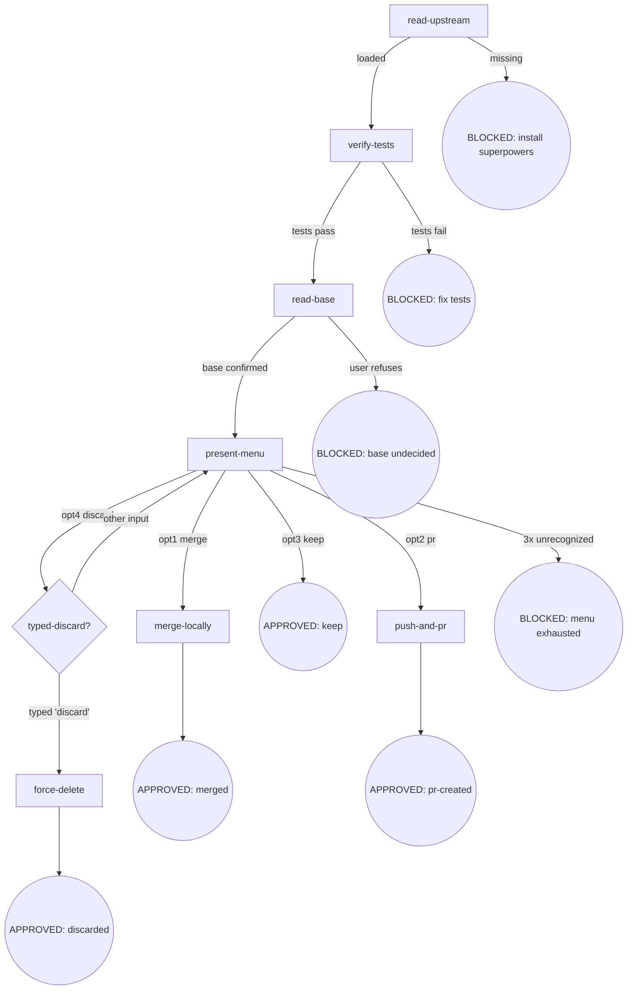

# Skill Digraph Refactor — P6: finishing 重构 Design Spec

- **Version**: v1.0 · 2026-08-27
- **Status**: Approved
- **Author**: [human] · Claude Opus 4.8 (osuperpowers:brainstorming dogfood session)
- **Constraints**:
  - 仓库语言政策：SKILL.md 英文主源 + zh-CN 镜像；本 spec 中文（Strategy B）
  - 路径解析 harness-agnostic：不写 `$CLAUDE_PLUGIN_ROOT` 等 harness-specific 变量
  - vendored 子模块不可改

---

## §1 Goals & Non-goals

### Goals

1. 将 finishing SKILL.md 从 Checklist + Rules 散文 + Red Flags 三重表示重写为**节点锚定式**（digraph 唯一控制流真相源）
2. 固化 No Worktrees / Conventional Commits 为 **Invariants**（worktree 是开发前决策，不属于 finishing 控制流；commit/PR 格式为输出契约）
3. 将上游隐式 discard 选项提升为显式菜单第 4 项 + `typed-discard?` decision 节点
4. `merge-locally` 成功后**自动删除 feature 分支**（上游原有行为，显式声明）
5. **提取 determine-base 为共享文档**（`cli-driven-development/docs/base-branch.md`）+ workspace artifact（`base-branch.json`），finishing 消费、CDD 后续补生产（P8）
6. 路径解析 harness-agnostic（与 P4/P5 一致）
7. 上游缺失为 BLOCKED 节点
8. 完全符合 `docs/maintainers/skill-authoring.md` v1.0 规范
9. zh-CN 镜像同步（finishing SKILL.md + base-branch.md）

### Non-goals

- 不改上游 vendored `superpowers:finishing-a-development-branch` SKILL.md
- 不改 CDD engine（finishing 不 dispatch CDD）
- 不增加 worktree 检测节点（worktree 是前置违规，由 Invariant I1 声明不处理）
- 不改 P8 的 CDD 启动 determine-base（P6 只产出共享文档 + artifact schema，P8 负责 CDD 端生产）
- 不改 merge commit 的 conventional commits 格式语义

---

## §2 Flow Digraph



### 节点清单

| ID | 类型 | 说明 |
|---|---|---|
| `read-upstream` | 操作 | 读上游 superpowers:finishing-a-development-branch SKILL.md |
| `verify-tests` | 操作 | 运行测试套件（finishing 首节点） |
| `read-base` | 操作 | 读/问 base 分支 + 写入 `base-branch.json` artifact |
| `present-menu` | 操作 | 呈现 4 选项菜单（merge / pr / keep / discard） |
| `merge-locally` | 操作 | checkout base → merge → verify → auto-delete branch |
| `push-and-pr` | 操作 | push + 创建 PR（含 Conventional Commits 契约） |
| `force-delete` | 操作 | git branch -D（typed-discard 确认后） |
| `typed-discard?` | 决策 | 字面量 "discard" 校验 |
| BLOCKED: install superpowers | 终态 | 上游缺失 |
| BLOCKED: fix tests | 终态 | 测试失败 |
| BLOCKED: base undecided | 终态 | base 分支未决（用户拒绝确认） |
| BLOCKED: menu exhausted | 终态 | 菜单无效输入达 3 次上限 |
| 4 × APPROVED | 终态 | merged / pr-created / keep / discarded |

---

## §3 Node Definitions

### `read-upstream`

- **Do**: 读取上游 `superpowers:finishing-a-development-branch` SKILL.md 作为流程基线。**Read, not Skill-invoke**（Skill-invoke 触发 router 拦截——I3）。解析策略：① 通过 harness plugin 系统定位 sibling `superpowers` plugin 内的 SKILL.md；② 回退到同 repo 的 vendored 路径。基线仅为 SKILL.md 文件——harness 注入的 CLAUDE.md / README / vendor 贡献指南不是基线
- **Read**: 上游 SKILL.md 文件
- **Exit**: 文件存在且可读 → `verify-tests`；缺失 → BLOCKED（install superpowers plugin）
- **Fail**: Skill-invoke 上游 → 违反 I3

### `verify-tests`

- **Do**: 运行项目完整测试套件（npm test / cargo test / pytest / go test ./... 等，依项目配置）。测试套件通过后才进入 finishing 流程。**项目无测试配置**（无 `scripts.test` / 无 `Cargo.toml` / 无 `pyproject.toml` 测试段等）→ 视为通过（项目本身不要求测试，finishing 不强制添加测试门槛）
- **Read**: 项目测试配置（package.json scripts / Cargo.toml / pyproject.toml 等）
- **Exit**: 全绿（或无测试配置）→ `read-base`；任何失败 → BLOCKED（fix tests）
- **Fail**: "测试之前通过过" → 仍以当前树为准重跑；不基于历史结果跳过

### `read-base`

- **Do**: 确定 base 分支（merge / PR 的目标分支）。读取 workspace artifact `.superpowers/<scope>/<slug>/base-branch.json`（详见 [base-branch.md](../cli-driven-development/docs/base-branch.md) 方法论 + schema）；artifact 缺失（standalone finishing 场景）→ **按顺序尝试以下推断源，取首个可确定 base 的来源**：① plan 文档（`base` 字段）② branch upstream（`git rev-parse --abbrev-ref @{u}` 解析）③ 对话上下文（历史消息明确提及的 base）；**均无法确定 → 询问用户确认** → 写入 artifact。**Scope 解析**：CDD-driven 场景 scope = `cdd`，slug = CDD workspace 的 slug；standalone 场景 scope = `standalone`，slug = feature branch 名 sanitize。**Slug sanitize 规则**：lowercase → 非 alphanumeric 字符（`/`、空格、`_`、`.` 等）替换为 `-` → 前后 `-` trim → 连续 `-` 合并 → 截 64 字符。例：`feature/my-branch` → `feature-my-branch`；`Bugfix/UI_Fix` → `bugfix-ui-fix`；`refs/heads/release-2026.08` → `refs-heads-release-2026-08`
- **Read**: `.superpowers/{cdd,standalone}/<slug>/base-branch.json`（可选）+ plan 文档 + `git rev-parse --abbrev-ref @{u}` + 对话上下文
- **Exit**: base 已确认（artifact 存在或本次写入）→ `present-menu`
- **Fail**: 用户拒绝确认 → BLOCKED（base undecided，不继续 merge/PR）

### `present-menu`

- **Do**: 呈现 4 选项菜单（normal-repo variant，固定——I1 No Worktrees）：
  ```
  Implementation complete. What would you like to do?
  1. Merge back to <base-branch> locally
  2. Push and create a Pull Request
  3. Keep the branch as-is (I'll handle it later)
  4. Discard this work
  Which option?
  ```
  等待用户选择
- **Read**: `base-branch.json`（取 base 名称填入 opt1 提示）
- **Exit**: opt1 → `merge-locally`；opt2 → `push-and-pr`；opt3 → APPROVED: keep；opt4 → `typed-discard?`
- **Fail**: 未收到明确选项 → 重呈现，**累计最多 3 次呈现机会（含首次呈现）**；typed-discard? 回退计入此计数器（不重置）；3 次机会耗尽 → BLOCKED（menu exhausted）

### `merge-locally`

- **Do**: checkout base → pull → merge feature → 在 merged 结果上 verify-tests。全绿后：`git branch -d <feature-branch>`（自动删除 feature 分支）。遵循 I2：merge commit 标题为 conventional commits 格式，无 attribution
- **Read**: `base-branch.json`（base 名称）+ feature branch 名称（`git rev-parse --abbrev-ref HEAD`）
- **Exit**: merged + tests green + branch deleted → APPROVED: merged
- **Fail**: merge conflict 或 merged-result tests fail → **implicit fail-open**（不产出 APPROVED，不进入显式 BLOCKED 节点；流程停手 + report 给用户；**base 分支保留 merge commit（不 `git reset --hard HEAD~1` 回滚）+ feature branch 保留**；本地 merge 未推送，用户可调查后决策：`git reset --hard HEAD~1` 回滚 / 修复测试后重跑 finishing / 手动处理）

### `push-and-pr`

- **Do**: `git push -u origin <feature-branch>` + 创建 PR（目标 = base-branch.json 的 base）。PR 标题 = conventional commits 格式；PR body 仅 `## Summary` + `## Test Plan`；无 attribution sections / trailers / footers（I2）。若 repo 存在 PR 模板（`.github/PULL_REQUEST_TEMPLATE.md` 等），按模板结构填充 Summary/Test Plan 段落；否则使用最小 body。遵循 forge CLI（`gh pr create` / `glab mr create` 等）或 forge 默认 URL
- **Read**: `base-branch.json`（base）+ feature branch + PR 模板（如存在）
- **Exit**: PR 创建成功 → APPROVED: pr-created（输出 URL）
- **Fail**: push rejected（remote 前进）或 PR 创建失败 → **implicit fail-open**（不产出 APPROVED，不进入显式 BLOCKED 节点；流程停手 + report 给用户含具体原因与恢复指引；feature branch 保留）

### `force-delete`

- **Do**: 前置检查 feature 分支未提交改动（`git status --porcelain` + `git log @{u}..HEAD`）；有未提交/未推送改动 → 呈现 commit list + reflog 恢复指引 → 要求用户再次确认（typed-discard 仅确认删除意图，不覆盖数据丢失告知）。通过后 `git branch -D <feature-branch>`。保留工作树（No Worktrees invariant 跳过 cleanup）
- **Read**: feature branch 名称 + `git status` + `git log @{u}..HEAD`
- **Exit**: branch deleted → APPROVED: discarded
- **Fail**: branch 不存在 → report + 仍视为 APPROVED（用户意图已满足）；**用户拒绝数据丢失确认 → 回退 `present-menu`（计数不重置）**

### `typed-discard?`

- **Do**: 要求用户键入字面量 `discard` 确认删除。呈现：
  ```
  This will permanently delete:
  - Branch <name>
  - All commits: <commit-list>
  Type 'discard' to confirm.
  ```
  仅 `discard`（大小写敏感、无前后空白）接受；任何其他输入（`yes` / `y` / `Discard` / `discard `）→ 回退 `present-menu`（present-menu 的重试计数器**不重置**，typed-discard 回退计入 present-menu 的 3 次呈现上限；**若回退时计数器已耗尽 → BLOCKED: menu exhausted，不再呈现菜单**）
- **Read**: 用户输入
- **Exit**: 输入 === `"discard"` → `force-delete`；其他 → `present-menu`（重试，计数不重置）
- **Fail**: —（回退不是失败，是设计内行为）

---

## §4 Invariants

| # | Invariant | 来源 |
|---|---|---|
| I1 | **No Worktrees** — 跳过上游 worktree 检测块与 Step 6 cleanup；菜单固定 normal-repo variant；worktree 状态属前置违规（不在 finishing 处理） | 旧 Rule: No Worktrees（grilling Q1 提升为 invariant） |
| I2 | **Conventional Commits + No Attribution** — merge commit / PR title 遵循 conventional commits；无 trailers / footers / inline attribution；PR body 仅 `## Summary` + `## Test Plan` | 旧 Rule: Conventional Commits |
| I3 | **Read, not Skill-invoke** — 上游 skill 只 Read 文件，不 Skill-invoke（触发 router 拦截） | 旧 Red Flag "Skill-invoke upstream" |

---

## §5 Failure Modes

集中列出跨节点的失败行为映射（与 Node Fail 字段互补）：

| failure | behavior | reason |
|---|---|---|
| 上游 superpowers:finishing-a-development-branch SKILL.md 缺失 | BLOCKED（含安装 superpowers plugin 指引） | block 政策：不静默 fallback |
| 测试套件失败 | BLOCKED（fix tests 后再跑 finishing） | 不基于历史结果跳过；不合并/PR 红灯分支 |
| base 分支未决（用户拒绝确认） | BLOCKED | merge 到错误 base 代价高 |
| 菜单无效输入达 3 次上限 | BLOCKED（menu exhausted） | 无法获取用户决策 |
| merge conflict | **implicit fail-open**（停手 + report，feature branch 保留，用户手动解决后重跑 finishing） | 不自动解决冲突 |
| merged-result 测试失败 | **implicit fail-open**（停手 + report，base 分支**保留 merge commit 不回滚**，feature branch 保留） | 不自动假设 flaky；本地 merge 未推送，用户可调查后决策（reset / 修复后重跑 / 手动处理） |
| push rejected（remote 前进） | **implicit fail-open**（停手 + report，不 force-push） | 需用户决策（rebase / force-push） |
| PR 创建失败 | **implicit fail-open**（停手 + report URL + 指引手动创建） | 不阻塞分支保留 |

**Fail-open vs BLOCKED 约定**：

- **BLOCKED**：显式终态节点（digraph 圆角圆），需用户介入才能恢复 flow，对应 digraph 边
- **implicit fail-open**：节点级失败（不出现在 digraph），流程停手 + report 给用户；不产出 APPROVED；用户手动恢复后重跑 finishing（不恢复当前 flow）

---

## §6 Behavior Changes

| # | 旧行为 | 新行为 | 来源 |
|---|---|---|---|
| B1 | upstream 缺失 → graceful fallback（不报错） | upstream 缺失 → **BLOCKED**（含安装指引） | Overall spec 全局约束 |
| B2 | discard 隐式第 4 选项（上游：不在菜单，仅响应用户主动请求） | 显式菜单第 4 选项 + `typed-discard?` decision 节点（字面量 "discard" 校验） | P6 grilling Q3 |
| B3 | merge 后无显式分支删除（当前 osuperpowers 未声明；上游有 `git branch -d`） | `merge-locally` 成功后**自动** `git branch -d` feature 分支 | P6 grilling Q5 |
| B4 | `## Checklist` + `## Rules` 散文堆 + `## Red Flags` 规则汤 | **删除**——控制流由 digraph 承载，规则归入节点/Invariants | skill-authoring.md v1.0 |
| B5 | `No Worktrees` 作为 Rule（含"accidentally detected → STOP"兜底违规检测） | → **Invariant I1**（worktree 是开发前决策，finishing 只需声明"跳过上游 worktree 检测块与 cleanup"） | P6 grilling Q1 |
| B6 | `determine-base` 为 finishing 独占节点（上游 Step 3） | 提取为共享文档 `cli-driven-development/docs/base-branch.md` + workspace artifact `base-branch.json`；finishing 通过 `read-base` 节点消费 | P6 grilling Q6（用户建议） |
| B7 | `$CLAUDE_PLUGIN_ROOT` 间接引用（via 跨 skill anchor） | harness-agnostic 解析策略描述 | 多 harness 兼容 |

---

## §7 Acceptance Criteria

1. 符合 skill-authoring.md v1.0（图节点与小节一一对应、无独立 Rules 散文堆、无独立 Red Flags 小节、无 Checklist）
2. 上游缺失路径为显式 BLOCKED 节点含安装指引
3. 4 选项显式入 digraph（menu hub + `typed-discard?` decision）
4. `typed-discard?` 节点要求字面量 `"discard"`（大小写敏感、无前后空白），非字面量输入回退 `present-menu`
5. No Worktrees 在 Invariants 声明（不在节点）
6. Conventional Commits + No Attribution 在 Invariants 声明
7. `merge-locally` 成功后**自动** `git branch -d` feature 分支
8. `read-base` 节点消费 `base-branch.json` artifact（fallback 询问用户 → 写入 artifact）
9. 共享文档 `cli-driven-development/docs/base-branch.md` + `.zh-CN.md` 产出（artifact schema + 方法论）
10. finishing `SKILL.zh-CN.md` 同步
11. emit + validate 绿
12. CDD execution: workspace 存在 + 全 task handoff.json + ledger 全 APPROVED + Final Review 产物（`cdd-review.mjs --template branch-review` 的 handoff JSON + 其输出的 findings 列表，由 cli-driven-development Rule: Final Review 产出；产物存在性检查，不要求端到端冒烟——P6 的 finishing 重写不触发 CDD，但 P6 dev 阶段本身必须由 CDD engine 执行，即自举验证）

---

## §8 Execution Strategy

**3 Task 实施（shared docs + finishing 重写为内聚改动）**：

### Task 1：共享文档产出

- 新建 `packages/osuperpowers/skills/cli-driven-development/docs/base-branch.md`：
  - base 分支推断方法论（plan 字段 / branch upstream / 对话上下文）
  - 何时询问用户确认
  - artifact schema：`{ base, source: "plan-field" | "branch-upstream" | "user-confirmed", confirmed_at }`
  - 跨 skill 消费方式（CDD 启动写入 / finishing 读取）
- 新建 `base-branch.zh-CN.md`（中文镜像）

### Task 2：finishing 重写

- 重写 `packages/osuperpowers/skills/finishing/SKILL.md`（节点锚定式，按 §2-§5）
- 同步 `SKILL.zh-CN.md`
- 更新 cross-skill anchor 引用：`grep -rn 'finishing/SKILL.md#' packages/osuperpowers/skills/` 确定引用范围，对齐旧 anchor → 新节点 ID。**预期零匹配**——当前无其他 skill deep-link 到 finishing 节点，本步骤是 safety sweep 而非 actionable discovery
- 检查 `cli-driven-development/SKILL.md` 是否需要预留 `base-branch.json` 写入接口（P8 负责生产，P6 不强制）

### Task 3：emit + validate + 终扫

- `pnpm run emit && pnpm run validate`
- 终扫预演（legacy-pattern 消除 greps——对 finishing 目录验证旧格式关键词已清零）：
  - `grep -r 'HARD-GATE' packages/osuperpowers/skills/finishing/` → 预期零匹配
  - `grep -r '## Rules' packages/osuperpowers/skills/finishing/` → 预期零匹配
  - `grep -r '## Red Flags' packages/osuperpowers/skills/finishing/` → 预期零匹配
  - `grep -r '## Checklist' packages/osuperpowers/skills/finishing/` → 预期零匹配
  - `grep -r 'worktree remove' packages/osuperpowers/skills/finishing/` → 预期零匹配
  - `grep -r 'worktree prune' packages/osuperpowers/skills/finishing/` → 预期零匹配
  - `grep -r 'Rule: ' packages/osuperpowers/skills/finishing/` → 预期零匹配

### Atomic commits（3 个）

1. `docs: add P6 finishing design spec + sync overall spec v1.11`（spec + overall 同步，同 commit）
2. `docs: add shared base-branch methodology doc under cli-driven-development/docs (P6)`（Task 1）
3. `refactor: rewrite finishing to node-anchored format (P6)`（Task 2 + Task 3 的 emit + validate，含 .agents/ 衍生）

---

## Change history

- v1.0 · 2026-08-27 — 初版：8 操作/决策节点 + 4 BLOCKED + 4 APPROVED 终态的 digraph + 3 Invariants + 7 Failure Modes + 7 行为变更 + determine-base 提取为共享文档 + overall spec v1.11 同步。
