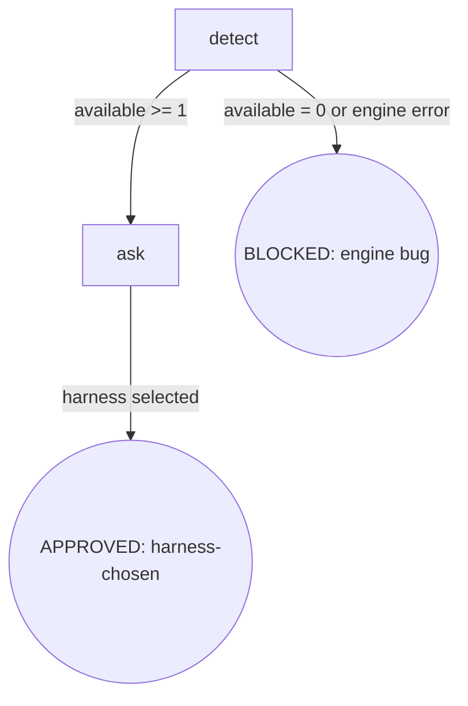

# Skill Digraph Refactor — P7: cli-select 重构 Design Spec

- **Version**: v1.1.1 · 2026-08-27
- **Status**: Approved
- **Author**: [human] · Claude Opus 4.8 (osuperpowers:brainstorming dogfood session)
- **Constraints**:
  - 仓库语言政策：SKILL.md 英文主源 + zh-CN 镜像；本 spec 中文（Strategy B）
  - 路径解析 harness-agnostic：不写 `$CLAUDE_PLUGIN_ROOT` 等 harness-specific 变量
  - vendored 子模块不可改

---

## §1 Goals & Non-goals

### Goals

1. 将 cli-select SKILL.md 从 Rules 散文 + Red Flags 重写为**节点锚定式**（digraph 唯一控制流真相源）
2. 将"空 harness 列表"与"引擎脚本执行失败"合并为同一 BLOCKED 终态，明确语义为**引擎 bug 信号**（orchestrator 宿主 harness 必然存在）
3. 在 Failure Modes 表固化 `osuperpowers:report-issue` 上报路径，把 P5/P6 dogfood 的闭环模式正式纳入 P7
4. 固化"仅 `--harness <name>` 显式参数传播"为 Invariant I1（含引擎侧禁止隐式环境变量）
5. 同步更新 cli-driven-development SKILL.md + .zh-CN.md 的跨 skill anchor（`#rule-ask` → `#ask`）
6. zh-CN 镜像同步（cli-select SKILL.md）
7. 完全符合 `docs/maintainers/skill-authoring.md` v1.0 规范
8. **防止同类问题再发生（preventive fix）**：强化 `overall-spec-template.md` 的 Issue inventory 更新规则 + brainstorming SKILL.md 的 `commit-spec` 节点 Do 字段，确保未来任何 phase 在"发现新 issue"或"提前消费其他 phase 的 issue"时都不会漏更 Issue inventory

### Non-goals

- 不改 `cdd-select.mjs` 引擎脚本（引擎行为不在 P7 范围；P1 已稳定 workspace 解析）
- 不抽取共享文档（cli-select 足够简单，无需 docs 子目录）
- 不动 osuperpowers-router 映射（cli-select 不经过 router）
- 不动 P8 的 CDD 启动 harness 选择逻辑（P7 只改 cli-select 技能正文；P8 负责 CDD 端消费）

---

## §2 Flow Digraph

### 节点清单

| ID | 类型 | 说明 |
|---|---|---|
| `detect` | 操作 | 运行 `cdd-select.mjs` + 解析 3 行输出 |
| `ask` | 操作 | 呈现 available 选项 + 用户选择 + 返回所选 harness 名 |
| BLOCKED: engine bug | 终态 | `available=0` 或引擎脚本执行失败（bug 信号） |
| APPROVED: harness-chosen | 终态 | 用户选定 harness，调用方获得 `--harness <name>` 值 |

### 图说明

- 线性链：detect → ask → APPROVED，仅两个分支
- BLOCKED 挂在 detect 出口（available=0 或脚本失败）
- ask 节点没有 retry 分支（用户选择是终态）
- APPROVED 为隐式终态（ask 节点 Exit 字段即返回值，无独立节点）

---

## §3 Node Definitions

### `detect`

- **Do**: 运行 `{plugin_root}/bin/engine/cdd-select.mjs` 发现可用 harness，解析 3 行输出：
  - `available:<csv>` — `channel=install-and-use` 且已安装的 harness（参与推荐 + 用户选择；文档中称 "full harness"）
  - `unsupported_installed:<csv>` — `channel≠install-and-use` 但已安装（提示性，不参与推荐；文档中称 "not-supported harness"）
  - `recommended:<name>` — 推荐默认（引擎按优先级 `droid > pi > current harness > alphabetical` 计算）
- **Read**: `{plugin_root}/bin/engine/cdd-select.mjs` 的 stdout（3 行固定格式）
- **Exit**: `available` 列表含至少 1 项 → `ask`；`available` 为空 或 脚本执行失败（non-zero exit）→ BLOCKED（engine bug）
- **Fail**: Node.js 错误 / 脚本不存在 / exit 非 0/1 → 同 BLOCKED（engine bug）；恢复操作见 Failure Modes 表

### `ask`

- **Do**: 使用 `AskUserQuestion`（或 harness 等效工具）列出 `available` 各项；**推荐项标记 `(Recommended)` 并置于选项首位**；等待用户选择。选定后，把所选 harness 名返回给调用方，作为调用方下游 `cdd-task.mjs --harness <name>` 的显式参数。**禁止**通过环境变量隐式传播（I1）
- **Read**: `available` 列表 + `recommended` 字段（来自 detect 节点输出）
- **Exit**: 用户选定 1 项 → APPROVED（harness-chosen，返回所选名）
- **Fail**: `AskUserQuestion` 不可用 / 用户取消选择 → 视为用户侧取消，不计入 Failure Modes（由调用方决定 fallback）

---

## §4 Invariants

| # | Invariant |
|---|---|
| I1 | **Explicit Propagation** — 所选 harness 仅以 `--harness <name>` 显式 CLI 参数传播给下游（`cdd-task.mjs` / `cdd-review.mjs`）；**禁止** skill 层与引擎层任何形式的隐式环境变量传递（`CDD_HARNESS` / `HARNESS_NAME` 等均不允许）。**引擎现状确认**：`cdd-select.mjs` 当前仅读取 `CURSOR_TRACE_ID` / `CLAUDE_CODE_SESSION_ID` / `AI_AGENT` 等"宿主 harness 检测"用途的环境变量（仅识别宿主身份，不选择目标 harness）；不读取任何 harness 选择类 env var，故 I1 引擎层约束为现状确认，无需引擎改动 |

---

## §5 Failure Modes

集中列出跨节点的失败行为映射（与 Node Fail 字段互补）：

| failure | behavior | reason | recovery |
|---|---|---|---|
| `available:` 为空 | BLOCKED（engine bug） | orchestrator 运行所在 harness 必然存在（`detectCurrentHarness` 应至少识别宿主）；空列表 = 引擎检测 bug 信号，非用户侧缺失 | 调用 `osuperpowers:report-issue` 上报；label `bug, dogfood, osuperpowers`（按 #136 fix 后的组件分类规则） |
| `cdd-select.mjs` 执行失败 | BLOCKED（同上） | 引擎脚本执行失败 = 引擎 bug（workspace 解析已在 P1 稳定，非预期场景） | 调用 `osuperpowers:report-issue` 上报；label 同上 |

**Failure Modes 表扩展**：相比 P6 模式（仅 failure / behavior / reason 三列），P7 新增 **recovery 列**——专门承载 report-issue 上报路径。这是 P5/P6 dogfood 经验的固化：把"上报 bug"作为 BLOCKED 的标准恢复操作，而非可选的善后步骤。

**Fail-open vs BLOCKED 约定**（与 P6 一致）：

- **BLOCKED**：显式终态节点（digraph 圆角圆），需用户介入恢复，对应 digraph 边
- **implicit fail-open**：节点级失败（不在 digraph 中），流程停手 + report 给用户

cli-select 没有 implicit fail-open 场景——所有失败都路由到显式 BLOCKED 节点。

---

## §6 Behavior Changes

| # | 旧行为 | 新行为 | 来源 |
|---|---|---|---|
| B1 | `## Rules` 散文堆 + `## Red Flags` 规则汤 | **删除**——控制流由 digraph 承载，规则归入节点 / Invariants | skill-authoring.md v1.0 |
| B2 | `osuperpowers-router` label 硬编码（report-issue 当前行为） | **P7 提前消费 P9 fix（#136）**——report-issue recovery 使用组件分类后的 label（`osuperpowers`） | Issue #136 |

> **B2 timing 说明**：#136 引擎层面修复（report-issue Rule: Automatic Labels 改为组件分类逻辑）归属 P9，P7 期间尚未合并。P7 spec 的 recovery label 声明的是**目标 label**（`bug, dogfood, osuperpowers`），实际生效依赖 P9 #136 fix 落地。在 P9 之前执行 P7 cli-select BLOCKED recovery 时，report-issue 仍会硬编码 `osuperpowers-router`——用户需手动 `gh issue edit --add-label osuperpowers --remove-label osuperpowers-router` 修正（与 P5/P6 dogfood 当前手工流程一致）。
| B3 | Empty list 作为 Rule（无显式 BLOCKED 节点） | BLOCKED 终态节点 + Failure Modes 表 + report-issue recovery | P7 grilling Q3/Q4 |
| B4 | cdd-select.mjs 执行失败未说明 | 同 BLOCKED 语义（engine bug），统一恢复路径 | P7 grilling Q4 |
| B5 | `Rule: Propagate` 作为 Rule 段落 | Invariant I1（Explicit Propagation），明确禁止 skill 层 + engine 层隐式 env var | P7 grilling Q2 |
| B6 | `$CLAUDE_PLUGIN_ROOT` 间接引用 | harness-agnostic 路径解析描述 | 多 harness 兼容 |
| B7 | `#rule-ask` anchor（cli-driven-development 引用） | → `#ask`（P7 同步更新） | P7 grilling Q5 |
| B8 | `overall-spec-template.md` Issue inventory 段仅描述映射规则，未说明"phase 发现新 issue"或"提前消费其他 phase issue"时必须同步 inventory | **新增 Issue inventory 更新规则**：① phase 执行（含 brainstorming 设计阶段）发现新 issue → 必须在该 phase spec 中声明归属 + 同步 overall spec Issue inventory；② phase 提前消费其他 phase 的 issue → 必须在 inventory 标注"提前消费" + 注明实际修复 phase 与生效 timing；③ Issue inventory 变更必须伴随 overall spec version bump + change history 条目 | P7 plan review 用户反馈 |
| B9 | brainstorming `commit-spec` 节点 Do 字段仅提交 spec 文档，未校验 overall spec 同步完整性 | **commit-spec 节点 Do 字段新增校验步骤**：commit 前校验 overall spec 四表同步（Issue inventory / Phase inventory / Dependency graph / Change history）——任何一表未同步视为 spec commit 违规，不得 commit | P7 plan review 用户反馈 |

---

## §7 Acceptance Criteria

1. 符合 skill-authoring.md v1.0（图节点与小节一一对应、无独立 Rules 散文堆、无独立 Red Flags 小节、无 Checklist）
2. 2 节点（detect + ask）+ BLOCKED 终态 + APPROVED 隐式终态
3. BLOCKED 节点原因字段明确为"engine bug"（orchestrator 宿主 harness 必然存在）
4. Failure Modes 表含 recovery 列（report-issue 路径 + 按组件分类的 label `bug, dogfood, osuperpowers`）
5. Invariant I1（Explicit Propagation）声明 + 禁止 skill 层与引擎层隐式 env var
6. cli-driven-development SKILL.md + .zh-CN.md 的 `#rule-ask` anchor 同步更新为 `#ask`
7. cli-select SKILL.zh-CN.md 同步
8. **preventive fix 落地**：`overall-spec-template.md` Issue inventory 段含「更新触发条件」规则；`brainstorming/SKILL.md` 的 `commit-spec` 节点 Do 字段含「四表同步校验」步骤；`brainstorming/SKILL.zh-CN.md` 同步
9. emit + validate 绿（cli-select + brainstorming 两技能衍生均同步）
10. CDD execution: workspace 存在 + 全 task handoff.json + ledger 全 APPROVED + Final Review 产物

---

## §8 Execution Strategy

**2 Task 实施（cli-select 重写 + preventive fix 分离为两个原子 commit）**：

### Task 1：cli-select 重写 + anchor 同步

- 重写 `packages/osuperpowers/skills/cli-select/SKILL.md`（节点锚定式，按 §2-§5）
- 同步 `SKILL.zh-CN.md`
- 更新跨 skill anchor：
  - `packages/osuperpowers/skills/cli-driven-development/SKILL.md` L14: `#rule-ask` → `#ask`
  - `packages/osuperpowers/skills/cli-driven-development/SKILL.zh-CN.md` L14: 同步
- `pnpm run emit && pnpm run validate`
- 终扫预演（legacy-pattern 消除 greps）：
  - `grep -r 'HARD-GATE' packages/osuperpowers/skills/cli-select/` → 预期零匹配
  - `grep -r '## Rules' packages/osuperpowers/skills/cli-select/` → 预期零匹配
  - `grep -r '## Red Flags' packages/osuperpowers/skills/cli-select/` → 预期零匹配
  - `grep -r '## Checklist' packages/osuperpowers/skills/cli-select/` → 预期零匹配
  - `grep -r 'Rule: ' packages/osuperpowers/skills/cli-select/` → 预期零匹配

### Task 2：preventive fix（overall-spec-template + brainstorming commit-spec 节点）

- 更新 `packages/osuperpowers/skills/brainstorming/docs/overall-spec-template.md`：Issue inventory 段新增「更新触发条件」规则（3 项，详见 B8）
- 更新 `packages/osuperpowers/skills/brainstorming/SKILL.md`：`commit-spec` 节点 Do 字段新增「commit 前校验 overall spec 四表同步」步骤（详见 B9）
- 同步 `brainstorming/SKILL.zh-CN.md`（节对节对齐 commit-spec 节点 Do 字段更新）
- `pnpm run emit && pnpm run validate`

### Atomic commits（3 个）

1. `docs: add P7 cli-select design spec + sync overall spec v1.14`（spec + overall 同步，已 commit）
2. `refactor: rewrite cli-select to node-anchored format (P7)`（cli-select 重写 + anchor 同步 + zh-CN + emit + validate）
3. `docs: harden overall-spec-template issue inventory rules + brainstorming commit-spec node (P7 preventive fix)`（Task 2 范围）

---

## Change history

- v1.0 · 2026-08-27 — 初版：2 节点 + BLOCKED 终态的 digraph + 1 Invariant + 2 行 Failure Modes（含 recovery 列） + 7 行为变更 + 跨 skill anchor 同步 + P9 #136 提前消费。
- v1.1 · 2026-08-27 — plan review 用户反馈（preventive fix）：新增 Goal 8（防止同类问题再发生）+ Behavior Changes B8（overall-spec-template Issue inventory 更新规则强化）+ B9（brainstorming commit-spec 节点四表同步校验）+ 新增 plan Task 2（preventive fix 单独原子 commit）+ Acceptance #10（preventive fix 落地验收）+ 3 commits 替代原 2 commits。
- v1.1.1 · 2026-08-27 — branch-review nit fix：§7 Acceptance Criteria 编号 gap（item 8 跳至 10，且 item 8 与 item 11 重复"emit + validate 绿"）修复：移除旧 item 8、重排 item 10→8 / 11→9 / 12→10，最终 10 条连续编号。
