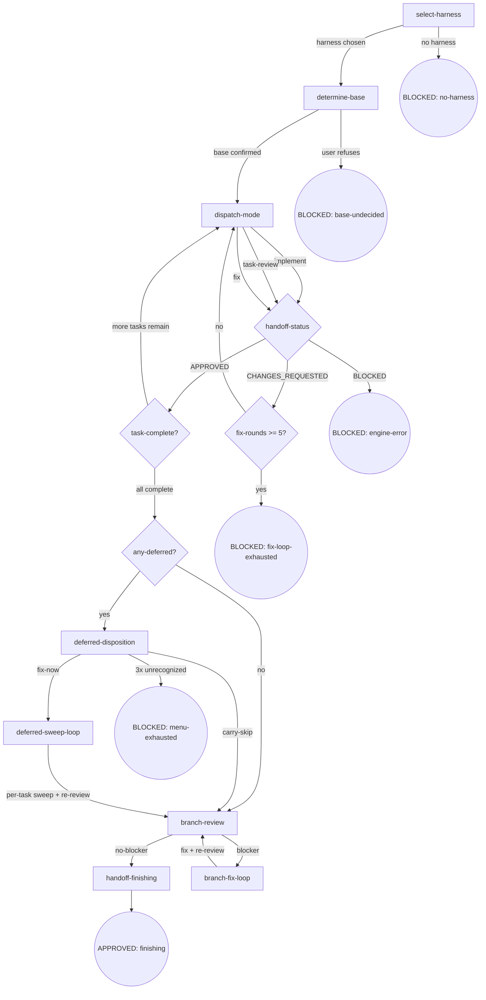

# Skill Digraph Refactor — P8: cli-driven-development 重构 Design Spec

- **Version**: v1.1 · 2026-08-27
- **Status**: Approved
- **Author**: [human] · Claude Opus 4.8 (osuperpowers:brainstorming dogfood session)
- **Constraints**:
  - 仓库语言政策：SKILL.md 英文主源 + zh-CN 镜像；本 spec 中文（Strategy B）
  - 路径解析 harness-agnostic：不写 `$CLAUDE_PLUGIN_ROOT` 等 harness-specific 变量
  - vendored 子模块不可改
  - 引擎代码改动限契约层（不改控制流）：本 phase 允许 brief.mjs / contract.mjs / runner.mjs / templates.mjs 的契约修复（#185/#186/#187 + #168 fix 双通道），属 overall spec「引擎代码改动仅限 P1」的显式豁免——豁免依据：P7 dogfood 发现的 3 个引擎契约缺口 + #168 fix 双通道所需的 runner 层 scope 渲染

---

## §1 Goals & Non-goals

### Goals

1. 将 `cli-driven-development/SKILL.md` 从 Rules 散文 + Red Flags 重写为**节点锚定式**（digraph 唯一控制流真相源）
2. **新增 deferred-disposition 决策节点 + fix 双通道**（关闭 #168）：所有 task APPROVED 后聚合 handoff `findings[].deferred=true` 项按 task 分组呈现；用户选 fix-now 或 carry-skip；fix-now 走 deferred-sweep 通道（per-task fix + re-review）
3. **CDD workspace 完整性修复**（关闭 #181）：orchestrator handoff 检查义务 + task-review 不可跳过 + branch-review 持久化（diff + report）——嵌入各节点 Do/Read 字段
4. **CDD engine 契约修复**（关闭 #185/#186/#187）：brief.mjs 统一命名空间（`--task N` + `### Task N:` = CDD 级唯一索引）；implement 段 status 统一 APPROVED（DONE 废除）；handoff commits.head 统一 full 40-char SHA + validator prefix 兼容
5. **CDD 启动 determine-base + branch-review BASE 解硬编码**（消费 P6 共享文档 `cli-driven-development/docs/base-branch.md`）
6. **跨 skill docs 引用迁移**：P3 已迁入的 cdd-reference / controller-handoff / handoff-schema 在 SKILL.md 内以同目录相对路径引用
7. **zh-CN 镜像同步**（SKILL.md + handoff-schema.md 的 status 语义更新）
8. 完全符合 `docs/maintainers/skill-authoring.md` v1.0 规范

### Non-goals

- 不改上游 vendored 仓库（superpowers / mattpocock-skills）
- 不改 P1-P7 历史 plan / spec / handoff 文件（不迁移 DONE → APPROVED）
- 不重写 finishing / cli-select / brainstorming / writing-plans（各自 phase 已完成）
- 不改 osuperpowers-router 映射
- 不改 cdd-select.mjs / cdd-review.mjs 核心控制流（仅 brief.mjs 命名空间 + runner.mjs status/env 映射 + contract.mjs validator 放宽 + templates 扩展）
- 不引入新 CDD engine 状态（deferred-disposition 为纯呈现层聚合——handoff `findings[].deferred=true` 项 rollup）

---

## §2 Flow Digraph

### 节点清单

| ID | 类型 | 说明 |
|---|---|---|
| `select-harness` | 操作 | 调用 [cli-select](../cli-select/SKILL.md) 的 `ask` 节点，获取 `--harness <name>`（跨 skill 调用） |
| `determine-base` | 操作 | 消费 base-branch.md 方法论，写 `.superpowers/cdd/<slug>/base-branch.json` artifact |
| `dispatch-mode` | 操作 | 派发 `cdd-task.mjs --harness <name> --task N --mode <mode> [--scope blocker-only\|deferred-sweep]`；background 执行；返回后读 handoff.json 判断状态 |
| `handoff-status` | 决策 | 读 handoff.json status 字段路由（APPROVED / CHANGES_REQUESTED / BLOCKED） |
| `task-complete?` | 决策 | ledger + 所有 handoff 判断当前 task 是否完成 + 是否还有后续 task |
| `any-deferred?` | 决策 | 所有 task APPROVED 后聚合 `findings[].deferred=true` 判断 |
| `deferred-disposition` | 操作 | 呈现累积 deferred findings（按 task 分组）给用户，选 fix-now / carry-skip |
| `deferred-sweep-loop` | 操作 | 按 task 单独跑 `--mode fix --scope deferred-sweep`（per-task sweep + re-review） |
| `branch-review` | 操作 | 跑 `cdd-review.mjs --template branch-review`（BASE 从 artifact 读）+ 持久化 diff + report 到 workspace |
| `branch-fix-loop` | 操作 | branch-review blocker 修复 + 再 branch-review |
| `handoff-finishing` | 操作 | 交接给 `osuperpowers:finishing` |

### 终态

| ID | 类型 | 说明 |
|---|---|---|
| BLOCKED: no-harness | 终态 | cli-select 返回空 / BLOCKED |
| BLOCKED: base-undecided | 终态 | 用户拒绝确认 base |
| BLOCKED: engine-error | 终态 | handoff status=BLOCKED 或 JSON 损坏 |
| BLOCKED: fix-loop-exhausted | 终态 | fix 循环 ≥ 5 轮 |
| BLOCKED: menu-exhausted | 终态 | deferred-disposition 累计 3 次呈现耗尽（含 `typed-discard?`-style 字面量校验失败回退） |
| APPROVED: finishing | 终态 | 交接 finishing |

### 图说明

- 启动链：select-harness → determine-base → dispatch-mode（首个 task 的 implement）
- 三模式链通过 `dispatch-mode` 单一节点承载，mode 参数区分 implement / task-review / fix
- fix 双通道：blocker-only（默认，task-review CHANGES_REQUESTED 时进入）vs deferred-sweep（用户决策后进入 deferred-sweep-loop）
- ledger-append 嵌入 `task-complete?` 节点的 Do 字段（不单独成节点——仅 APPROVED 后一行追加）
- branch-review 后可能再触发 branch-fix-loop（blocker 时）

---

## §3 Node Definitions

### `select-harness`

- **Do**: 调用 [cli-select](../cli-select/SKILL.md) 的 `ask` 节点（跨 skill 调用），获取用户选定的 harness 名；将 `--harness <name>` 作为**显式 CLI 参数**传递给所有下游 `cdd-task.mjs` / `cdd-review.mjs` 调用（禁止隐式 env var 传播——延续 P7 I1）
- **Read**: cli-select 的 `ask` 节点返回的 harness 名
- **Exit**: 选定 harness → `determine-base`；cli-select BLOCKED → BLOCKED: no-harness
- **Fail**: cli-select 返回 BLOCKED（engine bug / 用户取消）→ 本节点同 BLOCKED

### `determine-base`

- **Do**: 按 [base-branch.md](./docs/base-branch.md) 方法论按顺序尝试推断源：① plan 文档 `base` 字段 ② branch upstream（`git rev-parse --abbrev-ref @{u}`）③ 对话上下文（历史消息明确提及 base）④ fallback 询问用户。确定后写入 `.superpowers/cdd/<slug>/base-branch.json`（schema：`{base, source: "plan-field"|"branch-upstream"|"conversation-context"|"user-confirmed", confirmed_at}`；slug = CDD workspace slug；source 四值对应 4 推断源）。**Scope 解析**：CDD 场景 scope = `cdd`，slug = CDD workspace slug
- **Read**: plan 文档 + `git rev-parse --abbrev-ref @{u}` + 对话上下文 + `.superpowers/cdd/<slug>/base-branch.json`（可选，若已存在则跳过推断）
- **Exit**: base 已确认（artifact 写入或已存在）→ `dispatch-mode`（首个 task 的 implement）
- **Fail**: 用户拒绝确认 → BLOCKED: base-undecided

### `dispatch-mode`

- **Do**: 构造并执行 `cdd-task.mjs --harness <name> --task N --mode <mode> [--scope blocker-only|deferred-sweep]`（`--scope` 仅 `--mode fix` 时有效；默认 `blocker-only`）。**Background execution**（程序级强化）：必须以 background 模式运行 CLI（harness 支持时用 `run_in_background`，不支持时超时+轮询）。返回后**必须读 handoff.json 判断状态**（Orchestrator handoff 检查义务——#181 核心）：解析 `status` 字段（APPROVED / CHANGES_REQUESTED / BLOCKED），**不凭 stdout 是否为空判断有无变更**。brief 生成使用 `--task N` 索引（CDD 级唯一索引——#185 fix 后语义）。scope 默认 `blocker-only`；deferred-sweep 仅当 deferred-disposition 决策为 fix-now 时启用
- **Read**: `CDD_HANDOFF_PATH`（`task-N-handoff.json`）+ open-findings（fix mode 时）+ brief 生成依赖的 plan 段落
- **Exit**: 构造 CLI 命令并 spawn → 进入 `handoff-status`（决策节点，按 handoff status 路由）
- **Fail**: 嵌套 CLI 失败且 handoff 缺失 → runner.mjs 已写 BLOCKED handoff（含 stderr 进 blocker），本节点读取并路由到 BLOCKED: engine-error

### `handoff-status`（决策节点）

- **Do**: 读 `handoff.json` 的 `status` 字段，路由到对应出口
- **Read**: `handoff.json`
- **Exit**: `APPROVED` → `task-complete?`；`CHANGES_REQUESTED` → dispatch-mode（fix mode，blocker-only scope；dispatch-mode 内部维护 fix-round 计数器，≥ 5 时路由到 BLOCKED: fix-loop-exhausted）；`BLOCKED` → BLOCKED: engine-error；`NEEDS_CONTEXT` → **implicit fail-open**（handoff 需要更多上下文时，orchestrator 手工调查后以相同 mode 重派 dispatch-mode；不在 digraph 中作为边）
- **Fail**: `status` 字段缺失或非法（非 APPROVED/CHANGES_REQUESTED/BLOCKED 之一；NEEDS_CONTEXT 为已知但隐式处理状态，由 Exit 字段的 fail-open 路径处理，不走此 Fail 分支）

### `task-complete?`（决策节点）

- **Do**: 检查 ledger `progress.md` + 所有 task 的 handoff：① 若 ledger 已有 `Task N: complete` 行对应该 task 且还有后续未完成任务 → 继续 dispatch；② 若 ledger 含所有 task 的 complete 行 → 进入 `any-deferred?`。**task-review 不可跳过**（#181 纪律）：每 task 必跑 implement → task-review → （fix 如需）→ ledger 完整链路；不允许从 implement 直接跳到 ledger。**ledger 追加纪律**：仅当 handoff `status: APPROVED` 时追加 `Task N: complete` 行（CLI 子进程不写 ledger）
- **Read**: `progress.md`（CDD_LEDGER）+ 所有 `task-N-handoff.json`
- **Exit**: 还有未完成 task → `dispatch-mode`（下一 task 的 implement）；所有 task APPROVED → `any-deferred?`
- **Fail**: 某 task handoff 缺失或 status 非 APPROVED 但 ledger 无该 task 的 complete 行 → BLOCKED: engine-error

### `any-deferred?`（决策节点）

- **Do**: 扫描所有 `task-N-handoff.json` 的 `findings[]`，提取 `deferred: true` 项；按 task 分组汇总（生成内存中的 deferred rollup）；非空 → `deferred-disposition`；空 → `branch-review`
- **Read**: 所有 `task-N-handoff.json` 的 `findings[]`
- **Exit**: 存在 `deferred: true` 项 → `deferred-disposition`；无 → `branch-review`
- **Fail**: handoff 文件损坏或不可解析 → BLOCKED: engine-error

### `deferred-disposition`

- **Do**: 向用户呈现累积 deferred findings（按 task 分组）：每 task 列出 `findings[].deferred=true` 项（severity + summary + 推荐 fix）；**用户选择**：① fix-now（进入 deferred-sweep-loop，按 task 单独修）② carry-skip（携带跳过，直接 branch-review）。呈现时说明 deferred 项为 warn/nit 级别，不影响 APPROVED 语义，但修复后分支更干净
- **Read**: any-deferred? 节点聚合的 deferred rollup
- **Exit**: fix-now → `deferred-sweep-loop`；carry-skip → `branch-review`
- **Fail**: 用户拒绝决策（present-menu 累计 3 次机会耗尽，同 P6 finishing `present-menu` 计数模型）→ BLOCKED: menu-exhausted

### `deferred-sweep-loop`

- **Do**: 按 task 单独跑 deferred-sweep：对每 task 的 `findings[].deferred=true` 项，派发 `cdd-task.mjs --harness <name> --task N --mode fix --scope deferred-sweep`（fix 双通道：deferred-sweep）；sweep 完成后 task-review re-review（验证修复）；若 re-review 返回新 blocker → 走 fix 循环（≤ 5 轮）；re-review APPROVED → ledger 追加该 task `Task N: complete` 行（节点内部簿记，不产生 digraph 边）→ 继续下一 task 的 sweep。**Fix segment 清理**（_handoff-write-fragment.md fix segment 补 sweep 清理分支）：sweep 完成的 finding 从 `findings[]` 移除（非 deferred 化，而是彻底解决）
- **Read**: 每 task 的 handoff + fix 模式返回的 handoff 更新
- **Exit**: 所有 deferred-sweep task 完成（re-review APPROVED）→ `branch-review`
- **Fail**: 某 task sweep 陷入 fix-loop-exhausted → BLOCKED: fix-loop-exhausted

### `branch-review`

- **Do**: `cdd-review.mjs --harness <name> --template branch-review --param BASE=<read from base-branch.json#base> --param HEAD=<head> --param PLAN=<plan-path>`（BASE 从 artifact 读，**移除 `origin/develop` 硬编码**）。**Background execution**（程序级强化）。返回后**读 handoff.json 判断状态**（同 dispatch-mode 节点纪律）。**持久化 diff + report 到 workspace**（#181 纪律）：写 `<workspace>/branch-review.diff` + `<workspace>/branch-review-report.md`（内容从 cdd-review 输出 + findings 提取）
- **Read**: `base-branch.json`（取 base 名）+ branch HEAD + plan 路径 + cdd-review 输出
- **Exit**: 无 blocker → `handoff-finishing`；有 blocker → `branch-fix-loop`；仅有 deferred → `handoff-finishing`（deferred 项不阻塞 finishing）
- **Fail**: cdd-review 失败且无 handoff → BLOCKED: engine-error

### `branch-fix-loop`

- **Do**: 基于 branch-review 的 blocker findings，orchestrator 直接（或派发嵌套 CLI）修复；修复后**重跑 branch-review**（回到 `branch-review` 节点）。分支级 fix 循环，无硬性上限（但建议 ≤ 3 轮；超出由用户决策是否继续）
- **Read**: branch-review 的 findings（来自 handoff `findings[]`）
- **Exit**: 修复后 branch-review 无 blocker → `handoff-finishing`
- **Fail**: 多轮修复后 blocker 不消 → **implicit fail-open**（停手 + report 给用户，branch 保留，用户手动决策）

### `handoff-finishing`

- **Do**: 准备交接给 `osuperpowers:finishing`：确保 `.superpowers/cdd/<slug>/base-branch.json` 已写入（finishing 的 `read-base` 节点消费同一 artifact）；总结 branch 状态（commits count / base / 未修 deferred 项数量）；调用 `osuperpowers:finishing` 接管后续（merge / PR / keep / discard 四选项）
- **Read**: `base-branch.json` + ledger + 所有 handoff + branch-review 最终状态
- **Exit**: 交接完成 → APPROVED: finishing
- **Fail**: finishing 接管失败 → **implicit fail-open**（branch 保留，用户手动 finishing）

---

## §4 Invariants

| # | Invariant |
|---|---|
| I1 | **Explicit Propagation** — 所选 harness 仅以 `--harness <name>` 显式 CLI 参数传播给下游（`cdd-task.mjs` / `cdd-review.mjs`）；禁止 skill 层与引擎层任何形式的隐式环境变量传递（`CDD_HARNESS` / `HARNESS_NAME` 等均不允许）——延续 P7 I1 |
| I2 | **CLI Background Execution** — 所有 CLI mode 调用（`cdd-task.mjs` / `cdd-review.mjs`）必须以 background 方式运行——harness 支持时用 `run_in_background`，不支持时超时+轮询（overall spec v1.9 程序级强化） |
| I3 | **No --resume / -c** — 所有嵌套 CLI 调用禁止携带历史 session 标志（`--resume` / `-c` 等），使用 one-shot print mode（延续旧 Red Flag） |
| I4 | **Fix Dual-Channel Contract** — fix 模式两通道：`--scope blocker-only`（默认，fix.md 仅处理 non-deferred 项；deferred 项保留在 handoff `findings[]` 跨轮次不动，不进 fix loop）｜`--scope deferred-sweep`（用户决策后，处理 deferred 项）。`runner.mjs` 把 scope 映射为 `CDD_FINDINGS_SCOPE` env；`fix.md` 的 `{{FINDINGS_SCOPE}}` 占位符按 env 展开 |
| I5 | **Three-Mode Chain Completeness** — 每 task 必走 implement → task-review → （fix 如需）→ ledger 完整链路；不允许跳过 task-review 直接从 implement 到 ledger（#181 纪律） |

---

## §5 Failure Modes

集中列出跨节点的失败行为映射（与 Node Fail 字段互补）：

| failure | behavior | reason | recovery |
|---|---|---|---|
| `cli-select` BLOCKED | BLOCKED: no-harness | 无法获取 harness 名 | 由 cli-select 节点的 report-issue 路径处理 |
| determine-base 用户拒绝确认 | BLOCKED: base-undecided | merge/PR 到错误 base 代价高 | 用户重跑 CDD 时重新询问 |
| 嵌套 CLI 失败 + handoff 缺失 | BLOCKED: engine-error | 引擎 bug 信号 | `osuperpowers:report-issue` 上报，label `bug, dogfood, osuperpowers, cdd` |
| handoff `status: BLOCKED` | BLOCKED: engine-error | runner.mjs 已捕获 blocker（dirty tree / cli 失败） | 读 blocker 字段决策恢复（如先 commit 再重试） |
| task 级 fix-loop ≥ 5 轮 | BLOCKED: fix-loop-exhausted | 避免 task 级无限循环 | 用户决策：手工修 / 重新 review scope / 放弃 |
| handoff JSON 损坏或 status 字段非法 | BLOCKED: engine-error | 契约违规（runner self-validate 应已拦截） | report-issue 上报 |
| deferred-disposition 累计 3 次呈现耗尽 | BLOCKED: menu-exhausted | 无法获取用户决策 | 用户重跑 CDD |
| branch-fix-loop 多轮 blocker 不消 | **implicit fail-open** | 分支级 blocker 可能需手工调查（无硬性上限，建议 ≤ 3 轮；超出由用户决策） | 停手 + report，branch 保留，用户手动 finishing |
| `osuperpowers:finishing` 接管失败 | **implicit fail-open** | finishing 自身问题 | branch 保留，用户手动 finishing |

**Fail-open vs BLOCKED 约定**（延续 P6/P7）：

- **BLOCKED**：显式终态节点（digraph 圆角圆），需用户介入恢复
- **implicit fail-open**：节点级失败（不在 digraph），流程停手 + report 给用户

---

## §6 Behavior Changes

| # | 旧行为 | 新行为 | 来源 |
|---|---|---|---|
| B1 | `## Rules` 散文 + `## Red Flags` 规则汤 | **删除**——控制流由 digraph 承载，规则归入节点/Invariants | skill-authoring v1.0 |
| B2 | `brief.mjs --task N` 匹配 plan 级 `### Task N:`（plan Task 数量 > CDD task 时错位） | **统一命名空间**：`--task N` + `### Task N:` 均为 CDD 级唯一索引；删除 `### CDD Task N:` 命名空间；plan 级分组用 `## Task Group: <name>`（H2）或 prose | #185 fix |
| B3 | implement 段 handoff `status: DONE`（与 ledger 规则不一致） | implement 段 `status: APPROVED\|BLOCKED`；DONE 废除；`_handoff-write-fragment.md` implement segment + `runner.mjs` 缺 handoff 兜底均改写 APPROVED | #187 fix |
| B4 | handoff `commits.head` 7-char 与 40-char 混用 | 统一 full 40-char SHA（`git rev-parse HEAD` 显式标注）；`validateCommitContract` prefix 匹配兼容历史 | #186 fix |
| B5 | deferred 项默认攒到末尾 final fix wave（executing-plans 已删，#168 悬空） | **deferred-disposition 决策节点**：所有 task APPROVED 后聚合呈现，用户选 fix-now 或 carry-skip；fix-now 走 deferred-sweep 通道（per-task） | #168 fix |
| B6 | fix 模式单通道（仅 blocker-only） | **fix 双通道**：`--scope blocker-only`（默认，仅处理 blocker；deferred 项保留在 handoff `findings[]` 跨轮次不动）+ `--scope deferred-sweep`（deferred-disposition 后）；`runner.mjs` 渲染 `{{FINDINGS_SCOPE}}` 占位符 | #168 fix 延伸 |
| B7 | Orchestrator 凭 stdout 判断变更 + 不读 handoff + task-review 可跳过 + branch-review 不持久化 | **CDD workspace 完整性修复**：handoff 检查义务嵌入 dispatch-mode Do 字段；task-review 不可跳过嵌入 task-complete? 节点；branch-review 持久化 diff + report 嵌入 branch-review Do 字段 | #181 fix |
| B8 | CDD 启动不跑 determine-base；branch-review BASE 硬编码 `origin/develop` | **determine-base 启动节点** + `base-branch.json` artifact；branch-review 从 artifact 读 BASE（移除硬编码）；消费 P6 共享文档 | P6 grilling Q6 延伸 |
| B9 | 无显式 `handoff-finishing` 节点（直接调用 finishing） | 新增 `handoff-finishing` 节点（交接 finishing，确保 artifact 写入） | 节点锚定式 |
| B10 | `Rule: Harness Selection` 通过 `[Rule: Ask]` 旧 anchor 调用 cli-select | 跨 skill anchor 更新为 `[ask](../cli-select/SKILL.md#ask)`（P7 已更新，本次确认无残留） | P7 回写 |
| B11 | cdd-reference / controller-handoff / handoff-schema 在 `packages/osuperpowers/docs/`（P3 已迁） | 本 SKILL.md 以同目录相对路径引用（`./docs/cdd-reference.md` 等）；无路径迁移（仅引用风格） | P3 迁移延伸 |
| B12 | Ledger 规则 `status: APPROVED` 才追加 complete（不认 DONE） | 保持不变（B3 已废除 DONE，两阶段语义统一为 APPROVED） | #187 fix 延伸 |

---

## §7 Acceptance Criteria

1. 符合 skill-authoring.md v1.0（图节点与小节一一对应、无独立 Rules 散文堆、无独立 Red Flags 小节、无 Checklist）
2. 11 节点 + 5 BLOCKED + 1 APPROVED 终态入 digraph
3. **deferred-disposition 决策节点**存在（所有 task APPROVED 后聚合呈现；fix-now / carry-skip 二选一）
4. **fix 双通道**：`--scope blocker-only`（默认，D5a 不变）+ `--scope deferred-sweep`（用户决策后）；`fix.md` `{{FINDINGS_SCOPE}}` 占位符 + `runner.mjs` env 映射 + `_handoff-write-fragment.md` sweep 清理分支
5. blocker 行为不变（必修，不进 deferred-disposition 门）
6. **CDD workspace 完整性**（#181 fix）：每 task 产物链（brief + handoff + report + test-evidence + review 文件）齐全；branch-review diff + report 持久化；orchestrator handoff 检查义务嵌入 dispatch-mode 节点
7. **CDD engine 契约修复**：brief.mjs 统一命名空间（#185）；implement 段 status 统一 APPROVED（#187）；commits.head 统一 full SHA + validator prefix 兼容（#186）
8. **determine-base 启动节点** + `base-branch.json` artifact；branch-review BASE 参数从 artifact 读（移除 `origin/develop` 硬编码）
9. 引用迁移后的同目录 docs（cdd-reference / controller-handoff / handoff-schema）
10. zh-CN 同步（cli-driven-development SKILL.md + handoff-schema.md）
11. emit + validate 绿
12. 关联 #168 / #181 / #185 / #186 / #187 关闭评论附 commit
13. CDD execution: workspace 存在 + 全 task handoff.json + ledger 全 APPROVED + Final Review 产物（**自举验证**：重写 CDD 技能时必须通过 CDD engine 执行）

---

## §8 Execution Strategy

**5 Task 实施（引擎 / schema / 模板 / skill 主体 / 验证分层）**：

### Task 1：CDD engine 契约修复（#185 + #186 + #187）

- `packages/osuperpowers/bin/engine/lib/brief.mjs`：
  - `generateBrief` 匹配 `### Task N:` 作为 **CDD 级唯一索引**
  - 删除对 `### CDD Task N:` 命名空间的支持（若有）
  - 更新 usage / 错误信息（`--task N` = CDD 级）
  - 新增/更新单测：plan 含 `### Task 1:` / `### Task 2:` 时，`--task 2` 取 `### Task 2:` 段落
- `packages/osuperpowers/bin/engine/lib/contract.mjs`：
  - `validateCommitContract` 比较 commits.head 时**放宽为 prefix 匹配**（7-char 是 40-char 前缀即视为一致）
  - 保留 strict equal 路径作为主路径；prefix 匹配作为 fallback（兼容历史）
- `packages/osuperpowers/bin/engine/lib/runner.mjs`：
  - 缺 handoff 时兜底写 `status: APPROVED`（不是 DONE）
  - 新增 `CDD_FINDINGS_SCOPE` env 映射（默认 `blocker-only`）；`renderModePrompt` 把 scope 传入 fix.md 的 `{{FINDINGS_SCOPE}}` 占位符
- `packages/osuperpowers/bin/engine/tests/`：补单测钉死新契约（brief 命名空间 / SHA prefix 兼容 / status APPROVED / CDD_FINDINGS_SCOPE）

### Task 2：Schema + 模板修订

- `packages/osuperpowers/skills/cli-driven-development/docs/handoff-schema.md` + `.zh-CN.md`：
  - implement 段允许 status 从 `DONE|BLOCKED` → `APPROVED|BLOCKED`（DONE 废除）
  - 所有示例中 implement 段 `status: DONE` → `status: APPROVED`
  - commits.head 显式标注「full 40-char SHA」
- `packages/osuperpowers/templates/cdd/_handoff-write-fragment.md`：
  - implement segment：`status: DONE` → `status: APPROVED`
  - implement / fix 所有 segment：`git rev-parse HEAD` 显式标注「full SHA (40-char)」+ 禁止 `--short` / `%h`
  - fix segment 补 **sweep 清理分支**：scope=deferred-sweep 时，sweep 完成的 finding 从 `findings[]` 移除（非保留为 deferred）
- `packages/osuperpowers/templates/cdd/fix.md`：
  - 新增 `{{FINDINGS_SCOPE}}` 占位符（在 open-findings 描述段）
  - 默认 `blocker-only`（行为零变化）；`deferred-sweep` 时 open-findings 含 deferred 项
- `packages/osuperpowers/bin/engine/lib/templates.mjs`：
  - `renderModePrompt` 对 fix mode 渲染时把 `CDD_FINDINGS_SCOPE` env 注入 `{{FINDINGS_SCOPE}}`

### Task 3：cli-driven-development SKILL.md 重写（节点锚定式）+ zh-CN 同步

- 重写 `packages/osuperpowers/skills/cli-driven-development/SKILL.md`（按 §2-§5）：
  - Front matter：description 更新为节点锚定式摘要
  - Mermaid digraph（11 节点 + 5 BLOCKED + 1 APPROVED）
  - Node Definitions（11 节点，每节点 Do/Read/Exit/Fail 四要素）
  - Invariants（5 条）
  - Failure Modes（9 条 + recovery 列）
- 同步 `SKILL.zh-CN.md`（节对节）

### Task 4：emit + validate + 终扫 + issue 关闭

- `pnpm run emit && pnpm run validate`
- 终扫预演（legacy-pattern 消除 greps——对 cli-driven-development 目录验证旧格式关键词已清零）：
  - `grep -r 'HARD-GATE' packages/osuperpowers/skills/cli-driven-development/SKILL.md` → 零匹配
  - `grep -r '## Rules' packages/osuperpowers/skills/cli-driven-development/SKILL.md` → 零匹配
  - `grep -r '## Red Flags' packages/osuperpowers/skills/cli-driven-development/SKILL.md` → 零匹配
  - `grep -r 'Rule: ' packages/osuperpowers/skills/cli-driven-development/SKILL.md` → 零匹配
- 关闭 #168 / #181 / #185 / #186 / #187（评论附 commit URLs）

### Task 5：自举验证（dogfood）

- P8 重写 CDD 技能本身**必须通过 CDD engine 执行**（overall spec v1.7 CDD dispatch 约束 + P8 自举验证标注）
- 嵌套 CLI 实现 Task 3 时，orchestrator 使用**当前 cli-driven-development SKILL.md**（旧版本）；嵌套 CLI 改写的目标是 cli-driven-development/SKILL.md 文件本身
- 自举验证不要求端到端冒烟（重写完成即视为达标），但 ledger 全 APPROVED + Final branch-review 产物必须存在

### Atomic commits（3 个）

1. `fix: CDD engine contract — unified namespace + APPROVED status + full SHA + fix dual-channel (P8 #185 #186 #187 #168)`（Task 1 + Task 2）
2. `refactor: rewrite cli-driven-development to node-anchored format (P8)`（Task 3）
3. `chore: close P8 issues + emit + validate + legacy sweep (P8)`（Task 4）

**Task 5 自举验证不产生独立 commit**：Task 5 是 orchestrator 对 Task 3 执行方式的约束（"通过 CDD engine 派发嵌套 CLI"），执行结果落在 Task 3 的 commit 内；Task 5 自身仅产生 workspace artifacts（ledger + handoff + Final Review report），这些 artifacts 不进入仓库（`.superpowers/cdd/` 在 .gitignore）。

**自举验证说明**：Task 3 由 CDD engine 派发嵌套 CLI 执行；Task 4 的 issue 关闭在 Task 3 commit 后手工执行（gh issue close）。

---

## Change history

- v1.0 · 2026-08-27 — 初版：11 节点 + 5 BLOCKED + 1 APPROVED 终态的 digraph + 5 Invariants + 9 Failure Modes（含 recovery 列）+ 12 行为变更 + 5 Task 实施 + 3 atomic commits。Grilling 决策：P8 一并修引擎（#185/#186/#187）+ 完全统一命名空间（`--task N` = `### Task N:` = CDD 级）+ 统一 APPROVED（DONE 废除）+ 节点 Do 字段承载纪律 + deferred-disposition 决策节点 + fix 双通道 + determine-base 启动节点 + base-branch.json artifact。
- v1.1 · 2026-08-27 — 3-pass spec review 修复（2 blocker + 7 warn）：① §2 digraph `I→E` 修正为 `I→K`（deferred-sweep-loop 出口对齐 §3 Exit：branch-review）；② §2 digraph 新增 `Z5((BLOCKED: menu-exhausted))` 节点 + `H→Z5` 边（deferred-disposition Fail 路径显式入图，与 §2 终态表 / §7 AC#2 的 5 BLOCKED 一致）；③ §3 dispatch-mode Exit 简化（路由统一进入 handoff-status 决策节点，避免与内部 status 解析逻辑混淆）；④ §3 handoff-status Exit 删除对不存在的 "F 节点" 引用（fix-rounds 计数器嵌入 dispatch-mode 内部）；⑤ §3 determine-base schema source 枚举补 `"conversation-context"` 第四值（对齐 4 推断源）；⑥ §3 handoff-status Exit / Fail 字段澄清 NEEDS_CONTEXT 处理（Exit 字段的 fail-open 路径承载，Fail 字段不再视为非法）；⑦ §2 digraph task-complete? (E) 出口边标签改为 `more tasks remain → C` / `all complete → G`（与 §3 Exit 字段语义一致）；⑧ §4 I4 + §6 B6 删除 `D5a` 未定义引用，改为具体描述（"deferred 项保留在 handoff findings[] 跨轮次不动"）；⑨ §3 deferred-sweep-loop Do 字段「re-review APPROVED → 回到 task-complete?」改为「ledger 追加该 task complete 行后继续下一 task 的 sweep」（内部簿记，不产生 digraph 边）；⑩ §5 Failure Modes 表拆分 task 级 vs branch 级 fix-loop（task 级 ≥ 5 轮 = BLOCKED: fix-loop-exhausted；branch 级无硬性上限 = implicit fail-open）；⑪ §8 Atomic commits 说明 Task 5 自举验证不产生独立 commit（仅 workspace artifacts，.gitignore 内）。
