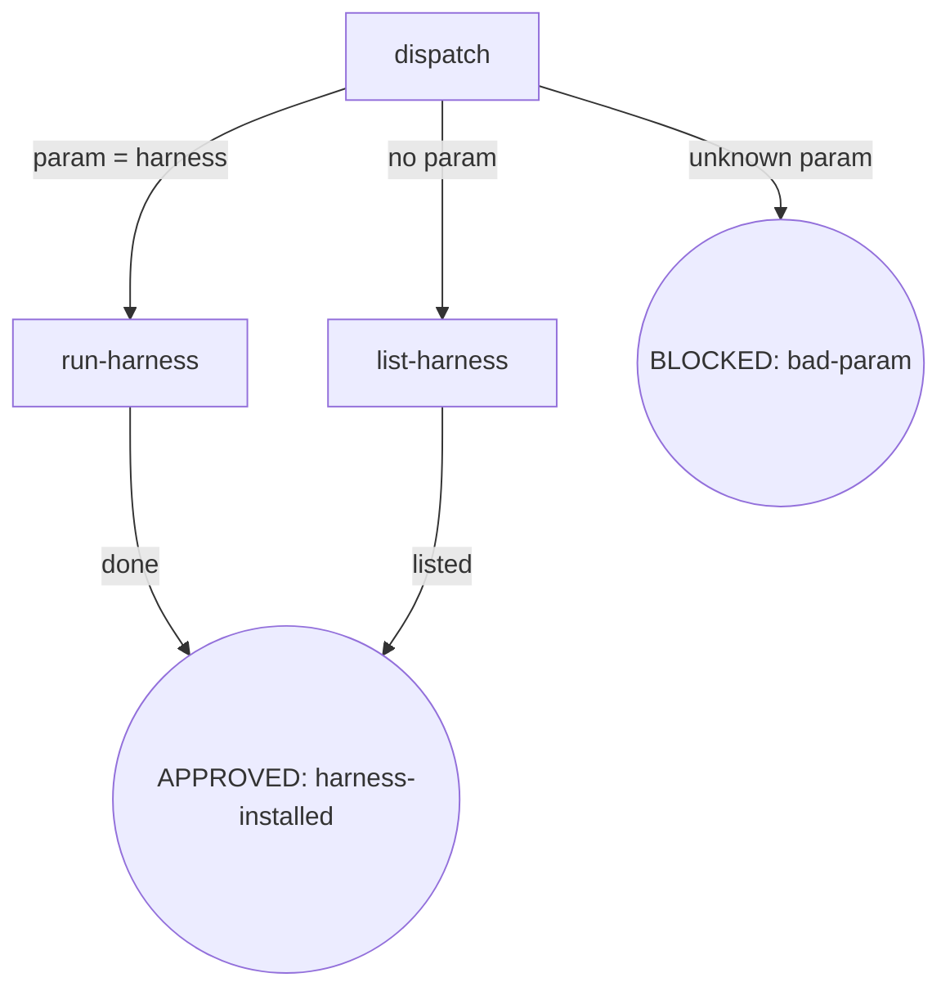
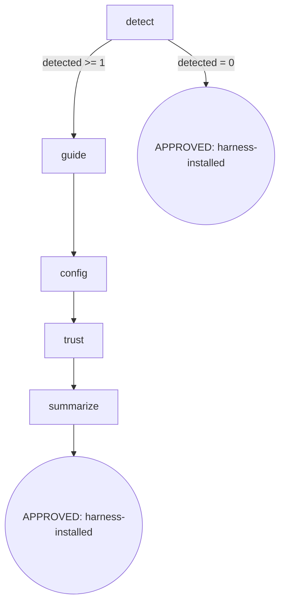
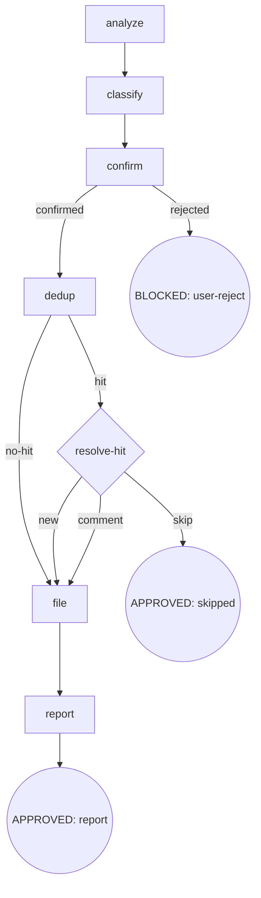

# 技能 digraph 重构 + 引擎修复 — P9 init + report-issue 重构 + Cursor self-check rule 清理 Design Spec

- **Version**: v1.1 · 2026-08-27
- **Status**: Approved
- **Author**: [human] · Claude Opus 4.8 (osuperpowers:brainstorming dogfood session)
- **Parent**: `docs/superpowers/specs/2026-08-24-skill-digraph-refactor-overall.md` (v1.18)
- **Constraints**:
  - 节点锚定式格式权威：`docs/maintainers/skill-authoring.md` v1.0
  - 语言政策：本 spec 中文 Strategy B（无 zh-CN 镜像）；技能 SKILL.md 英文主源 + zh-CN 镜像
  - 不 commit 除非用户明确要求；changeset 仅在 P10 统一建（程序级豁免）
  - 引擎改动：#136 report-issue label 组件分类 + cursor-detect.mjs slash 拦截扩展（均限契约/拦截语义，不改控制流大框架）

---

## 1. 背景与目标

P9 是 10 阶段重构程序的第九阶段，含三块工作：

1. **`init` 重构** — 9 行散文 dispatcher → 节点锚定式；删除 `init router` 入口及 `router.md`。
2. **`report-issue` 重构** — `## Rules` 散文堆 → 6 步 7 节点 digraph；#136 Automatic Labels 组件分类。
3. **`Cursor self-check rule` 清理** — 删除 `.mdc` 生成链，slash 拦截改由 `cursor-detect.mjs` hooks 接管（与用户「完全靠 osuperpowers-router hooks」指令一致）。

### 1.1 删除 `init router` 的依据

- `init router` 把「superpowers 触发 → osuperpowers skill」静态表写入项目 CLAUDE.md / `.cursor/rules/osuperpowers-router.mdc`。
- 这张表是 `packages/osuperpowers-router/overrides.manifest.json`（路由 SOT）的**冗余文档镜像**；实际拦截/路由由 hooks（消费 manifest）执行。
- 表已 **stale**：仍 remap `/subagent-driven-development → cli-driven-development`（P8 已改名未同步）。
- 删除不损失路由行为（hooks 仍按 manifest SOT 拦截）。

### 1.2 Cursor self-check rule 清理的依据（v1.18 范围扩大）

- `.cursor/rules/osuperpowers-router.mdc` 由 `init router` 写入，是 Cursor **slash 触发的主要拦截手段**（`cross-harness-overrides.md` line 46：「self-check rules are primary enforcement for slash triggers」）。
- 证据：`cursor-detect.mjs`（源树已存在）当前**仅拦 SKILL attach**，bare `/<slug>` slash 不写 pending（测试 line 90 「bare `/brainstorming` with no attachments writes no pending」印证）。
- 用户决策：删除 init router 后**连带清理该 rule**，slash 拦截改为完全靠 `cursor-detect.mjs` hooks 接管——扩展其匹配逻辑新增 bare slash 拦截，与 Claude `UserPromptExpansion` 同语义。

---

## 2. 范围

| 技能/构件 | 重构前 | 重构后 |
|---|---|---|
| `init/SKILL.md` | 9 行散文（spor/harness/no-param） | 2 入口 digraph（harness / no-param）+ BLOCKED（bad-param） |
| `init/router.md` | 静态自检表 payload | **删除** |
| `init/harness.md` | `## Rules` + `## Red Flags` | 节点锚定式（detect→guide→config→trust→summarize）+ Invariants |
| `report-issue/SKILL.md` | `## Rules` 散文堆 | 6 步 7 节点 digraph + Failure Modes + templates prose |
| `report-issue` #136 | Automatic Labels 硬编码 `osuperpowers-router` | 组件分类 `osuperpowers`/`osuperpowers-router` + `cdd` |
| `cursorSelfCheckMdc` 生成链 | emit 生成 `.mdc` | **删除**（函数 + emit 调用 + 模板） |
| `cursor-detect.mjs` | 仅拦 SKILL attach | **新增** bare `/<upstream-slug>` slash 拦截 |
| `cross-harness-overrides.md` | 大段描述 self-check rule | 更新：删 rule 描述，记 slash 由 hooks 接管 |

### 不在范围内

- 不改 `overrides.manifest.json` 的路由条目（仅删 rule 镜像，不动 SOT）。
- 不改 `gh` CLI 命令与 issue 模板正文。
- 不动 P10 grep 终扫（P9 完成后兜底）。
- report-issue 仍手动触发。

---

## 3. Node Definitions — init

### 3.1 `init/SKILL.md`（外层 dispatcher）

#### `dispatch`

- **Do**: 解析调用参数；`init` 仅接受 `harness` 子命令（或空参数）。无 `router`/`spor` 入口（已删除，见 §1.1）。`--harness` 等 flag **必须**跟在 `harness` 子命令之后（如 `init harness --harness foo`）；`init --harness foo` 无子命令 → BLOCKED（bad-param）。
- **Read**: 调用参数（CLI args / slash command 参数）
- **Exit**: `param=harness` → `run-harness`；无参数 → `list-harness`；其他参数（含无子命令的 flag）→ BLOCKED（bad-param）
- **Fail**: 未知参数 / 无子命令的 flag → BLOCKED（bad-param，提示可用入口 `harness`）

#### `run-harness`

- **Do**: 执行 `harness.md` 的节点锚定式流程（detect→guide→config→trust→summarize）。
- **Read**: `harness.md`
- **Exit**: 完成 → APPROVED（harness-installed）
- **Fail**: 见 `harness.md` 节点 Fail 字段 + Failure Modes

#### `list-harness`

- **Do**: 无参数时列出可用入口（`harness`），提示 `init harness [--harness …] [--dry-run]` 用法。
- **Read**: 无
- **Exit**: 列出 → APPROVED（harness-installed）
- **Fail**: 无（纯展示）

### 3.2 `init/harness.md`（节点锚定式重写）

#### `detect`

- **Do**: 用 harness-detect util（`command -v <cli>`；`cli` 源 = `config.harnesses[h].cli ?? h`）探测已安装 harness；`unknown --harness` → 工具 exit 1。`install-and-use` 通道 harness 在 detect 命中后即进 guide（guide 仅打印 probe + install hint，不写文件）。
- **Read**: `config.harnesses`（已安装包 config）；`--harness` / `--dry-run` 参数
- **Exit**: `detected ≥ 1` → `guide`；`detected = 0` → APPROVED（harness-installed，skip——未检测 harness 跳过是预期行为）
- **Fail**: 未知 `--harness` → exit 1（调用方处理）；`--dry-run` 只预览不写文件

#### `guide`

- **Do**: install-and-use 通道打印 probe + install hint，不写文件；`--dry-run` 仅预览。
- **Read**: 检测到的 harness 列表
- **Exit**: 引导完成 → `config`
- **Fail**: 无（引导不写文件，无副作用）

#### `config`

- **Do**: init 通道（native harness）：写 config（从 `configs/` 派生模板）+ 复制 skills；JSON 深合并 / TOML 追加，保留用户非冲突内容（幂等）。**install-and-use 通道 harness 在此节点为 no-op / skip**（其安装走 guide 的包通道提示，config 写入不适用）。
- **Read**: `configs/` 模板；已写 config（用于 idempotent merge）
- **Exit**: config 写入 / skip → `trust`
- **Fail**: 写文件失败 → fail-open（报告错误，保留已写部分，提示用户手动检查）

#### `trust`

- **Do**: config 写入 ≠ 信任生效。对需要信任仪式的 harness 引导用户执行信任仪式（grok `grok --trust`、codex `/hooks`、gemini 首次接受指纹、trae Enable + sandbox/local）。**无对应信任仪式的 harness（如 install-and-use 通道）跳过此步**，summarize 标注「已生效」而非「需人工信任」。
- **Read**: 已写 config 的 harness 列表
- **Exit**: 汇总信任步骤 → `summarize`
- **Fail**: 用户跳过信任 → 仍 APPROVED，但 summarize 明确标注「需人工信任」

#### `summarize`

- **Do**: 汇总各 harness 状态：已写 config（生效）/ 引导包通道（需用户装包）/ 跳过（未检测）+ 需人工信任步骤。三种状态对齐 detect/config/trust 的输出。
- **Read**: detect / config / trust 三节点状态
- **Exit**: 汇总输出 → APPROVED（harness-installed）
- **Fail**: 无（纯展示）

### 3.3 init Invariants

| # | Invariant |
|---|---|
| I1 | **Idempotent** — 重复运行覆盖 config（JSON 深合并 / TOML 追加），保留用户手动追加的非冲突内容 |
| I2 | **Dry-Run-First** — 首次运行（或未知影响面）先 `--dry-run` 预览将写路径，不静默写文件 |
| I3 | **Config ≠ Trust** — config 写入不蕴含信任生效；信任仪式需显式引导用户执行 |

### 3.4 init Failure Modes

| failure | behavior | reason | recovery |
|---|---|---|---|
| 未知 `--harness` | exit 1 | 工具拒绝未知 harness | 提示可用 harness 列表 |
| `config` 写文件失败 | fail-open（报告 + 保留已写部分） | 文件系统权限 / 路径错误 | 提示用户手动检查路径权限 |
| 用户跳过信任仪式 | APPROVED（标注需人工信任） | 信任是用户侧决策 | summarize 明确列出待执行信任步骤 |

---

## 4. Node Definitions — report-issue

### 4.1 `report-issue/SKILL.md`

> 6 步 / 7 节点：analyze · classify · confirm · dedup · resolve-hit（dedup 命中菱形）· file · report。

#### `analyze`

- **Do**: 按优先级读三源——① 本 session 工具调用记录 / 错误 / handoff / review findings（主源）；② ledger（`{repo}/.superpowers/sdd/*/progress.md` + `{repo}/.superpowers/cdd/*/progress.md`，提取 `fix round` / `BLOCKED` / `parked` / `deferred` / `CHANGES_REQUESTED`）；③ git log（`git log $(git merge-base HEAD origin/main)..HEAD --oneline`，不可用回退 `git log -20 --oneline`）。
- **Read**: session context；`{repo}/.superpowers/{sdd,cdd}/*/progress.md`；git log
- **Exit**: 提取 findings → `classify`
- **Fail**: ledger / git log 不可用 → 仅用 session 主源（fail-open，不阻塞）

#### `classify`

- **Do**: 每条 finding 分类——`bug`（工具/脚本行为与 spec 不符：超时、错误退出码、gate 误判、handoff schema 错误）/ `enhancement`（流程可改进但未坏：DX 缺口、文档缺失、CI 覆盖不足、模板缺口）。每条含 Title / one-line description / affected component / evidence。**组件 label 判定见 §4.2**；模糊组件（跨插件/无法确定）默认 `osuperpowers`（不新增交互 prompt，保持流程确定），用户可在 `confirm` 节点纠正。
- **Read**: `analyze` 输出的 findings
- **Exit**: 分类完成 → `confirm`
- **Fail**: 无法判定类型 → 默认 `enhancement`（偏保守）

#### `confirm`

- **Do**: 将 findings 编号列表呈现给用户，询问「整体准确吗？有增删吗？」——**未获明确确认前不预建 gh issue**。模糊组件分类若用户认为有误，在此节点纠正。
- **Read**: 分类后的 findings
- **Exit**: 用户确认 → `dedup`；用户拒绝 → BLOCKED（user-reject）
- **Fail**: 用户无响应 / 明确拒绝 → BLOCKED（user-reject，流程终止）

#### `dedup`

- **Do**: 对每个确认 finding 查重：`gh issue list --repo Oscaner/skills --state open --limit 100 --json number,title,body`；关键词（组件名 + 行为词）case-insensitive 子串匹配。命中 → `resolve-hit`；未命中 → `file`。
- **Read**: `gh issue list` 输出；confirmed findings
- **Exit**: 命中 → `resolve-hit`；未命中 → `file`
- **Fail**: `gh` 不可用 / 网络失败 → fail-open（报告，跳 filing，提示手动）

#### `resolve-hit`

- **Do**: 命中已有 issue 时展示匹配项，用户三选一：**Create new / Add comment to existing / Skip**。
- **Read**: 匹配到的 issue（number + title + body）
- **Exit**: new → `file`；comment → `file`（comment 路径）；skip → APPROVED（skipped）
- **Fail**: 用户无响应 → 默认 skip（不重复 filing）

#### `file`

- **Do**: 按 **#136 组件分类 label** 调 `gh issue create`；命中走 `gh issue comment`。body 用 `## Issue Body Templates` prose（按 session 语言选 EN/CN × bug/enhancement）。
- **Read**: 分类后的 label 集；template prose（§4.5）；finding evidence
- **Exit**: filing 完成 → `report`
- **Fail**: `gh issue create` 失败 → fail-open（报告 stderr，保留供手动重试）

#### `report`

- **Do**: 打印全部结果：new issue → URL；appended comment → URL；Skip → 列出原因。
- **Read**: 各 finding 的最终动作
- **Exit**: 汇总 → APPROVED（report）
- **Fail**: 无（纯展示）

### 4.2 #136 引擎层修复 — Automatic Labels 组件分类

`classify` 节点的 label 计算逻辑（原硬编码 `osuperpowers-router` → 改为组件分类）：

| 维度 | 规则 |
|---|---|
| `bug` / `enhancement` | 总是匹配 finding 类型 |
| `dogfood` | 总是（本 skill 的 findings 均为 dogfood） |
| **组件 label** | ① 受影响组件 ∈ `packages/osuperpowers/`（cdd-task.mjs / runner.mjs / cli-select / 编排技能等）→ `osuperpowers`；② 组件 ∈ `packages/osuperpowers-router/`（hooks / overrides manifest / prompt-expansion / cursor hooks）→ `osuperpowers-router`；③ 跨插件 / 无法确定 → **默认 `osuperpowers`**（不新增交互 prompt，流程确定；用户可在 `confirm` 纠正） |
| `cdd` | finding 涉及 CDD / cdd-task.mjs / orchestrator / handoff → 追加 `cdd` |

`gh issue create --label "<type>,dogfood,<component>[,cdd]"`——`<component>` 为分类结果。

> 与 P7 提前消费约定一致（P7 Failure Modes recovery label 已用 `osuperpowers`）。P9 正式落地进 report-issue，使分类成为 skill-authoring 硬约束。

### 4.3 report-issue Failure Modes

| failure | behavior | reason | recovery |
|---|---|---|---|
| 用户拒绝 filing（confirm rejected） | BLOCKED（user-reject） | 未确认不预建 issue | 流程终止，issue 不创建 |
| `gh` CLI 不可用 / 网络失败 | fail-open（报告 + 提示手动） | 外部工具依赖 | 保留 findings 供重试 |
| dedup 命中后用户无响应 | 默认 skip | 避免重复 filing | 不创建重复 issue |
| `gh issue create` 失败 | fail-open（报告 stderr） | 外部 API 错误 | 保留 finding 供手动重试 |

### 4.4 report-issue Invariants

| # | Invariant |
|---|---|
| I1 | **Confirm Gate** — 未获用户明确确认前不预建任何 gh issue（confirm 节点硬门） |
| I2 | **Component-Label** — label 按受影响组件分类（`osuperpowers` / `osuperpowers-router`），不硬编码 `osuperpowers-router`（#136） |
| I3 | **Manual Trigger Only** — report-issue 仅手动触发，永不自动执行 |

### 4.5 Issue Body Templates（prose payload）

保留原 4 段模板（Bug/CN、Bug/EN、Enhancement/CN、Enhancement/EN）作为 `file` 节点的 Read 常量，**不节点化**。模板正文原样保留。

---

## 5. Cursor self-check rule 清理 + slash 拦截扩展（v1.18）

### 5.1 删除 `.mdc` 生成链

| 删除项 | 位置 | 动作 |
|---|---|---|
| `cursorSelfCheckMdc` 函数 | `scripts/lib/emit/overrides.mjs` | 删除函数定义 |
| 调用 + `writeText` | `scripts/emit.mjs`（约 338-346 行） | 删除 `cursor-self-check.mdc` 产物写入 |
| 模板 | `packages/osuperpowers-router/build/templates/self-check.mdc` | 删除模板文件 |
| 产物 | `packages/osuperpowers-router/build/generated/cursor-self-check.mdc` | 删除（emit 再生后不再生成） |

`claudeSelfCheckMd`（Claude 侧 `CLAUDE.md` override-trigger 表）**保留**——Claude 仍受 `UserPromptExpansion` 拦截，且 `init` 不再写该表后 Claude 的 slash 拦截由 hooks 自身覆盖（无需文档镜像）。

> 注：删除 init router 后，Claude 侧 `.cursor/rules`/CLAUDE.md 自检表不再由 init 维护；Claude 的 slash 拦截由 `UserPromptExpansion` hooks 完成（SOT = manifest），无功能损失。Cursor 侧见 §5.2。

### 5.2 扩展 `cursor-detect.mjs` 拦 slash

当前 `cursor-detect.mjs`（源树已存在，`scripts/emit.mjs` 用 `scripts/templates/cursor-detect.mjs` 渲染）仅拦 SKILL attach。扩展其匹配逻辑：

- **新增** bare `/<upstream-slug>` slash 检测：解析 prompt 文本，匹配 `^/<slug>$` 或行内 ` /<slug>`（slug 列表 = manifest targets 的 `upstream_slug`：brainstorming / writing-plans / subagent-driven-development / finishing-a-development-branch / test-driven-development / using-git-worktrees）。
- 命中 slash → 写 pending（与 attach 同结构：`override` = 对应 `osuperpowers:*` name，`trigger: "slash"`）。
- attach 拦截逻辑**保持不变**（TARGETS + attach_res 不变）。
- slash 命中时 `trigger` 字段区分 `"slash"` vs attach 的 `"attach"`，enforce 侧无需区分（均 gate 首工具）。
- 现有的 `bare /brainstorming with no attachments writes no pending` 测试需**改写为**：bare slash → 现在写 pending（slash 路径）。新增 slash 命中测试。

TARGETS 的 slug 源：与 Claude `hooks.json` 第二 matcher 的 slug 集合一致（单一 SOT 应是 `overrides.manifest.json` 的 `upstream` 字段解析；emit 渲染时已注入 TARGETS，slash 扩展复用同一 TARGETS 的 `upstream_slug`）。

### 5.3 文档更新

- `packages/osuperpowers-router/docs/cross-harness-overrides.md`：删「Self-check rules (both harnesses)」「Init does not install hooks — `init router` only refreshes …」等描述 `.mdc` rule 的段落；改为「Cursor slash 由 `cursor-detect.mjs` 的 `beforeSubmitPrompt` hook 直接拦截（与 Claude UserPromptExpansion 同语义）」。修正 stale 的 `/subagent-driven-development` 行。
- `packages/osuperpowers-router/README.md` + zh-CN：删「Run `init router`」指引，改为 slash 由 hooks 接管。
- `packages/osuperpowers/README.md` + zh-CN：`init` 条目改为 `Project initialization (harness config)`。
- `init/SKILL.zh-CN.md`：同步删 spor 入口。

### 5.4 Cursor slash 验收

- `cursor-detect.test.mjs`：slash 用例改为「bare `/brainstorming` → 写 pending（trigger=slash）」；新增 6 slug 覆盖测试；attach 用例保留。
- `pnpm run validate` 的 overrides hooks 检查：仍校验 `cursor-detect.mjs`/`cursor-enforce.mjs` 存在且可执行（文件保留，仅扩展行为）。
- emit 后 `.cursor/rules/osuperpowers-router.mdc` 不再生成（grep 终扫验证，P10 兜底）。

---

## 6. zh-CN 镜像同步

| 文件 | 动作 |
|---|---|
| `init/SKILL.zh-CN.md` | 重写镜像新 2 入口 digraph（删 spor） |
| `init/harness.zh-CN.md` | 新增（harness.md 节点锚定式镜像） |
| `init/router.zh-CN.md` | **删除**（随 router.md） |
| `report-issue/SKILL.zh-CN.md` | 重写镜像 7 节点 digraph + #136 分类 |
| `osuperpowers-router/README.zh-CN.md` | 删 `init router` 指引 |

刷新策略同 P4–P8：`pnpm run emit` 再生 `.agents/` 后人工同步引擎侧 zh-CN（若有）。

---

## 7. Behavior Changes

| # | 变化 | 类型 |
|---|---|---|
| B1 | init 三入口 → 两入口（删 spor/router） | 破坏性（删入口） |
| B2 | `init router` + `router.md`/`.zh-CN` 删除 | 破坏性（删命令） |
| B3 | harness.md `## Rules`/`## Red Flags` → 节点 + Invariants | 格式 |
| B4 | report-issue `## Rules`/`## Red Flags` → 6 步 7 节点 | 格式 |
| B5 | #136 Automatic Labels 硬编码 → 组件分类 | 行为 |
| B6 | templates 保留 prose payload | 格式 |
| B7 | `cursorSelfCheckMdc` 生成链删除（`.mdc` 不再生成） | 破坏性（删产物） |
| B8 | `cursor-detect.mjs` 新增 bare slash 拦截 | 行为（Cursor 拦截语义） |
| B9 | cross-harness-overrides / router README 文档更新 | 文档 |

---

## 8. Acceptance Criteria

1. 两技能符合 `skill-authoring.md` v1.0（图节点↔小节一一对应，无独立 Rules 散文堆 / Red Flags 小节 / Checklist）。
2. init 三入口→两入口；`router.md`/`.zh-CN` 删除；全仓 `init router`/`router.md` 引用归零（P10 终扫兜底，P9 应清）。
3. report-issue gh 命令与 templates 保留原样，仅组织变（6 步 7 节点）。
4. #136 label 组件分类落地（非硬编码 `osuperpowers-router`）。
5. zh-CN 同步（init/SKILL + init/harness + report-issue/SKILL + router README）。
6. **Cursor self-check rule 清理**：`cursorSelfCheckMdc` 生成链删除 + 模板/产物删除 + emit 不再生成 `.mdc`。
7. **Cursor slash 拦截**：`cursor-detect.mjs` 扩展 bare slash 拦截 + 测试通过（slash → pending，与 Claude 同语义）；attach 拦截不变。
8. cross-harness-overrides / README 文档更新（删 rule 描述 + 修正 stale 行）。
9. `pnpm run emit && pnpm run validate` 绿。
10. CDD execution：workspace + handoff + ledger 全 APPROVED + Final Review 产物。

---

## 9. Tasks & Commits

### Task 1 — init 重构（commit: refactor: rewrite init to node-anchored 2-entry dispatcher + delete init router (P9)）

- `init/SKILL.md` 重写为 2 入口 digraph（删 spor/router，bad-param BLOCKED）
- `init/harness.md` 节点锚定式重写（删 ## Rules/## Red Flags，拆节点 + Invariants）
- 删除 `init/router.md` + `init/router.zh-CN.md`
- 同步 `init/SKILL.zh-CN.md` + 新增 `init/harness.zh-CN.md`

### Task 2 — report-issue 重构 + #136（commit: refactor: rewrite report-issue to node-anchored 6-step flow + component-label classification (P9 #136)）

- `report-issue/SKILL.md` 6 步 7 节点 digraph + Failure Modes + Invariants
- #136 Automatic Labels 组件分类（classify 节点）
- 保留 `## Issue Body Templates` prose
- 同步 `report-issue/SKILL.zh-CN.md`

### Task 3 — Cursor rule 清理 + slash 拦截（commit: refactor: remove cursor self-check rule + extend cursor-detect to intercept bare slash (P9)）

- 删 `cursorSelfCheckMdc` 生成链（overrides.mjs + emit.mjs + 模板 + 产物）
- 扩展 `cursor-detect.mjs` 新增 bare slash 拦截（复用 TARGETS slug）
- 更新 `cursor-detect.test.mjs`（slash 用例改写 + 新增）
- 更新 `cross-harness-overrides.md` / router README / osuperpowers README 文档（含 zh-CN）

### Task 4 — emit + validate + close #136（commit: chore: emit + validate + close #136 (P9)）

- `pnpm run emit` 再生 `.agents/`（含删 `.mdc` 产物）
- `pnpm run validate` 绿
- 关闭 #136（评论附 P9 commit）

### Commit 纪律

- design spec 获批即 commit（含 Status: Approved 变更，同一 commit）
- plan 获批即 commit
- 4 个 CDD task 各一原子 commit（共 4 dev + 1 spec + 1 plan）

---

## Change history

- v1.0 · 2026-08-27 — 初版：init 2 入口 + harness.md 节点化 + router 删除；report-issue 6 节点 + #136 分类；3 task。
- v1.1 · 2026-08-27 — 3-pass spec review（blocker=0，8 warn/nit inline 修：图节点对齐 / --harness 语义 / 组件默认 osuperpowers + confirm 纠正点 / 7 节点表述 / Task1 补 harness.zh-CN / scope cdd 维度 / install-and-use config/trust no-op）。范围扩大：新增 §5 Cursor self-check rule 清理 + cursor-detect slash 扩展（v1.18 回写），Task 拆 4（含引擎改动），AC 扩至 10 项。
