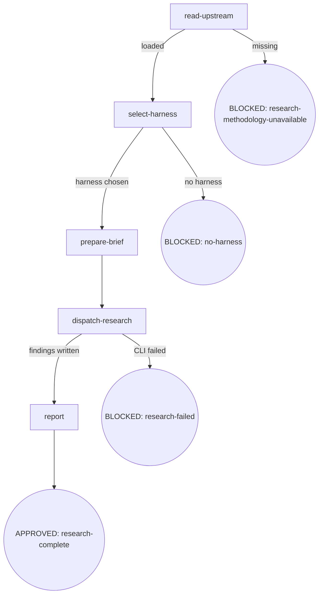

# P11 cli-research 设计 spec

- **Version**: v1.0 · 2026-08-28
- **Status**: Approved
- **Author**: [human] · Claude Opus 4.8 (osuperpowers:brainstorming dogfood session)
- **Parent program**: [技能 digraph 重构 + 引擎修复](./2026-08-24-skill-digraph-refactor-overall.md) v1.19
- **Depends on**: P3 (docs-infra) · P10 (cdd-engine-fixes)

---

> P11 increment only. Cross-phase conventions in [overall](./2026-08-24-skill-digraph-refactor-overall.md)；overall wins on conflict。

---

## §1 约束指针

不重复 overall 约束。本 phase 遵守 overall 全部 Boundary rules，包括串行 phase 纪律、CDD engine dispatch、CLI background execution。

---

## §2 设计正文

### §2.1 Architecture Overview

Research 作为独立 CLI（`cdd-research.mjs`），不走 CDD engine（`cdd-task.mjs`）。

**核心原则：**

- **CDD engine 只管代码变更**：implement/task-review/fix 保持不变
- **Research 独立 CLI**：`cdd-research.mjs` 专注只读探索，不走 CDD workspace/handoff/commit-gate
- **CLI 基础设施复用**：harness registry + session management 从 runner.mjs 提取为 `lib/cli-shared.mjs`
- **I6 兼容**：orchestrator 通过 CLI 调用（`cdd-research.mjs`），不直接调 harness CLI

**架构图：**

```
┌─────────────────────────────────────────────────────┐
│                    Skill Layer                       │
│                                                     │
│  brainstorming          cli-research (新)            │
│  explore-context        ┌─────────────────┐         │
│  ┌──────────────┐      │ read-upstream   │         │
│  │ Agent tool   │      │ select-harness  │         │
│  │ (default)    │      │ prepare-brief   │         │
│  │              │      │ dispatch-research│         │
│  │ 可选 CLI ────┼──→   │ report          │         │
│  │ (已知harness)│      └────────┬────────┘         │
│  └──────────────┘              │                    │
│                                ▼                    │
├─────────────────────────────────────────────────────┤
│                   Engine Layer                       │
│                                                     │
│  cdd-task.mjs (CDD workflow)   cdd-research.mjs (新)│
│  ┌─────────────────────┐      ┌──────────────────┐  │
│  │ implement/task-review│      │ research-only     │  │
│  │ fix                 │      │ (no commit-gate,  │  │
│  │ (commit-gate,       │      │  no workspace,    │  │
│  │  workspace, handoff)│      │  no handoff JSON) │  │
│  └──────────┬──────────┘      └────────┬─────────┘  │
│             │                          │             │
│             ▼                          ▼             │
│  lib/runner.mjs              lib/research.mjs (新)  │
│  (CDD per-task runner)       (research invocation)  │
│             │                          │             │
│             └──────────┬───────────────┘             │
│                        ▼                             │
│              lib/cli-shared.mjs (新)                  │
│              (spawnCapture, invokeCli)               │
└─────────────────────────────────────────────────────┘
```

### §2.2 cdd-research.mjs CLI

**Usage：**

```bash
node {pluginRoot}/bin/engine/cdd-research.mjs --harness <name> --brief <path> --output <path>
```

**参数：**

| 参数 | 必需 | 描述 |
|---|---|---|
| `--harness <name>` | Yes | 目标 harness（claude, cursor 等） |
| `--brief <path>` | Yes | 研究 brief 文件（Markdown，格式见下） |
| `--output <path>` | Yes | findings 输出路径（Markdown） |

**Brief 文件格式（Markdown schema）：**

```markdown
# Research Brief

## Research Questions
- Q1: <具体研究问题>
- Q2: <具体研究问题>

## Scope
<研究范围约束：哪些文件/目录/概念在范围内，哪些不在>

## Expected Output
<path to findings output file>
```

**环境变量：**

| 变量 | 描述 |
|---|---|
| `RESEARCH_TIMEOUT` | 超时毫秒（默认 600000 = 10 min） |

**Exit codes：**

| Code | 含义 |
|---|---|
| 0 | 研究完成，findings 已写入 --output |
| 1 | 错误（harness 不可用、CLI 失败等） |
| 2 | Usage error（缺少必需参数） |

**内部流程：**

1. 解析参数 → 校验必需参数
2. 加载 harness registry → 检查 harness 可用性
3. 读取 brief 文件 → 构造 research prompt（brief 内容 + 5 步方法论框架）
4. 调用 harness CLI — **绕过 invokeCli**（invokeCli 的 mode 参数硬编码为 implement/task-review/fix；research 不需要 task-review prefix 或 output 模式处理）。直接用 `spawnCapture` 调用 harness binary（如 `claude -p`），传入构造好的 prompt
5. 将 findings 写入 `--output` 路径
6. 退出

**Prompt 构造：** `cdd-research.mjs` 内置 research methodology prompt（扩展自 mattpocock-skills:research 的方法论，5 步框架：Scope → Investigate → Synthesize → Verify → Write），叠加 brief 中的具体研究问题。保证即使调用方不读上游 research SKILL.md，CLI 也能产出结构化研究结果。

### §2.3 lib/cli-shared.mjs — 共享 CLI 基础设施

从 `runner.mjs` 提取以下函数到 `lib/cli-shared.mjs`：

| 函数 | 描述 |
|---|---|
| `spawnCapture(command, args, opts)` | 子进程 spawn + stdout/stderr 捕获 |
| `invokeCli(entry, prompt, mode, env, cwd)` | harness CLI 调用 + output 模式处理 |

**runner.mjs 改动：** 删除 `spawnCapture` 和 `invokeCli` 的本地定义，改为从 `lib/cli-shared.mjs` import。外部 API 不变（runner.mjs 的导出函数签名不变）。

**不变的模块：**

- `lib/registry.mjs`（loadRegistry, checkHarness）— cdd-research.mjs 直接 import
- `lib/contract.mjs` — 不改（research 不走 commit-gate）
- `lib/templates.mjs`（pluginRoot）— 直接 import

### §2.4 lib/research.mjs — Research 逻辑

Research-specific 逻辑模块：

| 函数 | 描述 |
|---|---|
| `buildResearchPrompt(briefContent)` | 从 brief 内容 + methodology 精简版构造完整 prompt |
| `writeFindings(outputPath, findings)` | 将 findings 写入 Markdown 文件 |

**Research methodology 精简版（内置）：**

```
Research Framework (based on mattpocock-skills:research):

1. Scope: Parse research questions from the brief
2. Investigate: Read files, docs, code — understand the current state
3. Synthesize: Connect findings, identify patterns and gaps
4. Verify: Cross-reference claims against actual code/docs
5. Write: Output structured Markdown findings

Output format:
- Per question: findings, evidence (file:line), confidence level
- Summary: key insights, open questions, recommendations
```

### §2.5 cli-research SKILL.md

节点锚定式，5 节点 + BLOCKED 终态：



#### `read-upstream`

- **Do**: Read `mattpocock-skills` `skills/engineering/research/SKILL.md` 作为研究方法论基线。Resolution: ① harness plugin 系统定位 sibling mattpocock-skills plugin；② fallback vendored 路径 `vendors/mattpocock-skills/skills/engineering/research/SKILL.md`
- **Read**: 上游 research SKILL.md 文件
- **Exit**: 文件可读 → `select-harness`；缺失 → BLOCKED: research-methodology-unavailable
- **Fail**: Skill-invoke 上游 → 违反 I1

#### `select-harness`

- **Do**: 调用 [cli-select](../cli-select/SKILL.md) 的 [ask](../cli-select/SKILL.md#ask) 节点获取用户选定的 harness 名
- **Read**: cli-select 返回的 harness 名
- **Exit**: harness 选定 → `prepare-brief`；cli-select BLOCKED → BLOCKED: no-harness
- **Fail**: cli-select 返回 BLOCKED → 同 BLOCKED

#### `prepare-brief`

- **Do**: 从用户输入提取研究问题 + 预期产出路径，写入临时 brief 文件（Markdown 格式：研究问题列表 + scope 约束 + 预期 findings 路径）。brief 内容结合上游 research 方法论（从 read-upstream 加载）指导研究方向。
- **Read**: 用户输入 + 上游 research 方法论
- **Exit**: brief 写入 → `dispatch-research`
- **Fail**: 用户未提供研究问题 → 提示补充

#### `dispatch-research`

- **Do**: 构造并执行 `node {pluginRoot}/bin/engine/cdd-research.mjs --harness <name> --brief <brief-path> --output <findings-path>`。**Background execution**：必须以 background 方式运行 CLI（harness `run_in_background` when supported; timeout + poll otherwise）。
- **Read**: brief 文件 + cdd-research 输出
- **Exit**: findings 写入成功 → `report`；CLI 失败 → BLOCKED: research-failed
- **Fail**: CLI 失败 + 无 findings → BLOCKED

#### `report`

- **Do**: 向用户报告研究完成：findings 路径 + 简要摘要（从 findings 文件前几行提取）
- **Read**: findings 文件
- **Exit**: 报告完成 → APPROVED: research-complete

#### Invariants

| # | Invariant |
|---|---|
| I1 | **Read, not Skill-invoke** — upstream research SKILL.md 只 Read，不 Skill-invoke（触发 router 拦截） |
| I2 | **CLI Background Execution** — dispatch-research 必须以 background 方式运行 CLI |
| I3 | **Findings Path由调用方决定** — engine 不强制路径，brief 中指定 |

### §2.6 brainstorming explore-context 集成

**当前行为：** `explore-context` 节点在研究确认后 spawn Agent tool（手动）。

**改动：** `explore-context` 节点 Do 字段扩展——研究确认后新增分支：

```
用户确认 trigger research?
├── 已知 harness → 走 CLI 路径（cdd-research.mjs）
│   └── prepare brief → dispatch-research → findings 落盘
└── 未知 harness → 走 Agent tool 路径（默认）
    └── spawn research agent → findings 落盘
```

**不变的默认行为：** 大多数 brainstorming session 在 explore-context 时还不知道 harness（harness 在 `select-harness` 节点才选）。Agent tool 路径仍是主要路径。CLI 路径是增强，不是替代。

**「已知 harness」定义：** explore-context 节点通过以下方式判断 harness 是否已知：① session context 中有 prior CDD session 的 harness 信息（如用户说「用 claude 做研究」）；② 用户在 explore-context 之前显式指定了 harness。若 harness 未知，走 Agent tool 路径（不变）。

**CLI 路径使用场景：**

- 已有 CDD session（harness 已知）
- 用户明确指定 harness
- 重复研究（已有 harness 上下文）

**改动范围：**

- `brainstorming/SKILL.md`：explore-context 节点 Do 字段扩展
- `brainstorming/SKILL.zh-CN.md`：同步
- 不改 digraph（CLI 路径是节点内部分支，不是新节点）

---

## §3 Acceptance Criteria

| # | Criterion |
|---|---|
| ① | `cdd-research.mjs` 存在且 `--help` 返回 exit 0 |
| ② | `lib/cli-shared.mjs` 导出 `spawnCapture` 和 `invokeCli` |
| ③ | `runner.mjs` 从 `cli-shared.mjs` import（外部 API 不变） |
| ④ | `lib/research.mjs` 导出 `buildResearchPrompt` 和 `writeFindings` |
| ⑤ | `cli-research/SKILL.md` 存在，节点锚定式（5 节点 + BLOCKED 终态） |
| ⑥ | `cli-research/SKILL.zh-CN.md` 镜像同步 |
| ⑦ | `brainstorming/SKILL.md` explore-context 含 CLI 路径描述 |
| ⑧ | `brainstorming/SKILL.zh-CN.md` 同步 |
| ⑨ | `package.json` 含 `cdd-research` bin |
| ⑩ | `pnpm run emit && pnpm run validate` 绿 |
| ⑪ | 全仓无 dangling 引用（旧格式关键词归零） |
| ⑫ | `cdd-research.mjs --harness <name> --brief <brief> --output <out>` 执行后 `<out>` 文件存在且含 findings Markdown |

---

## §4 Deviations from Overall

| Overall assumption | Phase decision | Overall updated? |
|---|---|---|
| P11 scope: 扩展 `cdd-task.mjs` 加 `--mode research` | 改为新建独立 `cdd-research.mjs`（不走 CDD engine） | Yes — v1.20 · 2026-08-28 |
| P11 acceptance ⑨: CDD execution | 改为 `cdd-research.mjs` CLI 执行验证 | Yes — v1.20 · 2026-08-28 |

**偏离理由：**

1. **单一职责**：CDD engine 围绕代码变更设计（commit-gate → handoff → ledger → review → fix-loop）。Research 是只读探索，强制塞入 CDD 工作流会产生大量 research-specific 跳过逻辑。

2. **无 CDD 基建过载**：Research 不需要 workspace slug、brief 自动生成、handoff JSON、commit-gate、ledger 追加。独立 CLI 用 `--brief` / `--output` 直接参数，更简洁。

3. **可演进性**：Research 模式未来可独立发展（多源并行、streaming、progressive disclosure），不受 CDD per-task 模型限制。

4. **最小 engine 改动**：不改 `cdd-task.mjs` 的 VALID_MODES、不改 `runner.mjs` 的 CDD 特定逻辑、不改 `contract.mjs`。只提取共享 CLI 函数到 `cli-shared.mjs`。

---

## §5 Notes for Downstream

- **P12（cli-timeout）**：`cdd-research.mjs` 同样受 timeout 约束（`RESEARCH_TIMEOUT` 环境变量）。P12 设计时需覆盖 research CLI 的 timeout/kill 场景。
- **P14（brainstorming 流程调优）**：P14 改 `explore-context` 节点（pre-design 决策门 + sync-overall），需先稳定 P11 的 explore-context CLI 增强。
- **P13（closure）**：终扫时确认 cli-research 新增节点无旧格式残留。

---

## §6 Review

见 writing-plans 阶段的 3-pass plan review。
