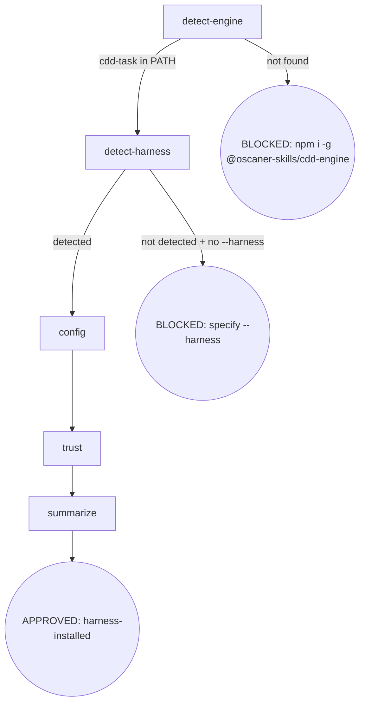

# CDD Engine 全面重构 P1 设计 spec

- **版本**: v1.2 · Approved
- **作者**: Oscaner Miao
- **父程序**: [2026-09-04-cdd-engine-overhaul-overall.md](./2026-09-04-cdd-engine-overhaul-overall.md) v1.1
- **依赖**: 无（P1 为首相，无前置 hard-dependency）
- **涉及 issues**: #231（Bug A）、#232（Bug B/C/D/E/F/G/K/L）、#137、#139、#109

---

## Section 0: Increment 说明

P1 增量。跨 phase 惯例见 [overall](./2026-09-04-cdd-engine-overhaul-overall.md)；冲突时 overall 优先。

本 spec 覆盖 P1 范围内所有 Bug 修复 + Enhancement，是 P2（基础设施整治）和 P3（Skills + 模板重构）的技术前提。

---

## Section 1: 约束指针

- Breaking changes 允许（overall §程序章程）。
- 最佳实践、不留技术债。
- 成熟第三方包优先于手写工具。
- 所有 `.mjs` 文件，Node 22+，纯 ESM。
- 英文代码注释；中文内部 spec/plan 文档。

---

## Section 2: 设计主体

### 2.1 包边界拆分（Enh E）

#### 决策

`@oscaner-skills/cdd-engine` 作为独立 npm package，位于 `packages/cdd-engine/`，通过 pnpm workspace 链接到 osuperpowers。

**cdd-engine 包含**（engine 运行时必需）：
- 所有 5 个 CLI 入口（见 §2.3；cdd-session-activate 删除 - Bug O）
- `bin/lib/`：runner、docs-runner、cli-shared、contract、ledger、progress、registry、research、schema-utils、templates、brief（**全部迁移**）
- `bin/review-loop.mjs`（**迁移**，位于 `bin/engine/review-loop.mjs`，非 lib/ 内）
- `bin/harness-registry.json`
- `bin/tests/`（随代码迁移）
- `templates/`：所有模板 flat 目录，取代 `skills/` 层级（implement.md、task-review.md、fix.md、spec-review.md、plan-review.md、branch-review.md、cdd-handoff-schema.json、docs-handoff-schema.json，**迁移**）

**osuperpowers 保留**：
- `bin/gate/`（跨 harness gate hooks）
- `bin/init/`（install-harness.mjs）
- `bin/utils/`（harness-detect、skills-probe、exit 等）
- `skills/`（所有 SKILL.md 文件、brainstorming docs、report-issue templates）
- `bin/engine/` 目录**完全删除**（迁移后）

#### package.json 变更

**`packages/cdd-engine/package.json`**（新建）：
```json
{
  "name": "@oscaner-skills/cdd-engine",
  "version": "1.0.0",
  "type": "module",
  "engines": { "node": ">=22.12.0" },
  "bin": {
    "cdd-task":             "./bin/cdd-task.mjs",
    "docs-task":            "./bin/docs-task.mjs",
    "branch-review":        "./bin/branch-review.mjs",
    "cdd-select":           "./bin/cdd-select.mjs",
    "cdd-research":         "./bin/cdd-research.mjs"
  },
  "dependencies": {
    "commander": "^15",
    "execa":     "^9",
    "ajv":       "^8",
    "semver":    "^7"
  },
  "devDependencies": {
    "vitest": "^3"
  }
}
```

`p-retry` **不引入**（见 §2.3 retry 设计）。

**`packages/osuperpowers/package.json`** 变更：
- 删除全部 `bin` 条目（移到 cdd-engine）
- 新增 `dependencies.@oscaner-skills/cdd-engine: "workspace:*"`
- `main` 字段调整为指向 gate adapter（不变）

### 2.2 CLI 框架：Commander.js v15（Enh E）

所有 6 个 CLI 从手写 arg parse 迁移到 Commander v15（ESM-only，Node 22+，437M/周下载量）。

**迁移模式**（每个 CLI 文件独立，无共享根入口）：

```js
// 以 cdd-task.mjs 为例
import { Command } from 'commander';
const program = new Command();
program
  .name('cdd-task')
  .description('CDD per-task runner: implement | task-review | fix')
  .requiredOption('--harness <name>', 'harness name')
  .requiredOption('--task <n>',       'task number', (v) => parseInt(v, 10))  // Bug A fix
  .requiredOption('--mode <mode>',    'implement|task-review|fix')
  .option('--plan <path>',  'plan file path (sets PLAN_FILE)')
  .option('--scope <scope>', 'blocker-only|deferred-sweep (fix mode)')
  .action(async (opts) => { await runTask(opts.harness, opts.task, { ... }); });
program.parseAsync();
```

Commander 自动生成 `--help`；parse 失败自动 exit 2（对齐现有行为）。

**Bug A 修复**：`--task` option coercion `parseInt(v, 10)` 保证 `taskNum` 为 number，消除 `progressData.tasks.find(t => t.task === taskNum)` 的 `===` 类型不匹配。

### 2.3 第三方工具替换

| 替换项 | 旧实现 | 新实现 | 理由 |
|--------|--------|--------|------|
| subprocess | 手写 `spawnCapture`（timeout/SIGTERM/SIGKILL/unkillable） | **`execa` v9** | 内置 timeout、forceKill、env strip，消除 ~60 行手写逻辑 |
| JSON Schema 验证 | 手写 `schema-utils.mjs` | **`ajv` v8** | 直接消费现有 `cdd-handoff-schema.json`，无需重写 |
| 版本排序 | 手写 `byVersion` | **`semver`** | 边界覆盖更完整 |
| stream-json 解析 | 手写 `extractStreamJsonFinal`（复杂 scanner） | 行级 `JSON.parse`（无第三方） | Claude stream-json 输出为 NDJSON，split+parse 即可 |
| transient 重试 | 无 | 手写 retry loop（无第三方） | p-retry 基于 throw 触发，与 `reject:false` 的 execa 不兼容；手写 loop 更简洁 |

**`execa` 替换细节**（`cli-shared.mjs`）：

```js
import { execa } from 'execa';

export async function invokeCli(entry, prompt, mode, env, cwd, timeoutMs) {
  const { cli, invoke, output, task_review_prefix } = entry;
  const promptArg = mode === 'task-review' && task_review_prefix
    ? `${task_review_prefix} ${prompt}` : prompt;
  const args = [...invoke.split(/\s+/).filter(Boolean), promptArg];

  // strip credentials from subprocess env (#137)
  const cleanEnv = { ...env };
  delete cleanEnv.CLAUDE_CODE_SUBAGENT_MODEL;
  delete cleanEnv.ANTHROPIC_API_KEY;

  const res = await execa(cli, args, {
    cwd,
    env: cleanEnv,
    timeout: timeoutMs,           // 内置 watchdog
    forceKillAfterDelay: 5000,    // SIGKILL fallback
    reject: false,                // 不 throw
  });
  // 保持现有 {ok, code, stdout, stderr, timedOut} 接口
  const timedOut = res.timedOut ?? false;
  const ok = res.exitCode === 0 && !timedOut;
  return { ok, code: res.exitCode ?? 1, stdout: res.stdout, stderr: res.stderr, timedOut };
}
```

`spawnCapture` 同理替换，接口不变（调用方零改动）。`invokeCliOverride` DI 参数**删除**（由 Vitest 模块 mock 替代）。

**`ajv` 替换范围**（`schema-utils.mjs`）：仅 `validateHandoffSchema` 函数用 ajv 替换（读 `cdd-handoff-schema.json` → ajv compile → validate）；`loadHandoffSchema`（读 JSON 文件）保留但可能简化为 ajv 内部持有 schema。`schema-utils.mjs` 文件保留，不删除。

**`p-retry` 不引入**。Bug #109 transient 重试改用手写 retry loop（`runner.mjs` 内）：

```js
// runner.mjs — invokeCli 外层 retry（仅 cdd-task，非 docs-runner）
async function invokeCliWithRetry(entry, prompt, mode, env, cwd, timeoutMs) {
  const MAX_RETRIES = 2;
  const BACKOFF_MS = [5000, 15000]; // 5s, 15s
  for (let attempt = 0; attempt <= MAX_RETRIES; attempt++) {
    const result = await invokeCli(entry, prompt, mode, env, cwd, timeoutMs);
    if (result.ok || result.timedOut) return result;      // success or timeout → no retry
    const isTransient = /overloaded|rate_limit|529/.test(result.stderr ?? '');
    if (isTransient && attempt < MAX_RETRIES) {
      await new Promise(r => setTimeout(r, BACKOFF_MS[attempt]));
      continue;
    }
    return result;
  }
}
```

`execa` `reject:false` 不 throw，`p-retry` 的 shouldRetry 永不触发，故直接手写 loop。

### 2.3b Enh P — harness-registry prefix/suffix 通用注入（per mode）

`invokeCli` 的 `task_review_prefix` 单字段（仅 task-review 模式）泛化为 per-mode `prefix` / `suffix` 注入。

**harness-registry.json**：
```json
{
  "claude": {
    "invoke": "-p --output-format text --dangerously-skip-permissions",
    "prefix": {
      "implement": "Skill(mattpocock-skills:tdd)",
      "task-review": "Skill(mattpocock-skills:code-review)",
      "fix": ""
    },
    "suffix": { }
  }
}
```

**`cli-shared.mjs invokeCli` 渲染**：
```js
const p = entry.prefix?.[mode] ?? '';
const s = entry.suffix?.[mode] ?? '';
const promptArg = [p, prompt, s].filter(Boolean).join('\n');  // 换行分隔，prefix/suffix 独立成行
```

`task_review_prefix` 字段废弃。implement 模式注入 `Skill(mattpocock-skills:tdd)`（显式激活 tdd skill，与 implement.md 模板第 1 步一致）。

### 2.4 Bug 修复

#### Bug B + Enh D — branch-review.mjs 独立 CLI

**根因**：`docs-task.mjs` 设计用于文档（spec/plan）审查，`branch-review.md` 模板需要 git range 参数（`{{BASE}}`/`{{HEAD}}`），两者语义完全不兼容；agent 在 docs-task 上下文中持续不写 handoff。

**修复**：新建 `packages/cdd-engine/bin/branch-review.mjs`。

CLI 接口：
```
branch-review --harness <name> --plan <path> --base <sha> --head <sha> [--round <n>]
```

- 使用 **CDD handoff schema**（`status / commits / findings / artifacts / blocker`，无 `doc_path`）
- Handoff 路径：`<repoRoot>/.superpowers/cdd/<plan-slug>/branch-review-<base7>..<head7>.json`
- 模板 `templates/branch-review.md` 更新：
  - 删除 `{{DOC}}` 字段（语义错误）
  - `commits: base={{BASE}} head={{HEAD}}` 写入 handoff
- `docs-task.mjs` 删除 `--template branch-review` 路径（breaking change）

架构对称 `cdd-task.mjs`：复用 `invokeCli`、`registry`、`execa` 层，独立 arg parse + handoff 管理。

#### Bug C — task-review agent 间歇性不写 handoff

**根因**：`task-review.md` 模板中 `## Return (H1)` 节位于 `## Handoff Output` 节之前；agent 输出 H1 四行后认为任务完成，跳过 handoff 写入。

**修复**：
1. 调换节顺序：`## Handoff Output` 移至 `## Return (H1)` 之前
2. 模板顶部加 HARD GATE（紧跟 Instructions 列表之后）：

```markdown
> ⚠️ HARD GATE — Write `{{HANDOFF}}` BEFORE outputting H1.
> H1 output without a written handoff file = BLOCKED (runner exit 1).
```

#### Bug K — docs-task handoff 路径

**根因**：`workspace = path.dirname(values.doc)` 将 handoff 写到文档同目录（如 `docs/superpowers/specs/`）。

**修复**（`docs-task.mjs`）：
```js
import { gitToplevel } from './lib/contract.mjs';
const repoRoot = gitToplevel(process.cwd());
if (!repoRoot) throw new Error('docs-task: not in a git repo');
const workspace = path.join(repoRoot, '.superpowers', 'docs-review');
// handoff: .superpowers/docs-review/spec-review-1.json
```

统一用 `.superpowers/docs-review/` 存放所有 docs-task handoff（不区分 template 类型，避免分支）。

#### Bug L — subprocess cwd 挂死

**根因**：`docs-runner.mjs` 以 `path.dirname(handoffPath)` 为 subprocess cwd；从 docs 子目录启动 `claude -p` 时 gate hook 无法解析 repoRoot，进程挂死（30min timeout）。

**修复**（随 Bug K 一并修复）：
```js
// docs-runner.mjs
const repoRoot = gitToplevel(process.cwd());
await invokeCli(entry, prompt, 'review', env, repoRoot, timeoutMs);
```

subprocess cwd = project root，gate hook 正常初始化。

#### Bug #137 — subprocess 安全

- `execa` 替换已内置 timeout + forceKillAfterDelay（见 §2.3）
- 新增 `ANTHROPIC_API_KEY` 从子进程 env 中 strip（防止凭证泄漏）
- 所有 `spawnCapture` 调用点默认传 `resolveTimeoutMs(env, mode)`（无超时调用点消除）

#### Bug #139 — stream-json 解析失败

**根因**：手写 JSON scanner 遇到嵌入未转义引号时解析出错。

**修复**（`cli-shared.mjs`）：
```js
function extractStreamJsonFinal(raw) {
  let last = null;
  for (const line of raw.split('\n')) {
    const trimmed = line.trim();
    if (!trimmed) continue;
    try {
      const ev = JSON.parse(trimmed);
      if (ev.type === 'completion' && ev.finalText != null) last = ev.finalText;
    } catch { /* skip non-JSON lines */ }
  }
  return last;
}
```

删除全部手写 scanner（`jsonValueEnd`、`scanString`、`scanBalanced`）。

#### Bug #109 — transient API 错误恢复

**修复**：`runner.mjs` 中 `invokeCli` 调用点改为 `invokeCliWithRetry`（手写 retry loop，见 §2.3）。retry 条件：非 timeout + stderr 含 `overloaded|rate_limit|529`，最多 2 次，退避 5s/15s。

### 2.5 Enh F — Skills gate 生产联线

Enh F 分两层：

**层 1（SKILL.md 编排层）**：`cli-select` SKILL.md 节点调用 `cdd-select.mjs` 前，先检查 `cdd-task` 是否在 PATH。场景：用户安装了 osuperpowers AI 插件（skills 可用）但未全局安装 `@oscaner-skills/cdd-engine`（CLIs 不在 PATH）。检测在 SKILL.md 节点内（读 `command -v cdd-task`），非在 `cdd-select.mjs` 内（自检循环无意义：cdd-select 运行则 cdd-engine 已装）：

```markdown
<!-- cli-driven-development/SKILL.md: select-harness 节点 -->
**detect-engine**: Before calling `cdd-select`, verify `cdd-task` is in PATH.
- Found → proceed to `cdd-select`
- Not found → BLOCKED: `@oscaner-skills/cdd-engine` not installed.
  Run: `npm i -g @oscaner-skills/cdd-engine`
```

**层 2（runner DI seam）**：`runner.mjs` 的 `probeSkills` DI 参数保留（测试/扩展点）；生产默认值为 `undefined`（fail-open）。osuperpowers 通过 skill SKILL.md 编排层完成 plugin 可用性检测（不在 cdd-engine 内部）。

### 2.6 Enh G — init 单命令化

**SKILL.md `init/SKILL.md` 变更**：

删除 `harness` 子命令层，`dispatch` 节重写：
- `init [--harness <name>] [--dry-run]` → 直接进入 `detect-engine`
- 不再有 `list-harness` 分支（`init` 无参数时自动探测并安装）

**新流程**（`harness.md` 流程图新增 `detect-engine` 首节点）：



**`detect-engine` 节点**：
- 检测 `cdd-task` 是否在 PATH（SKILL.md 内 `command -v cdd-task`）
- 未安装 → 软 BLOCKED（输出安装指引 `npm i -g @oscaner-skills/cdd-engine`，不 hard exit；用户按指引安装后重试）
- `--dry-run` → 跳过安装检测（preview only）

**`detect-harness` 节点**（替代原 `dispatch → run-harness`）：
- 复用 `detectCurrentHarness(process.env)`（`CLAUDE_CODE_SESSION_ID`/`CURSOR_TRACE_ID` 等探测）
- `--harness <name>` 显式覆盖
- 无法探测且未指定 → BLOCKED

底层 `install-harness.mjs` 接口不变。

### 2.7 测试框架：Vitest（替换 node:test）

`cdd-engine` 使用 **Vitest v3**（ESM-first，~25M/周，Jest 兼容 API）。

**现有测试迁移**：
- `import { test } from 'node:test'` → `import { it, describe, vi, expect } from 'vitest'`
- `assert.strictEqual(a, b)` → `expect(a).toBe(b)`
- `assert.deepStrictEqual(a, b)` → `expect(a).toEqual(b)`
- `assert.throws` → `expect(() => ...).toThrow()`
- 迁移量估计：~300 行改动，无逻辑变更

**DI seam 清理**（Vitest 模块 mock 替代）：

删除 `runTask` 中以下纯测试 DI 参数（**Breaking — 测试方改用 `vi.mock()`**）：
- `invokeCliOverride`（最主要，execa mock 替代）
- `registryPath`（`vi.mock('./harness-registry.json', ...)` 替代）

保留：`scriptsDir`（`review-package` 路径需要灵活性，不纯测试用）、`probeSkills`（生产 DI seam）、`noExit`（测试用，返回 exitCode 不退出进程，保留）。

**Mock 示例**：
```js
// vitest
import { vi, it, expect } from 'vitest';
vi.mock('execa', () => ({
  execa: vi.fn().mockResolvedValue({ exitCode: 0, stdout: 'status: APPROVED\n...', stderr: '' }),
}));

it('runTask dry-run exits 0', async () => {
  const { exitCode } = await runTask('claude', 1, { mode: 'implement', noExit: true });
  expect(exitCode).toBe(0);
});
```

**`vitest.config.mjs`**（`packages/cdd-engine/` 根）：
```js
import { defineConfig } from 'vitest/config';
export default defineConfig({
  test: { pool: 'forks', coverage: { provider: 'v8' } },
});
```

### 2.8 关联 issues 关闭目标

P1 完成后应关闭：

| Issue | 关闭原因 |
|-------|---------|
| #231 | Bug A：Commander parseInt coercion |
| #232 | Bug B/C/D/K/L comments：对应修复落地 |
| #137 | execa 替换 + ANTHROPIC_API_KEY strip |
| #139 | NDJSON 行级解析替换手写 scanner |
| #109 | 手写 `invokeCliWithRetry` loop（§2.3） |
| #133 | Enh G init 单命令 + Enh F gate 联线 |
| #134 | 同上 |
| #132 | Enh G detect-harness 多 harness 感知 |

### 2.8 Bug O — cdd-session-activate.mjs 删除 + gate env 传播

**根因**：`cdd-session-activate.mjs`（bash `cdd-session-activate.sh` 的 Node port）写 pending-cdd JSON（`${TMPDIR}/osuperpowers/pending-cdd/`）供 gate hooks 读取。bash 时代由 `cdd-common.sh` 调用；Node 迁移后 production 无任何调用方 → 孤儿代码 + gate 恒 fail-open。

**修复**：
1. **删除** `packages/osuperpowers/bin/engine/cdd-session-activate.mjs`（不迁入 cdd-engine）
2. **gate 激活通道改为 env 传播**：`runner.mjs` spawn CLI 子进程时设置 `CDD_GATE_WORKSPACE`（task workspace）+ `CDD_GATE_MODE`（`cli` 等）；PreToolUse hook 在子进程内继承该 env
3. `cdd-gate-core.mjs`：`gateDecide` 改为从 `process.env.CDD_GATE_WORKSPACE` 读取，删除 `pendingPathFor` / `DEFAULT_PENDING_ROOT` / TTL 过期 / pending 文件读取逻辑
4. **移除 Task 8 已迁移到 cdd-engine/bin 的 `cdd-session-activate.mjs`**

**gate core 变更**（`cdd-gate-core.mjs`）：

```js
// 旧：读 TMPDIR pending 文件
const pendingPath = pendingPathFor(sessionKey);
let pending = JSON.parse(readFileSync(pendingPath, 'utf8')) ?? null;
if (!pending) return allowResult();

// 新：读环境变量（hook 在子进程内运行，继承 runner spawn env）
const workspace = process.env.CDD_GATE_WORKSPACE ?? '';
if (!workspace) return allowResult();
const sessionMode = process.env.CDD_GATE_MODE ?? '';
```

**gate adapters**：`gateDecide` 的 `repoRoot` 判定改为结合 `process.env.CDD_GATE_WORKSPACE`（替代依赖 pending.repo_root）。

### 2.9 Acceptance criteria

每条独立可验证：

1. **包结构**：`packages/cdd-engine/package.json` 存在，`bin` 含 6 个 CLI；`packages/osuperpowers/bin/engine/` 目录不存在；`osuperpowers/package.json#dependencies` 含 `@oscaner-skills/cdd-engine`
2. **Bug A**：`cdd-task --harness claude --task 2 --mode implement --plan test.md` 中 `taskNum` 类型为 number；`progressData.tasks.find(t => t.task === 2)` 能匹配（`===` 不再失败）
3. **Bug B/Enh D**：`branch-review --harness claude --plan <path> --base HEAD~1 --head HEAD`（dry-run 下）写出 `.superpowers/cdd/<slug>/branch-review-*.json`，schema 符合 CDD handoff
4. **Bug C**：`task-review.md` 中 `## Handoff Output` 节出现在 `## Return (H1)` 节之前；顶部含 HARD GATE 文本
5. **Bug K**：`docs-task --mode review --template spec-review --doc docs/x.md` 写出 `.superpowers/docs-review/spec-review-1.json`（不再写到 `docs/superpowers/specs/`）
6. **Bug L**：`docs-task` 调用 `invokeCli` 时 cwd = `gitToplevel(process.cwd())`；subprocess 从 project root 启动（集成测试可验证）
7. **#137**：subprocess env 不含 `ANTHROPIC_API_KEY`；timeout 路径由 execa 内置处理（无手写 SIGTERM timer 代码）
8. **#139**：`extractStreamJsonFinal` 无手写 scanner 代码；`cli-shared.mjs` 行数减少 ≥ 40 行
9. **#109**：`runner.mjs` 含 `invokeCliWithRetry` 手写 loop；overloaded/rate_limit/529 响应触发 retry，timeout 不 retry（Vitest mock 验证）
9b. **Enh P**：`harness-registry.json` 含 `prefix`/`suffix` per-mode 对象；`invokeCli` 用 `[p, prompt, s].filter(Boolean).join('\n')`；`task_review_prefix` 无残留（Vitest mock 验证 prefix 注入 + 换行分隔）
10. **Enh G**：`/init` 无参数 → 探测当前 harness → 安装；无 `harness` 子命令；`--harness claude` 可用
11. **Vitest**：`pnpm -F @oscaner-skills/cdd-engine test` 全部通过；`node:test` import 无残留；`invokeCliOverride` 参数从 `runTask` 签名中删除
12. **所有关联 issues**（§2.8）标记 closed

---

## Section 3: 与 overall 偏差

| Overall 假设 | P1 决策 | Overall 已更新 |
|---|---|---|
| 无 | 无偏差，P1 设计在 overall 框架内完整实现 | N/A |

---

## Section 4: 下游注意事项（P2、P3）

- **P2**（基础设施整治）：`scripts/` 目录重构时，`ci-validate.mjs` 需新增对 `cdd-engine` 包的 emit 检查；CI workflow 引入 `link-cdd-engine` composite action（见 Enh H）
- **P3**（Skills + 模板重构）：`overall-spec-template.md` 的 Issue (ref) comment URL 格式已在本 overall spec 中使用，P3 补充文档 + report-issue skill 重构
- **breaking change 通知**：`invokeCliOverride` DI 参数删除 + `bin/engine/` 路径迁移；P2 CI 脚本需更新 import 路径

---

## Section 5: Review

待 `spec-review?` 节点 3-pass 审查（completeness / consistency+scope / clarity+YAGNI）。
