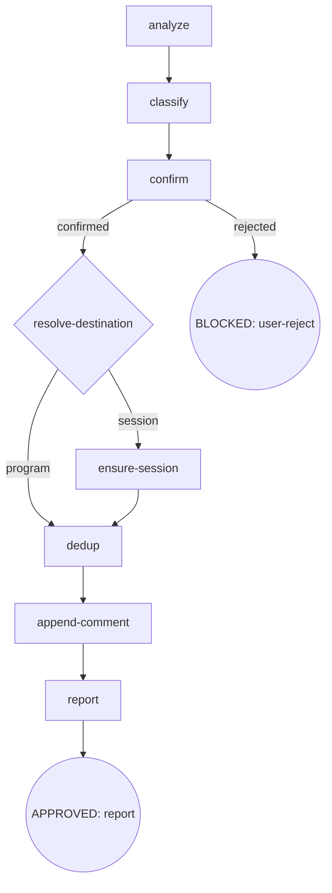

# CDD Engine 重构 + 生态完善 — P3 设计 Spec

- **Version**: v1.0 · 2026-09-06
- **Status**: Draft
- **Author**: [human] · Claude Opus 4.8 (osuperpowers:brainstorming)
- **Parent program**: [2026-09-04-cdd-engine-overhaul-overall.md](2026-09-04-cdd-engine-overhaul-overall.md) (v1.15)
- **Depends on**: P1（engine 已发布 + PR #236 合入 develop）· P2（scripts/CI 重组 + PR #237 合入 develop）

---

## Section 0: Incremental warning

P3（Skills + 模板重构）增量 spec。跨 phase 约定以 [overall](../../2026-09-04-cdd-engine-overhaul-overall.md) 为准；冲突时 overall wins。

## Section 1: Constraints pointer

- 不重复 overall conventions；overall wins。
- 仓库语言政策：SKILL.md / docs 英文主源；本 spec 中文（Strategy B，内部开发者文档）。
- 不 commit 除非用户明确要求；changeset 逐 phase 建。
- vendored 子模块不可改。
- 允许破坏性更新，确保最佳实践，不留技术债务。
- 消费者视角：skill 规则文本与随插件发布的 docs（含 report-issue 模板包）须从发布后消费者环境审查。
- SKILL.md / templates / docs-review.md 改动后必须 `pnpm run emit` 再提交（emit 漂移 = CI 失败）。

---

## Section 2: Design body

### 2.1 Scope

P3 = **Enh J（report-issue 重构）+ Enh K（brainstorming explore-context 读 issue comments）+ Enh R（writing-plans 死选项移除）+ Enh S（deferred 孤儿机制清理）+ Enh T（fix handoff schema notes 字段）+ URC（Review 架构统一：ReviewLoop 引擎原语 + 合并单 `cdd` CLI + 模板数据化 + `_docs/review.md` 节点锚定 SSoT + per-type prefix/suffix 注入）**；**Enh V / Enh W → superseded**（tasklist 不移入 skill；phase 追踪 canonical = overall Issue/Phase inventory 四表）；report-issue 模板与 `.github/ISSUE_TEMPLATE/` 统一为单一事实源（finding-meta.json + emit 渲染）。

**V/W superseded 理由**（2026-09-06 用户决策）：report-issue 是「消费者会话汇报渠道」——消费者在该 session 使用 osuperpowers 时遇到的问题上报。把「phase 交付单元勾选」的 maintainer 记账塞进消费者反馈格式，是概念错位；且与 overall 四表 sync 重复记账。已 retrofit 的 #232 comment tasklist（R/S/T/U/V/W）保留为历史快照，不再生成新 tasklist。

### 2.2 report-issue 重构（Enh J）

#### 2.2.1 定位

```text
消费者汇报渠道：一份 session → 一份 report。
findings = 问题描述（叙事 comment），不是 maintainer 待办清单。
```

#### 2.2.2 新 digraph



#### 2.2.3 节点对照（旧 → 新）

| 旧 | 新 | 说明 |
|---|---|---|
| `resolve-hit`（open/closed → 创建/comment/reopen/skip） | **删除** | 永不 reopen；closed → comment 内引用 |
| `file`（gh issue create + comment + reopen） | **`append-comment`** | 只 `gh issue comment`，无独立建 issue |
| — | **`resolve-destination`**（新） | 程序↔session 双通道判定 |
| — | **`ensure-session`**（新） | find-or-create `[Session report]` master |

#### 2.2.4 `resolve-destination` — 双通道判定

- **程序联动**（判别机制精确化）：CDD workspace `.superpowers/cdd/<slug>/` → 读 `progress.json#plan`（dispatch 时已记录 plan 路径）→ 若 plan 位于 `docs/superpowers/plans/*.md` → 读 plan 头部 spec 链接 → overall `*-overall.md` → **命中规则见 §2.2.8**（plan 所属 phase → owning issue → Dependency graph root/tracking issue，本 program = #232，resolve-destination 内不重复描述）→ `{kind: program, issue: NNN}`。解析结果缓存于 `report-target.json`。
- **其余**（解析失败 / standalone / plan 不在 `docs/superpowers/plans/` 下）→ `{kind: session}` → `ensure-session`。
- **branch 仅作本 session 路由上下文**（`resolve-destination` 内部使用），**绝不写入 issue / comment / 身份字段**（隐私守则）。
- fail-open：`progress.json` / plan / overall 任一读取失败 → 默认 session 通道，不阻塞。
- **通道→kind 映射**：路由通道（program / session）→ kind 枚举（`program | consumer-cdd | standalone`）：program → `program`；session + CDD workspace slug 存在 → `consumer-cdd`；session + 无 workspace（standalone 手动上报）→ `standalone`。`report-target.json` 缓存三值 kind（非通道值）。

#### 2.2.5 `ensure-session` — session master

- 身份键：**CDD workspace slug**（`.superpowers/cdd/<slug>/`）；standalone → 本次运行即 session（**不跨运行复用，无 report-target.json 复用路径**）。
- 复用（**仅 CDD scope**）：`report-target.json` artifact，**落盘路径 = `.superpowers/cdd/<slug>/report-target.json`**（scope 恒 `cdd`，与 finishing `base-branch.json` 同制）→ 同 workspace 后续 report-issue 调用复用同一 master。
- create：title `[Session report] <slug|standalone> <YYYY-MM-DD>`；labels `['session','osuperpowers']`（与 session_report.yml 对齐）；body 由 finding-meta schema 组合（Session 元数据 + Findings Summary 表）。
- **title 日期语义**：保持**创建日**（date = session 队列标识），复用不随 reuse 改期。
- **slug**：CDD workspace slug（sanitize 后非路径）；consumer 通道可于 `confirm` 阶段 opt-out 隐藏 slug（隐私）。
- **branch 一律不作身份 / title / 正文字段**（禁令统一适用，**含 program channel，无 carve-out**）；branch 仅在 `resolve-destination` 会话路由上下文内部使用，绝不自动写入 issue / comment / 身份字段；维护者程序场景如需入文，branch 须经 `confirm` 门禁 opt-in。program 通道的程序上下文由 workspace slug + kind 表达。

#### 2.2.6 `dedup` — 纯引用，无 reopen

- `gh issue list --state all` 匹配（component + 行为词 + Step + Skill 版本）：
  - **open hit** → comment 内 `## Related` 写 `#NNN (open)`
  - **closed hit** → comment 内写 `Regression / follow-up of #NNN (closed)`；**永不 `gh issue reopen`**
  - no hit → 平铺 comment

#### 2.2.7 `append-comment` + report-meta（派生元数据）

每个 finding comment + master body 附 **Report meta（全自动、零人工、零隐私）**：

```markdown
## Report meta (auto)
- Skill: osuperpowers:report-issue vX · cdd-engine vY
- Harness: <claude|cursor|...>
- Kind: program | consumer-cdd | standalone
- Step: <flow node：dedup / append-comment …>
- CDD: <task N>·<mode>·<round>（有 handoff/progress 时）
- Date: <now>
```

推导源（全部安全源，无引擎改动）：
- Skill/engine 版本：本仓库 `packages/*/package.json`；消费者端 `npm ls`（report-issue 运行时可读可用版本）。
- Harness：本 session cli-select 结果（会话上下文）；不可得则省略。
- Step / CDD task·mode·round：session 上下文 + `progress.json` / handoff。

**kind 单一枚举**：finding-meta.json#kinds 唯一令牌 = `program | consumer-cdd | standalone`（meta 块显示值与枚举一致，禁止第三套散称）。与表单 `session-type` 下拉（`dogfood (CDD session)` / `standalone`，供手动表单用）的映射：`session-type=dogfood + program 链接` → `program`；`session-type=dogfood`（无链接）→ `consumer-cdd`；`session-type=standalone` → `standalone`。

**隐私守则（新 Invariant）**：绝不自动写入 branch / 项目路径 / 文件名作为消费者身份或正文；证据仅限错误签名与 Meta 派生源；消费者可 opt-in 追加（经 `confirm` 节点确认后入文）。

#### 2.2.8 其他

- `analyze`：ledger 扫描关键词移除 `deferred`（Enh S 后概念消亡）；保留 `fix round` / `BLOCKED` / `parked` / `CHANGES_REQUESTED`。
- **label 处置**：新流程下 findings 全部以 comment 形式落地（GitHub comment 无 label）→ 原 `dogfood,<type>[,cdd]` 标签体系随 `file` 节点一并**废弃**；仅 session master 带 labels `['session','osuperpowers']`。
- `report`：输出目标 issue URL + 每条 finding comment URL + references。
- **gh 目标仓库显式化**：全部 gh 操作（dedup `issue list` / `ensure-session` create / `append-comment` / Findings Summary PATCH）显式带 `--repo Oscaner/skills`——沿旧流程硬编码，避免消费者环境默认仓库漂移；消费者 fork 定制经用户输入覆盖（可选，非默认）。
- **append-comment / ensure-session fail-open**：gh 不可用 / 网络失败 → 记录 stderr + 保留 finding 供手工重试（与旧 `file` 节点同款 fail-open；master 创建失败不丢 finding，改降级为提示用户手工创建 + 失败后重试）。
- **resolve-destination 命中规则**：由 plan 所属 phase（overall Phase inventory 行）定位该 phase 的 owning issue；若 inventory 多行 `#NNN` 同属该 phase，取 Dependency graph 中该 program 的 root / 跟踪 issue（本 program = #232）。
- **程序通道守卫**：进入 program 通道前校验——resolved overall 须命中已知程序 overall（其 Issue inventory 在本 repo 真实可查），且 inventory 命中的 `#NNN` 本 repo 真实存在；任一失败 → 回落 session 通道（消费者自有 repo 的 plan→overall 链不得误路由到 Oscaner 编号）。

### 2.3 模板单一事实源（finding-meta.json + emit 渲染）

**`packages/osuperpowers/skills/report-issue/templates/finding-meta.json`** 为唯一 canonical：

```jsonc
{
  "components": ["osuperpowers (general)", "cdd-engine", "osuperpowers:init",
    "osuperpowers:brainstorming", "osuperpowers:writing-plans",
    "osuperpowers:cli-driven-development", "osuperpowers:report-issue",
    "osuperpowers:finishing"],
  "sessionTypes": ["dogfood (CDD session)", "standalone"],
  "severities": ["blocker", "warn", "nit"],
  "metaFields": ["skill", "harness", "kind", "step", "cdd", "date"],
  "kinds": ["program", "consumer-cdd", "standalone"],
  "sectionLabels": { "bug": { "en": {...}, "zh": {...} }, "enhancement": {...} },
  "formFieldDefs": { "bug_report": {...}, "enhancement": {...}, "session_report": {...} },
  "masterDef": { "title": "[Session report] <slug|standalone> <YYYY-MM-DD>",
                  "labels": ["session","osuperpowers"], "summaryTable": {...} }
}
```

消费端：
- **emit 渲染**：新增 `scripts/emit/issue-templates.mjs`（per-product emitter seam）读该 JSON → 渲染 `.github/ISSUE_TEMPLATE/{bug_report,enhancement,session_report}.yml`；产出纳入 `generatedPaths` → `emit:check` drift 守卫。
- **round-trip 等价性要求（两阶段）**：① `formFieldDefs` 完整编码当前 3 个 yml 的全部表单字段（`id`/`label`/`description`/`placeholder`/`options`/`required`/多行 `value`，含**文件末换行 EOF**）→ **首渲染 diff 空**（验证字段覆盖完整性）；② **隐私迁移独立一步**：按隐私守则改 `formFieldDefs` 文案（移除 `Branch: feat/my-feature` placeholder，替换为 Date / Harness / versions 提示）→ 重渲染 → 新产物一并提交。**终结态断言 = AC6 `emit:check` drift=0**（不再以「与现状 diff 空」断言终结态，二者两阶段分述）。
- **运行时组合**：report-issue skill 读同一 JSON 按 `sectionLabels`（session 语言 × finding 类型）+ `formFieldDefs` 渲染 finding / session-master body。
- **删除**：`report-issue/templates/{bug-en,bug-zh,enhancement-en,enhancement-zh}.md` 4 个重复体（消费审计：仅 report-issue 自身引用；.agents 派生副本随 emit 再生成）。

### 2.4 引擎清理（Enh S + Enh T）

| 文件 | 改动 |
|---|---|
| `packages/cdd-engine/templates/task/task-review.md` | 删无条件 deferred 标记（现 line 36-38）+「keep deferred 合并」指令；step 7 open-findings 改为全部 findings（blocker+warn+nit）。**注**：该文件同时被 URC §2.6.5（type=task）整体删除——本行清理并入新 `review.md` type=task 规格，**不做「编辑-再-删除」两步**，直接以删除实现 |
| `packages/osuperpowers/skills/cli-driven-development/docs/handoff-schema.md` | Severity→status 表去 deferred 行与标注段；示例去 `deferred:true`；`findings[]` 描述去 deferred；**并为可选 `notes` 字段补行与示例**（与 schema/fix.md 同步，Enh T） |
| `packages/cdd-engine/bin/lib/contract.mjs` | 删 `markDeferred`；`classifySeverity` warn/nit → `APPROVED`；header 注释与 `rollupStatus` 注释更新 |
| `packages/cdd-engine/bin/tests/contract.test.mjs` | warn/nit 断言同步；删/换 markDeferred 测试；**lines 6/8 header 注释改写**（仍断言 warn/nit→deferred，AC9 零 deferred grep 会因此不空） |
| `packages/cdd-engine/bin/lib/progress.mjs` | 删 `scopeEnum ["deferred-sweep","blocker-only"]`（无写入者）；severityEnum 保留 |
| `packages/osuperpowers/skills/report-issue/SKILL.md` | analyze ledger 扫描词移除 `deferred`（见 2.2.8） |
| `packages/osuperpowers/skills/_docs/docs-review.md` | severity 锚点 `warn — deferrable minor` 改为非 deferral 表述（Review Stopping 全量修复；「deferred findings channel (eliminated)」保留）。**注**：该文件同时被 §2.6.3/§2.6.5 整体重写并改名 `_docs/review.md`——deferred 表述清理**并入重写**，不做独立编辑步骤（同 task-review.md 注解） |
| `packages/cdd-engine/templates/schema/cdd-handoff-schema.json`（Enh T） | properties 加可选 `notes: {"type": "string"}` |
| `packages/cdd-engine/templates/task/fix.md`（Enh T） | Handoff Output 明示：证据说明写入 `notes` 字段；`test_evidence`/`artifacts` 指命令输出文件；避免 T2 复现 |

**残留删除面（与 AC9 同一 scope）**：`grep -rn "deferred" packages/cdd-engine packages/osuperpowers/skills` 清零；**显式豁免清单**：① `_docs/review.md`（随 `docs-review.md` 重命名迁移）保留的 `deferred findings channel (eliminated)` 记录短语（Pζ 消除记录）；② `packages/osuperpowers/tests/fixtures/cdd-gate/**` 中 `deferred:true` JSON（P4 删除域）；③ `.changeset/` 历史文件与 `docs/maintainers/` 不在范围。

### 2.5 Skill 微调（Enh R + Enh K）

- **Enh R — writing-plans `user-ok?`**：移除「② Fix selected」用户选项 + digraph 边 `D -->|fix selected| E`；节点改为纯 proceed 门禁（Review Stopping：blocker=0 → findings 已全量修复，无「可选修」语义）。
- **Enh K — brainstorming `explore-context`**：phase-within-program 模式，枚举 overall Issue inventory（含 Side-effect closures 段）中全部唯一 `#NNN` → 逐个 `gh issue view NNN --json body,comments` 读 issue body + 全部 comments（`#issuecomment-###` 锚点天然在父 issue 内）；纳入探索上下文；fail-open（gh 不可用 / 限流 → 记录警告并继续）。本次 P3 brainstorm 漏读 #232 的「关联 Issues」汇总 comment 即为直接论据。

### 2.6 Review 架构统一（URC — Unified Review Contract）

P3 追加（2026-09-06 用户指令：允许破坏性更新，覆盖 docs / skills / cdd-engine）。**根因**：D1「fix-first 增序」在 spec-review 执行中被违反（P3 实测「全 pass 收齐后统一修」）→ 暴露三路 skill 各自手写审阅编排 + docs-review 3-pass 并发 + docs-task round 竞态 = 系统级债务面。统一为**引擎原生审阅原语**。

#### 2.6.1 ReviewLoop 引擎原语

- **ReviewLoop 引擎原语**（详见 §2.6.1「loop vs 单次 dispatch 裁决」）。

- **扩展现有 `bin/review-loop.mjs`**（P1 已存在，导出 `runReviewLoop({runReview, runFix, getBlockers, onRoundDone})`，结构已是 `review → fix 全量 → blocker>0 → round++ 重审 ⇢ blocker=0 → DONE`）→ **迁移至 `bin/lib/review-loop.mjs`**（`bin/tests/review-loop.test.mjs` 随迁，根目录 lib 归属修正 §2.6.4 bin/ 布局规则）。URC 落地将之从「引用实现」升级为引擎掌握：round 自增、Review Stopping 拒绝、handoff 命名（下述裁决）。

**loop vs 单次 dispatch 裁决**（Engine 提供两种形态，并存不冲突）：
- **`cdd review` / `cdd fix` = 单次 pass**（编排方离散驱动，smoke 链即此形态，可插入 implement / ledger / manual 步骤）。**round 由引擎自增**（scan `${type}-*.json` → max+1），与驱动方无关 → 命名唯一（F2 闭合）。
- **`runReviewLoop` = 引擎收敛循环库原语**（`bin/lib/review-loop.mjs`），供测试与未来 CLI wrapper；**`cdd review-loop` CLI 不进本 phase**（与 AC12 命令集一致）——P3 落地**单次 pass 形态**（round 自增 + Stopping 拒绝均在单次路径内实现）。
- **Review Stopping 引擎强制（单测点）**：同 (type, ref) 且上一 round `blocker=0` 时再次 `cdd review` → engine **拒绝**（exit 3 + `round N 已 blocker=0——Review Stopping：不重跑`）；ref 变更即新审阅允许。`--round N` 仅作**显式校验回填**（与引擎自增冲突时报错），默认缺省由引擎自增。
- **全部引擎 bin 合并为单一 `cdd` bin**（git 式多子命令；原 cdd-task / docs-task / branch-review / cdd-select / cdd-research 五个安装 bin 全部收敛，brief/contract 编排辅助亦纳入子命令）：

  ```
  cdd implement --harness <name> --task N --plan <path>      （原 cdd-task --mode implement）
  cdd review  --type task|branch|spec|plan [--harness <name>] [--task N] [--doc] [--plan] [--base] [--head] [--round N]
  cdd fix     --type task|spec|plan           [--harness <name>] [--findings <path>] [--doc] [--plan]
  cdd select                                  （原 cdd-select：检测已装 harness，stdout）
  cdd research                                （原 cdd-research）
  cdd brief   --task N --plan <path> --output <path>   （原 bin/lib/brief.mjs CLI）
  cdd contract --check-dirty | --check-head | --clear-findings …（原 bin/lib/contract.mjs CLI）
  ```

  子命令 = 操作（implement / review / fix / select / research / brief / contract），type = 模板类型（config 数据）。单一 bin = 单一 `--help` / 统一 option 词汇 / 一次安装。brief/contract 保留 module 导出（runner 内部 import 不变），CLI 面并入 `cdd`（skill 不再 `node …/bin/lib/*.mjs`）。
- 五个 skill（cli-select / cli-research / cli-driven-development / brainstorming / writing-plans）→ 全部薄调用 `cdd <subcommand>`。

#### 2.6.2 模板数据化 + prefix/suffix 注入

- **placeholder→字段映射**：`{{LENS_GUIDE}}` ← lensEnum（+ URC 规则指针）· `{{REFERENCE}}` ← ref · `{{AXES}}` ← axesGuide · `{{HANDOFF}}` ← returnMode + handoffType。
- 单一 `templates/review/review.md`（共享壳：instructions → findings 输出 → handoff → self-validate），占位 `{{LENS_GUIDE}}` `{{REFERENCE}}` `{{AXES}}` `{{HANDOFF}}`。
- `templates/review/reviews.json` 每 type 配置：`{ lensEnum, ref计算, axesGuide, fixTemplate, returnMode, handoffType }`（**不含 prompt 注入位**）：
  - **lensEnum**：task/branch = `[standards, spec]`；spec = `[completeness, consistency, clarity]`；plan = `[completeness, decomposition, buildability]`
  - **axesGuide**：task/branch 的 review 焦点富文本（standards+spec 双轴 + code-review smell baseline；**单 agent、无并行 sub-agents**）；spec/plan 为 URC 规则指针。
  - **注入能力留在 `bin/harness-registry.json`**（Enh P 机制，历史位置不动）：prefix/suffix 键从 `mode` 扩展为 **`operation × type`** —— `review` 下按 `type` 子键（`{task,branch}` → `/mattpocock-skills:code-review`；`{spec,plan}` → URC 规则指针）；`implement`（无 type 维度 → registry 键取 `implement`、type 通配）与 `fix`（同）均 → `/mattpocock-skills:tdd`。注入 `review:{task,branch}` 的 `/mattpocock-skills:code-review` **仅引用其双轴清单**（standards+spec + smell baseline 摘要），并显式附**优先指令**：单 agent、禁并行 sub-agents（覆盖该 skill 原生并行编排——注入文本即覆盖声明）。**注入风格统一为 `/` 模式**（slash 前缀，本仓库 skill 调用约定）。**全部受支持 harness（claude / cursor-agent / droid / pi；`not-supported` 除外）均补齐同一 operation×type 注入**（各 harness 均可调用同一批 skill）。渲染 = `[registry prefix(operation×type)] + 模板体 + [registry suffix]`，**单一注入机制**（无第二层）。

**per-type 字段值域（reviews.json schema 契约）**：

| type | lensEnum | ref | returnMode | handoffType | fixTemplate |
|---|---|---|---|---|---|
| task | `standards` · `spec` | `TASK_BASE..HEAD`（TASK_BASE = brief.mjs 记录的 task base 提交；smoke 以 `--base`/`--head` 显式传） | `h1`（四行合同） | `cdd` | task-fix（原 fix.md） |
| branch | `standards` · `spec` | `BASE..HEAD` | `h1` | `cdd` | —（无独立 fix dispatch，修复后重审替代） |
| spec | `completeness` · `consistency` · `clarity` | doc vs 关联 spec | `json`（handoff only） | `docs` | doc-fix（原 spec-fix 并入） |
| plan | `completeness` · `decomposition` · `buildability` | doc vs 关联 spec | `json` | `docs` | doc-fix（原 plan-fix 并入） |
- findings 统一 `{lens, severity, section|file, line?, summary, fix}`；severity 统一 `blocker|warn|nit`；每 type lens 枚举为数据；schema 由 ajv 强制（cdd/docs 同族）。**handoff 顶层兼容**：task/branch review handoff **保留** `status` / `commits` / `artifacts` / `blocker` 顶层字段（smoke H1 四行合同的 schema 来源），`findings[]` 仅在内部带 lens 标签；spec/plan 类型无顶层 H1 合同行要求。
- **fix 模板处置**：`templates/review/spec-fix.md` / `plan-fix.md` → 由 `reviews.json` 每 type `fixTemplate` 取代并**删除**；`docs-task` fix-mode 移除后其引用一并清理（AC13 覆盖）。

#### 2.6.3 规则文件重构

- `_docs/docs-review.md` → **`packages/osuperpowers/skills/_docs/review.md`**（节点锚定式：digraph + Node Definitions（`run-review` / `cli-fix-all-findings`）+ Rules（单 cycle · lens-tag · Review Stopping · Handoff Output）+ Invariants + Failure Modes）——全 review 类型唯一 SSoT。**归属理由**：契约主消费者是 osuperpowers skills（orchestrator 行为契约，`../_docs/` 同插件引用已消费端验证）；引擎运行面 = 代码 + `reviews.json` + `review.md` 模板，不需该文档；cdd-engine 乃独立 npm 包（消费端跨包路径脆弱），故保留在 osuperpowers 插件内原地 rename；引擎模板经 `{pluginRoot}/skills/_docs/review.md` 注规则指针。
- `D1/D2/D3 / pass / delta` 词汇全灭；brainstorming `spec-review?` / writing-plans `plan-review` 节点改单周期单 dispatch 薄调用。

#### 2.6.4 影响面

- bin 五去一：cdd-task / docs-task / branch-review / cdd-select / cdd-research 移除 → `cdd` 唯一引擎 bin（brief/contract CLI 并入子命令）。更新：`package.json` bin、`scripts/validate/smoke-cdd.mjs`（新 4 命令链）、`.github/actions/link-cdd-engine` `command -v cdd`、install-harness、gate adapters、五 skill 全部 dispatch 行、README/README.zh-CN、**`docs/maintainers/osuperpowers-plugin.md`**（含旧 bin 引用，P2 同款纳入）、`.changeset/` 引用。
- **smoke-cdd 新 4 命令链**：`cdd implement --harness claude --task 1 --plan <smoke-plan>` → `cdd review --type task --harness claude --task 1 --plan <smoke-plan>` → `cdd fix --type task --harness claude --task 1 --findings <task-review handoff>` → `cdd review --type branch --plan <smoke-plan> --base <sha> --head <sha>`；H1 四行合同（status/commits/artifacts/blocker + `status: APPROVED`）断言延续；`parseReview→fix` 输入经 `--findings` 接线；新 bin 入口 = `packages/cdd-engine/bin/cdd.mjs`（repo-relative fallback）。
- **bin/ 布局规则**：合并后 `bin/` 根仅保留 `cdd.mjs`（唯一 CLI 入口）+ `harness-registry.json`；全部共享模块归 `bin/lib/`（**`review-loop.mjs` 由根迁入**——它本是 lib 非 CLI（无 shebang/CLI 入口，供 test harness 与 CLI wrapper 引用），放根是 mis-classification，纠正之）；`bin/tests/`、`bin/utils/` 语义不变。
- ENH P 的 harness-registry prefix/suffix 注入作为分层底座复用（不新增机制）。

#### 2.6.5 md 死文档清零清单

URC 落地后，全仓 review 系 md 处置（**不留死档**）：

| 文件 | 处置 |
|---|---|
| `templates/review/spec-review.md` | 删除（`review.md` + `reviews.json` type=spec） |
| `templates/review/plan-review.md` | 删除（type=plan） |
| `templates/review/branch-review.md` | 删除（type=branch） |
| `templates/review/spec-fix.md` | 删除（type=spec `fixTemplate`） |
| `templates/review/plan-fix.md` | 删除（type=plan `fixTemplate`） |
| `templates/task/task-review.md` | 删除（并入 `review.md` type=task：`axesGuide`=code-review 双轴 + `ref`=**TASK_BASE..HEAD（单一 token，与 §2.6.2 表一致）** + `returnMode`=h1） |
| `templates/task/implement.md` | 保留（非 review 生命周期模板） |
| `templates/task/fix.md` | 保留（type=task `fixTemplate` 活引用） |
| `_docs/docs-review.md` | 重命名 → `_docs/review.md`（URC SSoT，活） |

`templates/review/` 目录终态 = `review.md` + `reviews.json`；`templates/task/` 终态 = `implement.md` + `fix.md`。`bin/tests/review-loop.test.mjs` 随 `review-loop.mjs` 迁入 `bin/lib/`。

### 2.7 overall v1.15 同步

- Issue inventory：Enh V / Enh W 行加 **superseded** 标注（tasklist 不移入 skill；phase 追踪 canonical = overall 四表；#232 historical tasklist 保留快照）；**新增 Enhancement X（URC）行**。
- Phase inventory P3 行：scope / acceptance 更新（双通道 + report-meta 隐私 + session master + finding-meta.json SSoT + issue templates 生成 + 永不 reopen + **URC 审阅架构统一 + 单一 `cdd` CLI**）。
- `overall-spec-template.md` / `add-phase-protocol.md`：Issue ref 列文档化 `#issuecomment-###` 锚点格式（P1-P4 已在用）。
- P2 design §4 的 V/W 下游 note 补 superseded 更正（P2 spec 冻结，仅 addendum）。
- Change history +v1.14（2026-09-06）· +v1.15（2026-09-06，URC）。

### Acceptance criteria

各自独立可测：

1. **report-issue 新 digraph**：SKILL.md 无 `resolve-hit` / `reopen` / 无独立 `gh issue create`（session 创建除外）；新节点 `resolve-destination` / `ensure-session` / `append-comment` 存在；`gh issue reopen` 不在任何路径。
2. **双通道判别**：plan→overall 可解析 → 追加到程序 issue（运行期验证：本 program session 追加到 #232）；解析失败 → session master。
3. **session master**：`ensure-session` 创建 `[Session report] <slug|standalone> <date>`（labels `session,osuperpowers`），体含 Session 元数据 + Findings Summary 表；复用键 = workspace `report-target.json`（**仅 CDD scope**；standalone 每次新建不复用）；身份/标题无 branch。
4. **永不 reopen**：closed dedup hit → comment `## Related` 写 `Regression / follow-up of #NNN (closed)`；无 reopen 调用。
5. **report-meta**：每条 finding comment 含 Meta 块（skill/engine 版本、harness、kind、step、CDD、date）；字段全派生；正文无自动 branch/项目路径。
6. **模板 SSoT**：`finding-meta.json` 存在且为唯一 canonical；`pnpm run emit` 再生成 `.github/ISSUE_TEMPLATE/{bug_report,enhancement,session_report}.yml`；`pnpm run emit:check` 全绿（drift=0）；`report-issue/templates/*.md` 4 文件已删；report-issue SKILL.md 引用 JSON 而非 md。
7. **Enh R**：writing-plans digraph 无 `fix selected` 边；`user-ok?` 无「Fix selected」选项。
8. **Enh K**：brainstorming SKILL.md `explore-context` 含 `gh issue view NNN --json body,comments` 指令；fail-open 显式。
9. **Enh S**：`grep -rn "deferred" packages/cdd-engine packages/osuperpowers/skills` 为空（豁免清单见 §2.4：`_docs/review.md` `(eliminated)` 保留短语、`tests/fixtures/cdd-gate/**` P4 物）；task-review.md 无 deferred 标记契约；contract.mjs 无 `markDeferred`；progress.mjs 无 `scopeEnum` deferred-sweep。
10. **Enh T**：`cdd-handoff-schema.json` 含可选 `notes`；`validateHandoffSchema({..., notes:"..."})` → valid（contract.test 覆盖）；fix.md 含证据记录位置说明。
11. **emit + 验证绿**：`pnpm run emit` 后 `git status` 无非预期产物；`pnpm run validate` 全绿（含 5b1 engine vitest、wiring guard、emit:check）。
12. **URC 原语**：`bin/lib/review-loop.mjs` 存在；单一 `cdd` bin（package.json bin 只暴露 `cdd`；cdd-task / docs-task / branch-review / cdd-select / cdd-research 五 bin 移除）；`cdd implement` / `cdd review --type task|branch|spec|plan` / `cdd fix --type …` / `cdd select` / `cdd research` / `cdd brief` / `cdd contract` 均可运行。
13. **模板数据化**：`templates/review/review.md` 单一模板 + `templates/review/reviews.json`（每 type 含 `lensEnum` / `axesGuide` / `fixTemplate` / `returnMode` / `handoffType`）；独立 spec-review.md / plan-review.md / branch-review.md / spec-fix.md / plan-fix.md / task-review.md **不再存在**（§2.6.5；被 data 取代）；`templates/review/` 终态 = `review.md` + `reviews.json`，`templates/task/` 终态 = `implement.md` + `fix.md`；docs-task fix-mode 引用清理。
14. **规则 SSoT**：`_docs/review.md` 存在且节点锚定（digraph + node definitions）；`grep -rn "D1\|D2\|D3\|PASS=<" packages/osuperpowers/skills packages/cdd-engine/templates` 为空。
15. **round 竞态闭合**：`cdd review --type spec` 同 doc 连续两次 review 产出不同 handoff（`spec-1.json` / `spec-2.json`）；engine 自增 round（引擎测试覆盖）。review 后 blocker=0 再 dispatch 被 engine 拒（Review Stopping 结构性）。
16. **注入单一机制**：prompt 注入只经 `bin/harness-registry.json`（Enh P 机制）——prefix/suffix 键扩展为 `operation × type`，注入风格统一 **`/` 模式**：`review:{task,branch}` 注入 `/mattpocock-skills:code-review`（单 agent 双轴、无并行 sub-agents）、`review:{spec,plan}` 注入 URC 规则指针；`implement` 与 `fix` 均注入 `/mattpocock-skills:tdd`。**全部受支持 harness（claude/cursor-agent/droid/pi）补齐同一 operation×type 注入**；`reviews.json` **不含** prompt 注入位（无双机制）；测试断言 render 产物含各 harness registry 注入。
17. **旧 bin 残留**：`grep -rnE "cdd-task\.mjs|docs-task\.mjs|branch-review\.mjs|cdd-select\.mjs|cdd-research\.mjs" packages/ .github/ docs/maintainers/`（排除 `docs/superpowers/` 历史 spec/plan、vendors、.agents）为空（skill dispatch / gate adapters / smoke / CI / 维护文档全部改走 `cdd`）。

---

## Section 3: Deviations from overall

| Overall assumption | Phase decision | Overall updated? |
|---|---|---|
| P3 含 Enh V（report-issue tasklist 内嵌）/ Enh W（finishing 勾选 done） | **V/W → superseded**：tasklist 机制不移入 skill；phase 追踪 canonical = overall 四表；#232 既有 tasklist 留历史快照。理由：report-issue 定位为消费者会话汇报渠道，maintainer phase 记账属概念错位 + 与四表重复 | Yes — v1.14 · 2026-09-06 |
| report-issue 模板与 yml 表单「mirror」维护 | 收敛为**单一事实源**：`finding-meta.json` canonical + emit 渲染 yml + 运行时组合（删 4 个 md 副本） | Yes — v1.14 · 2026-09-06 |
| session identity 用 branch+date | branch 一律不作身份/标题/正文（禁令统一适用含 program）；身份 = workspace slug（三值 kind）/ standalone-run；branch 仅 in-session 路由上下文、opt-in 入文 | Yes — v1.14 · 2026-09-06 |
| report-issue 只上叙事 body | 增加**派生 report-meta**（skill/engine 版本、harness、kind、step、CDD、date；隐私安全源） | Yes — v1.14 · 2026-09-06 |
| spec-review / plan-review 为 3-pass 并发多 dispatch（D1/D2/D3） | 统一为 **URC 单周期**：单 dispatch、引擎 round 自增 + Review Stopping 强制、单模板数据化（reviews.json）、findings lens-tag | Yes — v1.15 · 2026-09-06 |
| 五引擎 bin（cdd-task/docs-task/branch-review/cdd-select/cdd-research）+ brief/contract 编排 CLI 各自为政 | **合并为单一 `cdd` bin**（子命令 implement / review / fix / select / research / brief / contract） | Yes — v1.15 · 2026-09-06 |
| `_docs/docs-review.md` prose 规则 | **节点锚定式 `_docs/review.md`**（全 review 类型唯一 SSoT） | Yes — v1.15 · 2026-09-06 |

## Section 4: Notes for downstream

- **P4（Gate 移除）**：不受本 phase 影响；validate/gate-hooks.mjs 仍为 P4 删除点；`tests/fixtures/cdd-gate/**` 的 `deferred:true` JSON 属 P4 删除域（§2.4 豁免清单）。
- **消费者视角**：`finding-meta.json` 随 osuperpowers 插件发布（contentRoot `.`）；report-issue 新 digraph 在消费者环境须缺省 gh/网络时 fail-open 可走。
- **测试双框架**：scripts 已 vitest；osuperpowers/tests 仍 node:test——本 phase 不统一（非 P3 范畴）。
- **emit 面**：`finding-meta.json` 变更 → 必须 `pnpm run emit`（生成 yml）再提交。
- **新增发现（已闭合）**：`docs-task` 不传 round → render 竞态（P3 3-pass 实测并发空跑）→ 本 phase **URC**（引擎 round 自增 + 单周期）闭合；D1「fix-first」违例 → URC 单周期消除。

## Section 5: Review

Rule: Fresh-Subagent Review Passes（completeness / consistency&scope / clarity&YAGNI）须全部通过后进入 user review 与 writing-plans。