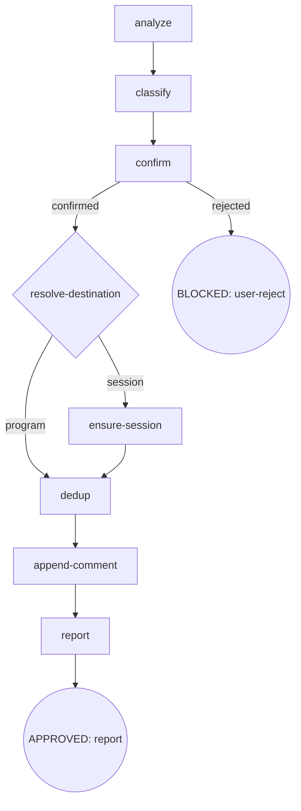

# CDD Engine 重构 + 生态完善 — P4 设计 Spec

- **Version**: v1.0 · 2026-09-08
- **Status**: Approved
- **Author**: [human] · Claude Opus 4.8 (osuperpowers:brainstorming)
- **Parent program**: [2026-09-04-cdd-engine-overhaul-overall.md](2026-09-04-cdd-engine-overhaul-overall.md) (v1.17)
- **Depends on**: P1（engine 已发布 + PR #236 合入 develop）· P2（scripts/CI 重组 + PR #237 合入 develop）· P3（URC 引擎架构统一 + Enh X/Y/S/T + PR #243 合入 develop）

> **阶段归属**：本 spec 是 v1.16 三阶段拆分后的第三执行阶段——**P4（Skills + 模板重构）**。设计源 = P3-design §2.2（report-issue 重构）+ §2.3（模板单一事实源）+ §2.5（Skill 微调）；本 spec 在其上落地实现决策（渲染器 + 方法论规范化）并记录 P4 实测发现。

---

## Section 0: Incremental warning

P4（Skills + 模板重构）增量 spec。跨 phase 约定以 [overall](../../2026-09-04-cdd-engine-overhaul-overall.md) 为准；冲突时 overall wins。

## Section 1: Constraints pointer

- 不重复 overall conventions；overall wins。
- 仓库语言政策：SKILL.md / docs 英文主源；本 spec 中文（Strategy B，内部开发者文档）。
- 不 commit 除非用户明确要求；changeset 逐 phase 建。
- vendored 子模块不可改。
- 允许破坏性更新，确保最佳实践，不留技术债务。
- 消费者视角：skill 规则文本与随插件发布的模板（finding-meta.json / report-templates.mjs）须从发布后消费者环境审查（消费者端无 `scripts/`、无本仓库 toolchain）。
- SKILL.md / templates / docs 改动后必须 `pnpm run emit` 再提交（emit 漂移 = CI 失败）。

---

## Section 2: Design body

### 2.1 Scope

P4 = **Enh J（report-issue 重构：双通道 + session master + 永不 reopen）+ 模板单一事实源 + 统一渲染器（finding-meta.json + report-templates.mjs + issue-templates emitter）+ 方法论规范化（data-driven-templates.md + CLAUDE.md 指针）+ Enh K（升级为全量 issue 回顾）+ Enh R（pre-consumed 记账）+ Enh V/W（superseded 确认）**。

本 spec 相对 P3-design §2.2/§2.3/§2.5 的增量决策（2026-09-08 brainstorm，均经用户确认）：

| 决策 | 内容 |
|---|---|
| **运行时渲染器** | 方案一（统一渲染器 + 单 canonical）。renderYml / renderComment / renderMasterBody 纯函数族；agent 只做决策，正文由渲染器产出（与 URC reviews.json 同构） |
| **方法论规范** | 新增 `docs/maintainers/data-driven-templates.md`（节点锚定式）+ CLAUDE.md「Data-driven template convention」一节 + `skill-authoring.md` 引用——URC 模板数据化方法论显式化为 repo 级规范；P4 是其首个完整 dogfood |
| **Enh K 强化** | 全量回顾：枚举 inventory（含 Side-effect closures）全部唯一 `#NNN` → 每父 issue `gh issue view NNN --json body,comments` 完整体读正文+全部 comments；锚点仅检索入口、禁止挑读；fail-open。P4 brainstorm 实测复现（锚点挑读漏「关联 Issues」comment 与 Enh J 后半段），已记 #232 comment 5536710343 addendum |
| **Enh R 处置** | pre-consumed——writing-plans `user-ok?` 死选项已在 P3 单周期迁移（9dc2ccd）连带移除；P4 仅核实 + overall 记账 |
| **Enh V/W** | superseded 确认——tasklist 机制未移入 skill；#232 历史 tasklist 留快照；P4 不新增 tasklist 机制 |
| **旧语汇清零守卫** | system-wide stale-lexicon verify（P4 追加，2026-09-08）：URC 语汇（`PASS=<` / `docs-review.md` / `D1|D2|D3`）live 面**保持 0**（本日核查已证为 0，固化回归守卫防回渗）+ report-issue 旧 digraph 语汇（`resolve-hit` / `gh issue reopen` / `dogfood,<type>` / `[Session] <branch>`）随 Enh J 重写清零；旧 bin 名历史注释列为豁免 |

### 2.2 report-issue 重构（Enh J）

#### 2.2.1 定位

消费者汇报渠道：一份 session → 一份 report。findings = 问题描述（叙事 comment），不是 maintainer 待办清单。新 digraph 无 reopen、无独立建 issue（session master 创建除外）。

#### 2.2.2 新 digraph



#### 2.2.3 节点对照（旧 → 新，合并 §2.2.3 与 Pζ 实测）

| 旧 | 新 | 说明 |
|---|---|---|
| `resolve-hit`（open/closed → 创建/comment/reopen/skip） | **删除** | 永不 reopen；closed → comment 内引用 |
| `file`（gh issue create + comment + reopen + labels） | **`append-comment`** | 只 `gh issue comment`，无独立建 issue；无 labels |
| — | **`resolve-destination`**（新） | 程序↔session 双通道判定 |
| — | **`ensure-session`**（新） | find-or-create `[Session report]` master |

#### 2.2.4 `resolve-destination` — 双通道判定

- **缓存首查（唯一解析注入点）**：`resolve-destination` 首先读 `.superpowers/cdd/<slug>/report-target.json`（schema：`{kind, issue?, slug, resolved_at}`）——命中 `{kind: program, issue: NNN}` → 直接复用该 `#NNN`（跨 run 稳定追加同一程序 issue，**跳过重解析**）；命中 session 记录 → 复用缓存 master（§2.2.5 同一读取路径）。仅 cache miss 才走下述「程序联动」解析；解析结果写回同文件后返回。
- **程序联动（解析，cache miss 时）**：CDD workspace `.superpowers/cdd/<slug>/progress.json#plan`（progress.mjs required 字段，dispatch 时已记录 plan 路径）→ plan 头部 spec 链接 → overall `*-overall.md` → plan 所属 phase（overall Phase inventory 行）→ 该 phase 的 owning issue（多 `#NNN` 时取 Dependency graph 的 program root/tracking issue，本 program = #232）→ `{kind: program, issue: NNN}` → 写入`.superpowers/cdd/<slug>/report-target.json`。
- **其余**（解析失败 / standalone / plan 不在 `docs/superpowers/plans/` 下）→ `{kind: session}` → `ensure-session`。
- **通道→kind 映射**：program → `program`；session + CDD workspace slug 存在 → `consumer-cdd`；session + 无 workspace（standalone）→ `standalone`。
- **程序通道守卫**：resolved overall 须为已知程序 overall（Issue inventory 可查）且 inventory 命中 `#NNN` 真实存在；任一失败 → 回落 session 通道（消费者自有 repo 不得误路由到 Oscaner 编号）。
- **branch 仅作 in-session 路由上下文**（resolve-destination 内部使用），**绝不写入 issue / comment / 身份字段**。
- fail-open：progress.json / plan / overall 任一读取失败 → 默认 session 通道，不阻塞。

#### 2.2.5 `ensure-session` — session master

- 身份键：**CDD workspace slug**（`.superpowers/cdd/<slug>/`）；standalone → 本次运行即 session（不跨运行复用）。
- 复用（**仅 CDD scope**）：`.superpowers/cdd/<slug>/report-target.json`（scope 恒 cdd，与 finishing `base-branch.json` 同制）→ 同 workspace 后续 report-issue 复用同一 master。
- title：`[Session report] <slug|standalone> <YYYY-MM-DD>`，由渲染器 `renderTitle(masterDef, {slugOrStandalone, date})` 生成（title/body 同源、单一拼装规则，ensure-session 不自行拼接 title 字符串）；labels `['session','osuperpowers']`（与 session_report.yml 对齐）；body 由 `renderMasterBody()` 生成（Session 元数据 + Findings Summary 表）。
- **title 日期语义**：创建日（date = session 队列标识），复用不随 reuse 改期。
- **slug**：CDD workspace slug（sanitize 后非路径）；consumer 可于 `confirm` 阶段 opt-out 隐藏 slug（隐私）。
- **branch 禁令统一适用（含 program channel，无 carve-out）**：branch 不作身份 / title / 正文字段；维护者程序场景如需入文，须经 `confirm` 门禁 opt-in。程序上下文由 workspace slug + kind 表达。

#### 2.2.6 `dedup` — 纯引用，无 reopen

- `gh issue list --repo Oscaner/skills --state all --limit 100`，匹配键 = **component + 行为词 + 标题/正文关键词**（Step / Skill 版本仅记录于 report-meta 作命中展示上下文，**不参与匹配键**——同 Step、同版本跨发现会互相误命，须避免）：
  - **open hit** → comment 内 `## Related` 写 `#NNN (open)`
  - **closed hit** → comment 内写 `Regression / follow-up of #NNN (closed)`；**永不 `gh issue reopen`**
  - no hit → 平铺 comment

#### 2.2.7 `append-comment` + report-meta（派生元数据）

每条 finding + master body 附 **Report meta（全自动、零人工、零隐私）**：

```markdown
## Report meta (auto)
- Skill: osuperpowers:report-issue vX · cdd-engine vY
- Harness: <claude|cursor-...|droid|pi>
- Kind: program | consumer-cdd | standalone
- Step: <flow node：dedup / append-comment …>
- CDD: <task N>·<mode>·<round>（有 handoff/progress 时）
- Date: <now>
```

- 推导源（安全源，无引擎改动）：Skill/engine 版本 = 本仓库 `packages/*/package.json`；消费者端 `npm ls`（可读可用版本）；Harness = session cli-select 结果（不可得则省略）；Step / CDD = session 上下文 + `progress.json` / handoff。
- **kind 单一枚举**：finding-meta.json#kinds 唯一令牌 = `program | consumer-cdd | standalone`；与表单 session-type 下拉的映射：`session-type=dogfood + program 链接` → `program`；`session-type=dogfood`（无链接）→ `consumer-cdd`；`session-type=standalone` → `standalone`。
- **隐私守则（新 Invariant）**：绝不自动写入 branch / 项目路径 / 文件名作为消费者身份或正文；证据仅限错误签名与 Meta 派生源；消费者可 opt-in 追加（经 `confirm` 确认后入文）。
- **label 处置（旧标签体系废弃）**：`dogfood,<type>[,cdd]` 旧标签体系随 `file` 节点一并废弃——共享 issue 不再创建（findings 走逐条 comment / session master），旧 label 契约失去载体；**仅 session master 保留 `labels ['session','osuperpowers']`**。report-issue SKILL.md 全文清除旧 label 契约四处（frontmatter description「Labels follow dogfood,<type>[,cdd]」、Invariant I2 Label Format、classify 节点「Label each finding」、digraph `file` 节点），只保留 master labels 一处。
- **master Findings Summary 表（仅 session 通道）**：master 仅存在于 session 通道；program 通道的 findings 以逐条 comment（+report-meta）落在 #NNN，**无 master、不建汇总表、不 PATCH body**。session 通道每次 append 后 `gh api PATCH` master body 更新 Findings Summary 表；重渲染的 findings 累积来源 = **本 run 进程内累计的已 append findings**（每次 append 后以全量重渲染追加新行；append 与 PATCH 同一进程完成，不重读 master comments，避免读改写竞态）。
- **gh 目标仓库显式化**：全部 gh 操作显式 `--repo Oscaner/skills`（dedup list / ensure-session create / append-comment / master PATCH）。
- **fail-open**：gh 不可用 / 网络失败 → 记录 stderr + 保留 finding 供手工重试；master 创建失败不丢 finding（降级提示手工创建 + 失败后重试）。
- `analyze`：ledger 扫描关键词 = `fix round` / `BLOCKED` / `parked` / `CHANGES_REQUESTED`（`deferred` 已随 Enh S 消亡）。
- `report`：输出目标 issue URL + 每条 finding comment URL + references。

### 2.3 模板单一事实源 + 统一渲染器（方案一）

**canonical**：`packages/osuperpowers/skills/report-issue/templates/finding-meta.json`（唯一事实源，随插件发布）：

```jsonc
{
  "components": ["osuperpowers (general)", "cdd-engine", "osuperpowers:init",
    "osuperpowers:brainstorming", "osuperpowers:writing-plans",
    "osuperpowers:cli-driven-development", "osuperpowers:report-issue",
    "osuperpowers:finishing"],
  "sessionTypes": ["dogfood (CDD session)", "standalone"],
  "severities": ["blocker", "warn", "nit"],
  "metaFields": ["skill", "harness", "kind", "step", "cdd", "date"],
  "kinds": ["program", "consumer-cdd", "standalone"],
  "sectionLabels": { "bug": { "en": {"context": "## Context", "problem": "## Problem",
      "impact": "## Impact", "suggestedFix": "## Suggested fix"},
      "zh": {"context": "## 背景", "problem": "## 问题", "impact": "## 影响",
      "suggestedFix": "## 建议修复"}},
    "enhancement": { ... } },
  "formFieldDefs": { "bug_report": {...}, "enhancement": {...}, "session_report": {...} },
  "masterDef": { "title": "[Session report] <slug|standalone> <YYYY-MM-DD>",
    "labels": ["session","osuperpowers"],
    "summaryTable": {"cols": ["#","Type","Component","Title"], "placeholder": "_Details in comments below._"} }
}
```

**渲染器（单点、纯函数、随插件发布）**：`packages/osuperpowers/scripts/report-templates.mjs`：

| 导出 | 输入 → 输出 | 消费端 |
|---|---|---|
| `renderYml(formDef, name)` | formFieldDefs → `.github/ISSUE_TEMPLATE/<name>.yml` 文本 | emit |
| `renderComment({finding, lang, related?, meta})` | finding + sectionLabels + report-meta → 完整 comment body | report-issue 运行时 |
| `renderMasterBody({kind, meta, findings})` | masterDef + Session 元数据 + Findings Summary 表 → master body | report-issue 运行时 |
| `renderTitle(masterDef, {slugOrStandalone, date})` | masterDef.title 占位替换（`<slug|standalone>` → slug 或 standalone；`<YYYY-MM-DD>` → 创建日）→ 最终 title 字符串 | report-issue 运行时 |
| `renderSummaryTable(findings)` | findings[] → markdown 表 | report-issue 运行时 |

- 渲染无凭依 agent 拼装：report-issue SKILL.md 指示「affix 正文 = 调渲染器输出；本次会话 agent 不手工写 markdown 段落结构」（段落结构以 sectionLabels 为准）。
- **emit 渲染**：`scripts/emit/issue-templates.mjs`（per-product emitter，签名 `(outRoot, generatedPaths)`，import 插件内 renderYml）渲染 3 个 yml；产出进 `generatedPaths` → `emit:check` drift 守卫。
- **round-trip 两阶段**：
  ① `formFieldDefs` 完整编码当前 3 个 yml 全部字段（id/label/description/placeholder/options/required/多行 value，含文件末换行 EOF）→ **首渲染 diff 空**（验证字段覆盖完整性）。断言 ① 为**过渡性检查**——仅验证阶段 ①「与现状等价」的字段覆盖，阶段 ② 完成后从测试集移除（迁移后渲染产物有意偏离「迁移前现状」，常驻必红）；字段覆盖的常驻保护交由终结态 `emit:check` drift=0。
  ② **隐私迁移独立一步**：按隐私守则改 formFieldDefs 文案 → 重渲染 → 新产物一并提交。Branch placeholder 移除范围**覆盖全部 3 个 form 的 context 字段**——`session_report.yml` / `bug_report.yml` / `enhancement.yml` 的 context placeholder 现状均为「Branch: feat/my-feature, Date: <date>, Skills: ...」，统一移除 Branch component、改为 Date / Harness / versions 提示（与「branch 不作身份」守则对齐；手动表单不留 Branch 例外）。
  终结态 = AC（`emit:check` drift=0）。
- **删除**：`report-issue/templates/{bug-en,bug-zh,enhancement-en,enhancement-zh}.md` 4 个重复体（report-issue SKILL.md 改引用 JSON + 渲染器）。
- **测试**：`scripts/emit/issue-templates.test.mjs`（vitest，emit 链同域）断言——① 首渲染 yml 与现状 diff 空（**过渡性**：仅阶段 ① 生效，阶段 ② 完成、新产物提交后从测试集删除）② 隐私迁移后三个 yml 的 context 字段均无 Branch ③ `renderComment` 输出段落序与旧 md 模板段结构等价 ④ `renderSummaryTable` 表列正确 ⑤ **`renderMasterBody` 结构断言（常驻）**：Session 元数据存在、Findings Summary 表头 = `#/Type/Component/Title`、report-meta 六字段（skill/harness/kind/step/cdd/date）齐全。

### 2.4 方法论规范（data-driven-templates + 指针）

**新增 `docs/maintainers/data-driven-templates.md`**（中文，maintainer-only，Strategy B extension；节点锚定式，仿 `_docs/review.md` 结构）：

```
Scope: 所有「文本形态可数据化、被多消费端引用、须防漂移」的模板性内容
Digraph: canonical → renderer → {emit product · runtime product} → round-trip guard
Rules:
  R1 单一事实源 — canonical JSON 唯一，无 md 镜像 / 无第二副本
  R2 渲染确定性 — 渲染器纯函数；agent/orchestrator 不手工拼装正文
  R3 派生产物 emit 生成 — yml / .agents 等一律生成，进 generatedPaths + emit:check drift 守卫
  R4 round-trip 两阶段 — 先 diff=空锁字段覆盖 → 再行为/文案迁移
  R5 消费者端可用 — 运行时渲染器随插件发布（contentRoot "."），可 node 调用
Invariants:
  canonical 可定位（grep 无 md 副本）· 渲染器单点（无第二套渲染路径）·
  pnpm run emit:check drift=0 · 派生产物不手改
Failure Modes:
  手改派生产物 / 双源分歧 / 渲染不可测 / 消费者端不可用
Exemplars:  harness-registry.json (P1) · reviews.json + URC (P3) ·
  finding-meta.json + issue-templates (P4，首个运行时渲染) · ISSUE_TEMPLATE yml (P4)
```

**CLAUDE.md**：新增「Data-driven template convention」一节（首屏可见，与 `.agents/ is derived` 同类）——「canonical → renderer → emit/emit:check；详见 docs/maintainers/data-driven-templates.md」。

**`skill-authoring.md`**：创作侧入口加引用（新 skill 引入模板正文时走该规范）。

### 2.5 Skill 微调（Enh K 强化 + Enh R 记账 + Enh V/W 确认）

#### 2.5.1 Enh K — explore-context 全量回顾（强化）

`brainstorming` SKILL.md `explore-context` 节点（phase-within-program）：

> Enumerate every unique `#NNN` in the parent overall's Issue inventory (**including the Side-effect closures block**). For each parent issue, run `gh issue view NNN --json body,comments` and read the **full body + all comments** (including parts not anchored in the inventory). Anchors are lookup entries, **not** the read scope — do not anchor-pick individual comments. Include the content in exploration context. Fail-open: gh unavailable / rate-limited → log warning and continue without blocking.

（2026-09-08 P4 brainstorm 实测复现锚点挑读漏读——已记 #232 comment 5536710343 addendum。）

#### 2.5.2 Enh R — pre-consumed 记账

P3 单周期迁移（9dc2ccd）已连带移除 writing-plans `user-ok?`「Fix selected」选项与 digraph `fix selected` 边（develop == 当前分支 == commit 已含）。P4 **不新增修改**；仅 overall Issue inventory 记账（R 行标 pre-consumed + change history）。

#### 2.5.3 Enh V/W — superseded 确认

确认：tasklist 机制未移入 skill（report-issue 不含 tasklist 区块；finishing 不 PATCH tasklist）；#232 既有 comment tasklist（R/S/T/U/V/W 早前 retrofit）保留历史快照，不生成新 tasklist。

#### 2.5.4 旧语汇清零守卫（system-wide）

P4 交付前全仓核查（scope = `packages/osuperpowers/skills packages/cdd-engine/templates .github/ISSUE_TEMPLATE`）：

- **URC 语汇** `PASS=<` / `docs-review.md` / `D1|D2|D3` → **保持 0 命中**（2026-09-08 已证为 0；作回归守卫防未来回渗——「会话内 skill context 混入旧版文本」类问题即由此类残留引起）。
- **report-issue 旧 digraph 语汇** `resolve-hit` / `gh issue reopen` / `dogfood,<type>` / `[Session] <branch>` → 随 Enh J 重构清零（重构完成后 grep 为 0）。
- **豁免**：旧 bin 名（`cdd-task` / `docs-task` / `branch-review`）出现在迁移注释 / 测试文件名（`bin/cdd.mjs`、`bin/lib/docs-runner.mjs`、`bin/tests/docs-task.test.mjs`、`bin/gate/cdd-gate-core.mjs`、`docs/maintainers/osuperpowers-plugin.md`「former docs-task bin」）为历史迁移说明，保留；`docs/superpowers/` 历史 spec/plan 不在 scope。

### Acceptance criteria

各自独立可测：

1. **report-issue 新 digraph**：SKILL.md 无 `resolve-hit` / `reopen` / 无独立 `gh issue create`（session master 创建除外）；新节点 `resolve-destination` / `ensure-session` / `append-comment` 存在；`gh issue reopen` 不在任何路径；**label 处置**：grep SKILL.md 全文无 `dogfood,<type>` / `Label Format` / 「Label each finding」任一旧 label 契约（frontmatter description 同步移除），仅 master 保留 `labels ['session','osuperpowers']`。
2. **双通道判别**：plan→overall 可解析 → 追加程序 issue（运行期验证：本 program session 追加 #232）；解析失败 / standalone → session master。
3. **session master**：`ensure-session` 创建 `[Session report] <slug|standalone> <date>`（title 由渲染器 `renderTitle` 生成，labels `session,osuperpowers`），body 含 Session 元数据 + Findings Summary 表（`renderMasterBody` 渲染器产出）；复用键 = `.superpowers/cdd/<slug>/report-target.json`（仅 CDD scope；standalone 每次新建不复用）；身份/标题无 branch。
4. **永不 reopen**：closed dedup hit → comment `## Related` 写 `Regression / follow-up of #NNN (closed)`；无 reopen 调用。
5. **report-meta**：每条 finding comment 含 Meta 块（skill/engine 版本、harness、kind、step、CDD、date）；字段全派生；正文无自动 branch/项目路径（隐私守则 Invariant 在 SKILL.md）。
6. **渲染器**：`packages/osuperpowers/scripts/report-templates.mjs` 存在（renderYml / renderComment / renderMasterBody / renderSummaryTable，纯函数）；随插件发布；report-issue SKILL.md 指示正文由渲染器产出（无手工段结构指令）。
7. **模板 SSoT**：`finding-meta.json` 存在且为唯一 canonical；`pnpm run emit` 生成 `.github/ISSUE_TEMPLATE/{bug_report,enhancement,session_report}.yml`；`pnpm run emit:check` 全绿（drift=0）；`report-issue/templates/*.md` 4 文件已删；SKILL.md 引用 JSON/渲染器而非 md。
8. **round-trip 两阶段**：首渲染 yml 与改动前现状 diff 空（字段覆盖完整，**过渡性断言**——仅阶段 ① 生效，阶段 ② 完成后从测试集移除）；隐私迁移后三个 yml 的 context 字段均无 Branch placeholder，含 Date / Harness / versions 提示（阶段 ② 产物已提交）；终结态 `pnpm run emit:check` drift=0（字段覆盖的常驻守卫）。
9. **Enh R（pre-consumed）**：writing-plans 现状已满足（无 fail-selected 边 / user-ok? 纯 proceed）；P4 无新增 writing-plans 改动；overall Issue inventory R 行标 pre-consumed。
10. **Enh K 全量回顾**：brainstorming SKILL.md `explore-context` 含「枚举全部 #NNN（含 Side-effect closures）+ `gh issue view NNN --json body,comments` 全量体读 + 锚点仅检索入口禁止挑读 + fail-open」指令。
11. **Enh V/W 确认**：report-issue SKILL.md 无 tasklist 区块指令；finishing 无 tasklist PATCH；#232 历史 tasklist 保留快照（overall Issue inventory V/W 行 superseded 标注在）。
12. **方法论规范**：`docs/maintainers/data-driven-templates.md` 存在（digraph + Rules + Invariants + Failure Modes + Exemplars）；CLAUDE.md 含「Data-driven template convention」指针；`skill-authoring.md` 含引用。
13. **emit + 验证绿**：`pnpm run emit` 后 `git status` 无非预期产物；`pnpm run validate` 全绿（含 engine vitest、wiring guard、emit:check 含新 generatedPaths）。
14. **旧语汇清零**：grep scope（`packages/osuperpowers/skills` + `packages/cdd-engine/templates` + `.github/ISSUE_TEMPLATE`）——`PASS=<|docs-review\.md|D1|D2|D3` 为 **0 命中**；`resolve-hit|gh issue reopen|dogfood,<type>` 为 **0 命中**（report-issue 重写后）；豁免项（旧 bin 名历史注释，清单见 §2.5.4）已记录。

---

## Section 3: Deviations from overall

| Overall assumption | Phase decision | Overall updated? |
|---|---|---|
| report-issue 模板与 yml 表单「mirror」维护 | 收敛为**单一事实源 + 统一渲染器**：finding-meta.json canonical；renderYml/renderComment/renderMasterBody 单渲染器（emit 与运行时共用）；删 4 md 副本 | Yes — v1.14（模板收敛已记）+ v1.18（渲染器细化） |
| Enh K =「读关联 issue comments」 | **强化为全量回顾**：枚举 inventory（含 Side-effect closures）全部 `#NNN`；每父 issue 全量 body+comments；锚点仅检索入口禁止挑读（P4 实测复现锚点挑读漏读） | Yes — v1.18 |
| Enh R 属 P4 pending | **pre-consumed by P3**——P3 单周期迁移（9dc2ccd）已连带移除；P4 仅记账 | Yes — v1.18 |
| — | +方法论规范（data-driven-templates.md + CLAUDE.md 指针）沉淀 URC 模板数据化方法论为 repo 级规范 | Yes — v1.18 |

## Section 4: Notes for downstream

- **P5（Gate 移除）**：不受本 phase 影响；`packages/osuperpowers/scripts/`（本 phase 新增）与 `bin/gate/` 相互独立，P5 不触碰 report-templates.mjs；`tests/fixtures/cdd-gate/**` 删除域不变。
- **消费者视角**：finding-meta.json + report-templates.mjs 随 osuperpowers 插件发布（contentRoot "."；无 `scripts/` 依赖）；消费者环境 report-issue 运行时 `node ${pluginRoot}/scripts/report-templates.mjs` 可调用渲染器；gh 缺省/网络失败 fail-open 可走。
- **测试双框架**：渲染器测试放 `scripts/emit/issue-templates.test.mjs`（vitest，emit 链同域），import 插件内模块断言；本 phase 不统一 osuperpowers/tests node:test 域。
- **emit 面**：finding-meta.json 变更 → 必须 `pnpm run emit`（重生成 yml）再提交；新增 emitter 进 `generatedPaths`。
- **已完成记录**：Enh K addendum 已入 #232 comment 5536710343（2026-09-08）。

## Section 5: Review

Rule: Fresh-Subagent Review Passes（completeness / consistency&scope / clarity&YAGNI）须全部通过后进入 user review 与 writing-plans。