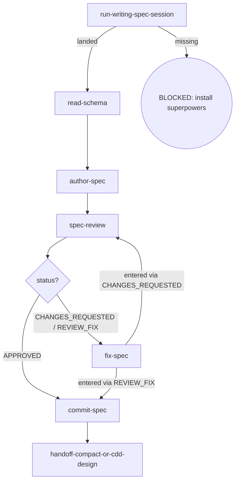

# Kairos CDD-Charter

Writes the program-level (overall) spec from the writing-spec import, reviews it under the cdd spec contract, commits it on approval, and hands off to the next phase's cdd-design. The overall spec is charter-only and carries the four tables (issue inventory / phase inventory / dependency graph / change history); per-phase increment lives in cdd-phase.

## Flow Digraph

## Skeleton deltas

| skeleton node | cdd-charter |
|---|---|
| read-schema | run `cdd schema get overall` → read the canonical doc-structure schema (the schema is the single structure fact; the retired md template is gone) |
| scope changed? | N/A |
| sync-overall | N/A — this skill is the overall writer; no parent overall to sync |
| review loop (D/E/F) | shared shape — no delta (only the `--spec <path>` target differs: this skill's own product) |
| handoff-spec | `handoff-compact-or-cdd-design` — /compact, or prepare the handoff to `/kairos:cdd-design [Px program]` |

## Node Definitions

### `run-writing-spec-session`

- **Do**: Import `/superpowers:brainstorming` (writing-spec import) — its flow is consumed inline as this session's baseline; it lands the design decisions (including the program charter and phase decomposition) this overall spec will capture
- **Read**: nothing before the import; the import lands the design
- **Exit**: Import landed → `read-schema`; upstream missing → BLOCKED (install superpowers)
- **Fail**: Upstream superpowers plugin missing → BLOCKED: install superpowers (no downgrade, no skip, no inline restatement)

### `read-schema`

- **Do**: Run `cdd schema get overall` to read the canonical overall doc-structure schema (the consumer/install surface, never a hardcoded repo path) — the single structure fact its `properties` + `description` carry (charter only — no implementation detail; the schema carries the GATE: overall approval is not equivalent to any phase started). Direct invocation — read the full output (stdout/stderr); cdd truncates its own output. Output filtering is forbidden — no piping to `tail`/`head`, no `2>&1 |`, no `EXIT=$?` capture.
- **Read**: run `cdd schema get overall` (the canonical overall spec schema, direct)
- **Exit**: Schema read → `author-spec`; `cdd schema get overall` unavailable or schema missing → BLOCKED
- **Fail**: Schema missing/unreadable → BLOCKED (missing schema — cannot determine overall spec structure)

### `author-spec`

- **Do**: Write the overall spec to `docs/kairos/specs/YYYY-MM-DD-<feature>-overall.md` from the session output — charter only (scope decomposition + issue inventory + phase inventory + dependency graph + acceptance criteria); no phase-level implementation detail. Role note: the enforcement position for the overall's structure is the **engine lifecycle** — the same canonical doc-structure schema (`cdd schema get overall`) that `read-schema` consumed is what `docContractValidate` uses at dispatch to check the four-table vocabulary and row shapes (doc word = code word = engine token: rename a heading and you rename the validator with it). Doc-compliance adjudication in this repo runs on the same engine path consumers get — the engine lifecycle audit (dispatch runtime) plus the engine test suite (canary evidence at dispatch runtime); the repo-local `scripts/validate` charter guard was retired; it is no longer a consumer surface concern. Direct invocation — read the full output (stdout/stderr); cdd truncates its own output. Output filtering is forbidden — no piping to `tail`/`head`, no `2>&1 |`, no `EXIT=$?` capture.
- **Read**: Session output + the canonical overall spec schema (via `cdd schema get overall`)
- **Exit**: File written → `spec-review`
- **Fail**: Schema missing → BLOCKED (missing schema)

### `spec-review`

- **Do**: Execute one review per cycle — one dispatch: `cdd review --type spec --spec <path>` (the overall spec document under review). Self-review, manual checks, or any other substitute for cdd review CLI invocation is forbidden. Review Convergence (I1): read the `next:` suggestion from the review output — the engine's default next-step suggestion (dispatch per it when continuing directly); a mid-backfill or a user adjudication that lands governs over it (current world state). Ensure the working tree is clean before entering review (engine entry gate: dirty → BLOCKED; the orchestrator writes no tree during dispatch). Direct invocation — read the full output (stdout/stderr); cdd truncates its own output. Output filtering is forbidden — no piping to `tail`/`head`, no `2>&1 |`, no `EXIT=$?` capture.
- **Read**: The authored spec document + the review output contract (incl. the `next:` suggestion)
- **Exit**: the `next:` suggestion routes the next dispatch — fix-spec or commit-spec (no self-authored status→dispatch mapping)
- **Fail**: Re-run review after a closure conclusion (REVIEW_FIX / APPROVED) → violates I1 (Review Convergence)

### `fix-spec`

- **Do**: Fix ALL findings (blocker + warn + nit) via `cdd fix --type spec --spec <path> --findings <workspace>/spec-review-{R}.json`. No new review invocation — work from the findings already captured in the current cycle (the fix output's `next:` suggestion names the next hop: re-review / closure). Direct invocation — read the full output (stdout/stderr); cdd truncates its own output. Output filtering is forbidden — no piping to `tail`/`head`, no `2>&1 |`, no `EXIT=$?` capture. After the review, the orchestrator reads the `next:` suggestion for routing; findings full text is consumed by `cdd fix`'s fix-agent via `--findings <handoff>` — the orchestrator must not self-apply findings as inline edits.
- **Read**: The captured spec-review handoff (current cycle findings)
- **Exit**: the fix output's `next:` suggestion routes the next dispatch — spec-review (re-run) or commit-spec (closure); a closure conclusion never re-runs
- **Fail**: Invoking a new review instead of fixing from captured findings → violates I1 (Review Convergence)

### `commit-spec`

- **Do**: `git add` the spec + conventional commit. Spec approved = commit immediately (I2); do not wait for dev merge
- **Read**: Spec file path
- **Exit**: Commit complete → `handoff-compact-or-cdd-design`
- **Fail**: Git error → report + fail-open (do not block user spec review)

### `handoff-compact-or-cdd-design`

- **Do**: Run /compact to collapse the completed overall session, or prepare the handoff to `/kairos:cdd-design [Px program]` — its flow is consumed inline as this session's baseline to start the next phase's full brainstorm → plan → dev cycle
- **Read**: The committed overall spec
- **Exit**: Handoff executed → flow ends for this skill
- **Fail**: Handing a phase decided by the overall straight to cdd-plan (skipping phase-level cdd-design) → violates the overall boundary rule

## Invariants

| # | Invariant |
|---|---|
| I1 | **Review Convergence** — a review closes by its conclusion `status`, and the output's `next:` line carries the engine's default next-step suggestion — read the `next:` suggestion and dispatch per it when continuing directly; a mid-backfill or a user adjudication that lands governs over it (current world state wins). Fixes always dispatch via `cdd fix`; the orchestrator must not edit in place as a substitute. For task/branch the review ref moves with the fix commit — the engine cannot intercept it, so this discipline is the only guard |
| I2 | **Spec commit discipline** — spec approved = commit immediately; do not wait for dev merge |
| I3 | **Mid-Flight Backfill** — a user-raised backfill of overall/spec/plan docs surfaced while a dispatch is in flight lands through four ordered steps on the current `cdd` call's return (any dispatch — implement/review/fix): (1) **land immediately** — hot context; no deferral to cycle close (deferral risks losing the decision); (2) **commit on its own** — committed as its own standalone change, never mixed with implementation commits; (3) **pause the loop until clean** — the loop pauses (tree clean, backfill committed) before the next dispatch; an uncommitted backfill trips the next review's entry gate (dirty → BLOCKED); (4) **audit in-band on resume** — after the loop resumes, the next review audits the backfill in-band (changed-surface booking, not a block); a backfill rewriting the current task's own plan/spec text routes through the orchestrator as Plan Sole Writer (cross-task adjudication), otherwise it rides the moving ref. |

## Failure Modes

| failure | behavior | reason |
|---|---|---|
| Upstream superpowers plugin missing | BLOCKED (install superpowers) | Block policy: no silent fallback |
| Schema missing/unreadable | BLOCKED (missing schema) | Cannot determine overall spec structure |
| spec-review re-run after a closure conclusion (REVIEW_FIX / APPROVED) | Violates I1 (Review Convergence) — stop + report to user | Agent re-routes to a new review after the previous review already closed (REVIEW_FIX / APPROVED) without opening a new ref |
| Git commit error | report + fail-open | Do not block user spec review |
