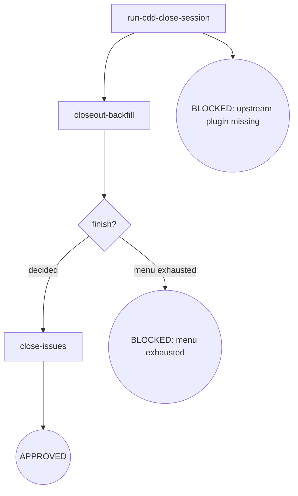

# Kairos CDD-Close

Development branch close-out: the closeout backfill — the shipped-state docs (closeout version rows · phase inventory → Done) — lands and commits FIRST; then the imported upstream flow decides merge / PR / keep / discard, the finish gate routes the outcome, then related issues are closed — a human-decision surface, not next-driven, with no review self-loop. The backfill-before-finish ordering keeps the finish menu from running over an un-backfilled phase, so a merge decision ships the closeout with the branch.

**Invocation discipline** — every command runs as a direct tactical invocation: read the full output (stdout/stderr); output filtering is forbidden — no piping to `tail`/`head`, no `2>&1 |`, no `EXIT=$?` capture. **Finish is the terminal gate** — the finish decision is a human-decision surface: it ends the flow at the gate + terminal (no review self-loop); BLOCKED reasons ride the stderr `CDD_BLOCKED:` channel, no `next:` line is consumed here. **Failure face** — cross-node failure handling lives in the Failure Modes table below (the single source); node `Fail` entries keep only local behavior.

## Flow Digraph

## Node Definitions

### `run-cdd-close-session`

- **Do**: Import `/superpowers:finishing-a-development-branch`（pi：/skill:finishing-a-development-branch） and run its PRE-finish prerequisites (verify tests → read base). The finish menu itself runs at `finish?` — AFTER the closeout backfill has landed, so the closeout state is part of whatever the menu ships. **Upstream steps are not restated here.**
- **Read**: landed finish decision + base branch (`.kairos/cdd/<slug>/base.json`, or inferred per the cdd-dev base resolution)
- **Exit**: prerequisites passed → `closeout-backfill`
- **Fail**: tests red → BLOCKED (fix tests)

### `closeout-backfill`

- **Do**: Land the phase's closeout before any finish decision — the shipped-state docs one commit before the menu runs: close the phase's version rows (plan/spec/overall closeout entry — the version bump · the parent-overall Phase inventory cells → Done · the acceptance delivery record · the change-history row), commit them as their own conventional `docs(kairos)` commit, and leave the tree clean. The finish menu then ships the branch — with the closeout in it; a failure at this node stops before the menu, never runs the finish over an uncommitted closeout
- **Read**: the phase's plan/spec/overall version rows + parent-overall Phase inventory + `git status`
- **Exit**: closeout committed + tree clean → `finish?`
- **Fail**: dirty tree / write error → stop + report (do not enter the finish menu with an uncommitted closeout)

### `finish?`

- **Do**: Run the finish menu (merge / PR / keep / discard) and gate the landed outcome — the orchestration semantic gate, a human decision surface: the decision landed (merged / PR / kept / discarded) routes `close-issues`; an unrecognized outcome that exhausted the menu routes the BLOCKED terminal. The menu follows the closeout backfill. The strict typed-discard gate: the literal `discard` only (case-sensitive, no leading/trailing whitespace); any other input falls back to the menu without resetting its presentation counter — 3 attempts max → BLOCKED (menu exhausted). This gate is not next-driven — the human decision is the terminal authority, and the flow ends here: no review self-loop, no engine route to consume
- **Read**: the landed finish decision
- **Exit**: decided → `close-issues`; menu exhausted → the BLOCKED terminal (menu exhausted)
- **Fail**: no decision obtainable → BLOCKED (menu exhausted, flow terminates)

### `close-issues`

- **Do**: Close the issues that shipped with the finished work — for each `#NNN` in the phase's scope, `gh issue close NNN` with the shipped state
- **Read**: phase spec Issue inventory + finished branch
- **Exit**: Issues closed → the APPROVED terminal
- **Fail**: `gh` unavailable → report + fail-open (do not block the finish)

## Invariants

| # | Invariant |
|---|---|
| I1 | **No Worktrees** — skip the upstream worktree detection block and its cleanup; the menu is fixed to the normal-repo variant; worktree state is a pre-development violation (not cdd-close's scope) |
| I2 | **Conventional Commits + No Attribution** — merge commit / PR title follows conventional commits; no trailers / footers / inline attribution; PR body uses only `## Summary` + `## Test Plan` |
| I3 | **Finish is the terminal gate** — the finish decision is a human-decision surface: it ends the flow at the gate + terminal (no review self-loop); BLOCKED reasons ride the stderr `CDD_BLOCKED:` channel, no `next:` line is consumed here |
| I4 | **Closeout before finish** — the closeout backfill (closeout version rows + Phase inventory → Done, committed, tree clean) lands before the finish menu runs; the finish decision never ships an un-backfilled phase |

## Failure Modes

| failure | behavior | reason |
|---|---|---|
| Upstream superpowers plugin missing | BLOCKED (install superpowers — see the kairos README's 'Upstream dependency install' table) | Block policy: no silent fallback |
| Tests red before merge | BLOCKED (fix tests) | Do not merge/PR a red branch |
| Menu unrecognized input reaches the 3-attempt limit | BLOCKED (menu exhausted) | Cannot obtain user decision |
| Merge conflict / push rejected / PR failure | implicit fail-open (stop + report; branch and base retained; user recovers then re-runs cdd-close) | Do not auto-resolve |
| Closeout backfill fails (dirty tree / write error) | stop + report + fail-open | Do not enter the finish menu with an uncommitted closeout |
