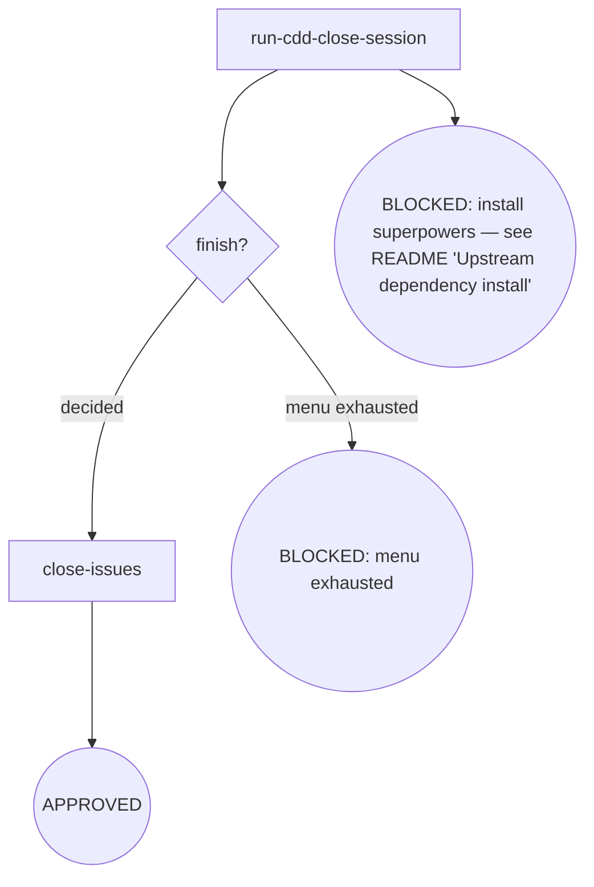

# Kairos CDD-Close

Development branch close-out: the imported upstream flow decides merge / PR / keep / discard, the finish gate routes the outcome, then related issues are closed. The flow ends at the finish gate + the terminal — a human-decision surface, not next-driven, with no review self-loop.

## Flow Digraph

## Node Definitions

### `run-cdd-close-session`

- **Do**: Import `/superpowers:finishing-a-development-branch`（pi：/skill:finishing-a-development-branch） — its flow is consumed inline as this session's baseline (loading an upstream skill imports its flow once; no second spawn) and runs its full finish loop (verify tests → read base → 4-option menu → execute merge / PR / keep / discard); it lands the finish decision that `finish?` gates on. **Upstream steps are not restated here.** Personal rules enforced at this boundary: normal-repo menu (No Worktrees); merge commit / PR title in conventional commits, PR body `## Summary` + `## Test Plan` only, zero attribution; the strict typed-discard gate — the literal `discard` only (case-sensitive, no leading/trailing whitespace); any other input falls back to the menu without resetting its presentation counter (3 attempts max → BLOCKED)
- **Read**: landed finish decision + base branch (`.kairos/cdd/<slug>/base.json`, or inferred per the cdd-dev base resolution)
- **Exit**: Finish decision landed (merged / PR created / kept / discarded) → `finish?`
- **Fail**: Upstream superpowers plugin missing → BLOCKED (install superpowers — see the kairos README's 'Upstream dependency install' table); menu exhausted after 3 unrecognized inputs → BLOCKED (menu exhausted); tests red → BLOCKED (fix tests)

### `finish?`

- **Do**: Gate the landed finish outcome — the orchestration semantic gate, a human decision surface: the decision landed (merged / PR / kept / discarded) routes `close-issues`; an unrecognized outcome that exhausted the menu routes the BLOCKED terminal. This gate is not next-driven — the human decision is the terminal authority, and the flow ends here: no review self-loop, no engine route to consume
- **Read**: the landed finish decision
- **Exit**: decided → `close-issues`; menu exhausted → the BLOCKED terminal (menu exhausted)
- **Fail**: no decision obtainable → BLOCKED (menu exhausted, flow terminates)

### `close-issues`

- **Do**: Close the issues that shipped with the finished work — for each `#NNN` in the phase's scope, `gh issue close NNN` with the shipped state
- **Read**: phase spec Issue inventory + finished branch
- **Exit**: Issues closed → the APPROVED terminal
- **Fail**: `gh` unavailable → report + fail-open (do not block the finish)

## Invariants

| # | Invariant |
|---|---|
| I1 | **No Worktrees** — skip the upstream worktree detection block and its cleanup; the menu is fixed to the normal-repo variant; worktree state is a pre-development violation (not cdd-close's scope) |
| I2 | **Conventional Commits + No Attribution** — merge commit / PR title follows conventional commits; no trailers / footers / inline attribution; PR body uses only `## Summary` + `## Test Plan` |
| I3 | **Finish is the terminal gate** — the finish decision is a human-decision surface: it ends the flow at the gate + terminal (no review self-loop); BLOCKED reasons ride the stderr `CDD_BLOCKED:` channel, no `next:` line is consumed here |

## Failure Modes

| failure | behavior | reason |
|---|---|---|
| Upstream superpowers plugin missing | BLOCKED (install superpowers — see the kairos README's 'Upstream dependency install' table) | Block policy: no silent fallback |
| Tests red before merge | BLOCKED (fix tests) | Do not merge/PR a red branch |
| Menu unrecognized input reaches the 3-attempt limit | BLOCKED (menu exhausted) | Cannot obtain user decision |
| Merge conflict / push rejected / PR failure | implicit fail-open (stop + report; branch and base retained; user recovers then re-runs cdd-close) | Do not auto-resolve |
