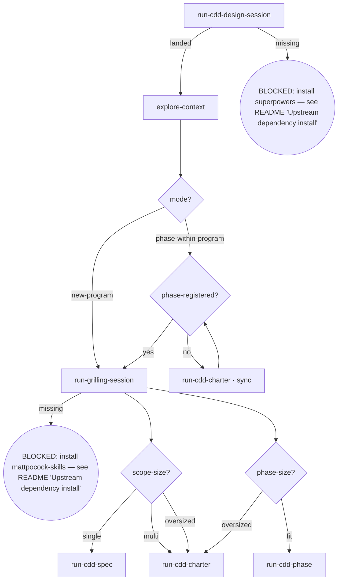

# Kairos CDD-Design

Full brainstorm flow orchestration, callable standalone. The imported /superpowers:brainstorming（pi：/skill:brainstorming） flow lands the program mode: `new-program` routes straight to grilling (no inventory check); `phase-within-program` gates on whether the phase is registered in the parent overall.

## Flow Digraph

## Node Definitions

### `run-cdd-design-session`

- **Do**: Import `/superpowers:brainstorming`（pi：/skill:brainstorming） — its flow is consumed inline as this session's baseline (loading an upstream skill imports its flow once; no second spawn). It lands the mode marker (`new-program` = no parent overall; `phase-within-program` = has a parent overall) and the design context this flow routes on
- **Read**: nothing before the import; the import resolves mode + design context
- **Exit**: Import landed → `explore-context`; upstream missing → BLOCKED (install superpowers — see the kairos README's 'Upstream dependency install' table)
- **Fail**: Upstream superpowers plugin missing → BLOCKED: install superpowers — see the kairos README's 'Upstream dependency install' table (no downgrade, no skip, no inline restatement)

### `explore-context`

- **Do**: Explore project context in the resolved mode so the routing and the delegated flows have what they need — code, issues, docs, and git log are reference examples of exploration surfaces, **not a fixed channel set**; scale the surface to what the task needs (exploration does not constitute a resolved-mode constraint)
- **Read**: whatever the task needs — e.g. project files, docs, git log, the parent overall (phase-within-program mode)
- **Exit**: Exploration complete → `mode?`
- **Fail**: Context read fails → report + fail-open

### `mode?`

- **Do**: Branch on the mode the import resolved. Gate order matters — mode is decided **before** the register gate: `new-program` connects straight to `run-grilling-session` and **skips the inventory check** (legacy I6 exemption kept verbatim: a new program checks no parent inventory, which does not exist yet); `phase-within-program` → `phase-registered?`
- **Read**: mode marker from `run-cdd-design-session`
- **Exit**: `new-program` → `run-grilling-session`; `phase-within-program` → `phase-registered?`
- **Fail**: —

### `phase-registered?`

- **Do**: Read the parent overall's Phase inventory — is the requested phase registered? `new-program` never passes through this node (`mode?` routes it directly to grilling). Not registered → run the register-reflow node, then re-judge
- **Read**: parent overall (`docs/kairos/specs/*-overall.md`) Phase inventory
- **Exit**: registered → `run-grilling-session`; not registered → `run-cdd-charter · sync` → re-judge
- **Fail**: Phase inventory missing or unparseable → BLOCKED (overall-sync-failed); **serial-phase** — registering a new phase whose hard-dependency predecessor has **Design spec ≠ `Done`** in the parent inventory → BLOCKED (never release grilling for an unmet phase — legacy I7 kept verbatim)

### `run-cdd-charter · sync`

- **Do**: Import `/kairos:cdd-charter`（pi：/skill:cdd-charter） — its flow is consumed inline as this session's baseline; it lands the new phase registered in the parent overall (issue inventory / phase inventory / dependency graph / version bump + change history — the four-table sync), then flow back to `phase-registered?` for the re-judge — the landed registry entry routes the re-entry, not a re-import. Registration reflow — not the terminal overall write (`run-cdd-charter` is)
- **Read**: the parent overall
- **Exit**: Sync landed → `phase-registered?`
- **Fail**: four-table sync inconsistent → BLOCKED (overall-sync-failed)

### `run-grilling-session`

- **Do**: Import `/mattpocock-skills:grilling`（pi：/skill:grilling） — its flow is consumed inline as this session's baseline, scoped by mode: `new-program` → scope-level grilling (each candidate phase's scope / dependencies / acceptance / issue ownership, one grilling pass); `phase-within-program` → enumerate-then-grill: enumerate the requirements registered for the phase in the parent overall item by item (each requirement's status — `[Pending]` / `Done` / dropped — cross-referenced from the phase's Phase inventory `[Pending]`/Done cells and the change-history dropped claims), restate the full list to the user, and enter the grilling frontier (root cause → impact boundary → fix direction → approach, one issue per pass) only after the user confirms the enumerated coverage is complete. It lands the grilling outcome; size judgment (`scope-size?` / `phase-size?`) routes on it. Register-before-grill is guaranteed by the `phase-registered?` gate
- **Read**: landed grilling outcome + mode marker + gate verdict
- **Exit**: Grilling outcome landed → size judgment (`scope-size?` on the new-program path, `phase-size?` on the phase-within-program path); upstream missing → BLOCKED (install mattpocock-skills — see the kairos README's 'Upstream dependency install' table)
- **Fail**: Grilling an unregistered phase → register-gate violation (BLOCKED upstream at `phase-registered?`)

### `scope-size?`

- **Do**: **Meaningful only on the `new-program` path** (the program's first planning segment): judge whether the new program fits one single spec or needs to become an overall program
- **Read**: grilling output + exploration context
- **Exit**: `single` → `run-cdd-spec`; `multi` / `oversized` → `run-cdd-charter` (oversized = new program exceeds single-spec scale)
- **Fail**: —

### `phase-size?`

- **Do**: **Meaningful only on the `phase-within-program` path**: judge whether this phase fits into one phase spec. The `fit` branch carries no "phase scope changed" case — that step lives inside `cdd-phase` (its `scope changed?` gate)
- **Read**: grilling output + parent overall
- **Exit**: `fit` → `run-cdd-phase`; `oversized` → `run-cdd-charter` (the overall run syncs the sub-phase split into the parent)
- **Fail**: —

### `run-cdd-spec`

- **Do**: Import `/kairos:cdd-spec`（pi：/skill:cdd-spec） — its flow is consumed inline as this session's baseline; it authors, reviews and commits the single spec (the program converges into one spec), landing the committed single spec as the terminal artifact. The imported flow's review-fix loop expects a clean start — ensure the working tree is clean before entering review (engine entry gate: dirty → BLOCKED; the orchestrator writes no tree during dispatch). Direct invocation — read the full output (stdout/stderr); cdd truncates its own output. Output filtering is forbidden — no piping to `tail`/`head`, no `2>&1 |`, no `EXIT=$?` capture.
- **Read**: grilling output + exploration context
- **Exit**: Handoff executed → flow ends for this skill
- **Fail**: Target skill missing → BLOCKED (install kairos — see the kairos README's 'Upstream dependency install' table)

### `run-cdd-charter`

- **Do**: Import `/kairos:cdd-charter`（pi：/skill:cdd-charter） — its flow is consumed inline as this session's baseline; it authors, reviews and commits the overall spec (the program charter), landing the committed overall spec. Terminal write: the flow converges here and enters the /compact or /kairos:cdd-design（pi：/skill:cdd-design） [Px program] handoff from inside the imported flow. The imported flow's review-fix loop expects a clean start — ensure the working tree is clean before entering review (engine entry gate: dirty → BLOCKED; the orchestrator writes no tree during dispatch). Direct invocation — read the full output (stdout/stderr); cdd truncates its own output. Output filtering is forbidden — no piping to `tail`/`head`, no `2>&1 |`, no `EXIT=$?` capture.
- **Read**: grilling output + parent overall (oversized phase-within-program case)
- **Exit**: Handoff executed → flow ends for this skill
- **Fail**: Target skill missing → BLOCKED (install kairos — see the kairos README's 'Upstream dependency install' table)

### `run-cdd-phase`

- **Do**: Import `/kairos:cdd-phase`（pi：/skill:cdd-phase） — its flow is consumed inline as this session's baseline; it authors, reviews and commits the phase spec (this phase's increment), landing the committed phase spec. The imported flow's review-fix loop expects a clean start — ensure the working tree is clean before entering review (engine entry gate: dirty → BLOCKED; the orchestrator writes no tree during dispatch). Direct invocation — read the full output (stdout/stderr); cdd truncates its own output. Output filtering is forbidden — no piping to `tail`/`head`, no `2>&1 |`, no `EXIT=$?` capture.
- **Read**: grilling output + parent overall
- **Exit**: Handoff executed → flow ends for this skill
- **Fail**: Target skill missing → BLOCKED (install kairos — see the kairos README's 'Upstream dependency install' table)

## Invariants

| # | Invariant |
|---|---|
| I3 | **Design first** — zero implementation dispatch: no code commits, no `cdd implement` dispatch; the flow ends in the delegated spec-writer flows, never in implementation |
| I4 | **Spec commit discipline** — spec approved = commit immediately; do not wait for dev merge (enforced inside the delegated spec-writer flows) |

## Failure Modes

| failure | behavior | reason |
|---|---|---|
| Upstream superpowers plugin missing | BLOCKED (install superpowers — see the kairos README's 'Upstream dependency install' table) | Block policy: no silent fallback |
| Grilling plugin missing | BLOCKED (install mattpocock-skills — see the kairos README's 'Upstream dependency install' table) | Block policy: no degradation |
| Phase inventory missing / unparseable | BLOCKED (overall-sync-failed) | Registration gate cannot run |
| Registering with predecessor Design spec ≠ Done | BLOCKED (serial-phase) | Never release grilling for an unmet phase |
| Four-table sync inconsistent | BLOCKED (overall-sync-failed) | Refuse to register an inconsistent phase |
