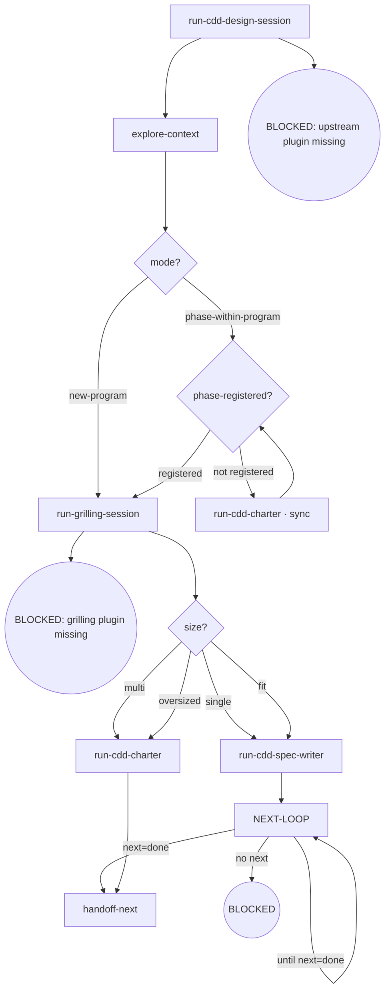

# Kairos CDD-Design

Full brainstorm flow orchestration, callable standalone — the imported brainstorm flow lands the program mode (`new-program` routes straight to grilling, no inventory check; `phase-within-program` gates on whether the phase is registered in the parent overall).

**Invocation discipline** — flows are consumed inline as this session's baseline (an upstream import loads once, never a second spawn). Direct invocation — read the full output (stdout/stderr); the engine truncates its own output. Output filtering is forbidden — no piping to `tail`/`head`, no `2>&1 |`, no `EXIT=$?` capture. **Round rhythm** — one review pass per dispatch; a fix round re-enters the review while the route is not done; ensure the working tree is clean before entering review (engine entry gate: dirty → BLOCKED; the orchestrator writes no tree during dispatch). **Failure face** — cross-node failure handling lives in the Failure Modes table below (the single source); node `Fail` entries keep only local behavior.

## Flow Digraph

## Node Definitions

### `run-cdd-design-session`

- **Do**: Import `/superpowers:brainstorming`（pi：/skill:brainstorming） — its flow is consumed inline as this session's baseline (loading an upstream skill imports its flow once; no second spawn). It lands the mode marker (`new-program` = no parent overall; `phase-within-program` = has a parent overall) and the design context this flow routes on
- **Read**: nothing before the import; the import resolves mode + design context
- **Exit**: Import landed → `explore-context`
- **Fail**: Upstream superpowers plugin missing → BLOCKED (no downgrade, no skip, no inline restatement)

### `explore-context`

- **Do**: Explore project context in the resolved mode so the routing and the delegated flows have what they need — code, issues, docs, and git log are reference examples of exploration surfaces, **not a fixed channel set**; scale the surface to what the task needs (exploration does not constitute a resolved-mode constraint)
- **Read**: whatever the task needs — e.g. project files, docs, git log, the parent overall (phase-within-program mode)
- **Exit**: Exploration complete → `mode?`
- **Fail**: Context read fails → report + fail-open

### `mode?`

- **Do**: Branch on the mode the import resolved. Gate order matters — mode is decided **before** the register gate: `new-program` connects straight to `run-grilling-session` and **skips the inventory check** (a new program checks no parent inventory, which does not exist yet); `phase-within-program` → `phase-registered?`
- **Read**: mode marker from `run-cdd-design-session`
- **Exit**: `new-program` → `run-grilling-session`; `phase-within-program` → `phase-registered?`
- **Fail**: —

### `phase-registered?`

- **Do**: Read the parent overall's Phase inventory — is the requested phase registered? `new-program` never passes through this node (`mode?` routes it directly to grilling). Not registered → run the register-reflow node, then re-judge
- **Read**: parent overall (`docs/kairos/specs/*-overall.md`) Phase inventory
- **Exit**: registered → `run-grilling-session`; not registered → `run-cdd-charter · sync` → re-judge
- **Fail**: Phase inventory missing or unparseable → BLOCKED (overall-sync-failed); **serial-phase** — registering a new phase whose hard-dependency predecessor has **Design spec ≠ `Done`** in the parent inventory → BLOCKED (never release grilling for an unmet phase)

### `run-cdd-charter · sync`

- **Do**: Run the charter sync variant of the parameterized writer — the phase registration as a four-table sync of the parent overall (issue inventory / phase inventory / dependency graph / version bump + change history), then flow back to `phase-registered?` for the re-judge — the landed registry entry routes the re-entry, not a re-import. Registration reflow — not the terminal overall write (`run-cdd-charter` is)
- **Read**: the parent overall
- **Exit**: Sync landed → `phase-registered?`
- **Fail**: four-table sync inconsistent → BLOCKED (overall-sync-failed)

### `run-grilling-session`

- **Do**: Import `/mattpocock-skills:grilling`（pi：/skill:grilling） — its flow is consumed inline as this session's baseline, scoped by mode: `new-program` → scope-level grilling (each candidate phase's scope / dependencies / acceptance / issue ownership, one grilling pass); `phase-within-program` → enumerate-then-grill: enumerate the requirements registered for the phase in the parent overall item by item (each requirement's status — `[Pending]` / Done / dropped), restate the full list to the user, and enter the grilling frontier several passes after the user confirms the enumerated coverage is complete. It lands the grilling outcome; the size judgment (`size?`) routes on it. Register-before-grill is guaranteed by the `phase-registered?` gate.
- **Read**: landed grilling outcome + mode marker + gate verdict
- **Exit**: Grilling outcome landed → the size judgment
- **Fail**: Grilling an unregistered phase → register-gate violation (BLOCKED upstream at `phase-registered?`)

### `size?`

- **Do**: Judge the scope size to route the write target: on the `new-program` path — does the program fit one single spec or become an overall program (`single` → one spec · `multi`/`oversized` → a charter); on the `phase-within-program` path — does this phase fit one phase spec (`fit` → phase-spec · `oversized` → a charter that syncs the sub-phase split into the parent)
- **Read**: grilling output + exploration context + parent overall (phase-within-program mode)
- **Exit**: `single` → `run-cdd-spec-writer` (single-spec target); `fit` → `run-cdd-spec-writer` (phase-spec target); `multi`/`oversized` → `run-cdd-charter` (the overall / charter target)
- **Fail**: —

### `run-cdd-spec-writer`

- **Do**: Import `/kairos:cdd-spec-writer`（pi：/skill:cdd-spec-writer） — its flow is consumed inline as this session's baseline, parameterized by the target (single / phase-spec — the two near-identical spec dispatch variants are ONE node): it authors, reviews and commits the single spec or the phase spec, landing the committed spec as the terminal artifact. The imported flow's review-fix rhythm expects a clean start (the engine entry gate: dirty → BLOCKED; the orchestrator writes no tree during dispatch)
- **Read**: grilling output + exploration context
- **Exit**: Handoff executed → `NEXT-LOOP`
- **Fail**: Target skill missing → BLOCKED (install kairos — see the kairos README's 'Upstream dependency install' table)

### `NEXT-LOOP`

- **Do**: Run the design continuation recycle — the single hub after a delegated writer flow lands (a committed single / phase spec): read the session's `next:` line — a dispatch-ready literal (verb + target-type + id + payload) — and dispatch it as written; a further design dispatch re-enters this hub (the self-loop stays live while the route is not done); `done` → closure → `handoff-next`; `no next` (BLOCKED/TIMEOUT) → the stderr `CDD_BLOCKED:` channel owns the face — these rounds carry no `next:` line and are not consumed as next steps. A mid-backfill or a user adjudication that lands governs over the suggestion (current world state wins).
- **Read**: the landed delegated flow's output contract (the `next:` line + the committed artifact)
- **Exit**: the `next:` line reads `done` → `handoff-next`; each further design dispatch re-enters this hub while the route is not done (the `until next=done` self-loop)
- **Fail**: a completed round without a `next:` line that is not BLOCKED/TIMEOUT → the hard-error face (report the `CDD_BLOCKED:` reason, re-run the same command to continue)

### `run-cdd-charter`

- **Do**: Run the terminal charter variant of the parameterized writer — the overall (program charter) write: import `/kairos:cdd-spec-writer`（pi：/skill:cdd-spec-writer） with the overall target; it authors, reviews and commits the overall spec, landing the committed charter. The imported flow's review-fix rhythm expects a clean start (the engine entry gate: dirty → BLOCKED; the orchestrator writes no tree during dispatch)
- **Read**: grilling output + parent overall (oversized phase-within-program case)
- **Exit**: Handoff executed → `handoff-next`
- **Fail**: Target skill missing → BLOCKED (install kairos — see the kairos README's 'Upstream dependency install' table)

### `handoff-next`

- **Do**: Prepare the handoff — to `/compact` or to the next phase's design session (`kairos:cdd-design` [Px program]) with the committed artifact summarized; flow import, consumed inline as this session's baseline, not a session spawn
- **Read**: the committed spec / charter + the run's next phase context
- **Exit**: Handoff executed → flow ends for this skill
- **Fail**: Target missing → BLOCKED (install kairos — see the kairos README's 'Upstream dependency install' table)

## Invariants

| # | Invariant |
|---|---|
| I1 | **Design first** — zero implementation dispatch: no code commits, no implement dispatch; the flow ends in the delegated writer flows, never in implementation |
| I2 | **Review Convergence (next: is the dispatch)** — a review closes by its conclusion `status` (APPROVED / CHANGES_REQUESTED / REVIEW_FIX), and the output's `next:` line carries the engine's default next step as a dispatch-ready literal (verb + target-type + id + payload: `implement wave {tasks}` · `review wave {tasks} (base {base7})` · `fix wave {tasks} --findings {path} (read file back to confirm)` · the `done` terminal · the soft-cap message verbatim); read the `next:` line and dispatch it as written — the literal is the dispatch, no kind→command mapping layer. A mid-backfill or a user adjudication that lands governs over the suggestion (current world state wins). Fixes always dispatch via the fix round; the orchestrator must not edit in place as a substitute; a re-review of a moved ref is a new review |
| I3 | **Spec commit discipline** — spec approved = commit immediately; do not wait for dev merge (enforced inside the delegated writer flows) |
| I4 | **Mid-Flight Backfill** — a user-raised backfill of overall/spec/plan docs surfaced while a dispatch is in flight lands through four ordered steps on the current call's return: (1) **land immediately** — hot context, no deferral; (2) **commit on its own** — a standalone change, never mixed with implementation commits; (3) **pause the loop until clean** — an uncommitted backfill trips the next review's entry gate (dirty → BLOCKED); (4) **audit in-band on resume** — the next review audits the backfill in-band; a backfill rewriting the current task's own plan/spec text routes through the orchestrator as Plan Sole Writer |

## Failure Modes

| failure | behavior | reason |
|---|---|---|
| Upstream superpowers plugin missing | BLOCKED (install superpowers — see the kairos README's 'Upstream dependency install' table) | Block policy: no silent fallback |
| Grilling plugin missing | BLOCKED (install mattpocock-skills — see the kairos README's 'Upstream dependency install' table) | Block policy: no degradation |
| Phase inventory missing / unparseable | BLOCKED (overall-sync-failed) | Registration gate cannot run |
| Registering with predecessor Design spec ≠ Done | BLOCKED (serial-phase) | Never release grilling for an unmet phase |
| Four-table sync inconsistent | BLOCKED (overall-sync-failed) | Refuse to register an inconsistent phase |