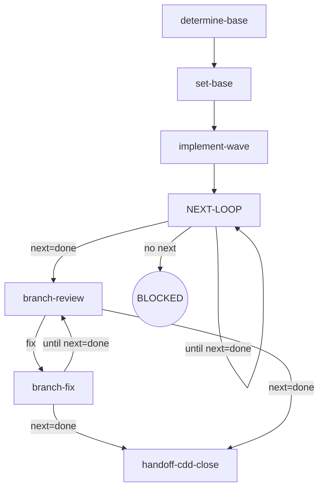

# Kairos CDD-Dev

Executes planned tasks through the engine's implement / review / fix chain — its own orchestrator decisions (mode chain, final review) riding the engine's next: dispatch-ready route facts, with no installed-engine precondition (npx pulls the engine on demand).

**Invocation discipline** — every engine command runs via `npx -y @oscaner-skills/cdd-engine@latest <subcommand>` as a direct tactical invocation — Direct invocation — read the full output (stdout/stderr); the engine truncates its own output. Output filtering is forbidden — no piping to `tail`/`head`, no `2>&1 |`, no `EXIT=$?` capture. **Round rhythm** — one review pass per dispatch; a fix round re-enters the review while the route is not done; ensure the working tree is clean before entering review (engine entry gate: dirty → BLOCKED; the orchestrator writes no tree during dispatch). **Failure face** — cross-node failure handling lives in the Failure Modes table below (the single source); node `Fail` entries keep only local behavior.

## Flow Digraph

## Node Definitions

### `determine-base`

- **Do**: Resolve the base branch — inference sources in order: plan `base` field → branch upstream (`git rev-parse --abbrev-ref @{u}`) → conversation context; if none yields a definitive base, ask the user — do not guess. The base may already be present in the artifact (`npx -y @oscaner-skills/cdd-engine@latest base get --plan <path>`); skip inference when the artifact is present.
- **Read**: plan document + git upstream + conversation context + `npx -y @oscaner-skills/cdd-engine@latest base get --plan <path>`
- **Exit**: base resolved → `set-base`
- **Fail**: user refuses to confirm → BLOCKED: base-undecided

### `set-base`

- **Do**: Persist the base via the engine CLI — `npx -y @oscaner-skills/cdd-engine@latest base set --plan <path> --base <branch> --source <enum>`, where `source` is `plan-field` | `branch-upstream` | `conversation-context` | `user-confirmed`. The engine is the sole write/read path for the artifact — never hand-write it; `set` is idempotent, refusals and validation errors are engine-handled.
- **Read**: `npx -y @oscaner-skills/cdd-engine@latest base get --plan <path>` (the artifact on stdout)
- **Exit**: artifact written (or already present) → `implement-wave`
- **Fail**: engine refusal / validation error → report to user; user decides (no hand-written artifact)

### `implement-wave`

- **Do**: Dispatch `npx -y @oscaner-skills/cdd-engine@latest implement --tasks <n|n,n,…> --plan <path>` — background execution (harness `run_in_background` when supported; timeout + poll otherwise). One dispatch wave per iteration: the wave list derives from the plan's task records via the engine's wave derivation (each ready wave is one dispatch set — waves in derived order, tasks ascending within a wave; a no-dependency task list is the single root wave). Each wave dispatches with its own `--tasks` — `<n>` a singleton wave, `<a,b>` a merged wave. The engine's WaveGate enforces the full derived wave — a manual `--tasks` split is BLOCKed before any dispatch. Every nested dispatch forbids the historical session flags (`--resume` / `-c`) — one-shot print mode only.
- **Read**: output contract — the status capsule (`status:` / `blocker:` / `handoff:` + the engine's `next:` line); BLOCKED grounds ride the stderr `CDD_BLOCKED:` channel; the handoff carries the committed change identity and the findings full text (consumed inside the fix round, never by the orchestrator)
- **Exit**: dispatch complete → `NEXT-LOOP`
- **Fail**: nested CLI exits with no output → BLOCKED: engine-error (report via `kairos:cdd-report`（pi：/skill:cdd-report）)

### `NEXT-LOOP`

- **Do**: Run the wave review-fix rhythm through the engine — one review pass per dispatch. Dispatch the wave review (`npx -y @oscaner-skills/cdd-engine@latest review --type wave --tasks <n|n,n,…> --plan <path>`). Read the output's `next:` line — a dispatch-ready literal (verb + target + id + payload) — and dispatch it as written: `fix wave <tasks> --findings <path>` re-enters the fix pass, `implement wave <tasks>` dispatches the next ready wave via `implement-wave`, `done` closes the plan's waves → `branch-review`. Review is unskippable — a wave never goes straight from implement to completion. `no next` (BLOCKED/TIMEOUT) → the stderr `CDD_BLOCKED:` channel owns the face — these rounds carry no `next:` line and are not consumed as next steps.
- **Read**: the full stdout — the `status:` line (the review conclusion) + the `next:` line (the dispatch-ready literal — fix / the next wave / done); findings full text lives in the handoff and is consumed inside the fix round, never by the orchestrator
- **Exit**: the `next:` line reads `done` → `branch-review`; each fix / next-wave pass re-enters this hub while the route is not done (the `until next=done` self-loop)
- **Fail**: review exits with no output → BLOCKED: engine-error; a completed round without a `next:` line that is not BLOCKED/TIMEOUT → the hard-error face (report the `CDD_BLOCKED:` reason, re-run the same command to continue)

### `branch-review`

- **Do**: Dispatch the branch final review (`npx -y @oscaner-skills/cdd-engine@latest review --type branch --plan <path> --base <merge-base> --head <head>`) — `<merge-base>` = `git merge-base HEAD origin/<base>`; `<head>` = `git rev-parse HEAD`; `<base>` from `npx -y @oscaner-skills/cdd-engine@latest base get --plan <path>`; background execution. Persist the diff to the workspace (`git diff <base>..<head> --stat`).
- **Read**: the base artifact + branch HEAD + the review output contract (the `next:` line)
- **Exit**: the `next:` line reads `fix …` → `branch-fix`; `done` → `handoff-cdd-close`
- **Fail**: review exits with no output → BLOCKED: engine-error

### `branch-fix`

- **Do**: Dispatch the branch fix (`npx -y @oscaner-skills/cdd-engine@latest fix --type branch --plan <path> --findings <path>`) — the findings handoff is the current cycle's source branch review; this is the ONLY fix channel for branch findings — an engine-closed re-review→fix loop with zero inline orchestration (the orchestrator never hand-applies a finding as an editor edit). The branch loop is its OWN closure — the fix round's `next:` line re-enters `branch-review` while the route is not done (the `until next=done` re-review loop) and closes to `handoff-cdd-close` on `done`; it is never routed through the implementation `NEXT-LOOP` hub. The ref embedded in the handoff's commit range moves with the fix commit → a re-review of the new ref is a new review. Rounds are a soft cap only (recommended ≤ 3; beyond that the user decides).
- **Read**: the captured branch-review handoff findings (path from the review output)
- **Exit**: the fix output's `next:` line routes the next hop — a re-review (re-enter `branch-review`, the independent loop) or a `done` closure (`handoff-cdd-close`)
- **Fail**: blockers persist after multiple rounds → implicit fail-open (stop + report; branch preserved; user decides)

### `handoff-cdd-close`

- **Do**: Prepare the handoff to `/kairos:cdd-close`（pi：/skill:cdd-close）: ensure the base artifact is written (cdd-close reads the same artifact inside its finish flow); summarize branch state (commits count / base); invoke `/kairos:cdd-close`（pi：/skill:cdd-close） to take over (merge / PR / keep / discard)
- **Read**: the base artifact output + final branch-review state
- **Exit**: handoff complete → APPROVED: cdd-close
- **Fail**: cdd-close takeover fails → implicit fail-open (branch preserved; user finishes manually)

## Invariants

| # | Invariant |
|---|---|
| I1 | **Host Harness Autodetection** — the engine resolves the host harness internally from ambient environment markers; the orchestrator never passes a harness name down to the CLI |
| I2 | **CLI Background Execution** — all nested CLI calls run in background — harness `run_in_background` when supported; timeout + poll otherwise |
| I3 | **Review Convergence (next: is the dispatch)** — a review closes by its conclusion `status` (APPROVED / CHANGES_REQUESTED / REVIEW_FIX), and the output's `next:` line carries the engine's default next step as a dispatch-ready literal (verb + target-type + id + payload: `implement wave {tasks}` · `review wave {tasks} (base {base7})` · `fix wave {tasks} --findings {path} (read file back to confirm)` · the `done` terminal · the soft-cap message verbatim); read the `next:` line and dispatch it as written — the literal is the dispatch, no kind→command mapping layer. A mid-backfill or a user adjudication that lands governs over the suggestion (current world state wins). Fixes always dispatch via the fix round; the orchestrator must not edit in place as a substitute; the fix commit moves the review ref — a re-review of the new ref is a new review |
| I4 | **Wave-Chain Completeness** — every dispatch wave (a singleton task or a merged wave) goes through the full implement → review → (fix if findings) chain; review is unskippable, and a fix dispatch requires a prior review handoff for that wave |
| I5 | **No Controller Bypass** — when the engine is available, the orchestrator must not hand-write control-flow bypasses; all task execution / review / fix dispatch go through engine CLI calls (the WaveGate + the `next:` route facts decide the wave order, never orchestrator guesswork) |
| I6 | **Mid-Flight Backfill** — a user-raised backfill of overall/spec/plan docs surfaced while a dispatch is in flight lands through four ordered steps on the current call's return: (1) **land immediately** — hot context, no deferral; (2) **commit on its own** — a standalone change, never mixed with implementation commits; (3) **pause the loop until clean** — an uncommitted backfill trips the next review's entry gate (dirty → BLOCKED); (4) **audit in-band on resume** — the next review audits the backfill in-band; a backfill rewriting the current task's own plan/spec text routes through the orchestrator as Plan Sole Writer |
| I7 | **Entry gate reads the tree, not the committed range** — the review entry gate checks working-tree cleanliness only (dirty → BLOCKED). It does not assert that HEAD holds exactly the task's canonical commits, so a committed mid-flight backfill clears the gate; the subsequent review audits the widened range — off-ledger changes surface as a changed-surface booking (an engine WARN, not a block) and the scope axis decides |

## Failure Modes

Cross-node failure handling (complements node Fail fields):

| category | handling |
|---|---|
| TIMEOUT | routed from output contract `status`; retry within the handoff's counters cap, then terminal per the output contract |
| HARNESS_ABORT | `status: BLOCKED` from the output contract + the stderr `CDD_BLOCKED:` reason + the same-command resume fact — an abnormal exit stores a crash-only snapshot + crash record in the workspace; re-run the same command to continue (no redo, no residue loss) |
| ENGINE_SELF_WRITTEN | `status: BLOCKED` from the output contract + the stderr `CDD_BLOCKED:` reason; report via `kairos:cdd-report`（pi：/skill:cdd-report）; orchestrator never rewrites handoff state |
| EXECUTION_FAILURE | `status: BLOCKED` from the output contract + the stderr `CDD_BLOCKED:` reason; fixable + retry available → re-dispatch; else BLOCKED: engine-error |
| PLAN_CONFLICT | `status: BLOCKED` from the output contract + the stderr `CDD_BLOCKED:` reason; surface to the user — never silently override the plan |
| HARD_ERROR | a completed round with no `next:` line that is not BLOCKED/TIMEOUT — report the `CDD_BLOCKED:` reason; re-run the same command to continue |

**Fail-open vs BLOCKED convention**:

- **BLOCKED**: explicit terminal state; requires user intervention to recover.
- **implicit fail-open**: node-level failure (not in digraph); flow stops + reports to user.
