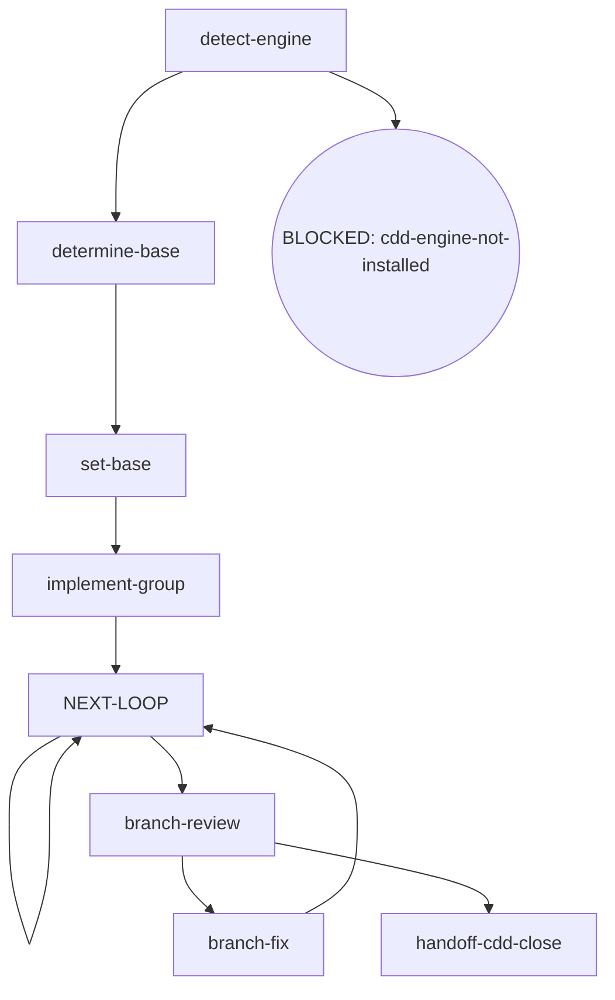

# Kairos CDD-Dev

Execute planned tasks with the host harness CLI (ambient detection — no selection step) via the engine's implement / review / fix chain. This skill is both orchestrator and engine: it executes AND makes orchestrator decisions (mode chain, final review).

## Flow Digraph

## Node Definitions

### `detect-engine`

- **Do**: Verify the engine is installed: `command -v cdd`. Found → `determine-base`; missing → BLOCKED: cdd-engine-not-installed — run the engine install, then retry. Direct invocation — read the full output (stdout/stderr); cdd truncates its own output. Output filtering is forbidden — no piping to `tail`/`head`, no `2>&1 |`, no `EXIT=$?` capture.
- **Read**: PATH environment variable
- **Exit**: Found → `determine-base`; missing → BLOCKED: cdd-engine-not-installed (soft exit with install guidance)
- **Fail**: PATH check errors → fail-open, proceed with a warning

### `determine-base`

- **Do**: Resolve the base branch — inference sources in order: plan `base` field → branch upstream (`git rev-parse --abbrev-ref @{u}`) → conversation context. If none yields a definitive base, AskUserQuestion — do not guess. The base may already be present in the artifact (`cdd base get --plan <path>`); skip inference when the artifact is present. Direct invocation — read the full output (stdout/stderr); cdd truncates its own output. Output filtering is forbidden — no piping to `tail`/`head`, no `2>&1 |`, no `EXIT=$?` capture.
- **Read**: plan document + git upstream + conversation context + `cdd base get --plan <path>`
- **Exit**: base resolved → `set-base`
- **Fail**: user refuses to confirm → BLOCKED: base-undecided

### `set-base`

- **Do**: Persist the base via the engine CLI — `cdd base set --plan <path> --base <branch> --source <enum>`, where `source` is `plan-field` | `branch-upstream` | `conversation-context` | `user-confirmed`. The engine is the sole write/read path for the artifact — never hand-write it; `set` is idempotent, refusals and validation errors are engine-handled. Direct invocation — read the full output (stdout/stderr); cdd truncates its own output. Output filtering is forbidden — no piping to `tail`/`head`, no `2>&1 |`, no `EXIT=$?` capture.
- **Read**: `cdd base get --plan <path>` (the artifact on stdout)
- **Exit**: artifact written (or already present) → `implement-group`
- **Fail**: engine refusal / validation error → report to user; user decides (no hand-written artifact)

### `implement-group`

- **Do**: Dispatch `cdd implement --tasks <n|n,n,…> --plan <path>` — background execution (harness `run_in_background` when supported; timeout + poll otherwise). One dispatch group per iteration: the group list derives from the plan's task records via the engine's wave derivation (each ready wave is one dispatch group — waves in derived order, tasks ascending within a wave; a no-dependency task list is the single root wave). Each group dispatches with its own `--tasks` — `<n>` a singleton group, `<a,b>` a merged group. Every nested dispatch in this skill forbids historical session flags (`--resume` / `-c`) — one-shot print mode only. Direct invocation — read the full output (stdout/stderr); cdd truncates its own output. Output filtering is forbidden — no piping to `tail`/`head`, no `2>&1 |`, no `EXIT=$?` capture.
- **Read**: output contract — the status capsule (`status:` / `blocker:` / `handoff:` + the engine's `next:` line); BLOCKED grounds ride the stderr `CDD_BLOCKED:` channel; the handoff carries the committed change identity and the findings full text (consumed inside the fix round, never by the orchestrator)
- **Exit**: dispatch complete → `NEXT-LOOP`
- **Fail**: nested CLI exits with no output → BLOCKED: engine-error (report via `kairos:cdd-report`（pi：/skill:cdd-report）); a harness abnormal exit stores a crash-only snapshot + crash record in the workspace — re-run the same command per the BLOCKED resume fact to continue (no redo, no residue loss)

### `NEXT-LOOP`

- **Do**: Run the group review-fix rhythm through the engine — one review pass per dispatch. Ensure the working tree is clean before entering review (engine entry gate: dirty → BLOCKED; the orchestrator writes no tree during dispatch). Dispatch the group review (`cdd review --type task --tasks <n|n,n,…> --plan <path>`). Read the output's `next:` route fact — a findings fact → dispatch the group fix from the captured findings handoff (`--findings <path>`) and repeat the pass (the self-loop); the next-group payload → dispatch the next ready group via `implement-group` and repeat the pass; `none` → the run's groups are closed → `branch-review`. Review is unskippable — a group never goes straight from implement to completion. BLOCKED/TIMEOUT rounds carry no `next:` line — the stderr `CDD_BLOCKED:` channel owns their face, and they are not consumed as next steps. Direct invocation — read the full output (stdout/stderr); cdd truncates its own output. Output filtering is forbidden — no piping to `tail`/`head`, no `2>&1 |`, no `EXIT=$?` capture.
- **Read**: the full stdout — the `status:` line the review conclusion + the `next:` route fact (findings / the next group / closure); findings full text lives in the handoff and is consumed inside the fix round, never by the orchestrator
- **Exit**: closure → `branch-review`; each fix / next-group pass re-enters this hub (the self-loop)
- **Fail**: review exits with no output → BLOCKED: engine-error; an abnormal exit stores a crash-only snapshot + crash record — re-run the same command per the BLOCKED resume fact

### `branch-review`

- **Do**: Dispatch the branch final review (`cdd review --type branch --plan <path> --base <merge-base> --head <head>`) — `<merge-base>` = `git merge-base HEAD origin/<base>`; `<head>` = `git rev-parse HEAD`; `<base>` from `cdd base get --plan <path>`; background execution. Persist the diff to the workspace (`git diff <base>..<head> --stat`). Ensure the working tree is clean before entering review (engine entry gate: dirty → BLOCKED). Direct invocation — read the full output (stdout/stderr); cdd truncates its own output. Output filtering is forbidden — no piping to `tail`/`head`, no `2>&1 |`, no `EXIT=$?` capture.
- **Read**: the base artifact + branch HEAD + the review output contract (the `next:` route fact)
- **Exit**: a findings `next:` fact → `branch-fix`; closure (`none`) → `handoff-cdd-close`
- **Fail**: review exits with no output → BLOCKED: engine-error; an abnormal exit stores a crash-only snapshot + crash record — re-run the same command per the BLOCKED resume fact

### `branch-fix`

- **Do**: Dispatch the branch fix (`cdd fix --type branch --plan <path> --findings <path>`) — the findings handoff is the current cycle's source branch review; this is the ONLY fix channel for branch findings — an engine-closed re-review→fix loop with zero inline orchestration (the orchestrator never hand-applies a finding as an editor edit). The ref embedded in the handoff's commit range moves with the fix commit → a re-review of the new ref is a new review. Rounds are a soft cap only (recommended ≤ 3; beyond that the user decides). Direct invocation — read the full output (stdout/stderr); cdd truncates its own output. Output filtering is forbidden — no piping to `tail`/`head`, no `2>&1 |`, no `EXIT=$?` capture.
- **Read**: the captured branch-review handoff findings (path from the review output)
- **Exit**: the fix output's `next:` route fact routes the next hop — re-review (re-enter the `NEXT-LOOP` hub) or the handoff node
- **Fail**: blockers persist after multiple rounds → implicit fail-open (stop + report; branch preserved; user decides)

### `handoff-cdd-close`

- **Do**: Prepare the handoff to `/kairos:cdd-close`（pi：/skill:cdd-close）: ensure the base artifact is written (cdd-close reads the same artifact inside its finish flow); summarize branch state (commits count / base); invoke `/kairos:cdd-close`（pi：/skill:cdd-close） to take over (merge / PR / keep / discard)
- **Read**: the base artifact output + final branch-review state
- **Exit**: handoff complete → APPROVED: cdd-close
- **Fail**: cdd-close takeover fails → implicit fail-open (branch preserved; user finishes manually)

## Invariants

| # | Invariant |
|---|---|
| I1 | **Host Harness Autodetection** — the engine resolves the host harness internally from ambient environment markers; the orchestrator never passes a harness name down to the CLI |
| I2 | **CLI Background Execution** — all nested CLI calls run in background — harness `run_in_background` when supported; timeout + poll otherwise |
| I3 | **Review Convergence (routes are facts)** — a review closes by its conclusion `status` (APPROVED / CHANGES_REQUESTED / REVIEW_FIX), and the output's `next:` line carries the engine's default next-step suggestion — read the `next:` suggestion and dispatch per it when continuing directly; the suggestion is a Route fact (kind + payload: `none` · the next group's task list · a re-review base · the fix findings input + a readback suffix), never a command string on the `next:` token — kind + payload map to the concrete dispatch command. A mid-backfill or a user adjudication that lands governs over the suggestion (current world state wins). Fixes always dispatch via the fix round; the orchestrator must not edit in place as a substitute; the fix commit moves the review ref — a re-review of the new ref is a new review |
| I4 | **Three-Mode Chain Completeness** — every dispatch group (a singleton task or a merged group) goes through the full implement → review → (fix if findings) chain; review is unskippable, and a fix dispatch requires a prior review handoff for that group |
| I5 | **No Controller Bypass** — when the engine is available, the orchestrator must not hand-write control-flow bypasses; all task execution / review / fix dispatch go through engine CLI calls |
| I6 | **Mid-Flight Backfill** — a user-raised backfill of overall/spec/plan docs surfaced while a dispatch is in flight lands through four ordered steps on the current call's return: (1) **land immediately** — hot context, no deferral; (2) **commit on its own** — a standalone change, never mixed with implementation commits; (3) **pause the loop until clean** — an uncommitted backfill trips the next review's entry gate (dirty → BLOCKED); (4) **audit in-band on resume** — the next review audits the backfill in-band; a backfill rewriting the current task's own plan/spec text routes through the orchestrator as Plan Sole Writer |
| I7 | **Entry gate reads the tree, not the committed range** — the review entry gate checks working-tree cleanliness only (dirty → BLOCKED). It does not assert that HEAD holds exactly the task's canonical commits, so a committed mid-flight backfill clears the gate; the subsequent review audits the widened range — off-ledger changes surface as a changed-surface booking (an engine WARN, not a block) and the scope axis decides |

## Failure Modes

Cross-node failure handling (complements node Fail fields):

| category | handling |
|---|---|
| TIMEOUT | routed from output contract `status`; retry within the handoff's counters cap, then terminal per the output contract |
| HARNESS_ABORT | `status: BLOCKED` from the output contract + the stderr `CDD_BLOCKED:` reason + the same-command resume fact — an abnormal exit stores a crash-only snapshot + crash record in the workspace; re-run the same command to continue (no redo, no residue loss) |
| ENGINE_SELF_WRITTEN | `status: BLOCKED` from the output contract + the stderr `CDD_BLOCKED:` reason; report via `kairos:cdd-report`（pi：/skill:cdd-report）; orchestrator never rewrites handoff state |
| EXECUTION_FAILURE | `status: BLOCKED` from the output contract + the stderr `CDD_BLOCKED:` reason; fixable + retry available → re-dispatch; else BLOCKED: engine-error |
| PLAN_CONFLICT | `status: BLOCKED` from the output contract + the stderr `CDD_BLOCKED:` reason; surface to the user — never silently override the plan |

**Fail-open vs BLOCKED convention**:

- **BLOCKED**: explicit terminal state; requires user intervention to recover.
- **implicit fail-open**: node-level failure (not in digraph); flow stops + reports to user.