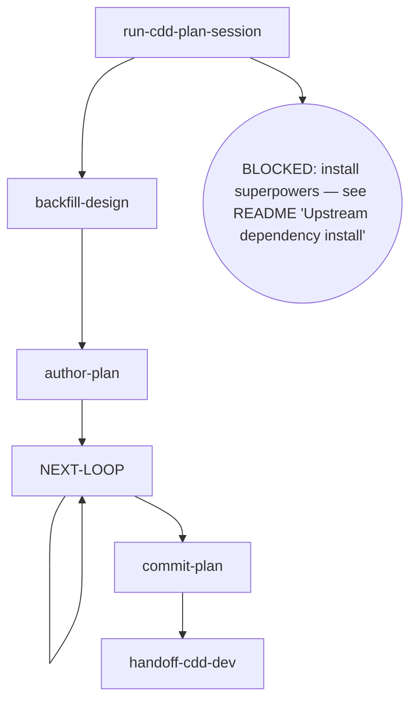

# Kairos CDD-Plan

Writes a plan document from an approved spec, backfills the design when planning surfaces substantive drift, reviews under the cdd plan contract, commits on approval, and hands off to cdd-dev.

## Flow Digraph

## Node Definitions

### `run-cdd-plan-session`

- **Do**: Import `/superpowers:writing-plans`（pi：/skill:writing-plans） — its flow is consumed inline as this session's baseline (loading an upstream skill imports its flow once; no second spawn) to plan the approved spec; it lands the draft plan (session-call; the upstream document is not read)
- **Read**: nothing before the import; the import plans from the approved spec and lands the draft plan
- **Exit**: Import landed → `backfill-design`; upstream missing → BLOCKED (install superpowers — see the kairos README's 'Upstream dependency install' table)
- **Fail**: Upstream superpowers plugin missing → BLOCKED (no downgrade, no skip, no inline restatement)

### `backfill-design`

- **Do**: Check the drafted plan against the approved design. Substantive drift (factual error / missing constraint / a new implementation step the design does not cover) → **backfill the design spec first** — revise the spec + record the drift — so spec and plan agree before plan-review (overall v1.6 rule). Cross-phase matters still backfill to the parent overall per Boundary rules
- **Read**: approved spec + landed plan draft
- **Exit**: spec ↔ plan consistent → `author-plan`
- **Fail**: Entering plan-review with an un-backfilled drift → violates the design-backfill rule (overall v1.6)

### `author-plan`

- **Do**: Write the complete plan document to `docs/kairos/plans/YYYY-MM-DD-<feature>.md`. Plan header MUST carry the approved design link as **`**Spec:**` on line 2** (immediately after the `# Title`): `**Spec:** [<name>-design.md](docs/kairos/specs/<name>-design.md)` — the same source as the review's `--spec` pointer; `cdd-report` resolves program attribution through this header (workspace plan record → **Spec:** → overall → Related), the plan record being the first hop of its program chain. The rest of the plan structure is canonical — run `cdd schema get plan` to read the plan doc-structure schema (the same single structure fact the engine asserts) and follow its properties + descriptions: task-heading format (colon form), the constraint surface declared for `cdd implement` to materialize `plan-constraints.md` (declaring neither blocks pre-flight — no silent fallback), the dispatch-edge fields on the task records, and the header fields. When the task list is written, declare the dependencies as the single directed edge on the task records **non-interactively** — a design judgment at authoring time: `- **DependsOn**: <n, n, …>` (any existing task id — forward references are legal; `none`/empty = the explicit no-dependency declaration), and the engine derives the dispatch waves from the declared closure (`effectiveGroups` = the wave batches — one group per ready wave, tasks ascending within a wave); a no-dependency task list is the single root wave — every `### Task N:` part of the first dispatch group, zero plan churn. Cross-task adjudication surfaced later (user adjudication / phase-level re-scope) is handled by the orchestrator as Plan Sole Writer — it amends the target task's `- **Objective**:` / `- **Steps**:` / `- **Acceptance**:` data fields directly (the standard brief-extraction surface); fix/implement agents hold zero plan-modification authority. Includes self-review (spec coverage + placeholder scan + type consistency) — issues found are fixed inline, not looped or passed to review. Direct invocation — read the full output (stdout/stderr); cdd truncates its own output. Output filtering is forbidden — no piping to `tail`/`head`, no `2>&1 |`, no `EXIT=$?` capture.
- **Read**: approved spec + `backfill-design` output + `cdd schema get plan` (the canonical structure)
- **Exit**: File written → `NEXT-LOOP`
- **Fail**: Schema read fails or the draft plan is unusable → BLOCKED (missing plan input)

### `NEXT-LOOP`

- **Do**: Run the review-fix rhythm for the authored plan — one review per pass. Ensure the working tree is clean before entering review (engine entry gate: dirty → BLOCKED; the orchestrator writes no tree during dispatch). Dispatch the review round on the current ref (`cdd review --type plan --plan <path>`). Read the output's `next:` route fact — a findings fact → dispatch the fix round from the captured findings handoff (`--findings <path>`, never a new review invocation, never self-applied inline edits) and repeat the pass (the self-loop); `none` → closure → `commit-plan`. BLOCKED/TIMEOUT rounds carry no `next:` line — the stderr `CDD_BLOCKED:` channel owns their face, and they are not consumed as next steps. Direct invocation — read the full output (stdout/stderr); cdd truncates its own output. Output filtering is forbidden — no piping to `tail`/`head`, no `2>&1 |`, no `EXIT=$?` capture.
- **Read**: the review output contract (the `status · blocker · handoff` capsule + the `next:` route fact + the findings handoff path)
- **Exit**: closure via the `next:` fact → `commit-plan`; each fix pass re-enters this hub (the self-loop)
- **Fail**: Re-running a review after a closure conclusion → violates the Review Convergence invariant (stop + report)

### `commit-plan`

- **Do**: `git add` the plan + conventional commit. Plan approved = commit immediately; do not wait for a later merge. Direct invocation — read the full output (stdout/stderr); cdd truncates its own output. Output filtering is forbidden — no piping to `tail`/`head`, no `2>&1 |`, no `EXIT=$?` capture.
- **Read**: The committed plan file path
- **Exit**: Commit complete → `handoff-cdd-dev`
- **Fail**: Git error → report + fail-open (do not block user plan review)

### `handoff-cdd-dev`

- **Do**: Prepare the handoff to `/kairos:cdd-dev`（pi：/skill:cdd-dev） — the execution chain takes over to implement the approved plan (flow import, consumed inline as this session's baseline; not a session spawn)
- **Read**: The committed plan file
- **Exit**: Handoff executed → flow ends for this skill
- **Fail**: Target skill missing → BLOCKED (install kairos — see the kairos README's 'Upstream dependency install' table)

## Invariants

| # | Invariant |
|---|---|
| I1 | **Review Convergence (routes are facts)** — a review closes by its conclusion `status` (APPROVED / CHANGES_REQUESTED / REVIEW_FIX), and the output's `next:` line carries the engine's default next-step suggestion — read the `next:` suggestion and dispatch per it when continuing directly; the suggestion is a Route fact (kind + payload: `none` · the next group's task list · a re-review base · the fix findings input + a readback suffix), never a command string on the `next:` token — kind + payload map to the concrete dispatch command. A mid-backfill or a user adjudication that lands governs over the suggestion (current world state wins). Fixes always dispatch via the fix round; the orchestrator must not edit in place as a substitute; a re-review of a moved ref is a new review |
| I2 | **Plan commit discipline** — plan approved = commit immediately; do not wait for dev merge |
| I3 | **Plan Sole Writer** — the plan document is the orchestrator's sole-writer surface: the orchestrator amends the target task's data fields directly on adjudication; fix/implement agents hold zero plan-modification authority |
| I4 | **Mid-Flight Backfill** — a user-raised backfill of overall/spec/plan docs surfaced while a dispatch is in flight lands through four ordered steps on the current call's return: (1) **land immediately** — hot context, no deferral; (2) **commit on its own** — a standalone change, never mixed with implementation commits; (3) **pause the loop until clean** — an uncommitted backfill trips the next review's entry gate (dirty → BLOCKED); (4) **audit in-band on resume** — the next review audits the backfill in-band |

## Failure Modes

| failure | behavior | reason |
|---|---|---|
| Upstream superpowers plugin missing | BLOCKED (install superpowers — see the kairos README's 'Upstream dependency install' table) | Block policy: no silent fallback |
| review re-run after a closure conclusion (REVIEW_FIX / APPROVED) | Violates I1 (Review Convergence) — stop + report to user | A new ref opens a new review, never a re-run of a closed one |
| Entering review with an un-backfilled drift | Violates the design-backfill rule (overall v1.6) — stop + backfill first | Spec and plan must agree before review |
| Git commit error | report + fail-open | Do not block user plan review |