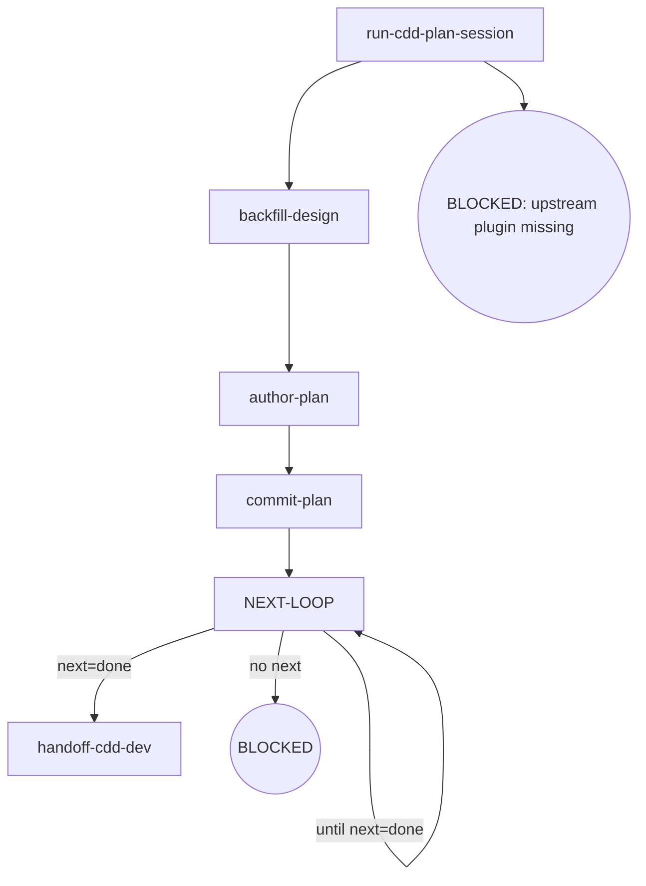

# Kairos CDD-Plan

Writes a plan document from an approved spec, backfills the design when planning surfaces substantive drift, commits the plan before reviewing under the cdd plan contract, and hands off to cdd-dev.

**Invocation discipline** — Direct invocation — read the full output (stdout/stderr); the engine truncates its own output. Output filtering is forbidden — no piping to `tail`/`head`, no `2>&1 |`, no `EXIT=$?` capture. **Round rhythm** — one review pass per dispatch; a fix round re-enters the review while the route is not done; the authored plan commits before the first review round (the clean-tree hard gate's forced order); ensure the working tree is clean before entering review (engine entry gate: dirty → BLOCKED; the orchestrator writes no tree during dispatch). **Failure face** — cross-node failure handling lives in the Failure Modes table below (the single source); node `Fail` entries keep only local behavior.

## Flow Digraph

## Node Definitions

### `run-cdd-plan-session`

- **Do**: Import `/superpowers:writing-plans`（pi：/skill:writing-plans） to plan the approved spec; it lands the draft plan (session-call; the upstream document is not read)
- **Read**: nothing before the import; the import plans from the approved spec and lands the draft plan
- **Exit**: Import landed → `backfill-design`
- **Fail**: Upstream superpowers plugin missing → BLOCKED (no downgrade, no skip, no inline restatement)

### `backfill-design`

- **Do**: Check the drafted plan against the approved design. Substantive drift (factual error / missing constraint / a new implementation step the design does not cover) → **backfill the design spec first** — revise the spec + record the drift — so spec and plan agree before plan-review (the design-backfill rule). Cross-phase matters still backfill to the parent overall per Boundary rules
- **Read**: approved spec + landed plan draft
- **Exit**: spec ↔ plan consistent → `author-plan`
- **Fail**: Entering plan-review with an un-backfilled drift → violates the design-backfill rule

### `author-plan`

- **Do**: Write the complete plan document to `docs/kairos/plans/YYYY-MM-DD-<feature>.md`. Plan header MUST carry the approved design link as **`**Spec:**` on line 2** (immediately after the `# Title`): `**Spec:** [<name>-design.md](docs/kairos/specs/<name>-design.md)` — the same source as the review's `--spec` pointer; `cdd-report` resolves program attribution through this header (workspace plan record → **Spec:** → overall → Related), the plan record being the first hop of its program chain. The rest of the plan structure is canonical — run `npx -y @oscaner-skills/cdd-engine@latest schema get plan` to read the plan doc-structure schema (the same single structure fact the engine asserts) and follow its properties + descriptions: task-heading format (colon form), the constraint surface declared for `npx -y @oscaner-skills/cdd-engine@latest implement` to materialize `plan-constraints.md` (declaring neither blocks pre-flight — no silent fallback), the dispatch-edge fields on the task records, and the header fields. When the task list is written, declare the dependencies as the single directed edge on the task records **non-interactively** — a design judgment at authoring time: `- **DependsOn**: <n, n, …>` (any existing task id — forward references are legal; `none`/empty = the explicit no-dependency declaration), and the engine derives the dispatch waves from the declared closure (`effectiveWaves` = the wave batches — one wave per ready set, tasks ascending within a wave); a no-dependency task list is the single root wave — every `### Task N:` part of the first dispatch wave, zero plan churn. Cross-task adjudication surfaced later (user adjudication / phase-level re-scope) is handled by the orchestrator as Plan Sole Writer — it amends the target task's `- **Objective**:` / `- **Steps**:` / `- **Acceptance**:` data fields directly (the standard brief-extraction surface); fix/implement agents hold zero plan-modification authority. Includes self-review (spec coverage + placeholder scan + type consistency) — issues found are fixed inline, not looped or passed to review.
- **Read**: approved spec + `backfill-design` output + `npx -y @oscaner-skills/cdd-engine@latest schema get plan` (the canonical structure)
- **Exit**: File written → `commit-plan`
- **Fail**: Schema read fails or the draft plan is unusable → BLOCKED (missing plan input)

### `commit-plan`

- **Do**: `git add` the plan + conventional commit.
- **Read**: The committed plan file path
- **Exit**: Commit complete → `NEXT-LOOP`
- **Fail**: Git error → report + fail-open (do not block user plan review)

### `NEXT-LOOP`

- **Do**: Run the review-fix rhythm for the authored plan — one review per pass. Dispatch the review round on the current ref (`npx -y @oscaner-skills/cdd-engine@latest review --type plan --plan <path>`); dispatch the output's `next:` line as written — `fix --type plan --plan <path> --findings <handoff> (read file back to confirm)` re-enters the fix pass, `done` → `handoff-cdd-dev`; BLOCKED/TIMEOUT rounds carry no `next:` line (the `CDD_BLOCKED:` channel owns them).
- **Read**: the review output contract (the `status · blocker · handoff` capsule + the `next:` line + the findings handoff path)
- **Exit**: the `next:` line reads `done` → `handoff-cdd-dev`; each fix pass re-enters this hub while the route is not done (the `until next=done` self-loop)
- **Fail**: Re-running a review after a closure conclusion → violates Review Convergence (stop + report)

### `handoff-cdd-dev`

- **Do**: Hand off to `/kairos:cdd-dev`（pi：/skill:cdd-dev）
- **Read**: The committed plan file
- **Exit**: Handoff executed → flow ends for this skill
- **Fail**: Target skill missing → BLOCKED (install kairos — see the kairos README's 'Upstream dependency install' table)

## Invariants

| # | Invariant |
|---|---|
| I1 | **Review Convergence (next: is the dispatch)** — a review closes by its conclusion `status` (APPROVED / CHANGES_REQUESTED / REVIEW_FIX), and the output's `next:` line carries the engine's default next step as a complete executable command (`implement --plan <path> --tasks 17` · `review --type <wave|spec|plan|branch> <type-arg>` · `fix --type <type> <type-arg> --findings <path> (read file back to confirm)` · the `done` terminal · the soft-cap message verbatim); read the `next:` line and dispatch it as written — the literal is the dispatch, no kind→command mapping layer (`--type` renders only where the verb's type discriminates: implement, the single-type wave verb, never carries it; review/fix, multi-type, always do). A mid-backfill or a user adjudication that lands governs over the suggestion (current world state wins). Fixes always dispatch via the fix round; the orchestrator must not edit in place as a substitute; a re-review of a moved ref is a new review |
| I2 | **Plan commit discipline** — the authored plan commits before the first review round (the clean-tree hard gate's forced order); each fix round commits its own changes — approval closes the loop on a committed state; do not wait for dev merge |
| I3 | **Plan Sole Writer** — the plan document is the orchestrator's sole-writer surface: the orchestrator amends the target task's data fields directly on adjudication; fix/implement agents hold zero plan-modification authority |
| I4 | **Mid-Flight Backfill** — a user-raised backfill of overall/spec/plan docs surfaced while a dispatch is in flight lands through four ordered steps on the current call's return: (1) **land immediately** — hot context, no deferral; (2) **commit on its own** — a standalone change, never mixed with implementation commits; (3) **pause the loop until clean** — an uncommitted backfill trips the next review's entry gate (dirty → BLOCKED); (4) **audit in-band on resume** — the next review audits the backfill in-band |

## Failure Modes

| failure | behavior | reason |
|---|---|---|
| Upstream superpowers plugin missing | BLOCKED (install superpowers — see the kairos README's 'Upstream dependency install' table) | Block policy: no silent fallback |
| review re-run after a closure conclusion (REVIEW_FIX / APPROVED) | Violates I1 (Review Convergence) — stop + report to user | A new ref opens a new review, never a re-run of a closed one |
| Entering review with an un-backfilled drift | Violates the design-backfill rule — stop + backfill first | Spec and plan must agree before review |
| Git commit error | report + fail-open | Do not block user plan review |
| Completed round with no `next:` line (not BLOCKED/TIMEOUT) | HARD_ERROR — report the `CDD_BLOCKED:` reason, re-run the same command to continue | No dispatchable next |
