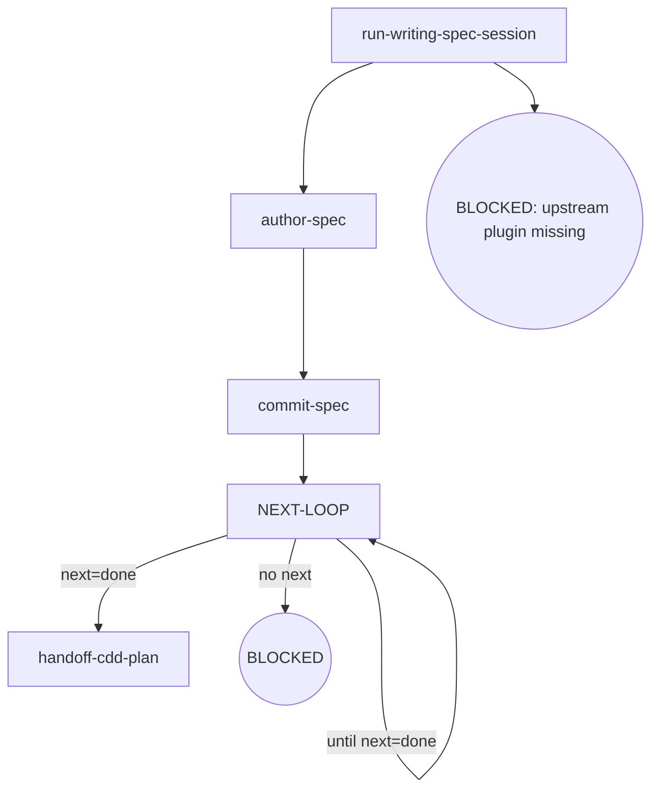

# Kairos CDD-Spec-Writer

Writes the target spec from the writing-spec import — single / phase-spec / overall under one parameterized flow (the schema target + scope gates + authoring + handoff differ by variant; the review-fix rhythm and the Invariants are the single shared skeleton) — commits it before reviewing under the cdd spec contract, and hands it off to cdd-plan.

**Invocation discipline** — Direct invocation — read the full output (stdout/stderr); the engine truncates its own output. Output filtering is forbidden — no piping to `tail`/`head`, no `2>&1 |`, no `EXIT=$?` capture. **Round rhythm** — one review pass per dispatch; a fix round re-enters the review while the route is not done; the authored spec commits before the first review round (the clean-tree hard gate's forced order); ensure the working tree is clean before entering review (engine entry gate: dirty → BLOCKED; the orchestrator writes no tree during dispatch). **Failure face** — cross-node failure handling lives in the Failure Modes table below (the single source); node `Fail` entries keep only local behavior.

## Flow Digraph

## Node Definitions

### `run-writing-spec-session`

- **Do**: Import `/superpowers:brainstorming`（pi：/skill:brainstorming） (writing-spec import); it lands the design decisions this target spec will capture. The target (single / phase-spec / overall) is the session parameter: it selects the schema target, the scope gates and the handoff of the flow
- **Read**: nothing before the import; the import lands the design + the target
- **Exit**: Import landed → `author-spec`
- **Fail**: Upstream superpowers plugin missing → BLOCKED (no downgrade, no skip, no inline restatement)

### `author-spec`

- **Do**: Write the target spec document to `docs/kairos/specs/` from the session output, per the target's structural contract:
  - **single** — free-form authoring (no canonical document skeleton), but carry the `- **Version**: vX.Y · <date>` header line at the document head (the docs-lane doc-contract gate asserts it on every reviewed spec)
  - **phase-spec** — read the canonical structure (`npx -y @oscaner-skills/cdd-engine@latest schema get phase-spec`): the `## Design` double-layer outline (`### N.` groups + `#### N.M` items) + the unique `### Acceptance criteria` + `## Constraints`; the phase scope is an increment only — when the phase scope changed vs the parent overall, sync the parent overall (Issue/Phase inventory + Dependency graph + version bump + change history) BEFORE writing (the four-table sync ordering; the sync is the registration gate, never a silent skip)
  - **overall** — read the canonical structure (`npx -y @oscaner-skills/cdd-engine@latest schema get overall`): the charter-only document (header block + the four tables + Program charter); the phase registration for a new phase is the parent's own table sync (see run-cdd-design's `run-cdd-charter · sync`)
  Includes self-review (spec coverage + placeholder scan + type consistency) — issues found are fixed inline, not looped or passed to review.
- **Read**: Session output + the target's canonical schema (`npx -y @oscaner-skills/cdd-engine@latest schema get <type>`; phase-spec/overall variants also read the parent overall)
- **Exit**: File written → `commit-spec`
- **Fail**: Session output unusable or write error → BLOCKED (missing design input)

### `commit-spec`

- **Do**: `git add` the spec + conventional commit.
- **Read**: The committed spec file path
- **Exit**: Commit complete → `NEXT-LOOP`
- **Fail**: Git error → report + fail-open (do not block user spec review)

### `NEXT-LOOP`

- **Do**: Run the review-fix rhythm for the authored spec — one review per pass. Dispatch the review round on the current ref (`npx -y @oscaner-skills/cdd-engine@latest review --type spec --spec <path>`); dispatch the output's `next:` line as written — `fix --type spec --spec <path> --findings <handoff> (read file back to confirm)` re-enters the fix pass, `done` → `handoff-cdd-plan`; BLOCKED/TIMEOUT rounds carry no `next:` line (the `CDD_BLOCKED:` channel owns them).
- **Read**: the review output contract (the `status · blocker · handoff` capsule + the `next:` line + the findings handoff path)
- **Exit**: the `next:` line reads `done` → `handoff-cdd-plan`; each fix pass re-enters this hub while the route is not done (the `until next=done` self-loop)
- **Fail**: Re-running a review after a closure conclusion → violates Review Convergence (stop + report)

### `handoff-cdd-plan`

- **Do**: Hand off to `/kairos:cdd-plan`（pi：/skill:cdd-plan）; the overall variant continues to the next phase's design session instead
- **Read**: The committed spec file
- **Exit**: Handoff executed → flow ends for this skill
- **Fail**: Target skill missing → BLOCKED (install kairos — see the kairos README's 'Upstream dependency install' table)

## Invariants

| # | Invariant |
|---|---|
| I1 | **Review Convergence (next: is the dispatch)** — a review closes by its conclusion `status` (APPROVED / CHANGES_REQUESTED / REVIEW_FIX), and the output's `next:` line carries the engine's default next step as a complete executable command (`implement --plan <path> --tasks 17` · `review --type <wave|spec|plan|branch> <type-arg>` · `fix --type <type> <type-arg> --findings <path> (read file back to confirm)` · the `done` terminal · the soft-cap message verbatim); read the `next:` line and dispatch it as written — the literal is the dispatch, no kind→command mapping layer (`--type` renders only where the verb's type discriminates: implement, the single-type wave verb, never carries it; review/fix, multi-type, always do). A mid-backfill or a user adjudication that lands governs over the suggestion (current world state wins). Fixes always dispatch via the fix round; the orchestrator must not edit in place as a substitute; a re-review of a moved ref is a new review |
| I2 | **Spec commit discipline** — the authored spec commits before the first review round (the clean-tree hard gate's forced order); each fix round commits its own changes — approval closes the loop on a committed state; do not wait for dev merge |
| I3 | **Mid-Flight Backfill** — a user-raised backfill of overall/spec/plan docs surfaced while a dispatch is in flight lands through four ordered steps on the current call's return: (1) **land immediately** — hot context, no deferral; (2) **commit on its own** — a standalone change, never mixed with implementation commits; (3) **pause the loop until clean** — an uncommitted backfill trips the next review's entry gate (dirty → BLOCKED); (4) **audit in-band on resume** — the next review audits the backfill in-band; a backfill rewriting the current task's own plan/spec text routes through the orchestrator as Plan Sole Writer |

## Failure Modes

| failure | behavior | reason |
|---|---|---|
| Upstream superpowers plugin missing | BLOCKED (install superpowers — see the kairos README's 'Upstream dependency install' table) | Block policy: no silent fallback |
| review re-run after a closure conclusion (REVIEW_FIX / APPROVED) | Violates I1 (Review Convergence) — stop + report to user | A new ref opens a new review, never a re-run of a closed one |
| Git commit error | report + fail-open | Do not block user spec review |
| Completed round with no `next:` line (not BLOCKED/TIMEOUT) | HARD_ERROR — report the `CDD_BLOCKED:` reason, re-run the same command to continue | No dispatchable next |
