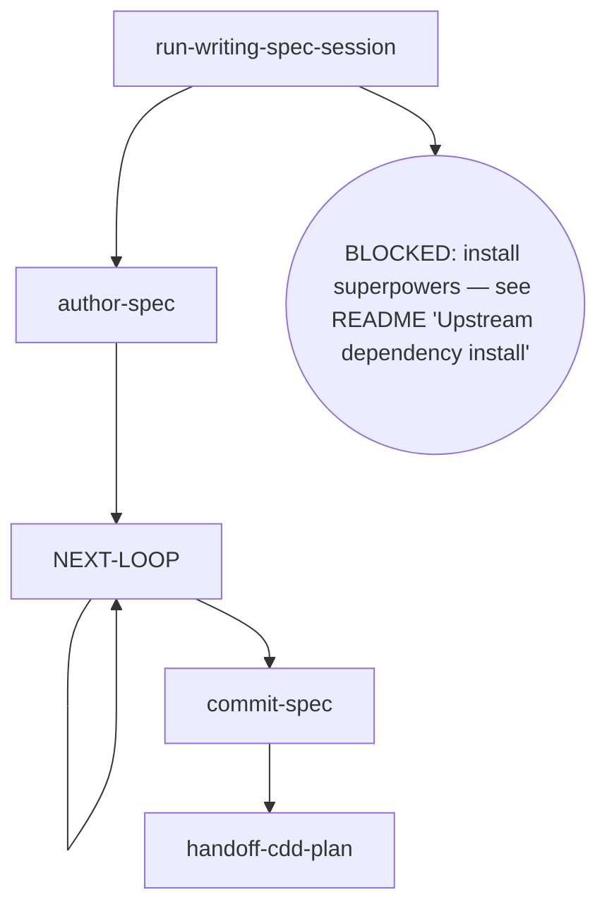

# Kairos CDD-Spec-Writer

Writes the target spec from the writing-spec import — single / phase-spec / overall under one parameterized flow (the schema target + scope gates + authoring + handoff differ by variant; the review-fix rhythm and the Invariants are the single shared skeleton) — reviews it under the cdd spec contract, commits it on approval, and hands it off to cdd-plan.

## Flow Digraph

## Node Definitions

### `run-writing-spec-session`

- **Do**: Import `/superpowers:brainstorming`（pi：/skill:brainstorming） (writing-spec import) — its flow is consumed inline as this session's baseline; it lands the design decisions this target spec will capture. The target (single / phase-spec / overall) is the session parameter: it selects the schema target, the scope gates and the handoff of the flow
- **Read**: nothing before the import; the import lands the design + the target
- **Exit**: Import landed → `author-spec`; upstream missing → BLOCKED (install superpowers — see the kairos README's 'Upstream dependency install' table)
- **Fail**: Upstream superpowers plugin missing → BLOCKED (no downgrade, no skip, no inline restatement)

### `author-spec`

- **Do**: Write the target spec document to `docs/kairos/specs/` from the session output, per the target's structural contract:
  - **single** — free-form authoring (no canonical document skeleton), but carry the `- **Version**: vX.Y · <date>` header line at the document head (the docs-lane doc-contract gate asserts it on every reviewed spec)
  - **phase-spec** — read the canonical structure (`cdd schema get phase-spec`): the `## Design` double-layer outline (`### N.` groups + `#### N.M` items) + the unique `### Acceptance criteria` + `## Constraints`; the phase scope is an increment only — when the phase scope changed vs the parent overall, sync the parent overall (Issue/Phase inventory + Dependency graph + version bump + change history) BEFORE writing (overall v1.4 ordering; the four-table sync is the registration gate, never a silent skip)
  - **overall** — read the canonical structure (`cdd schema get overall`): the charter-only document (header block + the four tables + Program charter); the phase registration for a new phase is the parent's own table sync (see run-cdd-design's `run-cdd-charter · sync`)
  Includes self-review (spec coverage + placeholder scan + type consistency) — issues found are fixed inline, not looped or passed to review. Direct invocation — read the full output (stdout/stderr); cdd truncates its own output. Output filtering is forbidden — no piping to `tail`/`head`, no `2>&1 |`, no `EXIT=$?` capture.
- **Read**: Session output + the target's canonical schema (`cdd schema get <type>`; phase-spec/overall variants also read the parent overall)
- **Exit**: File written → `NEXT-LOOP`
- **Fail**: Session output unusable or write error → BLOCKED (missing design input)

### `NEXT-LOOP`

- **Do**: Run the review-fix rhythm for the authored spec — one review per pass. Ensure the working tree is clean before entering review (engine entry gate: dirty → BLOCKED; the orchestrator writes no tree during dispatch). Dispatch the review round on the current ref (`cdd review --type spec --spec <path>`). Read the output's `next:` route fact — a findings fact → dispatch the fix round from the captured findings handoff (`--findings <path>`, never a new review invocation, never self-applied inline edits) and repeat the pass (the self-loop); `none` → closure → `commit-spec`. BLOCKED/TIMEOUT rounds carry no `next:` line — the stderr `CDD_BLOCKED:` channel owns their face, and they are not consumed as next steps. Direct invocation — read the full output (stdout/stderr); cdd truncates its own output. Output filtering is forbidden — no piping to `tail`/`head`, no `2>&1 |`, no `EXIT=$?` capture.
- **Read**: the review output contract (the `status · blocker · handoff` capsule + the `next:` route fact + the findings handoff path)
- **Exit**: closure via the `next:` fact → `commit-spec`; each fix pass re-enters this hub (the self-loop)
- **Fail**: Re-running a review after a closure conclusion → violates the Review Convergence invariant (stop + report)

### `commit-spec`

- **Do**: `git add` the spec + conventional commit. Spec approved = commit immediately; do not wait for a later merge. Direct invocation — read the full output (stdout/stderr); cdd truncates its own output. Output filtering is forbidden — no piping to `tail`/`head`, no `2>&1 |`, no `EXIT=$?` capture.
- **Read**: The committed spec file path
- **Exit**: Commit complete → `handoff-cdd-plan`
- **Fail**: Git error → report + fail-open (do not block user spec review)

### `handoff-cdd-plan`

- **Do**: Prepare the handoff to `/kairos:cdd-plan`（pi：/skill:cdd-plan） — the plan-authoring flow takes over to plan the implementation of the approved spec (flow import, consumed inline as this session's baseline; not a session spawn). For the overall variant the handoff continues to the next phase's design session instead
- **Read**: The committed spec file
- **Exit**: Handoff executed → flow ends for this skill
- **Fail**: Target skill missing → BLOCKED (install kairos — see the kairos README's 'Upstream dependency install' table)

## Invariants

| # | Invariant |
|---|---|
| I1 | **Review Convergence (routes are facts)** — a review closes by its conclusion `status` (APPROVED / CHANGES_REQUESTED / REVIEW_FIX), and the output's `next:` line carries the engine's default next-step suggestion — read the `next:` suggestion and dispatch per it when continuing directly; the suggestion is a Route fact (kind + payload: `none` · the next group's task list · a re-review base · the fix findings input + a readback suffix), never a command string on the `next:` token — kind + payload map to the concrete dispatch command. A mid-backfill or a user adjudication that lands governs over the suggestion (current world state wins). Fixes always dispatch via the fix round; the orchestrator must not edit in place as a substitute; a re-review of a moved ref is a new review |
| I2 | **Spec commit discipline** — spec approved = commit immediately; do not wait for dev merge |
| I3 | **Mid-Flight Backfill** — a user-raised backfill of overall/spec/plan docs surfaced while a dispatch is in flight lands through four ordered steps on the current call's return: (1) **land immediately** — hot context, no deferral; (2) **commit on its own** — a standalone change, never mixed with implementation commits; (3) **pause the loop until clean** — an uncommitted backfill trips the next review's entry gate (dirty → BLOCKED); (4) **audit in-band on resume** — the next review audits the backfill in-band; a backfill rewriting the current task's own plan/spec text routes through the orchestrator as Plan Sole Writer |

## Failure Modes

| failure | behavior | reason |
|---|---|---|
| Upstream superpowers plugin missing | BLOCKED (install superpowers — see the kairos README's 'Upstream dependency install' table) | Block policy: no silent fallback |
| review re-run after a closure conclusion (REVIEW_FIX / APPROVED) | Violates I1 (Review Convergence) — stop + report to user | A new ref opens a new review, never a re-run of a closed one |
| Git commit error | report + fail-open | Do not block user spec review |