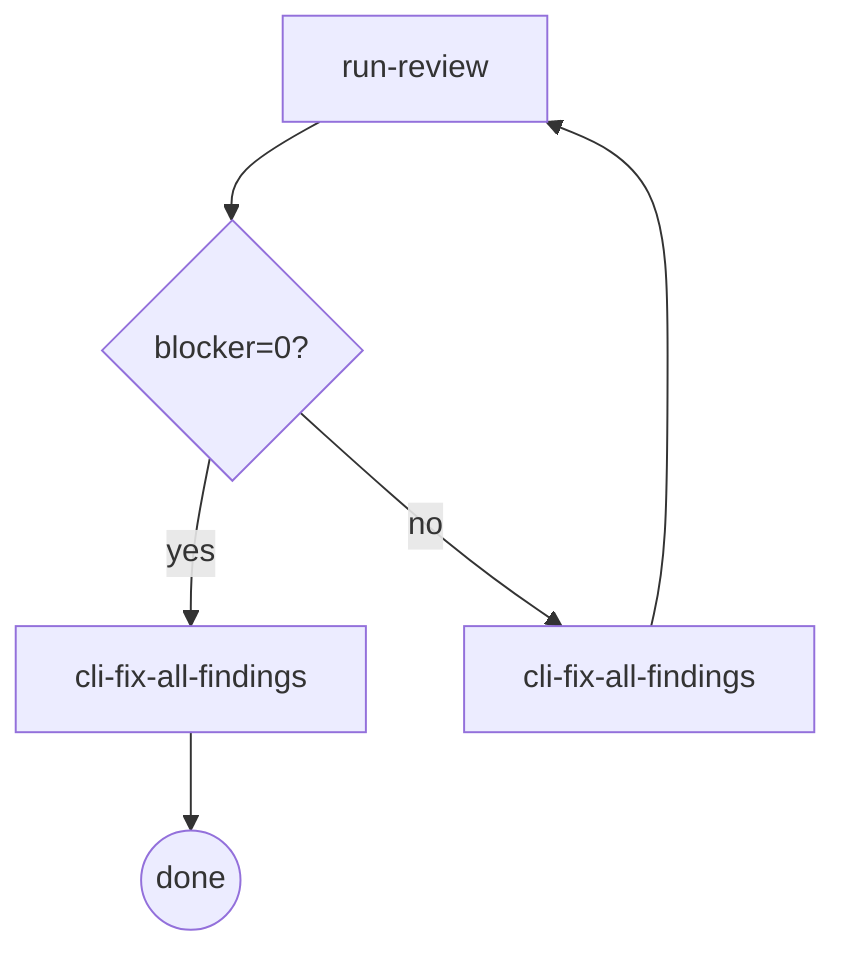

# Docs Review

> **Scope:** Applies to 3-pass AI-orchestrated doc reviews (spec-review / plan-review) only.
> Task-review uses Fix Loop in `cli-driven-development/SKILL.md`. Branch-review uses `cli-driven-development` + `node {pluginRoot}/bin/engine/docs-task.mjs` (--mode review --template branch-review).

Cross-cutting reference: dispatch discipline for multi-pass reviews (D1/D2/D3). Cited by review-pass rules in brainstorming / writing-plans.

## Rules

### Rule: D1 Escalate-on-Finding

Pass 1 runs independently first. Fix first, then run subsequent passes concurrently.

**CLI review:** each pass is an independent `node {pluginRoot}/bin/engine/docs-task.mjs` invocation (stateless fresh nested session).

### Rule: D2 Delta Review

Middle passes receive only the delta changed after the previous pass's fix; the final pass receives the full document (global coherence checks require cross-section visibility).

**CLI review:** only Pass 2 is delta-scoped; Pass 3 is always full-doc.

### Rule: D3 Findings-Only Output

Review prompts must request findings-only (no summary, no positive comments). Output schema: `{findings: [{lens, severity, section|file, line?, summary, fix}]}`. Empty array = approve.

**CLI review:** findings-only as-is, output schema unchanged.

**Severity behavioral anchors:**
- `blocker` — must fix before merge (correctness / contract violation)
- `warn` — deferrable minor (real issue but not blocking)
- `nit` — pure style
- warn/nit: see Rule: Review Stopping below

### Rule: Review Stopping

**`run-review`**
- Do: Execute one full review. CDD → `cdd-task.mjs --mode task-review`; doc-review → `docs-task.mjs --mode review` (D1/D2/D3 passes). Count blockers from findings.
- Exit: blocker=0 → `cli-fix-all-findings` (done path); blocker>0 → `cli-fix-all-findings` (re-run path)
- **Invariant**: must not re-run after blocker=0 output (Review Stopping violation)

**`cli-fix-all-findings`**
- Do: Pass all findings (blocker + warn + nit) to fix. CDD → `cdd-task.mjs --mode fix`; doc-review → `DOCS_ROUND=N docs-task.mjs --mode fix --template <name> --doc <path> --findings <review-N-handoff-path>` (the `--findings` flag is required so {{FINDINGS}} in fix templates resolves to actual findings; without it the fix agent receives nothing to act on). Fix agent writes handoff with schema validation.
- Exit: Returns to `run-review` if entered via the blocker>0 path; terminates if entered via the blocker=0 path. Routing is path-inherited.

**Eliminated rules:**
- D1 zero findings → skip D2/D3 (eliminated)
- blocker=0 → user gate for warn/nit (eliminated; fix agent handles all)
- Fix only blockers (eliminated; always fix all findings)
- deferred findings channel (eliminated)

### Rule: Handoff Output

**Scope:** spec-review and plan-review only. Task-review uses $CDD_HANDOFF_PATH
(unchanged). Branch-review: out of scope for this rule.

Path convention (enforced by docs-task engine — `node {pluginRoot}/bin/engine/docs-task.mjs --mode review --doc <path>`):
  - spec-review: `<cdd-workspace>/spec-review-handoff.json`
  - plan-review: `<cdd-workspace>/plan-review-handoff.json`

`<cdd-workspace>` = `.superpowers/cdd/<plan-slug>/`

handoff.json schema: `{ "status": "APPROVED|CHANGES_REQUESTED", "findings": [...] }`
