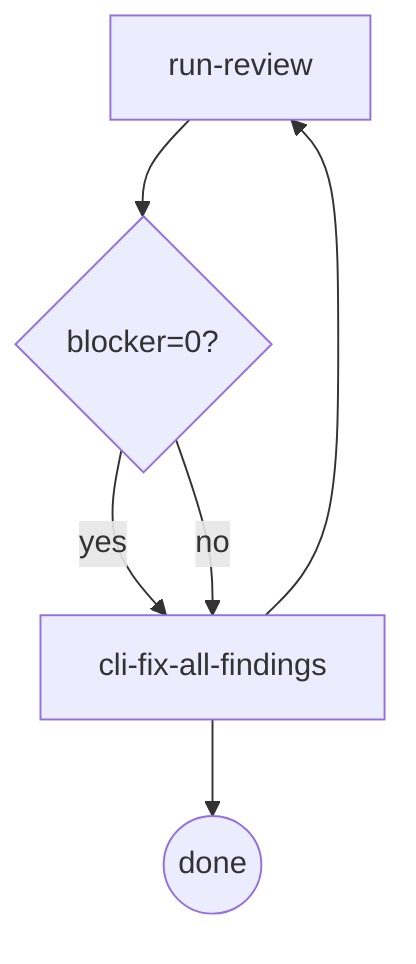

# Review (URC — Unified Review Contract)

> **Scope:** applies to all reviews — task / branch / spec / plan. Single-cycle,
> single-dispatch: one review run per cycle, one dispatch per run. The legacy multi-round
> concurrent doc-review mechanism is eliminated — see §Eliminated.

Cross-cutting reference: the unified review contract for the orchestrator skills. Cited by
`spec-review` (brainstorming) and `plan-review` (writing-plans); task-review and branch-review
share the same digraph through `cli-driven-development`.

## Digraph

### Rule: Review Stopping

Every review loop is composed of exactly two nodes — `run-review` + `cli-fix-all-findings`:

## Node Definitions

### `run-review`

- **Do**: Execute one review per cycle — one dispatch: `cdd review --type <task|branch|spec|plan> --harness <name> [--doc <path>]`. Findings carry a `lens` label; status `APPROVED` / `CHANGES_REQUESTED` / `BLOCKED`.
- **Read**: document / diff under review (spec and plan: `--doc <path>`; task/branch: git range).
- **Exit**: Count blockers from findings. blocker=0 → `cli-fix-all-findings` (done path); blocker>0 → `cli-fix-all-findings` (re-run path, round auto-incremented by the engine).
- **Invariant**: must not re-run after blocker=0 output — the engine layer rejects a re-run of the same ref whose previous round is APPROVED with blocker=0 (Review Stopping violation).

### `cli-fix-all-findings`

- **Do**: Fix ALL findings (blocker + warn + nit) via `cdd fix --type <X> --harness <name> --doc <path> --findings <handoff-path>` (the `--findings` flag is required so the fix template resolves to actual findings; without it the fix agent receives nothing to act on). No new review dispatch — work from findings already captured in the current cycle. Fix agent writes its handoff with schema validation.
- **Exit**: Returns to `run-review` if entered via the blocker>0 path; terminates (done) if entered via the blocker=0 path. Routing is path-inherited.
- **Fail**: Invoking a new review instead of fixing from captured findings → violates the single-cycle rule.

## Rules

- **Single-cycle** — one review dispatch per cycle; multi-pass fan-out is eliminated.
- **lens-tag** — every finding carries a `lens` label (prevents axis mixing).
- **Review Stopping** — blocker=0 is never re-run; the engine layer rejects the same-ref re-run.
- **Severity** — `blocker` must be fixed before merge (correctness / contract violation); `warn` is a minor but real issue (still fixed); `nit` is pure style (still fixed). All findings are always fixed.
- **Handoff Output** — docs reviews (`cdd review --type spec|plan --doc <path>`) write `<workspace>/spec-{round}.json` / `<workspace>/plan-{round}.json`; `<workspace>` = `<repoRoot>/.superpowers/docs-review/`; round auto-incremented by the engine. Handoff schema: `{ "status": "APPROVED|CHANGES_REQUESTED", "findings": [...] }`.

## Invariants

| # | Invariant |
|---|---|
| U1 | No re-run after blocker=0 (engine layer rejects the same-ref re-run) |
| U2 | One dispatch per cycle (no concurrent pass fan-out) |
| U3 | Findings are always fixed in full (blocker + warn + nit) — never filtered |
| U4 | `lens` is mandatory on every finding |

## Failure Modes

| failure | behavior | reason |
|---|---|---|
| Review handoff missing after a cycle | BLOCKED — re-dispatch the same ref | Cannot proceed without a validated review output |
| Engine rejects the re-run (Stopping) after blocker=0 | Start a new review on a changed ref | Re-running a clean ref is a Stopping violation |
| warn/nit fixes skipped | Re-review flags the omission | U3: all findings are always fixed |

## §Eliminated

- Multi-round concurrent doc-review passes (round-fan-out) — replaced by the single-cycle contract above.
- deferred findings channel (eliminated) — removed; findings are always fixed in full during the cycle.