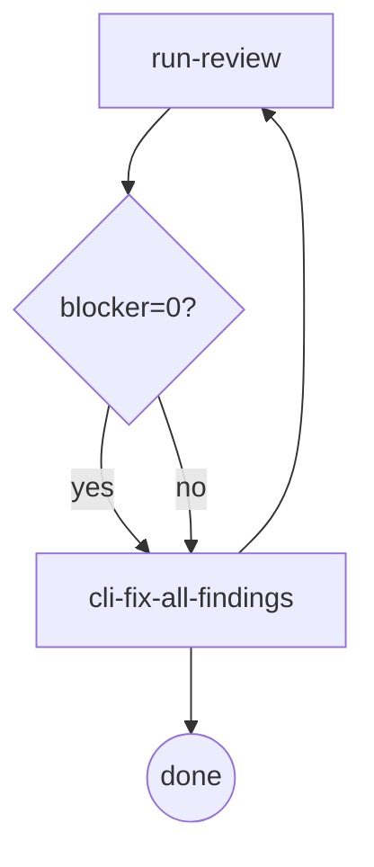

# Review (URC — Unified Review Contract)

> **Scope:** applies to all reviews — task / branch / spec / plan. Single-cycle,
> single-dispatch: one review run per cycle, one dispatch per run. The legacy multi-round
> concurrent doc-review mechanism is eliminated — see §Eliminated.

Cross-cutting reference: the unified review contract for the orchestrator skills. Cited by
`spec-review` (brainstorming) and `plan-review` (writing-plans); task-review and branch-review
share the same digraph through `cli-driven-development`.

## Digraph

### Rule: Review Stopping

Every review loop is composed of exactly two nodes — `run-review` + `cli-fix-all-findings`:

## Node Definitions

### `run-review`

- **Do**: Execute one review per cycle — one dispatch: `cdd review --type <task|branch|spec|plan> (--plan <path> | --spec <path>)`. The target parameter is type-self-describing: type=spec → `--spec <path>` (doc under review); type=plan → `--plan <path>` (doc under review; `--spec <path>` carries the upstream spec reference); type=task/branch → `--plan <path>` (workspace slug + Stopping). Findings carry a `lens` label; status `APPROVED` / `CHANGES_REQUESTED` / `BLOCKED`.
- **Read**: document / diff under review (spec: `--spec <path>`; plan: `--plan <path>`; task/branch: git range).
- **Exit**: Count blockers from findings. blocker=0 → `cli-fix-all-findings` (done path); blocker>0 → `cli-fix-all-findings` (re-run path, round auto-incremented by the engine).
- **Invariant**: must not re-run after blocker=0 output — the engine layer rejects a re-run of the **same ref**: task/branch bind the ref to the reviewed git range; spec/plan bind it to `(doc_path, doc_hash)` — same path **and** same content hash — whose previous round is APPROVED with blocker=0 (Review Stopping violation). **Orchestrator obligation (all four types, incl. branch)**: after a blocker=0 review, fix ALL captured findings (blocker+warn+nit) and finish — do NOT re-dispatch a review of the target. For task/branch the engine cannot detect re-runs whose ref moved with your fix commits; for spec/plan the engine CAN detect a content change (new hash) and would open a *new* review round — so the stop after a clean review is the orchestrator's discipline in both cases (Enh Y); an *edit* to a reviewed spec/plan is precisely what legitimately opens a new cycle (see Spec/plan evolution re-review below).

### Spec/plan evolution re-review (docs)

Editing a reviewed spec/plan changes its content hash (`doc_hash` = sha256 of the doc bytes, recorded in the docs review handoff by the engine at finalization) → the Stopping ref `(doc_path, doc_hash)` becomes a new ref → `cdd review --type spec|plan` opens a fresh review cycle (round auto-incremented; the engine prints `CDD_INFO: doc content changed since round-<R> clean review … → new review round <N>` when the previous round was clean). Unchanged content still exits 3 with guidance (edit the doc content or open a new doc). Handoffs written before `doc_hash` existed (no field) keep the hard stop — their content state is unknown, and editing such a doc alone does not unlock a re-review (open a new doc or remove the stale review handoff). Hash is full-bytes sha256, not normalized — whitespace-only edits can open a review; accepted, the cost is one review dispatch.

### `cli-fix-all-findings`

- **Do**: Fix ALL findings (blocker + warn + nit) via `cdd fix --type <X> (--spec <path> | --plan <path>) --findings <handoff-path>` (the target parameter matches the review's type — type=spec → `--spec <path>`, type=plan → `--plan <path>`, type=task → `--plan <path>` — and the `--findings` flag is required so the fix template resolves to actual findings; without it the fix agent receives nothing to act on). No new review dispatch — work from findings already captured in the current cycle. Fix agent writes its handoff with schema validation.
- **Exit**: Returns to `run-review` if entered via the blocker>0 path; terminates (done) if entered via the blocker=0 path. Routing is path-inherited.
- **Fail**: Invoking a new review instead of fixing from captured findings → violates the single-cycle rule.

## Rules

- **Single-cycle** — one review dispatch per cycle; multi-pass fan-out is eliminated.
- **lens-tag** — every finding carries a `lens` label (prevents axis mixing).
- **Review Stopping** — blocker=0 is never re-run; the engine layer rejects the same-ref re-run.
- **Severity** — `blocker` must be fixed before merge (correctness / contract violation); `warn` is a minor but real issue (still fixed); `nit` is pure style (still fixed). All findings are always fixed.
- **Handoff Output** — docs reviews (`cdd review --type spec --spec <path>` / `cdd review --type plan --plan <path>`) write `<workspace>/spec-review-{R}.json` / `<workspace>/plan-review-{R}.json`; `<workspace>` = `<repoRoot>/.superpowers/cdd/<slug>/` (slug = reviewed doc filename with `.md` and a single trailing `-design` / `-plan` stripped, derived by the engine's `resolveWorkspace`; e.g. `2026-09-08-foo-design.md` and `2026-09-08-foo-plan.md` converge on the same workspace `2026-09-08-foo`), round auto-incremented by the engine per review family. Fix rounds reuse the source review's round: `cdd fix --type spec --spec <path> --findings <workspace>/spec-review-{R}.json` / `cdd fix --type plan --plan <path> --findings <workspace>/plan-review-{R}.json` write `<workspace>/spec-fix-{R}.json` / `<workspace>/plan-fix-{R}.json`. Handoff schema: `{ "status": "APPROVED|CHANGES_REQUESTED", "findings": [...] }`. docs review handoffs additionally carry `doc_hash` (the reviewed content's sha256 — the content-state half of the Stopping ref; engine-attached at finalization).

## Invariants

| # | Invariant |
|---|---|
| U1 | No re-run after blocker=0 (engine layer rejects the same-ref re-run) |
| U2 | One dispatch per cycle (no concurrent pass fan-out) |
| U3 | Findings are always fixed in full (blocker + warn + nit) — never filtered |
| U4 | `lens` is mandatory on every finding |

## Failure Modes

| failure | behavior | reason |
|---|---|---|
| Review handoff missing after a cycle | BLOCKED — re-dispatch the same ref | Cannot proceed without a validated review output |
| Engine rejects the re-run (Stopping) after blocker=0 | Start a new review on a changed ref | Re-running a clean ref is a Stopping violation |
| warn/nit fixes skipped | Re-review flags the omission | U3: all findings are always fixed |

## §Eliminated

- Multi-round concurrent doc-review passes (round-fan-out) — replaced by the single-cycle contract above.
- deferred findings channel (eliminated) — removed; findings are always fixed in full during the cycle.
