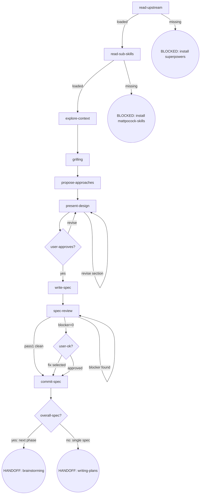

# Osuperpowers Brainstorming

Full brainstorm flow orchestration, callable standalone.

## Flow Digraph

## Node Definitions

### `read-upstream`

- **Do**: Read upstream `superpowers:brainstorming` SKILL.md as the process baseline. **Read, not Skill-invoke** (Skill-invoke triggers router interception — I1). Resolution: ① harness plugin system locates the sibling `superpowers` plugin's SKILL.md; ② fallback to vendored path in the same repo. The baseline is the SKILL.md file only — harness-injected docs (CLAUDE.md, README, vendor contributor guides) are not the baseline
- **Read**: Upstream `superpowers:brainstorming` SKILL.md file
- **Exit**: File exists and readable → `read-sub-skills`; missing → BLOCKED (install superpowers plugin)
- **Fail**: Skill-invoke upstream → violates I1

### `read-sub-skills`

- **Do**: Read `mattpocock-skills` grilling SKILL.md, loading its framework as the grilling stage execution basis. Resolution: ① harness plugin system locates the sibling `mattpocock-skills` plugin; ② fallback to vendored path in the same repo
- **Read**: Grilling SKILL.md file
- **Exit**: Loaded → `explore-context`; missing → BLOCKED (install mattpocock-skills)
- **Fail**: Load failure → BLOCKED with install guidance for mattpocock-skills plugin

### `explore-context`

- **Do**: Explore project context (files, docs, recent commits). If questions requiring primary source research arise: identify → ask user "trigger research?" → user confirms → branch by harness availability: **Agent tool path** (default, no known harness) or **CLI path** (known harness — `cdd-research.mjs` without selection step). CLI invocation reference: `node {pluginRoot}/bin/engine/cdd-research.mjs --harness <name> --brief <brief-path> --output <findings-path>`
- **Read**: Project files, docs, git log, research output files — including `docs/superpowers/research/` findings files produced by `cdd-research.mjs`
- **Exit**: Exploration complete (research finished if spawned) → `grilling`
- **Fail**: Research agent error/timeout → log stderr, fail-open (do not block flow). CLI path failure → fall back to Agent tool path

### `grilling`

- **Do**: Follow grilling SKILL.md framework verbatim — ask one question at a time, wait for each answer before continuing. Code-searchable facts: look up yourself. Decision questions: ask the user
- **Read**: Grilling SKILL.md framework (loaded in `read-sub-skills`)
- **Exit**: Shared understanding reached → `propose-approaches`
- **Fail**: Substituting option menus or structured choice lists for grilling framework → violates invariant

### `propose-approaches`

- **Do**: Propose 2-3 approaches with trade-offs and recommendation. YAGNI ruthlessly
- **Read**: Decisions from grilling + research findings (if any)
- **Exit**: Approaches presented → `present-design`
- **Fail**: —

### `present-design`

- **Do**: Present design section by section, getting user confirmation per section before proceeding. Section complexity determines length
- **Read**: Chosen approach + all grilling decisions
- **Exit**: All sections confirmed → `user-approves?`; user requests revision → revise and re-present that section
- **Fail**: —

### `user-approves?`

- **Do**: Determine user's approval status for the overall design
- **Exit**: Approved → `write-spec`; revise → back to `present-design`
- **Fail**: —

### `write-spec`

- **Do**: Write design to `docs/superpowers/specs/YYYY-MM-DD-<topic>-design.md`. Overall spec: use [overall-spec-template.md](./docs/overall-spec-template.md). Phase spec: use [phase-spec-template.md](./docs/phase-spec-template.md)
- **Read**: All design decisions
- **Exit**: File written → `spec-review`
- **Fail**: —

### `spec-review`

- **Do**: Execute 3-pass spec review (completeness / consistency&scope / clarity&YAGNI), each pass dispatches an independent `cdd-review` CLI call: `node {pluginRoot}/bin/engine/cdd-review.mjs --harness <name> --template spec-review --param PASS=<pass-type> --param DOC=<path>`. Follow D1/D2/D3 from [docs-review.md](./docs/docs-review.md). Review Stopping: ① run 3-pass → ② blocker found → fix → re-run only that pass → loop until blocker=0 → ③ all passes blocker=0 → present warn/nit to user → proceed. Pass 1 zero findings (D1) → skip subsequent passes → `commit-spec`. Only Pass 2 is delta-scoped; Pass 3 is always full-doc
- **Read**: Spec document + [docs-review.md](./docs/docs-review.md)
- **Exit**: blocker=0 → `user-ok?` (present warn/nit); Pass 1 clean (D1) → skip to `commit-spec`
- **Fail**: Re-run review after blocker=0 → violates I5. New cdd-review call for warn/nit → violates I5

### `user-ok?`

- **Do**: Present warn/nit list from spec-review output. User options: ① Proceed to commit ② Fix selected warns/nits. Re-run is never offered after blocker=0
- **Read**: warn/nit findings from spec-review output (read from already-captured output; no new cdd-review call)
- **Exit**: Proceed → `commit-spec`; fix selected → fix then → `commit-spec` (no review re-run)
- **Fail**: Re-run review → violates I5

### `commit-spec`

- **Do**: Commit spec document to git. Spec approved = commit immediately (I4); do not wait for dev merge.

  **Pre-commit overall spec 4-table sync check** (only when this phase is a sub-phase of an overall program; single-spec projects skip this check):
  - Issue inventory: all `#NNN` issue numbers mentioned in this phase's spec or plan are registered in the overall Issue inventory (added or updated)
  - Phase inventory: this phase row's scope / design spec / plan / acceptance criteria / dependency fields are updated to latest state
  - Dependency graph: if this phase adds or removes dependency relationships, the ASCII graph is synced
  - Change history: this phase's change has been appended as one row (including version + date + summary)

  Any table not synced → spec commit violation, **must not commit**, must sync first
- **Read**: Spec file path
- **Exit**: Commit complete → `overall-spec?`
- **Fail**: Git error → report + fail-open (do not block user spec review)

### `overall-spec?`

- **Do**: Determine whether current spec is an overall spec (multi-phase) or a single phase spec
- **Exit**: Overall spec → HANDOFF: brainstorming (next phase's full brainstorm→plan→dev cycle); single phase spec → HANDOFF: writing-plans
- **Fail**: Overall approved then directly entering writing-plans (skipping phase-level brainstorming) → violates overall spec boundary rule

## Invariants

| # | Invariant |
|---|---|
| I1 | **Read, not Skill-invoke** — upstream skill files are Read only, never Skill-invoked (triggers router interception) |
| I2 | **Research requires user confirmation** — spawn research agents only after explicit user confirmation; never auto-trigger |
| I3 | **Design first** — no implementation actions until design is user-approved |
| I4 | **Spec commit discipline** — spec approved = commit immediately; do not wait for dev merge |
| I5 | **Review Stopping** — re-run driven only by blockers; no re-run after blocker=0; no new cdd-review call to obtain warn/nit |

## Failure Modes

| failure | behavior | reason |
|---|---|---|
| Upstream superpowers:brainstorming SKILL.md missing | BLOCKED (with install superpowers plugin guidance) | Block policy: no silent fallback |
| Grilling SKILL.md missing | BLOCKED (with install mattpocock-skills guidance) | Block policy: sub-skill missing = no degradation |
| Research agent error/timeout | fail-open (log stderr, do not block flow) | Research is optional enhancement |
| Git commit error | report + fail-open | Do not block user spec review |
| CLI path failure | fall back to Agent tool path | CLI unavailable but default path works |
