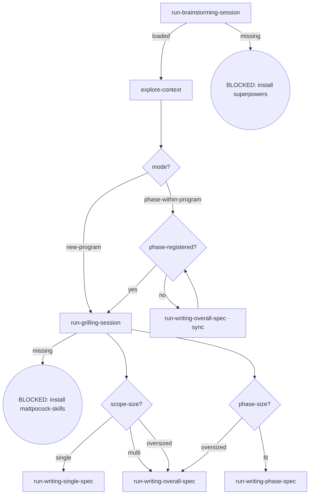

# Osuperpowers Brainstorming

Full brainstorm flow orchestration, callable standalone. The session resolves the program mode: `new-program` routes straight to grilling (no inventory check); `phase-within-program` gates on whether the phase is registered in the parent overall.

## Flow Digraph

## Node Definitions

### `run-brainstorming-session`

- **Do**: Run a /superpowers:brainstorming session — the harness loads the upstream skill and runs its flow. The session resolves the program mode (`new-program` = no parent overall; `phase-within-program` = has a parent overall) and produces the design context this flow routes on
- **Read**: nothing before the session; the session resolves mode + design context
- **Exit**: Session loaded → `explore-context`; upstream missing → BLOCKED (install superpowers)
- **Fail**: Upstream superpowers plugin missing → BLOCKED: install superpowers (no downgrade, no skip, no inline restatement)

### `explore-context`

- **Do**: Explore project context in the resolved mode (code / issues / docs / git log) so the routing and the delegated sessions have what they need
- **Read**: project files, docs, git log, the parent overall (phase-within-program mode)
- **Exit**: Exploration complete → `mode?`
- **Fail**: Context read fails → report + fail-open

### `mode?`

- **Do**: Branch on the mode the session resolved. Gate order matters — mode is decided **before** the register gate: `new-program` connects straight to `run-grilling-session` and **skips the inventory check** (legacy I6 exemption kept verbatim: a new program checks no parent inventory, which does not exist yet); `phase-within-program` → `phase-registered?`
- **Read**: mode marker from `run-brainstorming-session`
- **Exit**: `new-program` → `run-grilling-session`; `phase-within-program` → `phase-registered?`
- **Fail**: —

### `phase-registered?`

- **Do**: Read the parent overall's Phase inventory — is the requested phase registered? `new-program` never passes through this node (`mode?` routes it directly to grilling). Not registered → run the register-reflow node, then re-judge
- **Read**: parent overall (`docs/osuperpowers/specs/*-overall.md`) Phase inventory
- **Exit**: registered → `run-grilling-session`; not registered → `run-writing-overall-spec · sync` → re-judge
- **Fail**: Phase inventory missing or unparseable → BLOCKED (overall-sync-failed); **serial-phase** — registering a new phase whose hard-dependency predecessor has **Design spec ≠ `Done`** in the parent inventory → BLOCKED (never release grilling for an unmet phase — legacy I7 kept verbatim)

### `run-writing-overall-spec · sync`

- **Do**: Run a /osuperpowers:writing-overall-spec session to register the new phase in the parent overall (issue inventory / phase inventory / dependency graph / version bump + change history — the four-table sync), then flow back to `phase-registered?` for the re-judge. Registration reflow — not the terminal overall write (`run-writing-overall-spec` is)
- **Read**: the parent overall
- **Exit**: Sync complete → `phase-registered?`
- **Fail**: four-table sync inconsistent → BLOCKED (overall-sync-failed)

### `run-grilling-session`

- **Do**: Run a /mattpocock-skills:grilling session — upstream grilling flow, scoped by mode: `new-program` → scope-level grilling (each candidate phase's scope / dependencies / acceptance / issue ownership, one session); `phase-within-program` → implementation grilling (root cause → impact boundary → fix direction → approach, one issue per session). Register-before-grill is guaranteed by the `phase-registered?` gate
- **Read**: upstream grilling flow + mode marker + gate verdict
- **Exit**: Session complete → size judgment (`scope-size?` on the new-program path, `phase-size?` on the phase-within-program path); upstream missing → BLOCKED (install mattpocock-skills)
- **Fail**: Grilling an unregistered phase → register-gate violation (BLOCKED upstream at `phase-registered?`)

### `scope-size?`

- **Do**: **Meaningful only on the `new-program` path** (the program's first planning segment): judge whether the new program fits one single spec or needs to become an overall program
- **Read**: grilling output + exploration context
- **Exit**: `single` → `run-writing-single-spec`; `multi` / `oversized` → `run-writing-overall-spec` (oversized = new program exceeds single-spec scale)
- **Fail**: —

### `phase-size?`

- **Do**: **Meaningful only on the `phase-within-program` path**: judge whether this phase fits into one phase spec. The `fit` branch carries no "phase scope changed" case — that step lives inside `writing-phase-spec` (its `scope changed?` gate)
- **Read**: grilling output + parent overall
- **Exit**: `fit` → `run-writing-phase-spec`; `oversized` → `run-writing-overall-spec` (the overall run syncs the sub-phase split into the parent)
- **Fail**: —

### `run-writing-single-spec`

- **Do**: Run a /osuperpowers:writing-single-spec session — authors, reviews and commits the single spec (the program converges into one spec)
- **Read**: grilling output + exploration context
- **Exit**: Handoff session loaded → flow ends for this skill
- **Fail**: Target skill missing → BLOCKED (install osuperpowers)

### `run-writing-overall-spec`

- **Do**: Run a /osuperpowers:writing-overall-spec session — authors, reviews and commits the overall spec (the program charter). Terminal write: the flow converges here and the session hands off to /compact or /osuperpowers:brainstorming [Px program]
- **Read**: grilling output + parent overall (oversized phase-within-program case)
- **Exit**: Handoff session loaded → flow ends for this skill
- **Fail**: Target skill missing → BLOCKED (install osuperpowers)

### `run-writing-phase-spec`

- **Do**: Run a /osuperpowers:writing-phase-spec session — authors, reviews and commits the phase spec (this phase's increment)
- **Read**: grilling output + parent overall
- **Exit**: Handoff session loaded → flow ends for this skill
- **Fail**: Target skill missing → BLOCKED (install osuperpowers)

## Invariants

| # | Invariant |
|---|---|
| I3 | **Design first** — zero implementation dispatch: no code commits, no `cdd implement` dispatch; the flow ends in the delegated spec-writer sessions, never in implementation |
| I4 | **Spec commit discipline** — spec approved = commit immediately; do not wait for dev merge (enforced inside the delegated spec-writer sessions) |

## Failure Modes

| failure | behavior | reason |
|---|---|---|
| Upstream superpowers plugin missing | BLOCKED (install superpowers) | Block policy: no silent fallback |
| Grilling plugin missing | BLOCKED (install mattpocock-skills) | Block policy: no degradation |
| Phase inventory missing / unparseable | BLOCKED (overall-sync-failed) | Registration gate cannot run |
| Registering with predecessor Design spec ≠ Done | BLOCKED (serial-phase) | Never release grilling for an unmet phase |
| Four-table sync inconsistent | BLOCKED (overall-sync-failed) | Refuse to register an inconsistent phase |
