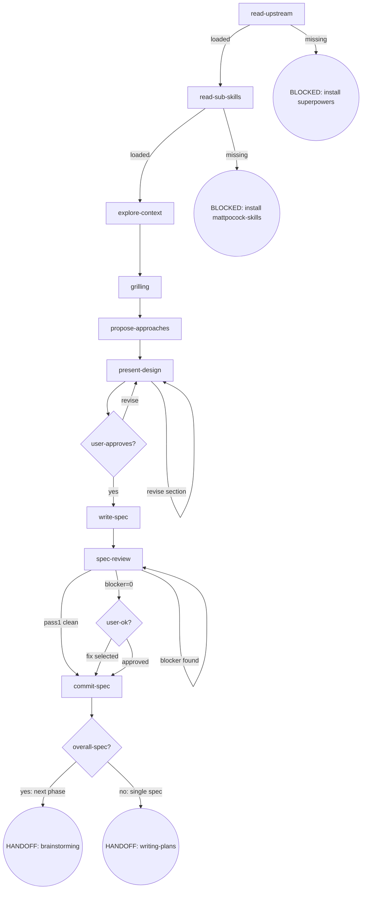

# Osuperpowers Brainstorming

完整 brainstorm 流程编排，可单独调用。

## Flow Digraph

## Node Definitions

### `read-upstream`

- **Do**: 读取上游 `superpowers:brainstorming` SKILL.md 作为流程基线。**Read, not Skill-invoke**（Skill-invoke 触发 router 拦截——I1）。解析策略：① 通过 harness plugin 系统定位同级 `superpowers` plugin 的 SKILL.md；② 回退到同 repo 的 vendored 路径。基线仅为 SKILL.md 文件——harness 注入的文档（CLAUDE.md、README、vendor 贡献者指南）不是基线
- **Read**: 上游 `superpowers:brainstorming` SKILL.md 文件
- **Exit**: 文件存在且可读 → `read-sub-skills`；缺失 → BLOCKED（安装 superpowers plugin）
- **Fail**: Skill-invoke 上游 → 违反 I1

### `read-sub-skills`

- **Do**: 读取 `mattpocock-skills` 的 grilling SKILL.md，加载其框架作为 grilling 阶段执行基础。解析策略：① 通过 harness plugin 系统定位同级 `mattpocock-skills` plugin；② 回退到同 repo 的 vendored 路径
- **Read**: grilling SKILL.md 文件
- **Exit**: 加载成功 → `explore-context`；缺失 → BLOCKED（安装 mattpocock-skills）
- **Fail**: 加载失败 → BLOCKED（含安装 mattpocock-skills plugin 指引）

### `explore-context`

- **Do**: 探索项目上下文（文件、文档、近期 commits）。如发现需要主源研究的问题（上游 API 行为、harness CLI 规格、包内部结构、跨 harness 差异）：识别 → 询问用户"是否触发 research？" → 用户确认 → **两条路径**：
  - **Agent tool 路径（默认）**：并行 spawn research agent（一个问题一个 agent）→ 用户拒绝：跳过 research。探索不中断。进入 grilling 前等待 research 完成。
  - **CLI 路径（可选，已知 harness）**：当 session context 已有 harness（prior CDD session / 用户显式指定）时，使用 `cdd-research.mjs` CLI：准备 brief → `node {pluginRoot}/bin/engine/cdd-research.mjs --harness <name> --brief <brief-path> --output <findings-path>` → findings 落盘 `docs/superpowers/research/YYYY-MM-DD-<topic>.md`。此路径无需选择 harness，因 harness 从 context 中已知。

  输出写入 `docs/superpowers/research/YYYY-MM-DD-<topic>.md`
- **Read**: 项目文件、docs、git log、research 输出文件（如有）——包括 `docs/superpowers/research/` 下由 `cdd-research.mjs` 产出的 findings 文件
- **Exit**: 探索完成（research 如有则已等待完成）→ `grilling`
- **Fail**: research agent 错误/超时 → 记录 stderr，fail-open（不阻塞流程）。CLI 路径失败 → 降级到 Agent tool 路径

### `grilling`

- **Do**: 按 grilling SKILL.md 框架如实执行——逐一追问用户，每次一个问题，等待回答后继续。代码可查的事实自己查，决策问题留给用户
- **Read**: grilling SKILL.md 框架（从 `read-sub-skills` 加载）
- **Exit**: 达到 shared understanding → `propose-approaches`
- **Fail**: 以选项菜单/结构化列表替代 grilling 框架 → 违反 invariant

### `propose-approaches`

- **Do**: 提出 2-3 个方案含 trade-off 与推荐。YAGNI ruthlessly
- **Read**: grilling 收集的决策 + research findings（如有）
- **Exit**: 方案呈现完毕 → `present-design`
- **Fail**: —

### `present-design`

- **Do**: 逐节呈现设计，每节获得用户确认后再呈现下一节。节复杂度决定长度
- **Read**: 方案选择 + 全部 grilling 决策
- **Exit**: 用户全部节确认 → `user-approves?`；用户要求修改 → 修订后重新呈现该节
- **Fail**: —

### `user-approves?`

- **Do**: 判断用户对整体设计的批准状态
- **Exit**: approved → `write-spec`；revise → 回到 `present-design`
- **Fail**: —

### `write-spec`

- **Do**: 将设计写入 `docs/superpowers/specs/YYYY-MM-DD-<topic>-design.md`。Overall spec 使用 [overall-spec-template.md](./docs/overall-spec-template.md)；phase spec 使用 [phase-spec-template.md](./docs/phase-spec-template.md)
- **Read**: 全部设计决策
- **Exit**: 文件写入完成 → `spec-review`
- **Fail**: —

### `spec-review`

- **Do**: 执行 3-pass spec review（completeness / consistency&scope / clarity&YAGNI），每 pass 派发独立 `cdd-review` CLI 调用：`node {pluginRoot}/bin/engine/cdd-review.mjs --harness <name> --template spec-review --param PASS=<pass-type> --param DOC=<path>`。遵循 [docs-review.md](./docs/docs-review.md) 的 D1/D2/D3 规则。Review Stopping：① 运行 3-pass → ② 发现 blocker → 修复 → 仅重跑该 pass → 循环直到 blocker=0 → ③ 全部 pass blocker=0 → 呈现 warn/nit 给用户 → 继续。Pass 1 零发现（D1）→ 跳过后续 pass → `commit-spec`。仅 Pass 2 为 delta-scoped；Pass 3 始终 full-doc
- **Read**: spec 文档 + [docs-review.md](./docs/docs-review.md)
- **Exit**: blocker=0 → `user-ok?`（呈现 warn/nit）；Pass 1 clean（D1）→ 跳到 `commit-spec`
- **Fail**: blocker=0 后重跑 review → 违反 I5。为新 warn/nit 发起新 cdd-review → 违反 I5

### `user-ok?`

- **Do**: 呈现 spec-review 输出的 warn/nit 列表。用户选项：① Proceed to commit ② Fix selected warns/nits。blocker=0 后不提供重跑
- **Read**: spec-review 输出的 warn/nit findings（从已有输出读取；不发新 cdd-review）
- **Exit**: proceed → `commit-spec`；fix selected → 修复后 → `commit-spec`（不重跑 review）
- **Fail**: 重跑 review → 违反 I5

### `commit-spec`

- **Do**: 将 spec 文档提交到 git。spec 获批即 commit（I4）；不等 dev 合并。

  **Commit 前校验 overall spec 四表同步**（仅当本 phase 是 overall 程序的子 phase 时；single-spec 项目跳过此校验）：
  - Issue inventory：本 phase spec 或 plan 中提及的所有 `#NNN` issue 编号均已在 overall Issue inventory 中登记（新增或更新）
  - Phase inventory：本 phase 行的 scope / design spec / plan / acceptance criteria / dependency 字段已更新到最新状态
  - Dependency graph：若本 phase 新增或移除依赖关系，ASCII 图已同步
  - Change history：本 phase 的变更已 append 一行（含 version + 日期 + 摘要）

  任何一表未同步 → 视为 spec commit 违规，**不得 commit**，必须先同步再提交
- **Read**: spec 文件路径
- **Exit**: commit 完成 → `overall-spec?`
- **Fail**: git 错误 → report + fail-open（不阻塞用户审阅 spec）

### `overall-spec?`

- **Do**: 判断当前 spec 是 overall spec（含多 phase）还是单 phase spec
- **Exit**: overall spec → HANDOFF: brainstorming（下一 phase 的完整 brainstorm→plan→dev 循环）；单 phase spec → HANDOFF: writing-plans
- **Fail**: overall 批准后直接进 writing-plans（跳过 phase 级 brainstorming）→ 违反 overall spec 边界规则

## Invariants

| # | Invariant |
|---|---|
| I1 | **Read, not Skill-invoke** — 上游 skill 文件只 Read，不 Skill-invoke（触发 router 拦截） |
| I2 | **Research 需用户确认** — spawn research agent 前必须用户明确确认，不自动触发 |
| I3 | **Design first** — design 获用户批准前禁止任何实施行动 |
| I4 | **Spec commit 纪律** — spec 获批即 commit；不等 dev 合并 |
| I5 | **Review Stopping** — 重跑仅由 blocker 驱动；blocker=0 后不重跑；不为获取 warn/nit 发起新 cdd-review |

## Failure Modes

| failure | behavior | reason |
|---|---|---|
| 上游 superpowers:brainstorming SKILL.md 缺失 | BLOCKED（含安装 superpowers plugin 指引） | block 政策：不静默 fallback |
| grilling SKILL.md 缺失 | BLOCKED（含安装 mattpocock-skills 指引） | block 政策：子技能缺失不降级 |
| research agent 错误/超时 | fail-open（记录 stderr，不阻塞流程） | research 是可选增强 |
| git commit 错误 | report + fail-open | 不阻塞用户审阅 spec |
