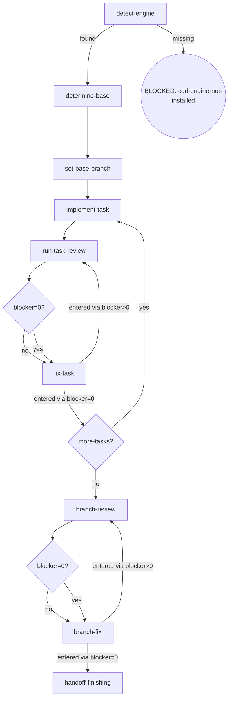

# CLI-Driven Development (cdd)

Execute planned tasks with the host harness CLI (ambient detection — no selection step) via a three-mode chain. This skill is both orchestrator and engine: it executes AND makes orchestrator decisions (mode chain, final review).

## Flow Digraph

## Node Definitions

### `detect-engine`

- **Do**: Verify the engine is installed: `command -v cdd`. Found → `determine-base`; missing → BLOCKED: cdd-engine-not-installed — run `npm i -g @oscaner-skills/cdd-engine`, then retry.
- **Read**: PATH environment variable
- **Exit**: Found → `determine-base`; missing → BLOCKED: cdd-engine-not-installed (soft exit with install guidance)
- **Fail**: PATH check errors → fail-open, proceed with a warning

### `determine-base`

- **Do**: Follow the [base-branch.md](./docs/base-branch.md) methodology — inference sources in order: plan `base` field → branch upstream (`git rev-parse --abbrev-ref @{u}`) → conversation context. If none yields a definitive base, AskUserQuestion — do not guess. Base may already be present in the artifact (skip inference).
- **Read**: plan document + git upstream + conversation context + `cdd base-branch get --plan <path>` (skip inference when the artifact is present)
- **Exit**: base resolved → `set-base-branch`
- **Fail**: user refuses to confirm → BLOCKED: base-undecided

### `set-base-branch`

- **Do**: Persist the base via the engine CLI — `cdd base-branch set --plan <path> --base <branch> --source <enum>`, where `source` is `plan-field` | `branch-upstream` | `conversation-context` | `user-confirmed`. The engine is the sole write/read path for the artifact — never hand-write it; `set` is idempotent, refusals and validation errors are engine-handled (exit 2).
- **Read**: `cdd base-branch get --plan <path>` (artifact JSON on stdout)
- **Exit**: artifact written (or already present) → `implement-task`
- **Fail**: engine refusal / validation error → report to user; user decides (no hand-written artifact)

### `implement-task`

- **Do**: Dispatch `cdd implement --task <n> --plan <path>` — background execution (harness `run_in_background` when supported; timeout + poll otherwise). One task at a time.
- **Read**: output contract — `status` / `blocker` / `artifacts` (absolute paths) / `counters`
- **Exit**: dispatch complete → `run-task-review`
- **Fail**: nested CLI exits with no output → BLOCKED: engine-error (report via `osuperpowers:report-issue`)

### `run-task-review`

- **Do**: Dispatch `cdd review --type task --task <n> --plan <path>` — background execution. Every task goes through implement → review → (fix if blockers); review is unskippable — a task never goes straight from implement to completion.
- **Read**: output contract — `status` + captured review `findings[]`; routes by blocker severity
- **Exit**: `blocker=0?` routes to `fix-task` (both branches; the re-run path is determined by the entry edge)
- **Fail**: review exits with no output → BLOCKED: engine-error

### `fix-task`

- **Do**: Fix ALL review findings (blocker + warn + nit) via `cdd fix --type task --task <n> --plan <path> --findings <handoff>` — `<handoff>` is the current cycle's handoff path from `artifacts`. No new review invocation — work from the findings already captured in this cycle.
- **Read**: captured review handoff `findings[]` (path from `artifacts`)
- **Exit**: entered via blocker>0 → `run-task-review` (re-run); entered via blocker=0 → `more-tasks?` (no re-run after blocker=0)
- **Fail**: invoking a new review instead of fixing from captured findings → violates the review-stopping discipline

### `branch-review`

- **Do**: Dispatch `cdd review --type branch --plan <path> --base <merge-base> --head <head>` — `<merge-base>` = `git merge-base HEAD origin/<base>` with `<base>` from `cdd base-branch get --plan <path>`; `<head>` = `git rev-parse HEAD`; background execution. Persist the diff to the workspace (`git diff <base>..<head> --stat`).
- **Read**: `cdd base-branch get` output + branch HEAD + review output contract
- **Exit**: `blocker=0?` routes to `branch-fix` (both branches; the re-run path is determined by the entry edge)
- **Fail**: review exits with no output → BLOCKED: engine-error

### `branch-fix`

- **Do**: Fix ALL branch-review findings (blocker + warn + nit) via `cdd fix --type branch --plan <path> --findings <handoff>` — `<handoff>` is the current cycle's branch-review handoff path from `artifacts`. No hard cap (recommended ≤ 3 rounds; beyond that, the user decides).
- **Read**: captured branch-review handoff `findings[]` (path from `artifacts`)
- **Exit**: entered via blocker>0 → `branch-review` (re-run); entered via blocker=0 → `handoff-finishing` (no re-review after blocker=0)
- **Fail**: blockers persist after multiple rounds → implicit fail-open (stop + report; branch preserved; user decides)

### `handoff-finishing`

- **Do**: Prepare the handoff to `osuperpowers:finishing`: ensure the base-branch artifact is written (finishing's read-base node consumes the same artifact); summarize branch state (commits count / base); invoke `osuperpowers:finishing` to take over (merge / PR / keep / discard).
- **Read**: `cdd base-branch get --plan <path>` output + final branch-review state
- **Exit**: handoff complete → APPROVED: finishing
- **Fail**: finishing takeover fails → implicit fail-open (branch preserved; user finishes manually)

## Invariants

| # | Invariant |
|---|-----------|
| I1 | **Host Harness Autodetection** — the engine resolves the host harness internally from ambient environment markers; the orchestrator never passes a harness name down to `cdd`. |
| I2 | **CLI Background Execution** — all `cdd <subcommand>` calls run in background — harness `run_in_background` when supported; timeout + poll otherwise. |
| I3 | **No --resume / -c** — nested CLI calls forbid carrying historical session flags (`--resume` / `-c`); use one-shot print mode. |
| I4 | **Review Stopping** — blocker=0 → fix all findings via `cdd fix`, then stop; do not re-run (for task/branch the review ref moves with the fix commit — the engine cannot intercept it, so this discipline is the only guard). No re-review after a blocker=0 review; the cycle ends with the fix of all captured findings |
| I5 | **Three-Mode Chain Completeness** — every task goes through the full implement → review → (fix if blockers) chain; review is unskippable, and fix dispatch requires a prior APPROVED review handoff for that task. |
| I6 | **No Controller Bypass** — when the engine is available, the orchestrator must not hand-write control-flow bypasses; all task execution / review / fix dispatch go through engine CLI calls. |

## Failure Modes

Cross-node failure handling (complements node Fail fields):

| category | handling |
|---|---|
| TIMEOUT | routed from output contract `status`; retry within the counters cap, then terminal per the output contract |
| CONTRACT_VIOLATION | blocker from output contract; report via `osuperpowers:report-issue`; no re-dispatch |
| ENGINE_SELF_WRITTEN | blocker from output contract; report via `osuperpowers:report-issue`; orchestrator never rewrites handoff state |
| EXECUTION_FAILURE | blocker from output contract; fixable + retry available → re-dispatch; else BLOCKED: engine-error |
| UNVERIFIABLE | blocker from output contract; report to user; re-dispatch only on user confirmation |
| PLAN_CONFLICT | blocker from output contract; surface to the user — never silently override the plan |

**Fail-open vs BLOCKED convention**:

- **BLOCKED**: explicit terminal state; requires user intervention to recover.
- **implicit fail-open**: node-level failure (not in digraph); flow stops + reports to user.
