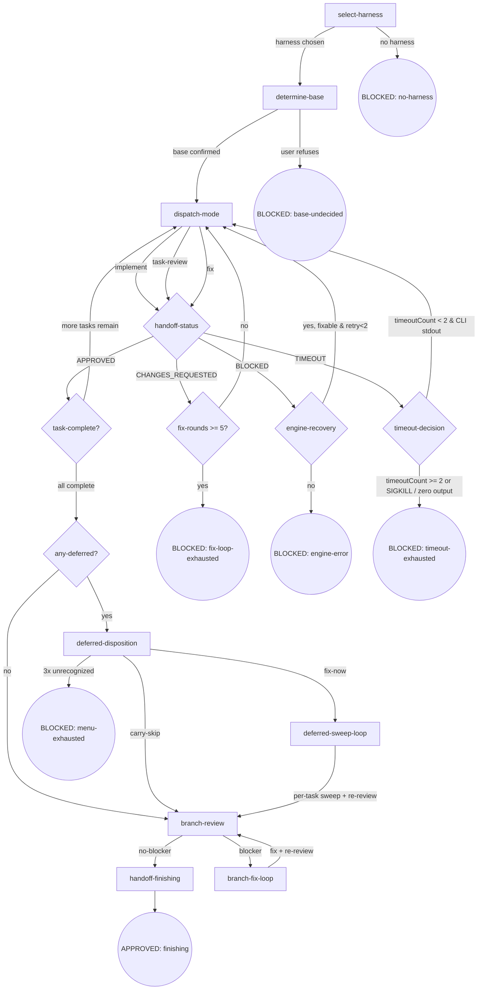

# CLI-Driven Development (cdd)

Execute planned tasks with the selected harness CLI via a three-mode chain. This skill is both orchestrator and engine: it executes AND makes orchestrator decisions (mode chain, Final Review).

## Flow Digraph

## Node Definitions

### `select-harness`

- **Do**: Invoke the [ask](../cli-select/SKILL.md#ask) node of [cli-select](../cli-select/SKILL.md) (cross-skill call) to obtain the user's selected harness name; pass `--harness <name>` as an **explicit CLI argument** to all downstream `cdd-task.mjs` / `cdd-review.mjs` calls (no implicit env var propagation — extends P7 I1).
- **Read**: harness name returned by cli-select's `ask` node.
- **Exit**: harness selected → `determine-base`; cli-select BLOCKED → BLOCKED: no-harness.
- **Fail**: cli-select returns BLOCKED (engine bug / user cancellation) → this node same BLOCKED.

### `determine-base`

- **Do**: Follow the [base-branch.md](./docs/base-branch.md) methodology, trying sources in order: ① plan document `base` field ② branch upstream (`git rev-parse --abbrev-ref @{u}`) ③ conversation context (explicit base mention in prior messages) ④ fallback: ask user. Once determined, write to `.superpowers/cdd/<slug>/base-branch.json` (schema: `{base, source: "plan-field"|"branch-upstream"|"conversation-context"|"user-confirmed", confirmed_at}`; slug = CDD workspace slug; source has four values matching the four inference sources). **Scope resolution**: CDD scenario scope = `cdd`, slug = CDD workspace slug.
- **Read**: plan document + `git rev-parse --abbrev-ref @{u}` + conversation context + `.superpowers/cdd/<slug>/base-branch.json` (optional — skip inference if already exists).
- **Exit**: base confirmed (artifact written or already exists) → `dispatch-mode` (first task's implement).
- **Fail**: user refuses to confirm → BLOCKED: base-undecided.

### `dispatch-mode`

- **Do**: Construct and execute `node {pluginRoot}/bin/engine/cdd-task.mjs --harness <name> --task N --mode <mode> [--scope blocker-only|deferred-sweep]` (`--scope` only valid for `--mode fix`; default `blocker-only`). **Background execution** (program-level enforcement): must run CLI in background mode (harness `run_in_background` when supported; timeout + poll otherwise). After return, **must read handoff.json to determine status** (orchestrator handoff check obligation — #181 core): parse `status` field (APPROVED / CHANGES_REQUESTED / BLOCKED / TIMEOUT); **never judge changes by stdout emptiness**. **Timeout handling**: if `invokeCli` returns `timedOut: true`, read `progress.md` `timeoutCount` and route to `timeout-decision` (decision node in digraph). Brief generation uses `--task N` index (CDD-level unique index — #185 post-fix semantics). Scope defaults to `blocker-only`; `deferred-sweep` only when deferred-disposition decision is fix-now.
- **Read**: `CDD_HANDOFF_PATH` (`task-N-handoff.json`) + open-findings (fix mode) + brief-dependent plan sections + `progress.md` (timeoutCount, on timeout).
- **Exit**: construct CLI command and spawn → enter `handoff-status` (decision node, routes by handoff status). On timeout → enter `timeout-decision`.
- **Fail**: nested CLI failure with missing handoff → runner.mjs has written BLOCKED handoff (stderr in blocker field); this node reads and routes to BLOCKED: engine-error.

### `handoff-status` (decision node)

- **Do**: Read `handoff.json` `status` field and route to the corresponding exit.
- **Read**: `handoff.json`.
- **Exit**: `APPROVED` → `task-complete?`; `CHANGES_REQUESTED` → dispatch-mode (fix mode, blocker-only scope; dispatch-mode internally maintains fix-round counter, ≥ 5 routes to BLOCKED: fix-loop-exhausted); `BLOCKED` → `engine-recovery` (decision node — reads blocker to determine fixability; if fixable + retry<2 → re-dispatch dispatch-mode with same mode; if not fixable or retry≥2 → BLOCKED: engine-error; retry counter managed via `progress.md` `engine-recovery-count`, not `handoff.json.retryCount` — see §D deviation note below); `TIMEOUT` → `timeout-decision` (decision node — reads `progress.md` `timeoutCount`; < 2 + CLI stdout present → retry via dispatch-mode; ≥ 2 or SIGKILL / zero output → BLOCKED: timeout-exhausted); `NEEDS_CONTEXT` → **implicit fail-open** (orchestrator manually investigates then redispatches dispatch-mode with the same mode; not a digraph edge).
- **Fail**: `status` field missing or illegal (not one of APPROVED / CHANGES_REQUESTED / BLOCKED; NEEDS_CONTEXT is a known but implicitly handled status handled by the Exit field's fail-open path, not this Fail branch).

### `engine-recovery` (decision node)

- **Do**: Read the blocker field from the current `handoff.json` and determine fixability: ① if the blocker describes a fixable condition (e.g., dirty tree → commit first, missing artifact → regenerate) **and** `progress.md` `engine-recovery-count` < 2 → increment recovery counter in `progress.md` → re-dispatch `dispatch-mode` with the same mode and task; ② if not fixable or `engine-recovery-count` ≥ 2 → terminal `BLOCKED: engine-error`.
- **Read**: `handoff.json` (blocker field) + `progress.md` (engine-recovery-count; increment on each recovery attempt).
- **Exit**: fixable + retry<2 → `dispatch-mode` (same mode, same task); not fixable or retry≥2 → `BLOCKED: engine-error`.
- **Fail**: blocker field empty or unparseable → terminal `BLOCKED: engine-error`.

> **§D deviation note (deliberate spec §2.3 step 4 departure)**: Spec §2.3 prescribes reusing `handoff.json.retryCount` (managed by engine-layer `runner.mjs`). This plan uses `progress.md` `engine-recovery-count` (managed by orchestrator-layer skill) instead. Rationale: P10 scope is limited to "no control-flow changes to engine" (design §1 scope boundary); `runner.mjs` currently has no retry infrastructure, and retry is a skill-digraph `engine-recovery` decision-node concern (orchestrator layer), not an engine loop — the orchestrator preserves the count across re-dispatches without modifying `runner.mjs`.

### `timeout-decision` (decision node)

- **Do**: Read `progress.md` `timeoutCount` to determine timeout retry eligibility: ① if `timeoutCount < 2` **and** CLI produced partial stdout (non-empty output before timeout) → increment `timeoutCount` in `progress.md` → re-dispatch `dispatch-mode` (same task, same mode — retry with partial handoff context); ② if `timeoutCount >= 2` **or** CLI was killed by SIGKILL **or** CLI produced zero output → terminal `BLOCKED: timeout-exhausted`. The `timeoutCount` is persisted in `progress.md` (same pattern as `engine-recovery-count`), not in `handoff.json`.
- **Read**: `progress.md` (timeoutCount) + CLI stdout presence check from the timed-out dispatch.
- **Exit**: timeoutCount < 2 & CLI stdout exists → `dispatch-mode` (retry); timeoutCount >= 2 or SIGKILL / zero output → `BLOCKED: timeout-exhausted`.
- **Fail**: `progress.md` unreadable or timeoutCount unparseable → terminal `BLOCKED: timeout-exhausted`.

### `task-complete?` (decision node)

- **Do**: Check ledger `progress.md` + all task handoffs: ① if ledger already has `Task N: complete` for this task and more tasks remain → continue dispatch; ② if ledger has all tasks' complete lines → enter `any-deferred?`. **task-review is unskippable** (#181 discipline): every task must go through the full implement → task-review → (fix if needed) → ledger chain; skipping task-review from implement directly to ledger is forbidden. **Ledger append discipline**: only append `Task N: complete` when handoff `status: APPROVED` (CLI subprocesses do not write ledger).
- **Read**: `progress.md` (CDD_LEDGER) + all `task-N-handoff.json`.
- **Exit**: more tasks remain → `dispatch-mode` (next task's implement); all tasks APPROVED → `any-deferred?`.
- **Fail**: task handoff missing or status non-APPROVED but ledger lacks the task's complete line → BLOCKED: engine-error.

### `any-deferred?` (decision node)

- **Do**: Scan all `task-N-handoff.json` `findings[]`, extract `deferred: true` items; group by task (generate in-memory deferred rollup); non-empty → `deferred-disposition`; empty → `branch-review`.
- **Read**: all `task-N-handoff.json` `findings[]`.
- **Exit**: `deferred: true` items exist → `deferred-disposition`; none → `branch-review`.
- **Fail**: handoff file corrupt or unparseable → BLOCKED: engine-error.

### `deferred-disposition`

- **Do**: Present accumulated deferred findings to the user (grouped by task): for each task, list `findings[].deferred=true` items (severity + summary + recommended fix); **user chooses**: ① fix-now (enter deferred-sweep-loop, fix per-task) ② carry-skip (carry along, proceed to branch-review). Present with explanation that deferred items are warn/nit severity, do not affect APPROVED semantics, but fixing yields a cleaner branch.
- **Read**: deferred rollup aggregated by the any-deferred? node.
- **Exit**: fix-now → `deferred-sweep-loop`; carry-skip → `branch-review`.
- **Fail**: user refuses decision (present-menu accumulates 3 exhausted chances, same model as P6 finishing `present-menu`) → BLOCKED: menu-exhausted.

### `deferred-sweep-loop`

- **Do**: Run deferred-sweep per task: for each task's `findings[].deferred=true` items, dispatch `node {pluginRoot}/bin/engine/cdd-task.mjs --harness <name> --task N --mode fix --scope deferred-sweep` (fix dual-channel: deferred-sweep); after sweep, task-review re-reviews (verify fixes); if re-review returns new blockers → enter fix loop (≤ 5 rounds); re-review APPROVED → ledger appends the task's `Task N: complete` line (internal bookkeeping, not a digraph edge) → continue next task's sweep. **Controller restriction**: deferred findings fix must go through `--mode fix` dispatch via this node; hand-writing fixes outside the engine CLI path is forbidden (see I7). **Fix segment cleanup** (_handoff-write-fragment.md fix segment sweep branch): sweep-resolved findings are removed from `findings[]` (fully resolved, not retained as deferred).
- **Read**: each task's handoff + fix mode returned handoff updates.
- **Exit**: all deferred-sweep tasks complete (re-review APPROVED) → `branch-review`.
- **Fail**: task sweep hits fix-loop-exhausted → BLOCKED: fix-loop-exhausted.

### `branch-review`

- **Do**: `node {pluginRoot}/bin/engine/cdd-review.mjs --harness <name> --template branch-review --param BASE=<read from base-branch.json#base> --param HEAD=<head> --param PLAN=<plan-path>` (BASE read from artifact, **removes `origin/develop` hardcode**). **Background execution** (program-level enforcement). After return, **read handoff.json to determine status** (same discipline as dispatch-mode). **Persist diff + report to workspace** (#181 discipline): write `<workspace>/branch-review.diff` + `<workspace>/branch-review-report.md` (content from cdd-review output + findings extraction).
- **Read**: `base-branch.json` (for base name) + branch HEAD + plan path + cdd-review output.
- **Exit**: no blockers → `handoff-finishing`; blockers present → `branch-fix-loop`; only deferred → `handoff-finishing` (deferred items do not block finishing).
- **Fail**: cdd-review fails with no handoff → BLOCKED: engine-error.

### `branch-fix-loop`

- **Do**: Based on branch-review blocker findings, orchestrator directly (or dispatches nested CLI) fixes; after fix, **re-run branch-review** (back to `branch-review` node). Branch-level fix loop, no hard cap (but recommended ≤ 3 rounds; beyond that, user decides whether to continue).
- **Read**: branch-review findings (from handoff `findings[]`).
- **Exit**: fix + re-review yields no blockers → `handoff-finishing`.
- **Fail**: blockers persist after multiple rounds → **implicit fail-open** (stop + report to user; branch preserved; user decides manually).

### `handoff-finishing`

- **Do**: Prepare handoff to `osuperpowers:finishing`: ensure `.superpowers/cdd/<slug>/base-branch.json` is written (finishing's `read-base` node consumes the same artifact); summarize branch state (commits count / base / unresolved deferred count); invoke `osuperpowers:finishing` to take over (merge / PR / keep / discard four options).
- **Read**: `base-branch.json` + ledger + all handoffs + branch-review final state.
- **Exit**: handoff complete → APPROVED: finishing.
- **Fail**: finishing takeover fails → **implicit fail-open** (branch preserved; user manually finishes).

## Invariants

| # | Invariant |
|---|-----------|
| I1 | **Explicit Propagation** — Selected harness is passed to downstream (`cdd-task.mjs` / `cdd-review.mjs`) only as `--harness <name>` explicit CLI argument; no implicit environment variable propagation between skill and engine layers (`CDD_HARNESS` / `HARNESS_NAME` etc. all forbidden) — extends P7 I1. |
| I2 | **CLI Background Execution** — All CLI mode calls (`cdd-task.mjs` / `cdd-review.mjs`) must run in background — harness `run_in_background` when supported; timeout + poll otherwise (overall spec v1.9 program-level enforcement). |
| I3 | **No --resume / -c** — All nested CLI calls forbid carrying historical session flags (`--resume` / `-c` etc.); use one-shot print mode. |
| I4 | **Fix Dual-Channel Contract** — fix mode two channels: `--scope blocker-only` (default; fix.md only processes non-deferred items; deferred items stay in handoff `findings[]` across rounds, do not enter fix loop) \| `--scope deferred-sweep` (after user decision; processes deferred items). `runner.mjs` maps scope to `CDD_FINDINGS_SCOPE` env; `fix.md` `{{FINDINGS_SCOPE}}` placeholder expands per env. |
| I5 | **Three-Mode Chain Completeness** — Every task must go through the full implement → task-review → (fix if needed) → ledger chain; skipping task-review from implement directly to ledger is forbidden (#181 discipline). |
| I6 | **No Controller Bypass** — When the engine is available (cdd-task.mjs / cdd-review.mjs can run), the orchestrator must not hand-write control-flow bypasses that skip engine processing. All task execution, review, and fix dispatch must go through engine CLI calls; direct orchestrator-side manipulation of handoff/ledger state as a substitute for engine processing is forbidden. |
| I7 | **No Hand-Written Deferred Fix** — Deferred findings repair must go through `--mode fix` dispatch (`deferred-disposition` fix-now → `deferred-sweep-loop`); the controller must not hand-write fixes for deferred findings outside the engine CLI path. **Degradation path**: when the engine is completely unavailable (exit 3 / harness missing / retry count hits the `engine-recovery` hard cap retry≥2), the controller may directly fix but **must record the degradation reason in `progress.md`** (severity + summary + reason); after engine recovery, supplement a `--mode fix` re-review. |
| I8 | **Timeout Retry with Cap** — When `dispatch-mode` returns `TIMEOUT`, `timeout-decision` checks `progress.md` `timeoutCount`. If `timeoutCount < 2` and CLI produced partial stdout (non-empty output before timeout), increment `timeoutCount` and retry via `dispatch-mode`. If `timeoutCount >= 2` or CLI was killed by SIGKILL or produced zero output → terminal `BLOCKED: timeout-exhausted`. `timeoutCount` is persisted in `progress.md` (same pattern as `engine-recovery-count`). |

## Failure Modes

Cross-node failure behavior mapping (complements Node Fail fields):

| failure | behavior | reason | recovery |
|---------|----------|--------|----------|
| `cli-select` BLOCKED | BLOCKED: no-harness | Cannot obtain harness name | Handled by cli-select node's report-issue path |
| determine-base user refuses confirmation | BLOCKED: base-undecided | Wrong base for merge/PR is costly | User re-runs CDD and gets re-prompted |
| Nested CLI failure + handoff missing | BLOCKED: engine-error | Engine bug signal | Report via `osuperpowers:report-issue` with labels `bug, dogfood, osuperpowers, cdd` |
| handoff `status: BLOCKED` | `engine-recovery` decision → re-dispatch or BLOCKED: engine-error | runner.mjs has captured blocker (dirty tree / CLI failure) | engine-recovery reads blocker: fixable + retry<2 → re-dispatch; otherwise terminal BLOCKED |
| handoff `status: TIMEOUT` | `timeout-decision` → retry or BLOCKED: timeout-exhausted | CLI timed out before completing | timeout-decision reads `timeoutCount`: < 2 + partial stdout → retry (increment count); ≥ 2 or SIGKILL / zero output → terminal BLOCKED: timeout-exhausted |
| timeout exhaustion (timeoutCount ≥ 2) | BLOCKED: timeout-exhausted | Retry cap reached; CLI consistently times out | Review timeout configuration; check workspace resources; increase timeout or fix underlying performance issue |
| Task-level fix-loop ≥ 5 rounds | BLOCKED: fix-loop-exhausted | Prevent task-level infinite loop | User decides: manual fix / re-scope review / abandon |
| handoff JSON corrupt or status field illegal | BLOCKED: engine-error | Contract violation (runner self-validate should have caught) | Report via report-issue |
| deferred-disposition accumulates 3 exhausted presentations | BLOCKED: menu-exhausted | Cannot obtain user decision | User re-runs CDD |
| branch-fix-loop blockers persist after multiple rounds | **implicit fail-open** | Branch-level blockers may need manual investigation (no hard cap; recommended ≤ 3 rounds; beyond that, user decides) | Stop + report; branch preserved; user manually finishes |
| `osuperpowers:finishing` takeover fails | **implicit fail-open** | finishing's own issue | Branch preserved; user manually finishes |
| controller bypass engine | **implicit fail-open** (degradation) | Engine completely unavailable (exit 3 / harness missing / retry≥2 hard cap); controller directly hand-writes fix for deferred findings | Record degradation reason in `progress.md` (severity + summary + reason); after engine recovery, supplement `--mode fix` re-review |

**Fail-open vs BLOCKED convention**:

- **BLOCKED**: explicit terminal node (digraph rounded circle); requires user intervention to recover.
- **implicit fail-open**: node-level failure (not in digraph); flow stops + reports to user.
