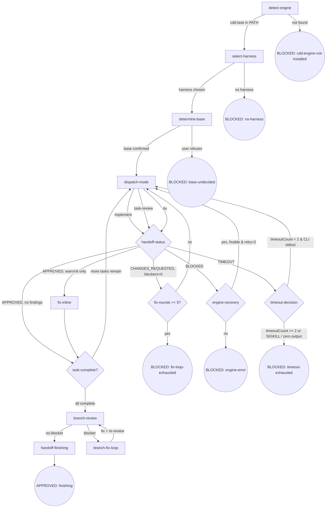

# CLI-Driven Development (cdd)

Execute planned tasks with the selected harness CLI via a three-mode chain. This skill is both orchestrator and engine: it executes AND makes orchestrator decisions (mode chain, Final Review).

## Flow Digraph

## Node Definitions

### `detect-engine`

- **Do**: Verify `cdd-task` is in PATH (`command -v cdd-task`).
  - Found → proceed
  - Not found → BLOCKED: `@oscaner-skills/cdd-engine` not installed.
    Run: `npm i -g @oscaner-skills/cdd-engine`, then retry.
- **Read**: PATH environment variable
- **Exit**: Found → next node; not found → BLOCKED (soft exit with install guidance)
- **Fail**: Fail-open if PATH check errors; proceed with warning

### `select-harness`

- **Do**: Invoke the [ask](../cli-select/SKILL.md#ask) node of [cli-select](../cli-select/SKILL.md) (cross-skill call) to obtain the user's selected harness name; pass `--harness <name>` as an **explicit CLI argument** to all downstream `cdd-task.mjs` / `docs-task.mjs` calls (no implicit env var propagation — extends P7 I1).
- **Read**: harness name returned by cli-select's `ask` node.
- **Exit**: harness selected → `determine-base`; cli-select BLOCKED → BLOCKED: no-harness.
- **Fail**: cli-select returns BLOCKED (engine bug / user cancellation) → this node same BLOCKED.

### `determine-base`

- **Do**: Follow the [base-branch.md](./docs/base-branch.md) methodology, trying sources in order: ① plan document `base` field ② branch upstream (`git rev-parse --abbrev-ref @{u}`) ③ conversation context (explicit base mention in prior messages) ④ fallback: ask user. Once determined, write to `.superpowers/cdd/<slug>/base-branch.json` (schema: `{base, source: "plan-field"|"branch-upstream"|"conversation-context"|"user-confirmed", confirmed_at}`; slug = CDD workspace slug; source has four values matching the four inference sources). **Scope resolution**: CDD scenario scope = `cdd`, slug = CDD workspace slug.
- **Read**: plan document + `git rev-parse --abbrev-ref @{u}` + conversation context + `.superpowers/cdd/<slug>/base-branch.json` (optional — skip inference if already exists).
- **Exit**: base confirmed (artifact written or already exists) → `dispatch-mode` (first task's implement).
- **Fail**: user refuses to confirm → BLOCKED: base-undecided.

### `dispatch-mode`

- **Do**: Before dispatching cdd-task.mjs:
  1. Generate brief: `node bin/engine/lib/brief.mjs --task N --plan <path> --output <workspace>/task-N-brief.md`
  2. Record dispatch-time HEAD: `git rev-parse HEAD` → write to `progress.json.lastDispatchHead`
  3. For task-review mode: generate review diff via review-package script
  4. **Three-mode chain enforcement**: For fix mode — verify task-review handoff exists for this task AND status = APPROVED; refuse dispatch otherwise (report to user)
  5. Dispatch: `node {pluginRoot}/bin/engine/cdd-task.mjs --harness <name> --task N --mode <mode>`. **Background execution** (program-level enforcement): must run CLI in background mode (harness `run_in_background` when supported; timeout + poll otherwise). After return, **must read handoff.json to determine status** (orchestrator handoff check obligation): parse `status` field (APPROVED / CHANGES_REQUESTED / BLOCKED / TIMEOUT); **never judge changes by stdout emptiness**. **Timeout handling**: if `invokeCli` returns `timedOut: true`, read `progress.json` `timeoutCount` and route to `timeout-decision` (decision node in digraph). Brief generation uses `--task N` index (CDD-level unique index).
- **Read**: `CDD_HANDOFF_PATH` (`task-N-handoff.json`) + open-findings (fix mode) + brief-dependent plan sections + `progress.json` (timeoutCount, on timeout).
- **Exit**: construct CLI command and spawn → enter `handoff-status` (decision node, routes by handoff status). On timeout → enter `timeout-decision`.
- **Fail**: nested CLI failure with missing handoff → runner.mjs has written BLOCKED handoff (stderr in blocker field); this node reads and routes to BLOCKED: engine-error. Three-mode chain enforcement violation (fix dispatch without prior task-review APPROVED) → report to user, refuse dispatch.

### `handoff-status` (decision node)

- **Do**: Read `handoff.json` `status` field + scan `findings[]` for blocker-severity items.
  Before routing, perform commit-contract validation:
  1. `node bin/engine/lib/contract.mjs --check-dirty` — dirty tree → route to BLOCKED: engine-error
  2. `node bin/engine/lib/contract.mjs --check-head --handoff <path> --progress <path>` — head mismatch → route to BLOCKED: engine-error
  Then route by status × findings severity (Review Stopping alignment):
  - `APPROVED` + blockers = 0 → `task-complete?` (done)
  - `APPROVED` + warn/nit findings only → fix warn/nit inline → `task-complete?`
    (no re-run of task-review — Review Stopping: blocker=0 → fix → done)
  - `CHANGES_REQUESTED` (blockers > 0) → `dispatch-mode` (fix mode; dispatch-mode internally maintains fix-round counter — ≥ 5 routes to BLOCKED: fix-loop-exhausted) → `task-review` → repeat
  - `BLOCKED` → `engine-recovery` (decision node — reads blocker to determine fixability; if fixable + retry<2 → re-dispatch dispatch-mode with same mode; if not fixable or retry≥2 → BLOCKED: engine-error; retry counter managed via `progress.json` `engine-recovery-count`, not `handoff.json.retryCount` — see §D deviation note below)
  - `TIMEOUT` → `timeout-decision` (decision node — reads `progress.json` `timeoutCount`; < 2 + CLI stdout present → retry via dispatch-mode; ≥ 2 or SIGKILL / zero output → BLOCKED: timeout-exhausted)
  - `NEEDS_CONTEXT` → **implicit fail-open** (orchestrator manually investigates then redispatches dispatch-mode with the same mode; not a digraph edge).
- **Read**: `handoff.json`.
- **Exit**: Route per status × findings → see Do field above.
- **Fail**: commit-contract validation fails (dirty tree or head mismatch) → BLOCKED: engine-error. `status` field missing or illegal (not one of APPROVED / CHANGES_REQUESTED / BLOCKED; NEEDS_CONTEXT is a known but implicitly handled status handled by the Exit field's fail-open path, not this Fail branch).

### `fix-inline`

- **Do**: Fix the warn/nit findings from the current task-review handoff inline (orchestrator session, no nested CLI dispatch). Per Review Stopping: blocker=0 → fix → done — **no re-run of task-review**.
- **Read**: latest `task-N-task-review-R.json` `findings[]` (warn/nit severity items)
- **Exit**: fixes applied → `task-complete?`
- **Fail**: fixes cannot be completed in-session → **implicit fail-open** (stop + report to user; branch preserved)

### `engine-recovery` (decision node)

- **Do**: Read the blocker field from the current `handoff.json` and determine fixability: ① if the blocker describes a fixable condition (e.g., dirty tree → commit first, missing artifact → regenerate) **and** `progress.json` `engine-recovery-count` < 2 → increment recovery counter in `progress.json` → re-dispatch `dispatch-mode` with the same mode and task; ② if not fixable or `engine-recovery-count` ≥ 2 → terminal `BLOCKED: engine-error`.
- **Read**: `handoff.json` (blocker field) + `progress.json` (engine-recovery-count; increment on each recovery attempt).
- **Exit**: fixable + retry<2 → `dispatch-mode` (same mode, same task); not fixable or retry≥2 → `BLOCKED: engine-error`.
- **Fail**: blocker field empty or unparseable → terminal `BLOCKED: engine-error`.

> **§D deviation note (deliberate spec §2.3 step 4 departure)**: Spec §2.3 prescribes reusing `handoff.json.retryCount` (managed by engine-layer `runner.mjs`). This plan uses `progress.json` `engine-recovery-count` (managed by orchestrator-layer skill) instead. Rationale: P10 scope is limited to "no control-flow changes to engine" (design §1 scope boundary); `runner.mjs` currently has no retry infrastructure, and retry is a skill-digraph `engine-recovery` decision-node concern (orchestrator layer), not an engine loop — the orchestrator preserves the count across re-dispatches without modifying `runner.mjs`.

### `timeout-decision` (decision node)

- **Do**: Read `progress.json` `timeoutCount` to determine timeout retry eligibility: ① if `timeoutCount < 2` **and** CLI produced partial stdout (non-empty output before timeout) → increment `timeoutCount` in `progress.json` → re-dispatch `dispatch-mode` (same task, same mode — retry with partial handoff context); ② if `timeoutCount >= 2` **or** CLI was killed by SIGKILL **or** CLI produced zero output → terminal `BLOCKED: timeout-exhausted`. The `timeoutCount` is persisted in `progress.json` (same pattern as `engine-recovery-count`), not in `handoff.json`.
- **Read**: `progress.json` (timeoutCount) + CLI stdout presence check from the timed-out dispatch.
- **Exit**: timeoutCount < 2 & CLI stdout exists → `dispatch-mode` (retry); timeoutCount >= 2 or SIGKILL / zero output → `BLOCKED: timeout-exhausted`.
- **Fail**: `progress.json` unreadable or timeoutCount unparseable → terminal `BLOCKED: timeout-exhausted`.

### `task-complete?` (decision node)

- **Do**: Check `progress.json` + all task handoffs: task N is complete when
  `rounds["task-review"] >= 1` AND latest task-review handoff `status: APPROVED`.
  **task-review is unskippable**: every task must go through implement → task-review →
  (fix if CHANGES_REQUESTED) chain; skipping task-review is forbidden.
- **Read**: `progress.json` + `task-N-task-review-R.json`
- **Exit**: more tasks remain → `dispatch-mode` (next task's implement);
  all tasks APPROVED → `branch-review`.
- **Fail**: task-review handoff missing or status non-APPROVED → BLOCKED: engine-error.

### `branch-review`

- **Do**: `node {pluginRoot}/bin/engine/docs-task.mjs --harness <name> --mode review --template branch-review --doc <doc-path> --param BASE=<read from base-branch.json#base> --param HEAD=<head> --param PLAN=<plan-path>` (BASE read from artifact, **removes `origin/develop` hardcode**). **Background execution** (program-level enforcement). After return, **read handoff.json to determine status** (same discipline as dispatch-mode). **Persist diff + report to workspace**: write `<workspace>/branch-review.diff` + `<workspace>/branch-review-report.md` (content from docs-task output + findings extraction).
- **Read**: `base-branch.json` (for base name) + branch HEAD + plan path + docs-task output.
- **Exit**: no blockers → `handoff-finishing`; blockers present → `branch-fix-loop`.
- **Fail**: docs-task fails with no handoff → BLOCKED: engine-error.

### `branch-fix-loop`

- **Do**: Based on branch-review blocker findings, orchestrator directly (or dispatches nested CLI) fixes; after fix, **re-run branch-review** (back to `branch-review` node). Branch-level fix loop, no hard cap (but recommended ≤ 3 rounds; beyond that, user decides whether to continue).
- **Read**: branch-review findings (from handoff `findings[]`).
- **Exit**: fix + re-review yields no blockers → `handoff-finishing`.
- **Fail**: blockers persist after multiple rounds → **implicit fail-open** (stop + report to user; branch preserved; user decides manually).

### `handoff-finishing`

- **Do**: Prepare handoff to `osuperpowers:finishing`: ensure `.superpowers/cdd/<slug>/base-branch.json` is written (finishing's `read-base` node consumes the same artifact); summarize branch state (commits count / base); invoke `osuperpowers:finishing` to take over (merge / PR / keep / discard four options).
- **Read**: `base-branch.json` + all handoffs + branch-review final state.
- **Exit**: handoff complete → APPROVED: finishing.
- **Fail**: finishing takeover fails → **implicit fail-open** (branch preserved; user manually finishes).

## Invariants

| # | Invariant |
|---|-----------|
| I1 | **Explicit Propagation** — Selected harness is passed to downstream (`cdd-task.mjs` / `docs-task.mjs`) only as `--harness <name>` explicit CLI argument; no implicit environment variable propagation between skill and engine layers (`CDD_HARNESS` / `HARNESS_NAME` etc. all forbidden) — extends P7 I1. |
| I2 | **CLI Background Execution** — All CLI mode calls (`cdd-task.mjs` / `docs-task.mjs`) must run in background — harness `run_in_background` when supported; timeout + poll otherwise (overall spec v1.9 program-level enforcement). |
| I3 | **No --resume / -c** — All nested CLI calls forbid carrying historical session flags (`--resume` / `-c` etc.); use one-shot print mode. |
| I5 | **Three-Mode Chain Completeness** — Every task must go through the full implement → task-review → (fix if CHANGES_REQUESTED) chain; skipping task-review from implement directly to completion is forbidden. |
| I6 | **No Controller Bypass** — When the engine is available (cdd-task.mjs / docs-task.mjs can run), the orchestrator must not hand-write control-flow bypasses that skip engine processing. All task execution, review, and fix dispatch must go through engine CLI calls; direct orchestrator-side manipulation of handoff state as a substitute for engine processing is forbidden. |
| I8 | **Timeout Retry with Cap** — When `dispatch-mode` returns `TIMEOUT`, `timeout-decision` checks `progress.json` `timeoutCount`. If `timeoutCount < 2` and CLI produced partial stdout (non-empty output before timeout), increment `timeoutCount` and retry via `dispatch-mode`. If `timeoutCount >= 2` or CLI was killed by SIGKILL or produced zero output → terminal `BLOCKED: timeout-exhausted`. `timeoutCount` is persisted in `progress.json` (same pattern as `engine-recovery-count`). |

## Failure Modes

Cross-node failure behavior mapping (complements Node Fail fields):

| failure | behavior | reason | recovery |
|---------|----------|--------|----------|
| `cli-select` BLOCKED | BLOCKED: no-harness | Cannot obtain harness name | Handled by cli-select node's report-issue path |
| determine-base user refuses confirmation | BLOCKED: base-undecided | Wrong base for merge/PR is costly | User re-runs CDD and gets re-prompted |
| `cdd-task` not in PATH | BLOCKED: cdd-engine-not-installed | `@oscaner-skills/cdd-engine` package not installed | Run `npm i -g @oscaner-skills/cdd-engine`, then retry |
| Nested CLI failure + handoff missing | BLOCKED: engine-error | Engine bug signal | Report via `osuperpowers:report-issue` with labels `bug, dogfood, osuperpowers, cdd` |
| handoff `status: BLOCKED` | `engine-recovery` decision → re-dispatch or BLOCKED: engine-error | runner.mjs has captured blocker (dirty tree / CLI failure) | engine-recovery reads blocker: fixable + retry<2 → re-dispatch; otherwise terminal BLOCKED |
| handoff `status: TIMEOUT` | `timeout-decision` → retry or BLOCKED: timeout-exhausted | CLI timed out before completing | timeout-decision reads `timeoutCount`: < 2 + partial stdout → retry (increment count); ≥ 2 or SIGKILL / zero output → terminal BLOCKED: timeout-exhausted |
| timeout exhaustion (timeoutCount ≥ 2) | BLOCKED: timeout-exhausted | Retry cap reached; CLI consistently times out | Review timeout configuration; check workspace resources; increase timeout or fix underlying performance issue |
| Task-level fix-loop ≥ 5 rounds | BLOCKED: fix-loop-exhausted | Prevent task-level infinite loop | User decides: manual fix / re-scope review / abandon |
| handoff JSON corrupt or status field illegal | BLOCKED: engine-error | Contract violation (runner self-validate should have caught) | Report via report-issue |
| branch-fix-loop blockers persist after multiple rounds | **implicit fail-open** | Branch-level blockers may need manual investigation (no hard cap; recommended ≤ 3 rounds; beyond that, user decides) | Stop + report; branch preserved; user manually finishes |
| `osuperpowers:finishing` takeover fails | **implicit fail-open** | finishing's own issue | Branch preserved; user manually finishes |

**Fail-open vs BLOCKED convention**:

- **BLOCKED**: explicit terminal node (digraph rounded circle); requires user intervention to recover.
- **implicit fail-open**: node-level failure (not in digraph); flow stops + reports to user.